# 前端API接口结构

<cite>
**本文档引用的文件**  
- [category-api.js](file://smart-admin-web-javascript/src/api/business/category/category-api.js)
- [consumption-api.js](file://smart-admin-web-javascript/src/api/business/consumption/consumption-api.js)
- [goods-api.js](file://smart-admin-web-javascript/src/api/business/goods/goods-api.js)
- [bank-api.js](file://smart-admin-web-javascript/src/api/business/oa/bank-api.js)
- [enterprise-api.js](file://smart-admin-web-javascript/src/api/business/oa/enterprise-api.js)
- [invoice-api.js](file://smart-admin-web-javascript/src/api/business/oa/invoice-api.js)
- [notice-api.js](file://smart-admin-web-javascript/src/api/business/oa/notice-api.js)
- [attendance-api.js](file://smart-admin-web-javascript/src/api/business/smart-video/attendance-api.js)
- [decoder-api.js](file://smart-admin-web-javascript/src/api/business/smart-video/decoder-api.js)
- [device-api.js](file://smart-admin-web-javascript/src/api/business/smart-video/device-api.js)
- [monitor-api.js](file://smart-admin-web-javascript/src/api/business/smart-video/monitor-api.js)
- [api-encrypt-api.js](file://smart-admin-web-javascript/src/api/support/api-encrypt-api.js)
- [cache-api.js](file://smart-admin-web-javascript/src/api/support/cache-api.js)
- [change-log-api.js](file://smart-admin-web-javascript/src/api/support/change-log-api.js)
- [code-generator-api.js](file://smart-admin-web-javascript/src/api/support/code-generator-api.js)
- [config-api.js](file://smart-admin-web-javascript/src/api/support/config-api.js)
- [data-masking-api.js](file://smart-admin-web-javascript/src/api/support/data-masking-api.js)
- [data-tracer-api.js](file://smart-admin-web-javascript/src/api/support/data-tracer-api.js)
- [dict-api.js](file://smart-admin-web-javascript/src/api/support/dict-api.js)
- [feedback-api.js](file://smart-admin-web-javascript/src/api/support/feedback-api.js)
- [file-api.js](file://smart-admin-web-javascript/src/api/support/file-api.js)
- [heart-beat-api.js](file://smart-admin-web-javascript/src/api/support/heart-beat-api.js)
- [help-doc-api.js](file://smart-admin-web-javascript/src/api/support/help-doc-api.js)
- [help-doc-catalog-api.js](file://smart-admin-web-javascript/src/api/support/help-doc-catalog-api.js)
- [job-api.js](file://smart-admin-web-javascript/src/api/support/job-api.js)
- [level3-protect-api.js](file://smart-admin-web-javascript/src/api/support/level3-protect-api.js)
- [login-fail-api.js](file://smart-admin-web-javascript/src/api/support/login-fail-api.js)
- [login-log-api.js](file://smart-admin-web-javascript/src/api/support/login-log-api.js)
- [message-api.js](file://smart-admin-web-javascript/src/api/support/message-api.js)
- [operate-log-api.js](file://smart-admin-web-javascript/src/api/support/operate-log-api.js)
- [reload-api.js](file://smart-admin-web-javascript/src/api/support/reload-api.js)
- [serial-number-api.js](file://smart-admin-web-javascript/src/api/support/serial-number-api.js)
- [table-column-api.js](file://smart-admin-web-javascript/src/api/support/table-column-api.js)
- [area-api.js](file://smart-admin-web-javascript/src/api/system/area-api.js)
- [department-api.js](file://smart-admin-web-javascript/src/api/system/department-api.js)
- [employee-api.js](file://smart-admin-web-javascript/src/api/system/employee-api.js)
- [home-api.js](file://smart-admin-web-javascript/src/api/system/home-api.js)
- [login-api.js](file://smart-admin-web-javascript/src/api/system/login-api.js)
- [menu-api.js](file://smart-admin-web-javascript/src/api/system/menu-api.js)
- [position-api.js](file://smart-admin-web-javascript/src/api/system/position-api.js)
- [role-api.js](file://smart-admin-web-javascript/src/api/system/role-api.js)
- [role-menu-api.js](file://smart-admin-web-javascript/src/api/system/role-menu-api.js)
- [axios.js](file://smart-admin-web-javascript/src/lib/axios.js)
- [encrypt.js](file://smart-admin-web-javascript/src/lib/encrypt.js)
- [smart-sentry.js](file://smart-admin-web-javascript/src/lib/smart-sentry.js)
- [app-config.js](file://smart-admin-web-javascript/src/config/app-config.js)
- [common-const.js](file://smart-admin-web-javascript/src/constants/common-const.js)
- [layout-const.js](file://smart-admin-web-javascript/src/constants/layout-const.js)
- [regular-const.js](file://smart-admin-web-javascript/src/constants/regular-const.js)
- [local-storage-key-const.js](file://smart-admin-web-javascript/src/constants/local-storage-key-const.js)
</cite>

## 目录

1. [项目结构](#项目结构)
2. [业务模块API](#业务模块api)
3. [支持功能模块API](#支持功能模块api)
4. [系统模块API](#系统模块api)
5. [Axios封装配置](#axios封装配置)
6. [API调用示例](#api调用示例)
7. [接口参数与返回值处理](#接口参数与返回值处理)
8. [接口版本管理与错误处理](#接口版本管理与错误处理)

## 项目结构

前端API接口主要组织在`src/api`目录下，按照功能模块划分为三个主要部分：business（业务模块）、support（支持功能模块）和system（系统模块）。每个模块下包含多个具体的API文件，采用统一的命名规范。

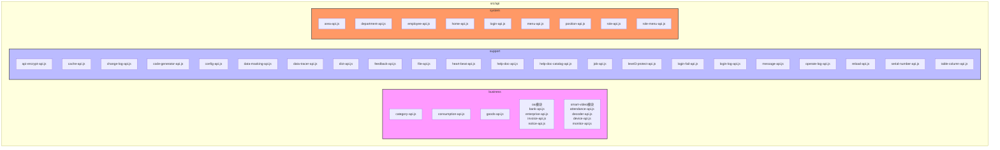

**Diagram sources**
- [category-api.js](file://smart-admin-web-javascript/src/api/business/category/category-api.js)
- [consumption-api.js](file://smart-admin-web-javascript/src/api/business/consumption/consumption-api.js)
- [goods-api.js](file://smart-admin-web-javascript/src/api/business/goods/goods-api.js)
- [bank-api.js](file://smart-admin-web-javascript/src/api/business/oa/bank-api.js)
- [enterprise-api.js](file://smart-admin-web-javascript/src/api/business/oa/enterprise-api.js)
- [invoice-api.js](file://smart-admin-web-javascript/src/api/business/oa/invoice-api.js)
- [notice-api.js](file://smart-admin-web-javascript/src/api/business/oa/notice-api.js)
- [attendance-api.js](file://smart-admin-web-javascript/src/api/business/smart-video/attendance-api.js)
- [decoder-api.js](file://smart-admin-web-javascript/src/api/business/smart-video/decoder-api.js)
- [device-api.js](file://smart-admin-web-javascript/src/api/business/smart-video/device-api.js)
- [monitor-api.js](file://smart-admin-web-javascript/src/api/business/smart-video/monitor-api.js)
- [api-encrypt-api.js](file://smart-admin-web-javascript/src/api/support/api-encrypt-api.js)
- [cache-api.js](file://smart-admin-web-javascript/src/api/support/cache-api.js)
- [change-log-api.js](file://smart-admin-web-javascript/src/api/support/change-log-api.js)
- [code-generator-api.js](file://smart-admin-web-javascript/src/api/support/code-generator-api.js)
- [config-api.js](file://smart-admin-web-javascript/src/api/support/config-api.js)
- [data-masking-api.js](file://smart-admin-web-javascript/src/api/support/data-masking-api.js)
- [data-tracer-api.js](file://smart-admin-web-javascript/src/api/support/data-tracer-api.js)
- [dict-api.js](file://smart-admin-web-javascript/src/api/support/dict-api.js)
- [feedback-api.js](file://smart-admin-web-javascript/src/api/support/feedback-api.js)
- [file-api.js](file://smart-admin-web-javascript/src/api/support/file-api.js)
- [heart-beat-api.js](file://smart-admin-web-javascript/src/api/support/heart-beat-api.js)
- [help-doc-api.js](file://smart-admin-web-javascript/src/api/support/help-doc-api.js)
- [help-doc-catalog-api.js](file://smart-admin-web-javascript/src/api/support/help-doc-catalog-api.js)
- [job-api.js](file://smart-admin-web-javascript/src/api/support/job-api.js)
- [level3-protect-api.js](file://smart-admin-web-javascript/src/api/support/level3-protect-api.js)
- [login-fail-api.js](file://smart-admin-web-javascript/src/api/support/login-fail-api.js)
- [login-log-api.js](file://smart-admin-web-javascript/src/api/support/login-log-api.js)
- [message-api.js](file://smart-admin-web-javascript/src/api/support/message-api.js)
- [operate-log-api.js](file://smart-admin-web-javascript/src/api/support/operate-log-api.js)
- [reload-api.js](file://smart-admin-web-javascript/src/api/support/reload-api.js)
- [serial-number-api.js](file://smart-admin-web-javascript/src/api/support/serial-number-api.js)
- [table-column-api.js](file://smart-admin-web-javascript/src/api/support/table-column-api.js)
- [area-api.js](file://smart-admin-web-javascript/src/api/system/area-api.js)
- [department-api.js](file://smart-admin-web-javascript/src/api/system/department-api.js)
- [employee-api.js](file://smart-admin-web-javascript/src/api/system/employee-api.js)
- [home-api.js](file://smart-admin-web-javascript/src/api/system/home-api.js)
- [login-api.js](file://smart-admin-web-javascript/src/api/system/login-api.js)
- [menu-api.js](file://smart-admin-web-javascript/src/api/system/menu-api.js)
- [position-api.js](file://smart-admin-web-javascript/src/api/system/position-api.js)
- [role-api.js](file://smart-admin-web-javascript/src/api/system/role-api.js)
- [role-menu-api.js](file://smart-admin-web-javascript/src/api/system/role-menu-api.js)

**Section sources**
- [category-api.js](file://smart-admin-web-javascript/src/api/business/category/category-api.js)
- [consumption-api.js](file://smart-admin-web-javascript/src/api/business/consumption/consumption-api.js)
- [goods-api.js](file://smart-admin-web-javascript/src/api/business/goods/goods-api.js)
- [bank-api.js](file://smart-admin-web-javascript/src/api/business/oa/bank-api.js)
- [enterprise-api.js](file://smart-admin-web-javascript/src/api/business/oa/enterprise-api.js)
- [invoice-api.js](file://smart-admin-web-javascript/src/api/business/oa/invoice-api.js)
- [notice-api.js](file://smart-admin-web-javascript/src/api/business/oa/notice-api.js)
- [attendance-api.js](file://smart-admin-web-javascript/src/api/business/smart-video/attendance-api.js)
- [decoder-api.js](file://smart-admin-web-javascript/src/api/business/smart-video/decoder-api.js)
- [device-api.js](file://smart-admin-web-javascript/src/api/business/smart-video/device-api.js)
- [monitor-api.js](file://smart-admin-web-javascript/src/api/business/smart-video/monitor-api.js)
- [api-encrypt-api.js](file://smart-admin-web-javascript/src/api/support/api-encrypt-api.js)
- [cache-api.js](file://smart-admin-web-javascript/src/api/support/cache-api.js)
- [change-log-api.js](file://smart-admin-web-javascript/src/api/support/change-log-api.js)
- [code-generator-api.js](file://smart-admin-web-javascript/src/api/support/code-generator-api.js)
- [config-api.js](file://smart-admin-web-javascript/src/api/support/config-api.js)
- [data-masking-api.js](file://smart-admin-web-javascript/src/api/support/data-masking-api.js)
- [data-tracer-api.js](file://smart-admin-web-javascript/src/api/support/data-tracer-api.js)
- [dict-api.js](file://smart-admin-web-javascript/src/api/support/dict-api.js)
- [feedback-api.js](file://smart-admin-web-javascript/src/api/support/feedback-api.js)
- [file-api.js](file://smart-admin-web-javascript/src/api/support/file-api.js)
- [heart-beat-api.js](file://smart-admin-web-javascript/src/api/support/heart-beat-api.js)
- [help-doc-api.js](file://smart-admin-web-javascript/src/api/support/help-doc-api.js)
- [help-doc-catalog-api.js](file://smart-admin-web-javascript/src/api/support/help-doc-catalog-api.js)
- [job-api.js](file://smart-admin-web-javascript/src/api/support/job-api.js)
- [level3-protect-api.js](file://smart-admin-web-javascript/src/api/support/level3-protect-api.js)
- [login-fail-api.js](file://smart-admin-web-javascript/src/api/support/login-fail-api.js)
- [login-log-api.js](file://smart-admin-web-javascript/src/api/support/login-log-api.js)
- [message-api.js](file://smart-admin-web-javascript/src/api/support/message-api.js)
- [operate-log-api.js](file://smart-admin-web-javascript/src/api/support/operate-log-api.js)
- [reload-api.js](file://smart-admin-web-javascript/src/api/support/reload-api.js)
- [serial-number-api.js](file://smart-admin-web-javascript/src/api/support/serial-number-api.js)
- [table-column-api.js](file://smart-admin-web-javascript/src/api/support/table-column-api.js)
- [area-api.js](file://smart-admin-web-javascript/src/api/system/area-api.js)
- [department-api.js](file://smart-admin-web-javascript/src/api/system/department-api.js)
- [employee-api.js](file://smart-admin-web-javascript/src/api/system/employee-api.js)
- [home-api.js](file://smart-admin-web-javascript/src/api/system/home-api.js)
- [login-api.js](file://smart-admin-web-javascript/src/api/system/login-api.js)
- [menu-api.js](file://smart-admin-web-javascript/src/api/system/menu-api.js)
- [position-api.js](file://smart-admin-web-javascript/src/api/system/position-api.js)
- [role-api.js](file://smart-admin-web-javascript/src/api/system/role-api.js)
- [role-menu-api.js](file://smart-admin-web-javascript/src/api/system/role-menu-api.js)

## 业务模块API

### 分类管理模块

分类管理模块提供对系统中各类别数据的增删改查操作，包括商品分类、消费分类等。该模块遵循RESTful设计原则，使用标准的HTTP方法进行操作。

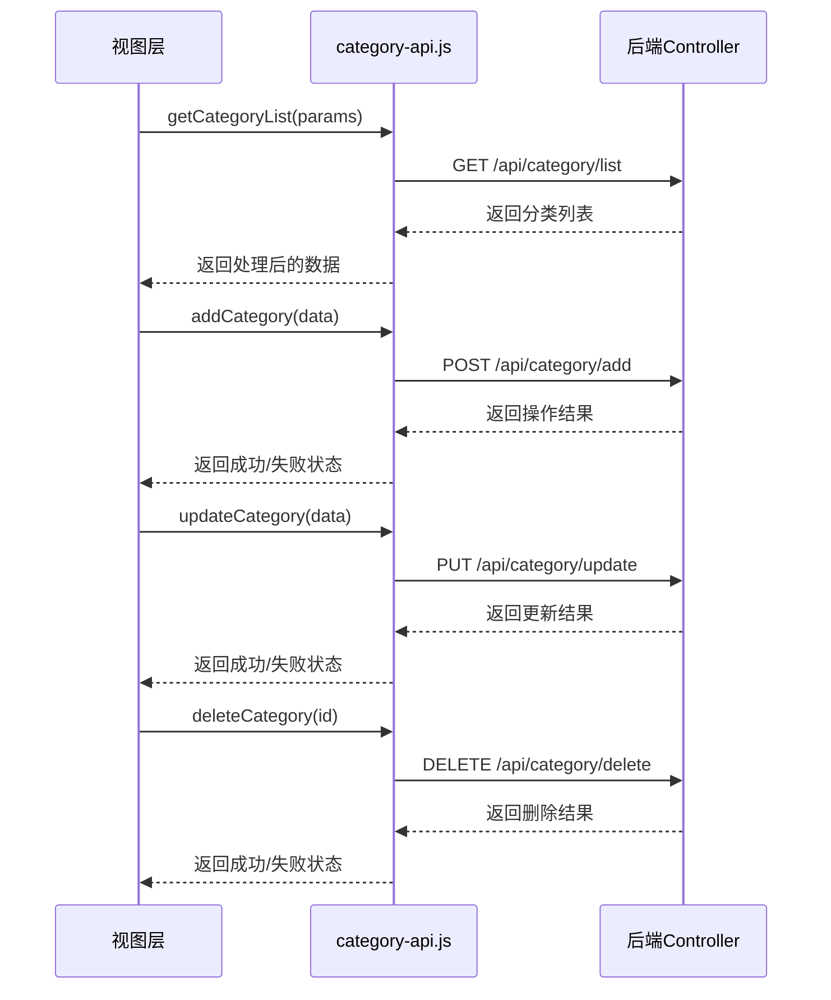

**Diagram sources**
- [category-api.js](file://smart-admin-web-javascript/src/api/business/category/category-api.js)

**Section sources**
- [category-api.js](file://smart-admin-web-javascript/src/api/business/category/category-api.js)

### 消费管理模块

消费管理模块负责处理系统中的消费相关业务，包括消费记录、账户管理、收支明细等功能。该模块的API设计充分考虑了业务场景的复杂性，提供了丰富的查询条件和数据统计功能。

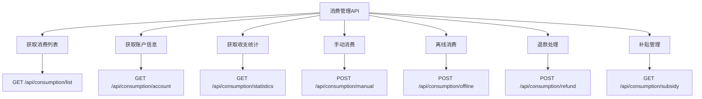

**Diagram sources**
- [consumption-api.js](file://smart-admin-web-javascript/src/api/business/consumption/consumption-api.js)

**Section sources**
- [consumption-api.js](file://smart-admin-web-javascript/src/api/business/consumption/consumption-api.js)

### 商品管理模块

商品管理模块提供对系统中商品信息的完整管理功能，包括商品的增删改查、库存管理、价格设置等。该模块与分类管理模块紧密关联，实现了商品与分类的层级关系。

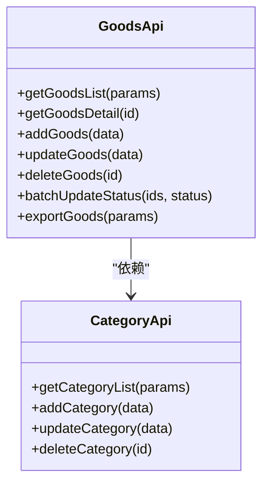

**Diagram sources**
- [goods-api.js](file://smart-admin-web-javascript/src/api/business/goods/goods-api.js)
- [category-api.js](file://smart-admin-web-javascript/src/api/business/category/category-api.js)

**Section sources**
- [goods-api.js](file://smart-admin-web-javascript/src/api/business/goods/goods-api.js)

### OA办公模块

OA办公模块包含多个子模块，如银行管理、企业信息、发票管理和通知公告等，为系统提供基础的办公支持功能。

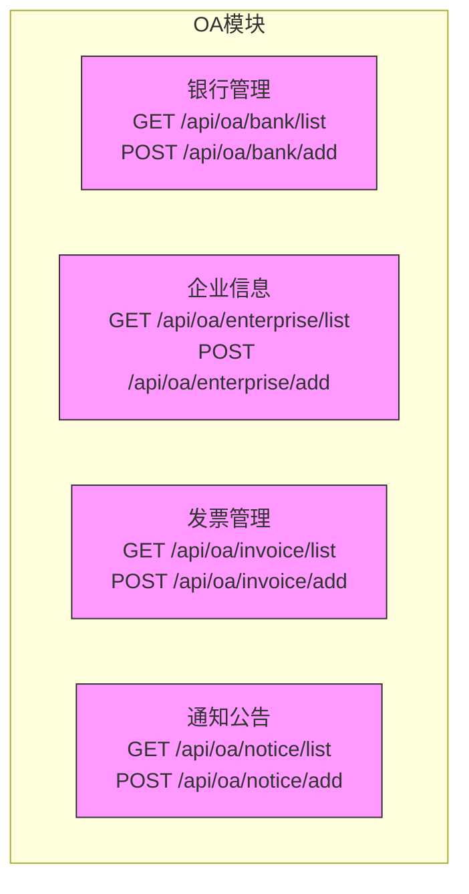

**Diagram sources**
- [bank-api.js](file://smart-admin-web-javascript/src/api/business/oa/bank-api.js)
- [enterprise-api.js](file://smart-admin-web-javascript/src/api/business/oa/enterprise-api.js)
- [invoice-api.js](file://smart-admin-web-javascript/src/api/business/oa/invoice-api.js)
- [notice-api.js](file://smart-admin-web-javascript/src/api/business/oa/notice-api.js)

**Section sources**
- [bank-api.js](file://smart-admin-web-javascript/src/api/business/oa/bank-api.js)
- [enterprise-api.js](file://smart-admin-web-javascript/src/api/business/oa/enterprise-api.js)
- [invoice-api.js](file://smart-admin-web-javascript/src/api/business/oa/invoice-api.js)
- [notice-api.js](file://smart-admin-web-javascript/src/api/business/oa/notice-api.js)

### 智能视频模块

智能视频模块提供对视频监控设备的全面管理功能，包括设备管理、解码器管理、考勤管理和监控画面管理等。

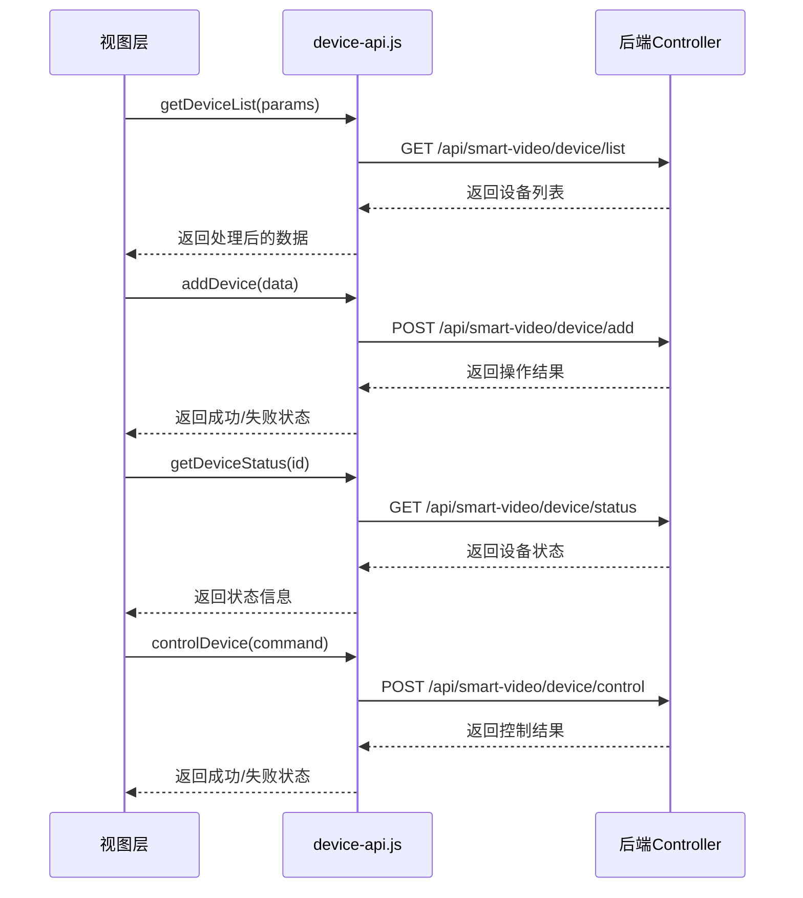

**Diagram sources**
- [device-api.js](file://smart-admin-web-javascript/src/api/business/smart-video/device-api.js)
- [decoder-api.js](file://smart-admin-web-javascript/src/api/business/smart-video/decoder-api.js)
- [attendance-api.js](file://smart-admin-web-javascript/src/api/business/smart-video/attendance-api.js)
- [monitor-api.js](file://smart-admin-web-javascript/src/api/business/smart-video/monitor-api.js)

**Section sources**
- [device-api.js](file://smart-admin-web-javascript/src/api/business/smart-video/device-api.js)
- [decoder-api.js](file://smart-admin-web-javascript/src/api/business/smart-video/decoder-api.js)
- [attendance-api.js](file://smart-admin-web-javascript/src/api/business/smart-video/attendance-api.js)
- [monitor-api.js](file://smart-admin-web-javascript/src/api/business/smart-video/monitor-api.js)

## 支持功能模块API

### API加密模块

API加密模块提供对敏感数据的加密传输功能，确保数据在传输过程中的安全性。该模块实现了前后端统一的加密算法和密钥管理机制。

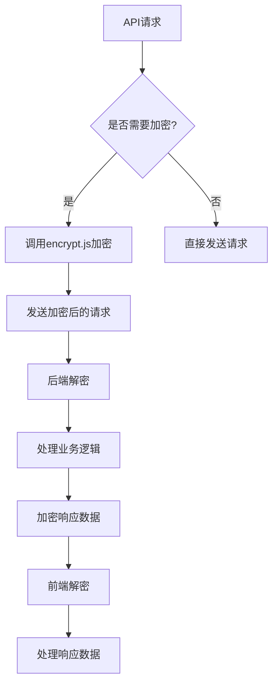

**Diagram sources**
- [api-encrypt-api.js](file://smart-admin-web-javascript/src/api/support/api-encrypt-api.js)
- [encrypt.js](file://smart-admin-web-javascript/src/lib/encrypt.js)

**Section sources**
- [api-encrypt-api.js](file://smart-admin-web-javascript/src/api/support/api-encrypt-api.js)

### 缓存管理模块

缓存管理模块提供对系统缓存的统一管理功能，包括缓存的增删改查、缓存清理、缓存监控等。该模块有助于提高系统性能和响应速度。

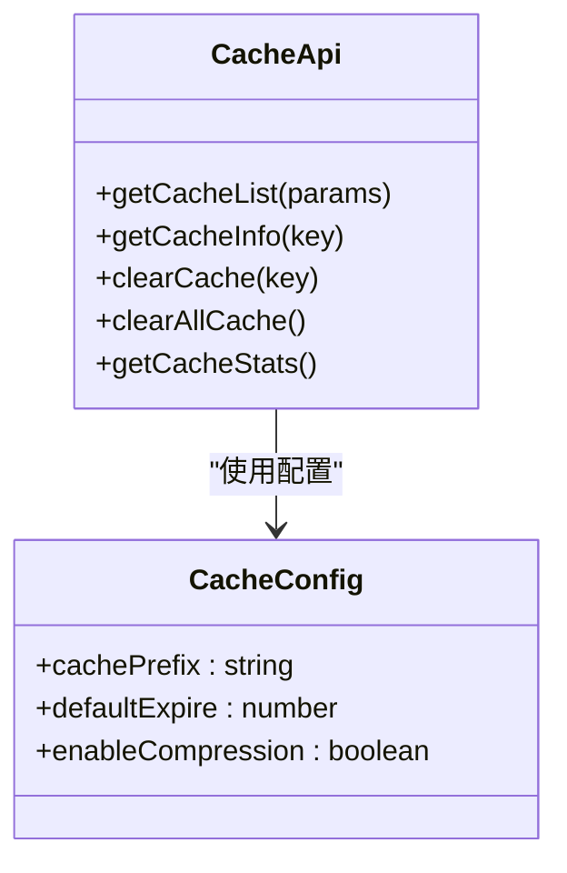

**Diagram sources**
- [cache-api.js](file://smart-admin-web-javascript/src/api/support/cache-api.js)
- [app-config.js](file://smart-admin-web-javascript/src/config/app-config.js)

**Section sources**
- [cache-api.js](file://smart-admin-web-javascript/src/api/support/cache-api.js)

### 变更日志模块

变更日志模块记录系统中重要数据的变更历史，为审计和问题追踪提供支持。该模块实现了完整的日志记录、查询和导出功能。

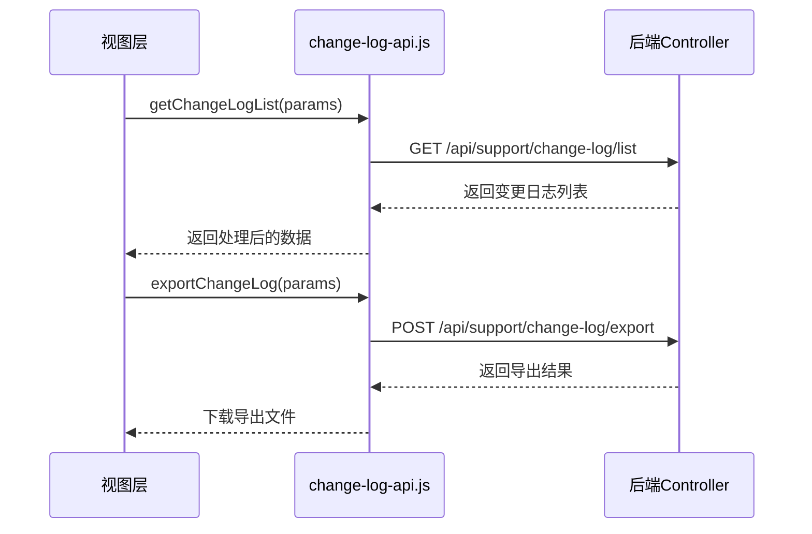

**Diagram sources**
- [change-log-api.js](file://smart-admin-web-javascript/src/api/support/change-log-api.js)

**Section sources**
- [change-log-api.js](file://smart-admin-web-javascript/src/api/support/change-log-api.js)

### 其他支持模块

支持功能模块还包括代码生成器、数据字典、文件管理、消息通知等多个通用服务接口，为系统提供基础支持功能。

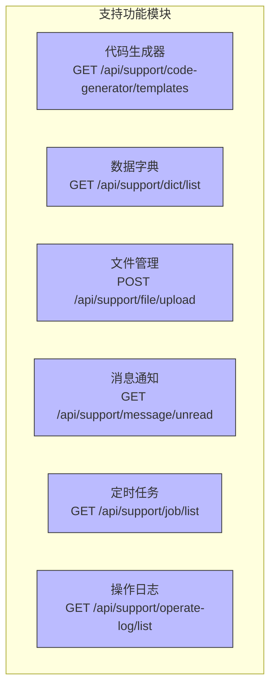

**Diagram sources**
- [code-generator-api.js](file://smart-admin-web-javascript/src/api/support/code-generator-api.js)
- [dict-api.js](file://smart-admin-web-javascript/src/api/support/dict-api.js)
- [file-api.js](file://smart-admin-web-javascript/src/api/support/file-api.js)
- [message-api.js](file://smart-admin-web-javascript/src/api/support/message-api.js)
- [job-api.js](file://smart-admin-web-javascript/src/api/support/job-api.js)
- [operate-log-api.js](file://smart-admin-web-javascript/src/api/support/operate-log-api.js)

**Section sources**
- [code-generator-api.js](file://smart-admin-web-javascript/src/api/support/code-generator-api.js)
- [dict-api.js](file://smart-admin-web-javascript/src/api/support/dict-api.js)
- [file-api.js](file://smart-admin-web-javascript/src/api/support/file-api.js)
- [message-api.js](file://smart-admin-web-javascript/src/api/support/message-api.js)
- [job-api.js](file://smart-admin-web-javascript/src/api/support/job-api.js)
- [operate-log-api.js](file://smart-admin-web-javascript/src/api/support/operate-log-api.js)

## 系统模块API

### 基础信息管理

系统模块提供对系统基础信息的管理功能，包括区域管理、部门管理、员工管理等。这些模块为系统提供组织架构支持。

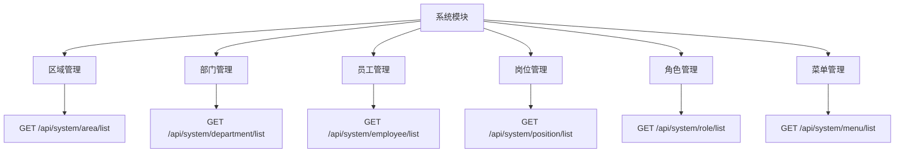

**Diagram sources**
- [area-api.js](file://smart-admin-web-javascript/src/api/system/area-api.js)
- [department-api.js](file://smart-admin-web-javascript/src/api/system/department-api.js)
- [employee-api.js](file://smart-admin-web-javascript/src/api/system/employee-api.js)
- [position-api.js](file://smart-admin-web-javascript/src/api/system/position-api.js)
- [role-api.js](file://smart-admin-web-javascript/src/api/system/role-api.js)
- [menu-api.js](file://smart-admin-web-javascript/src/api/system/menu-api.js)

**Section sources**
- [area-api.js](file://smart-admin-web-javascript/src/api/system/area-api.js)
- [department-api.js](file://smart-admin-web-javascript/src/api/system/department-api.js)
- [employee-api.js](file://smart-admin-web-javascript/src/api/system/employee-api.js)
- [position-api.js](file://smart-admin-web-javascript/src/api/system/position-api.js)
- [role-api.js](file://smart-admin-web-javascript/src/api/system/role-api.js)
- [menu-api.js](file://smart-admin-web-javascript/src/api/system/menu-api.js)

### 认证与授权

系统模块还包括登录认证、权限管理等功能，确保系统的安全性和访问控制。

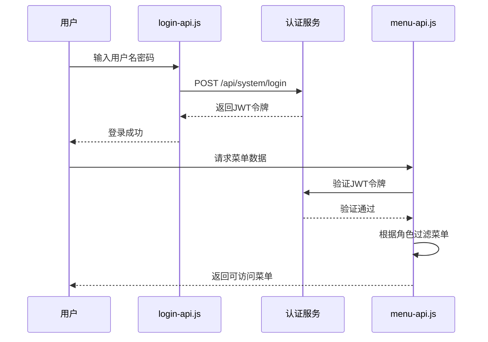

**Diagram sources**
- [login-api.js](file://smart-admin-web-javascript/src/api/system/login-api.js)
- [menu-api.js](file://smart-admin-web-javascript/src/api/system/menu-api.js)

**Section sources**
- [login-api.js](file://smart-admin-web-javascript/src/api/system/login-api.js)
- [menu-api.js](file://smart-admin-web-javascript/src/api/system/menu-api.js)

## Axios封装配置

### 请求拦截器

Axios封装在`src/lib/axios.js`中实现了统一的请求拦截器，处理请求前的通用逻辑，如添加认证令牌、请求加密等。

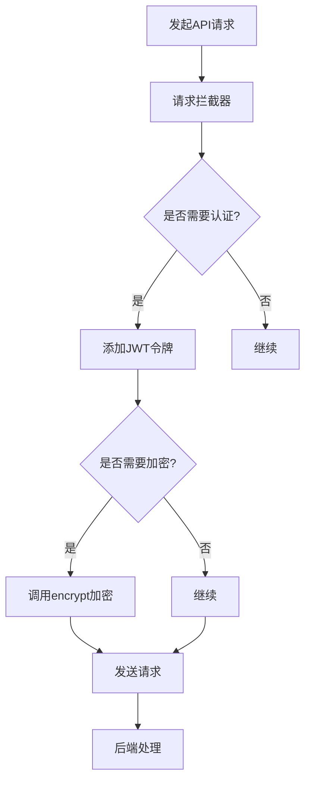

**Diagram sources**
- [axios.js](file://smart-admin-web-javascript/src/lib/axios.js)
- [encrypt.js](file://smart-admin-web-javascript/src/lib/encrypt.js)

**Section sources**
- [axios.js](file://smart-admin-web-javascript/src/lib/axios.js)

### 响应拦截器

响应拦截器处理服务器返回的数据，统一进行错误处理、数据解密和状态码判断。

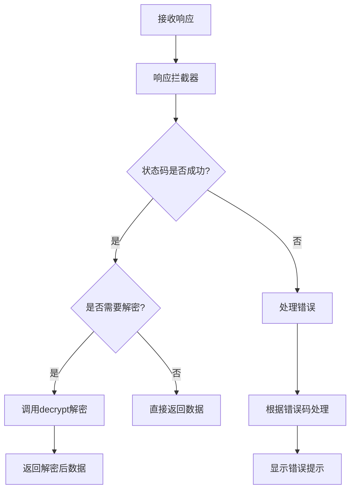

**Diagram sources**
- [axios.js](file://smart-admin-web-javascript/src/lib/axios.js)
- [encrypt.js](file://smart-admin-web-javascript/src/lib/encrypt.js)

**Section sources**
- [axios.js](file://smart-admin-web-javascript/src/lib/axios.js)

### 错误统一处理

错误处理机制集中处理各种网络错误和业务错误，提供一致的用户体验。

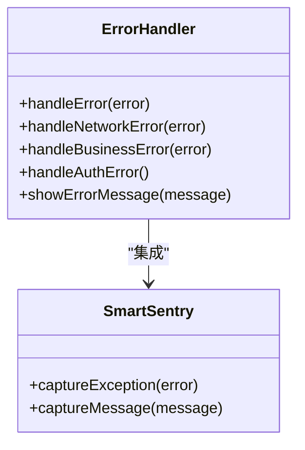

**Diagram sources**
- [axios.js](file://smart-admin-web-javascript/src/lib/axios.js)
- [smart-sentry.js](file://smart-admin-web-javascript/src/lib/smart-sentry.js)

**Section sources**
- [axios.js](file://smart-admin-web-javascript/src/lib/axios.js)
- [smart-sentry.js](file://smart-admin-web-javascript/src/lib/smart-sentry.js)

## API调用示例

### 在视图中调用API

在Vue组件中调用API的标准方式，展示了如何在视图层正确使用API接口。

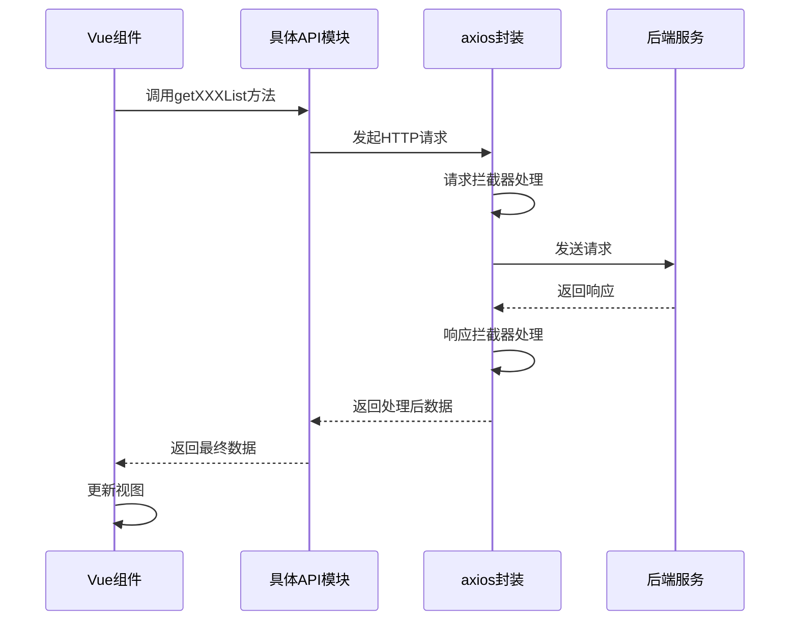

**Diagram sources**
- [category-api.js](file://smart-admin-web-javascript/src/api/business/category/category-api.js)
- [axios.js](file://smart-admin-web-javascript/src/lib/axios.js)

**Section sources**
- [category-api.js](file://smart-admin-web-javascript/src/api/business/category/category-api.js)

### 异步操作处理

处理异步API调用的最佳实践，包括加载状态管理和错误处理。

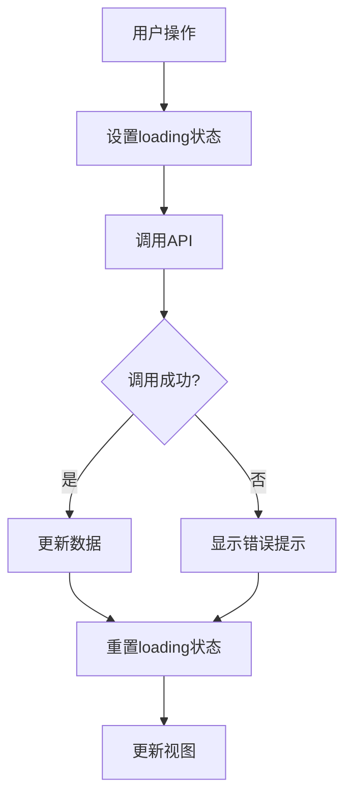

**Diagram sources**
- [axios.js](file://smart-admin-web-javascript/src/lib/axios.js)

**Section sources**
- [axios.js](file://smart-admin-web-javascript/src/lib/axios.js)

## 接口参数与返回值处理

### 参数类型定义

系统采用统一的参数类型定义规范，确保前后端数据交互的一致性。

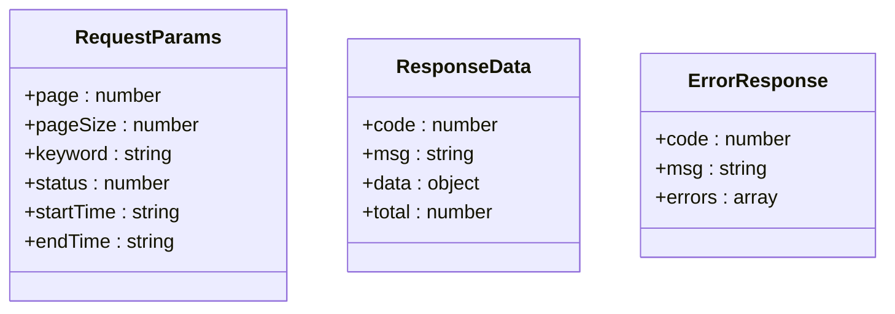

**Diagram sources**
- [common-const.js](file://smart-admin-web-javascript/src/constants/common-const.js)
- [regular-const.js](file://smart-admin-web-javascript/src/constants/regular-const.js)

**Section sources**
- [common-const.js](file://smart-admin-web-javascript/src/constants/common-const.js)
- [regular-const.js](file://smart-admin-web-javascript/src/constants/regular-const.js)

### 请求方法选择

根据RESTful设计原则，合理选择HTTP请求方法：

- **GET**: 用于获取资源，如查询列表、获取详情
- **POST**: 用于创建资源或执行操作，如添加数据、导出文件
- **PUT**: 用于更新资源，如修改数据
- **DELETE**: 用于删除资源，如删除记录

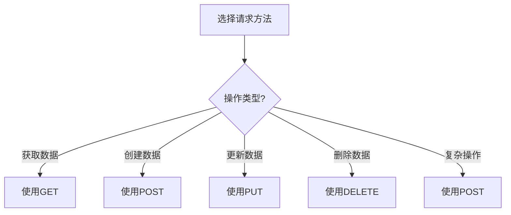

**Diagram sources**
- [category-api.js](file://smart-admin-web-javascript/src/api/business/category/category-api.js)
- [consumption-api.js](file://smart-admin-web-javascript/src/api/business/consumption/consumption-api.js)

**Section sources**
- [category-api.js](file://smart-admin-web-javascript/src/api/business/category/category-api.js)
- [consumption-api.js](file://smart-admin-web-javascript/src/api/business/consumption/consumption-api.js)

## 接口版本管理与错误处理

### 接口版本管理

系统采用URL路径版本控制策略，确保接口的向后兼容性。

```mermaid
graph TB
A[API请求] --> B{版本控制}
B --> C[/api/v1/*]
B --> D[/api/v2/*]
B --> E[/api/latest/*]
C --> F[第一版接口]
D --> G[第二版接口]
E --> H[最新版接口]
style C fill:#f96,stroke:#333
style D fill:#f96,stroke:#333
style E fill:#f96,stroke:#333
```

**Diagram sources**
- [app-config.js](file://smart-admin-web-javascript/src/config/app-config.js)

**Section sources**
- [app-config.js](file://smart-admin-web-javascript/src/config/app-config.js)

### 错误码处理机制

统一的错误码处理机制，为前端提供一致的错误处理体验。

```mermaid
flowchart TD
A[接收错误响应] --> B{错误码范围?}
B --> |200-299| C[成功处理]
B --> |400-499| D[客户端错误]
D --> E[表单验证错误]
D --> F[权限不足]
D --> G[资源不存在]
B --> |500-599| H[服务器错误]
H --> I[显示系统错误]
H --> J[上报错误日志]
E --> K[定位错误字段]
F --> L[提示权限问题]
G --> M[提示资源不存在]
```

**Diagram sources**
- [axios.js](file://smart-admin-web-javascript/src/lib/axios.js)
- [common-const.js](file://smart-admin-web-javascript/src/constants/common-const.js)

**Section sources**
- [axios.js](file://smart-admin-web-javascript/src/lib/axios.js)
- [common-const.js](file://smart-admin-web-javascript/src/constants/common-const.js)

### 超时重试配置

合理的超时和重试机制，提高系统的稳定性和用户体验。

```mermaid
classDiagram
class AxiosConfig {
+timeout : 10000
+maxRedirects : 5
+withCredentials : true
}
class RetryConfig {
+enabled : boolean
+maxAttempts : number
+delay : number
+shouldRetry(error)
}
class NetworkMonitor {
+isOnline()
+onLineChange(callback)
}
RetryConfig --> AxiosConfig : "配置"
NetworkMonitor --> RetryConfig : "影响重试决策"
```

**Diagram sources**
- [axios.js](file://smart-admin-web-javascript/src/lib/axios.js)
- [app-config.js](file://smart-admin-web-javascript/src/config/app-config.js)

**Section sources**
- [axios.js](file://smart-admin-web-javascript/src/lib/axios.js)
- [app-config.js](file://smart-admin-web-javascript/src/config/app-config.js)