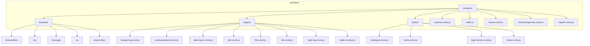

# 前端常量定义结构

<cite>
**本文档引用的文件**  
- [common-const.js](file://smart-admin-web-javascript/src/constants/common-const.js)
- [index.js](file://smart-admin-web-javascript/src/constants/index.js)
- [layout-const.js](file://smart-admin-web-javascript/src/constants/layout-const.js)
- [local-storage-key-const.js](file://smart-admin-web-javascript/src/constants/local-storage-key-const.js)
- [regular-const.js](file://smart-admin-web-javascript/src/constants/regular-const.js)
- [consumption-const.js](file://smart-admin-web-javascript/src/constants/business/consumption/consumption-const.js)
- [category-const.js](file://smart-admin-web-javascript/src/constants/business/erp/category-const.js)
- [goods-const.js](file://smart-admin-web-javascript/src/constants/business/erp/goods-const.js)
- [message-const.js](file://smart-admin-web-javascript/src/constants/business/message/message-const.js)
- [enterprise-const.js](file://smart-admin-web-javascript/src/constants/business/oa/enterprise-const.js)
- [notice-const.js](file://smart-admin-web-javascript/src/constants/business/oa/notice-const.js)
- [device-const.js](file://smart-admin-web-javascript/src/constants/business/smart-video/device-const.js)
- [change-log-const.js](file://smart-admin-web-javascript/src/constants/support/change-log-const.js)
- [code-generator-const.js](file://smart-admin-web-javascript/src/constants/support/code-generator-const.js)
- [data-tracer-const.js](file://smart-admin-web-javascript/src/constants/support/data-tracer-const.js)
- [dict-const.js](file://smart-admin-web-javascript/src/constants/support/dict-const.js)
- [file-const.js](file://smart-admin-web-javascript/src/constants/support/file-const.js)
- [job-const.js](file://smart-admin-web-javascript/src/constants/support/job-const.js)
- [login-log-const.js](file://smart-admin-web-javascript/src/constants/support/login-log-const.js)
- [table-id-const.js](file://smart-admin-web-javascript/src/constants/support/table-id-const.js)
- [employee-const.js](file://smart-admin-web-javascript/src/constants/system/employee-const.js)
- [home-const.js](file://smart-admin-web-javascript/src/constants/system/home-const.js)
- [login-device-const.js](file://smart-admin-web-javascript/src/constants/system/login-device-const.js)
- [menu-const.js](file://smart-admin-web-javascript/src/constants/system/menu-const.js)
</cite>

## 目录

1. [项目结构](#项目结构)
2. [业务模块常量](#业务模块常量)
3. [支持功能模块常量](#支持功能模块常量)
4. [系统模块常量](#系统模块常量)
5. [全局通用常量](#全局通用常量)
6. [常量统一导出机制](#常量统一导出机制)
7. [常量使用示例](#常量使用示例)
8. [命名规范与维护策略](#命名规范与维护策略)

## 项目结构

前端常量定义主要位于 `smart-admin-web-javascript/src/constants` 目录下，采用模块化组织架构，分为业务模块、支持功能模块和系统模块三大类。整体结构清晰，便于维护和扩展。

**图示来源**
- [consumption-const.js](file://smart-admin-web-javascript/src/constants/business/consumption/consumption-const.js)
- [category-const.js](file://smart-admin-web-javascript/src/constants/business/erp/category-const.js)
- [message-const.js](file://smart-admin-web-javascript/src/constants/business/message/message-const.js)
- [enterprise-const.js](file://smart-admin-web-javascript/src/constants/business/oa/enterprise-const.js)
- [device-const.js](file://smart-admin-web-javascript/src/constants/business/smart-video/device-const.js)
- [change-log-const.js](file://smart-admin-web-javascript/src/constants/support/change-log-const.js)
- [code-generator-const.js](file://smart-admin-web-javascript/src/constants/support/code-generator-const.js)
- [data-tracer-const.js](file://smart-admin-web-javascript/src/constants/support/data-tracer-const.js)
- [dict-const.js](file://smart-admin-web-javascript/src/constants/support/dict-const.js)
- [file-const.js](file://smart-admin-web-javascript/src/constants/support/file-const.js)
- [job-const.js](file://smart-admin-web-javascript/src/constants/support/job-const.js)
- [login-log-const.js](file://smart-admin-web-javascript/src/constants/support/login-log-const.js)
- [table-id-const.js](file://smart-admin-web-javascript/src/constants/support/table-id-const.js)
- [employee-const.js](file://smart-admin-web-javascript/src/constants/system/employee-const.js)
- [home-const.js](file://smart-admin-web-javascript/src/constants/system/home-const.js)
- [login-device-const.js](file://smart-admin-web-javascript/src/constants/system/login-device-const.js)
- [menu-const.js](file://smart-admin-web-javascript/src/constants/system/menu-const.js)

**本节来源**
- [smart-admin-web-javascript/src/constants](file://smart-admin-web-javascript/src/constants)

## 业务模块常量

业务模块常量按功能领域组织，每个业务领域有独立的常量文件，确保领域内常量的高内聚性。

### 消费管理模块常量

消费管理模块常量定义了消费类型、状态、支付方式等核心业务概念，为消费相关功能提供统一的值定义。

**本节来源**
- [consumption-const.js](file://smart-admin-web-javascript/src/constants/business/consumption/consumption-const.js)

### ERP模块常量

ERP模块包含商品和分类相关的常量定义，如商品状态、分类类型等，支持企业资源规划功能的实现。

**本节来源**
- [category-const.js](file://smart-admin-web-javascript/src/constants/business/erp/category-const.js)
- [goods-const.js](file://smart-admin-web-javascript/src/constants/business/erp/goods-const.js)

### 消息模块常量

消息模块常量定义了消息类型、优先级、状态等属性，为消息系统的实现提供基础支持。

**本节来源**
- [message-const.js](file://smart-admin-web-javascript/src/constants/business/message/message-const.js)

### OA模块常量

OA模块包含企业信息和通知相关的常量，如企业类型、通知状态等，支持办公自动化功能。

**本节来源**
- [enterprise-const.js](file://smart-admin-web-javascript/src/constants/business/oa/enterprise-const.js)
- [notice-const.js](file://smart-admin-web-javascript/src/constants/business/oa/notice-const.js)

### 智能视频模块常量

智能视频模块定义了设备类型、状态等常量，为视频监控和智能分析功能提供支持。

**本节来源**
- [device-const.js](file://smart-admin-web-javascript/src/constants/business/smart-video/device-const.js)

## 支持功能模块常量

支持功能模块提供跨业务的通用功能支持，其常量设计注重通用性和可复用性。

### 变更日志模块常量

变更日志模块常量定义了操作类型、变更级别等，用于记录系统变更历史。

**本节来源**
- [change-log-const.js](file://smart-admin-web-javascript/src/constants/support/change-log-const.js)

### 代码生成器模块常量

代码生成器模块常量包含模板类型、生成选项等，支持代码自动生成功能。

**本节来源**
- [code-generator-const.js](file://smart-admin-web-javascript/src/constants/support/code-generator-const.js)

### 数据追踪模块常量

数据追踪模块常量定义了追踪级别、数据源类型等，用于实现数据变更追踪功能。

**本节来源**
- [data-tracer-const.js](file://smart-admin-web-javascript/src/constants/support/data-tracer-const.js)

### 字典模块常量

字典模块常量提供了字典类型、状态等定义，支持动态字典数据管理。

**本节来源**
- [dict-const.js](file://smart-admin-web-javascript/src/constants/support/dict-const.js)

### 文件模块常量

文件模块常量定义了文件类型、存储位置等，为文件上传下载功能提供支持。

**本节来源**
- [file-const.js](file://smart-admin-web-javascript/src/constants/support/file-const.js)

### 任务模块常量

任务模块常量包含任务状态、执行类型等，支持定时任务和后台作业管理。

**本节来源**
- [job-const.js](file://smart-admin-web-javascript/src/constants/support/job-const.js)

### 登录日志模块常量

登录日志模块常量定义了登录状态、失败原因等，用于安全审计和登录分析。

**本节来源**
- [login-log-const.js](file://smart-admin-web-javascript/src/constants/support/login-log-const.js)

### 表格ID模块常量

表格ID模块常量提供了系统内各表格的唯一标识，用于数据管理和关联。

**本节来源**
- [table-id-const.js](file://smart-admin-web-javascript/src/constants/support/table-id-const.js)

## 系统模块常量

系统模块常量定义了系统级的基础配置和通用概念。

### 员工模块常量

员工模块常量包含员工状态、职位类型等系统级定义。

**本节来源**
- [employee-const.js](file://smart-admin-web-javascript/src/constants/system/employee-const.js)

### 首页模块常量

首页模块常量定义了仪表板组件、布局配置等。

**本节来源**
- [home-const.js](file://smart-admin-web-javascript/src/constants/system/home-const.js)

### 登录设备模块常量

登录设备模块常量提供了设备类型、平台信息等定义。

**本节来源**
- [login-device-const.js](file://smart-admin-web-javascript/src/constants/system/login-device-const.js)

### 菜单模块常量

菜单模块常量定义了菜单类型、权限标识等系统导航相关概念。

**本节来源**
- [menu-const.js](file://smart-admin-web-javascript/src/constants/system/menu-const.js)

## 全局通用常量

全局通用常量文件 `common-const.js` 定义了跨模块使用的通用值。

### 定义规范

全局常量采用模块化导出方式，每个常量组有清晰的命名空间，避免命名冲突。

### 引用方式

通过统一的导入路径引用全局常量，确保在整个项目中的一致性。

**本节来源**
- [common-const.js](file://smart-admin-web-javascript/src/constants/common-const.js)

## 常量统一导出机制

`index.js` 文件实现了常量的统一导出和模块化管理。

### 导出机制

采用命名导出方式，将各模块常量集中导出，简化导入路径。

### 模块化管理

通过分层导出策略，既保持了模块的独立性，又提供了便捷的批量导入能力。

**本节来源**
- [index.js](file://smart-admin-web-javascript/src/constants/index.js)

## 常量使用示例

### 组件中使用

在Vue组件中通过导入常量实现选项列表、状态显示等功能。

### API调用中使用

在API请求参数中使用常量值，确保前后端约定一致。

### 状态管理中使用

在Vuex store中使用常量定义状态枚举值和操作类型。

**本节来源**
- [consumption-const.js](file://smart-admin-web-javascript/src/constants/business/consumption/consumption-const.js)
- [employee-const.js](file://smart-admin-web-javascript/src/constants/system/employee-const.js)
- [common-const.js](file://smart-admin-web-javascript/src/constants/common-const.js)

## 命名规范与维护策略

### 命名规范

采用大写字母和下划线的命名约定，如 `STATUS_ACTIVE`，确保可读性和一致性。

### 类型定义

常量值有明确的类型定义，包括字符串、数字和布尔值等基本类型。

### 维护策略

建立常量变更的评审流程，确保变更的可控性和向后兼容性。

**本节来源**
- [common-const.js](file://smart-admin-web-javascript/src/constants/common-const.js)
- [index.js](file://smart-admin-web-javascript/src/constants/index.js)
- [layout-const.js](file://smart-admin-web-javascript/src/constants/layout-const.js)
- [local-storage-key-const.js](file://smart-admin-web-javascript/src/constants/local-storage-key-const.js)
- [regular-const.js](file://smart-admin-web-javascript/src/constants/regular-const.js)