# 前端源码结构

<cite>
**本文档引用的文件**
- [main.js](file://smart-admin-web-javascript/src/main.js)
- [App.vue](file://smart-admin-web-javascript/src/App.vue)
- [router/index.js](file://smart-admin-web-javascript/src/router/index.js)
- [store/index.js](file://smart-admin-web-javascript/src/store/index.js)
- [layout/index.vue](file://smart-admin-web-javascript/src/layout/index.vue)
- [constants/index.js](file://smart-admin-web-javascript/src/constants/index.js)
- [directives/privilege.js](file://smart-admin-web-javascript/src/directives/privilege.js)
- [i18n/index.js](file://smart-admin-web-javascript/src/i18n/index.js)
- [lib/axios.js](file://smart-admin-web-javascript/src/lib/axios.js)
- [plugins/privilege-plugin.js](file://smart-admin-web-javascript/src/plugins/privilege-plugin.js)
- [api/business/consumption/consumption-api.js](file://smart-admin-web-javascript/src/api/business/consumption/consumption-api.js)
- [components/business/category-tree-select/index.vue](file://smart-admin-web-javascript/src/components/business/category-tree-select/index.vue)
- [router/business/consumption.js](file://smart-admin-web-javascript/src/router/business/consumption.js)
- [store/modules/business/device.js](file://smart-admin-web-javascript/src/store/modules/business/device.js)
- [views/business/consumption/dashboard/index.vue](file://smart-admin-web-javascript/src/views/business/consumption/dashboard/index.vue)
- [theme/color.js](file://smart-admin-web-javascript/src/theme/color.js)
- [config/app-config.js](file://smart-admin-web-javascript/src/config/app-config.js)
</cite>

## 目录
1. [项目结构](#项目结构)
2. [API接口管理](#api接口管理)
3. [组件库设计](#组件库设计)
4. [常量定义组织](#常量定义组织)
5. [权限控制机制](#权限控制机制)
6. [国际化配置](#国际化配置)
7. [布局系统](#布局系统)
8. [基础工具库](#基础工具库)
9. [插件系统](#插件系统)
10. [路由配置](#路由配置)
11. [状态管理](#状态管理)
12. [主题定制](#主题定制)
13. [视图页面组织](#视图页面组织)

## 项目结构

前端项目采用模块化架构设计，src目录下包含api、components、constants、directives、i18n、layout、lib、plugins、router、store、theme、views等核心模块，形成清晰的代码组织结构。

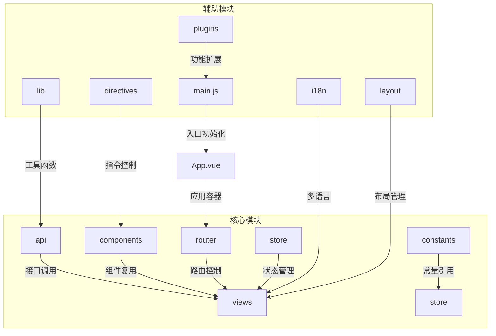

**图示来源**
- [main.js](file://smart-admin-web-javascript/src/main.js#L1-L107)
- [App.vue](file://smart-admin-web-javascript/src/App.vue#L1-L128)

**本节来源**
- [main.js](file://smart-admin-web-javascript/src/main.js#L1-L107)
- [App.vue](file://smart-admin-web-javascript/src/App.vue#L1-L128)

## API接口管理

API目录采用功能区域划分，分为business业务接口、support支持功能接口和system系统接口三大类，每个接口文件对应后端Controller，实现前后端功能模块的映射。

### 业务接口分类

业务接口按功能模块组织，如consumption消费管理、smart-video智能视频等，每个模块有独立的API文件，通过命名规范明确对应关系。

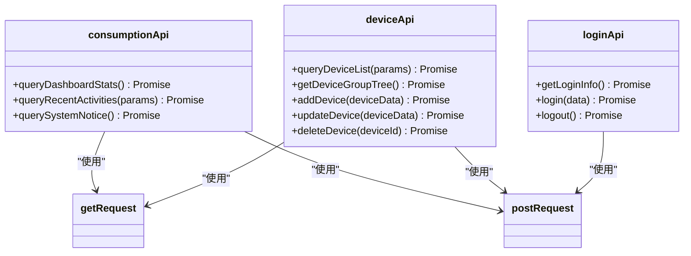

**图示来源**
- [api/business/consumption/consumption-api.js](file://smart-admin-web-javascript/src/api/business/consumption/consumption-api.js#L1-L33)
- [lib/axios.js](file://smart-admin-web-javascript/src/lib/axios.js#L134-L155)

**本节来源**
- [api/business/consumption/consumption-api.js](file://smart-admin-web-javascript/src/api/business/consumption/consumption-api.js#L1-L33)
- [lib/axios.js](file://smart-admin-web-javascript/src/lib/axios.js#L1-L251)

## 组件库设计

组件库采用四层划分逻辑：business业务组件、framework框架通用组件、support支持功能组件和system系统功能组件，确保组件的复用性和职责分离。

### 业务组件

业务组件针对特定业务场景开发，如category-tree-select目录树选择器，封装了业务逻辑和UI展示，提高开发效率。

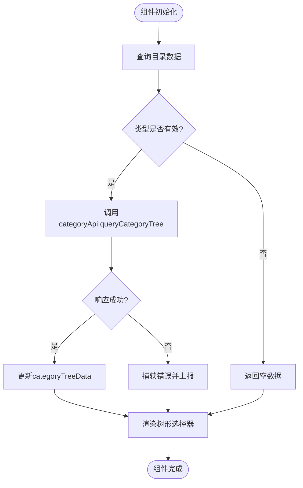

**图示来源**
- [components/business/category-tree-select/index.vue](file://smart-admin-web-javascript/src/components/business/category-tree-select/index.vue#L1-L87)

**本节来源**
- [components/business/category-tree-select/index.vue](file://smart-admin-web-javascript/src/components/business/category-tree-select/index.vue#L1-L87)
- [components/framework/](file://smart-admin-web-javascript/src/components/framework/)
- [components/support/](file://smart-admin-web-javascript/src/components/support/)
- [components/system/](file://smart-admin-web-javascript/src/components/system/)

## 常量定义组织

常量定义采用分类管理策略，包括业务常量、支持功能常量和系统常量，通过index.js统一导出，便于全局引用。

### 常量分类结构

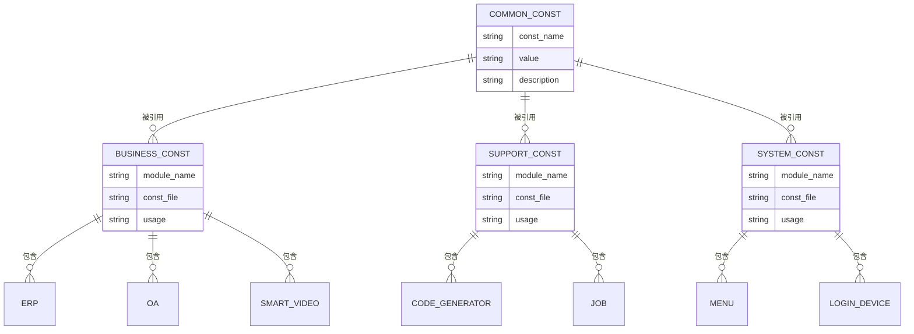

**图示来源**
- [constants/index.js](file://smart-admin-web-javascript/src/constants/index.js#L1-L43)

**本节来源**
- [constants/index.js](file://smart-admin-web-javascript/src/constants/index.js#L1-L43)
- [constants/business/](file://smart-admin-web-javascript/src/constants/business/)
- [constants/support/](file://smart-admin-web-javascript/src/constants/support/)
- [constants/system/](file://smart-admin-web-javascript/src/constants/system/)

## 权限控制机制

权限控制通过privilege.js自定义指令实现，基于用户权限点进行DOM元素的显示/隐藏控制，确保系统安全。

### 权限指令实现

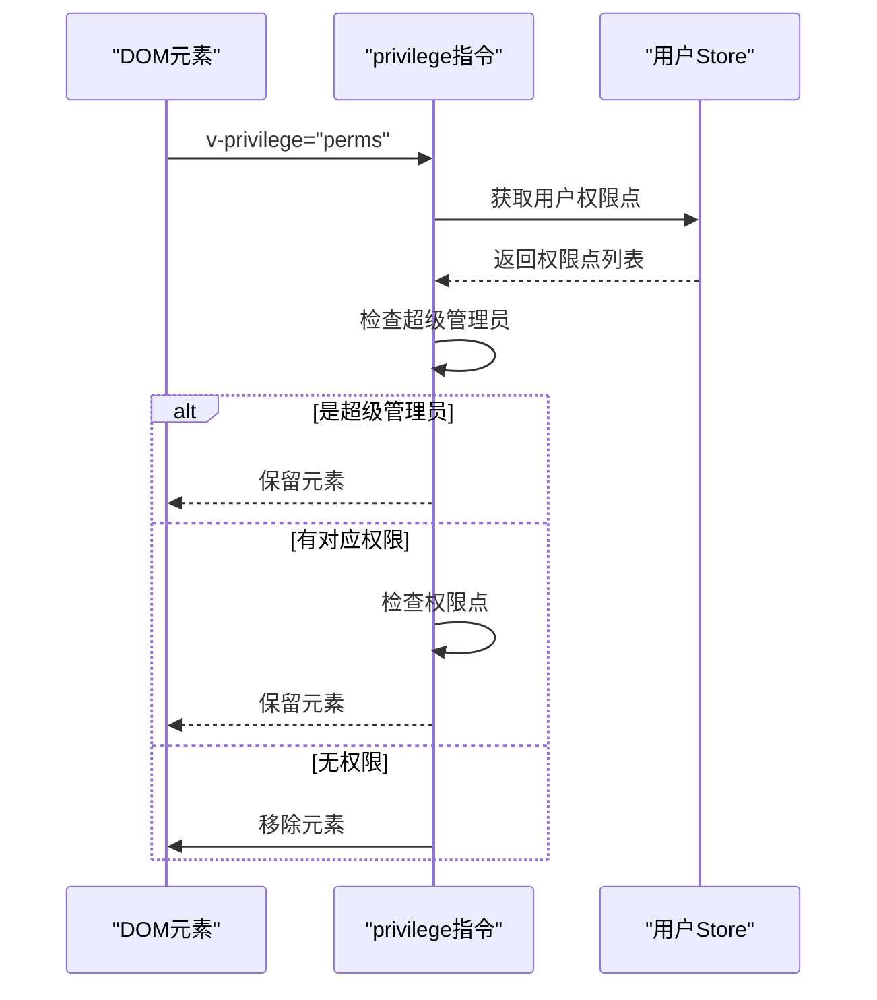

**图示来源**
- [directives/privilege.js](file://smart-admin-web-javascript/src/directives/privilege.js#L1-L30)
- [plugins/privilege-plugin.js](file://smart-admin-web-javascript/src/plugins/privilege-plugin.js#L1-L31)

**本节来源**
- [directives/privilege.js](file://smart-admin-web-javascript/src/directives/privilege.js#L1-L30)
- [plugins/privilege-plugin.js](file://smart-admin-web-javascript/src/plugins/privilege-plugin.js#L1-L31)

## 国际化配置

国际化配置采用vue-i18n实现多语言支持，通过i18n目录管理不同语言包，支持动态语言切换。

### 多语言方案

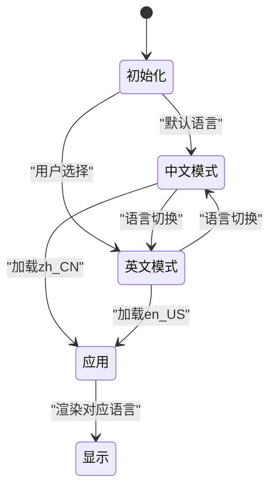

**图示来源**
- [i18n/index.js](file://smart-admin-web-javascript/src/i18n/index.js#L1-L42)

**本节来源**
- [i18n/index.js](file://smart-admin-web-javascript/src/i18n/index.js#L1-L42)
- [i18n/lang/zh-CN/](file://smart-admin-web-javascript/src/i18n/lang/zh-CN/)
- [i18n/lang/en-US/](file://smart-admin-web-javascript/src/i18n/lang/en-US/)

## 布局系统

布局系统提供多种布局模式，包括侧边栏、顶部菜单等，通过layout目录下的不同Vue组件实现灵活的界面布局。

### 布局模式

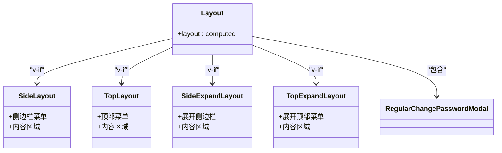

**图示来源**
- [layout/index.vue](file://smart-admin-web-javascript/src/layout/index.vue#L1-L34)

**本节来源**
- [layout/index.vue](file://smart-admin-web-javascript/src/layout/index.vue#L1-L34)
- [layout/side-layout.vue](file://smart-admin-web-javascript/src/layout/side-layout.vue)
- [layout/top-layout.vue](file://smart-admin-web-javascript/src/layout/top-layout.vue)

## 基础工具库

lib目录包含axios封装、加密工具、水印功能等核心工具类，为应用提供基础功能支持。

### 核心工具类

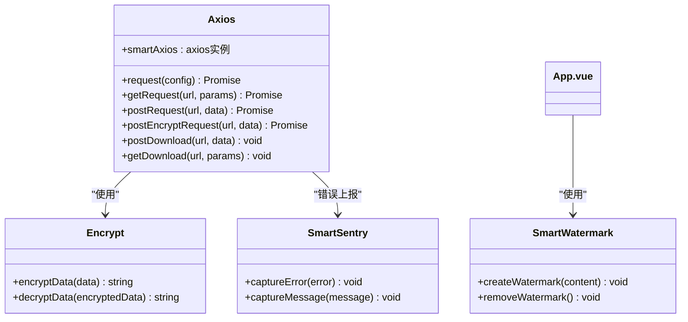

**图示来源**
- [lib/axios.js](file://smart-admin-web-javascript/src/lib/axios.js#L1-L251)

**本节来源**
- [lib/axios.js](file://smart-admin-web-javascript/src/lib/axios.js#L1-L251)
- [lib/encrypt.js](file://smart-admin-web-javascript/src/lib/encrypt.js)
- [lib/smart-watermark.js](file://smart-admin-web-javascript/src/lib/smart-watermark.js)

## 插件系统

插件系统通过plugins目录管理功能扩展，采用Vue插件机制实现权限、字典等功能的全局注入。

### 插件加载机制

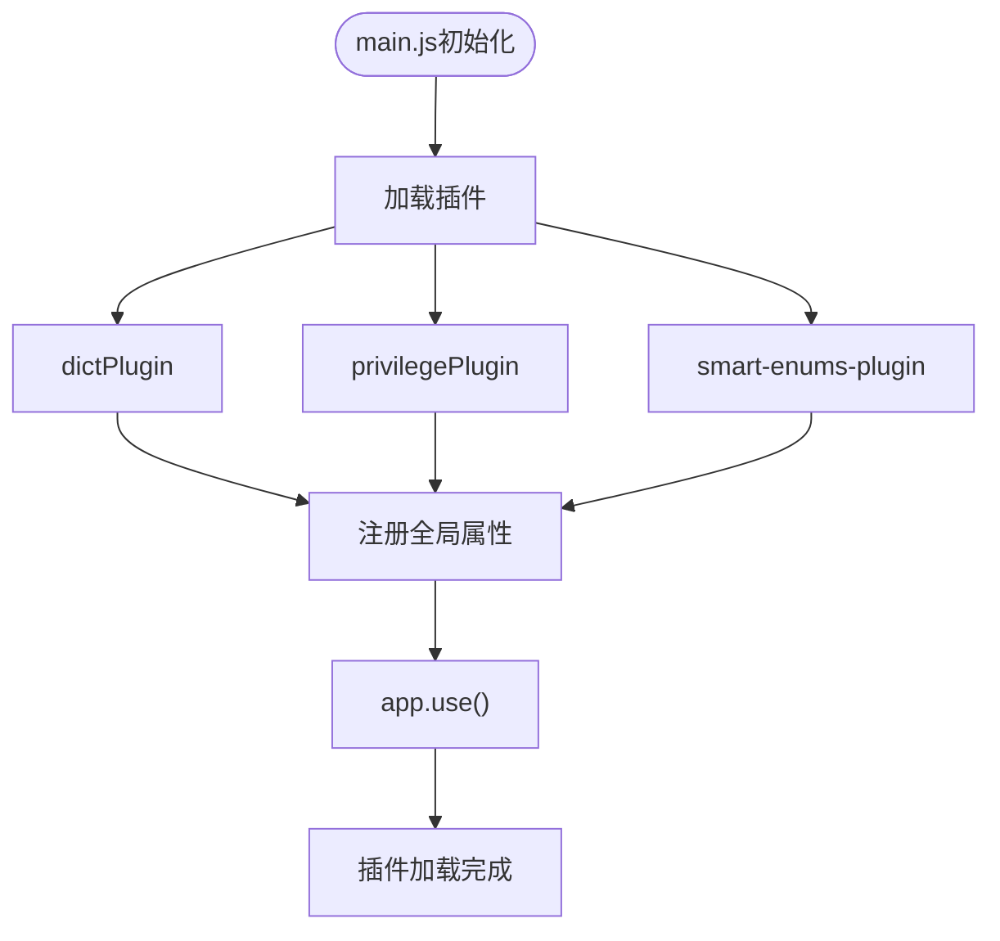

**图示来源**
- [main.js](file://smart-admin-web-javascript/src/main.js#L23-L25)
- [plugins/privilege-plugin.js](file://smart-admin-web-javascript/src/plugins/privilege-plugin.js#L1-L31)

**本节来源**
- [plugins/](file://smart-admin-web-javascript/src/plugins/)
- [main.js](file://smart-admin-web-javascript/src/main.js#L23-L25)

## 路由配置

路由配置采用模块化设计，通过business、support和system三大功能区域的路由分离策略，实现灵活的路由管理。

### 路由模块化

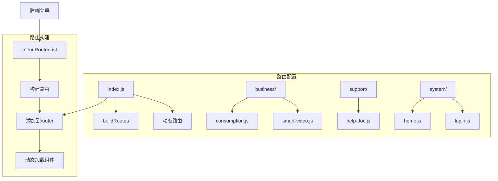

**图示来源**
- [router/index.js](file://smart-admin-web-javascript/src/router/index.js#L1-L166)
- [router/business/consumption.js](file://smart-admin-web-javascript/src/router/business/consumption.js#L1-L62)

**本节来源**
- [router/index.js](file://smart-admin-web-javascript/src/router/index.js#L1-L166)
- [router/business/](file://smart-admin-web-javascript/src/router/business/)
- [router/support/](file://smart-admin-web-javascript/src/router/support/)
- [router/system/](file://smart-admin-web-javascript/src/router/system/)

## 状态管理

状态管理采用Pinia实现模块化结构，通过business和system模块的状态管理，有效组织应用状态。

### 模块化状态

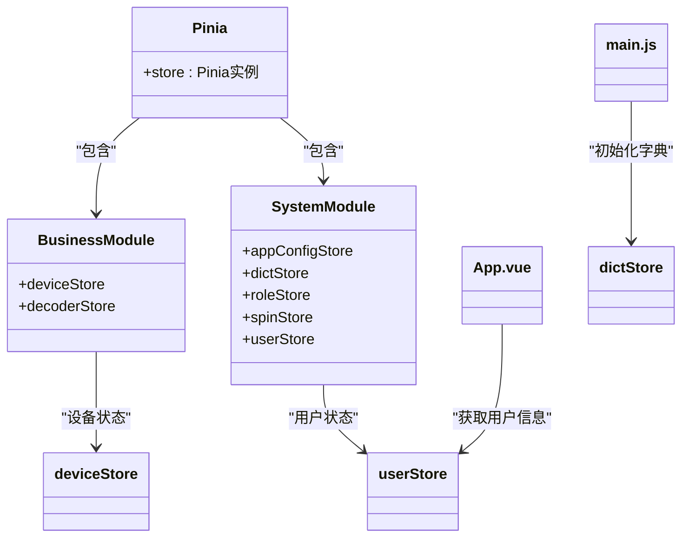

**图示来源**
- [store/index.js](file://smart-admin-web-javascript/src/store/index.js#L1-L13)
- [store/modules/business/device.js](file://smart-admin-web-javascript/src/store/modules/business/device.js#L1-L227)

**本节来源**
- [store/index.js](file://smart-admin-web-javascript/src/store/index.js#L1-L13)
- [store/modules/business/](file://smart-admin-web-javascript/src/store/modules/business/)
- [store/modules/system/](file://smart-admin-web-javascript/src/store/modules/system/)

## 主题定制

主题配置通过theme目录实现定制化方案，支持颜色、圆角等UI元素的动态调整。

### 主题配置

```mermaid
erDiagram
THEME_CONFIG {
string colorIndex
boolean darkModeFlag
boolean compactFlag
number borderRadius
string language
}
COLOR_PALETTE {
string index
string primaryColor
string hoverColor
string activeColor
}
THEME_CONFIG ||--o{ COLOR_PALETTE : "引用"
App.vue --> THEME_CONFIG : "获取配置"
App.vue --> COLOR_PALETTE : "应用颜色"
theme/color.js --> COLOR_PALETTE : "定义"
config/app-config.js --> THEME_CONFIG : "初始化"
```

**图示来源**
- [theme/color.js](file://smart-admin-web-javascript/src/theme/color.js)
- [App.vue](file://smart-admin-web-javascript/src/App.vue#L52-L65)

**本节来源**
- [theme/](file://smart-admin-web-javascript/src/theme/)
- [config/app-config.js](file://smart-admin-web-javascript/src/config/app-config.js)

## 视图页面组织

视图页面采用business、support和system三大功能区域的组织结构，每个功能模块有独立的页面实现和组件引用关系。

### 页面实现结构

```mermaid
flowchart TD
A[views] --> B[business]
A --> C[support]
A --> D[system]
B --> E[consumption]
B --> F[smart-video]
E --> G[dashboard]
E --> H[region]
G --> I[统计卡片]
G --> J[快速操作]
G --> K[系统通知]
G --> L[最近活动]
I --> M[stat-card组件]
J --> N[quick-action-card组件]
consumptionApi --> G : "提供数据"
store --> G : "提供状态"
```

**图示来源**
- [views/business/consumption/dashboard/index.vue](file://smart-admin-web-javascript/src/views/business/consumption/dashboard/index.vue#L1-L492)

**本节来源**
- [views/business/](file://smart-admin-web-javascript/src/views/business/)
- [views/support/](file://smart-admin-web-javascript/src/views/support/)
- [views/system/](file://smart-admin-web-javascript/src/views/system/)