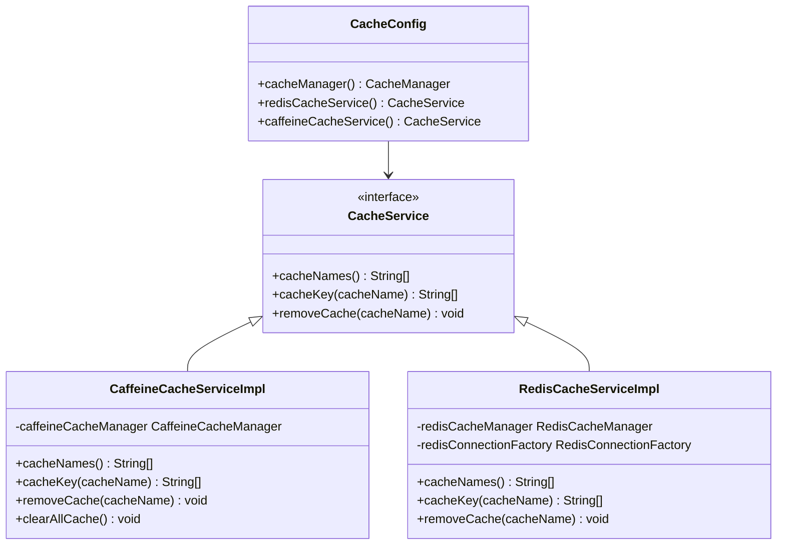
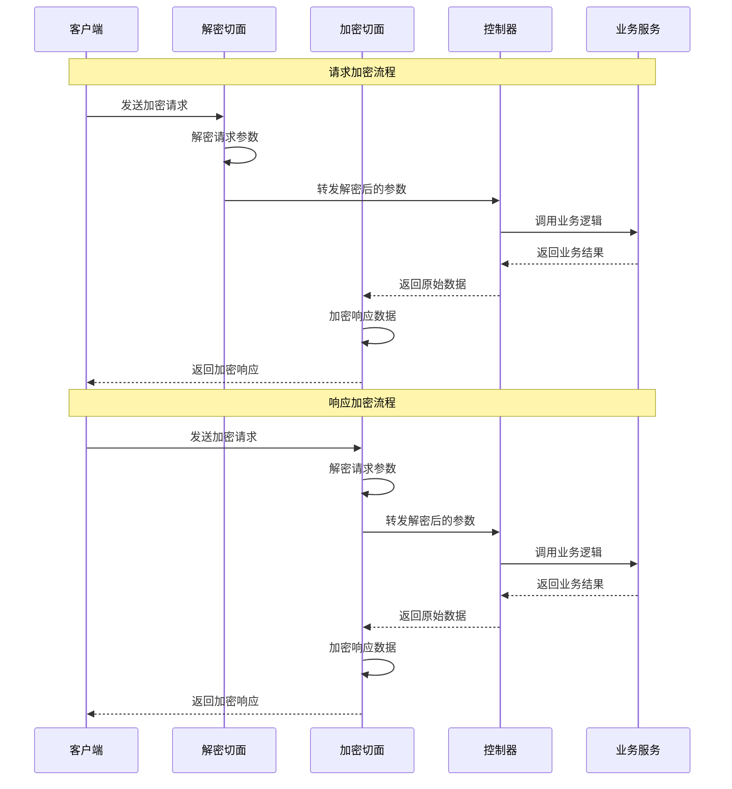
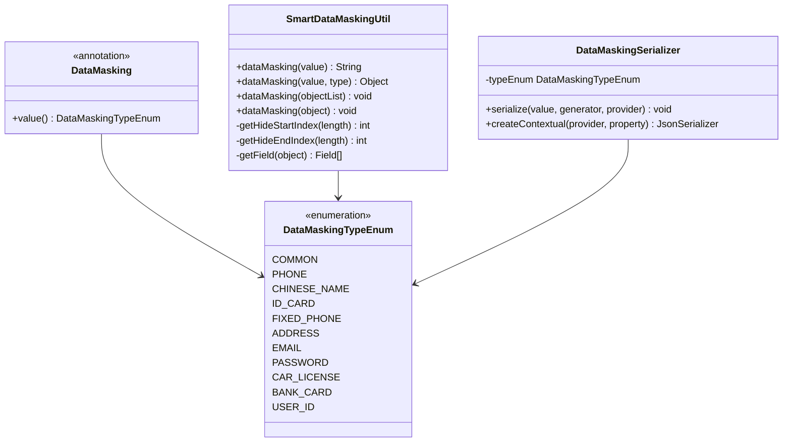
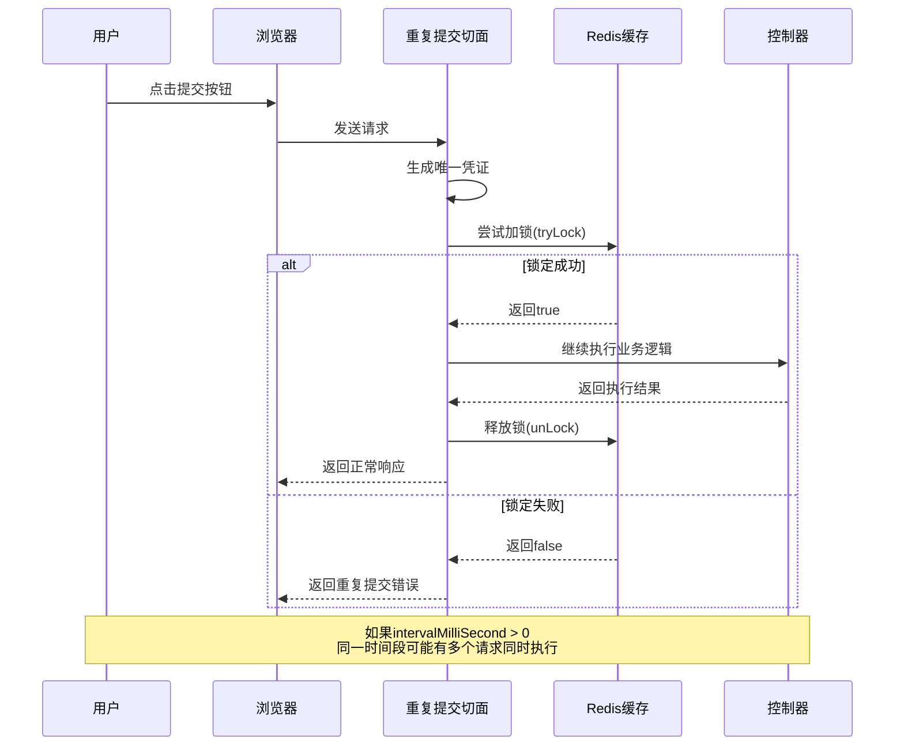

# 支持功能

<cite>
**本文档引用的文件**
- [CacheService.java](file://sa-base/src/main/java/net/lab1024/sa/base/module/support/cache/CacheService.java)
- [CaffeineCacheServiceImpl.java](file://sa-base/src/main/java/net/lab1024/sa/base/module/support/cache/CaffeineCacheServiceImpl.java)
- [RedisCacheServiceImpl.java](file://sa-base/src/main/java/net/lab1024/sa/base/module/support/cache/RedisCacheServiceImpl.java)
- [CacheConfig.java](file://sa-base/src/main/java/net/lab1024/sa/base/config/CacheConfig.java)
- [ApiEncrypt.java](file://sa-base/src/main/java/net/lab1024/sa/base/module/support/apiencrypt/annotation/ApiEncrypt.java)
- [ApiDecrypt.java](file://sa-base/src/main/java/net/lab1024/sa/base/module/support/apiencrypt/annotation/ApiDecrypt.java)
- [ApiEncryptService.java](file://sa-base/src/main/java/net/lab1024/sa/base/module/support/apiencrypt/service/ApiEncryptService.java)
- [DecryptRequestAdvice.java](file://sa-base/src/main/java/net/lab1024/sa/base/module/support/apiencrypt/advice/DecryptRequestAdvice.java)
- [EncryptResponseAdvice.java](file://sa-base/src/main/java/net/lab1024/sa/base/module/support/apiencrypt/advice/EncryptResponseAdvice.java)
- [DataMasking.java](file://sa-base/src/main/java/net/lab1024/sa/base/module/support/datamasking/DataMasking.java)
- [DataMaskingTypeEnum.java](file://sa-base/src/main/java/net/lab1024/sa/base/module/support/datamasking/DataMaskingTypeEnum.java)
- [SmartDataMaskingUtil.java](file://sa-base/src/main/java/net/lab1024/sa/base/module/support/datamasking/SmartDataMaskingUtil.java)
- [OperateLog.java](file://sa-base/src/main/java/net/lab1024/sa/base/module/support/operatelog/annotation/OperateLog.java)
- [OperateLogAspect.java](file://sa-base/src/main/java/net/lab1024/sa/base/module/support/operatelog/core/OperateLogAspect.java)
- [RepeatSubmit.java](file://sa-base/src/main/java/net/lab1024/sa/base/module/support/repeatsubmit/annoation/RepeatSubmit.java)
- [RepeatSubmitAspect.java](file://sa-base/src/main/java/net/lab1024/sa/base/module/support/repeatsubmit/RepeatSubmitAspect.java)
- [RepeatSubmitConfig.java](file://sa-base/src/main/java/net/lab1024/sa/base/config/RepeatSubmitConfig.java)
- [AdminCacheController.java](file://sa-admin/src/main/java/net/lab1024/sa/admin/module/system/support/AdminCacheController.java)
- [AdminDataMaskingDemoController.java](file://sa-admin/src/main/java/net/lab1024/sa/admin/module/system/support/AdminDataMaskingDemoController.java)
</cite>

## 目录
1. [概述](#概述)
2. [缓存管理功能](#缓存管理功能)
3. [接口加解密功能](#接口加解密功能)
4. [数据脱敏功能](#数据脱敏功能)
5. [操作日志功能](#操作日志功能)
6. [防重复提交功能](#防重复提交功能)
7. [配置与使用指南](#配置与使用指南)
8. [最佳实践](#最佳实践)

## 概述

SmartAdmin的module/support包提供了七大核心支持功能，这些功能通过注解驱动的方式为系统提供强大的增强能力：

- **缓存管理**：支持Caffeine和Redis双层缓存架构
- **接口加解密**：透明的请求响应加密保护
- **数据脱敏**：自动化的敏感数据处理
- **操作日志**：完整的用户行为追踪
- **防重复提交**：智能的请求去重机制
- **验证码**：多场景的验证保护
- **字典管理**：灵活的数据字典系统

## 缓存管理功能

### 功能架构

缓存管理功能提供了统一的缓存服务接口，支持Caffeine本地缓存和Redis分布式缓存两种实现方式。



**图表来源**
- [CacheService.java](file://sa-base/src/main/java/net/lab1024/sa/base/module/support/cache/CacheService.java#L17-L33)
- [CaffeineCacheServiceImpl.java](file://sa-base/src/main/java/net/lab1024/sa/base/module/support/cache/CaffeineCacheServiceImpl.java#L25-L71)
- [RedisCacheServiceImpl.java](file://sa-base/src/main/java/net/lab1024/sa/base/module/support/cache/RedisCacheServiceImpl.java#L25-L71)
- [CacheConfig.java](file://sa-base/src/main/java/net/lab1024/sa/base/config/CacheConfig.java#L38-L67)

### 核心特性

#### 1. 双层缓存架构
- **Caffeine缓存**：本地进程内缓存，适合高频访问的小数据
- **Redis缓存**：分布式缓存，支持集群共享和持久化

#### 2. 统一接口设计
CacheService接口提供了三个核心方法：
- `cacheNames()`：获取所有缓存名称
- `cacheKey(cacheName)`：获取指定缓存下的所有键
- `removeCache(cacheName)`：移除指定缓存

#### 3. 自动清理机制
通过`@SmartReload`注解实现缓存的智能清理，支持按需刷新缓存内容。

### 使用方式

#### 启用配置
```yaml
# application.yml
spring:
  cache:
    type: caffeine  # 或 redis
```

#### 代码使用
```java
@Autowired
private CacheService cacheService;

// 获取所有缓存名称
List<String> caches = cacheService.cacheNames();

// 获取特定缓存的所有键
List<String> keys = cacheService.cacheKey("user_cache");

// 清除指定缓存
cacheService.removeCache("user_cache");
```

### 实际应用场景

- **部门信息缓存**：缓存部门列表、树形结构等组织架构数据
- **分类数据缓存**：商品分类、文章分类等业务分类信息
- **用户权限缓存**：用户角色、权限等安全相关数据
- **配置信息缓存**：系统配置、业务参数等静态配置数据

**章节来源**
- [CacheService.java](file://sa-base/src/main/java/net/lab1024/sa/base/module/support/cache/CacheService.java#L17-L33)
- [CaffeineCacheServiceImpl.java](file://sa-base/src/main/java/net/lab1024/sa/base/module/support/cache/CaffeineCacheServiceImpl.java#L25-L71)
- [RedisCacheServiceImpl.java](file://sa-base/src/main/java/net/lab1024/sa/base/module/support/cache/RedisCacheServiceImpl.java#L25-L71)
- [CacheConfig.java](file://sa-base/src/main/java/net/lab1024/sa/base/config/CacheConfig.java#L38-L67)

## 接口加解密功能

### 功能架构

接口加解密功能通过注解驱动的方式，在请求到达和响应返回时自动进行数据加密和解密处理。



**图表来源**
- [DecryptRequestAdvice.java](file://sa-base/src/main/java/net/lab1024/sa/base/module/support/apiencrypt/advice/DecryptRequestAdvice.java#L39-L63)
- [EncryptResponseAdvice.java](file://sa-base/src/main/java/net/lab1024/sa/base/module/support/apiencrypt/advice/EncryptResponseAdvice.java#L34-L63)

### 核心注解

#### @ApiEncrypt
标记需要加密的接口或控制器，对响应数据进行加密处理。

#### @ApiDecrypt  
标记需要解密的接口或控制器，对接收的加密参数进行解密处理。

### 支持的加密算法

- **国密SM4**：符合中国国家标准的对称加密算法
- **AES**：国际通用的高级加密标准

### 使用方式

#### 1. 响应加密
```java
@ApiEncrypt
@PostMapping("/api/encrypt/response")
public ResponseDTO<UserInfo> getUserInfo(@RequestBody UserInfoRequest request) {
    // 业务逻辑
    return ResponseDTO.ok(userInfo);
}
```

#### 2. 请求解密
```java
@ApiDecrypt
@PostMapping("/api/decrypt/request")
public ResponseDTO<String> processEncryptedData(@RequestBody EncryptedData data) {
    // data 已经自动解密
    return ResponseDTO.ok(processedData);
}
```

#### 3. 双向加密
```java
@ApiEncrypt
@ApiDecrypt
@PostMapping("/api/encrypt/decrypt")
public ResponseDTO<ProcessedData> processBoth(@RequestBody EncryptedRequest request) {
    // request 自动解密，返回结果自动加密
    return ResponseDTO.ok(result);
}
```

### 配置参数

```yaml
# 加密算法配置
api-encrypt:
  algorithm: sm4  # 或 aes
  key: your-secret-key
  iv: your-initialization-vector
```

### 实际应用场景

- **支付接口**：保护交易金额、账户信息等敏感数据
- **用户信息接口**：加密用户身份信息、联系方式等
- **文件传输接口**：对上传下载的文件内容进行加密保护
- **跨系统接口**：不同系统间的安全数据交换

**章节来源**
- [ApiEncrypt.java](file://sa-base/src/main/java/net/lab1024/sa/base/module/support/apiencrypt/annotation/ApiEncrypt.java#L1-L20)
- [ApiDecrypt.java](file://sa-base/src/main/java/net/lab1024/sa/base/module/support/apiencrypt/annotation/ApiDecrypt.java#L1-L20)
- [ApiEncryptService.java](file://sa-base/src/main/java/net/lab1024/sa/base/module/support/apiencrypt/service/ApiEncryptService.java#L13-L30)
- [DecryptRequestAdvice.java](file://sa-base/src/main/java/net/lab1024/sa/base/module/support/apiencrypt/advice/DecryptRequestAdvice.java#L39-L63)
- [EncryptResponseAdvice.java](file://sa-base/src/main/java/net/lab1024/sa/base/module/support/apiencrypt/advice/EncryptResponseAdvice.java#L34-L63)

## 数据脱敏功能

### 功能架构

数据脱敏功能通过注解和工具类两种方式提供敏感数据的自动化处理。



**图表来源**
- [DataMasking.java](file://sa-base/src/main/java/net/lab1024/sa/base/module/support/datamasking/DataMasking.java#L19-L27)
- [DataMaskingTypeEnum.java](file://sa-base/src/main/java/net/lab1024/sa/base/module/support/datamasking/DataMaskingTypeEnum.java#L15-L40)
- [SmartDataMaskingUtil.java](file://sa-base/src/main/java/net/lab1024/sa/base/module/support/datamasking/SmartDataMaskingUtil.java#L28-L216)

### 支持的脱敏类型

| 脱敏类型 | 描述 | 示例 |
|---------|------|------|
| COMMON | 通用脱敏 | `1234567890` → `12******90` |
| PHONE | 手机号脱敏 | `13812345678` → `138****5678` |
| CHINESE_NAME | 中文名脱敏 | `张三丰` → `张*丰` |
| ID_CARD | 身份证号脱敏 | `4102xxxxxxxxxx1234` |
| FIXED_PHONE | 座机号脱敏 | `010-12345678` → `010-***5678` |
| ADDRESS | 地址脱敏 | `北京市朝阳区xx路xx号` → `北京市朝阳区******号` |
| EMAIL | 邮箱脱敏 | `zhangsan@example.com` → `zhan***@example.com` |
| PASSWORD | 密码脱敏 | `password123` → `***********` |
| CAR_LICENSE | 车牌号脱敏 | `京A12345` → `京A****5` |
| BANK_CARD | 银行卡脱敏 | `6225123456789012345` → `6225***********2345` |
| USER_ID | 用户ID脱敏 | `1234567890` → `******7890` |

### 使用方式

#### 1. 注解方式
```java
@Data
public class UserVO {
    
    @DataMasking(DataMaskingTypeEnum.USER_ID)
    private Long userId;
    
    @DataMasking(DataMaskingTypeEnum.PHONE)
    private String phone;
    
    @DataMasking(DataMaskingTypeEnum.ID_CARD)
    private String idCard;
    
    @DataMasking(DataMaskingTypeEnum.EMAIL)
    private String email;
    
    @DataMasking
    private String address; // 默认使用COMMON类型
}
```

#### 2. 工具类方式
```java
// 字符串脱敏
String maskedPhone = SmartDataMaskingUtil.dataMasking("13812345678");
System.out.println(maskedPhone); // 输出：138****5678

// 对象字段脱敏
UserVO user = new UserVO();
// ... 设置用户信息
SmartDataMaskingUtil.dataMasking(user); // 自动脱敏所有标注字段

// 集合批量脱敏
List<UserVO> userList = getUserList();
SmartDataMaskingUtil.dataMasking(userList);
```

### 脱敏规则

脱敏算法根据字符串长度采用不同的隐藏策略：

- **长度 ≤ 4**：隐藏第1到倒数第1个字符
- **长度 ≤ 6**：隐藏第1到倒数第2个字符  
- **长度 ≤ 10**：隐藏第2到倒数第2个字符
- **长度 ≤ 18**：隐藏第3到倒数第4个字符
- **长度 ≤ 27**：隐藏第5到倒数第6个字符
- **长度 ≤ 34**：隐藏第7到倒数第8个字符
- **长度 ≤ 41**：隐藏第9到倒数第10个字符
- **长度 > 41**：隐藏第15到倒数第16个字符

### 实际应用场景

- **用户信息展示**：在列表页显示脱敏后的用户信息
- **日志记录**：记录脱敏后的操作日志，保护敏感信息
- **API响应**：对外提供的API返回脱敏数据
- **报表导出**：导出包含敏感信息的报表时自动脱敏

**章节来源**
- [DataMasking.java](file://sa-base/src/main/java/net/lab1024/sa/base/module/support/datamasking/DataMasking.java#L19-L27)
- [DataMaskingTypeEnum.java](file://sa-base/src/main/java/net/lab1024/sa/base/module/support/datamasking/DataMaskingTypeEnum.java#L15-L40)
- [SmartDataMaskingUtil.java](file://sa-base/src/main/java/net/lab1024/sa/base/module/support/datamasking/SmartDataMaskingUtil.java#L28-L216)

## 操作日志功能

### 功能架构

操作日志功能通过AOP切面技术实现对用户操作的自动记录，提供完整的操作轨迹追踪。

```mermaid
flowchart TD
A[用户请求] --> B[OperateLogAspect切面]
B --> C{检查注解}
C --> |有@OperateLog| D[提取请求信息]
C --> |无注解| E[直接执行]
D --> F[构建操作日志实体]
F --> G[异步存储日志]
G --> H[返回响应]
E --> H
I[异常发生] --> J[捕获异常信息]
J --> K[记录失败原因]
K --> G
```

**图表来源**
- [OperateLogAspect.java](file://sa-base/src/main/java/net/lab1024/sa/base/module/support/operatelog/core/OperateLogAspect.java#L75-L83)

### 核心特性

#### 1. 自动记录
- **请求参数**：自动收集和记录请求参数
- **响应结果**：记录接口的返回结果
- **异常信息**：捕获并记录执行过程中的异常
- **用户信息**：记录操作用户的ID、用户名、IP等信息

#### 2. 异步处理
- 使用线程池异步存储日志，不影响主业务流程
- 支持自定义存储策略，可集成数据库、文件、消息队列等

#### 3. 详细信息
- **模块信息**：基于Swagger标签自动识别模块
- **操作内容**：基于Swagger注解获取操作描述
- **IP归属**：自动解析IP地址的地理位置
- **用户代理**：记录客户端浏览器信息

### 配置方式

#### 1. 全局配置
```java
@Configuration
public class OperateLogAspectConfig extends OperateLogAspect {
    
    @Override
    public OperateLogConfig getOperateLogConfig() {
        return OperateLogConfig.builder()
                .corePoolSize(2)           // 核心线程数
                .queueCapacity(5000)       // 队列容量
                .saveFunction(this::customSave) // 自定义存储函数
                .build();
    }
    
    private Boolean customSave(OperateLogEntity entity) {
        // 自定义日志存储逻辑
        return operateLogDao.insert(entity) > 0;
    }
}
```

#### 2. 注解使用
```java
@RestController
@RequestMapping("/user")
@Tag(name = "用户管理")
public class UserController {
    
    @OperateLog
    @PostMapping("/create")
    public ResponseDTO<Long> createUser(@RequestBody UserCreateDTO createDTO) {
        // 创建用户逻辑
        return ResponseDTO.ok(userId);
    }
    
    @OperateLog
    @PutMapping("/update/{id}")
    public ResponseDTO<Void> updateUser(@PathVariable Long id, 
                                       @RequestBody UserUpdateDTO updateDTO) {
        // 更新用户逻辑
        return ResponseDTO.ok();
    }
}
```

### 日志内容结构

| 字段 | 描述 | 示例 |
|------|------|------|
| 操作用户ID | 执行操作的用户ID | 1001 |
| 用户类型 | 用户角色类型 | ADMIN |
| 用户名 | 执行操作的用户名 | admin |
| 模块 | 操作所属模块 | 用户管理 |
| 操作内容 | 具体操作描述 | 创建用户 |
| URL | 请求的URL路径 | /user/create |
| 方法 | 调用的方法签名 | UserController.createUser |
| 参数 | 请求参数内容 | {"name":"张三","phone":"138..."} |
| IP地址 | 用户IP地址 | 192.168.1.100 |
| IP归属地 | IP地址地理位置 | 北京市 |
| 用户代理 | 浏览器信息 | Chrome 91.0.4472.124 |
| 成功标志 | 操作是否成功 | true/false |
| 失败原因 | 异常信息详情 | NullPointerException |

### 实际应用场景

- **审计追踪**：记录关键业务操作，满足合规要求
- **问题排查**：快速定位问题发生的时间和操作人
- **绩效考核**：统计员工的工作量和操作频率
- **安全监控**：监控异常操作行为，及时发现安全威胁

**章节来源**
- [OperateLog.java](file://sa-base/src/main/java/net/lab1024/sa/base/module/support/operatelog/annotation/OperateLog.java#L1-L19)
- [OperateLogAspect.java](file://sa-base/src/main/java/net/lab1024/sa/base/module/support/operatelog/core/OperateLogAspect.java#L54-L292)

## 防重复提交功能

### 功能架构

防重复提交功能通过Redis内存票证机制，防止用户在短时间内重复提交相同的操作请求。



**图表来源**
- [RepeatSubmitAspect.java](file://sa-base/src/main/java/net/lab1024/sa/base/module/support/repeatsubmit/RepeatSubmitAspect.java#L54-L98)

### 核心特性

#### 1. 票证机制
- **唯一凭证**：基于请求路径和用户ID生成唯一标识
- **时间窗口**：支持指定时间间隔内的重复提交控制
- **自动清理**：过期后自动释放锁，避免资源泄漏

#### 2. 灵活配置
- **间隔时间**：支持毫秒级的时间间隔配置
- **用户隔离**：不同用户间的提交互不影响
- **路径隔离**：同一路径的不同用户独立控制

#### 3. 双重实现
- **Redis实现**：支持分布式环境下的票证共享
- **内存实现**：单机环境下的高性能票证管理

### 使用方式

#### 1. 基础使用
```java
@RepeatSubmit
@PostMapping("/order/create")
public ResponseDTO<OrderDTO> createOrder(@RequestBody OrderCreateDTO createDTO) {
    // 创建订单的业务逻辑
    return ResponseDTO.ok(order);
}
```

#### 2. 自定义间隔
```java
@RepeatSubmit(intervalMilliSecond = 5000) // 5秒内只允许一次提交
@PostMapping("/payment/process")
public ResponseDTO<PaymentResult> processPayment(@RequestBody PaymentDTO paymentDTO) {
    // 处理支付的业务逻辑
    return ResponseDTO.ok(result);
}
```

#### 3. 不同场景配置

| 场景 | 配置建议 | 说明 |
|------|----------|------|
| 表单提交 | `@RepeatSubmit` | 默认配置，确保每次提交都有效 |
| 文件上传 | `@RepeatSubmit(intervalMilliSecond = 3000)` | 3秒内不允许重复上传 |
| 支付操作 | `@RepeatSubmit(intervalMilliSecond = 10000)` | 10秒内不允许重复支付 |
| 关键操作 | `@RepeatSubmit` | 严格防止重复提交 |

### 实现机制详解

#### 1. 凭证生成规则
```java
// 默认凭证生成策略
private String ticket(HttpServletRequest request) {
    Long userId = SmartRequestUtil.getRequestUserId();
    if (null == userId) {
        return StringConst.EMPTY;
    }
    return request.getServletPath() + "_" + userId;
}
```

#### 2. 锁定机制
- **Redis实现**：使用`SETNX`命令实现原子性锁定
- **内存实现**：使用`synchronized`保证线程安全
- **过期时间**：支持动态设置锁的过期时间

#### 3. 时间窗口说明
- **intervalMilliSecond = 0**：严格顺序执行，前一个请求完成后才能执行下一个
- **intervalMilliSecond > 0**：在指定时间窗口内只允许一次执行，可能存在并发情况

### 实际应用场景

- **订单创建**：防止用户重复下单
- **支付处理**：避免重复支付操作
- **文件上传**：防止重复上传同一个文件
- **重要配置修改**：防止误操作导致的配置变更
- **批量操作**：防止批量导入时的重复提交

**章节来源**
- [RepeatSubmit.java](file://sa-base/src/main/java/net/lab1024/sa/base/module/support/repeatsubmit/annoation/RepeatSubmit.java#L1-L36)
- [RepeatSubmitAspect.java](file://sa-base/src/main/java/net/lab1024/sa/base/module/support/repeatsubmit/RepeatSubmitAspect.java#L39-L99)
- [RepeatSubmitConfig.java](file://sa-base/src/main/java/net/lab1024/sa/base/config/RepeatSubmitConfig.java#L22-L44)

## 配置与使用指南

### 缓存配置

#### Caffeine缓存配置
```yaml
spring:
  cache:
    type: caffeine
  caffeine:
    cache:
      # 默认缓存配置
      default:
        expire-after-write: 30m
        initial-capacity: 100
        maximum-size: 1000
```

#### Redis缓存配置
```yaml
spring:
  cache:
    type: redis
  redis:
    host: localhost
    port: 6379
    password: 
    timeout: 10s
    lettuce:
      pool:
        max-active: 20
        max-idle: 10
        min-idle: 5
```

### 加解密配置

#### 国密SM4配置
```yaml
api-encrypt:
  algorithm: sm4
  mode: CBC
  padding: PKCS5Padding
  key: your-sm4-key-here
  iv: your-initialization-vector
```

#### AES配置
```yaml
api-encrypt:
  algorithm: aes
  mode: CBC
  padding: PKCS5Padding
  key: your-aes-key-here
  iv: your-initialization-vector
```

### 数据脱敏配置

数据脱敏功能无需特殊配置，默认即可使用。可通过以下方式调整行为：

```java
// 全局脱敏配置
@Configuration
public class DataMaskingConfig {
    
    @Bean
    public Jackson2ObjectMapperBuilderCustomizer dataMaskingCustomizer() {
        return builder -> {
            builder.serializerByType(String.class, new DataMaskingSerializer());
        };
    }
}
```

### 操作日志配置

```yaml
operate-log:
  # 核心线程数
  core-pool-size: 2
  # 队列容量
  queue-capacity: 5000
  # 存储策略
  storage-strategy: database  # 或 file, kafka
```

### 防重复提交配置

```yaml
repeat-submit:
  # Redis配置
  redis:
    timeout: 5000  # 毫秒
  # 默认间隔时间
  default-interval: 3000  # 3秒
```

## 最佳实践

### 缓存使用最佳实践

1. **合理选择缓存类型**
   - 小数据、高频访问：使用Caffeine
   - 大数据、需要持久化：使用Redis
   - 集群环境：必须使用Redis

2. **缓存键命名规范**
   ```java
   public class CacheConstants {
       public static final String USER_INFO = "user_info:%s"; // %s为用户ID
       public static final String PRODUCT_DETAIL = "product_detail:%s";
       public static final String CONFIG_PREFIX = "config:";
   }
   ```

3. **缓存更新策略**
   - 使用`@CacheEvict`和`@CachePut`注解
   - 结合业务事件通知缓存更新
   - 避免缓存雪崩和缓存穿透

### 加解密使用最佳实践

1. **算法选择**
   - 生产环境推荐使用国密SM4
   - 开发测试可使用AES
   - 确保密钥的安全存储

2. **密钥管理**
   ```java
   @Configuration
   public class SecurityConfig {
       
       @Bean
       @ConfigurationProperties("api-encrypt.keys")
       public ApiEncryptKeys apiEncryptKeys() {
           return new ApiEncryptKeys();
       }
   }
   ```

3. **性能优化**
   - 对大文件传输使用流式加密
   - 合理设置加密块大小
   - 避免频繁的密钥轮换

### 数据脱敏使用最佳实践

1. **脱敏策略制定**
   - 根据数据敏感程度分级脱敏
   - 考虑业务需求和用户体验
   - 符合相关法律法规要求

2. **脱敏时机选择**
   - API响应时脱敏
   - 日志记录前脱敏
   - 报表导出时脱敏

3. **脱敏效果验证**
   ```java
   @Test
   public void testDataMasking() {
       String original = "13812345678";
       String masked = SmartDataMaskingUtil.dataMasking(original);
       assertTrue(masked.contains("*"));
       assertFalse(masked.contains("13812345678"));
   }
   ```

### 操作日志使用最佳实践

1. **日志级别划分**
   - 关键操作：记录完整参数和结果
   - 一般操作：记录必要参数
   - 异常操作：记录详细异常信息

2. **性能考虑**
   - 使用异步存储
   - 合理设置线程池大小
   - 考虑日志存储的容量限制

3. **合规要求**
   - 记录操作时间戳
   - 保留足够的历史数据
   - 支持日志的查询和导出

### 防重复提交使用最佳实践

1. **间隔时间设置**
   - 表单提交：3-5秒
   - 文件上传：10-30秒
   - 支付操作：10-60秒
   - 关键操作：5-10秒

2. **用户体验**
   - 显示倒计时提示
   - 提供重新提交按钮
   - 记录提交历史

3. **异常处理**
   ```java
   @RestControllerAdvice
   public class RepeatSubmitExceptionHandler {
       
       @ExceptionHandler(RepeatSubmitException.class)
       public ResponseDTO<Void> handleRepeatSubmit(RepeatSubmitException ex) {
           return ResponseDTO.error(UserErrorCode.REPEAT_SUBMIT, 
                                  "请勿重复提交，请等待后重试");
       }
   }
   ```

通过合理使用这些支持功能，可以显著提升系统的安全性、稳定性和可维护性，同时为用户提供更好的使用体验。