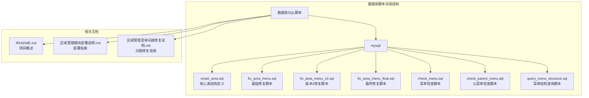
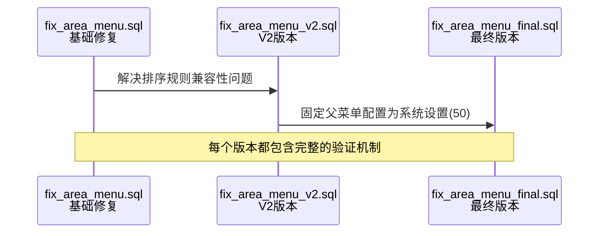
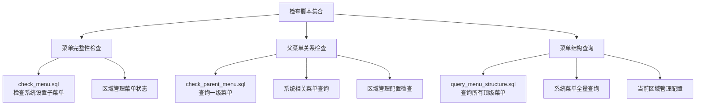
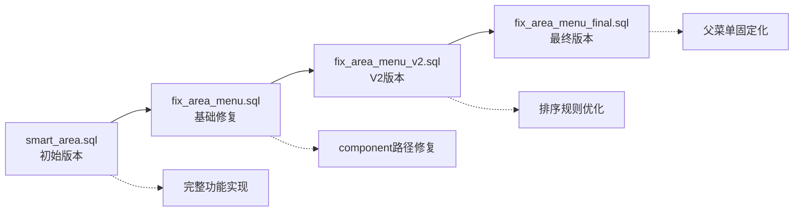

# 数据库脚本结构

<cite>
**本文档引用的文件**
- [smart_area.sql](file://数据库SQL脚本/mysql/smart_area.sql)
- [fix_area_menu.sql](file://数据库SQL脚本/mysql/fix_area_menu.sql)
- [fix_area_menu_v2.sql](file://数据库SQL脚本/mysql/fix_area_menu_v2.sql)
- [fix_area_menu_final.sql](file://数据库SQL脚本/mysql/fix_area_menu_final.sql)
- [check_menu.sql](file://check_menu.sql)
- [check_parent_menu.sql](file://check_parent_menu.sql)
- [query_menu_structure.sql](file://query_menu_structure.sql)
- [README.md](file://README.md)
- [区域管理模块部署说明.md](file://区域管理模块部署说明.md)
- [区域管理菜单问题修复说明.md](file://区域管理菜单问题修复说明.md)
</cite>

## 目录
1. [概述](#概述)
2. [项目结构分析](#项目结构分析)
3. [核心表结构设计](#核心表结构设计)
4. [SQL脚本分类与组织](#sql脚本分类与组织)
5. [版本管理策略](#版本管理策略)
6. [命名规范](#命名规范)
7. [最佳实践建议](#最佳实践建议)
8. [故障排除指南](#故障排除指南)
9. [总结](#总结)

## 概述

SmartAdmin项目采用了一套完整的数据库脚本管理体系，专门针对区域管理模块设计了标准化的SQL脚本结构。该体系涵盖了表结构定义、数据初始化、菜单配置、权限设置以及修复脚本等多个方面，形成了一个完整的数据库部署和维护解决方案。

本文档详细分析了数据库SQL脚本/mysql目录下的脚本组织架构，重点解释了smart_area.sql等核心表结构定义脚本的内容和作用，说明了fix_area_menu.sql等修复脚本的使用场景和执行顺序，并阐述了SQL脚本的版本管理策略和命名规范。

## 项目结构分析

### 目录结构概览



**图表来源**
- [smart_area.sql](file://数据库SQL脚本/mysql/smart_area.sql#L1-L197)
- [fix_area_menu.sql](file://数据库SQL脚本/mysql/fix_area_menu.sql#L1-L59)
- [fix_area_menu_v2.sql](file://数据库SQL脚本/mysql/fix_area_menu_v2.sql#L1-L78)
- [fix_area_menu_final.sql](file://数据库SQL脚本/mysql/fix_area_menu_final.sql#L1-L90)

### 脚本分类体系

数据库脚本按照功能和用途可分为以下几类：

1. **核心表结构定义脚本**：定义主要业务表结构
2. **修复脚本系列**：解决部署过程中的各种问题
3. **检查验证脚本**：用于诊断和验证数据库状态
4. **部署辅助脚本**：提供部署过程中的支持功能

**章节来源**
- [smart_area.sql](file://数据库SQL脚本/mysql/smart_area.sql#L1-L197)
- [fix_area_menu.sql](file://数据库SQL脚本/mysql/fix_area_menu.sql#L1-L59)
- [check_menu.sql](file://check_menu.sql#L1-L31)

## 核心表结构设计

### smart_area.sql核心内容分析

smart_area.sql是区域管理模块的核心表结构定义脚本，包含了完整的业务表设计和初始化数据。

#### 表结构设计特点

```mermaid
erDiagram
AREA {
bigint area_id PK
varchar area_code UK
varchar area_name
varchar area_type
int area_level
bigint parent_id
int sort_order
json area_config
text area_desc
bigint manager_id
varchar contact_phone
text address
decimal longitude
decimal latitude
tinyint status
datetime create_time
datetime update_time
bigint create_user_id
bigint update_user_id
tinyint deleted_flag
int version
}
AREA_DEVICE {
bigint relation_id PK
bigint area_id FK
bigint device_id
varchar device_type
datetime bind_time
bigint bind_user_id
datetime unbind_time
bigint unbind_user_id
text bind_remark
tinyint status
datetime create_time
datetime update_time
tinyint deleted_flag
}
AREA_USER {
bigint relation_id PK
bigint area_id FK
bigint user_id
varchar user_type
varchar relation_type
tinyint access_level
json access_time_config
datetime valid_start_time
datetime valid_end_time
bigint grant_user_id
datetime grant_time
bigint revoke_user_id
datetime revoke_time
text grant_remark
tinyint status
datetime create_time
datetime update_time
tinyint deleted_flag
}
AREA_CONFIG {
bigint config_id PK
bigint area_id FK
varchar config_type
varchar config_key
text config_value
text config_desc
tinyint is_encrypted
tinyint is_default
int version
datetime effective_time
datetime expire_time
tinyint status
datetime create_time
datetime update_time
bigint create_user_id
tinyint deleted_flag
}
SYS_DICT {
bigint dict_id PK
varchar dict_type
varchar dict_key
varchar dict_value
int sort_order
text remark
}
SYS_MENU {
bigint menu_id PK
varchar menu_name
tinyint menu_type
bigint parent_id
int sort
varchar path
varchar component
varchar perms
varchar icon
tinyint frame_flag
varchar frame_url
tinyint cache_flag
tinyint visible_flag
tinyint disabled_flag
tinyint deleted_flag
}
AREA ||--o{ AREA_DEVICE : "belongs to"
AREA ||--o{ AREA_USER : "belongs to"
AREA ||--o{ AREA_CONFIG : "has"
SYS_DICT ||--o{o SYS_DICT : "related"
SYS_MENU ||--o{o SYS_MENU : "parent-child"
```

**图表来源**
- [smart_area.sql](file://数据库SQL脚本/mysql/smart_area.sql#L7-L122)

#### 关键设计原则

1. **层次化结构设计**：支持无限层级的区域树形结构
2. **灵活的配置机制**：通过JSON字段支持动态配置
3. **完善的审计字段**：记录创建、更新、删除等操作信息
4. **软删除机制**：使用deleted_flag字段实现软删除
5. **乐观锁控制**：通过version字段实现并发控制

**章节来源**
- [smart_area.sql](file://数据库SQL脚本/mysql/smart_area.sql#L7-L122)

### 数据字典初始化

脚本中包含了完整的数据字典初始化，包括区域类型、用户类型、关联类型等关键枚举值：

| 字典类型 | 键值 | 值 | 说明 |
|---------|------|-----|------|
| AREA_TYPE | CAMPUS | 园区 | 整个园区 |
| AREA_TYPE | BUILDING | 楼栋 | 园区内的楼栋 |
| AREA_TYPE | FLOOR | 楼层 | 楼栋内的楼层 |
| AREA_TYPE | ROOM | 房间 | 楼层内的房间 |
| AREA_TYPE | OUTDOOR | 室外 | 室外区域 |
| AREA_TYPE | PARKING | 停车场 | 停车场 |
| AREA_TYPE | ENTRANCE | 出入口 | 出入口区域 |

**章节来源**
- [smart_area.sql](file://数据库SQL脚本/mysql/smart_area.sql#L124-L148)

## SQL脚本分类与组织

### 修复脚本系列演进

SmartAdmin项目的修复脚本经历了多个版本的演进，每个版本都解决了特定的问题：



**图表来源**
- [fix_area_menu.sql](file://数据库SQL脚本/mysql/fix_area_menu.sql#L1-L59)
- [fix_area_menu_v2.sql](file://数据库SQL脚本/mysql/fix_area_menu_v2.sql#L1-L78)
- [fix_area_menu_final.sql](file://数据库SQL脚本/mysql/fix_area_menu_final.sql#L1-L90)

#### 修复脚本功能对比

| 脚本版本 | 主要功能 | 解决问题 | 使用场景 |
|---------|----------|----------|----------|
| fix_area_menu.sql | 基础菜单修复 | component路径错误 | 初次部署问题 |
| fix_area_menu_v2.sql | 排序规则修复 | 菜单排序兼容性 | 版本升级问题 |
| fix_area_menu_final.sql | 固定父菜单配置 | 父菜单ID硬编码 | 生产环境部署 |

**章节来源**
- [fix_area_menu.sql](file://数据库SQL脚本/mysql/fix_area_menu.sql#L1-L59)
- [fix_area_menu_v2.sql](file://数据库SQL脚本/mysql/fix_area_menu_v2.sql#L1-L78)
- [fix_area_menu_final.sql](file://数据库SQL脚本/mysql/fix_area_menu_final.sql#L1-L90)

### 检查验证脚本

检查脚本提供了多种诊断和验证功能：



**图表来源**
- [check_menu.sql](file://check_menu.sql#L1-L31)
- [check_parent_menu.sql](file://check_parent_menu.sql#L1-L40)
- [query_menu_structure.sql](file://query_menu_structure.sql#L1-L42)

**章节来源**
- [check_menu.sql](file://check_menu.sql#L1-L31)
- [check_parent_menu.sql](file://check_parent_menu.sql#L1-L40)
- [query_menu_structure.sql](file://query_menu_structure.sql#L1-L42)

## 版本管理策略

### 脚本版本演进路径

SmartAdmin采用了渐进式的版本管理策略，每个版本都建立在前一版本的基础上：



**图表来源**
- [smart_area.sql](file://数据库SQL脚本/mysql/smart_area.sql#L1-L197)
- [fix_area_menu.sql](file://数据库SQL脚本/mysql/fix_area_menu.sql#L1-L59)
- [fix_area_menu_v2.sql](file://数据库SQL脚本/mysql/fix_area_menu_v2.sql#L1-L78)
- [fix_area_menu_final.sql](file://数据库SQL脚本/mysql/fix_area_menu_final.sql#L1-L90)

### 版本兼容性保证

1. **向后兼容**：新版本修复脚本可以处理旧版本遗留的问题
2. **幂等性设计**：每个脚本都可以安全地重复执行
3. **状态检测**：脚本执行前会检查当前状态，避免重复操作
4. **回滚机制**：出现问题时可以通过删除操作回滚到初始状态

**章节来源**
- [fix_area_menu.sql](file://数据库SQL脚本/mysql/fix_area_menu.sql#L6-L14)
- [fix_area_menu_final.sql](file://数据库SQL脚本/mysql/fix_area_menu_final.sql#L6-L14)

## 命名规范

### 表命名规范

SmartAdmin项目严格遵循统一的表命名规范：

| 类型 | 规范 | 示例 | 说明 |
|------|------|------|------|
| 主表 | t_{module}_{entity} | t_area | 区域主表 |
| 关联表 | t_{module}_{entity1}_{entity2} | t_area_device | 区域设备关联 |
| 配置表 | t_{module}_{config_type} | t_area_config | 区域配置表 |
| 字典表 | t_sys_{dict_type} | t_sys_dict | 系统字典表 |
| 菜单表 | t_sys_menu | t_sys_menu | 系统菜单表 |

### 脚本命名规范

| 类型 | 规范 | 示例 | 说明 |
|------|------|------|------|
| 核心脚本 | {module}_{feature}.sql | smart_area.sql | 区域管理核心脚本 |
| 修复脚本 | fix_{issue}_{version}.sql | fix_area_menu_final.sql | 区域菜单修复最终版 |
| 检查脚本 | check_{aspect}.sql | check_menu.sql | 菜单检查脚本 |
| 查询脚本 | query_{info}.sql | query_menu_structure.sql | 菜单结构查询 |

**章节来源**
- [smart_area.sql](file://数据库SQL脚本/mysql/smart_area.sql#L7-L122)
- [区域管理模块部署说明.md](file://区域管理模块部署说明.md#L177-L186)

## 最佳实践建议

### 新表结构定义最佳实践

#### 1. 字段设计原则

```sql
-- 推荐的字段设计模板
CREATE TABLE IF NOT EXISTS `t_{module}_{entity}` (
    `{entity}_id` BIGINT NOT NULL AUTO_INCREMENT COMMENT '主键ID',
    -- 业务字段...
    `create_time` DATETIME DEFAULT CURRENT_TIMESTAMP COMMENT '创建时间',
    `update_time` DATETIME DEFAULT CURRENT_TIMESTAMP ON UPDATE CURRENT_TIMESTAMP COMMENT '更新时间',
    `create_user_id` BIGINT COMMENT '创建人ID',
    `update_user_id` BIGINT COMMENT '更新人ID',
    `deleted_flag` TINYINT DEFAULT 0 COMMENT '删除标志：0-未删除，1-已删除',
    `version` INT DEFAULT 1 COMMENT '版本号（乐观锁）',
    PRIMARY KEY (`{entity}_id`),
    -- 索引定义...
) ENGINE=InnoDB DEFAULT CHARSET=utf8mb4 COLLATE=utf8mb4_unicode_ci COMMENT='{业务说明}';
```

#### 2. 索引设计策略

- **主键索引**：每个表必须有主键
- **唯一约束**：对于业务唯一字段添加UNIQUE KEY
- **查询频率高的字段**：添加普通索引
- **复合查询条件**：考虑复合索引
- **JSON字段**：根据查询需求添加虚拟列索引

#### 3. 数据类型选择

- **主键**：使用BIGINT AUTO_INCREMENT
- **字符串**：优先使用VARCHAR，指定字符集utf8mb4
- **数值**：根据精度需求选择合适的类型
- **时间**：使用DATETIME，包含时区信息
- **配置数据**：使用JSON类型支持动态配置

**章节来源**
- [smart_area.sql](file://数据库SQL脚本/mysql/smart_area.sql#L7-L122)

### 数据修复脚本编写规范

#### 1. 脚本结构标准

```sql
-- 修复脚本模板
-- 功能描述
-- 修改日期
-- 版本号

USE `database_name`;

-- 1. 清理现有数据
SET @variable = (SELECT id FROM table WHERE condition LIMIT 1);
DELETE FROM table WHERE condition;

-- 2. 插入正确数据
INSERT INTO table (...) VALUES (...);

-- 3. 验证修复结果
SELECT '修复完成！' AS message;
```

#### 2. 错误处理机制

- **条件检查**：执行前检查必要条件
- **事务管理**：使用事务保证原子性
- **回滚准备**：提供回滚语句
- **状态反馈**：提供详细的执行状态

#### 3. 版本兼容性

- **幂等性**：确保脚本可以重复执行
- **状态检测**：检查当前状态再决定操作
- **向前兼容**：新版本能够处理旧版本数据

**章节来源**
- [fix_area_menu.sql](file://数据库SQL脚本/mysql/fix_area_menu.sql#L1-L59)
- [fix_area_menu_final.sql](file://数据库SQL脚本/mysql/fix_area_menu_final.sql#L1-L90)

### 部署流程最佳实践

#### 1. 部署前检查

```sql
-- 部署前状态检查
SELECT '开始部署前检查...' AS status;
-- 检查数据库版本
SELECT VERSION() AS mysql_version;
-- 检查字符集设置
SHOW VARIABLES LIKE 'character_set_database';
-- 检查存储引擎
SHOW VARIABLES LIKE 'storage_engine';
```

#### 2. 分阶段部署

1. **核心表结构**：先执行smart_area.sql
2. **修复脚本**：根据需要执行修复脚本
3. **数据验证**：使用检查脚本验证部署结果
4. **功能测试**：进行完整的功能测试

#### 3. 回滚策略

- **备份数据**：部署前备份关键数据
- **版本标记**：为每个部署版本打标记
- **快速回滚**：提供快速回滚脚本
- **状态恢复**：确保回滚后系统状态一致

**章节来源**
- [区域管理模块部署说明.md](file://区域管理模块部署说明.md#L77-L116)

## 故障排除指南

### 常见问题及解决方案

#### 1. 菜单不显示问题

**问题现象**：前端页面没有"区域管理"菜单

**根本原因**：component路径配置错误

**解决方案**：
```sql
-- 执行修复脚本
mysql -h host -P port -u user database < fix_area_menu_final.sql
-- 或手动修复
UPDATE t_sys_menu 
SET component = 'system/area/index.vue'
WHERE menu_name = '区域管理' AND deleted_flag = 0;
```

**预防措施**：
- 遵循component路径规范
- 使用SET @变量方式获取ID
- 避免复杂的嵌套子查询

**章节来源**
- [区域管理菜单问题修复说明.md](file://区域管理菜单问题修复说明.md#L1-L165)

#### 2. 数据库连接问题

**常见错误**：SQL执行报错

**排查步骤**：
1. 检查数据库连接信息
2. 确认数据库版本（MySQL 8.0+）
3. 验证数据库权限
4. 检查字符集设置

#### 3. 权限配置问题

**问题**：API接口调用失败

**解决方案**：
1. 检查菜单权限分配
2. 确认用户角色权限
3. 验证权限配置正确性

**章节来源**
- [区域管理模块部署说明.md](file://区域管理模块部署说明.md#L280-L300)

### 诊断工具使用

#### 1. 菜单状态检查

使用提供的检查脚本诊断菜单状态：

```sql
-- 检查系统设置下的子菜单
SELECT * FROM t_sys_menu WHERE parent_id = (SELECT menu_id FROM t_sys_menu WHERE menu_name = '系统设置');

-- 检查区域管理菜单配置
SELECT * FROM t_sys_menu WHERE menu_name = '区域管理';
```

#### 2. 数据完整性验证

```sql
-- 验证区域表数据完整性
SELECT COUNT(*) as total_areas, 
       SUM(CASE WHEN parent_id = 0 THEN 1 ELSE 0 END) as root_areas,
       SUM(CASE WHEN deleted_flag = 1 THEN 1 ELSE 0 END) as deleted_areas
FROM t_area;
```

**章节来源**
- [check_menu.sql](file://check_menu.sql#L1-L31)
- [query_menu_structure.sql](file://query_menu_structure.sql#L1-L42)

## 总结

SmartAdmin项目的数据库脚本体系展现了优秀的工程实践和设计思维。通过系统化的脚本分类、严格的命名规范、完善的版本管理和丰富的故障排除工具，为区域管理模块的部署和维护提供了可靠保障。

### 核心优势

1. **结构化设计**：清晰的脚本分类和组织
2. **版本演进**：渐进式的修复脚本演进
3. **质量保证**：完整的检查和验证机制
4. **运维友好**：丰富的诊断和故障排除工具

### 应用价值

这套数据库脚本管理体系不仅适用于区域管理模块，也为其他业务模块的数据库脚本设计提供了宝贵的参考。通过遵循这些最佳实践，可以显著提高数据库部署的可靠性、可维护性和可扩展性。

### 发展方向

随着项目的持续发展，数据库脚本体系还可以在以下方面进一步完善：
- 自动化部署流程
- 更完善的监控和告警机制
- 更丰富的自动化测试工具
- 更智能的故障预测和诊断能力