# UI组件与页面结构

<cite>
**本文档引用的文件**
- [index.vue](file://smart-app/src/pages/home/index.vue)
- [banner.vue](file://smart-app/src/pages/home/components/banner.vue)
- [menu.vue](file://smart-app/src/pages/home/components/menu.vue)
- [notice.vue](file://smart-app/src/pages/home/components/notice.vue)
- [goods.vue](file://smart-app/src/pages/home/components/goods.vue)
- [statistics.vue](file://smart-app/src/pages/home/components/statistics.vue)
- [dict-select/index.vue](file://smart-app/src/components/dict-select/index.vue)
- [App.vue](file://smart-app/src/App.vue)
- [main.js](file://smart-app/src/main.js)
- [uni-icons/package.json](file://smart-app/src/uni_modules/uni-icons/package.json)
</cite>

## 目录
1. [项目结构](#项目结构)
2. [首页页面结构](#首页页面结构)
3. [核心组件分析](#核心组件分析)
4. [自定义组件实现](#自定义组件实现)
5. [uni-ui组件库集成](#uni-ui组件库集成)
6. [页面布局最佳实践](#页面布局最佳实践)
7. [组件复用策略](#组件复用策略)
8. [UI一致性维护](#ui一致性维护)

## 项目结构

本项目采用uni-app框架构建移动端应用，主要UI组件和页面位于`smart-app`目录下。项目结构清晰，遵循组件化开发原则，将UI组件分为基础组件和业务组件。

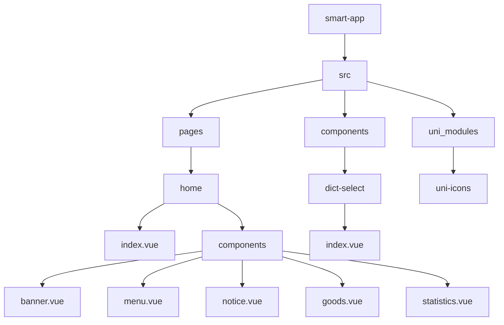

**图源**
- [index.vue](file://smart-app/src/pages/home/index.vue)
- [banner.vue](file://smart-app/src/pages/home/components/banner.vue)
- [menu.vue](file://smart-app/src/pages/home/components/menu.vue)
- [notice.vue](file://smart-app/src/pages/home/components/notice.vue)
- [goods.vue](file://smart-app/src/pages/home/components/goods.vue)
- [statistics.vue](file://smart-app/src/pages/home/components/statistics.vue)
- [dict-select/index.vue](file://smart-app/src/components/dict-select/index.vue)

## 首页页面结构

首页(index.vue)采用模块化设计，通过组合多个子组件构建完整的用户界面。页面结构清晰，各组件职责分明。

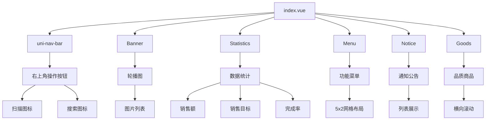

**图源**
- [index.vue](file://smart-app/src/pages/home/index.vue)
- [banner.vue](file://smart-app/src/pages/home/components/banner.vue)
- [menu.vue](file://smart-app/src/pages/home/components/menu.vue)
- [notice.vue](file://smart-app/src/pages/home/components/notice.vue)
- [goods.vue](file://smart-app/src/pages/home/components/goods.vue)
- [statistics.vue](file://smart-app/src/pages/home/components/statistics.vue)

**节源**
- [index.vue](file://smart-app/src/pages/home/index.vue#L1-L81)

## 核心组件分析

### Banner组件

Banner组件实现轮播图功能，使用uni-app的swiper组件构建。

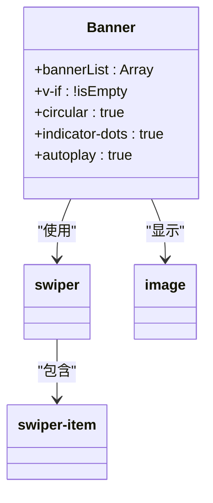

**图源**
- [banner.vue](file://smart-app/src/pages/home/components/banner.vue#L1-L45)

**节源**
- [banner.vue](file://smart-app/src/pages/home/components/banner.vue#L1-L45)

### Menu组件

Menu组件使用uni-grid实现5列网格布局，包含10个功能入口。

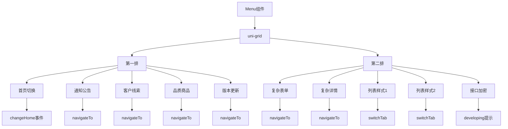

**图源**
- [menu.vue](file://smart-app/src/pages/home/components/menu.vue#L1-L132)

**节源**
- [menu.vue](file://smart-app/src/pages/home/components/menu.vue#L1-L132)

### Notice组件

Notice组件展示通知公告列表，集成uni-card和uni-list组件。

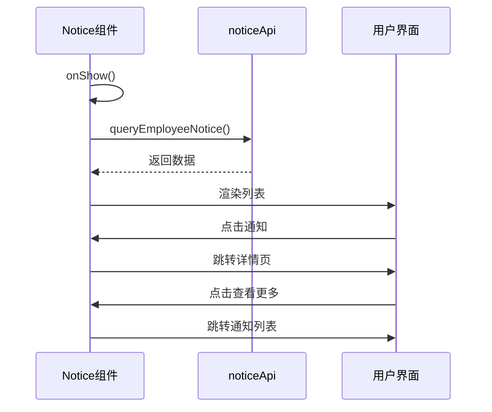

**图源**
- [notice.vue](file://smart-app/src/pages/home/components/notice.vue#L1-L97)

**节源**
- [notice.vue](file://smart-app/src/pages/home/components/notice.vue#L1-L97)

## 自定义组件实现

### dict-select下拉选择器

dict-select组件封装了字典数据的下拉选择功能，实现了数据绑定和事件处理。

```mermaid
classDiagram
class DictSelect {
+props : {keyCode, modelValue, placeholder}
+dictValueList : Array
+selectValue : Ref
+queryDict() : Promise
+onChange() : void
}
DictSelect --> dictApi : "调用"
DictSelect --> uni-data-select : "使用"
DictSelect --> defineEmits : "触发"
```

**图源**
- [dict-select/index.vue](file://smart-app/src/components/dict-select/index.vue#L1-L56)

**节源**
- [dict-select/index.vue](file://smart-app/src/components/dict-select/index.vue#L1-L56)

### 组件封装原理

dict-select组件的封装原理主要包括：

1. **属性定义**：通过defineProps定义组件属性
2. **数据获取**：onMounted时调用API获取字典数据
3. **数据绑定**：使用v-model实现双向绑定
4. **事件处理**：通过defineEmits触发事件
5. **状态同步**：watch监听modelValue变化

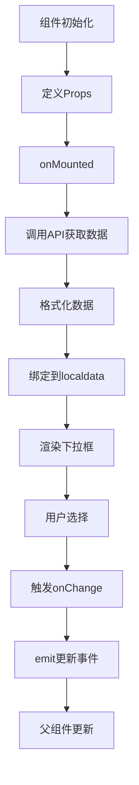

**图源**
- [dict-select/index.vue](file://smart-app/src/components/dict-select/index.vue#L1-L56)

## uni-ui组件库集成

### uni-icons图标使用

项目集成了uni-icons组件库，用于展示移动端常见图标。

```mermaid
erDiagram
UNI_ICONS ||--o{ PROJECT : "集成"
UNI_ICONS {
string id "uni-icons"
string displayName "uni-icons 图标"
string version "2.0.9"
string description "图标组件"
}
PROJECT {
string id "smart-app"
string framework "uni-app"
string version "Vue3"
}
UNI_ICONS }|-- UNI_MODULES : "作为模块"
UNI_MODULES ||--o{ CLIENT_PLATFORMS : "支持"
CLIENT_PLATFORMS {
string App "app-vue, app-nvue, app-uvue"
string H5_mobile "Safari, Android Browser等"
string 小程序 "微信, 阿里, 百度等"
string 快应用 "华为, 联盟"
}
```

**图源**
- [uni-icons/package.json](file://smart-app/src/uni_modules/uni-icons/package.json#L1-L89)

**节源**
- [uni-icons/package.json](file://smart-app/src/uni_modules/uni-icons/package.json#L1-L89)

### 组件库使用方式

uni-ui组件库的使用方式包括：

1. **安装配置**：通过uni_modules集成
2. **样式导入**：在App.vue中导入基础样式
3. **组件引用**：直接在模板中使用组件标签
4. **属性设置**：配置组件的各类属性

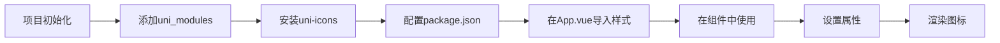

**图源**
- [App.vue](file://smart-app/src/App.vue#L1-L23)
- [main.js](file://smart-app/src/main.js#L1-L23)
- [uni-icons/package.json](file://smart-app/src/uni_modules/uni-icons/package.json#L1-L89)

## 页面布局最佳实践

### 响应式设计

项目采用rpx单位实现响应式设计，确保在不同屏幕尺寸下的适配。

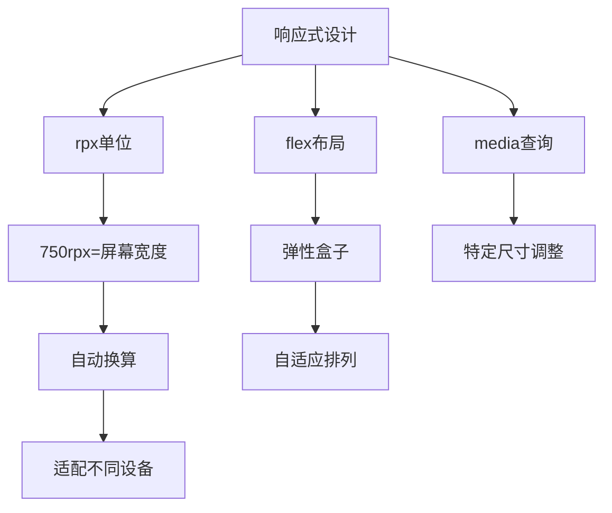

**节源**
- [index.vue](file://smart-app/src/pages/home/index.vue#L56-L80)
- [banner.vue](file://smart-app/src/pages/home/components/banner.vue#L30-L44)
- [menu.vue](file://smart-app/src/pages/home/components/menu.vue#L98-L131)

### 移动端适配技巧

移动端适配的关键技巧包括：

1. **单位选择**：使用rpx而非px
2. **布局方式**：优先使用flex布局
3. **间距设置**：合理设置margin和padding
4. **圆角处理**：统一圆角大小
5. **阴影效果**：适度使用阴影提升层次感

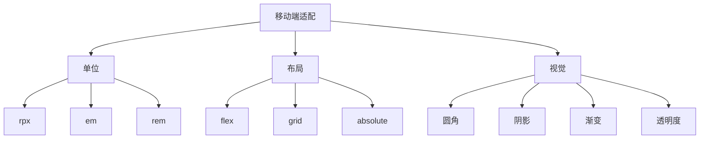

## 组件复用策略

### 组件分类

项目中的组件可分为三类：

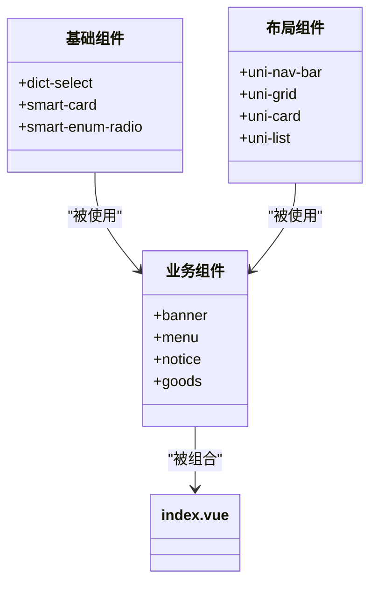

**节源**
- [components](file://smart-app/src/components/)
- [pages/home/components](file://smart-app/src/pages/home/components/)

### 复用原则

组件复用遵循以下原则：

1. **单一职责**：每个组件只负责一个功能
2. **高内聚低耦合**：组件内部紧密相关，外部依赖最小化
3. **可配置性**：通过props提供配置选项
4. **可扩展性**：预留slot支持内容扩展
5. **可测试性**：独立可测试

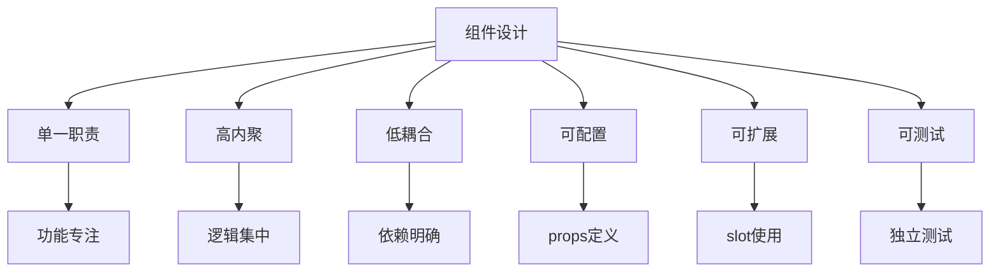

## UI一致性维护

### 样式规范

项目通过多种方式维护UI一致性：

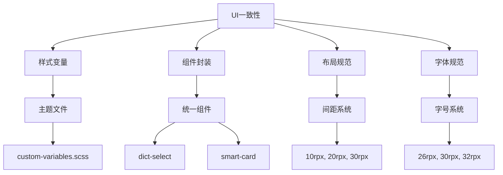

**节源**
- [theme/index.scss](file://smart-app/src/theme/index.scss)
- [custom-variables.scss](file://smart-app/src/theme/custom-variables.scss)

### 维护策略

UI一致性维护策略包括：

1. **建立设计系统**：定义颜色、字体、间距等设计规范
2. **组件库化**：将常用UI模式封装为可复用组件
3. **代码审查**：通过代码审查确保UI实现符合规范
4. **文档化**：编写UI组件使用文档
5. **自动化检测**：使用工具检测UI一致性

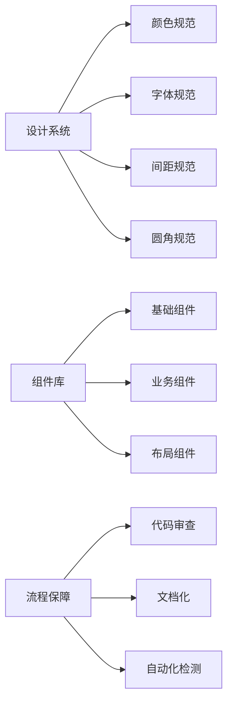