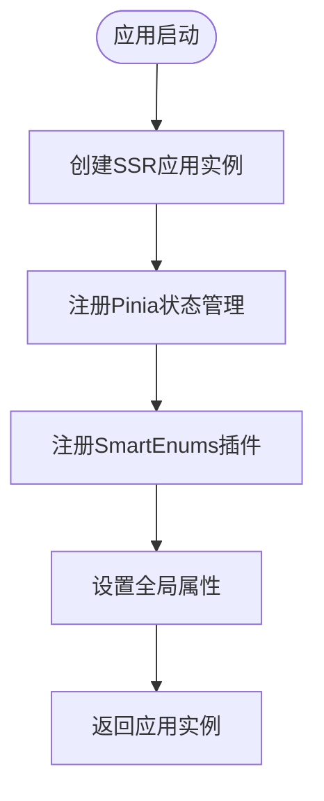
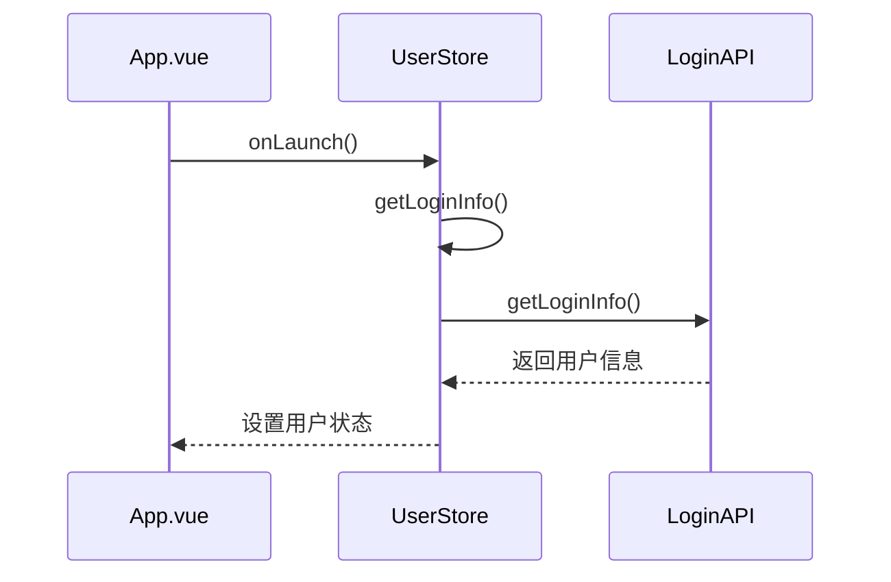
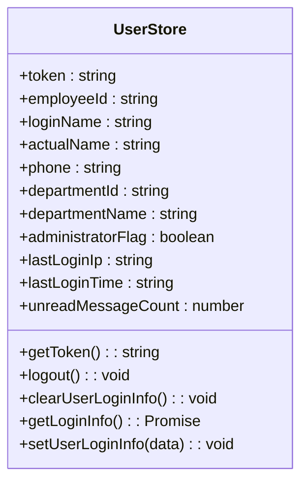
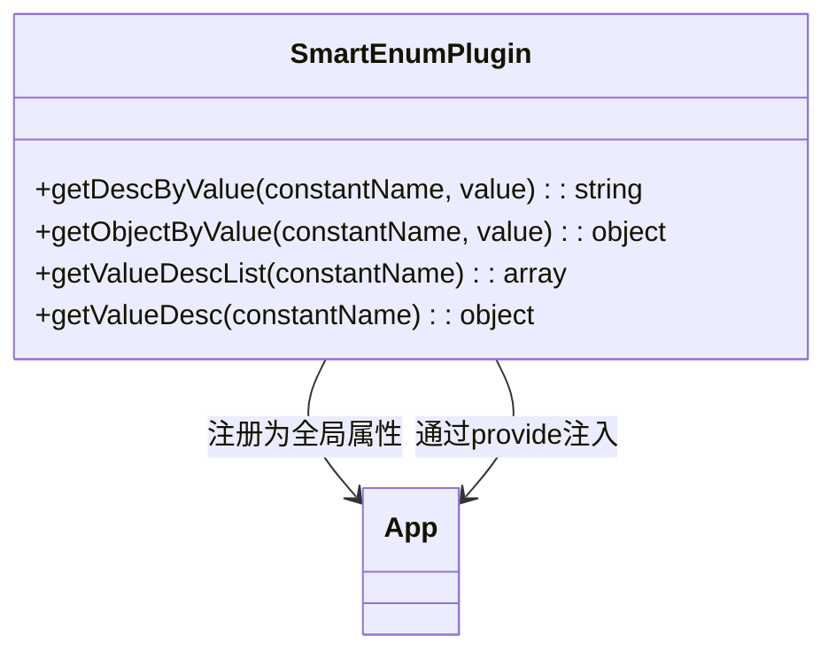
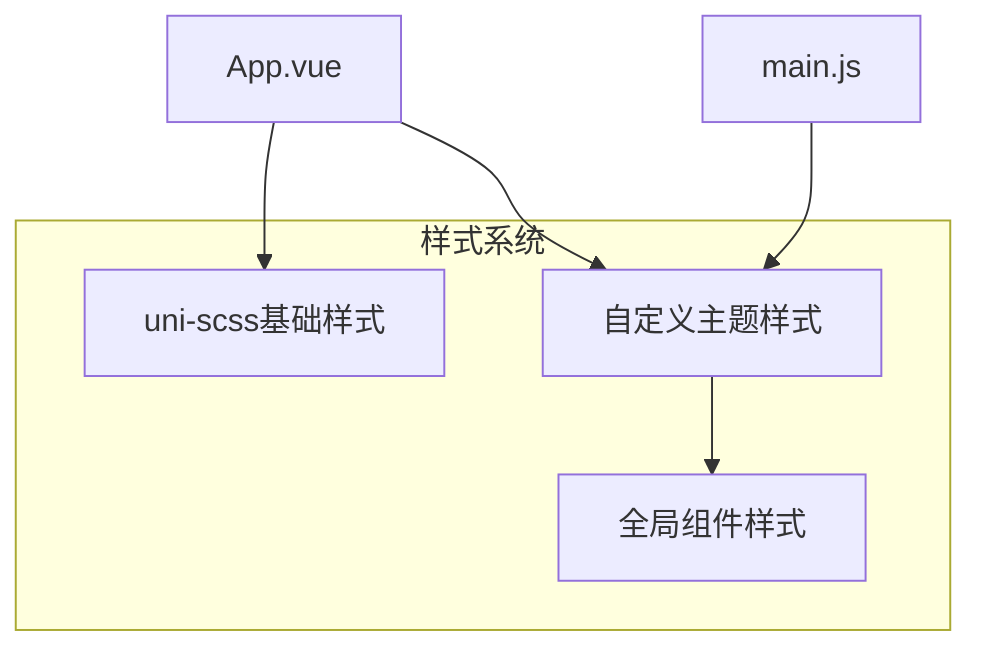
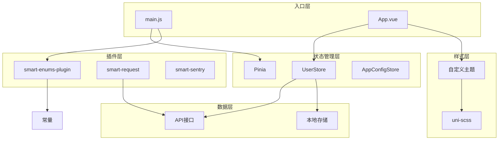
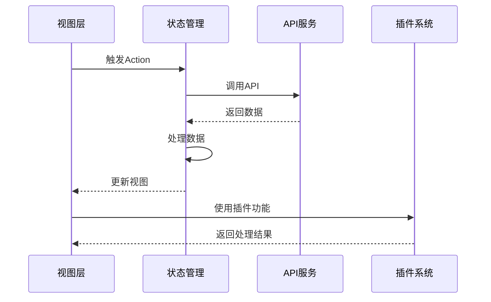

# 移动端架构

<cite>
**本文档引用的文件**  
- [main.js](file://smart-app/src/main.js)
- [App.vue](file://smart-app/src/App.vue)
- [smart-enums-plugin.js](file://smart-app/src/plugins/smart-enums-plugin.js)
- [index.js](file://smart-app/src/store/index.js)
- [user.js](file://smart-app/src/store/modules/system/user.js)
- [index.js](file://smart-app/src/constants/index.js)
- [theme/index.scss](file://smart-app/src/theme/index.scss)
- [manifest.json](file://smart-app/src/manifest.json)
- [pages.json](file://smart-app/src/pages.json)
- [app-config.js](file://smart-app/src/store/modules/system/app-config.js)
- [login-api.js](file://smart-app/src/api/system/login-api.js)
- [smart-request.js](file://smart-app/src/lib/smart-request.js)
</cite>

## 目录
1. [项目结构](#项目结构)
2. [应用启动流程](#应用启动流程)
3. [状态管理机制](#状态管理机制)
4. [插件系统设计](#插件系统设计)
5. [全局样式与主题管理](#全局样式与主题管理)
6. [架构图示](#架构图示)
7. [最佳实践与扩展建议](#最佳实践与扩展建议)

## 项目结构

基于uni-app框架的移动端应用采用模块化分层架构，主要包含以下核心目录：

- **src/api**: API接口定义，按业务模块组织
- **src/components**: 可复用组件库，包含业务和框架组件
- **src/constants**: 全局常量和枚举定义
- **src/lib**: 工具库和第三方库封装
- **src/plugins**: 自定义插件实现
- **src/store**: Pinia状态管理模块
- **src/theme**: 主题样式和全局SCSS变量
- **src/utils**: 通用工具函数
- **src/pages**: 页面组件
- **src/uni_modules**: uni-app官方插件模块

**架构来源**
- [main.js](file://smart-app/src/main.js#L1-L23)
- [manifest.json](file://smart-app/src/manifest.json#L1-L73)
- [pages.json](file://smart-app/src/pages.json#L1-L213)

## 应用启动流程

应用启动流程从`main.js`的`createApp`函数开始，遵循uni-app的生命周期管理机制。

### 启动初始化

在`main.js`中，通过`createSSRApp`创建Vue应用实例，并注册全局依赖：

1. 创建SSR应用实例
2. 注册Pinia状态管理
3. 注册smart-enums-plugin枚举插件
4. 设置全局Lodash实例



**流程来源**
- [main.js](file://smart-app/src/main.js#L13-L22)

### 应用生命周期管理

`App.vue`文件定义了应用的全局生命周期钩子：

- **onLaunch**: 应用初始化时执行，获取用户登录信息
- **onShow**: 应用显示时执行
- **onHide**: 应用隐藏时执行



**生命周期来源**
- [App.vue](file://smart-app/src/App.vue#L4-L13)

## 状态管理机制

应用采用Pinia作为状态管理解决方案，提供类型安全和模块化的状态管理。

### Pinia配置

在`store/index.js`中创建Pinia实例，并在`main.js`中通过`app.use(store)`注册到Vue应用。

```javascript
import * as pinia from 'pinia';
export const store = pinia.createPinia();
```

### 模块化状态管理

状态管理采用模块化设计，主要包含：

- **user模块**: 用户登录状态管理
- **app-config模块**: 应用配置管理

#### 用户状态管理

`user.js`模块定义了用户相关的状态、getter和actions：

- **state**: 存储用户基本信息
- **getters**: 提供状态计算
- **actions**: 处理异步操作和状态变更



**状态管理来源**
- [index.js](file://smart-app/src/store/index.js#L1-L13)
- [user.js](file://smart-app/src/store/modules/system/user.js#L49-L113)
- [app-config.js](file://smart-app/src/store/modules/system/app-config.js#L36-L55)

## 插件系统设计

应用实现了自定义的smart-enums-plugin枚举插件，用于统一管理前端枚举值。

### smart-enums-plugin实现原理

插件通过`install`方法注册到Vue应用，提供以下核心功能：

- **getDescByValue**: 根据枚举值获取描述
- **getObjectByValue**: 根据枚举值获取对象
- **getValueDescList**: 获取枚举值描述列表
- **getValueDesc**: 获取枚举值描述映射



### 插件集成方式

在`main.js`中通过`app.use()`方法集成插件：

```javascript
import smartEnumPlugin from '@/plugins/smart-enums-plugin';
import constantsInfo from '@/constants/index';

app.use(smartEnumPlugin, constantsInfo);
```

插件接收`constantsInfo`作为参数，该对象包含所有枚举常量。

### 枚举常量管理

`constants/index.js`作为所有常量的入口文件，通过模块化方式整合各类枚举：

```javascript
export default {
  FLAG_NUMBER_ENUM,
  GENDER_ENUM,
  USER_TYPE_ENUM,
  ...loginDevice,
  ...enterpriseConst,
  ...goodsConst,
  ...changeLogConst,
  ...fileConst,
  ...messageConst
};
```

**插件系统来源**
- [smart-enums-plugin.js](file://smart-app/src/plugins/smart-enums-plugin.js#L14-L97)
- [main.js](file://smart-app/src/main.js#L9-L16)
- [index.js](file://smart-app/src/constants/index.js#L18-L28)

## 全局样式与主题管理

应用采用SCSS作为样式预处理器，结合uni-scss实现统一的样式管理。

### uni-scss集成

在`App.vue`中通过`@import`引入uni-scss：

```scss
@import '@/uni_modules/uni-scss/index.scss';
```

### 自定义主题实现

应用通过`theme/index.scss`文件实现自定义主题，包含以下主要部分：

- **布局样式**: 宽度、间距等布局相关样式
- **表单样式**: 统一的表单组件样式
- **详情页样式**: 详情卡片和单元格样式
- **全局变量**: 使用uni-app的SCSS变量



### 样式组织结构

样式文件采用功能分区的方式组织：

- **宽度**: smart-width-*类
- **间距**: smart-margin-*类
- **表单**: smart-form相关类
- **详情**: smart-detail相关类

**样式管理来源**
- [theme/index.scss](file://smart-app/src/theme/index.scss#L1-L255)
- [App.vue](file://smart-app/src/App.vue#L17-L22)
- [main.js](file://smart-app/src/main.js#L6)

## 架构图示

### 整体架构图



**架构图来源**
- [main.js](file://smart-app/src/main.js)
- [App.vue](file://smart-app/src/App.vue)
- [store](file://smart-app/src/store)
- [plugins](file://smart-app/src/plugins)

### 数据流图



**数据流来源**
- [user.js](file://smart-app/src/store/modules/system/user.js)
- [smart-request.js](file://smart-app/src/lib/smart-request.js)
- [smart-enums-plugin.js](file://smart-app/src/plugins/smart-enums-plugin.js)

## 最佳实践与扩展建议

### 架构最佳实践

1. **模块化设计**: 保持功能模块的独立性和可复用性
2. **状态管理**: 使用Pinia进行集中式状态管理
3. **插件机制**: 通过插件系统扩展应用功能
4. **样式管理**: 采用SCSS预处理器和BEM命名规范
5. **API封装**: 统一API请求处理和错误管理

### 扩展建议

1. **新增插件**: 可以参考smart-enums-plugin的实现方式创建新的功能插件
2. **状态模块**: 根据业务需求添加新的Pinia模块
3. **主题定制**: 在theme目录下扩展自定义主题变量和样式
4. **组件库**: 在components目录下添加可复用的业务组件
5. **API扩展**: 在api目录下按业务模块组织新的API接口

**扩展建议来源**
- [main.js](file://smart-app/src/main.js)
- [store](file://smart-app/src/store)
- [plugins](file://smart-app/src/plugins)
- [theme](file://smart-app/src/theme)
- [components](file://smart-app/src/components)
- [api](file://smart-app/src/api)