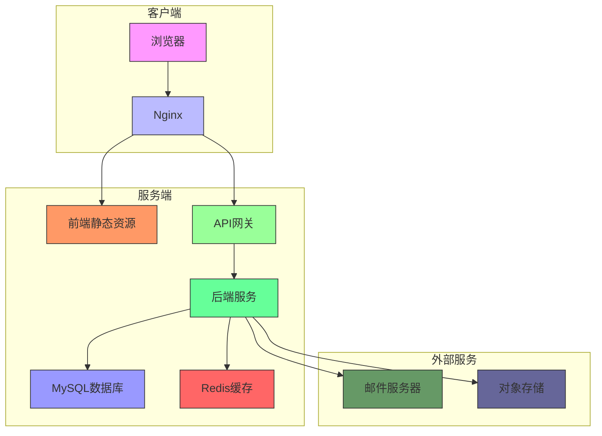

# 部署指南

<cite>
**本文档引用的文件**  
- [pom.xml](file://smart-admin-api-java17-springboot3/sa-admin/pom.xml)
- [sa-base.yaml](file://smart-admin-api-java17-springboot3/sa-base/src/main/resources/prod/sa-base.yaml)
- [AdminApplication.java](file://smart-admin-api-java17-springboot3/sa-admin/src/main/java/net/lab1024/sa/admin/AdminApplication.java)
- [vite.config.js](file://smart-admin-web-javascript/vite.config.js)
- [package.json](file://smart-admin-web-javascript/package.json)
- [application.yaml](file://smart-admin-api-java17-springboot3/sa-admin/src/main/resources/prod/application.yaml)
- [smart_area.sql](file://数据库SQL脚本/mysql/smart_area.sql)
- [log4j2-spring.xml](file://smart-admin-api-java17-springboot3/sa-admin/src/main/resources/prod/log4j2-spring.xml)
</cite>

## 目录
1. [后端服务部署](#后端服务部署)
2. [前端项目部署](#前端项目部署)
3. [生产环境配置](#生产环境配置)
4. [部署架构图](#部署架构图)
5. [运维监控方案](#运维监控方案)
6. [版本升级与回滚流程](#版本升级与回滚流程)
7. [高可用与灾备方案](#高可用与灾备方案)

## 后端服务部署

### Maven打包流程
后端服务采用Maven进行项目构建和打包。项目包含两个主要模块：`sa-admin`（主应用模块）和`sa-base`（基础依赖模块）。首先需要对`sa-base`模块执行`install`命令，将其安装到本地Maven仓库，然后在`sa-admin`模块中执行`package`命令生成可执行的JAR文件。

打包命令如下：
```bash
# 进入sa-base目录并安装到本地仓库
cd smart-admin-api-java17-springboot3/sa-base
mvn clean install

# 进入sa-admin目录并打包
cd ../sa-admin
mvn clean package
```

打包完成后，可在`sa-admin/target`目录下找到生成的JAR文件，文件名为`sa-admin-3.0.0.jar`。

**Section sources**
- [pom.xml](file://smart-admin-api-java17-springboot3/sa-admin/pom.xml#L1-L47)
- [pom.xml](file://smart-admin-api-java17-springboot3/sa-base/pom.xml#L1-L276)

### Docker镜像构建
为实现容器化部署，可基于生成的JAR文件构建Docker镜像。建议使用Java 17作为基础镜像，确保与项目要求的Java版本一致。

Dockerfile示例：
```dockerfile
FROM openjdk:17-jdk-slim

WORKDIR /app

COPY target/sa-admin-3.0.0.jar app.jar

EXPOSE 1024

ENTRYPOINT ["java", "-jar", "app.jar"]
```

构建镜像命令：
```bash
docker build -t smartadmin-backend:3.0.0 .
```

### JVM参数配置
为确保后端服务在生产环境中的稳定运行，建议配置以下JVM参数：

```bash
java -Xms2g -Xmx2g \
     -XX:MetaspaceSize=256m \
     -XX:MaxMetaspaceSize=512m \
     -XX:+UseG1GC \
     -XX:MaxGCPauseMillis=200 \
     -XX:+ParallelRefProcEnabled \
     -XX:+DisableExplicitGC \
     -XX:+HeapDumpOnOutOfMemoryError \
     -XX:HeapDumpPath=/app/logs/heapdump.hprof \
     -Dproject.log-directory=/app/logs \
     -jar sa-admin-3.0.0.jar
```

关键参数说明：
- `-Xms`和`-Xmx`：设置堆内存初始大小和最大大小，建议设置为相同值以避免动态调整
- `-XX:+UseG1GC`：使用G1垃圾收集器，适合大内存应用
- `-XX:MaxGCPauseMillis`：设置最大GC暂停时间目标
- `-Dproject.log-directory`：指定日志输出目录，与log4j2配置中的变量对应

**Section sources**
- [AdminApplication.java](file://smart-admin-api-java17-springboot3/sa-admin/src/main/java/net/lab1024/sa/admin/AdminApplication.java#L1-L41)
- [log4j2-spring.xml](file://smart-admin-api-java17-springboot3/sa-admin/src/main/resources/prod/log4j2-spring.xml#L1-L26)

## 前端项目部署

### Vite构建配置
前端项目使用Vite作为构建工具，支持多环境构建。项目根目录下的`vite.config.js`文件定义了构建配置，包括别名设置、代理配置和构建优化等。

关键配置说明：
- `base`：根据环境变量设置基础路径，生产环境为基础路径`/`
- `resolve.alias`：设置了`/@/`别名，指向`src`目录，简化模块导入
- `server.proxy`：开发环境下的代理配置，将API请求代理到后端服务
- `build.rollupOptions`：配置了代码分割策略，将node_modules中的依赖按包名分割

**Section sources**
- [vite.config.js](file://smart-admin-web-javascript/vite.config.js#L1-L100)

### 静态资源部署
前端项目通过Vite构建生成静态资源文件，部署到Web服务器或CDN。项目提供了针对不同环境的构建脚本：

```json
"scripts": {
  "build:test": "vite build  --base=/admin/ --mode test",
  "build:pre": "vite build  --mode pre",
  "build:prod": "vite build  --mode production"
}
```

构建命令执行后，会在项目根目录下生成`dist`文件夹，包含所有静态资源文件。建议将`dist`目录下的内容部署到Nginx等Web服务器。

Nginx配置示例：
```nginx
server {
    listen 80;
    server_name smartadmin.example.com;
    
    root /var/www/smartadmin/dist;
    index index.html;
    
    location / {
        try_files $uri $uri/ /index.html;
    }
    
    location /api/ {
        proxy_pass http://backend-server:1024/;
        proxy_set_header Host $host;
        proxy_set_header X-Real-IP $remote_addr;
    }
}
```

**Section sources**
- [package.json](file://smart-admin-web-javascript/package.json#L1-L75)
- [vite.config.js](file://smart-admin-web-javascript/vite.config.js#L57-L86)

## 生产环境配置

### 服务器配置要求
为确保系统稳定运行，建议生产环境服务器配置如下：

- **CPU**：4核及以上
- **内存**：8GB及以上（建议16GB）
- **存储**：100GB SSD硬盘
- **操作系统**：CentOS 7+ 或 Ubuntu 18.04+
- **Java版本**：OpenJDK 17
- **Node.js版本**：18+

### 数据库配置
系统使用MySQL作为主要数据库，生产环境配置位于`sa-base.yaml`文件中。主要配置参数如下：

```yaml
spring:
  datasource:
    url: jdbc:mysql://127.0.0.1:3306/smart_admin_v3?autoReconnect=true&useServerPreparedStmts=false&rewriteBatchedStatements=true&characterEncoding=UTF-8&useSSL=false&allowMultiQueries=true&serverTimezone=Asia/Shanghai
    username: root
    password: SmartAdmin666
    driver-class-name: com.mysql.cj.jdbc.Driver
    initial-size: 10
    min-idle: 10
    max-active: 200
    max-wait: 60000
```

数据库初始化脚本位于`数据库SQL脚本/mysql/`目录下，包括`smart_area.sql`等文件，用于创建区域管理模块的数据库表结构。

**Section sources**
- [sa-base.yaml](file://smart-admin-api-java17-springboot3/sa-base/src/main/resources/prod/sa-base.yaml#L1-L184)
- [smart_area.sql](file://数据库SQL脚本/mysql/smart_area.sql#L1-L197)

### 网络配置
系统采用前后端分离架构，需要配置相应的网络访问策略：

- **后端服务端口**：1024（可通过application.yaml配置）
- **前端访问端口**：80（HTTP）或443（HTTPS）
- **数据库端口**：3306
- **Redis端口**：6379

建议配置防火墙规则，仅允许必要的端口对外暴露，并使用反向代理服务器（如Nginx）进行请求转发和SSL终止。

**Section sources**
- [sa-base.yaml](file://smart-admin-api-java17-springboot3/sa-base/src/main/resources/prod/sa-base.yaml#L24-L37)

## 部署架构图



**Diagram sources**
- [sa-base.yaml](file://smart-admin-api-java17-springboot3/sa-base/src/main/resources/prod/sa-base.yaml#L1-L184)
- [vite.config.js](file://smart-admin-web-javascript/vite.config.js#L38-L51)

## 运维监控方案

### 日志收集
系统使用Log4j2作为日志框架，配置文件位于`log4j2-spring.xml`。日志按级别分割存储，包含以下文件：

- `debug.log`：调试日志
- `info.log`：信息日志
- `error.log`：错误日志
- `tomcat-logs`：Tomcat访问日志

建议使用ELK（Elasticsearch, Logstash, Kibana）或EFK（Elasticsearch, Fluentd, Kibana）等日志收集系统，集中管理日志文件，便于问题排查和分析。

**Section sources**
- [log4j2-spring.xml](file://smart-admin-api-java17-springboot3/sa-admin/src/main/resources/prod/log4j2-spring.xml#L1-L26)

### 性能监控
系统内置了多种性能监控机制：

1. **Druid监控**：通过Druid数据源提供的监控功能，可以监控数据库连接池状态、SQL执行情况等
2. **健康检查**：通过Spring Boot Actuator提供的健康检查端点，监控系统运行状态
3. **心跳机制**：系统配置了定时心跳任务，用于监控服务可用性

建议集成Prometheus和Grafana，实现系统性能指标的可视化监控。

### 告警设置
建议配置以下告警规则：

- **CPU使用率**：超过80%持续5分钟
- **内存使用率**：超过85%持续5分钟
- **磁盘空间**：剩余空间低于20%
- **服务可用性**：HTTP健康检查失败连续3次
- **数据库连接**：活跃连接数超过最大连接数的80%

告警可通过邮件、短信或即时通讯工具发送给运维人员。

**Section sources**
- [sa-base.yaml](file://smart-admin-api-java17-springboot3/sa-base/src/main/resources/prod/sa-base.yaml#L77-L86)

## 版本升级与回滚流程

### 版本升级流程
1. **备份当前版本**：备份数据库和配置文件
2. **停止服务**：优雅停止当前运行的服务
3. **部署新版本**：将新版本的JAR文件或Docker镜像部署到服务器
4. **数据库迁移**：执行必要的数据库迁移脚本
5. **启动服务**：启动新版本服务并验证功能
6. **监控运行**：观察系统日志和性能指标，确保稳定运行

### 版本回滚流程
当新版本出现严重问题时，执行以下回滚流程：

1. **停止新版本服务**：立即停止有问题的新版本服务
2. **恢复备份**：恢复数据库和配置文件到上一个稳定版本的状态
3. **启动旧版本**：启动上一个稳定版本的服务
4. **验证功能**：检查核心功能是否正常
5. **通知相关人员**：告知开发团队和业务方回滚情况

建议在升级前创建数据库快照，以便快速回滚。

**Section sources**
- [sa-base.yaml](file://smart-admin-api-java17-springboot3/sa-base/src/main/resources/prod/sa-base.yaml#L173-L184)

## 高可用与灾备方案

### 高可用部署
为实现系统高可用，建议采用以下部署方案：

- **后端服务**：部署多个实例，通过负载均衡器（如Nginx或HAProxy）分发请求
- **数据库**：采用主从复制架构，主库负责写操作，从库负责读操作
- **Redis**：部署Redis集群，实现数据分片和高可用
- **前端资源**：部署到CDN，提高访问速度和可用性

### 灾备方案
为应对灾难性故障，建议实施以下灾备措施：

1. **数据备份**：每天定时备份数据库，保留最近7天的备份
2. **异地备份**：将备份文件同步到异地存储，防止本地灾难导致数据丢失
3. **容灾演练**：定期进行容灾演练，验证备份恢复流程的有效性
4. **监控告警**：建立完善的监控告警体系，及时发现和处理潜在问题

通过以上高可用和灾备方案，可以最大程度地保障系统的稳定性和数据的安全性。

**Section sources**
- [sa-base.yaml](file://smart-admin-api-java17-springboot3/sa-base/src/main/resources/prod/sa-base.yaml#L24-L37)
- [sa-base.yaml](file://smart-admin-api-java17-springboot3/sa-base/src/main/resources/prod/sa-base.yaml#L77-L86)