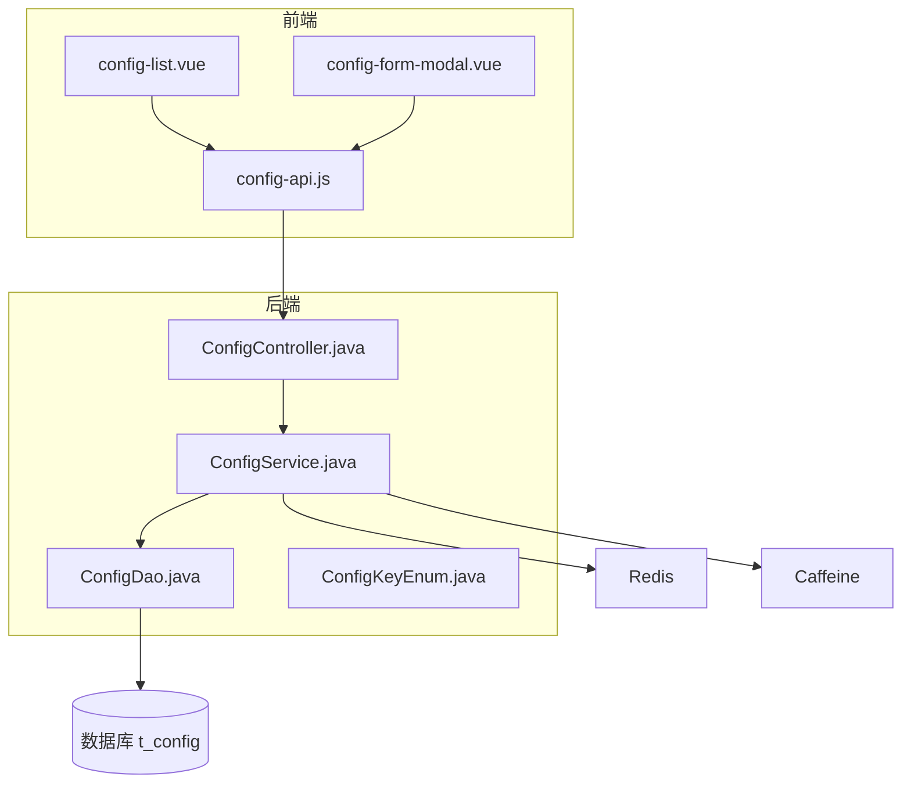
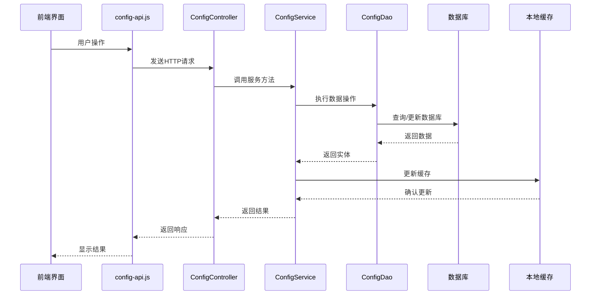
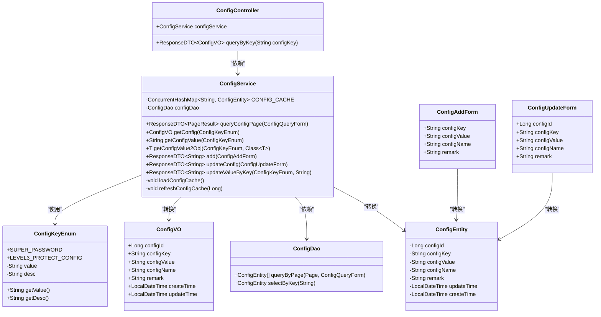
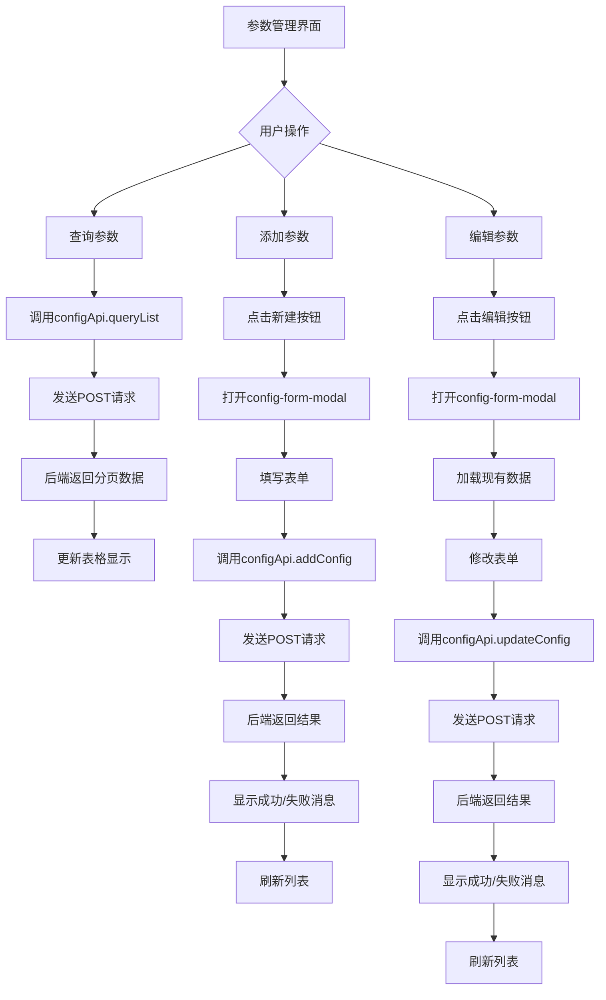
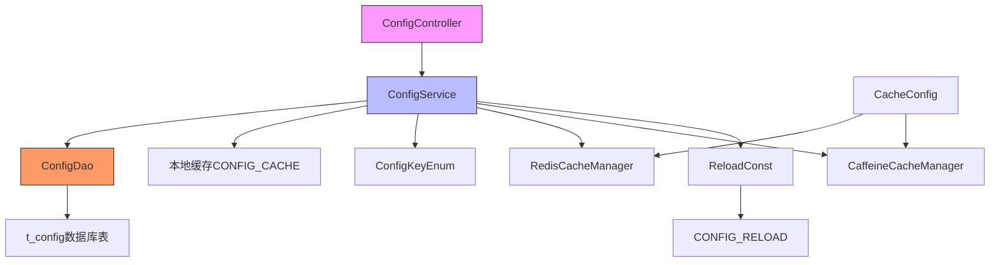
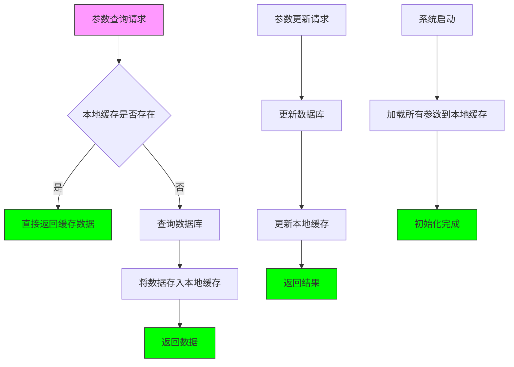

# 系统参数

<cite>
**本文档引用的文件**   
- [ConfigController.java](file://smart-admin-api-java17-springboot3/sa-base/src/main/java/net/lab1024/sa/base/module/support/config/ConfigController.java)
- [ConfigService.java](file://smart-admin-api-java17-springboot3/sa-base/src/main/java/net/lab1024/sa/base/module/support/config/ConfigService.java)
- [ConfigDao.java](file://smart-admin-api-java17-springboot3/sa-base/src/main/java/net/lab1024/sa/base/module/support/config/ConfigDao.java)
- [ConfigKeyEnum.java](file://smart-admin-api-java17-springboot3/sa-base/src/main/java/net/lab1024/sa/base/module/support/config/ConfigKeyEnum.java)
- [config-api.js](file://smart-admin-web-javascript/src/api/support/config-api.js)
- [config-list.vue](file://smart-admin-web-javascript/src/views/support/config/config-list.vue)
- [config-form-modal.vue](file://smart-admin-web-javascript/src/views/support/config/config-form-modal.vue)
- [CacheConfig.java](file://smart-admin-api-java17-springboot3/sa-base/src/main/java/net/lab1024/sa/base/config/CacheConfig.java)
- [CustomRedisCacheManager.java](file://smart-admin-api-java17-springboot3/sa-base/src/main/java/net/lab1024/sa/base/module/support/redis/CustomRedisCacheManager.java)
- [CaffeineCacheServiceImpl.java](file://smart-admin-api-java17-springboot3/sa-base/src/main/java/net/lab1024/sa/base/module/support/cache/CaffeineCacheServiceImpl.java)
- [RedisCacheServiceImpl.java](file://smart-admin-api-java17-springboot3/sa-base/src/main/java/net/lab1024/sa/base/module/support/cache/RedisCacheServiceImpl.java)
- [ReloadConst.java](file://smart-admin-api-java17-springboot3/sa-base/src/main/java/net/lab1024/sa/base/constant/ReloadConst.java)
</cite>

## 目录
1. [引言](#引言)
2. [项目结构](#项目结构)
3. [核心组件](#核心组件)
4. [架构概述](#架构概述)
5. [详细组件分析](#详细组件分析)
6. [依赖分析](#依赖分析)
7. [性能考虑](#性能考虑)
8. [故障排除指南](#故障排除指南)
9. [结论](#结论)

## 引言
IOE-DREAM项目的系统参数配置文档详细介绍了动态参数管理系统的实现。该系统通过ConfigController、ConfigService和ConfigDao三层架构实现了系统参数的增删改查操作，结合ConfigKeyEnum枚举类定义了系统参数的键名、默认值和数据类型。系统采用了本地缓存（Caffeine）和分布式缓存（Redis）相结合的缓存策略，确保了参数读取的高性能和一致性。前端通过config-api.js与后端交互，参数管理界面（config-list.vue）提供了直观的用户操作体验。

## 项目结构
IOE-DREAM项目采用前后端分离架构，系统参数管理功能主要分布在后端Java模块和前端JavaScript模块中。后端参数管理相关代码位于`smart-admin-api-java17-springboot3/sa-base/src/main/java/net/lab1024/sa/base/module/support/config/`目录下，包括控制器、服务、数据访问对象和枚举类等核心组件。前端相关代码位于`smart-admin-web-javascript/src/`目录下，包含API接口定义和Vue组件。

**图源**
- [config-api.js](file://smart-admin-web-javascript/src/api/support/config-api.js)
- [ConfigController.java](file://smart-admin-api-java17-springboot3/sa-base/src/main/java/net/lab1024/sa/base/module/support/config/ConfigController.java)
- [ConfigService.java](file://smart-admin-api-java17-springboot3/sa-base/src/main/java/net/lab1024/sa/base/module/support/config/ConfigService.java)
- [ConfigDao.java](file://smart-admin-api-java17-springboot3/sa-base/src/main/java/net/lab1024/sa/base/module/support/config/ConfigDao.java)

**章节源**
- [config-api.js](file://smart-admin-web-javascript/src/api/support/config-api.js)
- [config-list.vue](file://smart-admin-web-javascript/src/views/support/config/config-list.vue)
- [ConfigController.java](file://smart-admin-api-java17-springboot3/sa-base/src/main/java/net/lab1024/sa/base/module/support/config/ConfigController.java)

## 核心组件
系统参数管理的核心组件包括ConfigController、ConfigService和ConfigDao三层架构。ConfigController作为RESTful API的入口，处理HTTP请求并调用ConfigService进行业务逻辑处理。ConfigService是核心业务逻辑层，实现了参数的增删改查、缓存管理和数据验证等功能。ConfigDao作为数据访问层，通过MyBatis与数据库进行交互，执行具体的SQL操作。

**章节源**
- [ConfigController.java](file://smart-admin-api-java17-springboot3/sa-base/src/main/java/net/lab1024/sa/base/module/support/config/ConfigController.java)
- [ConfigService.java](file://smart-admin-api-java17-springboot3/sa-base/src/main/java/net/lab1024/sa/base/module/support/config/ConfigService.java)
- [ConfigDao.java](file://smart-admin-api-java17-springboot3/sa-base/src/main/java/net/lab1024/sa/base/module/support/config/ConfigDao.java)

## 架构概述
系统参数管理采用典型的三层架构模式，从前端界面到后端服务再到数据存储，形成了完整的请求处理链路。当用户在参数管理界面进行操作时，前端通过config-api.js发送HTTP请求到后端ConfigController，Controller调用ConfigService处理业务逻辑，Service层通过ConfigDao访问数据库并维护本地缓存。

**图源**
- [config-api.js](file://smart-admin-web-javascript/src/api/support/config-api.js)
- [ConfigController.java](file://smart-admin-api-java17-springboot3/sa-base/src/main/java/net/lab1024/sa/base/module/support/config/ConfigController.java)
- [ConfigService.java](file://smart-admin-api-java17-springboot3/sa-base/src/main/java/net/lab1024/sa/base/module/support/config/ConfigService.java)
- [ConfigDao.java](file://smart-admin-api-java17-springboot3/sa-base/src/main/java/net/lab1024/sa/base/module/support/config/ConfigDao.java)

## 详细组件分析

### 后端组件分析
系统参数管理的后端实现采用Spring Boot框架，通过三层架构分离关注点。ConfigController负责处理HTTP请求，ConfigService实现业务逻辑，ConfigDao处理数据访问。

#### 类图

**图源**
- [ConfigController.java](file://smart-admin-api-java17-springboot3/sa-base/src/main/java/net/lab1024/sa/base/module/support/config/ConfigController.java)
- [ConfigService.java](file://smart-admin-api-java17-springboot3/sa-base/src/main/java/net/lab1024/sa/base/module/support/config/ConfigService.java)
- [ConfigDao.java](file://smart-admin-api-java17-springboot3/sa-base/src/main/java/net/lab1024/sa/base/module/support/config/ConfigDao.java)
- [ConfigKeyEnum.java](file://smart-admin-api-java17-springboot3/sa-base/src/main/java/net/lab1024/sa/base/module/support/config/ConfigKeyEnum.java)

**章节源**
- [ConfigController.java](file://smart-admin-api-java17-springboot3/sa-base/src/main/java/net/lab1024/sa/base/module/support/config/ConfigController.java)
- [ConfigService.java](file://smart-admin-api-java17-springboot3/sa-base/src/main/java/net/lab1024/sa/base/module/support/config/ConfigService.java)
- [ConfigDao.java](file://smart-admin-api-java17-springboot3/sa-base/src/main/java/net/lab1024/sa/base/module/support/config/ConfigDao.java)

### 前端组件分析
前端参数管理界面由config-list.vue和config-form-modal.vue两个主要组件构成，通过config-api.js与后端进行数据交互。

#### 组件交互流程

**图源**
- [config-api.js](file://smart-admin-web-javascript/src/api/support/config-api.js)
- [config-list.vue](file://smart-admin-web-javascript/src/views/support/config/config-list.vue)
- [config-form-modal.vue](file://smart-admin-web-javascript/src/views/support/config/config-form-modal.vue)

**章节源**
- [config-api.js](file://smart-admin-web-javascript/src/api/support/config-api.js)
- [config-list.vue](file://smart-admin-web-javascript/src/views/support/config/config-list.vue)
- [config-form-modal.vue](file://smart-admin-web-javascript/src/views/support/config/config-form-modal.vue)

## 依赖分析
系统参数管理模块依赖于多个核心组件和配置，包括缓存配置、数据库访问和枚举定义等。

**图源**
- [ConfigController.java](file://smart-admin-api-java17-springboot3/sa-base/src/main/java/net/lab1024/sa/base/module/support/config/ConfigController.java)
- [ConfigService.java](file://smart-admin-api-java17-springboot3/sa-base/src/main/java/net/lab1024/sa/base/module/support/config/ConfigService.java)
- [ConfigDao.java](file://smart-admin-api-java17-springboot3/sa-base/src/main/java/net/lab1024/sa/base/module/support/config/ConfigDao.java)
- [CacheConfig.java](file://smart-admin-api-java17-springboot3/sa-base/src/main/java/net/lab1024/sa/base/config/CacheConfig.java)
- [ReloadConst.java](file://smart-admin-api-java17-springboot3/sa-base/src/main/java/net/lab1024/sa/base/constant/ReloadConst.java)

**章节源**
- [ConfigController.java](file://smart-admin-api-java17-springboot3/sa-base/src/main/java/net/lab1024/sa/base/module/support/config/ConfigController.java)
- [ConfigService.java](file://smart-admin-api-java17-springboot3/sa-base/src/main/java/net/lab1024/sa/base/module/support/config/ConfigService.java)
- [ConfigDao.java](file://smart-admin-api-java17-springboot3/sa-base/src/main/java/net/lab1024/sa/base/module/support/config/ConfigDao.java)
- [CacheConfig.java](file://smart-admin-api-java17-springboot3/sa-base/src/main/java/net/lab1024/sa/base/config/CacheConfig.java)

## 性能考虑
系统参数管理在性能方面采用了多级缓存策略，确保了参数读取的高效性。ConfigService中维护了一个ConcurrentHashMap作为本地缓存，所有参数查询都会优先从本地缓存获取，避免了频繁的数据库访问。

**图源**
- [ConfigService.java](file://smart-admin-api-java17-springboot3/sa-base/src/main/java/net/lab1024/sa/base/module/support/config/ConfigService.java)

**章节源**
- [ConfigService.java](file://smart-admin-api-java17-springboot3/sa-base/src/main/java/net/lab1024/sa/base/module/support/config/ConfigService.java)

## 故障排除指南
在使用系统参数管理功能时，可能会遇到一些常见问题，以下是一些故障排除建议：

1. **参数无法保存**：检查参数key是否已存在，系统不允许重复的参数key。
2. **缓存未更新**：确认`refreshConfigCache`方法是否被正确调用，确保本地缓存与数据库同步。
3. **前端界面无响应**：检查网络连接和API端点是否正确，确认后端服务是否正常运行。
4. **权限不足**：确认当前用户是否具有`support:config:add`、`support:config:update`等相应权限。

**章节源**
- [ConfigService.java](file://smart-admin-api-java17-springboot3/sa-base/src/main/java/net/lab1024/sa/base/module/support/config/ConfigService.java)
- [AdminConfigController.java](file://smart-admin-api-java17-springboot3/sa-admin/src/main/java/net/lab1024/sa/admin/module/system/support/AdminConfigController.java)
- [config-api.js](file://smart-admin-web-javascript/src/api/support/config-api.js)

## 结论
IOE-DREAM项目的系统参数配置系统通过清晰的三层架构实现了高效、可靠的参数管理功能。通过ConfigKeyEnum枚举类的使用，确保了参数键名的类型安全和可维护性。多级缓存机制（本地缓存和分布式缓存）保证了参数读取的高性能，而完善的前端界面提供了良好的用户体验。该系统设计合理，扩展性强，为项目的动态配置管理提供了坚实的基础。