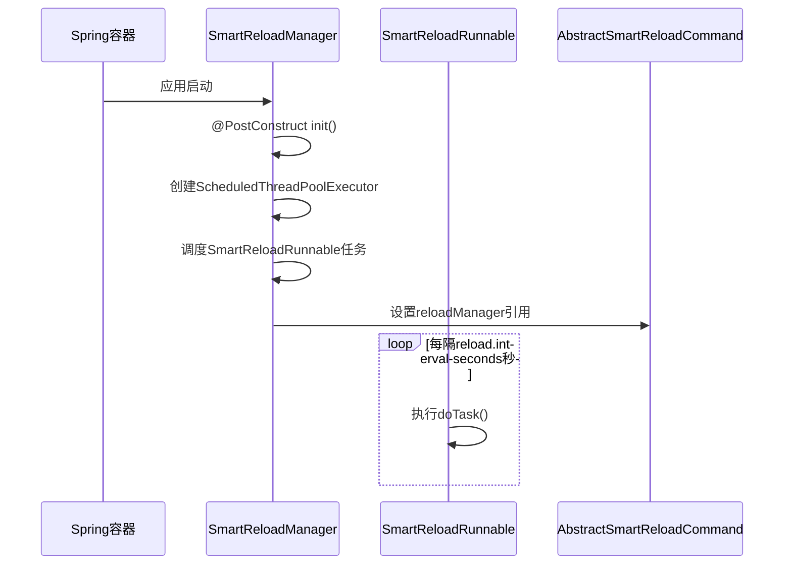
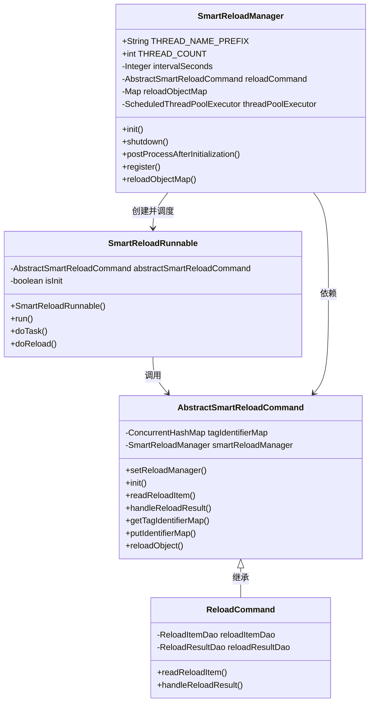
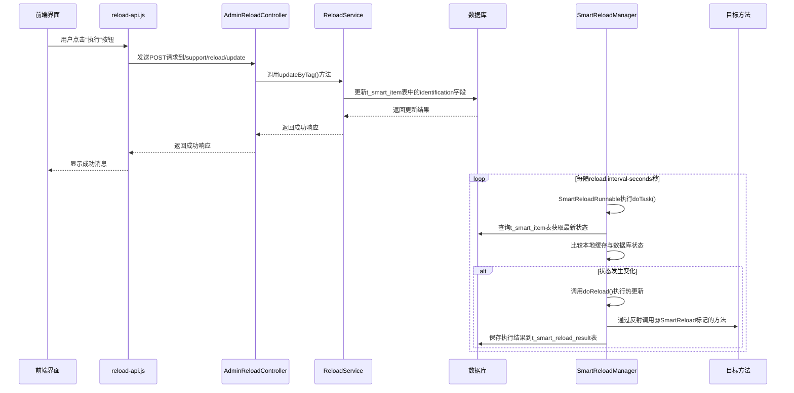
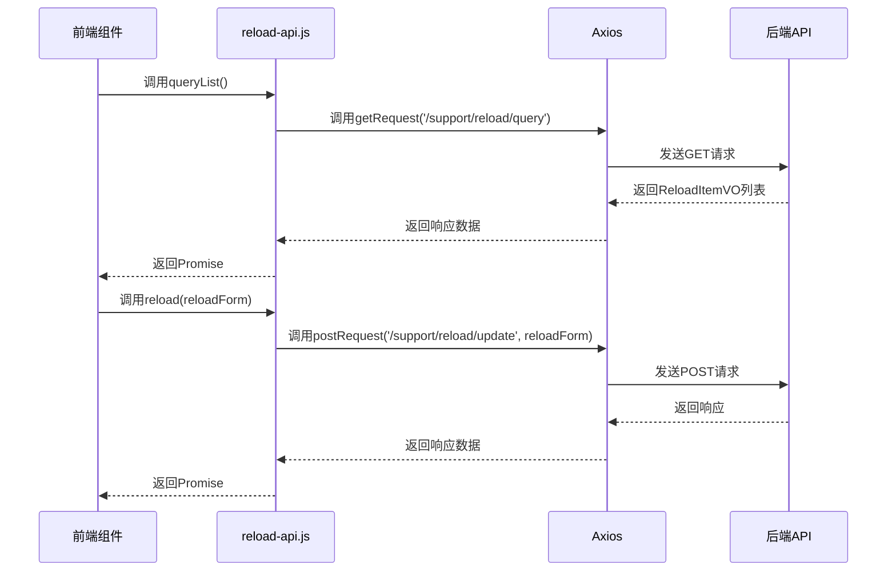
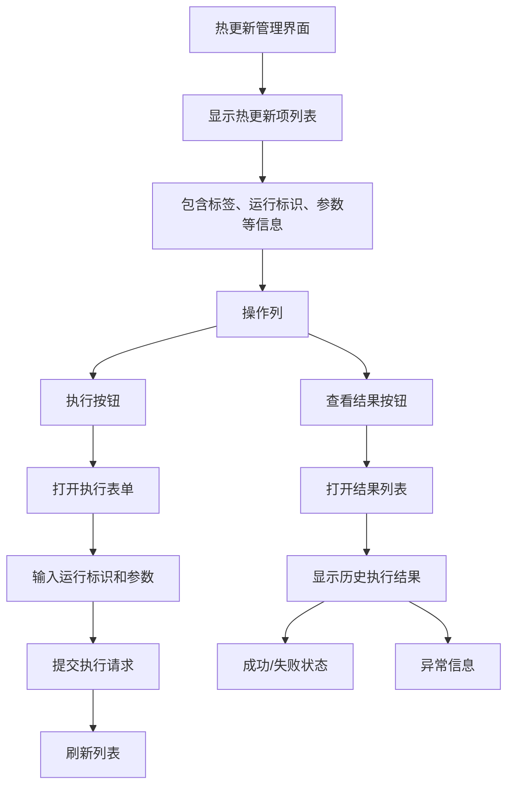

# 配置热更新

<cite>
**本文档引用的文件**   
- [SmartReload.java](file://smart-admin-api-java17-springboot3\sa-base\src\main\java\net\lab1024\sa\base\module\support\reload\core\annoation\SmartReload.java)
- [SmartReloadManager.java](file://smart-admin-api-java17-springboot3\sa-base\src\main\java\net\lab1024\sa\base\module\support\reload\core\SmartReloadManager.java)
- [AbstractSmartReloadCommand.java](file://smart-admin-api-java17-springboot3\sa-base\src\main\java\net\lab1024\sa\base\module\support\reload\core\AbstractSmartReloadCommand.java)
- [SmartReloadRunnable.java](file://smart-admin-api-java17-springboot3\sa-base\src\main\java\net\lab1024\sa\base\module\support\reload\core\thread\SmartReloadRunnable.java)
- [ReloadCommand.java](file://smart-admin-api-java17-springboot3\sa-base\src\main\java\net\lab1024\sa\base\module\support\reload\ReloadCommand.java)
- [AdminReloadController.java](file://smart-admin-api-java17-springboot3\sa-admin\src\main\java\net\lab1024\sa\admin\module\system\support\AdminReloadController.java)
- [ReloadService.java](file://smart-admin-api-java17-springboot3\sa-base\src\main\java\net\lab1024\sa\base\module\support\reload\ReloadService.java)
- [reload-api.js](file://smart-admin-web-javascript\src\api\support\reload-api.js)
- [reload-list.vue](file://smart-admin-web-javascript\src\views\support\reload\reload-list.vue)
- [do-reload-form-modal.vue](file://smart-admin-web-javascript\src\views\support\reload\do-reload-form-modal.vue)
- [reload-result-list.vue](file://smart-admin-web-javascript\src\views\support\reload\reload-result-list.vue)
- [CaffeineCacheServiceImpl.java](file://smart-admin-api-java17-springboot3\sa-base\src\main\java\net\lab1024\sa\base\module\support\cache\CaffeineCacheServiceImpl.java)
- [RedisCacheServiceImpl.java](file://smart-admin-api-java17-springboot3\sa-base\src\main\java\net\lab1024\sa\base\module\support\cache\RedisCacheServiceImpl.java)
- [ConfigService.java](file://smart-admin-api-java17-springboot3\sa-base\src\main\java\net\lab1024\sa\base\module\support\config\ConfigService.java)
- [ReloadConst.java](file://smart-admin-api-java17-springboot3\sa-base\src\main\java\net\lab1024\sa\base\constant\ReloadConst.java)
</cite>

## 目录
1. [简介](#简介)
2. [核心组件](#核心组件)
3. [工作原理](#工作原理)
4. [配置热更新流程](#配置热更新流程)
5. [前端交互机制](#前端交互机制)
6. [使用示例](#使用示例)
7. [安全考虑](#安全考虑)
8. [最佳实践](#最佳实践)

## 简介

配置热更新机制是IOE-DREAM项目中的一个重要功能，它允许在不重启应用的情况下动态更新系统配置和刷新缓存。该机制通过`smart-reload`功能实现，可以在运行时重新加载配置、刷新内存中的缓存或执行特定的代码逻辑。

该机制的主要优势包括：
- **无需重启服务**：可以在不影响系统运行的情况下更新配置
- **实时生效**：配置更改后立即生效，无需等待系统重启
- **灵活扩展**：支持自定义热更新逻辑，可应用于各种场景
- **操作安全**：通过权限控制确保只有授权用户才能执行热更新操作

**Section sources**
- [SmartReload.java](file://smart-admin-api-java17-springboot3\sa-base\src\main\java\net\lab1024\sa\base\module\support\reload\core\annoation\SmartReload.java#L1-L22)
- [reload-list.vue](file://smart-admin-web-javascript\src\views\support\reload\reload-list.vue#L1-L30)

## 核心组件

配置热更新机制由多个核心组件构成，这些组件协同工作以实现热更新功能。

### @SmartReload注解

`@SmartReload`注解是配置热更新机制的核心，用于标记需要支持热更新的方法。该注解定义在`SmartReload.java`文件中，其主要特性包括：

- **目标类型**：只能应用于方法（`ElementType.METHOD`）
- **保留策略**：运行时保留（`RetentionPolicy.RUNTIME`），确保在运行时可以通过反射访问
- **参数**：`value()`属性用于指定热更新项的标签（tag），作为唯一标识符

当一个方法被`@SmartReload`注解标记时，该方法将被注册到热更新管理器中，可以在运行时通过指定的标签调用。

### ReloadService服务

`ReloadService`是热更新功能的业务逻辑层，负责处理与热更新相关的所有操作。该服务提供了以下主要功能：

- **查询热更新项列表**：获取所有可热更新的配置项
- **查询热更新结果**：获取特定热更新操作的执行结果
- **更新热更新标识**：修改热更新项的状态标识，触发热更新操作

该服务通过调用数据访问层（DAO）与数据库交互，管理热更新项的持久化数据。

### SmartReloadManager管理器

`SmartReloadManager`是热更新机制的核心管理器，实现了Spring的`BeanPostProcessor`接口。其主要职责包括：

- **自动扫描**：在Spring容器初始化完成后，扫描所有Bean中的`@SmartReload`注解方法
- **注册管理**：将标记了`@SmartReload`注解的方法注册到内部的映射表中
- **线程调度**：启动一个守护线程，按照配置的时间间隔定期检查是否需要执行热更新

该管理器还负责初始化`SmartReloadRunnable`线程，并将其添加到调度任务中。

**Section sources**
- [SmartReload.java](file://smart-admin-api-java17-springboot3\sa-base\src\main\java\net\lab1024\sa\base\module\support\reload\core\annoation\SmartReload.java#L1-L22)
- [ReloadService.java](file://smart-admin-api-java17-springboot3\sa-base\src\main\java\net\lab1024\sa\base\module\support\reload\ReloadService.java#L1-L69)
- [SmartReloadManager.java](file://smart-admin-api-java17-springboot3\sa-base\src\main\java\net\lab1024\sa\base\module\support\reload\core\SmartReloadManager.java#L1-L122)

## 工作原理

配置热更新机制的工作原理基于定时轮询和反射调用的组合，通过一系列组件的协同工作实现热更新功能。

### SmartReloadManager初始化流程



**Diagram sources**
- [SmartReloadManager.java](file://smart-admin-api-java17-springboot3\sa-base\src\main\java\net\lab1024\sa\base\module\support\reload\core\SmartReloadManager.java#L52-L67)
- [SmartReloadRunnable.java](file://smart-admin-api-java17-springboot3\sa-base\src\main\java\net\lab1024\sa\base\module\support\reload\core\thread\SmartReloadRunnable.java#L35-L42)

### 热更新执行流程

```mermaid
flowchart TD
A[开始] --> B{SmartReloadRunnable.doTask()}
B --> C[调用readReloadItem()获取最新状态]
C --> D[获取本地缓存的标识]
D --> E{标识是否变化?}
E --> |是| F[调用putIdentifierMap()更新本地缓存]
E --> |否| G[结束]
F --> H[调用doReload()执行热更新]
H --> I[通过反射调用目标方法]
I --> J[捕获执行结果]
J --> K[调用handleReloadResult()处理结果]
K --> G
```

**Diagram sources**
- [SmartReloadRunnable.java](file://smart-admin-api-java17-springboot3\sa-base\src\main\java\net\lab1024\sa\base\module\support\reload\core\thread\SmartReloadRunnable.java#L47-L67)
- [SmartReloadRunnable.java](file://smart-admin-api-java17-springboot3\sa-base\src\main\java\net\lab1024\sa\base\module\support\reload\core\thread\SmartReloadRunnable.java#L76-L118)

### 组件关系图



**Diagram sources**
- [SmartReloadManager.java](file://smart-admin-api-java17-springboot3\sa-base\src\main\java\net\lab1024\sa\base\module\support\reload\core\SmartReloadManager.java#L36-L119)
- [AbstractSmartReloadCommand.java](file://smart-admin-api-java17-springboot3\sa-base\src\main\java\net\lab1024\sa\base\module\support\reload\core\AbstractSmartReloadCommand.java#L21-L96)
- [SmartReloadRunnable.java](file://smart-admin-api-java17-springboot3\sa-base\src\main\java\net\lab1024\sa\base\module\support\reload\core\thread\SmartReloadRunnable.java#L25-L121)
- [ReloadCommand.java](file://smart-admin-api-java17-springboot3\sa-base\src\main\java\net\lab1024\sa\base\module\support\reload\ReloadCommand.java#L26-L57)

## 配置热更新流程

配置热更新的完整流程包括注册reload命令、执行热更新操作以及记录和查询更新结果。

### 热更新触发流程



**Diagram sources**
- [AdminReloadController.java](file://smart-admin-api-java17-springboot3\sa-admin\src\main\java\net\lab1024\sa\admin\module\system\support\AdminReloadController.java#L48-L53)
- [ReloadService.java](file://smart-admin-api-java17-springboot3\sa-base\src\main\java\net\lab1024\sa\base\module\support\reload\ReloadService.java#L57-L66)
- [SmartReloadRunnable.java](file://smart-admin-api-java17-springboot3\sa-base\src\main\java\net\lab1024\sa\base\module\support\reload\core\thread\SmartReloadRunnable.java#L47-L67)

### 热更新结果记录与查询

热更新操作的结果会被记录到数据库中，以便后续查询和审计。系统提供了完整的查询接口来获取热更新的历史记录。

```mermaid
flowchart TD
A[开始] --> B[调用handleReloadResult()]
B --> C{执行结果}
C --> |成功| D[设置result=true, exception=null]
C --> |失败| E[设置result=false, exception=异常信息]
D --> F[创建ReloadResultEntity对象]
E --> F
F --> G[调用reloadResultDao.insert()保存到数据库]
G --> H[结束]
I[查询热更新结果] --> J[调用queryReloadItemResult()]
J --> K[调用reloadResultDao.query()从数据库查询]
K --> L[返回ReloadResultVO列表]
L --> M[前端展示结果]
```

**Diagram sources**
- [ReloadCommand.java](file://smart-admin-api-java17-springboot3\sa-base\src\main\java\net\lab1024\sa\base\module\support\reload\ReloadCommand.java#L51-L55)
- [ReloadService.java](file://smart-admin-api-java17-springboot3\sa-base\src\main\java\net\lab1024\sa\base\module\support\reload\ReloadService.java#L45-L48)
- [ReloadResultVO.java](file://smart-admin-api-java17-springboot3\sa-base\src\main\java\net\lab1024\sa\base\module\support\reload\domain\ReloadResultVO.java#L1-L34)

## 前端交互机制

前端通过`reload-api.js`与后端进行交互，并通过`reload-list.vue`等组件提供用户界面。

### API交互流程



**Diagram sources**
- [reload-api.js](file://smart-admin-web-javascript\src\api\support\reload-api.js#L1-L26)
- [AdminReloadController.java](file://smart-admin-api-java17-springboot3\sa-admin\src\main\java\net\lab1024\sa\admin\module\system\support\AdminReloadController.java#L36-L54)

### 热更新管理界面

热更新管理界面（`reload-list.vue`）提供了完整的用户交互功能，包括查看热更新项列表、执行热更新操作和查看执行结果。



**Diagram sources**
- [reload-list.vue](file://smart-admin-web-javascript\src\views\support\reload\reload-list.vue#L1-L134)
- [do-reload-form-modal.vue](file://smart-admin-web-javascript\src\views\support\reload\do-reload-form-modal.vue#L1-L90)
- [reload-result-list.vue](file://smart-admin-web-javascript\src\views\support\reload\reload-result-list.vue#L1-L40)

## 使用示例

### 为自定义组件添加热更新支持

要为自定义组件添加热更新支持，需要实现以下步骤：

1. **创建自定义命令类**：继承`AbstractSmartReloadCommand`类
2. **实现readReloadItem()方法**：定义如何获取热更新项
3. **实现handleReloadResult()方法**：定义如何处理热更新结果
4. **在目标方法上添加@SmartReload注解**

```mermaid
flowchart TD
A[开始] --> B[创建自定义命令类]
B --> C[继承AbstractSmartReloadCommand]
C --> D[实现readReloadItem()方法]
D --> E[实现handleReloadResult()方法]
E --> F[在Spring配置中注册为@Component]
F --> G[在目标服务类中]
G --> H[添加@SmartReload注解到方法]
H --> I[指定唯一的tag值]
I --> J[确保方法参数不超过1个]
J --> K[结束]
```

**Section sources**
- [AbstractSmartReloadCommand.java](file://smart-admin-api-java17-springboot3\sa-base\src\main\java\net\lab1024\sa\base\module\support\reload\core\AbstractSmartReloadCommand.java#L21-L96)
- [SmartReload.java](file://smart-admin-api-java17-springboot3\sa-base\src\main\java\net\lab1024\sa\base\module\support\reload\core\annoation\SmartReload.java#L1-L22)

### 实际应用示例

在IOE-DREAM项目中，`@SmartReload`注解已被应用于多个核心组件：

- **缓存服务**：`CaffeineCacheServiceImpl`和`RedisCacheServiceImpl`中的`reload()`方法使用`@SmartReload(ReloadConst.CACHE_SERVICE)`注解，用于刷新缓存
- **配置服务**：`ConfigService`中的`reload()`方法使用`@SmartReload(ReloadConst.CONFIG_RELOAD)`注解，用于重新加载系统配置

这些示例展示了如何将热更新机制应用于实际场景，确保系统配置和缓存能够在运行时动态更新。

**Section sources**
- [CaffeineCacheServiceImpl.java](file://smart-admin-api-java17-springboot3\sa-base\src\main\java\net\lab1024\sa\base\module\support\cache\CaffeineCacheServiceImpl.java#L60)
- [RedisCacheServiceImpl.java](file://smart-admin-api-java17-springboot3\sa-base\src\main\java\net\lab1024\sa\base\module\support\cache\RedisCacheServiceImpl.java#L75)
- [ConfigService.java](file://smart-admin-api-java17-springboot3\sa-base\src\main\java\net\lab1024\sa\base\module\support\config\ConfigService.java#L44)
- [ReloadConst.java](file://smart-admin-api-java17-springboot3\sa-base\src\main\java\net\lab1024\sa\base\constant\ReloadConst.java#L1-L18)

## 安全考虑

配置热更新机制包含多项安全措施，确保系统的稳定性和安全性。

### 权限控制

系统通过注解实现了细粒度的权限控制：

- **执行权限**：`v-privilege="'support:reload:execute'"`控制执行热更新操作的权限
- **结果查看权限**：`v-privilege="'support:reload:result'"`控制查看热更新结果的权限
- **更新权限**：`@SaCheckPermission("support:reload:update")`控制更新热更新标识的权限

这些权限控制确保只有授权用户才能执行敏感操作。

### 执行日志记录

所有热更新操作都会被记录到数据库中，包括：

- **操作时间**：精确到毫秒的执行时间
- **操作结果**：成功或失败状态
- **异常信息**：如果执行失败，记录详细的异常堆栈
- **操作参数**：执行时使用的参数值

这些日志记录为系统审计和故障排查提供了重要依据。

**Section sources**
- [reload-list.vue](file://smart-admin-web-javascript\src\views\support\reload\reload-list.vue#L50-L51)
- [AdminReloadController.java](file://smart-admin-api-java17-springboot3\sa-admin\src\main\java\net\lab1024\sa\admin\module\system\support\AdminReloadController.java#L43-L44)
- [AdminReloadController.java](file://smart-admin-api-java17-springboot3\sa-admin\src\main\java\net\lab1024\sa\admin\module\system\support\AdminReloadController.java#L50-L51)
- [ReloadCommand.java](file://smart-admin-api-java17-springboot3\sa-base\src\main\java\net\lab1024\sa\base\module\support\reload\ReloadCommand.java#L51-L55)

## 最佳实践

### 设计可热更新的组件

在设计支持热更新的组件时，应遵循以下最佳实践：

1. **单一职责**：每个热更新方法应只负责一个明确的功能
2. **幂等性**：确保热更新操作可以安全地重复执行
3. **快速执行**：热更新方法应尽可能快速完成，避免长时间阻塞
4. **错误处理**：妥善处理可能的异常情况，避免影响系统稳定性

### 处理更新失败的回滚策略

虽然热更新机制本身不提供自动回滚功能，但可以通过以下方式实现类似效果：

1. **状态备份**：在执行热更新前备份关键状态
2. **健康检查**：执行热更新后进行健康检查，验证系统状态
3. **手动回滚**：提供专门的回滚方法，通过相同的热更新机制调用
4. **监控告警**：设置监控告警，及时发现和处理热更新失败的情况

这些最佳实践有助于确保热更新功能的安全性和可靠性，最大限度地减少对系统稳定性的影响。

**Section sources**
- [SmartReloadManager.java](file://smart-admin-api-java17-springboot3\sa-base\src\main\java\net\lab1024\sa\base\module\support\reload\core\SmartReloadManager.java#L87-L91)
- [SmartReloadRunnable.java](file://smart-admin-api-java17-springboot3\sa-base\src\main\java\net\lab1024\sa\base\module\support\reload\core\thread\SmartReloadRunnable.java#L109-L116)
- [SmartReloadManager.java](file://smart-admin-api-java17-springboot3\sa-base\src\main\java\net\lab1024\sa\base\module\support\reload\core\SmartReloadManager.java#L105-L107)