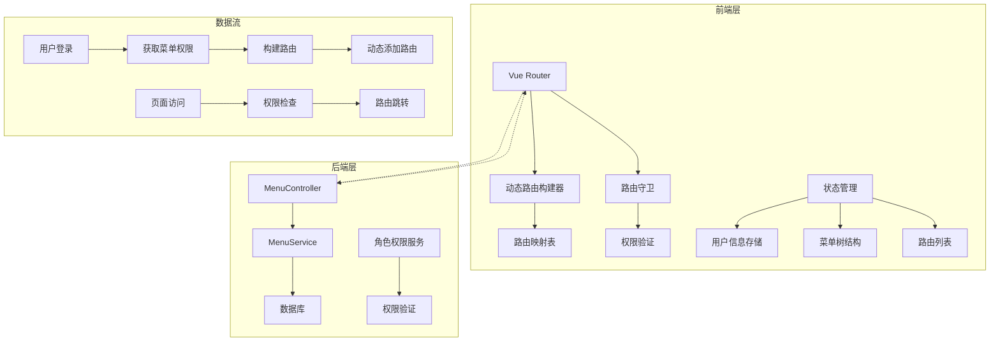
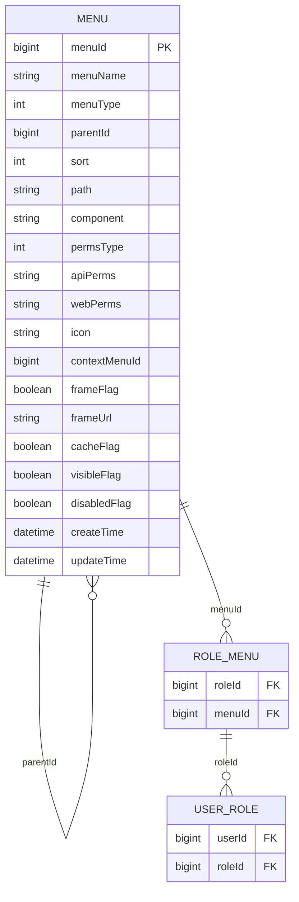
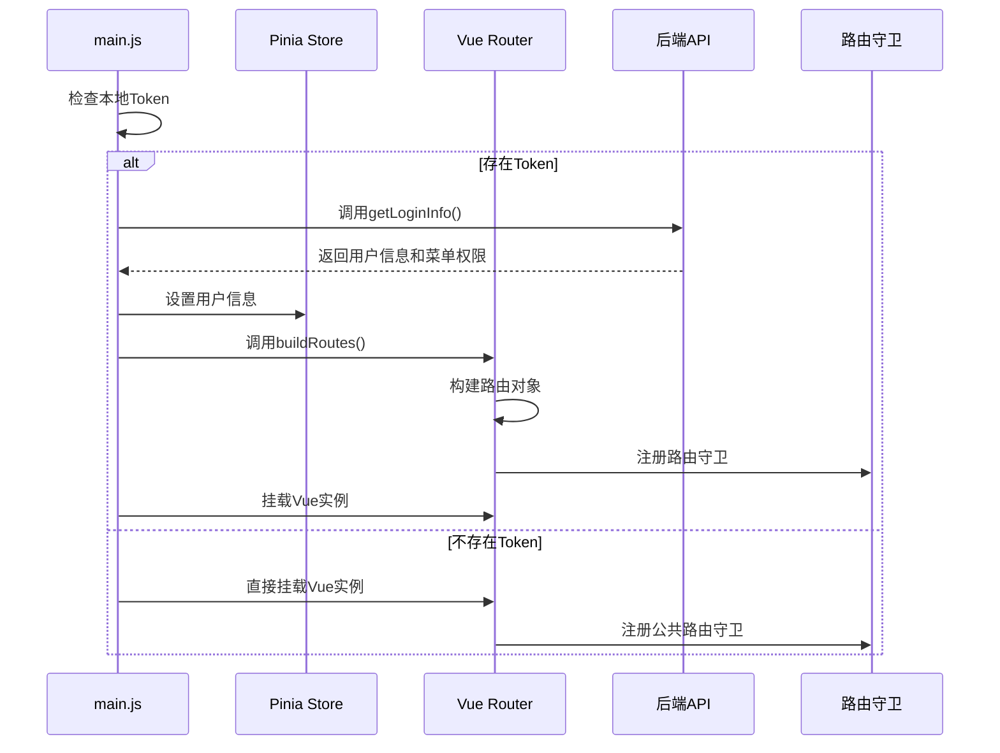
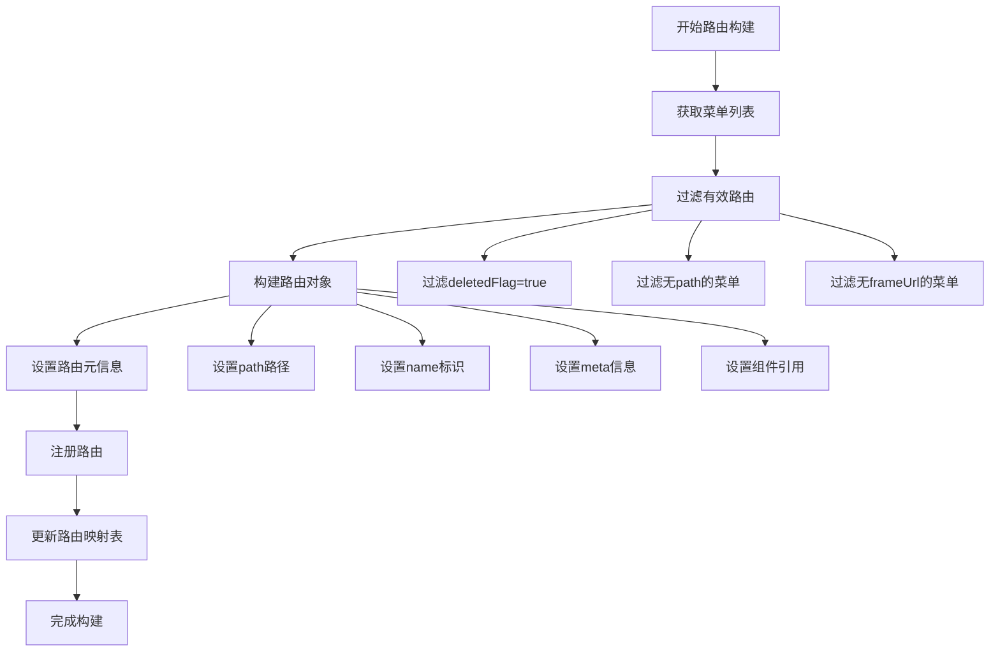
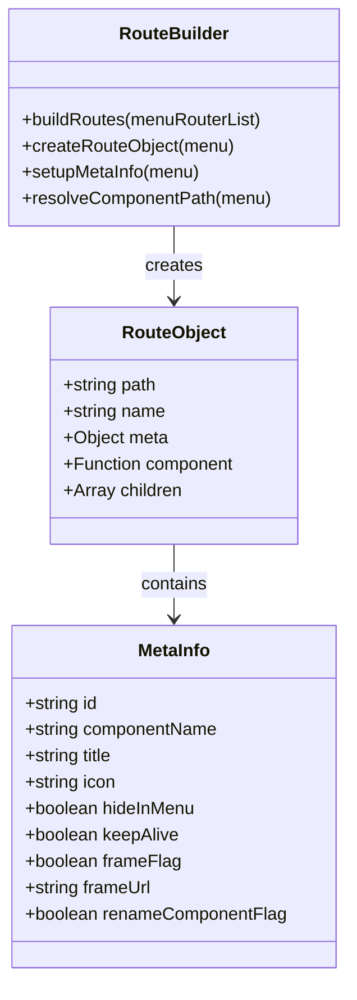
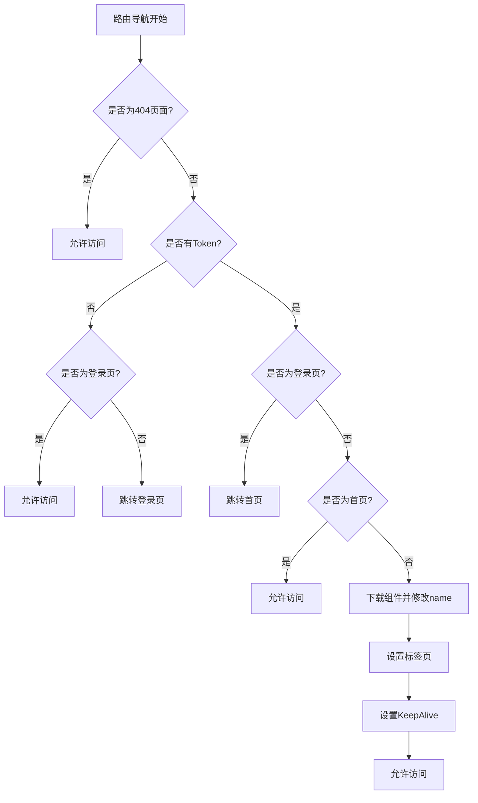
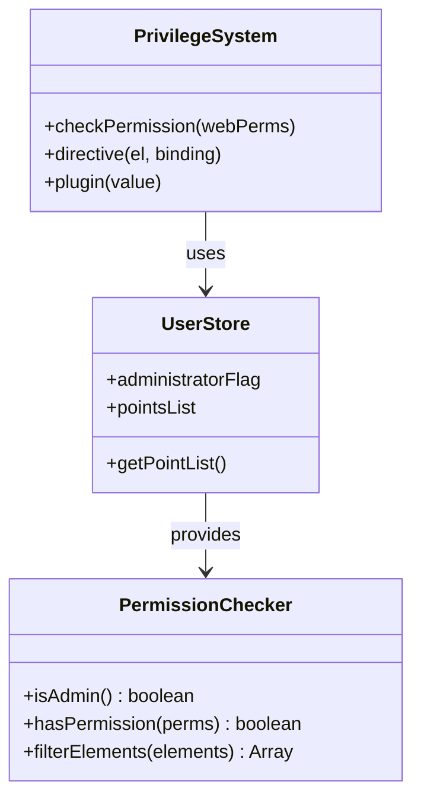

# 动态路由

<cite>
**本文档引用的文件**
- [smart-admin-web-javascript/src/router/index.js](file://smart-admin-web-javascript/src/router/index.js)
- [smart-admin-web-javascript/src/views/system/menu/menu-data-handler.js](file://smart-admin-web-javascript/src/views/system/menu/menu-data-handler.js)
- [smart-admin-web-javascript/src/store/modules/system/user.js](file://smart-admin-web-javascript/src/store/modules/system/user.js)
- [smart-admin-web-javascript/src/api/system/menu-api.js](file://smart-admin-web-javascript/src/api/system/menu-api.js)
- [smart-admin-web-javascript/src/main.js](file://smart-admin-web-javascript/src/main.js)
- [smart-admin-web-javascript/src/directives/privilege.js](file://smart-admin-web-javascript/src/directives/privilege.js)
- [smart-admin-web-javascript/src/plugins/privilege-plugin.js](file://smart-admin-web-javascript/src/plugins/privilege-plugin.js)
- [smart-admin-api-java17-springboot3/sa-admin/src/main/java/net/lab1024/sa/admin/module/system/menu/controller/MenuController.java](file://smart-admin-api-java17-springboot3/sa-admin/src/main/java/net/lab1024/sa/admin/module/system/menu/controller/MenuController.java)
- [smart-admin-api-java17-springboot3/sa-admin/src/main/java/net/lab1024/sa/admin/module/system/menu/service/MenuService.java](file://smart-admin-api-java17-springboot3/sa-admin/src/main/java/net/lab1024/sa/admin/module/system/menu/service/MenuService.java)
- [smart-admin-web-javascript/docs/vue3-admin-system-prompt.md](file://smart-admin-web-javascript/docs/vue3-admin-system-prompt.md)
</cite>

## 目录
1. [简介](#简介)
2. [系统架构概述](#系统架构概述)
3. [后端菜单数据结构](#后端菜单数据结构)
4. [前端路由初始化流程](#前端路由初始化流程)
5. [动态路由构建机制](#动态路由构建机制)
6. [路由守卫实现](#路由守卫实现)
7. [权限控制系统](#权限控制系统)
8. [路由懒加载机制](#路由懒加载机制)
9. [配置方法与使用示例](#配置方法与使用示例)
10. [常见问题解决方案](#常见问题解决方案)
11. [总结](#总结)

## 简介

IOE-DREAM项目采用了一套完整的动态路由系统，实现了基于角色的权限控制和灵活的路由管理。该系统通过后端菜单数据驱动前端路由生成，支持动态权限验证、路由懒加载和页面缓存等功能，为大型企业级应用提供了强大的路由管理能力。

## 系统架构概述

动态路由系统采用前后端分离的架构设计，主要包含以下核心组件：



**图表来源**
- [smart-admin-web-javascript/src/router/index.js](file://smart-admin-web-javascript/src/router/index.js#L1-L166)
- [smart-admin-api-java17-springboot3/sa-admin/src/main/java/net/lab1024/sa/admin/module/system/menu/controller/MenuController.java](file://smart-admin-api-java17-springboot3/sa-admin/src/main/java/net/lab1024/sa/admin/module/system/menu/controller/MenuController.java#L29-L82)

## 后端菜单数据结构

### 菜单实体设计

后端菜单数据采用树形结构设计，支持多级嵌套和多种菜单类型：



**图表来源**
- [smart-admin-api-java17-springboot3/sa-admin/src/main/java/net/lab1024/sa/admin/module/system/menu/service/MenuService.java](file://smart-admin-api-java17-springboot3/sa-admin/src/main/java/net/lab1024/sa/admin/module/system/menu/service/MenuService.java#L27-L72)

### 菜单类型定义

| 菜单类型 | 数值 | 描述 | 用途 |
|---------|------|------|------|
| 目录 | 1 | 用于组织菜单结构的容器 | 支持子菜单嵌套 |
| 菜单 | 2 | 实际的页面链接 | 映射到具体路由 |
| 功能点 | 3 | 最小权限单元 | 控制按钮级权限 |

### 权限标识体系

系统采用双层权限控制机制：

- **API权限**：后端接口级别的权限控制
- **前端权限**：UI元素级别的权限控制

**章节来源**
- [smart-admin-api-java17-springboot3/sa-admin/src/main/java/net/lab1024/sa/admin/module/system/menu/controller/MenuController.java](file://smart-admin-api-java17-springboot3/sa-admin/src/main/java/net/lab1024/sa/admin/module/system/menu/controller/MenuController.java#L39-L81)

## 前端路由初始化流程

### 应用启动流程

前端应用启动时遵循特定的初始化顺序，确保路由系统的正确加载：



**图表来源**
- [smart-admin-web-javascript/src/main.js](file://smart-admin-web-javascript/src/main.js#L48-L106)

### 路由构建过程

路由构建是一个多步骤的过程，涉及数据获取、过滤和对象构建：



**图表来源**
- [smart-admin-web-javascript/src/router/index.js](file://smart-admin-web-javascript/src/router/index.js#L98-L165)

**章节来源**
- [smart-admin-web-javascript/src/main.js](file://smart-admin-web-javascript/src/main.js#L48-L70)
- [smart-admin-web-javascript/src/router/index.js](file://smart-admin-web-javascript/src/router/index.js#L98-L165)

## 动态路由构建机制

### 路由对象构建

动态路由的核心在于如何将后端菜单数据转换为Vue Router可用的路由对象：



**图表来源**
- [smart-admin-web-javascript/src/router/index.js](file://smart-admin-web-javascript/src/router/index.js#L120-L155)

### 组件懒加载机制

系统采用Vite的`import.meta.glob`实现组件的懒加载：

```javascript
// 组件懒加载实现
const modules = import.meta.glob('../views/**/**.vue');
route.component = modules[relativePath];
```

这种方式的优势：
- 减少初始包体积
- 按需加载页面组件
- 提升应用启动性能

### 路由映射表管理

系统维护一个全局的路由映射表，用于快速查找和管理路由信息：

```javascript
// 路由映射表实现
const routerMap = new Map();
routerMap.set(e.menuId.toString(), route);
```

**章节来源**
- [smart-admin-web-javascript/src/router/index.js](file://smart-admin-web-javascript/src/router/index.js#L95-L165)

## 路由守卫实现

### 守卫流程设计

路由守卫负责在页面导航过程中执行各种验证逻辑：



**图表来源**
- [smart-admin-web-javascript/src/router/index.js](file://smart-admin-web-javascript/src/router/index.js#L30-L87)

### 登录验证机制

登录验证是最基础的守卫逻辑，确保用户身份的有效性：

```javascript
// 登录验证实现
const token = localRead(LocalStorageKeyConst.USER_TOKEN);
if (!token) {
    useUserStore().logout();
    if (to.path === PAGE_PATH_LOGIN) {
        next();
    } else {
        next({ path: PAGE_PATH_LOGIN });
    }
    return;
}
```

### 页面缓存策略

系统支持基于路由的页面缓存，提升用户体验：

```javascript
// KeepAlive缓存实现
if (to.meta.keepAlive) {
    nextTick(() => {
        useUserStore().pushKeepAliveIncludes(to.meta.componentName);
    });
}
```

**章节来源**
- [smart-admin-web-javascript/src/router/index.js](file://smart-admin-web-javascript/src/router/index.js#L30-L87)

## 权限控制系统

### 前端权限验证

系统提供多层次的权限验证机制：



**图表来源**
- [smart-admin-web-javascript/src/directives/privilege.js](file://smart-admin-web-javascript/src/directives/privilege.js#L14-L29)
- [smart-admin-web-javascript/src/plugins/privilege-plugin.js](file://smart-admin-web-javascript/src/plugins/privilege-plugin.js#L13-L24)

### 权限指令使用

提供`v-privilege`指令用于DOM元素的权限控制：

```javascript
// 指令使用示例
<a-button v-privilege="'system:menu:add'" type="primary">
    添加菜单
</a-button>
```

### 权限插件集成

权限插件提供全局的权限检查方法：

```javascript
// 全局权限检查
if (this.$privilege('system:menu:update')) {
    // 执行更新操作
}
```

### 功能点权限管理

系统将最小权限单元称为"功能点"，支持细粒度的权限控制：

```javascript
// 功能点权限检查
const hasPermission = _.some(userPointsList, ['webPerms', binding.value]);
```

**章节来源**
- [smart-admin-web-javascript/src/directives/privilege.js](file://smart-admin-web-javascript/src/directives/privilege.js#L14-L29)
- [smart-admin-web-javascript/src/plugins/privilege-plugin.js](file://smart-admin-web-javascript/src/plugins/privilege-plugin.js#L13-L30)

## 路由懒加载机制

### 组件按需加载

系统采用Vite的现代懒加载技术：

```javascript
// 懒加载实现
if (e.frameFlag) {
    route.component = () => import('../components/framework/iframe/iframe-index.vue');
} else {
    let relativePath = `../views${componentPath}`;
    route.component = modules[relativePath];
}
```

### 组件命名优化

为了支持KeepAlive缓存，系统会动态修改组件的name属性：

```javascript
// 组件name优化
if (toRouterInfo && _.isFunction(toRouterInfo.component) && 
    toRouterInfo.meta.renameComponentFlag === false) {
    toRouterInfo.component().then((val) => {
        val.default.name = to.meta.componentName;
        toRouterInfo.meta.renameComponentFlag = true;
    });
}
```

### 性能优化策略

- **代码分割**：按路由拆分代码块
- **预加载**：关键路由的预加载
- **缓存管理**：智能的KeepAlive缓存策略

**章节来源**
- [smart-admin-web-javascript/src/router/index.js](file://smart-admin-web-javascript/src/router/index.js#L146-L155)
- [smart-admin-web-javascript/src/router/index.js](file://smart-admin-web-javascript/src/router/index.js#L65-L75)

## 配置方法与使用示例

### 后端菜单配置

#### SQL配置示例

```sql
-- 创建菜单目录
INSERT INTO t_menu (
    menu_name, menu_type, parent_id, sort, path, component, 
    perms_type, api_perms, web_perms, icon, frame_flag, 
    cache_flag, visible_flag, disabled_flag
) VALUES (
    '系统管理', 1, 0, 1, NULL, NULL, 1, NULL, NULL, 
    'SettingOutlined', 0, 0, 1, 0
);

-- 创建菜单项
INSERT INTO t_menu (
    menu_name, menu_type, parent_id, sort, path, component, 
    perms_type, api_perms, web_perms, icon, frame_flag, 
    cache_flag, visible_flag, disabled_flag
) VALUES (
    '用户管理', 2, 1, 1, '/system/user', 
    '/system/user/index.vue', 1, '/system/user/list', 
    'system:user:list', 'UserOutlined', 0, 1, 1, 0
);
```

### 前端路由配置

#### 动态路由添加

```javascript
// 在main.js中自动处理
async function getLoginInfo() {
    const res = await loginApi.getLoginInfo();
    let menuRouterList = res.data.menuList.filter((e) => e.path || e.frameUrl);
    buildRoutes(menuRouterList);
    // 其他初始化逻辑...
}
```

#### 路由守卫配置

```javascript
// 路由守卫自动注册
router.beforeEach(async (to, from, next) => {
    // 自动处理各种验证逻辑
    // ...
});
```

### 权限配置示例

#### 功能点权限

```javascript
// 在菜单中配置功能点权限
INSERT INTO t_menu (
    menu_name, menu_type, parent_id, sort, path, component, 
    perms_type, api_perms, web_perms, icon, frame_flag, 
    cache_flag, visible_flag, disabled_flag
) VALUES (
    '查询用户', 3, 2, 1, NULL, NULL, 1, '/system/user/query', 
    'system:user:query', NULL, 0, 0, 1, 0
);
```

#### 前端权限指令

```html
<!-- 使用权限指令 -->
<a-button v-privilege="'system:user:add'" type="primary">
    新增用户
</a-button>

<a-button v-privilege="'system:user:delete'" type="danger">
    删除用户
</a-button>
```

**章节来源**
- [smart-admin-web-javascript/docs/vue3-admin-system-prompt.md](file://smart-admin-web-javascript/docs/vue3-admin-system-prompt.md#L1509-L1588)

## 常见问题解决方案

### 路由无法加载问题

#### 问题现象
- 页面空白或404错误
- 路由不生效

#### 解决方案
1. **检查菜单配置**
   ```sql
   -- 确保菜单有正确的path和component
   SELECT menu_name, path, component FROM t_menu WHERE menu_type = 2;
   ```

2. **验证组件路径**
   ```javascript
   // 检查组件路径是否正确
   console.log(modules[`../views${e.component}`]);
   ```

3. **检查路由构建**
   ```javascript
   // 在buildRoutes中添加调试
   console.log('Building route:', e.menuName, e.path);
   ```

### 权限验证失败

#### 问题现象
- 权限指令不生效
- 功能点权限被拒绝

#### 解决方案
1. **检查权限配置**
   ```sql
   -- 确保用户有对应的功能点权限
   SELECT m.web_perms FROM t_menu m
   JOIN t_role_menu rm ON m.menu_id = rm.menu_id
   WHERE rm.role_id IN (SELECT role_id FROM t_user_role WHERE user_id = ?);
   ```

2. **验证权限指令**
   ```javascript
   // 检查权限列表
   console.log(useUserStore().getPointList);
   ```

3. **检查权限插件**
   ```javascript
   // 测试权限插件
   console.log(this.$privilege('system:user:list'));
   ```

### 性能优化问题

#### 问题现象
- 页面加载缓慢
- 内存占用过高

#### 解决方案
1. **启用路由缓存**
   ```javascript
   // 在菜单中启用缓存
   INSERT INTO t_menu (...) VALUES (... , 1, ...);
   ```

2. **优化组件大小**
   ```javascript
   // 按需引入组件
   import { Button, Table } from 'ant-design-vue';
   ```

3. **延迟加载非关键组件**
   ```javascript
   // 使用懒加载
   const LazyComponent = () => import('./LazyComponent.vue');
   ```

### 路由守卫异常

#### 问题现象
- 路由循环跳转
- 登录状态异常

#### 解决方案
1. **检查Token处理**
   ```javascript
   // 确保Token正确处理
   const token = localRead(LocalStorageKeyConst.USER_TOKEN);
   if (!token && to.path !== '/login') {
       next({ path: '/login' });
   }
   ```

2. **调试路由守卫**
   ```javascript
   // 添加详细日志
   console.log('Route guard:', to.path, from.path);
   ```

3. **处理特殊路由**
   ```javascript
   // 特殊路由的处理逻辑
   if (to.path === '/login' && token) {
       next({ path: '/home' });
   }
   ```

**章节来源**
- [smart-admin-web-javascript/src/router/index.js](file://smart-admin-web-javascript/src/router/index.js#L30-L87)
- [smart-admin-web-javascript/src/directives/privilege.js](file://smart-admin-web-javascript/src/directives/privilege.js#L14-L29)

## 总结

IOE-DREAM项目的动态路由系统是一个完整的企业级解决方案，具有以下特点：

### 核心优势

1. **灵活的权限控制**：支持菜单级别和功能点级别的双重权限控制
2. **高效的路由管理**：基于后端数据的动态路由生成，减少前端配置
3. **优秀的性能表现**：组件懒加载和智能缓存策略
4. **完善的开发体验**：丰富的配置选项和调试工具

### 技术亮点

- **前后端分离**：清晰的职责划分，便于维护和扩展
- **现代化技术栈**：基于Vue 3和Vite的最新技术实践
- **类型安全**：完整的TypeScript支持
- **国际化支持**：内置的多语言路由标题支持

### 应用价值

该动态路由系统为企业级应用提供了可靠的基础架构，能够满足复杂业务场景下的路由管理和权限控制需求，是构建大型管理系统的重要基础设施。

通过本文档的详细介绍，开发者可以深入理解系统的实现原理，掌握配置方法，并能够根据实际需求进行定制和扩展。