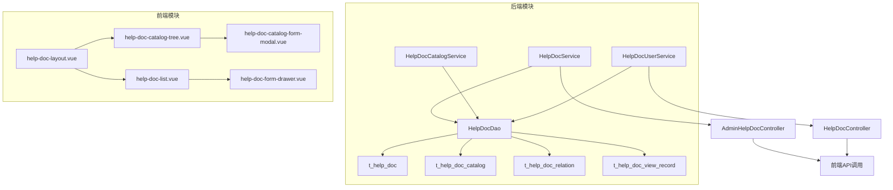
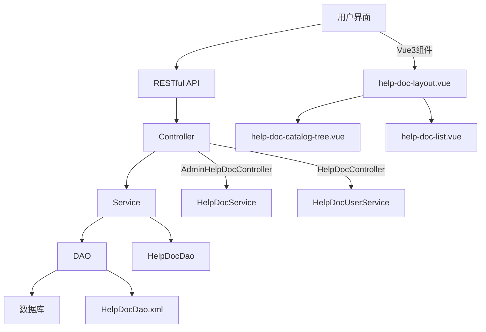
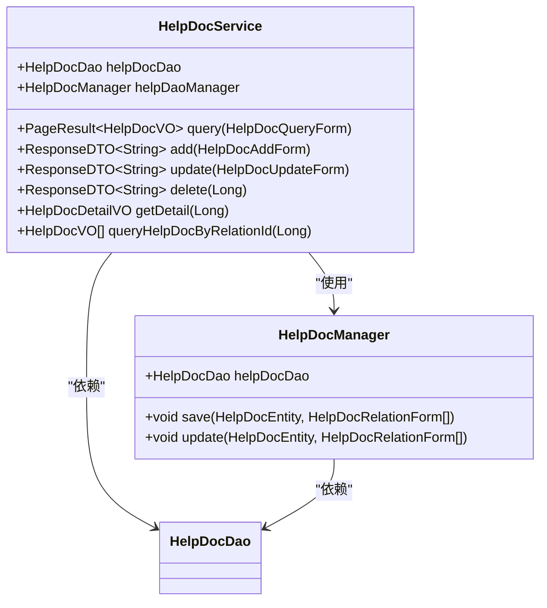
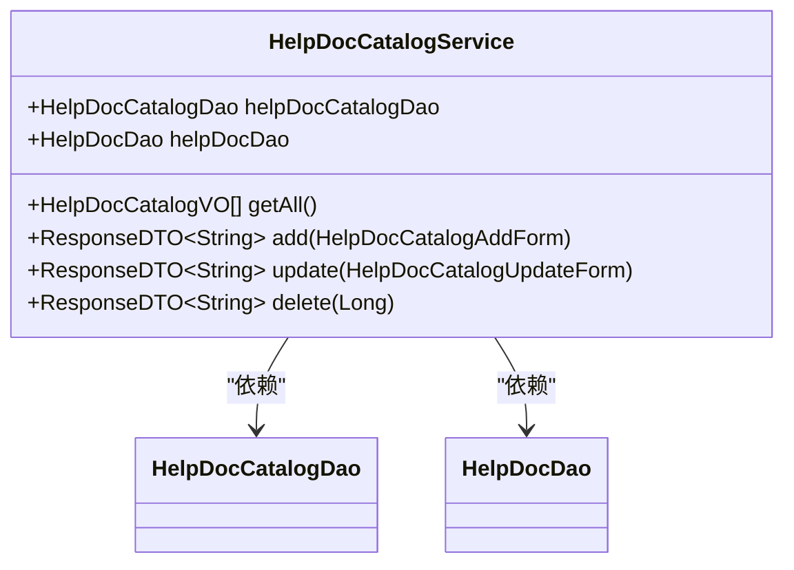
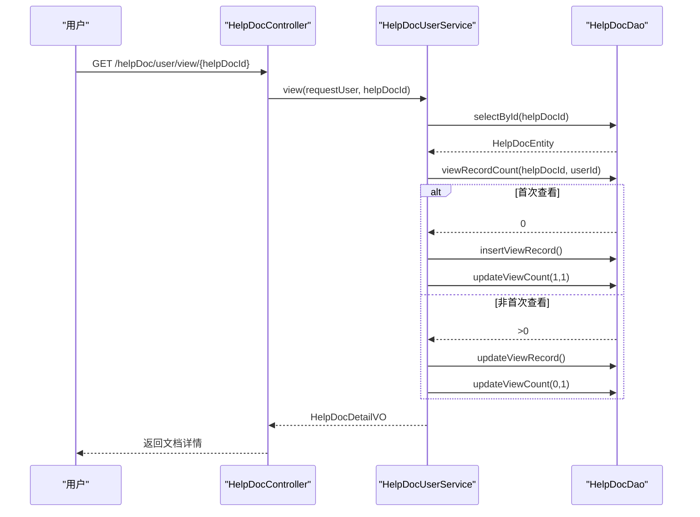
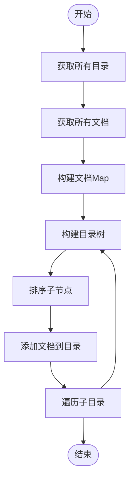
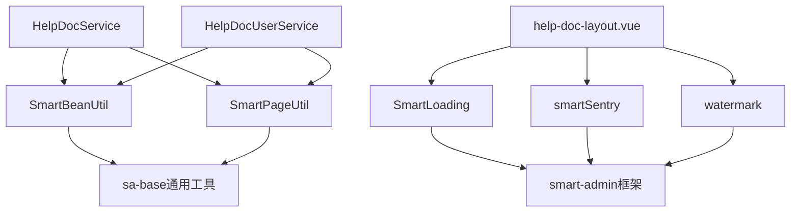

# 在线文档与帮助系统

<cite>
**本文档引用的文件**
- [HelpDocService.java](file://smart-admin-api-java17-springboot3\sa-base\src\main\java\net\lab1024\sa\base\module\support\helpdoc\service\HelpDocService.java)
- [HelpDocCatalogService.java](file://smart-admin-api-java17-springboot3\sa-base\src\main\java\net\lab1024\sa\base\module\support\helpdoc\service\HelpDocCatalogService.java)
- [HelpDocUserService.java](file://smart-admin-api-java17-springboot3\sa-base\src\main\java\net\lab1024\sa\base\module\support\helpdoc\service\HelpDocUserService.java)
- [HelpDocEntity.java](file://smart-admin-api-java17-springboot3\sa-base\src\main\java\net\lab1024\sa\base\module\support\helpdoc\domain\entity\HelpDocEntity.java)
- [HelpDocDao.xml](file://smart-admin-api-java17-springboot3\sa-base\src\main\resources\mapper\support\HelpDocDao.xml)
- [help-doc-layout.vue](file://smart-admin-web-javascript\src\layout\help-doc-layout.vue)
- [help-doc-catalog-tree.vue](file://smart-admin-web-javascript\src\views\support\help-doc\management\components\help-doc-catalog-tree.vue)
- [help-doc-list.vue](file://smart-admin-web-javascript\src\views\support\help-doc\management\components\help-doc-list.vue)
</cite>

## 目录
1. [简介](#简介)
2. [项目结构](#项目结构)
3. [核心组件](#核心组件)
4. [架构概述](#架构概述)
5. [详细组件分析](#详细组件分析)
6. [依赖分析](#依赖分析)
7. [性能考虑](#性能考虑)
8. [故障排除指南](#故障排除指南)
9. [结论](#结论)

## 简介
IOE-DREAM项目的HelpDoc功能提供了一个全面的在线文档与帮助系统，旨在为用户提供便捷的文档查阅和管理功能。该系统支持文档内容管理、目录结构维护、访问权限控制、版本管理、搜索和分类浏览等功能。通过前后端分离的架构设计，系统实现了高效的数据交互和用户友好的界面体验。

## 项目结构
HelpDoc功能主要分布在`smart-admin-api-java17-springboot3`和`smart-admin-web-javascript`两个模块中。后端服务位于`sa-base`模块的`support/helpdoc`包下，包含服务层、数据访问层和实体类。前端界面位于`smart-admin-web-javascript`的`views/support/help-doc`目录下，采用Vue3和Ant Design Vue组件库构建。

**图表来源**
- [HelpDocService.java](file://smart-admin-api-java17-springboot3\sa-base\src\main\java\net\lab1024\sa\base\module\support\helpdoc\service\HelpDocService.java)
- [HelpDocCatalogService.java](file://smart-admin-api-java17-springboot3\sa-base\src\main\java\net\lab1024\sa\base\module\support\helpdoc\service\HelpDocCatalogService.java)
- [HelpDocUserService.java](file://smart-admin-api-java17-springboot3\sa-base\src\main\java\net\lab1024\sa\base\module\support\helpdoc\service\HelpDocUserService.java)
- [HelpDocDao.xml](file://smart-admin-api-java17-springboot3\sa-base\src\main\resources\mapper\support\HelpDocDao.xml)
- [help-doc-layout.vue](file://smart-admin-web-javascript\src\layout\help-doc-layout.vue)
- [help-doc-catalog-tree.vue](file://smart-admin-web-javascript\src\views\support\help-doc\management\components\help-doc-catalog-tree.vue)
- [help-doc-list.vue](file://smart-admin-web-javascript\src\views\support\help-doc\management\components\help-doc-list.vue)

**章节来源**
- [HelpDocService.java](file://smart-admin-api-java17-springboot3\sa-base\src\main\java\net\lab1024\sa\base\module\support\helpdoc\service\HelpDocService.java)
- [HelpDocCatalogService.java](file://smart-admin-api-java17-springboot3\sa-base\src\main\java\net\lab1024\sa\base\module\support\helpdoc\service\HelpDocCatalogService.java)
- [help-doc-layout.vue](file://smart-admin-web-javascript\src\layout\help-doc-layout.vue)

## 核心组件
HelpDoc系统的核心组件包括`HelpDocService`、`HelpDocCatalogService`和`HelpDocUserService`。`HelpDocService`负责文档的增删改查操作，`HelpDocCatalogService`管理文档目录结构，`HelpDocUserService`处理用户查看文档的逻辑。这些服务通过`HelpDocDao`与数据库交互，实现数据的持久化存储。

**章节来源**
- [HelpDocService.java](file://smart-admin-api-java17-springboot3\sa-base\src\main\java\net\lab1024\sa\base\module\support\helpdoc\service\HelpDocService.java)
- [HelpDocCatalogService.java](file://smart-admin-api-java17-springboot3\sa-base\src\main\java\net\lab1024\sa\base\module\support\helpdoc\service\HelpDocCatalogService.java)
- [HelpDocUserService.java](file://smart-admin-api-java17-springboot3\sa-base\src\main\java\net\lab1024\sa\base\module\support\helpdoc\service\HelpDocUserService.java)

## 架构概述
HelpDoc系统采用典型的三层架构：表现层、业务逻辑层和数据访问层。表现层由Vue3前端实现，通过RESTful API与后端交互。业务逻辑层由Spring Boot服务实现，处理具体的业务逻辑。数据访问层使用MyBatis Plus框架，通过XML映射文件定义SQL语句。系统通过`help-doc-layout.vue`作为主布局，集成目录树和文档列表，提供统一的用户界面。

**图表来源**
- [HelpDocService.java](file://smart-admin-api-java17-springboot3\sa-base\src\main\java\net\lab1024\sa\base\module\support\helpdoc\service\HelpDocService.java)
- [HelpDocUserService.java](file://smart-admin-api-java17-springboot3\sa-base\src\main\java\net\lab1024\sa\base\module\support\helpdoc\service\HelpDocUserService.java)
- [HelpDocDao.xml](file://smart-admin-api-java17-springboot3\sa-base\src\main\resources\mapper\support\HelpDocDao.xml)
- [help-doc-layout.vue](file://smart-admin-web-javascript\src\layout\help-doc-layout.vue)

## 详细组件分析

### HelpDocService分析
`HelpDocService`是文档管理的核心服务，提供文档的增删改查功能。服务通过`HelpDocManager`进行事务管理，确保数据的一致性。文档的添加和更新操作会同时处理关联关系，删除操作会级联删除关联记录。

**图表来源**
- [HelpDocService.java](file://smart-admin-api-java17-springboot3\sa-base\src\main\java\net\lab1024\sa\base\module\support\helpdoc\service\HelpDocService.java)
- [HelpDocManager.java](file://smart-admin-api-java17-springboot3\sa-base\src\main\java\net\lab1024\sa\base\module\support\helpdoc\manager\HelpDocManager.java)

**章节来源**
- [HelpDocService.java](file://smart-admin-api-java17-springboot3\sa-base\src\main\java\net\lab1024\sa\base\module\support\helpdoc\service\HelpDocService.java)

### HelpDocCatalogService分析
`HelpDocCatalogService`负责管理文档的目录结构。服务提供目录的增删改查功能，并在删除目录时进行完整性检查，确保目录下没有子目录或文档。目录的添加和更新操作会检查名称的唯一性，防止重复。

**图表来源**
- [HelpDocCatalogService.java](file://smart-admin-api-java17-springboot3\sa-base\src\main\java\net\lab1024\sa\base\module\support\helpdoc\service\HelpDocCatalogService.java)

**章节来源**
- [HelpDocCatalogService.java](file://smart-admin-api-java17-springboot3\sa-base\src\main\java\net\lab1024\sa\base\module\support\helpdoc\service\HelpDocCatalogService.java)

### HelpDocUserService分析
`HelpDocUserService`处理用户查看文档的逻辑。服务在用户首次查看文档时创建查看记录并更新浏览量，后续查看则更新现有记录。服务还提供查看记录的查询功能，支持分页和关键字搜索。

**图表来源**
- [HelpDocUserService.java](file://smart-admin-api-java17-springboot3\sa-base\src\main\java\net\lab1024\sa\base\module\support\helpdoc\service\HelpDocUserService.java)
- [HelpDocController.java](file://smart-admin-api-java17-springboot3\sa-base\src\main\java\net\lab1024\sa\base\module\support\helpdoc\controller\HelpDocController.java)

**章节来源**
- [HelpDocUserService.java](file://smart-admin-api-java17-springboot3\sa-base\src\main\java\net\lab1024\sa\base\module\support\helpdoc\service\HelpDocUserService.java)

### 文档目录树构建分析
前端通过`help-doc-layout.vue`中的`queryHelpDocTree`方法构建文档目录树。方法首先获取所有目录和文档数据，然后通过`buildHelpDocCatalogTree`递归函数构建树形结构。文档按目录ID分组，插入到相应目录节点下，形成完整的目录树。

**图表来源**
- [help-doc-layout.vue](file://smart-admin-web-javascript\src\layout\help-doc-layout.vue)

**章节来源**
- [help-doc-layout.vue](file://smart-admin-web-javascript\src\layout\help-doc-layout.vue)

## 依赖分析
HelpDoc系统的主要依赖包括Spring Boot、MyBatis Plus、Vue3和Ant Design Vue。后端服务依赖`sa-base`模块的通用组件，如`SmartBeanUtil`用于对象转换，`SmartPageUtil`用于分页处理。前端组件依赖`smart-loading`、`smart-sentry`等工具类，确保系统的稳定性和用户体验。

**图表来源**
- [HelpDocService.java](file://smart-admin-api-java17-springboot3\sa-base\src\main\java\net\lab1024\sa\base\module\support\helpdoc\service\HelpDocService.java)
- [HelpDocUserService.java](file://smart-admin-api-java17-springboot3\sa-base\src\main\java\net\lab1024\sa\base\module\support\helpdoc\service\HelpDocUserService.java)
- [help-doc-layout.vue](file://smart-admin-web-javascript\src\layout\help-doc-layout.vue)

**章节来源**
- [HelpDocService.java](file://smart-admin-api-java17-springboot3\sa-base\src\main\java\net\lab1024\sa\base\module\support\helpdoc\service\HelpDocService.java)
- [HelpDocUserService.java](file://smart-admin-api-java17-springboot3\sa-base\src\main\java\net\lab1024\sa\base\module\support\helpdoc\service\HelpDocUserService.java)
- [help-doc-layout.vue](file://smart-admin-web-javascript\src\layout\help-doc-layout.vue)

## 性能考虑
HelpDoc系统在性能方面进行了多项优化。后端使用MyBatis Plus的分页插件，避免全表扫描。前端采用虚拟滚动和懒加载技术，提高大列表的渲染性能。文档浏览量的更新采用异步处理，减少数据库写操作的阻塞。系统还实现了数据缓存，减少重复查询的开销。

## 故障排除指南
常见问题包括文档无法显示、目录树加载失败等。排查时应首先检查网络请求是否正常，确认API返回数据格式正确。对于目录树加载失败，需检查`helpDocCatalogId`和`helpDocId`的映射关系是否正确。文档内容显示异常时，应验证HTML内容的安全性过滤。

**章节来源**
- [HelpDocService.java](file://smart-admin-api-java17-springboot3\sa-base\src\main\java\net\lab1024\sa\base\module\support\helpdoc\service\HelpDocService.java)
- [HelpDocUserService.java](file://smart-admin-api-java17-springboot3\sa-base\src\main\java\net\lab1024\sa\base\module\support\helpdoc\service\HelpDocUserService.java)
- [help-doc-layout.vue](file://smart-admin-web-javascript\src\layout\help-doc-layout.vue)

## 结论
IOE-DREAM项目的HelpDoc功能提供了一个功能完善、性能优良的在线文档与帮助系统。通过合理的架构设计和组件划分，系统实现了文档的高效管理和便捷访问。未来可进一步优化搜索功能，增加全文检索和智能推荐，提升用户体验。