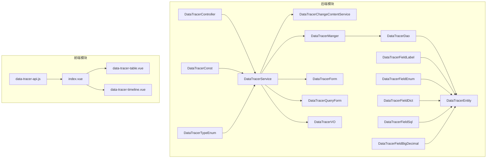
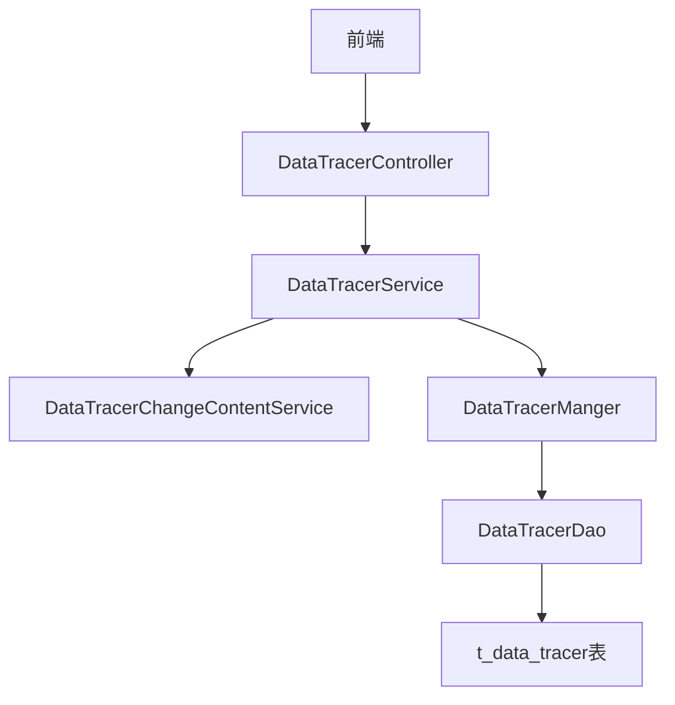
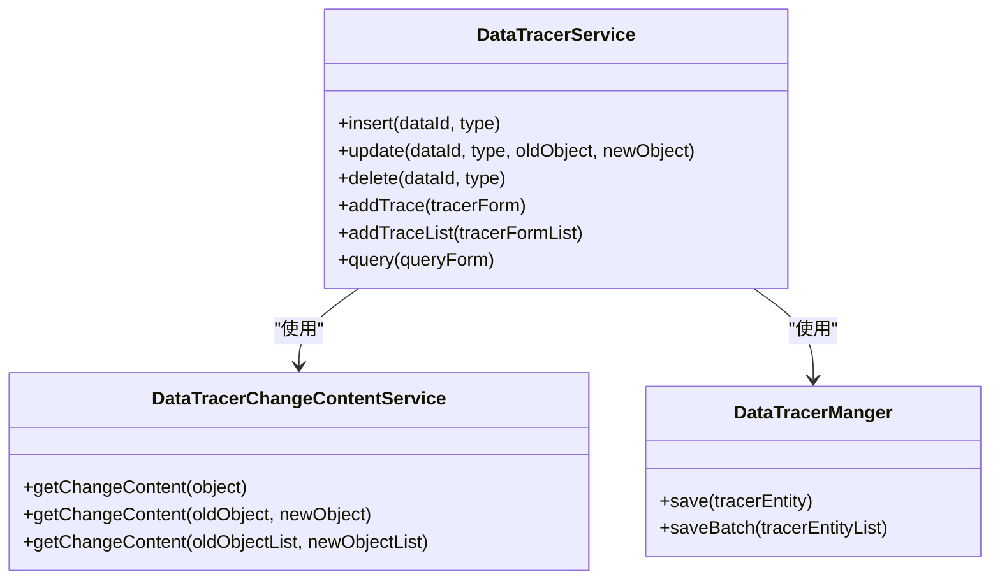
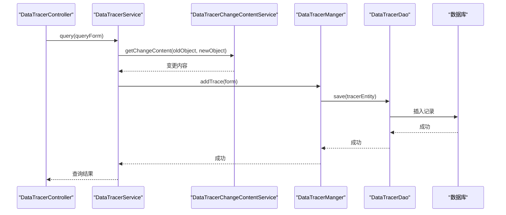
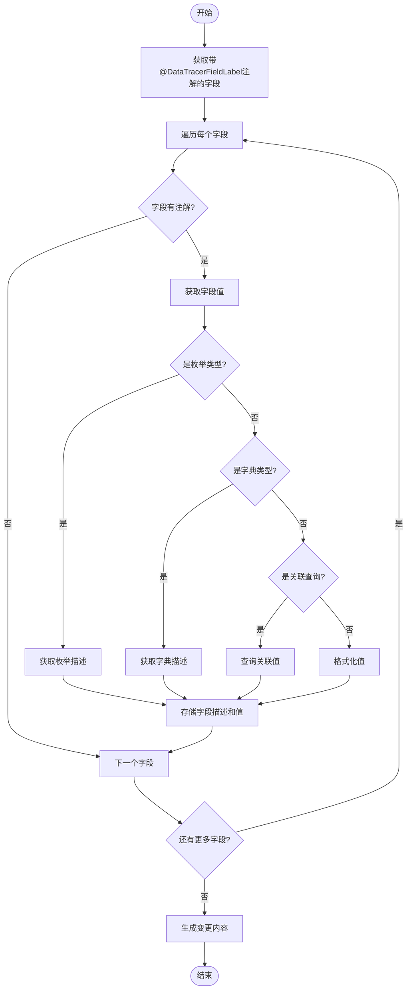
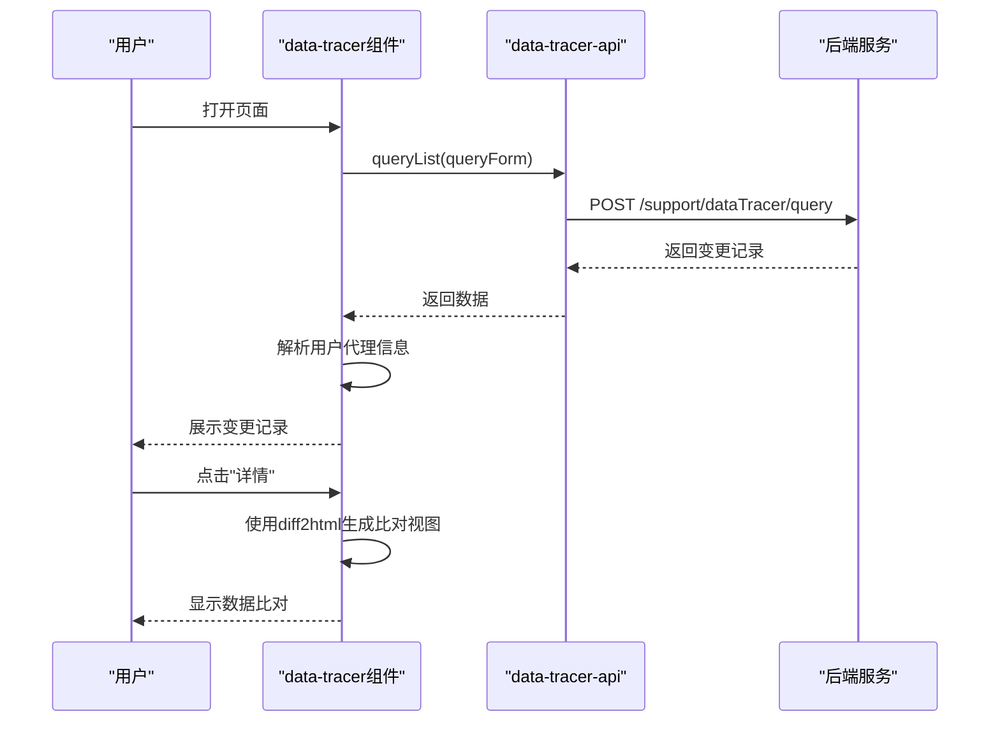
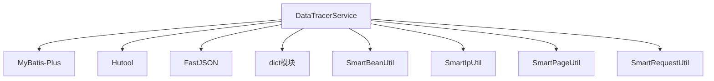

# 数据变更追踪

<cite>
**本文档引用文件**  
- [DataTracerService.java](file://smart-admin-api-java17-springboot3/sa-base/src/main/java/net/lab1024/sa/base/module/support/datatracer/service/DataTracerService.java)
- [DataTracerChangeContentService.java](file://smart-admin-api-java17-springboot3/sa-base/src/main/java/net/lab1024/sa/base/module/support/datatracer/service/DataTracerChangeContentService.java)
- [DataTracerEntity.java](file://smart-admin-api-java17-springboot3/sa-base/src/main/java/net/lab1024/sa/base/module/support/datatracer/domain/entity/DataTracerEntity.java)
- [DataTracerForm.java](file://smart-admin-api-java17-springboot3/sa-base/src/main/java/net/lab1024/sa/base/module/support/datatracer/domain/form/DataTracerForm.java)
- [DataTracerQueryForm.java](file://smart-admin-api-java17-springboot3/sa-base/src/main/java/net/lab1024/sa/base/module/support/datatracer/domain/form/DataTracerQueryForm.java)
- [DataTracerVO.java](file://smart-admin-api-java17-springboot3/sa-base/src/main/java/net/lab1024/sa/base/module/support/datatracer/domain/vo/DataTracerVO.java)
- [DataTracerController.java](file://smart-admin-api-java17-springboot3/sa-base/src/main/java/net/lab1024/sa/base/module/support/datatracer/controller/DataTracerController.java)
- [DataTracerDao.java](file://smart-admin-api-java17-springboot3/sa-base/src/main/java/net/lab1024/sa/base/module/support/datatracer/dao/DataTracerDao.java)
- [DataTracerManger.java](file://smart-admin-api-java17-springboot3/sa-base/src/main/java/net/lab1024/sa/base/module/support/datatracer/manager/DataTracerManger.java)
- [DataTracerFieldLabel.java](file://smart-admin-api-java17-springboot3/sa-base/src/main/java/net/lab1024/sa/base/module/support/datatracer/annoation/DataTracerFieldLabel.java)
- [DataTracerConst.java](file://smart-admin-api-java17-springboot3/sa-base/src/main/java/net/lab1024/sa/base/module/support/datatracer/constant/DataTracerConst.java)
- [DataTracerTypeEnum.java](file://smart-admin-api-java17-springboot3/sa-base/src/main/java/net/lab1024/sa/base/module/support/datatracer/constant/DataTracerTypeEnum.java)
- [data-tracer-api.js](file://smart-admin-web-javascript/src/api/support/data-tracer-api.js)
- [index.vue](file://smart-admin-web-javascript/src/components/support/data-tracer/index.vue)
- [data-tracer-timeline.vue](file://smart-admin-web-javascript/src/components/support/data-tracer/data-tracer-timeline.vue)
- [data-tracer-table.vue](file://smart-admin-web-javascript/src/components/support/data-tracer/data-tracer-table.vue)
- [EnterpriseEntity.java](file://smart-admin-api-java17-springboot3/sa-admin/src/main/java/net/lab1024/sa/admin/module/business/oa/enterprise/domain/entity/EnterpriseEntity.java)
- [EnterpriseService.java](file://smart-admin-api-java17-springboot3/sa-admin/src/main/java/net/lab1024/sa/admin/module/business/oa/enterprise/service/EnterpriseService.java)
- [DataTracerMapper.xml](file://smart-admin-api-java17-springboot3/sa-base/src/main/resources/mapper/support/DataTracerMapper.xml)
</cite>

## 目录
1. [引言](#引言)
2. [项目结构](#项目结构)
3. [核心组件](#核心组件)
4. [架构概述](#架构概述)
5. [详细组件分析](#详细组件分析)
6. [依赖分析](#依赖分析)
7. [性能考虑](#性能考虑)
8. [故障排除指南](#故障排除指南)
9. [结论](#结论)

## 引言
数据变更追踪功能是IOE-DREAM项目中的关键审计模块，用于记录业务数据的增删改操作。该功能通过注解驱动的方式，自动捕获实体对象的变更，生成详细的变更记录，支持变更前后值的对比展示。系统提供了完整的前后端集成方案，包括数据存储、查询接口和可视化展示，帮助开发者在关键业务场景中实现完整的数据审计功能。

## 项目结构
数据变更追踪功能主要分布在sa-base模块的support/datatracer包中，包含注解、常量、控制器、数据访问对象、实体、表单、值对象、管理器和服务等组件。前端组件位于smart-admin-web-javascript项目的src/components/support/data-tracer目录中，提供了表格和时间轴两种展示形式。

**Diagram sources**
- [DataTracerController.java](file://smart-admin-api-java17-springboot3/sa-base/src/main/java/net/lab1024/sa/base/module/support/datatracer/controller/DataTracerController.java)
- [DataTracerService.java](file://smart-admin-api-java17-springboot3/sa-base/src/main/java/net/lab1024/sa/base/module/support/datatracer/service/DataTracerService.java)
- [DataTracerChangeContentService.java](file://smart-admin-api-java17-springboot3/sa-base/src/main/java/net/lab1024/sa/base/module/support/datatracer/service/DataTracerChangeContentService.java)
- [DataTracerManger.java](file://smart-admin-api-java17-springboot3/sa-base/src/main/java/net/lab1024/sa/base/module/support/datatracer/manager/DataTracerManger.java)
- [DataTracerDao.java](file://smart-admin-api-java17-springboot3/sa-base/src/main/java/net/lab1024/sa/base/module/support/datatracer/dao/DataTracerDao.java)
- [DataTracerEntity.java](file://smart-admin-api-java17-springboot3/sa-base/src/main/java/net/lab1024/sa/base/module/support/datatracer/domain/entity/DataTracerEntity.java)
- [DataTracerForm.java](file://smart-admin-api-java17-springboot3/sa-base/src/main/java/net/lab1024/sa/base/module/support/datatracer/domain/form/DataTracerForm.java)
- [DataTracerQueryForm.java](file://smart-admin-api-java17-springboot3/sa-base/src/main/java/net/lab1024/sa/base/module/support/datatracer/domain/form/DataTracerQueryForm.java)
- [DataTracerVO.java](file://smart-admin-api-java17-springboot3/sa-base/src/main/java/net/lab1024/sa/base/module/support/datatracer/domain/vo/DataTracerVO.java)
- [DataTracerConst.java](file://smart-admin-api-java17-springboot3/sa-base/src/main/java/net/lab1024/sa/base/module/support/datatracer/constant/DataTracerConst.java)
- [DataTracerTypeEnum.java](file://smart-admin-api-java17-springboot3/sa-base/src/main/java/net/lab1024/sa/base/module/support/datatracer/constant/DataTracerTypeEnum.java)
- [DataTracerFieldLabel.java](file://smart-admin-api-java17-springboot3/sa-base/src/main/java/net/lab1024/sa/base/module/support/datatracer/annoation/DataTracerFieldLabel.java)
- [data-tracer-api.js](file://smart-admin-web-javascript/src/api/support/data-tracer-api.js)
- [index.vue](file://smart-admin-web-javascript/src/components/support/data-tracer/index.vue)
- [data-tracer-table.vue](file://smart-admin-web-javascript/src/components/support/data-tracer/data-tracer-table.vue)
- [data-tracer-timeline.vue](file://smart-admin-web-javascript/src/components/support/data-tracer/data-tracer-timeline.vue)

**Section sources**
- [DataTracerController.java](file://smart-admin-api-java17-springboot3/sa-base/src/main/java/net/lab1024/sa/base/module/support/datatracer/controller/DataTracerController.java)
- [DataTracerService.java](file://smart-admin-api-java17-springboot3/sa-base/src/main/java/net/lab1024/sa/base/module/support/datatracer/service/DataTracerService.java)
- [DataTracerChangeContentService.java](file://smart-admin-api-java17-springboot3/sa-base/src/main/java/net/lab1024/sa/base/module/support/datatracer/service/DataTracerChangeContentService.java)
- [DataTracerManger.java](file://smart-admin-api-java17-springboot3/sa-base/src/main/java/net/lab1024/sa/base/module/support/datatracer/manager/DataTracerManger.java)
- [DataTracerDao.java](file://smart-admin-api-java17-springboot3/sa-base/src/main/java/net/lab1024/sa/base/module/support/datatracer/dao/DataTracerDao.java)
- [DataTracerEntity.java](file://smart-admin-api-java17-springboot3/sa-base/src/main/java/net/lab1024/sa/base/module/support/datatracer/domain/entity/DataTracerEntity.java)
- [DataTracerForm.java](file://smart-admin-api-java17-springboot3/sa-base/src/main/java/net/lab1024/sa/base/module/support/datatracer/domain/form/DataTracerForm.java)
- [DataTracerQueryForm.java](file://smart-admin-api-java17-springboot3/sa-base/src/main/java/net/lab1024/sa/base/module/support/datatracer/domain/form/DataTracerQueryForm.java)
- [DataTracerVO.java](file://smart-admin-api-java17-springboot3/sa-base/src/main/java/net/lab1024/sa/base/module/support/datatracer/domain/vo/DataTracerVO.java)
- [DataTracerConst.java](file://smart-admin-api-java17-springboot3/sa-base/src/main/java/net/lab1024/sa/base/module/support/datatracer/constant/DataTracerConst.java)
- [DataTracerTypeEnum.java](file://smart-admin-api-java17-springboot3/sa-base/src/main/java/net/lab1024/sa/base/module/support/datatracer/constant/DataTracerTypeEnum.java)
- [DataTracerFieldLabel.java](file://smart-admin-api-java17-springboot3/sa-base/src/main/java/net/lab1024/sa/base/module/support/datatracer/annoation/DataTracerFieldLabel.java)
- [data-tracer-api.js](file://smart-admin-web-javascript/src/api/support/data-tracer-api.js)
- [index.vue](file://smart-admin-web-javascript/src/components/support/data-tracer/index.vue)
- [data-tracer-table.vue](file://smart-admin-web-javascript/src/components/support/data-tracer/data-tracer-table.vue)
- [data-tracer-timeline.vue](file://smart-admin-web-javascript/src/components/support/data-tracer/data-tracer-timeline.vue)

## 核心组件

数据变更追踪功能的核心组件包括DataTracerService、DataTracerChangeContentService、DataTracerEntity、DataTracerForm、DataTracerQueryForm、DataTracerVO等。DataTracerService负责协调整个追踪流程，调用DataTracerChangeContentService生成变更内容，通过DataTracerManger保存到数据库。DataTracerEntity是数据库实体，对应t_data_tracer表。DataTracerForm和DataTracerQueryForm分别用于数据提交和查询。DataTracerVO是返回给前端的视图对象。

**Section sources**
- [DataTracerService.java](file://smart-admin-api-java17-springboot3/sa-base/src/main/java/net/lab1024/sa/base/module/support/datatracer/service/DataTracerService.java)
- [DataTracerChangeContentService.java](file://smart-admin-api-java17-springboot3/sa-base/src/main/java/net/lab1024/sa/base/module/support/datatracer/service/DataTracerChangeContentService.java)
- [DataTracerEntity.java](file://smart-admin-api-java17-springboot3/sa-base/src/main/java/net/lab1024/sa/base/module/support/datatracer/domain/entity/DataTracerEntity.java)
- [DataTracerForm.java](file://smart-admin-api-java17-springboot3/sa-base/src/main/java/net/lab1024/sa/base/module/support/datatracer/domain/form/DataTracerForm.java)
- [DataTracerQueryForm.java](file://smart-admin-api-java17-springboot3/sa-base/src/main/java/net/lab1024/sa/base/module/support/datatracer/domain/form/DataTracerQueryForm.java)
- [DataTracerVO.java](file://smart-admin-api-java17-springboot3/sa-base/src/main/java/net/lab1024/sa/base/module/support/datatracer/domain/vo/DataTracerVO.java)

## 架构概述

数据变更追踪功能采用典型的分层架构，包括控制器层、服务层、管理器层和数据访问层。控制器层提供REST API接口，服务层处理业务逻辑，管理器层封装数据访问操作，数据访问层直接与数据库交互。前端通过API调用获取数据，使用Vue组件进行展示。

**Diagram sources**
- [DataTracerController.java](file://smart-admin-api-java17-springboot3/sa-base/src/main/java/net/lab1024/sa/base/module/support/datatracer/controller/DataTracerController.java)
- [DataTracerService.java](file://smart-admin-api-java17-springboot3/sa-base/src/main/java/net/lab1024/sa/base/module/support/datatracer/service/DataTracerService.java)
- [DataTracerChangeContentService.java](file://smart-admin-api-java17-springboot3/sa-base/src/main/java/net/lab1024/sa/base/module/support/datatracer/service/DataTracerChangeContentService.java)
- [DataTracerManger.java](file://smart-admin-api-java17-springboot3/sa-base/src/main/java/net/lab1024/sa/base/module/support/datatracer/manager/DataTracerManger.java)
- [DataTracerDao.java](file://smart-admin-api-java17-springboot3/sa-base/src/main/java/net/lab1024/sa/base/module/support/datatracer/dao/DataTracerDao.java)
- [DataTracerEntity.java](file://smart-admin-api-java17-springboot3/sa-base/src/main/java/net/lab1024/sa/base/module/support/datatracer/domain/entity/DataTracerEntity.java)

## 详细组件分析

### DataTracerService分析
DataTracerService是数据变更追踪的核心服务类，提供了insert、update、delete等方法用于记录数据变更。它通过DataTracerChangeContentService生成变更内容，然后调用addTrace方法将变更记录保存到数据库。

#### 类图

**Diagram sources**
- [DataTracerService.java](file://smart-admin-api-java17-springboot3/sa-base/src/main/java/net/lab1024/sa/base/module/support/datatracer/service/DataTracerService.java)
- [DataTracerChangeContentService.java](file://smart-admin-api-java17-springboot3/sa-base/src/main/java/net/lab1024/sa/base/module/support/datatracer/service/DataTracerChangeContentService.java)
- [DataTracerManger.java](file://smart-admin-api-java17-springboot3/sa-base/src/main/java/net/lab1024/sa/base/module/support/datatracer/manager/DataTracerManger.java)

#### 执行流程序列图

**Diagram sources**
- [DataTracerController.java](file://smart-admin-api-java17-springboot3/sa-base/src/main/java/net/lab1024/sa/base/module/support/datatracer/controller/DataTracerController.java)
- [DataTracerService.java](file://smart-admin-api-java17-springboot3/sa-base/src/main/java/net/lab1024/sa/base/module/support/datatracer/service/DataTracerService.java)
- [DataTracerChangeContentService.java](file://smart-admin-api-java17-springboot3/sa-base/src/main/java/net/lab1024/sa/base/module/support/datatracer/service/DataTracerChangeContentService.java)
- [DataTracerManger.java](file://smart-admin-api-java17-springboot3/sa-base/src/main/java/net/lab1024/sa/base/module/support/datatracer/manager/DataTracerManger.java)
- [DataTracerDao.java](file://smart-admin-api-java17-springboot3/sa-base/src/main/java/net/lab1024/sa/base/module/support/datatracer/dao/DataTracerDao.java)

**Section sources**
- [DataTracerService.java](file://smart-admin-api-java17-springboot3/sa-base/src/main/java/net/lab1024/sa/base/module/support/datatracer/service/DataTracerService.java)
- [DataTracerChangeContentService.java](file://smart-admin-api-java17-springboot3/sa-base/src/main/java/net/lab1024/sa/base/module/support/datatracer/service/DataTracerChangeContentService.java)
- [DataTracerManger.java](file://smart-admin-api-java17-springboot3/sa-base/src/main/java/net/lab1024/sa/base/module/support/datatracer/manager/DataTracerManger.java)
- [DataTracerDao.java](file://smart-admin-api-java17-springboot3/sa-base/src/main/java/net/lab1024/sa/base/module/support/datatracer/dao/DataTracerDao.java)

### DataTracerChangeContentService分析
DataTracerChangeContentService负责生成变更内容，通过反射机制获取对象字段值，根据字段上的注解进行特殊处理，如枚举值转换、字典值转换等。

#### 复杂逻辑流程图

**Diagram sources**
- [DataTracerChangeContentService.java](file://smart-admin-api-java17-springboot3/sa-base/src/main/java/net/lab1024/sa/base/module/support/datatracer/service/DataTracerChangeContentService.java)

**Section sources**
- [DataTracerChangeContentService.java](file://smart-admin-api-java17-springboot3/sa-base/src/main/java/net/lab1024/sa/base/module/support/datatracer/service/DataTracerChangeContentService.java)

### 前端组件分析
前端提供了data-tracer组件，支持表格和时间轴两种展示形式，用户可以查看变更详情，进行数据比对。

#### 组件交互序列图

**Diagram sources**
- [index.vue](file://smart-admin-web-javascript/src/components/support/data-tracer/index.vue)
- [data-tracer-api.js](file://smart-admin-web-javascript/src/api/support/data-tracer-api.js)

**Section sources**
- [index.vue](file://smart-admin-web-javascript/src/components/support/data-tracer/index.vue)
- [data-tracer-api.js](file://smart-admin-web-javascript/src/api/support/data-tracer-api.js)

## 依赖分析

数据变更追踪功能依赖于多个模块和组件，包括MyBatis-Plus、Hutool、FastJSON等第三方库，以及项目内部的dict模块用于字典值转换。

**Diagram sources**
- [DataTracerService.java](file://smart-admin-api-java17-springboot3/sa-base/src/main/java/net/lab1024/sa/base/module/support/datatracer/service/DataTracerService.java)
- [DataTracerChangeContentService.java](file://smart-admin-api-java17-springboot3/sa-base/src/main/java/net/lab1024/sa/base/module/support/datatracer/service/DataTracerChangeContentService.java)

**Section sources**
- [DataTracerService.java](file://smart-admin-api-java17-springboot3/sa-base/src/main/java/net/lab1024/sa/base/module/support/datatracer/service/DataTracerService.java)
- [DataTracerChangeContentService.java](file://smart-admin-api-java17-springboot3/sa-base/src/main/java/net/lab1024/sa/base/module/support/datatracer/service/DataTracerChangeContentService.java)

## 性能考虑

数据变更追踪功能在设计时考虑了性能优化，采用了缓存机制来存储字段描述和注解信息，避免重复反射操作。批量保存功能支持一次插入多条记录，减少数据库交互次数。查询接口支持分页，避免一次性加载大量数据。

## 故障排除指南

常见问题包括变更记录未生成、字段描述显示异常、数据比对不准确等。排查时应检查实体类字段是否正确添加@DataTracerFieldLabel注解，确认业务类型是否在DataTracerTypeEnum中定义，验证前端组件参数传递是否正确。

**Section sources**
- [DataTracerService.java](file://smart-admin-api-java17-springboot3/sa-base/src/main/java/net/lab1024/sa/base/module/support/datatracer/service/DataTracerService.java)
- [DataTracerChangeContentService.java](file://smart-admin-api-java17-springboot3/sa-base/src/main/java/net/lab1024/sa/base/module/support/datatracer/service/DataTracerChangeContentService.java)
- [index.vue](file://smart-admin-web-javascript/src/components/support/data-tracer/index.vue)

## 结论

IOE-DREAM项目的DataTracer功能提供了一套完整的数据变更追踪解决方案，通过注解驱动的方式简化了审计日志的实现。系统设计合理，功能完整，支持多种数据类型和展示形式，能够满足关键业务场景的数据审计需求。开发者只需在实体类字段上添加相应注解，即可实现自动化的数据变更追踪。