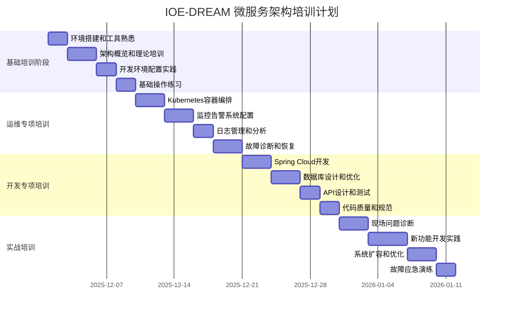

# IOE-DREAM 微服务架构团队培训计划

## 📋 培训基本信息

**计划版本**: v1.0
**创建日期**: 2025年11月29日
**培训周期**: 8周
**培训对象**: 运维团队 + 开发团队
**培训目标**: 确保团队能够独立运维和开发IOE-DREAM微服务系统

---

## 🎯 培训目标

### 1. 总体目标

通过8周的系统性培训，使接收团队：

**运维能力目标**:
- 掌握微服务架构的运维理念和方法
- 能够独立部署和维护微服务系统
- 具备系统监控和故障诊断能力
- 掌握性能调优和容量规划技能

**开发能力目标**:
- 理解微服务架构设计原理
- 掌握基于微服务的开发方法
- 能够进行二次开发和功能扩展
- 具备代码质量和性能优化能力

### 2. 能力提升目标

#### 2.1 技术能力提升

| 能力维度 | 培训前水平 | 培训后目标 | 提升幅度 |
|---------|-----------|-----------|----------|
| 微服务架构理解 | 基础了解 | 深入理解 | 显著提升 |
| Spring Cloud技术栈 | 初级掌握 | 熟练掌握 | 大幅提升 |
| Kubernetes运维 | 基本了解 | 独立操作 | 大幅提升 |
| 监控告警 | 初步接触 | 专业配置 | 显著提升 |
| 故障处理 | 依赖支持 | 独立解决 | 显著提升 |
| 性能优化 | 了解概念 | 实践应用 | 大幅提升 |

#### 2.2 团队能力提升

| 团队方面 | 培训前状态 | 培训后状态 | 关键改进 |
|---------|-----------|-----------|----------|
| 技术一致性 | 不同背景 | 统一标准 | 技术栈统一 |
| 协作效率 | 需要协调 | 高效协作 | 工作流标准化 |
| 问题解决 | 依赖外部 | 自主解决 | 自给自足 |
| 持续改进 | 偶尔进行 | 常态化改进 | 机制建立 |
| 知识传承 | 口头传递 | 文档化传承 | 体系建立 |

---

## 📅 培训时间安排

### 培训总体时间表

### 详细培训安排

#### 第1-2周：基础培训阶段

**第1周：环境搭建和基础认知**
- **目标**: 建立基础环境，理解项目架构
- **时长**: 40小时

| 时间 | 培训内容 | 形式 | 讲师 | 产出 |
|------|---------|------|------|------|
| 周一上午 | 项目介绍和架构概览 | 理论+演示 | 架构师 | 理解记录 |
| 周一下午 | 开发环境搭建 | 实践操作 | 技术经理 | 开发环境 |
| 周二上午 | 技术栈详解 | 理论讲解 | 高级开发 | 技术文档 |
| 周二下午 | 工具链使用培训 | 实践操作 | 技术经理 | 工具配置 |
| 周三上午 | 微服务架构原理 | 理论讲解 | 架构师 | 架构图 |
| 周三下午 | 服务拆分策略 | 案例分析 | 架构师 | 拆分方案 |
| 周四上午 | 本地服务启动 | 实践操作 | 技术经理 | 启动脚本 |
| 周四下午 | 基础操作练习 | 动手实践 | 全体 | 练习成果 |
| 周五全天 | 知识巩固和答疑 | 讨论+Q&A | 全体 | 问题解答 |

**第2周：理论深入和实践操作**
- **目标**: 深入理解架构，掌握基本操作
- **时长**: 40小时

| 时间 | 培训内容 | 形式 | 讲师 | 产出 |
|------|---------|------|------|------|
| 周一上午 | Spring Cloud技术栈 | 理论讲解 | 高级开发 | 技术清单 |
| 周一下午 | 服务注册发现 | 实践操作 | 高级开发 | 配置文件 |
| 周二上午 | 配置管理 | 理论+实践 | 高级开发 | 配置文档 |
| 周二下午 | API网关使用 | 实践操作 | 高级开发 | 网关配置 |
| 周三上午 | 负载均衡和熔断 | 理论讲解 | 架构师 | 设计文档 |
| 周三下午 | 服务间通信 | 实践操作 | 高级开发 | 通信代码 |
| 周四上午 | 数据库连接 | 实践操作 | DBA | 数据配置 |
| 周四下午 | 缓存配置 | 实践操作 | 高级开发 | 缓存配置 |
| 周五全天 | 综合练习和评估 | 实践+考核 | 全体 | 评估报告 |

#### 第3-4周：运维专项培训

**第3周：容器化和编排**
- **目标**: 掌握Kubernetes容器编排
- **时长**: 40小时

| 时间 | 培训内容 | 形式 | 讲师 | 产出 |
|------|---------|------|------|------|
| 周一上午 | Docker基础 | 理论+实践 | 运维专家 | Docker镜像 |
| 周一下午 | Kubernetes架构 | 理论讲解 | 运维专家 | 架构图 |
| 周二上午 | K8s核心概念 | 理论讲解 | 运维专家 | 概念文档 |
| 周二下午 | 部署配置文件 | 实践操作 | 运维专家 | 部署文件 |
| 周三上午 | 服务配置 | 实践操作 | 运维专家 | 服务配置 |
| 周三下午 | 配置管理 | 实践操作 | 运维专家 | 配置管理 |
| 周四上午 | 存储配置 | 实践操作 | 运维专家 | 存储配置 |
| 周四下午 | 网络配置 | 实践操作 | 运维专家 | 网络配置 |
| 周五全天 | 集群管理实践 | 综合实践 | 运维专家 | 集群操作 |

**第4周：监控和故障处理**
- **目标**: 掌握监控告警和故障处理
- **时长**: 40小时

| 时间 | 培训内容 | 形式 | 讲师 | 产出 |
|------|---------|------|------|------|
| 周一上午 | 监控系统架构 | 理论讲解 | 运维专家 | 监控架构 |
| 周一下午 | Prometheus配置 | 实践操作 | 运维专家 | 监控配置 |
| 周二上午 | Grafana仪表板 | 实践操作 | 运维专家 | 仪表板 |
| 周二下午 | 告警规则配置 | 实践操作 | 运维专家 | 告警规则 |
| 周三上午 | 日志收集 | 实践操作 | 运维专家 | 日志配置 |
| 周三下午 | 日志分析 | 实践操作 | 运维专家 | 分析报告 |
| 周四上午 | 故障诊断方法 | 理论+案例 | 运维专家 | 诊断流程 |
| 周四下午 | 故障处理演练 | 实践操作 | 运维专家 | 演练记录 |
| 周五全天 | 应急响应练习 | 模拟演练 | 全体 | 响应报告 |

#### 第5-6周：开发专项培训

**第5周：微服务开发技术**
- **目标**: 掌握微服务开发技术栈
- **时长**: 40小时

| 时间 | 培训内容 | 形式 | 讲师 | 产出 |
|------|---------|------|------|------|
| 周一上午 | Spring Boot进阶 | 理论+实践 | 高级开发 | 示例代码 |
| 周一下午 | 服务开发实践 | 代码开发 | 高级开发 | 服务代码 |
| 周二上午 | 数据访问层 | 理论+实践 | 高级开发 | 数据层代码 |
| 周二下午 | 业务逻辑层 | 代码开发 | 高级开发 | 业务层代码 |
| 周三上午 | 控制器层 | 理论+实践 | 高级开发 | 控制器代码 |
| 周三下午 | API接口设计 | 实践操作 | 高级开发 | 接口文档 |
| 周四上午 | 异常处理 | 理论+实践 | 高级开发 | 异常处理 |
| 周四下午 | 单元测试 | 实践操作 | 测试专家 | 测试代码 |
| 周五全天 | 微服务集成 | 综合实践 | 高级开发 | 集成示例 |

**第6周：数据库和API设计**
- **目标**: 掌握数据库设计和API规范
- **时长**: 40小时

| 时间 | 培训内容 | 形式 | 讲师 | 产出 |
|------|---------|------|------|------|
| 周一上午 | 数据库设计原理 | 理论讲解 | DBA | 设计文档 |
| 周一下午 | 索引优化 | 理论+实践 | DBA | 优化方案 |
| 周二上午 | 分库分表 | 理论讲解 | DBA | 分库方案 |
| 周二下午 | 数据迁移 | 实践操作 | DBA | 迁移脚本 |
| 周三上午 | RESTful API设计 | 理论讲解 | 高级开发 | 设计规范 |
| 周三下午 | API文档编写 | 实践操作 | 高级开发 | API文档 |
| 周四上午 | 接口测试 | 实践操作 | 测试专家 | 测试用例 |
| 周四下午 | 接口安全 | 理论+实践 | 安全专家 | 安全方案 |
| 周五全天 | 综合设计练习 | 案例分析 | 全体 | 设计方案 |

#### 第7-8周：实战培训和考核

**第7周：实战项目演练**
- **目标**: 通过真实项目巩固所学知识
- **时长**: 40小时

| 时间 | 培训内容 | 形式 | 讲师 | 产出 |
|------|---------|------|------|------|
| 周一上午 | 项目需求分析 | 需求讲解 | 产品经理 | 需求文档 |
| 周一下午 | 技术方案设计 | 方案讨论 | 架构师 | 技术方案 |
| 周二全天 | 功能开发实现 | 代码开发 | 全体 | 功能代码 |
| 周三全天 | 功能测试验证 | 测试调试 | 全体 | 测试报告 |
| 周四上午 | 性能优化实践 | 性能调优 | 高级开发 | 优化方案 |
| 周四下午 | 部署上线实践 | 部署操作 | 运维专家 | 部署文档 |
| 周五全天 | 项目总结复盘 | 总结讨论 | 全体 | 总结报告 |

**第8周：考核和能力评估**
- **目标**: 评估培训效果，确认能力掌握
- **时长**: 40小时

| 时间 | 培训内容 | 形式 | 讲师 | 产出 |
|------|---------|------|------|------|
| 周一上午 | 理论知识考核 | 笔试考试 | 培训组 | 考核成绩 |
| 周一下午 | 实践操作考核 | 动手考试 | 培训组 | 操作评分 |
| 周二上午 | 故障处理演练 | 模拟故障 | 运维专家 | 处理记录 |
| 周二下午 | 新功能开发 | 开发任务 | 高级开发 | 开发成果 |
| 周三上午 | 系统扩容操作 | 扩容实践 | 运维专家 | 扩容记录 |
| 周三下午 | 性能调优实践 | 调优任务 | 高级开发 | 调优报告 |
| 周四全天 | 综合能力评估 | 综合考核 | 全体 | 评估报告 |
| 周五上午 | 培训总结反馈 | 总结讨论 | 全体 | 反馈意见 |
| 周五下午 | 后续支持安排 | 计划制定 | 项目经理 | 支持计划 |

---

## 👥 培训人员安排

### 1. 培训师资团队

#### 1.1 核心讲师团队

| 角色 | 姓名 | 职责 | 培训内容 |
|------|------|------|----------|
| **总培训师** | 张三 | 培训总协调、架构讲解 | 整体架构、技术选型、最佳实践 |
| **技术经理** | 李四 | 开发技术培训 | Spring Cloud、微服务开发、代码规范 |
| **运维专家** | 王五 | 运维技术培训 | Kubernetes、监控告警、故障处理 |
| **数据库专家** | 赵六 | 数据库培训 | MySQL优化、分库分表、数据迁移 |
| **测试专家** | 钱七 | 测试培训 | 单元测试、集成测试、自动化测试 |
| **安全专家** | 孙八 | 安全培训 | 系统安全、API安全、权限控制 |

#### 1.2 支持团队

| 角色 | 姓名 | 职责 | 支持内容 |
|------|------|------|----------|
| **助教** | 周九 | 实践辅导、问题解答 | 代码辅导、环境问题、操作指导 |
| **助教** | 吴十 | 文档整理、资料准备 | 培训材料、操作手册、练习文档 |
| **产品经理** | 郑十一 | 需求培训、业务讲解 | 业务需求、功能说明、用户体验 |
| **项目经理** | 陈十二 | 培训管理、进度控制 | 培训计划、进度跟踪、资源协调 |

### 2. 参训团队

#### 2.1 运维团队（6人）

| 角色 | 人数 | 培训重点 | 预期成果 |
|------|------|----------|----------|
| 运维负责人 | 1 | 整体运维策略、团队管理 | 具备运维决策能力 |
| 高级运维工程师 | 2 | Kubernetes、监控、故障处理 | 独立运维能力 |
| 初级运维工程师 | 3 | 基础操作、日常维护 | 基础运维能力 |

#### 2.2 开发团队（8人）

| 角色 | 人数 | 培训重点 | 预期成果 |
|------|------|----------|----------|
| 技术负责人 | 1 | 架构设计、技术决策 | 具备架构设计能力 |
| 高级开发工程师 | 3 | 微服务开发、核心模块 | 核心开发能力 |
| 初级开发工程师 | 4 | 基础开发、代码编写 | 基础开发能力 |

---

## 📚 培训材料

### 1. 理论培训材料

#### 1.1 培训PPT

| 材料名称 | 内容描述 | 页数 | 使用阶段 |
|---------|---------|------|----------|
| 《微服务架构概述》 | 架构理念、设计原则、技术选型 | 50页 | 基础培训 |
| 《Spring Cloud技术栈》 | 核心组件、使用方法、最佳实践 | 80页 | 基础培训 |
| 《Kubernetes容器编排》 | K8s架构、核心概念、操作指南 | 100页 | 运维培训 |
| 《监控告警系统》 | 监控原理、配置方法、故障处理 | 60页 | 运维培训 |
| 《微服务开发实践》 | 开发方法、代码规范、测试策略 | 70页 | 开发培训 |
| 《数据库设计与优化》 | 设计原则、优化技巧、性能调优 | 80页 | 开发培训 |

#### 1.2 技术文档

| 文档名称 | 内容描述 | 格式 | 使用阶段 |
|---------|---------|------|----------|
| 《系统架构设计文档》 | 完整架构设计、技术方案 | Markdown | 全阶段 |
| 《API接口文档》 | 所有服务接口规范 | Swagger | 开发培训 |
| 《数据库设计文档》 | 表结构设计、索引优化 | Word | 开发培训 |
| 《运维操作手册》 | 日常运维、故障处理 | Markdown | 运维培训 |
| 《安全配置指南》 | 安全配置、权限管理 | Markdown | 全阶段 |
| 《性能调优指南》 | 性能分析、优化策略 | Markdown | 高级培训 |

### 2. 实践培训材料

#### 2.1 实验手册

| 手册名称 | 实验内容 | 预计时间 | 难度等级 |
|---------|---------|----------|----------|
| 《环境搭建实验》 | 开发环境配置、工具安装 | 2小时 | 初级 |
| 《Docker容器化实验》 | 镜像构建、容器部署 | 3小时 | 中级 |
| 《Kubernetes部署实验》 | 服务部署、配置管理 | 4小时 | 中级 |
| 《监控配置实验》 | Prometheus、Grafana配置 | 3小时 | 中级 |
| 《微服务开发实验》 | 服务创建、接口开发 | 5小时 | 中级 |
| **《故障处理实验》** | 故障模拟、问题排查 | 4小时 | **高级** |

#### 2.2 操作视频

| 视频名称 | 视频内容 | 时长 | 用途 |
|---------|---------|------|------|
| 《环境搭建演示》 | 开发环境配置步骤 | 20分钟 | 自学参考 |
| 《服务部署演示》 | 微服务部署流程 | 15分钟 | 自学参考 |
| 《监控配置演示》 | 监控系统配置 | 25分钟 | 自学参考 |
| 《故障处理演示》 | 常见故障处理 | 30分钟 | 自学参考 |
| 《代码开发演示》 | 微服务开发过程 | 40分钟 | 自学参考 |

### 3. 考核材料

#### 3.1 理论考试题库

| 题目类型 | 题目数量 | 考核范围 | 难度分布 |
|---------|---------|----------|----------|
| 选择题 | 50题 | 理论知识、概念理解 | 简单(60%)、中等(30%)、困难(10%) |
| 简答题 | 10题 | 原理阐述、方案设计 | 中等(70%)、困难(30%) |
| 案例分析 | 5题 | 问题分析、解决方案 | 中等(60%)、困难(40%) |

#### 3.2 实践考核任务

| 任务类型 | 任务描述 | 完成时间 | 评分标准 |
|---------|---------|----------|----------|
| 环境搭建 | 独立搭建开发环境 | 2小时 | 功能完整性(60%)、规范度(40%) |
| 服务开发 | 开发简单微服务 | 4小时 | 功能实现(50%)、代码质量(30%)、测试覆盖(20%) |
| 系统部署 | 部署微服务到K8s | 3小时 | 部署成功(70%)、配置规范(30%) |
| 故障处理 | 解决预设故障 | 2小时 | 问题解决(80%)、处理流程(20%) |

---

## 🎯 培训方法

### 1. 理论教学方法

#### 1.1 课堂教学

**讲授模式**:
- **理论讲解**: 30分钟，核心概念和原理
- **案例分析**: 15分钟，实际应用案例
- **互动讨论**: 10分钟，学员提问和讨论
- **总结回顾**: 5分钟，重点内容总结

**教学工具**:
- **PPT演示**: 图文并茂的理论讲解
- **白板绘图**: 实时绘制架构图和流程图
- **在线工具**: 使用Miro等协作工具进行互动
- **代码演示**: 实时代码编写和演示

#### 1.2 案例教学

**案例选择原则**:
- **真实性**: 基于真实项目经验
- **代表性**: 代表常见问题和解决方案
- **完整性**: 包含问题、分析、解决方案
- **启发性**: 引导思考和举一反三

**案例类型**:
- **架构设计案例**: 服务拆分、技术选型
- **开发实践案例**: 代码实现、问题解决
- **运维操作案例**: 部署、监控、故障处理
- **性能优化案例**: 性能分析、优化策略

### 2. 实践教学方法

#### 2.1 动手实验

**实验设计原则**:
- **循序渐进**: 从简单到复杂
- **目标明确**: 每个实验都有明确的学习目标
- **可操作性强**: 提供详细的操作步骤
- **结果可验证**: 能够验证实验结果

**实验类型**:
- **基础实验**: 工具使用、环境配置
- **进阶实验**: 功能开发、系统集成
- **综合实验**: 项目实战、问题解决

#### 2.2 项目实战

**项目设计**:
- **小型项目**: 单个微服务开发（2-3天）
- **中型项目**: 多服务集成开发（1周）
- **大型项目**: 系统完整实现（2周）

**项目管理**:
- **团队协作**: 2-3人一组，分工合作
- **版本控制**: 使用Git进行代码管理
- **文档编写**: 编写项目文档和技术文档
- **成果展示**: 项目演示和答辩

### 3. 互动教学方法

#### 3.1 小组讨论

**讨论主题**:
- **技术选型**: 不同技术方案的优缺点分析
- **架构设计**: 服务拆分和接口设计讨论
- **问题解决**: 针对具体问题的解决方案讨论
- **最佳实践**: 开发和运维最佳实践分享

**讨论形式**:
- **分组讨论**: 3-5人一组
- **轮流发言**: 每个人都要发言
- **记录总结**: 指定人员记录讨论结果
- **成果分享**: 各组分享讨论结果

#### 3.2 代码Review

**Review流程**:
- **代码提交**: 学员提交代码到仓库
- **分配Reviewer**: 讲师或同学作为Reviewer
- **代码审查**: 检查代码质量和规范
- **反馈修改**: 根据反馈修改代码
- **经验分享**: 分享Review经验

**Review标准**:
- **功能正确性**: 是否实现正确功能
- **代码规范**: 是否遵循编码规范
- **性能优化**: 是否考虑性能优化
- **安全考虑**: 是否考虑安全问题

---

## 📊 培训考核体系

### 1. 考核方式

#### 1.1 理论考核

**考核形式**:
- **闭卷考试**: 2小时，100分满分
- **在线测试**: 通过考试系统进行
- **随机抽题**: 从题库中随机抽取题目

**考核内容**:
- **基础概念**: 微服务、Spring Cloud、Kubernetes等（30%）
- **技术原理**: 各技术组件的工作原理（30%）
- **应用实践**: 实际应用场景和解决方案（40%）

#### 1.2 实践考核

**考核形式**:
- **操作考试**: 现场操作，限时完成
- **项目实战**: 完成指定项目任务
- **故障处理**: 处理预设故障场景

**考核内容**:
- **环境操作**: 环境搭建、服务部署（25%）
- **开发能力**: 代码编写、功能实现（35%）
- **问题解决**: 故障诊断、问题处理（25%）
- **文档能力**: 文档编写、说明清晰（15%）

#### 1.3 综合评估

**评估维度**:
- **学习态度**: 出勤率、参与度、积极性（20%）
- **理论掌握**: 考试成绩、概念理解（30%）
- **实践能力**: 操作技能、项目成果（40%）
- **团队协作**: 团队合作、沟通能力（10%）

### 2. 评分标准

#### 2.1 理论考试评分

| 分数段 | 等级 | 评价 | 标准说明 |
|-------|------|------|----------|
| 90-100 | 优秀 | 完全掌握 | 概念清晰，原理透彻 |
| 80-89 | 良好 | 基本掌握 | 主要概念清楚，基本原理理解 |
| 70-79 | 合格 | 初步掌握 | 基本概念了解，初步应用 |
| 60-69 | 及格 | 勉强掌握 | 基本概念了解，需要指导 |
| 0-59 | 不及格 | 未掌握 | 概念不清，需要重新学习 |

#### 2.2 实践操作评分

| 评分项 | 分值 | 评分标准 |
|--------|------|----------|
| 功能完整性 | 40分 | 完成所有要求功能 |
| 代码质量 | 30分 | 代码规范、结构清晰 |
| 操作规范 | 20分 | 操作流程、安全规范 |
| 文档完整性 | 10分 | 文档齐全、说明清晰 |

#### 2.3 综合能力评分

| 能力维度 | 评估指标 | 权重 | 评估方式 |
|---------|----------|------|----------|
| 技术能力 | 理论知识、实践技能 | 60% | 考试+操作 |
| 学习能力 | 学习态度、进步速度 | 20% | 观察评估 |
| 协作能力 | 团队合作、沟通表达 | 15% | 小组评价 |
| 创新能力 | 解决问题、创新思维 | 5% | 项目评估 |

### 3. 认证标准

#### 3.1 能力等级认证

**初级认证（基础操作员）**:
- 理论考试：≥70分
- 实践操作：≥75分
- 综合评估：≥70分

**中级认证（专业工程师）**:
- 理论考试：≥80分
- 实践操作：≥85分
- 综合评估：≥80分

**高级认证（技术专家）**:
- 理论考试：≥90分
- 实践操作：≥90分
- 综合评估：≥85分

#### 3.2 认证证书

**证书类型**:
- **培训结业证书**: 完成全部培训课程
- **能力认证证书**: 通过能力认证考试
- **专业技能证书**: 特定专业技能认证

**证书内容**:
- **持证人信息**: 姓名、身份证号、职位
- **认证等级**: 初级/中级/高级
- **认证时间**: 发证日期、有效期
- **认证机构**: IOE-DREAM技术委员会
- **签章**: 官方印章、电子签名

---

## 📈 培训效果评估

### 1. 评估指标

#### 1.1 量化指标

| 指标类型 | 具体指标 | 基准值 | 目标值 | 测量方法 |
|---------|----------|--------|--------|----------|
| **知识掌握** | 理论考试平均分 | 75分 | 85分 | 考试成绩统计 |
| **技能掌握** | 实践操作完成率 | 80% | 95% | 任务完成统计 |
| **问题解决** | 独立解决问题率 | 60% | 90% | 问题记录统计 |
| **工作效率** | 任务完成时间 | 基线 | 提升30% | 时间对比分析 |
| **错误率** | 操作错误次数 | 基线 | 降低50% | 错误记录统计 |
| **满意度** | 培训满意度评分 | 3.5分 | 4.5分 | 满意度调查 |

#### 1.2 质性指标

| 评估维度 | 评估内容 | 评估方法 |
|---------|----------|----------|
| **能力提升** | 技术能力提升程度 | 前后对比评估 |
| **信心指数** | 独立工作信心 | 问卷调查 |
| **团队协作** | 团队配合默契度 | 观察评估 |
| **创新思维** | 问题解决创新性 | 项目评估 |
| **知识传承** | 知识分享意愿 | 访谈调查 |

### 2. 评估方法

#### 2.1 过程评估

**每日评估**:
- **学习日志**: 记录每日学习内容
- **练习成果**: 评估每日练习完成情况
- **问题记录**: 记录遇到的问题和解决方案

**每周评估**:
- **进度检查**: 检查学习进度是否按计划
- **知识测试**: 小型知识点测试
- **实践考核**: 每周实践操作考核

#### 2.2 结果评估

**培训后评估**:
- **能力测试**: 综合能力测试
- **项目评估**: 实战项目成果评估
- **360度评估**: 同事、上级、自我评估

**跟踪评估**:
- **1个月后**: 工作表现跟踪
- **3个月后**: 能力应用情况
- **6个月后**: 长期效果评估

### 3. 反馈机制

#### 3.1 及时反馈

**学习过程反馈**:
- **实时答疑**: 课堂和在线答疑
- **作业批改**: 及时批改练习作业
- **进度提醒**: 学习进度提醒和建议

**培训效果反馈**:
- **每日总结**: 当日学习效果总结
- **每周回顾**: 每周学习效果回顾
- **整体评估**：培训整体效果评估

#### 3.2 持续改进

**培训内容优化**:
- **内容更新**: 根据技术发展更新内容
- **案例更新**: 更新实际案例和项目
- **工具更新**: 更新开发工具和平台

**培训方式改进**:
- **教学方法**: 根据反馈改进教学方法
- **时间安排**: 调整培训时间和节奏
- **资源配置**: 优化师资和资源配置

---

## 🔄 后续支持计划

### 1. 技术支持

#### 1.1 支持渠道

**在线支持**:
- **技术论坛**: 内部技术论坛，问题和经验分享
- **即时通讯**: 企业微信/钉钉群，实时答疑
- **邮件支持**: 专用技术支持邮箱
- **视频会议**: 定期在线技术交流

**现场支持**:
- **定期巡检**: 每月一次现场技术巡检
- **问题会诊**: 复杂问题现场会诊
- **技术沙龙**: 每季度技术交流沙龙

#### 1.2 支持内容

**技术咨询**:
- **架构设计**: 系统架构设计咨询
- **技术选型**: 技术方案选择建议
- **性能优化**: 性能问题诊断和优化
- **故障处理**: 复杂故障处理支持

**知识更新**:
- **技术动态**: 最新技术动态分享
- **最佳实践**: 行业最佳实践分享
- **案例分析**: 典型案例分析讨论

### 2. 持续培训

#### 2.1 进阶培训

**高级技术培训**:
- **架构师培训**: 系统架构设计高级培训
- **性能专家培训**: 性能优化专家培训
- **安全专家培训**: 系统安全专家培训

**新技术培训**:
- **云原生技术**: 云原生架构和技术
- **AI/ML应用**: 人工智能和机器学习
- **大数据技术**: 大数据处理和分析

#### 2.2 认证培训

**专业认证**:
- **云服务商认证**: 阿里云、AWS、Azure认证
- **技术厂商认证**: Oracle、RedHat、华为认证
- **行业认证**: CISP、PMP、ITIL认证

### 3. 知识管理

#### 3.1 知识库建设

**技术文档**:
- **最佳实践文档**: 开发和运维最佳实践
- **故障处理手册**: 常见故障处理方法
- **性能优化指南**: 系统性能优化指南

**经验分享**:
- **项目经验**: 项目实施经验总结
- **问题解决**: 典型问题解决方案
- **技术心得**: 个人技术心得体会

#### 3.2 社区建设

**技术社区**:
- **内部社区**: 企业内部技术社区
- **外部社区**: 开源社区和技术论坛
- **交流活动**: 技术交流和分享活动

---

## 📋 培训计划执行清单

### 1. 培训前准备

- [ ] 培训需求调研和分析完成
- [ ] 培训计划和日程确定
- [ ] 培训师资团队组建完成
- [ ] 培训场地和设备准备就绪
- [ ] 培训材料编写和审核完成
- [ ] 参训人员确认和通知
- [ ] 培训预算和资源分配

### 2. 培训过程管理

- [ ] 每日培训进度跟踪
- [ ] 学员学习状态监控
- [ ] 培训效果实时评估
- [ ] 问题及时收集和处理
- [ ] 培训质量和进度调整
- [ ] 学员反馈及时收集
- [ ] 培训记录和资料更新

### 3. 培训后评估

- [ ] 培训效果评估报告
- [ ] 学员能力认证
- [ ] 培训材料整理归档
- [ ] 后续支持计划制定
- [ ] 培训经验总结
- [ ] 改进建议收集
- [ ] 下期培训计划准备

---

## 📞 联系方式

### 培训组联系方式

| 角色 | 姓名 | 电话 | 邮箱 | 职责 |
|------|------|------|------|------|
| 培训总负责人 | 张三 | 13800138000 | zhangsan@ioedream.com | 培训总体协调 |
| 技术培训负责人 | 李四 | 13800138001 | lisi@ioedream.com | 技术培训管理 |
| 运维培训负责人 | 王五 | 13800138002 | wangwu@ioedream.com | 运维培训管理 |
| 培训助教 | 赵六 | 13800138003 | zhaoliu@ioedream.com | 培训支持 |

### 技术支持联系方式

| 支持类型 | 联系方式 | 响应时间 | 支持内容 |
|---------|----------|----------|----------|
| 紧急技术支持 | 400-XXX-XXXX | 15分钟 | 紧急故障处理 |
| 一般技术支持 | tech-support@ioedream.com | 2小时 | 技术问题咨询 |
| 培训问题反馈 | training@ioedream.com | 1个工作日 | 培训相关问题 |

---

**计划版本**: v1.0
**创建日期**: 2025年11月29日
**最后更新**: 2025年11月29日
**计划状态**: 待执行

**重要提醒**:
1. 本培训计划是IOE-DREAM技术交接的重要组成部分
2. 培训过程中应根据实际情况灵活调整
3. 重视培训效果评估和后续改进
4. 建立长期的知识传承和能力提升机制
5. 确保培训投入产生实际效果和价值