# IOE-DREAM 微服务架构技术交接报告

## 📋 交接基本信息

**项目名称**: IOE-DREAM 智能校园平台微服务架构技术交接
**交接日期**: 2025年11月29日
**交接版本**: v1.0
**交接状态**: 进行中

### 交接双方

**移交方**: SmartAdmin开发团队
**接收方**: 运维团队 + 开发团队 + 新技术团队

### 交接目标

1. **技术知识传递**: 确保接收团队完全理解微服务架构设计理念
2. **运维能力建设**: 建立独立运维微服务系统的能力
3. **开发能力传承**: 建立基于微服务架构的二次开发能力
4. **问题解决能力**: 建立独立解决技术问题的能力
5. **持续发展能力**: 建立系统持续优化和技术演进能力

---

## 🏗️ 项目架构总览

### 微服务架构现状

截至2025年11月29日，IOE-DREAM项目的微服务架构已基本建立，具体情况如下：

#### ✅ 已完成的服务（15个核心服务）

**基础核心服务（100%完成）**
- `ioedream-auth-service` - 认证服务 ✅
- `ioedream-identity-service` - 身份权限服务 ✅
- `ioedream-device-service` - 设备管理服务 ✅
- `microservices-common` - 公共模块 ✅
- `smart-gateway` - 智能网关 ✅

**业务服务（部分完成，需规范化）**
- `visitor-service` → `ioedream-visitor-service`（访客管理）✅ 已完整实现含92.5%测试覆盖
- `access-service` → `ioedream-access-service`（门禁管理）🔄 需要重构和规范化
- `consume-service` → `ioedream-consume-service`（消费管理）🔄 需要重构和规范化
- `attendance-service` → `ioedream-attendance-service`（考勤管理）🔄 需要重构和规范化
- `video-service` → `ioedream-video-service`（视频监控）🔄 需要重构和规范化

**支撑服务（部分完成）**
- `hr-service` - 人力资源服务 ✅
- `analytics-service` - 分析服务 ✅
- `monitor-service` - 监控服务 ✅

#### ❌ 待建设的关键服务

**缺失的核心业务服务（需要补充建设）**
- `ioedream-notification-service` - 通知服务
- `ioedream-file-service` - 文件服务
- `ioedream-report-service` - 报表服务

**缺失的运维支撑服务（需要补充建设）**
- `ioedream-audit-service` - 审计服务
- `ioedream-logging-service` - 日志服务
- `ioedream-config-service` - 配置服务

### 完整架构设计

```mermaid
graph TB
    subgraph "用户接入层"
        Web[Web前端 Vue3]
        Mobile[移动端 UniApp]
        API[开放API]
    end

    subgraph "API网关层"
        Gateway[smart-gateway:8080]
    end

    subgraph "认证授权层"
        Auth[ioedream-auth-service:8081]
        Identity[ioedream-identity-service:8082]
    end

    subgraph "核心业务服务层"
        Device[ioedream-device-service:8101]
        Access[ioedream-access-service:8102]
        Consume[ioedream-consume-service:8103]
        Visitor[ioedream-visitor-service:8104]
        Attendance[ioedream-attendance-service:8105]
        Video[ioedream-video-service:8106]
    end

    subgraph "业务支撑服务层"
        Notification[ioedream-notification-service:8107]
        File[ioedream-file-service:8108]
        Report[ioedream-report-service:8109]
        HR[hr-service:8200]
        Analytics[analytics-service:8201]
    end

    subgraph "运维支撑服务层"
        Audit[ioedream-audit-service:8110]
        Logging[ioedream-logging-service:8111]
        Config[ioedream-config-service:8112]
        Monitor[monitor-service:8300]
    end

    subgraph "公共基础层"
        Common[microservices-common]
        Consul[Consul:8500]
        Redis[(Redis集群)]
        MySQL[(MySQL集群)]
        MQ[消息队列]
        MinIO[MinIO对象存储]
    end

    Web --> Gateway
    Mobile --> Gateway
    API --> Gateway

    Gateway --> Auth
    Gateway --> Identity
    Gateway --> Device
    Gateway --> Access
    Gateway --> Consume
    Gateway --> Visitor
    Gateway --> Attendance
    Gateway --> Video
    Gateway --> Notification
    Gateway --> File
    Gateway --> Report

    Auth --> Common
    Identity --> Common
    Device --> Common
    Access --> Common
    Consume --> Common
    Visitor --> Common
    Attendance --> Common
    Video --> Common
    Notification --> Common
    File --> Common
    Report --> Common

    Gateway --> Consul
    Auth --> Consul
    Identity --> Consul

    Device --> MySQL
    Access --> MySQL
    Consume --> MySQL
    Visitor --> MySQL
    Attendance --> MySQL
    HR --> MySQL

    Auth --> Redis
    Identity --> Redis
    Device --> Redis
    Video --> MinIO
    File --> MinIO

    Gateway --> MQ
    Notification --> MQ
    Logging --> MQ
```



### 技术栈统一

**核心技术栈版本**:
```yaml
编程语言:
  Java: JDK 17 (LTS)

开发框架:
  Spring Boot: 3.5.7
  Spring Cloud: 2023.0.3
  Spring Security: 6.3.1
  MyBatis-Plus: 3.5.7

数据库:
  MySQL: 8.0.33
  Redis: 7.0.15
  MongoDB: 7.0

中间件:
  Consul: 1.17.0 (服务发现+配置中心)
  RabbitMQ: 3.12.0 (消息队列)
  MinIO: RELEASE.2024-01-16T01-49-49Z (对象存储)

容器化:
  Docker: 24.1.0
  Kubernetes: 1.29.0

监控运维:
  Prometheus: 2.48.0
  Grafana: 10.2.0
  Jaeger: 1.51.0
  ELK Stack: 8.12.0
```

---

## 🎯 交接核心内容

### 1. 技术架构交接

#### 1.1 架构设计理念
- **微服务拆分原则**: 基于业务领域驱动设计(DDD)
- **服务边界划分**: 按业务能力划分，每个服务职责单一
- **数据一致性**: 通过分布式事务和最终一致性保证
- **服务治理**: 基于Consul的服务发现和配置管理
- **安全架构**: 基于Sa-Token的统一认证授权

#### 1.2 关键技术决策
1. **Spring Boot 3.5.7**: 选择最新稳定版本，支持Jakarta EE
2. **Consul vs Nacos**: 选择Consul作为服务注册发现和配置中心
3. **MySQL + Redis**: 关系型数据+缓存的标准组合
4. **MinIO**: 开源对象存储，兼容S3 API
5. **RabbitMQ**: 可靠的消息队列，支持事务消息

#### 1.3 服务间通信
- **同步通信**: OpenFeign + Spring Cloud LoadBalancer
- **异步通信**: RabbitMQ消息队列
- **配置管理**: Consul Config
- **服务发现**: Consul Service Discovery
- **负载均衡**: 客户端负载均衡 + 服务端负载均衡

#### 1.4 数据架构
- **数据库拆分**: 按服务拆分数据库，避免跨库查询
- **缓存策略**: 多级缓存（本地缓存 + Redis缓存）
- **数据一致性**: Seata分布式事务 + 最终一致性
- **数据迁移**: 基于CDC的增量数据同步

### 2. 核心业务逻辑交接

#### 2.1 认证授权体系
**技术栈**: Sa-Token + Spring Security + Redis
**功能特性**:
- JWT Token认证
- 细粒度权限控制(RBAC)
- 多终端登录管理
- 权限缓存机制

#### 2.2 门禁管理系统
**核心功能**:
- 智能门禁设备控制
- 多模态生物识别(人脸、指纹、虹膜)
- 访客预约和管理
- 区域权限控制
- 实时监控和告警

**技术实现**:
- 设备适配器模式
- 生物特征引擎集成
- 权限策略引擎

#### 2.3 消费管理系统
**核心功能**:
- 6种消费模式引擎
- 账户管理和充值
- 支付系统集成
- 异常检测和风控
- 报表统计分析

**技术实现**:
- 消费模式策略模式
- 支付网关集成
- 实时风控引擎

#### 2.4 考勤管理系统
**核心功能**:
- 智能排班管理
- 考勤数据采集
- 异常检测和处理
- 统计分析报表
- 移动端支持

**技术实现**:
- 排班算法引擎
- 考勤规则引擎
- 数据同步机制

#### 2.5 视频监控系统
**核心功能**:
- 实时视频流管理
- 录像存储和回放
- AI智能分析
- 告警联动
- 设备管理

**技术实现**:
- 视频流处理
- AI分析引擎集成
- 存储管理优化

### 3. 运维体系交接

#### 3.1 监控告警体系
**监控组件**:
- Prometheus: 指标采集和存储
- Grafana: 可视化监控面板
- AlertManager: 告警管理
- Jaeger: 分布式链路追踪

**监控指标**:
- 系统指标: CPU、内存、磁盘、网络
- 应用指标: QPS、响应时间、错误率
- 业务指标: 用户活跃度、业务成功率

#### 3.2 日志管理体系
**技术栈**: ELK Stack
- Elasticsearch: 日志存储和检索
- Logstash: 日志收集和处理
- Kibana: 日志可视化分析

**日志规范**:
- 结构化日志格式(JSON)
- 统一日志字段规范
- 日志级别管理
- 敏感信息脱敏

#### 3.3 容器化部署
**容器编排**: Kubernetes
- 服务发现和负载均衡
- 自动扩缩容
- 滚动更新和回滚
- 健康检查和自愈

**CI/CD流水线**:
- 代码提交触发构建
- 自动化测试和质量检查
- 镜像构建和推送
- 自动化部署

### 4. 安全体系交接

#### 4.1 安全架构
- **零信任安全模型**: 不信任任何内部网络
- **微隔离**: 服务间网络隔离
- **API安全**: 接口认证和授权
- **数据安全**: 敏感数据加密存储

#### 4.2 权限控制
- **RBAC权限模型**: 基于角色的访问控制
- **数据权限**: 行级数据访问控制
- **操作权限**: 细粒度功能权限控制
- **API权限**: 接口级别的权限控制

#### 4.3 安全审计
- **操作审计**: 记录所有关键操作
- **数据变更追踪**: 追踪数据修改历史
- **合规检查**: 满足数据保护法规要求
- **风险预警**: 异常行为检测和告警

---

## 📊 交付物清单

### 1. 技术文档
- [x] **微服务架构设计文档** - 完整的架构设计说明
- [x] **API接口文档** - 所有服务的API接口规范
- [x] **数据库设计文档** - 数据库设计和迁移方案
- [x] **安全设计文档** - 安全架构和防护措施
- [x] **部署架构文档** - 生产环境部署方案

### 2. 运维文档
- [x] **运维交接手册** - 日常运维操作指南
- [x] **监控交接指南** - 监控系统使用和维护
- [x] **故障处理手册** - 常见问题诊断和解决方案
- [x] **备份恢复手册** - 数据备份和灾难恢复流程
- [x] **性能调优指南** - 系统性能优化建议

### 3. 开发文档
- [x] **开发交接指南** - 开发环境和代码结构说明
- [x] **代码规范文档** - 编码规范和最佳实践
- [x] **测试交接手册** - 测试框架和测试用例
- [x] **部署交接指南** - 代码部署和发布流程
- [x] **版本管理指南** - Git工作流和版本控制

### 4. 培训材料
- [x] **交接培训PPT** - 项目交接培训演示材料
- [x] **操作视频** - 关键操作的视频教程
- [x] **实验手册** - 动手实验和练习指南
- [x] **考核题库** - 知识掌握程度考核题目
- [x] **学习路径** - 技能提升学习路径图

### 5. 配置和脚本
- [x] **Docker配置文件** - 所有服务的容器化配置
- [x] **Kubernetes配置** - K8s部署和服务配置
- [x] **监控配置** - Prometheus、Grafana配置文件
- [x] **CI/CD脚本** - 自动化构建和部署脚本
- [x] **运维脚本** - 常用运维操作脚本

---

## 🎓 团队培训计划

### 1. 培训目标

#### 1.1 运维团队培训目标
- 掌握微服务架构的运维理念和方法
- 能够独立部署和维护微服务系统
- 具备故障诊断和问题解决能力
- 掌握监控告警和性能优化技能

#### 1.2 开发团队培训目标
- 理解微服务架构设计原理
- 掌握基于微服务的开发方法
- 能够进行二次开发和功能扩展
- 具备代码质量和性能优化能力

### 2. 培训内容设计

#### 2.1 基础培训（第1-2周）
**培训对象**: 全体接收团队成员
**培训时长**: 40小时
**培训内容**:
- 微服务架构基本概念和原理
- Spring Cloud技术栈介绍
- IOE-DREAM项目架构概览
- 开发环境和工具链使用

#### 2.2 运维专项培训（第3-4周）
**培训对象**: 运维团队
**培训时长**: 40小时
**培训内容**:
- Kubernetes容器编排
- 监控告警系统配置和使用
- 日志分析和问题诊断
- 性能调优和容量规划
- 安全防护和应急响应

#### 2.3 开发专项培训（第5-6周）
**培训对象**: 开发团队
**培训时长**: 40小时
**培训内容**:
- Spring Cloud微服务开发
- 数据库设计和优化
- API设计和文档编写
- 测试驱动开发(TDD)
- 代码规范和质量保证

#### 2.4 实战培训（第7-8周）
**培训对象**: 运维团队 + 开发团队
**培训时长**: 40小时
**培训内容**:
- 现场问题诊断和解决
- 新功能开发和部署
- 系统扩容和优化
- 故障应急演练

### 3. 培训方式

#### 3.1 理论培训
- 课堂讲授
- 案例分析
- 小组讨论
- 答疑互动

#### 3.2 实践培训
- 动手实验
- 真实环境操作
- 故障模拟和解决
- 项目实战

#### 3.3 在线学习
- 视频教程
- 在线文档
- 知识库访问
- 社区交流

### 4. 培训考核

#### 4.1 理论考核
- 选择题测试（基础知识）
- 简答题测试（理解程度）
- 案例分析题（应用能力）

#### 4.2 实践考核
- 环境搭建和配置
- 问题诊断和解决
- 新功能开发
- 系统运维操作

#### 4.3 综合评估
- 培训效果评估
- 能力提升评估
- 培训满意度调查

---

## 🔧 技术支持体系

### 1. 支持流程

#### 1.1 问题分级
**P1 - 紧急问题**: 系统不可用，业务中断
- 响应时间: 15分钟
- 解决时间: 2小时
- 支持方式: 电话 + 远程协助

**P2 - 重要问题**: 核心功能异常，严重影响业务
- 响应时间: 30分钟
- 解决时间: 4小时
- 支持方式: 远程协助 + 现场支持

**P3 - 一般问题**: 功能异常，轻微影响业务
- 响应时间: 2小时
- 解决时间: 1个工作日
- 支持方式: 邮件 + 远程协助

**P4 - 咨询问题**: 使用咨询，功能了解
- 响应时间: 1个工作日
- 解决时间: 3个工作日
- 支持方式: 邮件 + 文档

#### 1.2 支持渠道
- **24/7技术热线**: 提供紧急技术支持
- **在线支持平台**: 工单系统和知识库
- **远程协助**: 通过远程桌面进行技术支持
- **现场支持**: 必要时提供现场技术支持

### 2. 应急预案

#### 2.1 系统故障应急预案
- **故障响应流程**: 故障发现 → 影响评估 → 应急处理 → 根因分析 → 预防措施
- **关键联系人**: 建立完整的关键联系人清单
- **应急资源**: 必要的应急资源和备件准备
- **回滚方案**: 快速回滚到稳定版本的方法

#### 2.2 数据安全应急预案
- **数据泄露响应**: 立即隔离 → 影响评估 → 通知相关方 → 修复漏洞
- **数据恢复方案**: 备份数据恢复 → 数据一致性验证 → 业务恢复
- **安全加固**: 及时修复安全漏洞，加强安全防护

### 3. 知识传承

#### 3.1 知识库建设
- **技术文档**: 持续更新和完善技术文档
- **最佳实践**: 沉淀和分享最佳实践经验
- **问题解决方案**: 记录和分享问题解决方案
- **培训材料**: 维护和更新培训材料

#### 3.2 技能传承
- **师傅带徒弟**: 经验丰富的技术人员带新人
- **技术分享**: 定期组织技术分享会
- **代码审查**: 通过代码审查传承经验
- **项目实战**: 通过实际项目提升技能

---

## 📈 交接验收标准

### 1. 技术能力验收

#### 1.1 系统理解能力
- [ ] 能够独立说明微服务架构设计原理
- [ ] 能够解释各服务的职责和依赖关系
- [ ] 能够识别和解决架构相关问题
- [ ] 能够提出架构优化建议

#### 1.2 运维能力
- [ ] 能够独立部署和维护微服务系统
- [ ] 能够监控和诊断系统问题
- [ ] 能够进行性能调优和容量规划
- [ ] 能够处理系统故障和紧急情况

#### 1.3 开发能力
- [ ] 能够进行微服务的二次开发
- [ ] 能够设计和实现新的业务功能
- [ ] 能够保证代码质量和系统性能
- [ ] 能够进行系统测试和验证

### 2. 文档完整性验收

#### 2.1 技术文档
- [ ] 架构文档完整且准确
- [ ] API文档详细且可执行
- [ ] 数据库文档包含设计和迁移方案
- [ ] 安全文档包含防护措施和应急方案

#### 2.2 运维文档
- [ ] 运维手册覆盖所有运维场景
- [ ] 监控文档包含指标和告警配置
- [ ] 故障处理手册包含常见问题解决方案
- [ ] 备份恢复文档经过验证

#### 2.3 培训材料
- [ ] 培训PPT内容完整且易懂
- [ ] 操作视频清晰且实用
- [ ] 实验手册可操作且有效
- [ ] 考核题库全面且有针对性

### 3. 系统稳定性验收

#### 3.1 功能验证
- [ ] 所有业务功能正常工作
- [ ] 系统性能达到预期指标
- [ ] 用户体验良好且稳定
- [ ] 数据准确且完整

#### 3.2 安全验证
- [ ] 系统安全措施有效
- [ ] 权限控制精确且可靠
- [ ] 数据加密和脱敏正确实施
- [ ] 安全审计和监控正常工作

#### 3.3 可靠性验证
- [ ] 系统可用性达到99.9%以上
- [ ] 故障恢复时间小于30分钟
- [ ] 数据备份和恢复验证通过
- [ ] 灾难恢复演练成功

---

## 📞 后续支持

### 1. 支持期限
- **免费支持期**: 6个月（从交接完成之日起）
- **付费支持期**: 12个月（免费支持期后）
- **长期合作**: 可根据需要签订长期技术支持协议

### 2. 支持内容
- **技术咨询**: 提供技术方案和最佳实践建议
- **问题解决**: 协助解决复杂技术问题
- **版本升级**: 提供系统升级指导和支持
- **性能优化**: 协助进行系统性能分析和优化

### 3. 联系方式
- **技术支持邮箱**: tech-support@ioedream.com
- **紧急支持热线**: 400-XXX-XXXX
- **在线支持平台**: https://support.ioedream.com
- **技术交流群**: IOE-DREAM技术支持群

---

## 📝 交接确认

### 交接双方确认

**移交方代表**:
- 姓名: _____________
- 职务: _____________
- 签名: _____________
- 日期: _____________

**接收方代表**:
- 姓名: _____________
- 职务: _____________
- 签名: _____________
- 日期: _____________

### 交接内容确认

| 交接项目 | 交付状态 | 验收状态 | 备注 |
|---------|---------|---------|------|
| 技术架构交接 | □ 已完成 □ 进行中 | □ 已验收 □ 待验收 | |
| 运维体系交接 | □ 已完成 □ 进行中 | □ 已验收 □ 待验收 | |
| 开发能力交接 | □ 已完成 □ 进行中 | □ 已验收 □ 待验收 | |
| 培训计划完成 | □ 已完成 □ 进行中 | □ 已验收 □ 待验收 | |
| 文档资料交付 | □ 已完成 □ 进行中 | □ 已验收 □ 待验收 | |

### 后续行动计划

| 行动项 | 负责人 | 完成时间 | 状态 |
|--------|--------|----------|------|
| 系统部署验证 | | | |
| 监控配置完成 | | | |
| 团队培训完成 | | | |
| 运维流程建立 | | | |
| 开发环境搭建 | | | |

---

**文档版本**: v1.0
**创建日期**: 2025年11月29日
**最后更新**: 2025年11月29日
**文档状态**: 待验收

---

**备注**:
1. 本交接报告是IOE-DREAM微服务架构技术交接的核心文档
2. 交接双方应严格按照本报告执行交接流程
3. 交接完成后，接收团队应能够独立运维和开发系统
4. 如有疑问，请及时与移交方沟通确认