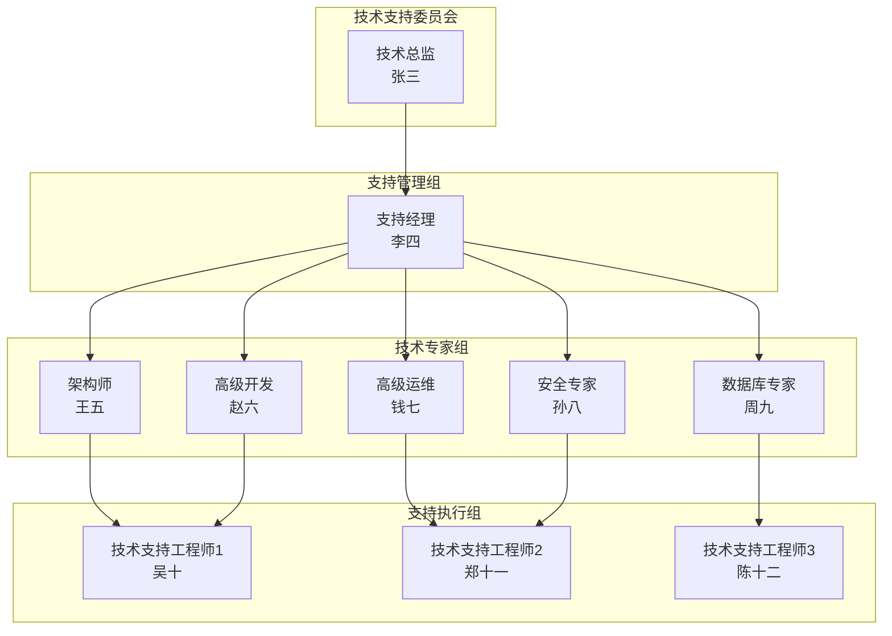
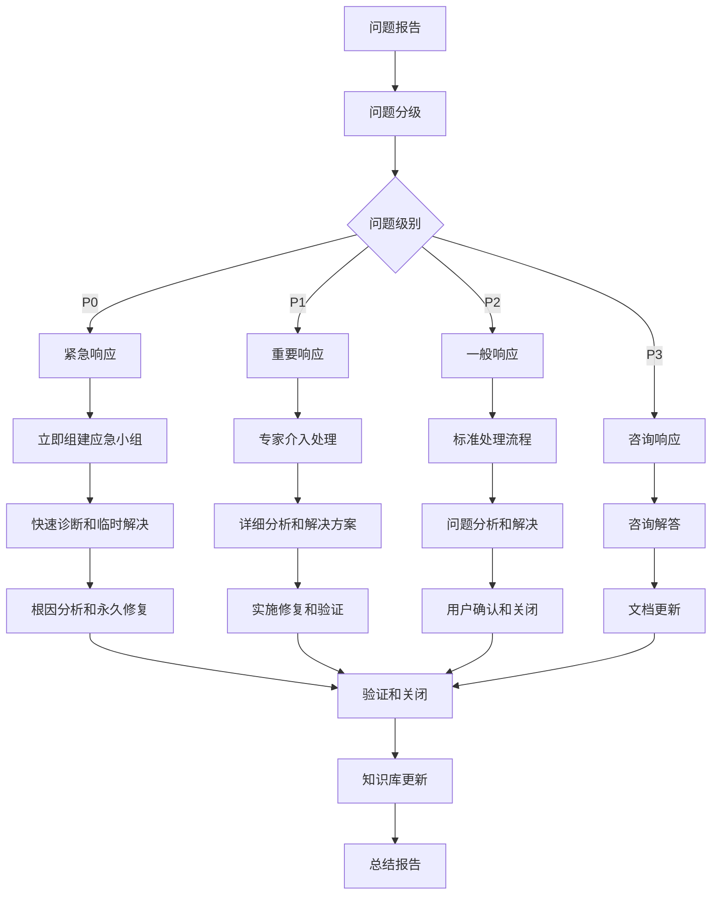

# IOE-DREAM 微服务架构技术支持机制

## 📋 支持机制概述

**机制版本**: v1.0
**创建日期**: 2025年11月29日
**生效日期**: 2025年12月1日
**适用范围**: IOE-DREAM微服务系统运维和开发团队
**支持期限**: 2025年12月1日 - 2026年11月30日

---

## 🎯 支持目标

### 1. 核心目标

**技术能力保障**:
- 确保接收团队具备独立运维和开发能力
- 提供持续的技术指导和问题解决方案
- 建立完整的技术知识传承体系
- 保障系统稳定运行和持续发展

**服务质量保障**:
- 提供及时、准确、专业的技术支持
- 建立标准化的服务流程和响应机制
- 确保技术问题得到有效解决
- 持续改进支持服务质量

### 2. 具体目标

| 支持维度 | 目标指标 | 测量方法 | 目标值 |
|---------|----------|----------|--------|
| 响应及时性 | 首次响应时间 | 时间统计 | P1问题15分钟内响应 |
| 问题解决率 | 问题完全解决比例 | 问题统计 | 95%以上的问题得到解决 |
| 用户满意度 | 用户满意度评分 | 满意度调查 | 平均4.5分以上 |
| 知识传承 | 团队独立工作能力 | 能力评估 | 90%任务可独立完成 |
| 系统稳定性 | 系统可用性指标 | 监控数据 | 99.9%以上可用性 |

---

## 🏗️ 支持组织架构

### 1. 支持团队结构

#### 1.1 核心支持团队



#### 1.2 角色职责

**技术总监**:
- 制定技术支持策略和方向
- 协调重大技术问题解决
- 审核支持服务质量报告
- 决策技术支持资源投入

**支持经理**:
- 日常支持工作协调和管理
- 支持团队人员调配和培训
- 支持流程制定和优化
- 客户关系维护和沟通

**技术专家**:
- 提供专业技术指导和解决方案
- 参与复杂技术问题分析和解决
- 制定技术最佳实践和规范
- 培训和支持知识传承

**支持工程师**:
- 一线技术问题响应和处理
- 客户需求收集和分析
- 支持记录和文档维护
- 客户技术培训和指导

### 2. 支持团队配置

#### 2.1 人员配置

| 角色 | 人数 | 工作时间 | 主要职责 |
|------|------|----------|----------|
| 技术总监 | 1人 | 工作日+紧急支持 | 总体技术决策和重大问题协调 |
| 支持经理 | 1人 | 工作日 | 支持管理和客户关系 |
| 架构师 | 1人 | 工作日+紧急支持 | 架构设计和技术方案指导 |
| 高级开发 | 2人 | 工作日+轮值 | 开发技术支持和代码审查 |
| 高级运维 | 2人 | 7×24小时轮值 | 运维技术支持和故障处理 |
| 安全专家 | 1人 | 工作日+紧急支持 | 安全技术支持和安全事件处理 |
| 数据库专家 | 1人 | 工作日+紧急支持 | 数据库技术支持和优化 |
| 支持工程师 | 3人 | 7×24小时轮值 | 一线技术支持和客户服务 |

#### 2.2 值班安排

**正常工作日值班**:
- **值班时间**: 周一至周五 9:00-18:00
- **值班人员**: 2名支持工程师 + 1名高级专家
- **联系方式**: 企业微信群 + 技术支持热线

**紧急支持值班**:
- **值班时间**: 7×24小时
- **值班人员**: 轮值制，每周轮换
- **联系方式**: 紧急支持热线 + 手机
- **响应要求**: P1问题15分钟内响应

**节假日值班**:
- **值班时间**: 法定节假日
- **值班人员**: 提前安排值班表
- **响应级别**: 仅处理P1级别紧急问题

---

## 📞 支持流程

### 1. 问题分级和处理

#### 1.1 问题分级标准

| 级别 | 定义 | 影响范围 | 响应时间 | 解决时间 | 升级时间 |
|------|------|----------|----------|----------|----------|
| **P0-紧急** | 系统完全不可用，业务严重中断 | 全局影响 | 15分钟 | 2小时 | 30分钟 |
| **P1-重要** | 核心功能异常，严重影响业务 | 部分影响 | 30分钟 | 4小时 | 2小时 |
| **P2-一般** | 功能异常，轻微影响业务 | 个别用户 | 2小时 | 1个工作日 | 8小时 |
| **P3-咨询** | 使用咨询，无业务影响 | 单个用户 | 1个工作日 | 3个工作日 | - |

#### 1.2 问题处理流程



### 2. 服务渠道

#### 2.1 主要支持渠道

| 渠道类型 | 联系方式 | 适用场景 | 响应时间 | 服务时间 |
|---------|----------|----------|----------|----------|
| **紧急热线** | 400-XXX-XXXX | P0级别紧急问题 | 15分钟 | 7×24小时 |
| **技术支持邮箱** | support@ioedream.com | P1-P3级别问题 | 2小时 | 工作日 |
| **企业微信群** | IOE-DREAM技术支持群 | 日常技术支持 | 30分钟 | 工作日 |
| **在线工单系统** | https://support.ioedream.com | 标准支持流程 | 1小时 | 7×24小时 |
| **远程协助** | TeamViewer/向日葵 | 复杂问题远程处理 | 预约安排 | 工作日 |
| **现场支持** | 预约安排 | 重大问题现场支持 | 4小时响应 | 工作日 |

#### 2.2 渠道使用指南

**紧急热线使用场景**:
- 系统完全不可用
- 核心业务功能异常
- 数据丢失或泄露
- 安全事件发生
- 其他严重影响业务的问题

**工单系统使用场景**:
- 非紧急技术问题
- 功能使用咨询
- 配置变更请求
- 性能优化需求
- 文档和培训请求

### 3. 响应流程

#### 3.1 问题报告流程

**1. 问题发现和报告**
```bash
# 用户通过合适渠道报告问题
# 系统自动创建工单或记录
# 发送确认通知给用户
```

**2. 问题信息收集**
```bash
# 基本信息：问题描述、影响范围、发生时间
# 环境信息：系统版本、配置参数、日志文件
# 联系信息：报告人、联系方式、紧急程度
# 历史信息：类似问题历史记录
```

**3. 问题初步评估**
```bash
# 确认问题真实性和严重性
# 评估影响范围和紧急程度
# 确定问题级别和优先级
# 分配处理负责人和团队
```

#### 3.2 问题处理流程

**P0级别问题处理**:
```bash
# 1. 立即响应（15分钟内）
# 2. 组建应急小组（30分钟内）
# 3. 快速诊断和临时解决（2小时内）
# 4. 根因分析和永久修复（24小时内）
# 5. 验证和知识库更新（48小时内）
```

**P1级别问题处理**:
```bash
# 1. 技术专家介入（30分钟内）
# 2. 详细问题分析（2小时内）
# 3. 制定解决方案（4小时内）
# 4. 实施修复（1个工作日内）
# 5. 验证和关闭（2个工作日内）
```

**P2级别问题处理**:
```bash
# 1. 标准处理流程（2小时内响应）
# 2. 问题分析和解决（8小时内）
# 3. 用户确认和验证（1个工作日内）
# 4. 文档更新和关闭（2个工作日内）
```

---

## 🔧 支持服务内容

### 1. 技术支持服务

#### 1.1 运维支持

**系统监控和诊断**:
- 系统性能监控和分析
- 日志分析和问题诊断
- 故障根因分析
- 系统健康检查

**故障处理和恢复**:
- 紧急故障快速响应
- 系统恢复和数据恢复
- 故障预防措施建议
- 应急预案制定和演练

**性能优化**:
- 系统性能瓶颈分析
- 数据库性能优化
- 缓存策略优化
- 系统配置调优

#### 1.2 开发支持

**技术方案咨询**:
- 新功能技术方案设计
- 技术选型建议
- 架构设计评审
- 最佳实践指导

**代码支持**:
- 代码审查和质量检查
- 性能问题代码优化
- 技术难点解决方案
- 代码规范指导

**测试支持**:
- 测试策略制定
- 测试用例设计
- 自动化测试实施
- 性能测试支持

### 2. 安全支持服务

#### 2.1 安全评估

**安全漏洞扫描**:
- 应用安全漏洞扫描
- 系统安全配置检查
- 网络安全评估
- 数据安全审计

**安全加固**:
- 系统安全配置优化
- 漏洞修复和补丁管理
- 安全策略制定
- 安全监控和告警

#### 2.2 安全事件响应

**安全事件处理**:
- 安全事件快速响应
- 攻击溯源和分析
- 系统恢复和加固
- 安全事件报告

### 3. 培训和知识服务

#### 3.1 技术培训

**新员工培训**:
- 系统架构和功能培训
- 开发和运维流程培训
- 工具使用培训
- 最佳实践培训

**在职培训**:
- 新技术培训
- 进阶技能培训
- 认证考试培训
- 实践案例培训

#### 3.2 知识管理

**知识库维护**:
- 技术文档更新
- 最佳实践整理
- 故障案例分析
- 经验分享和传承

---

## 📋 服务水平协议

### 1. 服务指标

#### 1.1 响应时间指标

| 服务级别 | 服务时间 | 响应时间 | 解决时间 | 可用性目标 |
|---------|----------|----------|----------|------------|
| **P0-紧急** | 7×24小时 | 15分钟 | 2小时 | 99.99% |
| **P1-重要** | 7×24小时 | 30分钟 | 4小时 | 99.9% |
| **P2-一般** | 工作日 | 2小时 | 1个工作日 | 99.5% |
| **P3-咨询** | 工作日 | 1个工作日 | 3个工作日 | 99.0% |

#### 1.2 服务质量指标

| 指标类型 | 具体指标 | 目标值 | 测量方法 |
|---------|----------|--------|----------|
| **响应及时性** | 首次响应达标率 | 95% | 工单统计 |
| **解决有效性** | 问题一次性解决率 | 85% | 用户反馈 |
| **用户满意度** | 满意度评分 | ≥4.5分 | 满意度调查 |
| **知识完整性** | 知识库覆盖率 | ≥90% | 知识库统计 |
| **文档准确性** | 文档更新及时率 | ≥95% | 文档审计 |

### 2. 服务承诺

#### 2.1 基础服务承诺

**响应承诺**:
- P0级别问题15分钟内首次响应
- P1级别问题30分钟内首次响应
- P2级别问题2小时内首次响应
- P3级别问题1个工作日内响应

**解决承诺**:
- 95%的问题在承诺时间内解决
- 重大问题提供临时解决方案
- 复杂问题制定分阶段解决计划
- 定期更新问题处理进度

**质量承诺**:
- 提供专业、准确的技术建议
- 确保解决方案的可行性和有效性
- 保护客户数据和系统安全
- 遵守行业最佳实践和标准

#### 2.2 增值服务承诺

**预防性支持**:
- 定期系统健康检查
- 性能监控和预警
- 安全漏洞扫描和修复建议
- 技术趋势分享和建议

**知识转移**:
- 完整的技术文档
- 详细的操作手册
- 实用的最佳实践
- 定期的技术培训

### 3. 服务补偿

#### 3.1 服务不达标补偿

**响应时间不达标**:
- 响应时间超过承诺50%，提供10%服务费用减免
- 响应时间超过承诺100%，提供20%服务费用减免

**解决时间不达标**:
- 解决时间超过承诺50%，提供15%服务费用减免
- 解决时间超过承诺100%，提供30%服务费用减免

**质量问题**:
- 同一问题重复出现，提供额外免费服务
- 因支持方原因造成损失，承担相应责任

#### 3.2 补偿申请流程

**申请条件**:
- 服务不达标事实清楚
- 提供相关证据材料
- 在事件发生后7个工作日内申请

**申请流程**:
1. 提交书面申请和相关证据
2. 支持团队审核确认
3. 双方协商补偿方案
4. 补偿实施和确认

---

## 📚 知识管理

### 1. 知识库建设

#### 1.1 知识库结构

**技术知识库**:
```
IOE-DREAM 知识库/
├── 01-系统架构/
│   ├── 整体架构设计.md
│   ├── 微服务拆分策略.md
│   ├── 技术选型说明.md
│   └── 架构演进历史.md
├── 02-运维指南/
│   ├── 部署操作指南.md
│   ├── 监控告警配置.md
│   ├── 故障处理手册.md
│   └── 性能调优指南.md
├── 03-开发指南/
│   ├── 开发环境搭建.md
│   ├── 代码规范文档.md
│   ├── API设计规范.md
│   └── 测试指南.md
├── 04-安全指南/
│   ├── 安全配置手册.md
│   ├── 权限管理指南.md
│   ├── 安全事件响应.md
│   └── 安全审计检查.md
└── 05-最佳实践/
    ├── 运维最佳实践.md
    ├── 开发最佳实践.md
    ├── 故障排查实践.md
    └── 性能优化实践.md
```

#### 1.2 知识内容标准

**文档标准**:
- 格式统一：使用Markdown格式
- 结构清晰：层级分明，便于阅读
- 内容准确：经过技术审核和验证
- 实用性强：能够指导实际操作

**更新标准**:
- 及时性：技术变更后24小时内更新
- 完整性：保持文档完整性和一致性
- 版本管理：记录版本变更历史
- 审核流程：多人审核确保质量

### 2. 经验分享

#### 2.1 技术分享机制

**定期技术分享**:
- **频率**: 每月一次技术分享会
- **主题**: 最新技术动态、最佳实践、案例分析
- **形式**: 线上+线下结合
- **参与**: 支持团队和客户技术团队

**技术博客**:
- **频率**: 每周发布技术文章
- **内容**: 问题解决方案、技术心得、实践总结
- **平台**: 公司官网、技术社区
- **互动**: 读者评论和问题解答

#### 2.2 案例积累

**案例分类**:
- **故障案例**: 系统故障的诊断和解决过程
- **优化案例**: 性能优化的方法和效果
- **安全案例**: 安全事件的防范和处理
- **开发案例**: 功能开发的技术实现

**案例格式**:
```markdown
# 案例标题

## 问题描述
- 问题现象
- 影响范围
- 发生时间

## 问题分析
- 问题原因
- 影响评估
- 解决难度

## 解决方案
- 解决思路
- 实施步骤
- 关键技术

## 效果评估
- 解决效果
- 性能提升
- 经验总结

## 最佳实践
- 预防措施
- 改进建议
- 知识传承
```

---

## 📊 支持质量监控

### 1. 质量指标监控

#### 1.1 实时监控指标

**响应时间监控**:
- 首次响应时间
- 问题解决时间
- 用户等待时间
- 超时问题比例

**服务质量监控**:
- 问题解决率
- 一次性解决率
- 用户满意度
- 服务可用性

#### 1.2 定期评估指标

**月度评估指标**:
- 问题数量和趋势
- 平均解决时间
- 用户满意度变化
- 知识库使用情况

**季度评估指标**:
- 服务质量整体评分
- 客户满意度综合评分
- 支持团队绩效评估
- 改进措施执行情况

### 2. 监控工具

#### 2.1 工单系统

**功能特性**:
- 工单创建和分配
- 进度跟踪和更新
- 时间统计和分析
- 报表生成和导出

**报表类型**:
- 问题处理统计报表
- 响应时间分析报表
- 用户满意度报表
- 服务质量评估报表

#### 2.2 监控系统

**系统监控**:
- 服务可用性监控
- 性能指标监控
- 错误率监控
- 用户行为监控

**告警机制**:
- 服务异常告警
- 性能指标告警
- 支持流程告警
- 用户满意度告警

### 3. 持续改进

#### 3.1 改进机制

**问题分析**:
- 定期分析常见问题
- 识别系统性问题
- 分析问题根本原因
- 制定改进措施

**流程优化**:
- 优化支持流程
- 简化操作步骤
- 提高响应效率
- 改善用户体验

#### 3.2 改进措施

**短期改进**:
- 快速修复流程问题
- 完善文档和培训
- 优化工具和系统
- 加强沟通和协作

**长期改进**:
- 技术能力提升
- 服务模式创新
- 质量体系建设
- 客户关系维护

---

## 📋 支持交接清单

### 1. 支持团队交接

- [ ] 支持团队组织架构确认
- [ ] 支持人员角色职责明确
- [ ] 值班安排和联系方式确认
- [ ] 支持工具和系统权限配置
- [ ] 支持流程和SLA确认
- [ ] 质量监控和评估机制建立

### 2. 支持资源交接

- [ ] 技术支持热线和邮箱配置
- [ ] 在线工单系统配置
- [ ] 企业微信群建立
- [ ] 远程协助工具配置
- [ ] 监控和告警系统配置
- [ ] 知识库和文档系统配置

### 3. 支持能力交接

- [ ] 技术支持能力确认
- [ ] 问题处理流程掌握
- [ ] 工具使用熟练度确认
- [ ] 服务质量标准理解
- [ ] 应急响应能力验证
- [ ] 客户沟通能力评估

### 4. 支持文档交接

- [ ] 支持流程文档
- [ ] 服务水平协议
- [ ] 操作手册和指南
- [ ] 常见问题解答
- [ ] 联系人清单
- [ ] 应急预案文档

---

## 📞 联系方式

### 支持团队联系方式

| 支持类型 | 联系方式 | 服务时间 | 适用场景 |
|---------|----------|----------|----------|
| **紧急支持** | 400-XXX-XXXX | 7×24小时 | P0级别紧急问题 |
| **技术支持** | support@ioedream.com | 工作日9:00-18:00 | 一般技术问题 |
| **技术支持群** | 企业微信：IOE-DREAM技术支持 | 工作日9:00-18:00 | 日常技术交流 |
| **在线工单** | https://support.ioedream.com | 7×24小时 | 标准支持流程 |
| **知识库** | https://kb.ioedream.com | 7×24小时 | 自助查询学习 |

### 支持团队联系人员

| 角色 | 姓名 | 电话 | 邮箱 | 主要职责 |
|------|------|------|------|----------|
| 支持经理 | 李四 | 13800138001 | lisi@ioedream.com | 支持管理协调 |
| 架构师 | 王五 | 13800138002 | wangwu@ioedream.com | 架构技术支持 |
| 高级开发 | 赵六 | 13800138003 | zhaoliu@ioedream.com | 开发技术支持 |
| 高级运维 | 钱七 | 13800138004 | qianqi@ioedream.com | 运维技术支持 |
| 安全专家 | 孙八 | 13800138005 | sunba@ioedream.com | 安全技术支持 |

### 紧急联系方式

| 紧急程度 | 联系方式 | 电话号码 | 响应时间 |
|---------|----------|----------|----------|
| **系统完全不可用** | 紧急热线 | 400-XXX-XXXX | 15分钟 |
| **安全事件** | 安全热线 | 400-XXX-XXXX(转安全) | 15分钟 |
| **数据泄露** | 安全热线 | 400-XXX-XXXX(转安全) | 15分钟 |
| **其他紧急问题** | 技术热线 | 400-XXX-XXXX | 30分钟 |

---

**机制版本**: v1.0
**创建日期**: 2025年11月29日
**生效日期**: 2025年12月1日
**最后更新**: 2025年11月29日

**重要提醒**:
1. 本支持机制是IOE-DREAM技术交接的重要组成部分
2. 支持团队应严格按照SLA承诺提供服务
3. 持续改进支持质量和客户满意度
4. 建立长期的技术支持和合作关系
5. 定期评估和优化支持机制效果