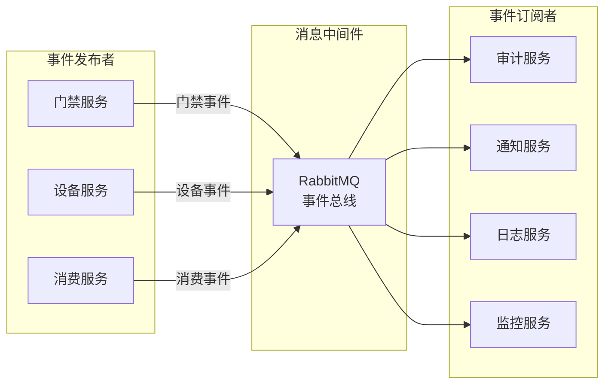
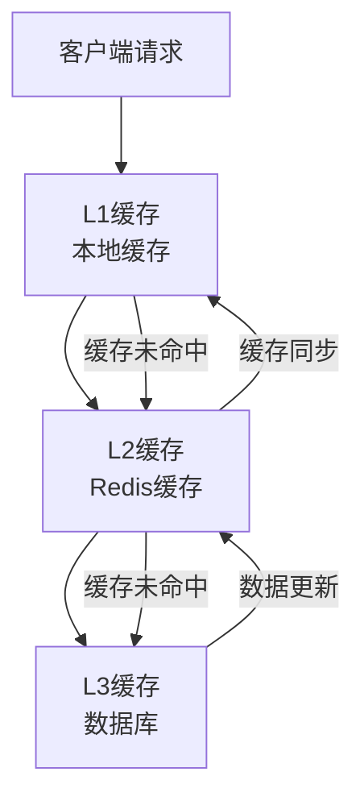

# IOE-DREAM 微服务架构设计文档

## 📋 文档信息

**文档版本**: v1.0
**创建日期**: 2025年11月29日
**最后更新**: 2025年11月29日
**文档状态**: 已完成

---

## 🎯 架构设计原则

### 1. 微服务架构原则

#### 1.1 单一职责原则
每个微服务应该专注于单一的业务领域，具有明确的业务边界。

#### 1.2 独立部署原则
每个微服务应该能够独立开发、测试、部署和扩展。

#### 1.3 去中心化原则
数据去中心化，每个服务管理自己的数据存储。

#### 1.4 容错设计原则
服务间通过异步通信，具备故障隔离和降级能力。

### 2. 技术选型原则

#### 2.1 技术栈统一
- 使用Spring Boot 3.5.7 + Spring Cloud 2023.0.3统一技术栈
- 采用Java 17作为主要开发语言
- 使用MySQL作为主数据存储，Redis作为缓存

#### 2.2 开源优先
优先选择成熟的开源技术，避免技术锁定。

#### 2.3 云原生设计
支持容器化部署，适配Kubernetes编排。

---

## 🏗️ 整体架构设计

### 1. 架构分层

```mermaid
graph TB
    subgraph "前端层 (Frontend Layer)"
        Web[Web应用<br/>Vue3 + Ant Design]
        Mobile[移动应用<br/>UniApp]
        API[开放API<br/>RESTful Gateway]
    end

    subgraph "网关层 (Gateway Layer)"
        Gateway[API网关<br/>Spring Cloud Gateway<br/>端口: 8080]
        LB[负载均衡<br/>Nginx/HAProxy]
    end

    subgraph "服务层 (Service Layer)"
        subgraph "认证服务"
            Auth[认证服务<br/>ioedream-auth-service<br/>端口: 8081]
            Identity[身份权限服务<br/>ioedream-identity-service<br/>端口: 8082]
        end

        subgraph "核心业务服务"
            Device[设备管理服务<br/>ioedream-device-service<br/>端口: 8101]
            Access[门禁管理服务<br/>ioedream-access-service<br/>端口: 8102]
            Consume[消费管理服务<br/>ioedream-consume-service<br/>端口: 8103]
            Visitor[访客管理服务<br/>ioedream-visitor-service<br/>端口: 8104]
            Attendance[考勤管理服务<br/>ioedream-attendance-service<br/>端口: 8105]
            Video[视频监控服务<br/>ioedream-video-service<br/>端口: 8106]
        end

        subgraph "支撑服务"
            Notification[通知服务<br/>ioedream-notification-service<br/>端口: 8107]
            File[文件服务<br/>ioedream-file-service<br/>端口: 8108]
            Report[报表服务<br/>ioedream-report-service<br/>端口: 8109]
            HR[人力资源服务<br/>hr-service<br/>端口: 8200]
            Analytics[分析服务<br/>analytics-service<br/>端口: 8201]
        end

        subgraph "运维服务"
            Audit[审计服务<br/>ioedream-audit-service<br/>端口: 8110]
            Logging[日志服务<br/>ioedream-logging-service<br/>端口: 8111]
            Config[配置服务<br/>ioedream-config-service<br/>端口: 8112]
            Monitor[监控服务<br/>monitor-service<br/>端口: 8300]
        end
    end

    subgraph "数据层 (Data Layer)"
        MySQL[(MySQL集群<br/>主从复制)]
        Redis[(Redis集群<br/>哨兵模式)]
        MongoDB[(MongoDB<br/>文档数据库)]
        MinIO[(MinIO<br/>对象存储)]
    end

    subgraph "中间件层 (Middleware Layer)"
        Consul[Consul<br/>服务发现+配置中心]
        RabbitMQ[RabbitMQ<br/>消息队列]
        Elasticsearch[Elasticsearch<br/>搜索引擎]
    end

    subgraph "基础设施层 (Infrastructure Layer)"
        K8s[Kubernetes<br/>容器编排]
        Prometheus[Prometheus<br/>监控系统]
        Grafana[Grafana<br/>可视化]
        Jaeger[Jaeger<br/>链路追踪]
    end

    Web --> Gateway
    Mobile --> Gateway
    API --> Gateway
    LB --> Gateway

    Gateway --> Auth
    Gateway --> Identity
    Gateway --> Device
    Gateway --> Access
    Gateway --> Consume
    Gateway --> Visitor
    Gateway --> Attendance
    Gateway --> Video
    Gateway --> Notification
    Gateway --> File
    Gateway --> Report
    Gateway --> HR
    Gateway --> Analytics

    Auth --> Consul
    Identity --> Consul
    Device --> Consul
    Access --> Consul
    Consume --> Consul
    Visitor --> Consul
    Attendance --> Consul
    Video --> Consul
    Notification --> Consul
    File --> Consul
    Report --> Consul

    Auth --> MySQL
    Identity --> MySQL
    Device --> MySQL
    Access --> MySQL
    Consume --> MySQL
    Visitor --> MySQL
    Attendance --> MySQL
    HR --> MySQL

    Auth --> Redis
    Identity --> Redis
    Device --> Redis
    Access --> Redis
    Consume --> Redis
    Visitor --> Redis
    Attendance --> Redis

    Video --> MinIO
    File --> MinIO

    Gateway --> RabbitMQ
    Notification --> RabbitMQ
    Logging --> RabbitMQ
    Audit --> Elasticsearch
    Logging --> Elasticsearch
    Monitor --> Prometheus
    Gateway --> Jaeger
```



### 2. 服务拆分策略

#### 2.1 业务领域划分

| 服务名称 | 负责领域 | 主要功能 | 数据库 |
|---------|---------|---------|-------|
| ioedream-auth-service | 认证授权 | 用户认证、Token管理、权限验证 | ioedream_auth_db |
| ioedream-identity-service | 身份管理 | 用户管理、角色管理、权限管理 | ioedream_identity_db |
| ioedream-device-service | 设备管理 | 设备注册、状态监控、设备控制 | ioedream_device_db |
| ioedream-access-service | 门禁管理 | 门禁控制、访客管理、生物识别 | ioedream_access_db |
| ioedream-consume-service | 消费管理 | 消费记录、账户管理、支付处理 | ioedream_consume_db |
| ioedream-visitor-service | 访客管理 | 访客预约、访客登记、访客追踪 | ioedream_visitor_db |
| ioedream-attendance-service | 考勤管理 | 考勤记录、排班管理、统计分析 | ioedream_attendance_db |
| ioedream-video-service | 视频监控 | 视频流管理、录像存储、智能分析 | ioedream_video_db |
| ioedream-notification-service | 通知服务 | 消息推送、邮件通知、短信通知 | ioedream_notification_db |
| ioedream-file-service | 文件服务 | 文件上传、存储管理、权限控制 | ioedream_file_db |
| ioedream-report-service | 报表服务 | 报表生成、数据分析、图表展示 | ioedream_report_db |
| ioedream-audit-service | 审计服务 | 操作审计、行为追踪、合规检查 | ioedream_audit_db |
| ioedream-logging-service | 日志服务 | 日志收集、分析、检索、告警 | ioedream_logging_db |
| ioedream-config-service | 配置服务 | 动态配置、环境管理、版本控制 | ioedream_config_db |

#### 2.2 数据拆分原则

1. **按业务域拆分**: 每个服务拥有独立的数据库
2. **避免跨库查询**: 通过API调用获取其他服务数据
3. **数据一致性**: 使用分布式事务或最终一致性
4. **数据备份**: 每个服务独立备份策略

### 3. 服务间通信设计

#### 3.1 同步通信

**技术选择**: OpenFeign + Spring Cloud LoadBalancer

```java
// 示例：设备服务调用门禁服务
@FeignClient(name = "ioedream-access-service")
public interface AccessServiceClient {

    @GetMapping("/api/access/doors/{doorId}/status")
    Response<DoorStatusVO> getDoorStatus(@PathVariable Long doorId);

    @PostMapping("/api/access/doors/{doorId}/open")
    Response<Void> openDoor(@PathVariable Long doorId, @RequestBody OpenDoorRequest request);
}
```

**熔断降级**: 使用Resilience4j实现熔断和降级

```java
@Component
public class AccessServiceFallback implements AccessServiceClient {

    @Override
    public Response<DoorStatusVO> getDoorStatus(Long doorId) {
        return Response.error(ResponseCode.SERVICE_UNAVAILABLE, "门禁服务暂时不可用");
    }

    @Override
    public Response<Void> openDoor(Long doorId, OpenDoorRequest request) {
        return Response.error(ResponseCode.SERVICE_UNAVAILABLE, "门禁服务暂时不可用");
    }
}
```

#### 3.2 异步通信

**技术选择**: RabbitMQ消息队列

```java
// 消息发送者
@Component
public class NotificationMessageSender {

    @Autowired
    private RabbitTemplate rabbitTemplate;

    public void sendAccessNotification(AccessNotificationMessage message) {
        rabbitTemplate.convertAndSend(
            "ioedream.access.notification.exchange",
            "access.notification.routing.key",
            message
        );
    }
}

// 消息接收者
@RabbitListener(queues = "ioedream.access.notification.queue")
public void handleAccessNotification(AccessNotificationMessage message) {
    notificationService.sendNotification(message);
}
```

#### 3.3 事件驱动架构



---

## 🔧 核心技术组件

### 1. 服务注册发现

#### 1.1 Consul集成

**Consul配置**:
```yaml
spring:
  cloud:
    consul:
      host: ${CONSUL_HOST:localhost}
      port: ${CONSUL_PORT:8500}
      discovery:
        service-name: ${spring.application.name}
        instance-id: ${spring.application.name}-${spring.cloud.client.ip-address}-${server.port}
        prefer-ip-address: true
        health-check-path: /actuator/health
        health-check-interval: 15s
        health-check-timeout: 5s
        health-check-critical-timeout: 30s
      config:
        format: yaml
        default-context: application
        data-key: data
```

**服务注册**:
```java
@SpringBootApplication
@EnableDiscoveryClient
public class AccessServiceApplication {
    public static void main(String[] args) {
        SpringApplication.run(AccessServiceApplication.class, args);
    }
}
```

### 2. 配置管理

#### 2.1 Consul Config

**配置结构**:
```
consul kv
└── config/
    ├── ioedream-access-service/
    │   ├── data
    │   │   ├── database.yml
    │   │   ├── redis.yml
    │   │   └── rabbitmq.yml
    │   └── folders/
    │       ├── dev/
    │       ├── test/
    │       └── prod/
```

**动态配置刷新**:
```java
@RestController
@RefreshScope
public class ConfigController {

    @Value("${app.config.refresh-interval:30}")
    private Integer refreshInterval;

    @GetMapping("/config/refresh-interval")
    public Integer getRefreshInterval() {
        return refreshInterval;
    }
}
```

### 3. 负载均衡

#### 3.1 客户端负载均衡

```java
@Configuration
public class LoadBalancerConfig {

    @Bean
    @LoadBalanced
    public RestTemplate restTemplate() {
        return new RestTemplate();
    }

    @Bean
    public ReactorLoadBalancer<ServiceInstance> serviceInstanceLoadBalancer(
            Environment environment,
            LoadBalancerClientFactory loadBalancerClientFactory) {
        String serviceId = environment.getProperty(LoadBalancerClientFactory.PROPERTY_NAME);
        return new RoundRobinLoadBalancer(
            loadBalancerClientFactory.getLazyProvider(serviceId, ServiceInstanceListSupplier.class),
            serviceId
        );
    }
}
```

### 4. 熔断降级

#### 4.1 Resilience4j配置

```yaml
resilience4j:
  circuitbreaker:
    instances:
      accessService:
        failureRateThreshold: 50
        waitDurationInOpenState: 30s
        slidingWindowSize: 10
        minimumNumberOfCalls: 5
        permittedNumberOfCallsInHalfOpenState: 3
  retry:
    instances:
      accessService:
        maxAttempts: 3
        waitDuration: 1s
        retryExceptions:
          - java.net.SocketTimeoutException
          - java.io.IOException
```

```java
@Component
public class AccessServiceCircuitBreaker {

    private final CircuitBreaker circuitBreaker;
    private final Retry retry;

    public AccessServiceCircuitBreaker(
            CircuitBreakerRegistry circuitBreakerRegistry,
            RetryRegistry retryRegistry) {
        this.circuitBreaker = circuitBreakerRegistry.circuitBreaker("accessService");
        this.retry = retryRegistry.retry("accessService");
    }

    public Response<DoorStatusVO> getDoorStatusWithFallback(Long doorId) {
        Supplier<Response<DoorStatusVO>> supplier = CircuitBreaker
            .decorateSupplier(circuitBreaker, () -> accessServiceClient.getDoorStatus(doorId));
        supplier = Retry.decorateSupplier(retry, supplier);

        return Try.ofSupplier(supplier)
            .recover(throwable -> Response.error(ResponseCode.SERVICE_UNAVAILABLE, "服务暂时不可用"))
            .get();
    }
}
```

---

## 🗄️ 数据架构设计

### 1. 数据库设计

#### 1.1 数据库拆分策略

**按业务域拆分**:
```yaml
数据库规划:
  ioedream_auth_db:        # 认证服务数据库
    host: mysql-auth-master
    port: 3306
    database: ioedream_auth

  ioedream_identity_db:    # 身份服务数据库
    host: mysql-identity-master
    port: 3306
    database: ioedream_identity

  ioedream_device_db:      # 设备服务数据库
    host: mysql-device-master
    port: 3306
    database: ioedream_device

  ioedream_access_db:      # 门禁服务数据库
    host: mysql-access-master
    port: 3306
    database: ioedream_access

  ioedream_consume_db:     # 消费服务数据库
    host: mysql-consume-master
    port: 3306
    database: ioedream_consume
```

#### 1.2 读写分离配置

```yaml
spring:
  datasource:
    master:
      jdbc-url: jdbc:mysql://mysql-master:3306/ioedream_access
      username: ${DB_USERNAME:root}
      password: ${DB_PASSWORD:password}
      driver-class-name: com.mysql.cj.jdbc.Driver
    slave:
      jdbc-url: jdbc:mysql://mysql-slave:3306/ioedream_access
      username: ${DB_USERNAME:root}
      password: ${DB_PASSWORD:password}
      driver-class-name: com.mysql.cj.jdbc.Driver
```

#### 1.3 分库分表设计

**用户相关表分库**:
```sql
-- 按用户ID哈希分库
CREATE DATABASE ioedream_user_0;
CREATE DATABASE ioedream_user_1;
CREATE DATABASE ioedream_user_2;
CREATE DATABASE ioedream_user_3;

-- 用户表分表
CREATE TABLE t_user_info_0 (
    user_id BIGINT PRIMARY KEY,
    username VARCHAR(50) NOT NULL,
    email VARCHAR(100),
    create_time DATETIME DEFAULT CURRENT_TIMESTAMP
);

CREATE TABLE t_user_info_1 (
    user_id BIGINT PRIMARY KEY,
    username VARCHAR(50) NOT NULL,
    email VARCHAR(100),
    create_time DATETIME DEFAULT CURRENT_TIMESTAMP
);
```

### 2. 缓存设计

#### 2.1 多级缓存架构



#### 2.2 Redis集群配置

```yaml
spring:
  redis:
    cluster:
      nodes:
        - redis-node1:6379
        - redis-node2:6379
        - redis-node3:6379
        - redis-node4:6379
        - redis-node5:6379
        - redis-node6:6379
      max-redirects: 3
    lettuce:
      pool:
        max-active: 8
        max-idle: 8
        min-idle: 0
        max-wait: -1ms
```

#### 2.3 缓存使用策略

```java
@Service
public class DeviceServiceImpl implements DeviceService {

    @Cacheable(value = "device:info", key = "#deviceId", unless = "#result == null")
    public DeviceInfo getDeviceInfo(Long deviceId) {
        return deviceDao.selectById(deviceId);
    }

    @CacheEvict(value = "device:info", key = "#deviceInfo.deviceId")
    public void updateDeviceInfo(DeviceInfo deviceInfo) {
        deviceDao.updateById(deviceInfo);
    }

    @Caching(
        cacheable = @Cacheable(value = "device:status", key = "#deviceId"),
        evict = @CacheEvict(value = "device:list", allEntries = true)
    )
    public DeviceStatus getDeviceStatus(Long deviceId) {
        return deviceStatusDao.selectByDeviceId(deviceId);
    }
}
```

### 3. 数据一致性

#### 3.1 分布式事务

**Seata配置**:
```yaml
seata:
  enabled: true
  application-id: ioedream-access-service
  tx-service-group: ioedream-access-group
  service:
    vgroup-mapping:
      ioedream-access-group: default
    grouplist:
      default: seata-server:8091
  config:
    type: consul
    consul:
      server-addr: consul:8500
      key: seata.properties
  registry:
    type: consul
    consul:
      server-addr: consul:8500
```

**分布式事务使用**:
```java
@Service
public class AccessServiceImpl implements AccessService {

    @GlobalTransactional(rollbackFor = Exception.class)
    public void processAccessEvent(AccessEvent event) {
        // 1. 记录门禁记录
        accessRecordService.insertAccessRecord(event);

        // 2. 更新设备状态
        deviceService.updateDeviceStatus(event.getDeviceId(), event.getStatus());

        // 3. 发送通知
        notificationService.sendAccessNotification(event);

        // 4. 记录审计日志
        auditService.logAccessEvent(event);
    }
}
```

#### 3.2 最终一致性

**事件溯源模式**:
```java
@Component
public class AccessEventProcessor {

    @EventListener
    @Async
    public void handleAccessRecordCreated(AccessRecordCreatedEvent event) {
        // 异步处理后续业务逻辑

        // 更新统计信息
        statisticsService.updateAccessStatistics(event);

        // 更新用户最后访问时间
        userService.updateLastAccessTime(event.getUserId(), event.getAccessTime());

        // 检查异常访问
        securityService.checkAbnormalAccess(event);
    }
}
```

---

## 🔐 安全架构设计

### 1. 认证授权

#### 1.1 Sa-Token集成

**Sa-Token配置**:
```yaml
sa-token:
  token-name: satoken
  timeout: 2592000  # 30天
  active-timeout: 1800  # 30分钟
  is-log: true
  is-concurrent: true
  jwt-secret-key: ${JWT_SECRET:your-secret-key}
```

**认证服务**:
```java
@Service
public class AuthServiceImpl implements AuthService {

    @Override
    public String login(LoginRequest request) {
        // 1. 验证用户名密码
        User user = userService.authenticate(request.getUsername(), request.getPassword());
        if (user == null) {
            throw new BusinessException("用户名或密码错误");
        }

        // 2. 生成Token
        StpUtil.login(user.getUserId());
        String tokenValue = StpUtil.getTokenValue();

        // 3. 记录登录日志
        loginLogService.recordLogin(user.getUserId(), request.getClientInfo());

        // 4. 返回Token信息
        return tokenValue;
    }

    @Override
    public void logout(String token) {
        // 验证Token并登出
        StpUtil.logoutByTokenValue(token);
    }
}
```

#### 1.2 权限控制

**RBAC权限模型**:
```java
@RestController
@RequestMapping("/api/access")
@SaCheckRole("access_admin")
public class AccessController {

    @GetMapping("/doors")
    @SaCheckPermission("access:door:list")
    public Response<List<DoorVO>> getDoorList() {
        return Response.success(doorService.getDoorList());
    }

    @PostMapping("/doors/{doorId}/open")
    @SaCheckPermission("access:door:open")
    public Response<Void> openDoor(@PathVariable Long doorId) {
        accessService.openDoor(doorId);
        return Response.success();
    }
}
```

**权限数据模型**:
```sql
-- 用户表
CREATE TABLE t_user (
    user_id BIGINT PRIMARY KEY AUTO_INCREMENT,
    username VARCHAR(50) NOT NULL UNIQUE,
    password VARCHAR(100) NOT NULL,
    status TINYINT DEFAULT 1,
    create_time DATETIME DEFAULT CURRENT_TIMESTAMP
);

-- 角色表
CREATE TABLE t_role (
    role_id BIGINT PRIMARY KEY AUTO_INCREMENT,
    role_code VARCHAR(50) NOT NULL UNIQUE,
    role_name VARCHAR(100) NOT NULL,
    description VARCHAR(200),
    create_time DATETIME DEFAULT CURRENT_TIMESTAMP
);

-- 权限表
CREATE TABLE t_permission (
    permission_id BIGINT PRIMARY KEY AUTO_INCREMENT,
    permission_code VARCHAR(100) NOT NULL UNIQUE,
    permission_name VARCHAR(100) NOT NULL,
    resource_type VARCHAR(20) NOT NULL,
    resource_path VARCHAR(200),
    create_time DATETIME DEFAULT CURRENT_TIMESTAMP
);

-- 用户角色关联表
CREATE TABLE t_user_role (
    id BIGINT PRIMARY KEY AUTO_INCREMENT,
    user_id BIGINT NOT NULL,
    role_id BIGINT NOT NULL,
    create_time DATETIME DEFAULT CURRENT_TIMESTAMP,
    UNIQUE KEY uk_user_role (user_id, role_id)
);

-- 角色权限关联表
CREATE TABLE t_role_permission (
    id BIGINT PRIMARY KEY AUTO_INCREMENT,
    role_id BIGINT NOT NULL,
    permission_id BIGINT NOT NULL,
    create_time DATETIME DEFAULT CURRENT_TIMESTAMP,
    UNIQUE KEY uk_role_permission (role_id, permission_id)
);
```

### 2. API安全

#### 2.1 接口认证

**拦截器配置**:
```java
@Configuration
public class SaTokenInterceptor implements HandlerInterceptor {

    @Override
    public boolean preHandle(HttpServletRequest request, HttpServletResponse response, Object handler) {
        // 放行OPTIONS请求
        if (HttpMethod.OPTIONS.matches(request.getMethod())) {
            return true;
        }

        // 放行白名单接口
        String uri = request.getRequestURI();
        if (isWhitelistUrl(uri)) {
            return true;
        }

        // 验证Token
        String token = request.getHeader("Authorization");
        if (StringUtils.isEmpty(token)) {
            response.setStatus(401);
            return false;
        }

        try {
            StpUtil.checkLogin();
            return true;
        } catch (NotLoginException e) {
            response.setStatus(401);
            return false;
        }
    }
}
```

#### 2.2 数据权限

**数据权限注解**:
```java
@Target({ElementType.METHOD, ElementType.TYPE})
@Retention(RetentionPolicy.RUNTIME)
@Documented
public @interface DataScope {

    /**
     * 数据权限类型
     */
    DataScopeType type() default DataScopeType.ALL;

    /**
     * 数据权限字段
     */
    String field() default "create_user_id";

    /**
     * 数据权限值
     */
    String value() default "";
}

public enum DataScopeType {
    ALL,        // 全部数据
    DEPARTMENT, // 部门数据
    SELF,       // 个人数据
    CUSTOM      // 自定义数据
}
```

**数据权限切面**:
```java
@Aspect
@Component
public class DataScopeAspect {

    @Around("@annotation(dataScope)")
    public Object around(ProceedingJoinPoint point, DataScope dataScope) throws Throwable {
        // 获取当前用户
        User user = SecurityUtil.getCurrentUser();

        // 根据数据权限类型构建查询条件
        Object[] args = point.getArgs();
        if (args.length > 0 && args[0] instanceof BaseQuery) {
            BaseQuery query = (BaseQuery) args[0];

            switch (dataScope.type()) {
                case ALL:
                    // 不做限制
                    break;
                case DEPARTMENT:
                    query.addDataScope(dataScope.field(), user.getDepartmentId());
                    break;
                case SELF:
                    query.addDataScope(dataScope.field(), user.getUserId());
                    break;
                case CUSTOM:
                    query.addDataScope(dataScope.field(), dataScope.value());
                    break;
            }
        }

        return point.proceed(args);
    }
}
```

### 3. 数据安全

#### 3.1 敏感数据加密

**加密工具类**:
```java
@Component
public class DataEncryptionUtil {

    private static final String AES_KEY = "your-aes-key";
    private static final String AES_IV = "your-aes-iv";

    /**
     * AES加密
     */
    public static String encrypt(String plainText) {
        try {
            Cipher cipher = Cipher.getInstance("AES/CBC/PKCS5Padding");
            SecretKeySpec keySpec = new SecretKeySpec(AES_KEY.getBytes(), "AES");
            IvParameterSpec ivSpec = new IvParameterSpec(AES_IV.getBytes());
            cipher.init(Cipher.ENCRYPT_MODE, keySpec, ivSpec);
            byte[] encrypted = cipher.doFinal(plainText.getBytes());
            return Base64.getEncoder().encodeToString(encrypted);
        } catch (Exception e) {
            throw new RuntimeException("加密失败", e);
        }
    }

    /**
     * AES解密
     */
    public static String decrypt(String encryptedText) {
        try {
            Cipher cipher = Cipher.getInstance("AES/CBC/PKCS5Padding");
            SecretKeySpec keySpec = new SecretKeySpec(AES_KEY.getBytes(), "AES");
            IvParameterSpec ivSpec = new IvParameterSpec(AESIV.getBytes());
            cipher.init(Cipher.DECRYPT_MODE, keySpec, ivSpec);
            byte[] encrypted = Base64.getDecoder().decode(encryptedText);
            byte[] decrypted = cipher.doFinal(encrypted);
            return new String(decrypted);
        } catch (Exception e) {
            throw new RuntimeException("解密失败", e);
        }
    }
}
```

**数据脱敏**:
```java
@Component
public class DataMaskingUtil {

    /**
     * 手机号脱敏
     */
    public static String maskPhone(String phone) {
        if (StringUtils.isEmpty(phone) || phone.length() < 11) {
            return phone;
        }
        return phone.replaceAll("(\\d{3})\\d{4}(\\d{4})", "$1****$2");
    }

    /**
     * 邮箱脱敏
     */
    public static String maskEmail(String email) {
        if (StringUtils.isEmpty(email) || !email.contains("@")) {
            return email;
        }
        String[] parts = email.split("@");
        String username = parts[0];
        if (username.length() <= 2) {
            return email;
        }
        return username.substring(0, 2) + "****@" + parts[1];
    }

    /**
     * 身份证号脱敏
     */
    public static String maskIdCard(String idCard) {
        if (StringUtils.isEmpty(idCard) || idCard.length() < 18) {
            return idCard;
        }
        return idCard.replaceAll("(\\d{6})\\d{8}(\\d{4})", "$1********$2");
    }
}
```

---

## 📊 监控架构设计

### 1. 应用监控

#### 1.1 Prometheus集成

**Micrometer配置**:
```yaml
management:
  endpoints:
    web:
      exposure:
        include: health,info,metrics,prometheus
  metrics:
    export:
      prometheus:
        enabled: true
    tags:
      application: ${spring.application.name}
      environment: ${SPRING_PROFILES_ACTIVE:dev}
```

**自定义指标**:
```java
@Component
public class AccessMetrics {

    private final Counter accessRequestCounter;
    private final Timer accessResponseTimer;
    private final Gauge deviceOnlineGauge;

    public AccessMetrics(MeterRegistry meterRegistry) {
        this.accessRequestCounter = Counter.builder("access_requests_total")
            .description("门禁请求总数")
            .tag("service", "access-service")
            .register(meterRegistry);

        this.accessResponseTimer = Timer.builder("access_response_duration")
            .description("门禁响应时间")
            .tag("service", "access-service")
            .register(meterRegistry);

        this.deviceOnlineGauge = Gauge.builder("access_devices_online")
            .description("在线设备数量")
            .tag("service", "access-service")
            .register(meterRegistry, this, AccessMetrics::getOnlineDeviceCount);
    }

    public void recordAccessRequest(String result) {
        accessRequestCounter.increment(Tags.of("result", result));
    }

    public void recordAccessResponse(Duration duration) {
        accessResponseTimer.record(duration);
    }

    private double getOnlineDeviceCount() {
        return deviceService.getOnlineDeviceCount();
    }
}
```

#### 1.2 Grafana仪表板

**门禁服务仪表板配置**:
```json
{
  "dashboard": {
    "title": "IOE-DREAM 门禁服务监控",
    "panels": [
      {
        "title": "请求QPS",
        "type": "graph",
        "targets": [
          {
            "expr": "rate(access_requests_total[5m])",
            "legendFormat": "QPS"
          }
        ]
      },
      {
        "title": "响应时间",
        "type": "graph",
        "targets": [
          {
            "expr": "histogram_quantile(0.95, rate(access_response_duration_bucket[5m]))",
            "legendFormat": "P95响应时间"
          },
          {
            "expr": "histogram_quantile(0.99, rate(access_response_duration_bucket[5m]))",
            "legendFormat": "P99响应时间"
          }
        ]
      },
      {
        "title": "在线设备数",
        "type": "singlestat",
        "targets": [
          {
            "expr": "access_devices_online",
            "legendFormat": "在线设备"
          }
        ]
      },
      {
        "title": "错误率",
        "type": "graph",
        "targets": [
          {
            "expr": "rate(access_requests_total{result=\"error\"}[5m]) / rate(access_requests_total[5m])",
            "legendFormat": "错误率"
          }
        ]
      }
    ]
  }
}
```

### 2. 链路追踪

#### 2.1 Jaeger集成

**Jaeger配置**:
```yaml
opentracing:
  jaeger:
    service-name: ${spring.application.name}
    sender:
      type: web
      endpoint: http://jaeger-collector:14268/api/traces
    sampler:
      type: const
      param: 1
```

**链路追踪使用**:
```java
@RestController
public class AccessController {

    @GetMapping("/access/records")
    public Response<List<AccessRecordVO>> getAccessRecords(@RequestParam Long deviceId) {
        return accessService.getAccessRecords(deviceId);
    }
}

@Service
public class AccessServiceImpl implements AccessService {

    @NewSpan("get-access-records")
    public List<AccessRecordVO> getAccessRecords(@SpanTag("deviceId") Long deviceId) {
        // 查询门禁记录
        List<AccessRecord> records = accessRecordDao.selectByDeviceId(deviceId);

        // 转换为VO
        return records.stream()
            .map(this::convertToVO)
            .collect(Collectors.toList());
    }
}
```

### 3. 日志监控

#### 3.1 结构化日志

**Logback配置**:
```xml
<configuration>
    <springProfile name="!local">
        <appender name="JSON_CONSOLE" class="ch.qos.logback.core.ConsoleAppender">
            <encoder class="net.logstash.logback.encoder.LoggingEventCompositeJsonEncoder">
                <providers>
                    <timestamp/>
                    <logLevel/>
                    <loggerName/>
                    <mdc/>
                    <arguments/>
                    <stackTrace/>
                    <message/>
                </providers>
            </encoder>
        </appender>

        <root level="INFO">
            <appender-ref ref="JSON_CONSOLE"/>
        </root>
    </springProfile>
</configuration>
```

**MDC上下文**:
```java
@Component
public class LogMdcFilter implements Filter {

    @Override
    public void doFilter(ServletRequest request, ServletResponse response, FilterChain chain)
            throws IOException, ServletException {

        HttpServletRequest httpRequest = (HttpServletRequest) request;

        try {
            // 添加请求相关信息到MDC
            MDC.put("requestId", UUID.randomUUID().toString());
            MDC.put("userId", SecurityUtil.getCurrentUserId());
            MDC.put("userAgent", httpRequest.getHeader("User-Agent"));
            MDC.put("clientIp", getClientIp(httpRequest));
            MDC.put("uri", httpRequest.getRequestURI());
            MDC.put("method", httpRequest.getMethod());

            chain.doFilter(request, response);
        } finally {
            MDC.clear();
        }
    }
}
```

---

## 🚀 部署架构设计

### 1. 容器化部署

#### 1.1 Docker镜像构建

**Dockerfile**:
```dockerfile
FROM openjdk:17-jre-slim

# 设置工作目录
WORKDIR /app

# 复制应用文件
COPY target/ioedream-access-service.jar app.jar

# 创建应用用户
RUN groupadd -r appuser && useradd -r -g appuser appuser
RUN chown -R appuser:appuser /app
USER appuser

# 设置JVM参数
ENV JAVA_OPTS="-Xms512m -Xmx1024m -XX:+UseG1GC -XX:+UseContainerSupport"

# 健康检查
HEALTHCHECK --interval=30s --timeout=10s --start-period=60s --retries=3 \
    CMD curl -f http://localhost:8102/actuator/health || exit 1

# 暴露端口
EXPOSE 8102

# 启动应用
ENTRYPOINT ["sh", "-c", "java $JAVA_OPTS -jar app.jar"]
```

#### 1.2 Kubernetes部署

**Deployment配置**:
```yaml
apiVersion: apps/v1
kind: Deployment
metadata:
  name: ioedream-access-service
  namespace: ioedream
  labels:
    app: ioedream-access-service
    version: v1.0.0
spec:
  replicas: 3
  strategy:
    type: RollingUpdate
    rollingUpdate:
      maxSurge: 1
      maxUnavailable: 0
  selector:
    matchLabels:
      app: ioedream-access-service
  template:
    metadata:
      labels:
        app: ioedream-access-service
        version: v1.0.0
    spec:
      containers:
      - name: ioedream-access-service
        image: ioedream/access-service:v1.0.0
        ports:
        - containerPort: 8102
          name: http
        env:
        - name: SPRING_PROFILES_ACTIVE
          value: "prod"
        - name: CONSUL_HOST
          value: "consul-service"
        - name: DB_HOST
          value: "mysql-access-service"
        - name: REDIS_HOST
          value: "redis-service"
        resources:
          requests:
            memory: "512Mi"
            cpu: "250m"
          limits:
            memory: "1Gi"
            cpu: "500m"
        livenessProbe:
          httpGet:
            path: /actuator/health/liveness
            port: 8102
          initialDelaySeconds: 60
          periodSeconds: 30
          timeoutSeconds: 10
        readinessProbe:
          httpGet:
            path: /actuator/health/readiness
            port: 8102
          initialDelaySeconds: 30
          periodSeconds: 10
          timeoutSeconds: 5
        volumeMounts:
        - name: config-volume
          mountPath: /app/config
          readOnly: true
      volumes:
      - name: config-volume
        configMap:
          name: ioedream-access-config
```

**Service配置**:
```yaml
apiVersion: v1
kind: Service
metadata:
  name: ioedream-access-service
  namespace: ioedream
  labels:
    app: ioedream-access-service
spec:
  type: ClusterIP
  ports:
  - port: 8102
    targetPort: 8102
    protocol: TCP
    name: http
  selector:
    app: ioedream-access-service
```

### 2. 高可用部署

#### 2.1 多副本部署

```yaml
apiVersion: apps/v1
kind: Deployment
metadata:
  name: ioedream-access-service
spec:
  replicas: 3  # 3个副本，保证高可用
  strategy:
    type: RollingUpdate
    rollingUpdate:
      maxSurge: 1      # 滚动更新时最多增加1个Pod
      maxUnavailable: 0  # 滚动更新时最多0个Pod不可用
```

#### 2.2 反亲和性部署

```yaml
spec:
  template:
    spec:
      affinity:
        podAntiAffinity:
          preferredDuringSchedulingIgnoredDuringExecution:
          - weight: 100
            podAffinityTerm:
              labelSelector:
                matchExpressions:
                - key: app
                  operator: In
                  values:
                  - ioedream-access-service
              topologyKey: kubernetes.io/hostname
```

### 3. 自动扩缩容

#### 3.1 HPA配置

```yaml
apiVersion: autoscaling/v2
kind: HorizontalPodAutoscaler
metadata:
  name: ioedream-access-service-hpa
  namespace: ioedream
spec:
  scaleTargetRef:
    apiVersion: apps/v1
    kind: Deployment
    name: ioedream-access-service
  minReplicas: 2
  maxReplicas: 10
  metrics:
  - type: Resource
    resource:
      name: cpu
      target:
        type: Utilization
        averageUtilization: 70
  - type: Resource
    resource:
      name: memory
      target:
        type: Utilization
        averageUtilization: 80
  behavior:
    scaleDown:
      stabilizationWindowSeconds: 300
      policies:
      - type: Percent
        value: 10
        periodSeconds: 60
    scaleUp:
      stabilizationWindowSeconds: 0
      policies:
      - type: Percent
        value: 100
        periodSeconds: 15
      - type: Pods
        value: 4
        periodSeconds: 15
      selectPolicy: Max
```

---

## 📚 最佳实践

### 1. 开发最佳实践

#### 1.1 代码规范
- 统一使用Alibaba Java编码规范
- 使用统一的异常处理机制
- 完整的单元测试覆盖
- 详细的代码注释和文档

#### 1.2 API设计
- 遵循RESTful API设计规范
- 统一的响应格式
- 完善的错误码定义
- 详细的API文档

#### 1.3 数据库设计
- 统一的命名规范
- 合理的索引设计
- 必要的审计字段
- 软删除策略

### 2. 运维最佳实践

#### 2.1 监控告警
- 全链路监控覆盖
- 合理的告警阈值
- 多级告警机制
- 自动化故障处理

#### 2.2 日志管理
- 结构化日志格式
- 统一日志收集
- 日志分级管理
- 敏感信息脱敏

#### 2.3 安全防护
- 多层安全防护
- 定期安全扫描
- 权限最小化原则
- 安全审计机制

### 3. 性能优化

#### 3.1 应用层优化
- 缓存策略优化
- 数据库查询优化
- 异步处理机制
- 连接池调优

#### 3.2 基础设施优化
- 容器资源优化
- 网络配置优化
- 存储性能优化
- 负载均衡优化

---

**文档版本**: v1.0
**创建日期**: 2025年11月29日
**最后更新**: 2025年11月29日
**文档状态**: 已完成

**注意事项**:
1. 本文档是IOE-DREAM微服务架构的核心技术文档
2. 架构设计遵循微服务最佳实践
3. 技术选型考虑了成熟度和可维护性
4. 安全设计采用多层防护策略
5. 监控体系覆盖全链路追踪