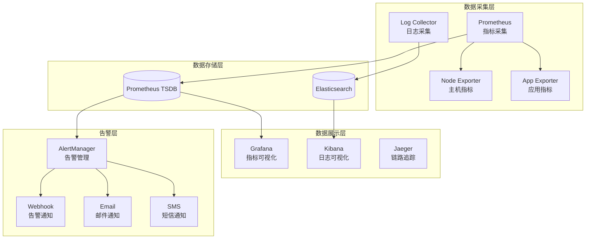
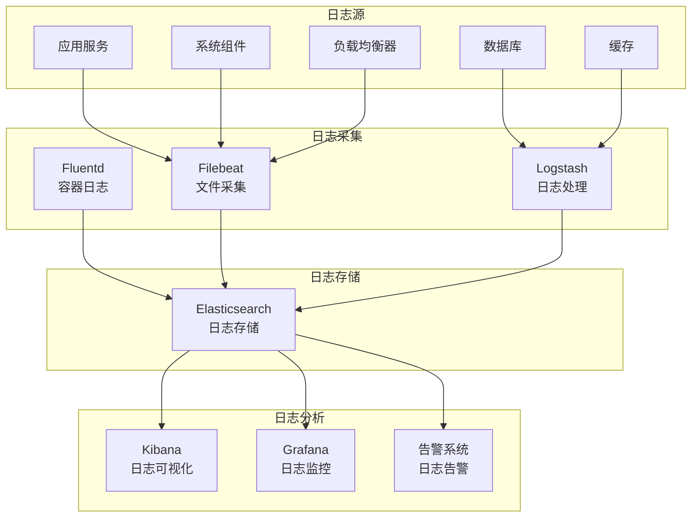
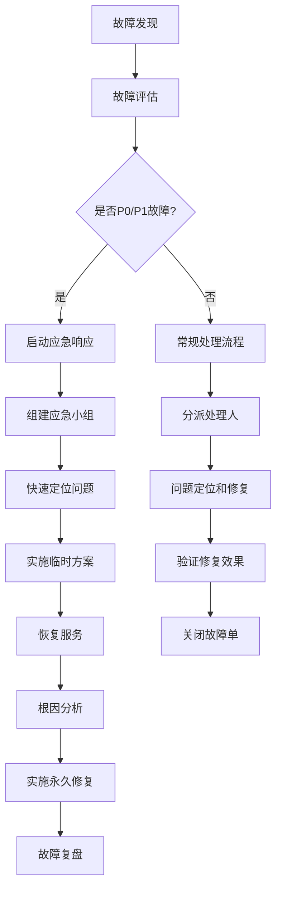

# IOE-DREAM 微服务架构运维交接手册

## 📋 交接基本信息

**手册版本**: v1.0
**创建日期**: 2025年11月29日
**交接状态**: 待验收
**适用环境**: 生产环境、测试环境、开发环境

---

## 🎯 交接目标

### 1. 运维能力传递
- 掌握微服务架构的运维理念和方法
- 具备独立部署和维护微服务系统的能力
- 能够进行系统监控和故障诊断
- 掌握性能调优和容量规划技能

### 2. 运维流程建立
- 建立标准化的运维操作流程
- 制定应急预案和故障处理机制
- 建立变更管理和发布流程
- 完善监控告警和日志分析体系

### 3. 运维工具掌握
- 熟练使用容器化部署工具
- 掌握监控告警系统配置
- 熟悉日志管理和分析工具
- 了解自动化运维脚本使用

---

## 🏗️ 系统架构概览

### 1. 部署架构

```mermaid
graph TB
    subgraph "负载均衡层"
        LB[Nginx/HAProxy<br/>80/443]
    end

    subgraph "API网关层"
        Gateway[smart-gateway<br/>8080]
    end

    subgraph "业务服务层"
        Auth[ioedream-auth-service<br/>8081]
        Identity[ioedream-identity-service<br/>8082]
        Device[ioedream-device-service<br/>8101]
        Access[ioedream-access-service<br/>8102]
        Consume[ioedream-consume-service<br/>8103]
        Visitor[ioedream-visitor-service<br/>8104]
        Attendance[ioedream-attendance-service<br/>8105]
        Video[ioedream-video-service<br/>8106]
        Notification[ioedream-notification-service<br/>8107]
        File[ioedream-file-service<br/>8108]
        Report[ioedream-report-service<br/>8109]
    end

    subgraph "支撑服务层"
        Audit[ioedream-audit-service<br/>8110]
        Logging[ioedream-logging-service<br/>8111]
        Config[ioedream-config-service<br/>8112]
        Monitor[monitor-service<br/>8300]
        HR[hr-service<br/>8200]
        Analytics[analytics-service<br/>8201]
    end

    subgraph "基础设施层"
        K8s[Kubernetes集群]
        MySQL[(MySQL集群)]
        Redis[(Redis集群)]
        MinIO[(MinIO集群)]
        RabbitMQ[RabbitMQ集群]
        Consul[Consul集群]
    end

    subgraph "监控运维层"
        Prometheus[Prometheus]
        Grafana[Grafana]
        Jaeger[Jaeger]
        ELK[ELK Stack]
    end

    LB --> Gateway
    Gateway --> Auth
    Gateway --> Identity
    Gateway --> Device
    Gateway --> Access
    Gateway --> Consume
    Gateway --> Visitor
    Gateway --> Attendance
    Gateway --> Video
    Gateway --> Notification
    Gateway --> File
    Gateway --> Report

    Auth --> K8s
    Identity --> K8s
    Device --> K8s
    Access --> K8s
    Consume --> K8s
    Visitor --> K8s
    Attendance --> K8s
    Video --> K8s
    Notification --> K8s
    File --> K8s
    Report --> K8s
    Audit --> K8s
    Logging --> K8s
    Config --> K8s
    Monitor --> K8s
    HR --> K8s
    Analytics --> K8s

    K8s --> MySQL
    K8s --> Redis
    K8s --> MinIO
    K8s --> RabbitMQ
    K8s --> Consul

    Prometheus --> K8s
    Grafana --> Prometheus
    Jaeger --> K8s
    ELK --> K8s
```



### 2. 环境配置

#### 2.1 环境分类

| 环境类型 | 用途 | 集群配置 | 数据隔离 |
|---------|------|----------|----------|
| 开发环境(DEV) | 开发调试 | 单节点K8s | 独立数据库 |
| 测试环境(TEST) | 功能测试 | 3节点K8s | 独立数据库 |
| 预生产环境(STAGING) | 上线前验证 | 5节点K8s | 生产数据备份 |
| 生产环境(PROD) | 正式运行 | 高可用K8s | 生产数据库 |

#### 2.2 网络配置

```yaml
# 网络规划
network_config:
  # 负载均衡器VIP
  vip_frontend: 192.168.1.100/24
  vip_backend: 10.0.0.100/16

  # Kubernetes网络
  pod_cidr: 10.244.0.0/16
  service_cidr: 10.96.0.0/12
  node_cidr: 10.0.0.0/16

  # 数据库网络
  mysql_vip: 10.10.10.100
  redis_vip: 10.10.10.101
  minio_vip: 10.10.10.102
  rabbitmq_vip: 10.10.10.103

  # 服务端口分配
  service_ports:
    gateway: 8080
    auth: 8081
    identity: 8082
    device: 8101
    access: 8102
    consume: 8103
    visitor: 8104
    attendance: 8105
    video: 8106
    notification: 8107
    file: 8108
    report: 8109
    audit: 8110
    logging: 8111
    config: 8112
    monitor: 8300
    hr: 8200
    analytics: 8201
```

---

## 🔧 部署指南

### 1. 基础设施部署

#### 1.1 Kubernetes集群部署

**Master节点部署**:
```bash
# 1. 安装Docker
curl -fsSL https://get.docker.com | sh
systemctl enable docker
systemctl start docker

# 2. 安装kubeadm、kubelet、kubectl
cat <<EOF | sudo tee /etc/yum.repos.d/kubernetes.repo
[kubernetes]
name=Kubernetes
baseurl=https://packages.cloud.google.com/yum/repos/kubernetes-el7-\$basearch
enabled=1
gpgcheck=1
repo_gpgcheck=1
gpgkey=https://packages.cloud.google.com/yum/doc/yum-key.gpg https://packages.cloud.google.com/yum/doc/rpm-package-key.gpg
EOF

yum install -y kubelet kubeadm kubectl
systemctl enable kubelet

# 3. 初始化Master节点
kubeadm init --pod-network-cidr=10.244.0.0/16 --service-cidr=10.96.0.0/12

# 4. 配置kubectl
mkdir -p $HOME/.kube
cp -i /etc/kubernetes/admin.conf $HOME/.kube/config
chown $(id -u):$(id -g) $HOME/.kube/config

# 5. 安装网络插件（Flannel）
kubectl apply -f https://raw.githubusercontent.com/coreos/flannel/master/Documentation/kube-flannel.yml

# 6. 允许Master节点调度Pod（测试环境）
kubectl taint nodes --all node-role.kubernetes.io/master-
```

**Worker节点加入**:
```bash
# 在Worker节点执行
kubeadm join <master-ip>:6443 --token <token> --discovery-token-ca-cert-hash <hash>
```

#### 1.2 存储部署

**持久化存储配置**:
```yaml
apiVersion: v1
kind: PersistentVolume
metadata:
  name: mysql-pv
  namespace: ioedream
spec:
  capacity:
    storage: 100Gi
  accessModes:
    - ReadWriteOnce
  persistentVolumeReclaimPolicy: Retain
  storageClassName: nfs
  nfs:
    server: nfs-server
    path: /data/mysql
```

**StorageClass配置**:
```yaml
apiVersion: storage.k8s.io/v1
kind: StorageClass
metadata:
  name: nfs-storage
provisioner: nfs.csi.k8s.io
parameters:
  server: nfs-server
  share: /data
reclaimPolicy: Retain
allowVolumeExpansion: true
```

### 2. 中间件部署

#### 2.1 MySQL集群部署

**MySQL Master配置**:
```yaml
apiVersion: apps/v1
kind: StatefulSet
metadata:
  name: mysql-master
  namespace: ioedream
spec:
  serviceName: mysql-master
  replicas: 1
  selector:
    matchLabels:
      app: mysql-master
  template:
    metadata:
      labels:
        app: mysql-master
    spec:
      containers:
      - name: mysql
        image: mysql:8.0
        env:
        - name: MYSQL_ROOT_PASSWORD
          value: "ioedream@2025"
        - name: MYSQL_DATABASE
          value: "ioedream"
        ports:
        - containerPort: 3306
          name: mysql
        volumeMounts:
        - name: mysql-storage
          mountPath: /var/lib/mysql
        - name: mysql-config
          mountPath: /etc/mysql/conf.d
      volumes:
      - name: mysql-config
        configMap:
          name: mysql-config
  volumeClaimTemplates:
  - metadata:
      name: mysql-storage
    spec:
      accessModes: ["ReadWriteOnce"]
      resources:
        requests:
          storage: 50Gi
      storageClassName: nfs-storage
```

**MySQL配置**:
```yaml
apiVersion: v1
kind: ConfigMap
metadata:
  name: mysql-config
  namespace: ioedream
data:
  my.cnf: |
    [mysqld]
    # 基本配置
    server-id = 1
    bind-address = 0.0.0.0
    port = 3306

    # 字符集配置
    character-set-server = utf8mb4
    collation-server = utf8mb4_unicode_ci

    # 性能配置
    innodb_buffer_pool_size = 2G
    innodb_log_file_size = 256M
    innodb_log_buffer_size = 16M
    max_connections = 1000

    # 主从复制配置
    log-bin = mysql-bin
    binlog-format = ROW
    gtid-mode = ON
    enforce-gtid-consistency = true

    # 慢查询日志
    slow_query_log = 1
    slow_query_log_file = /var/log/mysql/slow.log
    long_query_time = 2
```

#### 2.2 Redis集群部署

**Redis配置**:
```yaml
apiVersion: apps/v1
kind: StatefulSet
metadata:
  name: redis-cluster
  namespace: ioedream
spec:
  serviceName: redis-cluster
  replicas: 6
  selector:
    matchLabels:
      app: redis-cluster
  template:
    metadata:
      labels:
        app: redis-cluster
    spec:
      containers:
      - name: redis
        image: redis:7.0
        command:
        - redis-server
        - /etc/redis/redis.conf
        - --cluster-enabled
        - "yes"
        - --cluster-config-file
        - nodes.conf
        - --cluster-node-timeout
        - "5000"
        - --appendonly
        - "yes"
        ports:
        - containerPort: 6379
          name: client
        - containerPort: 16379
          name: gossip
        volumeMounts:
        - name: redis-storage
          mountPath: /data
        - name: redis-config
          mountPath: /etc/redis
  volumeClaimTemplates:
  - metadata:
      name: redis-storage
    spec:
      accessModes: ["ReadWriteOnce"]
      resources:
        requests:
          storage: 10Gi
      storageClassName: nfs-storage
```

### 3. 应用服务部署

#### 3.1 服务部署模板

**通用部署模板**:
```yaml
apiVersion: apps/v1
kind: Deployment
metadata:
  name: ioedream-{service-name}
  namespace: ioedream
  labels:
    app: ioedream-{service-name}
    version: v1.0.0
    tier: backend
spec:
  replicas: {replicas}
  strategy:
    type: RollingUpdate
    rollingUpdate:
      maxSurge: 1
      maxUnavailable: 0
  selector:
    matchLabels:
      app: ioedream-{service-name}
  template:
    metadata:
      labels:
        app: ioedream-{service-name}
        version: v1.0.0
        tier: backend
    spec:
      containers:
      - name: ioedream-{service-name}
        image: ioedream/{service-name}:v1.0.0
        ports:
        - containerPort: {port}
          name: http
        env:
        - name: SPRING_PROFILES_ACTIVE
          value: "{profile}"
        - name: CONSUL_HOST
          value: "consul-service"
        - name: DB_HOST
          value: "mysql-master"
        - name: REDIS_HOST
          value: "redis-cluster"
        resources:
          requests:
            memory: "512Mi"
            cpu: "250m"
          limits:
            memory: "1Gi"
            cpu: "500m"
        livenessProbe:
          httpGet:
            path: /actuator/health/liveness
            port: {port}
          initialDelaySeconds: 60
          periodSeconds: 30
          timeoutSeconds: 10
        readinessProbe:
          httpGet:
            path: /actuator/health/readiness
            port: {port}
          initialDelaySeconds: 30
          periodSeconds: 10
          timeoutSeconds: 5
        volumeMounts:
        - name: config-volume
          mountPath: /app/config
          readOnly: true
        - name: logs-volume
          mountPath: /app/logs
      volumes:
      - name: config-volume
        configMap:
          name: ioedream-{service-name}-config
      - name: logs-volume
        emptyDir: {}

---
apiVersion: v1
kind: Service
metadata:
  name: ioedream-{service-name}
  namespace: ioedream
  labels:
    app: ioedream-{service-name}
spec:
  type: ClusterIP
  ports:
  - port: {port}
    targetPort: {port}
    protocol: TCP
    name: http
  selector:
    app: ioedream-{service-name}

---
apiVersion: autoscaling/v2
kind: HorizontalPodAutoscaler
metadata:
  name: ioedream-{service-name}-hpa
  namespace: ioedream
spec:
  scaleTargetRef:
    apiVersion: apps/v1
    kind: Deployment
    name: ioedream-{service-name}
  minReplicas: {min-replicas}
  maxReplicas: {max-replicas}
  metrics:
  - type: Resource
    resource:
      name: cpu
      target:
        type: Utilization
        averageUtilization: 70
  - type: Resource
    resource:
      name: memory
      target:
        type: Utilization
        averageUtilization: 80
```

#### 3.2 服务部署清单

| 服务名称 | 副本数 | 最小副本 | 最大副本 | 端口 | 部署优先级 |
|---------|-------|---------|---------|------|----------|
| smart-gateway | 2 | 2 | 5 | 8080 | P0 |
| ioedream-auth-service | 2 | 2 | 5 | 8081 | P0 |
| ioedream-identity-service | 2 | 2 | 5 | 8082 | P0 |
| ioedream-device-service | 2 | 2 | 5 | 8101 | P1 |
| ioedream-access-service | 2 | 2 | 5 | 8102 | P1 |
| ioedream-consume-service | 2 | 2 | 5 | 8103 | P1 |
| ioedream-visitor-service | 2 | 2 | 5 | 8104 | P1 |
| ioedream-attendance-service | 2 | 2 | 5 | 8105 | P1 |
| ioedream-video-service | 2 | 2 | 5 | 8106 | P1 |
| ioedream-notification-service | 1 | 1 | 3 | 8107 | P2 |
| ioedream-file-service | 1 | 1 | 3 | 8108 | P2 |
| ioedream-report-service | 1 | 1 | 3 | 8109 | P2 |

---

## 📊 监控告警

### 1. 监控系统架构



### 2. 核心监控指标

#### 2.1 系统指标

| 指标类别 | 指标名称 | 说明 | 告警阈值 |
|---------|---------|------|----------|
| CPU | cpu_usage_percent | CPU使用率 | > 80% |
| 内存 | memory_usage_percent | 内存使用率 | > 85% |
| 磁盘 | disk_usage_percent | 磁盘使用率 | > 90% |
| 网络 | network_bytes_total | 网络流量 | - |
| 负载 | system_load | 系统负载 | > CPU核心数*2 |

#### 2.2 应用指标

| 指标类别 | 指标名称 | 说明 | 告警阈值 |
|---------|---------|------|----------|
| QPS | http_requests_total | HTTP请求数 | > 1000/s |
| 响应时间 | http_request_duration_seconds | 响应时间 | P95 > 500ms |
| 错误率 | http_requests_errors_total | 错误请求数 | > 5% |
| 并发数 | active_connections | 活跃连接数 | > 1000 |
| GC | jvm_gc_collection_seconds_total | GC耗时 | > 1s |

#### 2.3 业务指标

| 指标类别 | 指标名称 | 说明 | 告警阈值 |
|---------|---------|------|----------|
| 用户 | active_users | 活跃用户数 | < 100 |
| 设备 | online_devices | 在线设备数 | < 100 |
| 访问 | access_requests | 门禁请求数 | 异常波动 |
| 消费 | consume_amount | 消费金额 | 异常波动 |

### 3. 告警规则配置

#### 3.1 系统告警规则

```yaml
groups:
- name: system.rules
  rules:
  - alert: HighCPUUsage
    expr: 100 - (avg by(instance) (irate(node_cpu_seconds_total{mode="idle"}[5m])) * 100) > 80
    for: 5m
    labels:
      severity: warning
      team: ops
    annotations:
      summary: "High CPU usage detected"
      description: "Instance {{ $labels.instance }} has CPU usage above 80% for more than 5 minutes"

  - alert: HighMemoryUsage
    expr: (1 - (node_memory_MemAvailable_bytes / node_memory_MemTotal_bytes)) * 100 > 85
    for: 5m
    labels:
      severity: warning
      team: ops
    annotations:
      summary: "High memory usage detected"
      description: "Instance {{ $labels.instance }} has memory usage above 85% for more than 5 minutes"

  - alert: DiskSpaceLow
    expr: (1 - (node_filesystem_avail_bytes / node_filesystem_size_bytes)) * 100 > 90
    for: 5m
    labels:
      severity: critical
      team: ops
    annotations:
      summary: "Disk space low"
      description: "Instance {{ $labels.instance }} has disk usage above 90%"
```

#### 3.2 应用告警规则

```yaml
groups:
- name: application.rules
  rules:
  - alert: HighErrorRate
    expr: rate(http_requests_total{status=~"5.."}[5m]) / rate(http_requests_total[5m]) * 100 > 5
    for: 3m
    labels:
      severity: critical
      team: devops
    annotations:
      summary: "High error rate detected"
      description: "Service {{ $labels.service }} has error rate above 5% for more than 3 minutes"

  - alert: HighResponseTime
    expr: histogram_quantile(0.95, rate(http_request_duration_seconds_bucket[5m])) > 0.5
    for: 5m
    labels:
      severity: warning
      team: devops
    annotations:
      summary: "High response time detected"
      description: "Service {{ $labels.service }} has P95 response time above 500ms"

  - alert: ServiceDown
    expr: up == 0
    for: 1m
    labels:
      severity: critical
      team: devops
    annotations:
      summary: "Service is down"
      description: "Service {{ $labels.service }} on {{ $labels.instance }} is down"
```

### 4. Grafana仪表板

#### 4.1 系统监控仪表板

```json
{
  "dashboard": {
    "title": "IOE-DREAM 系统监控",
    "panels": [
      {
        "title": "CPU使用率",
        "type": "graph",
        "targets": [
          {
            "expr": "100 - (avg by(instance) (irate(node_cpu_seconds_total{mode=\"idle\"}[5m])) * 100)",
            "legendFormat": "{{instance}}"
          }
        ]
      },
      {
        "title": "内存使用率",
        "type": "graph",
        "targets": [
          {
            "expr": "(1 - (node_memory_MemAvailable_bytes / node_memory_MemTotal_bytes)) * 100",
            "legendFormat": "{{instance}}"
          }
        ]
      },
      {
        "title": "磁盘使用率",
        "type": "graph",
        "targets": [
          {
            "expr": "(1 - (node_filesystem_avail_bytes / node_filesystem_size_bytes)) * 100",
            "legendFormat": "{{instance}}:{{mountpoint}}"
          }
        ]
      },
      {
        "title": "网络流量",
        "type": "graph",
        "targets": [
          {
            "expr": "irate(node_network_receive_bytes_total[5m])",
            "legendFormat": "{{instance}}:RX"
          },
          {
            "expr": "irate(node_network_transmit_bytes_total[5m])",
            "legendFormat": "{{instance}}:TX"
          }
        ]
      }
    ]
  }
}
```

#### 4.2 应用监控仪表板

```json
{
  "dashboard": {
    "title": "IOE-DREAM 应用监控",
    "panels": [
      {
        "title": "请求QPS",
        "type": "graph",
        "targets": [
          {
            "expr": "sum by(service) (rate(http_requests_total[5m]))",
            "legendFormat": "{{service}}"
          }
        ]
      },
      {
        "title": "响应时间分布",
        "type": "graph",
        "targets": [
          {
            "expr": "histogram_quantile(0.50, rate(http_request_duration_seconds_bucket[5m]))",
            "legendFormat": "P50"
          },
          {
            "expr": "histogram_quantile(0.95, rate(http_request_duration_seconds_bucket[5m]))",
            "legendFormat": "P95"
          },
          {
            "expr": "histogram_quantile(0.99, rate(http_request_duration_seconds_bucket[5m]))",
            "legendFormat": "P99"
          }
        ]
      },
      {
        "title": "错误率",
        "type": "graph",
        "targets": [
          {
            "expr": "sum by(service) (rate(http_requests_total{status=~\"5..\"}[5m])) / sum by(service) (rate(http_requests_total[5m])) * 100",
            "legendFormat": "{{service}}"
          }
        ]
      },
      {
        "title": "在线服务数",
        "type": "singlestat",
        "targets": [
          {
            "expr": "sum(up)",
            "legendFormat": "在线服务"
          }
        ]
      }
    ]
  }
}
```

---

## 🔍 日志管理

### 1. 日志架构



### 2. 日志配置

#### 2.1 应用日志配置

**Logback配置**:
```xml
<?xml version="1.0" encoding="UTF-8"?>
<configuration>
    <!-- 控制台输出 -->
    <appender name="CONSOLE" class="ch.qos.logback.core.ConsoleAppender">
        <encoder class="net.logstash.logback.encoder.LoggingEventCompositeJsonEncoder">
            <providers>
                <timestamp/>
                <logLevel/>
                <loggerName/>
                <mdc/>
                <arguments/>
                <stackTrace/>
                <message/>
            </providers>
        </encoder>
    </appender>

    <!-- 文件输出 -->
    <appender name="FILE" class="ch.qos.logback.core.rolling.RollingFileAppender">
        <file>logs/ioedream-access-service.log</file>
        <rollingPolicy class="ch.qos.logback.core.rolling.TimeBasedRollingPolicy">
            <fileNamePattern>logs/ioedream-access-service.%d{yyyy-MM-dd}.log</fileNamePattern>
            <maxHistory>30</maxHistory>
            <totalSizeCap>10GB</totalSizeCap>
        </rollingPolicy>
        <encoder class="net.logstash.logback.encoder.LoggingEventCompositeJsonEncoder">
            <providers>
                <timestamp/>
                <logLevel/>
                <loggerName/>
                <mdc/>
                <arguments/>
                <stackTrace/>
                <message/>
            </providers>
        </encoder>
    </appender>

    <!-- 错误日志单独输出 -->
    <appender name="ERROR_FILE" class="ch.qos.logback.core.rolling.RollingFileAppender">
        <file>logs/error.log</file>
        <filter class="ch.qos.logback.classic.filter.LevelFilter">
            <level>ERROR</level>
            <onMatch>ACCEPT</onMatch>
            <onMismatch>DENY</onMismatch>
        </filter>
        <rollingPolicy class="ch.qos.logback.core.rolling.TimeBasedRollingPolicy">
            <fileNamePattern>logs/error.%d{yyyy-MM-dd}.log</fileNamePattern>
            <maxHistory>30</maxHistory>
        </rollingPolicy>
        <encoder class="net.logstash.logback.encoder.LoggingEventCompositeJsonEncoder">
            <providers>
                <timestamp/>
                <logLevel/>
                <loggerName/>
                <mdc/>
                <arguments/>
                <stackTrace/>
                <message/>
            </providers>
        </encoder>
    </appender>

    <!-- 日志级别配置 -->
    <springProfile name="dev">
        <root level="DEBUG">
            <appender-ref ref="CONSOLE"/>
            <appender-ref ref="FILE"/>
        </root>
    </springProfile>

    <springProfile name="test,prod">
        <root level="INFO">
            <appender-ref ref="FILE"/>
            <appender-ref ref="ERROR_FILE"/>
        </root>
    </springProfile>

    <!-- 特定包的日志级别 -->
    <logger name="net.lab1024.sa.access" level="DEBUG"/>
    <logger name="org.springframework.cloud" level="WARN"/>
    <logger name="com.netflix" level="WARN"/>
</configuration>
```

#### 2.2 MDC上下文配置

**MDC过滤器**:
```java
@Component
@Order(1)
public class MdcFilter implements Filter {

    @Override
    public void doFilter(ServletRequest request, ServletResponse response, FilterChain chain)
            throws IOException, ServletException {

        HttpServletRequest httpRequest = (HttpServletRequest) request;

        try {
            // 生成请求ID
            String requestId = UUID.randomUUID().toString().replace("-", "");

            // 添加MDC信息
            MDC.put("requestId", requestId);
            MDC.put("service", SpringContextUtil.getApplicationName());
            MDC.put("version", SpringContextUtil.getApplicationVersion());
            MDC.put("environment", SpringContextUtil.getActiveProfile());

            // 用户信息
            Authentication auth = SecurityContextHolder.getContext().getAuthentication();
            if (auth != null && auth.isAuthenticated()) {
                MDC.put("userId", auth.getName());
            }

            // 请求信息
            MDC.put("uri", httpRequest.getRequestURI());
            MDC.put("method", httpRequest.getMethod());
            MDC.put("clientIp", getClientIp(httpRequest));
            MDC.put("userAgent", httpRequest.getHeader("User-Agent"));

            chain.doFilter(request, response);

        } finally {
            MDC.clear();
        }
    }

    private String getClientIp(HttpServletRequest request) {
        String xForwardedFor = request.getHeader("X-Forwarded-For");
        if (StringUtils.hasText(xForwardedFor)) {
            return xForwardedFor.split(",")[0].trim();
        }
        return request.getRemoteAddr();
    }
}
```

### 3. 日志收集配置

#### 3.1 Filebeat配置

**filebeat.yml**:
```yaml
filebeat.inputs:
- type: log
  enabled: true
  paths:
    - /app/logs/*.log
  multiline.pattern: '^\d{4}-\d{2}-\d{2}'
  multiline.negate: true
  multiline.match: after
  fields:
    service: ioedream-access-service
    environment: ${ENVIRONMENT:prod}
  fields_under_root: true

- type: container
  enabled: true
  paths:
    - /var/log/containers/*.log
  processors:
    - add_kubernetes_metadata:
        host: ${NODE_NAME}
        matchers:
        - logs_path:
            logs_path: "/var/log/containers/"

output.elasticsearch:
  hosts: ["elasticsearch:9200"]
  index: "ioedream-logs-%{+yyyy.MM.dd}"
  template.name: "ioedream"
  template.pattern: "ioedream-*"
  template.settings:
    index.number_of_shards: 1
    index.number_of_replicas: 1

processors:
  - timestamp:
      field: json.timestamp
      layouts:
        - '2006-01-02T15:04:05.000Z'
  - drop_fields:
      fields: ["agent", "ecs", "host", "input", "log"]

logging.level: info
logging.to_files: true
logging.files:
  path: /var/log/filebeat
  name: filebeat
  keepfiles: 7
  permissions: 0644
```

#### 3.2 Logstash配置

**logstash.conf**:
```ruby
input {
  beats {
    port => 5044
  }
}

filter {
  # 解析JSON格式的日志
  if [message] {
    json {
      source => "message"
    }
  }

  # 时间戳处理
  if [timestamp] {
    date {
      match => [ "timestamp", "yyyy-MM-dd HH:mm:ss.SSS", "yyyy-MM-dd'T'HH:mm:ss.SSSZ" ]
    }
  }

  # 添加地理位置信息（基于IP）
  if [clientIp] and [clientIp] != "127.0.0.1" {
    geoip {
      source => "clientIp"
      target => "geoip"
    }
  }

  # 解析User-Agent
  if [userAgent] {
    useragent {
      source => "userAgent"
      target => "userAgent"
    }
  }

  # 添加索引名称
  mutate {
    add_field => { "[@metadata][index]" => "ioedream-logs-%{+YYYY.MM.dd}" }
  }
}

output {
  elasticsearch {
    hosts => ["elasticsearch:9200"]
    index => "%{[@metadata][index]}"
    template_name => "ioedream"
    template_pattern => "ioedream-*"
    template => {
      "index_patterns" => ["ioedream-*"],
      "settings" => {
        "number_of_shards" => 1,
        "number_of_replicas" => 1,
        "index.refresh_interval" => "5s"
      },
      "mappings" => {
        "properties" => {
          "@timestamp" => { "type" => "date" },
          "level" => { "type" => "keyword" },
          "service" => { "type" => "keyword" },
          "requestId" => { "type" => "keyword" },
          "userId" => { "type" => "keyword" },
          "uri" => { "type" => "keyword" },
          "method" => { "type" => "keyword" },
          "clientIp" => { "type" => "ip" },
          "responseTime" => { "type" => "long" },
          "statusCode" => { "type" => "integer" }
        }
      }
    }
  }

  # 调试输出（可选）
  stdout {
    codec => rubydebug
  }
}
```

### 4. 日志查询分析

#### 4.1 常用查询语句

**错误日志查询**:
```
level:ERROR AND service:ioedream-access-service
```

**慢请求查询**:
```
responseTime:>1000 AND service:ioedream-access-service
```

**用户操作查询**:
```
userId:12345 AND service:ioedream-access-service
```

**API错误统计**:
```
level:ERROR AND uri:/api/access/* | stats count by uri
```

**响应时间分析**:
```
service:ioedream-access-service | stats avg(responseTime) by uri
```

#### 4.2 告警规则配置

**错误率告警**:
```json
{
  "trigger": {
    "schedule": {
      "interval": "1m"
    }
  },
  "input": {
    "search": {
      "request": {
        "indices": ["ioedream-logs-*"],
        "body": {
          "query": {
            "bool": {
              "must": [
                { "range": { "@timestamp": { "gte": "now-1m" } } },
                { "term": { "level": "ERROR" } }
              ]
            }
          }
        }
      }
    }
  },
  "condition": {
    "compare": {
      "ctx.payload.hits.total": {
        "gte": 10
      }
    }
  },
  "actions": {
    "send_email": {
      "email": {
        "to": ["ops@ioedream.com"],
        "subject": "IOE-DREAM 错误日志告警",
        "body": "在过去1分钟内发现 {{ctx.payload.hits.total}} 条错误日志"
      }
    }
  }
}
```

---

## 💾 备份恢复

### 1. 备份策略

#### 1.1 数据备份策略

| 备份类型 | 备份频率 | 保留期限 | 备份方式 | 存储位置 |
|---------|---------|----------|----------|----------|
| 全量备份 | 每日 | 30天 | mysqldump | 备份服务器 |
| 增量备份 | 每小时 | 7天 | binlog | 备份服务器 |
| 日志备份 | 每日 | 90天 | 文件压缩 | 对象存储 |
| 配置备份 | 变更时 | 永久 | Git | 代码仓库 |

#### 1.2 备份执行脚本

**MySQL全量备份脚本**:
```bash
#!/bin/bash

# 配置变量
BACKUP_DIR="/backup/mysql"
DATE=$(date +%Y%m%d_%H%M%S)
DB_NAME="ioedream_access"
BACKUP_FILE="${BACKUP_DIR}/${DB_NAME}_full_${DATE}.sql"
RETENTION_DAYS=30

# 创建备份目录
mkdir -p ${BACKUP_DIR}

# 执行全量备份
mysqldump \
  --host=mysql-master \
  --port=3306 \
  --username=root \
  --password=${MYSQL_ROOT_PASSWORD} \
  --single-transaction \
  --routines \
  --triggers \
  --events \
  --hex-blob \
  --default-character-set=utf8mb4 \
  ${DB_NAME} > ${BACKUP_FILE}

# 压缩备份文件
gzip ${BACKUP_FILE}

# 删除过期备份
find ${BACKUP_DIR} -name "*.sql.gz" -mtime +${RETENTION_DAYS} -delete

# 记录备份日志
logger "MySQL full backup completed: ${BACKUP_FILE}.gz"
```

**增量备份脚本**:
```bash
#!/bin/bash

# 配置变量
BACKUP_DIR="/backup/mysql/binlog"
DATE=$(date +%Y%m%d_%H%M%S)
MYSQL_HOST="mysql-master"
MYSQL_USER="root"
MYSQL_PASSWORD="${MYSQL_ROOT_PASSWORD}"
RETENTION_DAYS=7

# 创建备份目录
mkdir -p ${BACKUP_DIR}

# 获取当前binlog文件和位置
mysql -h${MYSQL_HOST} -u${MYSQL_USER} -p${MYSQL_PASSWORD} -e "SHOW MASTER STATUS;" > /tmp/master_status.txt

# 刷新binlog
mysql -h${MYSQL_HOST} -u${MYSQL_USER} -p${MYSQL_PASSWORD} -e "FLUSH LOGS;"

# 复制binlog文件到备份目录
cp /var/lib/mysql/mysql-bin.* ${BACKUP_DIR}/

# 压缩binlog文件
cd ${BACKUP_DIR}
for file in mysql-bin.*; do
    if [[ ! "$file" =~ \.gz$ ]]; then
        gzip "$file"
    fi
done

# 删除过期备份
find ${BACKUP_DIR} -name "mysql-bin.*.gz" -mtime +${RETENTION_DAYS} -delete

# 记录备份日志
logger "MySQL binlog backup completed: ${DATE}"
```

### 2. 恢复策略

#### 2.1 数据库恢复

**全量恢复脚本**:
```bash
#!/bin/bash

# 配置变量
BACKUP_FILE=$1
RESTORE_DB="ioedream_access_restore"
MYSQL_HOST="mysql-master"
MYSQL_USER="root"
MYSQL_PASSWORD="${MYSQL_ROOT_PASSWORD}"

# 检查备份文件
if [ ! -f "${BACKUP_FILE}" ]; then
    echo "备份文件不存在: ${BACKUP_FILE}"
    exit 1
fi

# 创建恢复数据库
mysql -h${MYSQL_HOST} -u${MYSQL_USER} -p${MYSQL_PASSWORD} -e "CREATE DATABASE IF NOT EXISTS ${RESTORE_DB};"

# 执行恢复
if [[ ${BACKUP_FILE} =~ \.gz$ ]]; then
    gunzip -c ${BACKUP_FILE} | mysql -h${MYSQL_HOST} -u${MYSQL_USER} -p${MYSQL_PASSWORD} ${RESTORE_DB}
else
    mysql -h${MYSQL_HOST} -u${MYSQL_USER} -p${MYSQL_PASSWORD} ${RESTORE_DB} < ${BACKUP_FILE}
fi

# 验证恢复结果
mysql -h${MYSQL_HOST} -u${MYSQL_USER} -p${MYSQL_PASSWORD} -e "SELECT COUNT(*) FROM ${RESTORE_DB}.t_access_record;"

echo "数据库恢复完成: ${RESTORE_DB}"
```

**基于时间点恢复**:
```bash
#!/bin/bash

# 配置变量
RESTORE_TIME=$1  # 格式: 2025-11-29 15:30:00
BACKUP_DIR="/backup/mysql"
RESTORE_DB="ioedream_access_restore"
MYSQL_HOST="mysql-master"
MYSQL_USER="root"
MYSQL_PASSWORD="${MYSQL_ROOT_PASSWORD}"

# 查找最接近恢复时间的全量备份
FULL_BACKUP=$(find ${BACKUP_DIR} -name "*full*.sql.gz" | sort | tail -n1)

# 恢复全量备份
echo "恢复全量备份: ${FULL_BACKUP}"
gunzip -c ${FULL_BACKUP} | mysql -h${MYSQL_HOST} -u${MYSQL_USER} -p${MYSQL_PASSWORD} ${RESTORE_DB}

# 应用binlog到指定时间点
echo "应用binlog到时间点: ${RESTORE_TIME}"
mysqlbinlog \
  --host=${MYSQL_HOST} \
  --user=${MYSQL_USER} \
  --password=${MYSQL_PASSWORD} \
  --database=${RESTORE_DB} \
  --stop-datetime="${RESTORE_TIME}" \
  /var/lib/mysql/mysql-bin.* | mysql -h${MYSQL_HOST} -u${MYSQL_USER} -p${MYSQL_PASSWORD} ${RESTORE_DB}

echo "时间点恢复完成: ${RESTORE_DB}"
```

#### 2.2 应用配置恢复

**Kubernetes配置恢复**:
```bash
#!/bin/bash

# 恢复ConfigMap
kubectl apply -f backup/configmaps/

# 恢复Secret
kubectl apply -f backup/secrets/

# 恢复Service
kubectl apply -f backup/services/

# 重启Deployment
kubectl rollout restart deployment -l app=ioedream-access-service -n ioedream
```

### 3. 备份验证

#### 3.1 备份完整性验证

**备份验证脚本**:
```bash
#!/bin/bash

# 配置变量
BACKUP_FILE=$1
TEMP_DB="backup_verify_${RANDOM}"
MYSQL_HOST="mysql-master"
MYSQL_USER="root"
MYSQL_PASSWORD="${MYSQL_ROOT_PASSWORD}"

# 创建临时数据库
mysql -h${MYSQL_HOST} -u${MYSQL_USER} -p${MYSQL_PASSWORD} -e "CREATE DATABASE ${TEMP_DB};"

# 恢复备份到临时数据库
if [[ ${BACKUP_FILE} =~ \.gz$ ]]; then
    gunzip -c ${BACKUP_FILE} | mysql -h${MYSQL_HOST} -u${MYSQL_USER} -p${MYSQL_PASSWORD} ${TEMP_DB}
else
    mysql -h${MYSQL_HOST} -u${MYSQL_USER} -p${MYSQL_PASSWORD} ${TEMP_DB} < ${BACKUP_FILE}
fi

# 验证表结构
echo "验证表结构..."
mysql -h${MYSQL_HOST} -u${MYSQL_USER} -p${MYSQL_PASSWORD} -e "
  SELECT COUNT(*) as table_count
  FROM information_schema.tables
  WHERE table_schema='${TEMP_DB}';"

# 验证数据完整性
echo "验证数据完整性..."
mysql -h${MYSQL_HOST} -u${MYSQL_USER} -p${MYSQL_PASSWORD} -e "
  SELECT
    't_access_record' as table_name,
    COUNT(*) as record_count
  FROM ${TEMP_DB}.t_access_record
  UNION ALL
  SELECT
    't_device_info' as table_name,
    COUNT(*) as record_count
  FROM ${TEMP_DB}.t_device_info;"

# 清理临时数据库
mysql -h${MYSQL_HOST} -u${MYSQL_USER} -p${MYSQL_PASSWORD} -e "DROP DATABASE ${TEMP_DB};"

echo "备份验证完成"
```

---

## ⚡ 性能调优

### 1. JVM调优

#### 1.1 JVM参数配置

**生产环境JVM参数**:
```bash
JAVA_OPTS="-Xms2g -Xmx4g \
-XX:+UseG1GC \
-XX:MaxGCPauseMillis=200 \
-XX:G1HeapRegionSize=16m \
-XX:G1NewSizePercent=30 \
-XX:G1MaxNewSizePercent=40 \
-XX:+UseStringDeduplication \
-XX:+OptimizeStringConcat \
-XX:+UseCompressedOops \
-XX:+UseCompressedClassPointers \
-XX:MetaspaceSize=256m \
-XX:MaxMetaspaceSize=512m \
-XX:+PrintGCDetails \
-XX:+PrintGCTimeStamps \
-XX:+PrintGCDateStamps \
-Xloggc:/app/logs/gc.log \
-XX:+UseGCLogFileRotation \
-XX:NumberOfGCLogFiles=5 \
-XX:GCLogFileSize=10M"
```

#### 1.2 GC监控配置

**JMX监控配置**:
```yaml
management:
  endpoints:
    web:
      exposure:
        include: health,info,metrics,prometheus,env,configprops,threaddump,heapdump
  endpoint:
    health:
      show-details: always
  metrics:
    export:
      prometheus:
        enabled: true
    distribution:
      percentiles-histogram:
        http.server.requests: true
      percentiles:
        http.server.requests: 0.5,0.95,0.99
    tags:
      application: ${spring.application.name}
```

### 2. 数据库调优

#### 2.1 MySQL调优

**MySQL配置优化**:
```ini
[mysqld]
# 基础配置
server-id = 1
bind-address = 0.0.0.0
port = 3306
max_connections = 2000
max_connect_errors = 1000

# InnoDB配置
innodb_buffer_pool_size = 8G
innodb_buffer_pool_instances = 8
innodb_log_file_size = 1G
innodb_log_buffer_size = 64M
innodb_flush_log_at_trx_commit = 2
innodb_flush_method = O_DIRECT
innodb_file_per_table = 1
innodb_io_capacity = 2000
innodb_io_capacity_max = 4000

# 查询缓存
query_cache_type = 1
query_cache_size = 256M
query_cache_limit = 2M

# 慢查询日志
slow_query_log = 1
slow_query_log_file = /var/log/mysql/slow.log
long_query_time = 1

# 二进制日志
log-bin = mysql-bin
binlog-format = ROW
expire_logs_days = 7
max_binlog_size = 1G

# 其他优化
skip-name-resolve
sql_mode = STRICT_TRANS_TABLES,NO_ZERO_DATE,NO_ZERO_IN_DATE,ERROR_FOR_DIVISION_BY_ZERO
```

#### 2.2 索引优化

**索引优化检查脚本**:
```sql
-- 检查未使用的索引
SELECT
    object_schema,
    object_name,
    index_name
FROM performance_schema.table_io_waits_summary_by_index_usage
WHERE index_name IS NOT NULL
AND count_star = 0
AND object_schema != 'mysql';

-- 检查重复索引
SELECT
    table_schema,
    table_name,
    index_name,
    GROUP_CONCAT(column_name ORDER BY seq_in_index) as columns
FROM information_schema.statistics
WHERE table_schema = 'ioedream_access'
GROUP BY table_schema, table_name, index_name
HAVING COUNT(*) > 1;

-- 分析表索引使用情况
SELECT
    table_name,
    index_name,
    cardinality,
    sub_part,
    packed,
    nullable,
    index_type
FROM information_schema.statistics
WHERE table_schema = 'ioedream_access'
ORDER BY table_name, seq_in_index;
```

### 3. Redis调优

#### 3.1 Redis配置优化

**redis.conf**:
```conf
# 内存配置
maxmemory 4gb
maxmemory-policy allkeys-lru

# 持久化配置
save 900 1
save 300 10
save 60 10000
appendonly yes
appendfsync everysec

# 网络配置
tcp-keepalive 300
timeout 0
tcp-backlog 511

# 安全配置
requirepass your-redis-password
rename-command FLUSHDB ""
rename-command FLUSHALL ""
rename-command CONFIG "CONFIG-b835c3f8a2d5e7f4"

# 客户端配置
maxclients 10000

# 慢查询日志
slowlog-log-slower-than 10000
slowlog-max-len 128

# 内存优化
hash-max-ziplist-entries 512
hash-max-ziplist-value 64
list-max-ziplist-size -2
list-compress-depth 0
set-max-intset-entries 512
zset-max-ziplist-entries 128
zset-max-ziplist-value 64
```

### 4. 应用层优化

#### 4.1 连接池优化

**HikariCP配置**:
```yaml
spring:
  datasource:
    type: com.zaxxer.hikari.HikariDataSource
    hikari:
      minimum-idle: 10
      maximum-pool-size: 50
      auto-commit: true
      idle-timeout: 30000
      pool-name: IOEDreamHikariCP
      max-lifetime: 1800000
      connection-timeout: 30000
      connection-test-query: SELECT 1
      leak-detection-threshold: 60000
```

**Redis连接池配置**:
```yaml
spring:
  redis:
    lettuce:
      pool:
        max-active: 50
        max-idle: 20
        min-idle: 10
        max-wait: 3000ms
      shutdown-timeout: 100ms
    timeout: 3000ms
```

#### 4.2 缓存策略优化

**多级缓存配置**:
```java
@Configuration
@EnableCaching
public class CacheConfig {

    @Bean
    public CacheManager cacheManager(RedisConnectionFactory connectionFactory) {
        // 本地缓存配置
        CaffeineCacheManager localCacheManager = new CaffeineCacheManager();
        localCacheManager.setCaffeine(Caffeine.newBuilder()
            .maximumSize(1000)
            .expireAfterWrite(5, TimeUnit.MINUTES)
            .recordStats());

        // Redis缓存配置
        RedisCacheConfiguration redisConfig = RedisCacheConfiguration.defaultCacheConfig()
            .entryTtl(Duration.ofMinutes(30))
            .serializeKeysWith(RedisSerializationContext.SerializationPair.fromSerializer(new StringRedisSerializer()))
            .serializeValuesWith(RedisSerializationContext.SerializationPair.fromSerializer(new GenericJackson2JsonRedisSerializer()));

        return RedisCacheManager.builder(connectionFactory)
            .cacheDefaults(redisConfig)
            .build();
    }
}
```

---

## 🚨 应急响应

### 1. 故障等级定义

| 故障等级 | 影响范围 | 响应时间 | 解决时间 | 升级条件 |
|---------|---------|----------|----------|----------|
| P0 - 严重 | 系统不可用，业务中断 | 15分钟 | 2小时 | 30分钟未解决 |
| P1 - 重要 | 核心功能异常，严重影响业务 | 30分钟 | 4小时 | 2小时未解决 |
| P2 - 一般 | 功能异常，轻微影响业务 | 2小时 | 1个工作日 | 8小时未解决 |
| P3 - 轻微 | 使用咨询，无业务影响 | 1个工作日 | 3个工作日 | - |

### 2. 应急响应流程

#### 2.1 故障发现和报告

**故障发现渠道**:
- 监控告警系统自动发现
- 用户反馈和投诉
- 运维巡检发现
- 开发人员报告

**故障报告模板**:
```
故障标题: [严重] IOE-DREAM门禁服务不可用
故障等级: P0
影响范围: 所有门禁功能
发生时间: 2025-11-29 15:30:00
故障现象: 用户无法通过门禁，系统提示服务不可用
初步原因: 数据库连接池耗尽
当前状态: 正在处理
负责人: 张三
联系方式: 13800138000
```

#### 2.2 故障处理流程



#### 2.3 常见故障处理

**数据库连接池耗尽**:
```bash
# 1. 检查连接池状态
kubectl exec -it ioedream-access-service-xxx -- curl http://localhost:8102/actuator/health/db

# 2. 增加连接池大小
kubectl edit deployment ioedream-access-service
# 修改 SPRING_DATASOURCE_HIKARI_MAXIMUM_POOL_SIZE=100

# 3. 重启服务
kubectl rollout restart deployment ioedream-access-service -n ioedream

# 4. 监控恢复情况
kubectl logs -f deployment/ioedream-access-service -n ioedream
```

**内存溢出**:
```bash
# 1. 检查Pod内存使用
kubectl top pods -n ioedream | grep ioedream-access-service

# 2. 分析OOM原因
kubectl describe pod ioedream-access-service-xxx -n ioedream
kubectl logs ioedream-access-service-xxx -n ioedream --previous

# 3. 增加内存限制
kubectl patch deployment ioedream-access-service -p '{"spec":{"template":{"spec":{"containers":[{"name":"ioedream-access-service","resources":{"limits":{"memory":"4Gi"}}}]}}}}'

# 4. 重启服务
kubectl delete pod ioedream-access-service-xxx -n ioedream
```

**网络不通**:
```bash
# 1. 检查服务状态
kubectl get svc -n ioedream
kubectl get endpoints -n ioedream

# 2. 检查网络连通性
kubectl exec -it ioedream-access-service-xxx -- ping mysql-master
kubectl exec -it ioedream-access-service-xxx -- telnet redis-cluster 6379

# 3. 检查防火墙规则
kubectl get networkpolicy -n ioedream

# 4. 重建服务
kubectl delete svc ioedream-access-service -n ioedream
kubectl apply -f k8s/services/ioedream-access-service.yaml
```

### 3. 故障恢复验证

#### 3.1 服务可用性检查

**自动化检查脚本**:
```bash
#!/bin/bash

SERVICE_NAME="ioedream-access-service"
NAMESPACE="ioedream"
HEALTH_URL="http://ioedream-access-service:8102/actuator/health"

# 检查Pod状态
echo "检查Pod状态..."
kubectl get pods -n ${NAMESPACE} -l app=${SERVICE_NAME}

# 检查服务状态
echo "检查服务状态..."
kubectl get svc -n ${NAMESPACE} ${SERVICE_NAME}

# 检查健康状态
echo "检查健康状态..."
kubectl exec -it deployment/${SERVICE_NAME} -n ${NAMESPACE} -- curl -f ${HEALTH_URL}

# 检查日志错误
echo "检查最近错误日志..."
kubectl logs deployment/${SERVICE_NAME} -n ${NAMESPACE} --tail=100 | grep ERROR

echo "服务状态检查完成"
```

#### 3.2 功能验证测试

**API功能测试**:
```bash
#!/bin/bash

BASE_URL="http://localhost:8102"

# 测试认证接口
echo "测试认证接口..."
curl -X POST "${BASE_URL}/api/auth/login" \
  -H "Content-Type: application/json" \
  -d '{"username":"admin","password":"admin"}'

# 测试业务接口
echo "测试业务接口..."
TOKEN=$(curl -s -X POST "${BASE_URL}/api/auth/login" \
  -H "Content-Type: application/json" \
  -d '{"username":"admin","password":"admin"}' | jq -r '.data.token')

curl -X GET "${BASE_URL}/api/access/doors" \
  -H "Authorization: Bearer ${TOKEN}"

echo "功能验证完成"
```

---

## 📚 运维工具和脚本

### 1. 常用运维脚本

#### 1.1 服务部署脚本

**批量部署脚本**:
```bash
#!/bin/bash

NAMESPACE="ioedream"
SERVICES=("ioedream-auth-service" "ioedream-identity-service" "ioedream-device-service" "ioedream-access-service")

for service in "${SERVICES[@]}"; do
    echo "部署服务: ${service}"

    # 创建命名空间
    kubectl create namespace ${NAMESPACE} --dry-run=client -o yaml | kubectl apply -f -

    # 应用配置
    kubectl apply -f k8s/configmaps/${service}-configmap.yaml -n ${NAMESPACE}
    kubectl apply -f k8s/secrets/${service}-secret.yaml -n ${NAMESPACE}

    # 部署服务
    kubectl apply -f k8s/deployments/${service}-deployment.yaml -n ${NAMESPACE}
    kubectl apply -f k8s/services/${service}-service.yaml -n ${NAMESPACE}

    # 等待部署完成
    kubectl rollout status deployment/${service} -n ${NAMESPACE} --timeout=300s

    echo "服务 ${service} 部署完成"
done
```

#### 1.2 健康检查脚本

**服务健康检查**:
```bash
#!/bin/bash

NAMESPACE="ioedream"
SERVICES=("smart-gateway" "ioedream-auth-service" "ioedream-identity-service" "ioedream-device-service" "ioedream-access-service")

echo "开始健康检查..."

for service in "${SERVICES[@]}"; do
    echo "检查服务: ${service}"

    # 检查Pod状态
    pod_status=$(kubectl get pods -n ${NAMESPACE} -l app=${service} -o jsonpath='{.items[0].status.phase}')
    if [ "${pod_status}" != "Running" ]; then
        echo "❌ ${service} Pod状态异常: ${pod_status}"
        continue
    fi

    # 检查健康状态
    health_url="http://${service}:8080/actuator/health"
    if [ "${service}" = "smart-gateway" ]; then
        health_url="http://${service}:8080/actuator/health"
    elif [[ "${service}" =~ ioedream-.*-service ]]; then
        port=$(kubectl get svc ${service} -n ${NAMESPACE} -o jsonpath='{.spec.ports[0].port}')
        health_url="http://${service}:${port}/actuator/health"
    fi

    health_status=$(kubectl exec -it deployment/${service} -n ${NAMESPACE} -- curl -s -o /dev/null -w "%{http_code}" ${health_url})
    if [ "${health_status}" = "200" ]; then
        echo "✅ ${service} 健康检查通过"
    else
        echo "❌ ${service} 健康检查失败: HTTP ${health_status}"
    fi
done

echo "健康检查完成"
```

#### 1.3 日志收集脚本

**批量日志收集**:
```bash
#!/bin/bash

NAMESPACE="ioedream"
SERVICES=("ioedream-auth-service" "ioedream-identity-service" "ioedream-device-service" "ioedream-access-service")
LOG_DIR="/tmp/ioedream-logs"
DATE=$(date +%Y%m%d_%H%M%S)

# 创建日志目录
mkdir -p ${LOG_DIR}

echo "开始收集日志..."

for service in "${SERVICES[@]}"; do
    echo "收集服务日志: ${service}"

    # 收集应用日志
    kubectl logs deployment/${service} -n ${NAMESPACE} --tail=1000 > ${LOG_DIR}/${service}_${DATE}.log

    # 收集事件日志
    kubectl get events -n ${NAMESPACE} --field-selector involvedObject.name=${service} > ${LOG_DIR}/${service}_events_${DATE}.log

    # 收集描述信息
    kubectl describe deployment/${service} -n ${NAMESPACE} > ${LOG_DIR}/${service}_describe_${DATE}.log

    echo "✅ ${service} 日志收集完成"
done

# 打包日志
cd ${LOG_DIR}
tar -czf ioedream_logs_${DATE}.tar.gz *.log
rm *.log

echo "日志收集完成: ${LOG_DIR}/ioedream_logs_${DATE}.tar.gz"
```

### 2. 监控工具

#### 2.1 性能监控脚本

**实时性能监控**:
```bash
#!/bin/bash

NAMESPACE="ioedream"
SERVICES=("ioedream-auth-service" "ioedream-identity-service" "ioedream-device-service" "ioedream-access-service")

while true; do
    clear
    echo "=== IOE-DREAM 实时性能监控 - $(date) ==="
    echo ""

    for service in "${SERVICES[@]}"; do
        echo "📊 ${service}"

        # CPU和内存使用
        kubectl top pods -n ${NAMESPACE} -l app=${service} --no-headers | while read pod cpu memory; do
            echo "  Pod: ${pod}  CPU: ${cpu}  Memory: ${memory}"
        done

        # 请求QPS和错误率
        qps=$(curl -s "http://prometheus:9090/api/v1/query?query=sum(rate(http_requests_total{service=\"${service}\"}[5m]))" | jq -r '.data.result[0].value[1] // 0')
        error_rate=$(curl -s "http://prometheus:9090/api/v1/query?query=sum(rate(http_requests_total{service=\"${service}\",status=~\"5..\"}[5m]))/sum(rate(http_requests_total{service=\"${service}\"}[5m]))*100" | jq -r '.data.result[0].value[1] // 0')

        echo "  QPS: ${qps}  错误率: ${error_rate}%"
        echo ""
    done

    sleep 30
done
```

---

## 📋 运维交接清单

### 1. 系统环境交接

- [ ] Kubernetes集群配置和权限
- [ ] 所有服务部署文件和配置
- [ ] 数据库连接配置和备份策略
- [ ] 监控系统和告警配置
- [ ] 日志收集和分析系统配置
- [ ] 网络配置和安全策略

### 2. 账号权限交接

- [ ] Kubernetes集群访问权限
- [ ] 监控系统访问权限
- [ ] 数据库访问权限
- [ ] 代码仓库访问权限
- [ ] 第三方服务账号权限
- [ ] 服务器SSH访问权限

### 3. 文档资料交接

- [ ] 系统架构文档
- [ ] 部署操作手册
- [ ] 监控告警配置文档
- [ ] 故障处理手册
- [ ] 备份恢复流程
- [ ] 性能调优指南

### 4. 工具脚本交接

- [ ] 自动化部署脚本
- [ ] 监控检查脚本
- [ ] 日志收集脚本
- [ ] 备份恢复脚本
- [ ] 性能分析工具
- [ ] 故障诊断工具

### 5. 应急预案交接

- [ ] 应急响应流程
- [ ] 故障升级机制
- [ ] 联系人清单
- [ ] 回滚方案
- [ ] 数据恢复方案
- [ ] 业务连续性计划

---

## 📞 联系方式

### 紧急联系人

| 角色 | 姓名 | 电话 | 邮箱 | 职责 |
|------|------|------|------|------|
| 运维负责人 | 张三 | 13800138000 | zhangsan@ioedream.com | 运维决策和协调 |
| 系统架构师 | 李四 | 13800138001 | lisi@ioedream.com | 架构问题支持 |
| 数据库专家 | 王五 | 13800138002 | wangwu@ioedream.com | 数据库问题支持 |
| 网络工程师 | 赵六 | 13800138003 | zhaoliu@ioedream.com | 网络问题支持 |
| 安全专家 | 钱七 | 13800138004 | qianqi@ioedream.com | 安全问题支持 |

### 外部支持

| 服务商 | 联系方式 | 服务内容 |
|--------|----------|----------|
| 云服务商 | 400-XXX-XXXX | 云资源问题 |
| 数据库服务商 | 400-XXX-XXXX | 数据库技术支持 |
| 监控服务商 | 400-XXX-XXXX | 监控系统支持 |
| 安全服务商 | 400-XXX-XXXX | 安全事件响应 |

---

**手册版本**: v1.0
**创建日期**: 2025年11月29日
**最后更新**: 2025年11月29日
**文档状态**: 待验收

**重要提醒**:
1. 本手册是IOE-DREAM微服务架构运维的核心文档
2. 运维团队应严格按照本手册执行运维操作
3. 发现问题或改进建议请及时反馈
4. 定期更新和维护手册内容