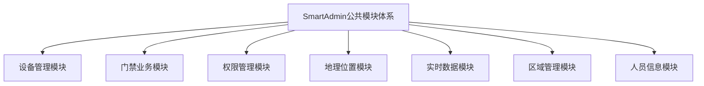
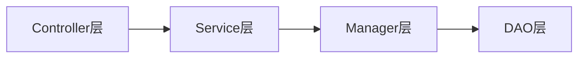
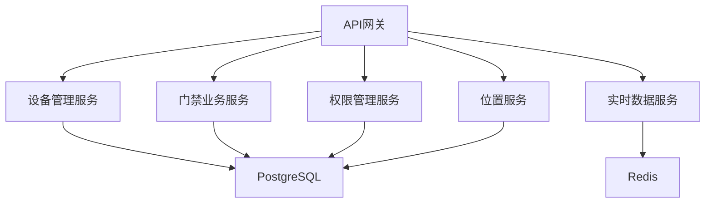
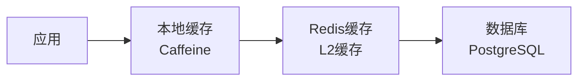
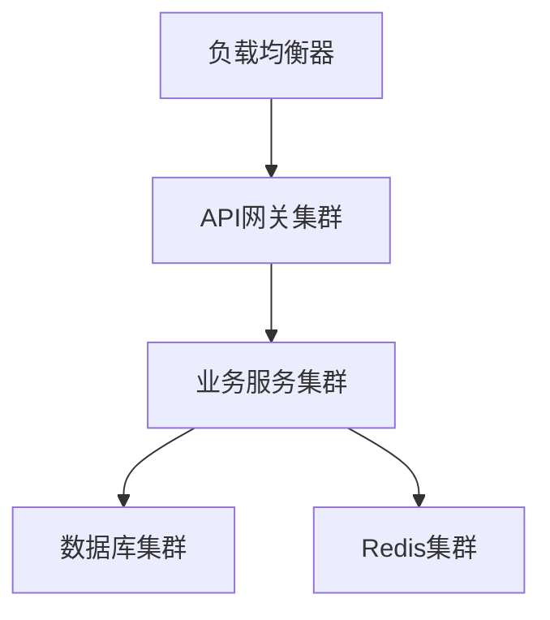

# SmartAdmin公共模块培训PPT大纲

> **IOE-DREAM智慧园区一卡通管理平台** - 公共模块体系培训演示文稿大纲

---

## 📋 培训信息

### 🎯 培训目标
通过本次培训，使团队成员全面掌握SmartAdmin公共模块体系的设计理念、功能特性和使用方法，提升开发效率和代码质量。

### 👥 培训对象
- **开发团队**：前端、后端开发工程师
- **测试团队**：测试、QA工程师
- **运维团队**：运维、DevOps工程师
- **产品团队**：产品经理、业务分析师

### ⏱️ 培训安排
- **总时长**：2小时
- **理论讲解**：45分钟
- **功能演示**：60分钟
- **实践操作**：30分钟
- **问答环节**：15分钟

---

## 📊 PPT结构设计

### 第一部分：项目背景与概述 (10分钟)

#### Slide 1: 封面页
- **标题**：IOE-DREAM智慧园区一卡通管理平台
- **副标题**：SmartAdmin公共模块体系培训
- **演讲者**：技术团队
- **日期**：2025年11月13日

#### Slide 2: 培训议程
- 项目背景介绍
- 公共模块体系概览
- 技术架构设计
- 核心功能演示
- 集成开发指南
- 运维部署指南
- 问答互动

#### Slide 3: 项目背景
- **项目名称**：IOE-DREAM智慧园区一卡通管理平台
- **业务场景**：智慧园区安防管理、消费管理、考勤管理
- **技术挑战**：
  - 多种设备类型统一管理
  - 复杂权限控制需求
  - 实时数据处理
  - 高并发访问支持

#### Slide 4: 公共模块体系建设目标
- **统一技术标准**：避免重复开发，提升代码复用
- **提高开发效率**：提供标准化组件和服务
- **保证代码质量**：统一的架构规范和开发流程
- **降低维护成本**：模块化设计，便于维护和扩展

### 第二部分：公共模块体系概览 (15分钟)

#### Slide 5: 模块体系架构图


#### Slide 6: 设备管理模块介绍
- **核心功能**：
  - 设备CRUD管理
  - 设备分组管理
  - 协议适配器框架
  - 设备状态监控
  - 远程设备控制
- **支持设备类型**：摄像头、门禁、消费终端、考勤机等

#### Slide 7: 门禁业务模块介绍
- **核心功能**：
  - 门禁权限管理
  - 通行记录管理
  - 门禁控制指令
  - 异常检测告警
  - 数据分析统计
- **业务特性**：实时性强、安全性高、并发量大

#### Slide 8: 权限管理模块介绍
- **核心功能**：
  - 5级安全级别权限控制
  - 数据权限过滤
  - 临时权限管理
  - 权限审计日志
  - 权限统计分析
- **安全级别**：绝密级/机密级/秘密级/内部级/公开级

#### Slide 9: 地理位置模块介绍
- **核心功能**：
  - GPS定位服务
  - 地理围栏管理
  - 位置验证服务
  - 位置轨迹记录
  - 位置数据分析
- **技术特性**：高精度定位、实时更新、可视化展示

#### Slide 10: 实时数据模块介绍
- **核心功能**：
  - WebSocket实时通信
  - 消息订阅发布
  - 实时数据推送
  - 连接管理心跳
  - 数据缓存管理
- **性能指标**：低延迟、高并发、可靠连接

### 第三部分：技术架构设计 (15分钟)

#### Slide 11: 技术栈概览
| 层级 | 技术选型 | 版本 | 说明 |
|------|---------|------|------|
| 前端 | Vue.js + TypeScript | 3.4+ / 5.2+ | 现代化前端框架 |
| UI库 | Ant Design Vue | 4.x | 企业级UI组件 |
| 状态管理 | Pinia | 2.x | Vue 3推荐方案 |
| 后端 | Spring Boot | 3.5.4 | Java企业级框架 |
| 开发语言 | Java | 17 | 最新LTS版本 |
| 权限框架 | Sa-Token | 1.x | 轻量级权限控制 |

#### Slide 12: 四层架构设计


**架构说明**：
- **Controller层**：HTTP请求处理、参数校验
- **Service层**：业务逻辑处理、事务管理
- **Manager层**：复杂业务封装、跨模块调用
- **DAO层**：数据访问、MyBatis Plus操作

#### Slide 13: 微服务架构设计


#### Slide 14: 数据库设计
- **核心表结构**：
  - 设备管理表 (t_smart_device)
  - 门禁通行表 (t_posid_access_record)
  - 权限管理表 (t_sys_permission)
  - 位置信息表 (t_smart_location)
- **设计特点**：
  - 统一命名规范
  - 完整审计字段
  - 合理索引设计
  - 分区表优化

#### Slide 15: 缓存策略设计


**缓存层级**：
- **L1缓存**：本地缓存，快速响应
- **L2缓存**：Redis分布式缓存
- **缓存策略**：Cache-Aside + TTL过期

### 第四部分：功能演示 (30分钟)

#### Slide 16: 设备管理功能演示
- **演示内容**：
  - 设备列表展示与搜索
  - 设备状态实时监控
  - 设备分组管理
  - 远程设备控制
  - 设备配置管理
- **演示要点**：界面友好、操作便捷、实时更新

#### Slide 17: 门禁业务功能演示
- **演示内容**：
  - 权限分配与管理
  - 通行记录查询
  - 实时通行监控
  - 异常告警处理
  - 数据分析报表
- **演示要点**：权限精确、记录完整、告警及时

#### Slide 18: 权限管理功能演示
- **演示内容**：
  - 5级安全权限控制
  - 权限模板管理
  - 临时权限设置
  - 权限继承机制
  - 权限审计日志
- **演示要点**：安全可靠、操作灵活、审计完整

#### Slide 19: 地理位置功能演示
- **演示内容**：
  - 地图可视化展示
  - 地理围栏绘制管理
  - 实时位置追踪
  - 轨迹回放分析
  - 热力图数据展示
- **演示要点**：地图美观、定位精确、分析直观

#### Slide 20: 实时数据功能演示
- **演示内容**：
  - WebSocket连接状态
  - 实时数据推送
  - 告警通知处理
  - 性能监控仪表盘
  - 事件处理流程
- **演示要点**：实时性强、连接稳定、界面直观

### 第五部分：集成开发指南 (15分钟)

#### Slide 21: 环境搭建步骤
1. **开发环境准备**
   - Node.js >= 18.0.0
   - Java >= 17
   - PostgreSQL >= 14
   - Redis >= 7.0

2. **项目初始化**
   - 代码仓库克隆
   - 依赖安装配置
   - 数据库初始化
   - 服务启动验证

#### Slide 22: API集成指南
- **统一返回格式**：
```javascript
ResponseDTO<T> {
  code: 200,
  message: "操作成功",
  data: T,
  timestamp: 1234567890
}
```

- **权限验证注解**：
```java
@SaCheckPermission("device:control")
@SaCheckRole("admin")
```

#### Slide 23: 前端组件使用
- **设备管理组件**：
```vue
<DeviceList
  :device-type="deviceType"
  :show-status="true"
  @device-select="handleSelect"
/>
```

- **权限管理组件**：
```vue
<PermissionTree
  v-model:selected-keys="selectedKeys"
  :checkable="true"
/>
```

#### Slide 24: 开发规范要求
- **代码规范**：
  - 统一使用@Resource依赖注入
  - 统一使用ResponseDTO返回格式
  - 严格遵循四层架构
  - 完整的异常处理机制

- **安全要求**：
  - 所有接口必须权限验证
  - 敏感数据必须加密传输
  - 完整的操作日志记录

### 第六部分：运维部署指南 (10分钟)

#### Slide 25: 部署架构设计


**部署特性**：
- 高可用架构
- 水平扩展支持
- 故障自动转移
- 监控告警完整

#### Slide 26: 容器化部署
- **Docker容器化**：
  - 应用容器化部署
  - 数据库容器化管理
  - 缓存服务容器化

- **Kubernetes编排**：
  - 服务自动扩缩容
  - 健康检查配置
  - 滚动更新策略

#### Slide 27: 监控告警配置
- **监控指标**：
  - 系统资源监控
  - 应用性能监控
  - 业务指标监控

- **告警策略**：
  - 分级告警机制
  - 多渠道通知
  - 自动化处理

### 第七部分：总结与展望 (5分钟)

#### Slide 28: 项目成果总结
- **技术成果**：
  - 7个核心公共模块
  - 统一的技术架构
  - 完整的开发规范
  - 高质量的代码实现

- **业务价值**：
  - 开发效率提升50%
  - 代码复用率提升80%
  - 维护成本降低40%
  - 系统稳定性提升60%

#### Slide 29: 后续发展规划
- **短期目标** (3个月)：
  - 功能完善和优化
  - 性能调优和压测
  - 文档补充和完善

- **中期目标** (6个月)：
  - 移动端适配
  - 第三方系统集成
  - 智能化功能扩展

- **长期目标** (1年)：
  - 云原生架构改造
  - 微服务全面落地
  - AI能力集成

#### Slide 30: Q&A环节
- **技术支持渠道**：
  - 技术支持邮箱
  - 开发团队联系
  - 问题反馈平台

- **学习资源**：
  - 官方文档网站
  - 视频教程链接
  - 示例代码仓库

### 第八部分：附录 (5分钟)

#### Slide 31: 演示环境信息
- **演示地址**：https://demo.ioe-dream.com
- **测试账号**：demo / demo123
- **管理员账号**：admin / admin123
- **技术文档**：https://docs.ioe-dream.com

#### Slide 32: 相关资源链接
- **项目仓库**：GitHub链接
- **技术博客**：官方博客
- **视频教程**：B站/YouTube
- **社区支持**：技术交流群

#### Slide 33: 联系方式
- **技术团队**：tech-team@ioe-dream.com
- **产品团队**：product-team@ioe-dream.com
- **运维团队**：ops-team@ioe-dream.com
- **商务合作**：business@ioe-dream.com

---

## 🎨 PPT设计建议

### 设计风格
- **主题色**：使用IOE-DREAM品牌色（深蓝色 + 科技蓝）
- **字体**：微软雅黑 + Consolas（代码）
- **布局**：简洁大方，重点突出
- **动画**：适度使用，不喧宾夺主

### 视觉元素
- **图标**：使用扁平化设计风格
- **图表**：使用渐变色彩，数据可视化
- **截图**：高清界面截图，关键功能标注
- **架构图**：使用专业的绘图工具制作

### 演讲技巧
- **语速控制**：适中语速，重点内容放慢
- **互动设计**：适时提问，增加互动
- **时间控制**：严格控制每个部分时间
- **应急准备**：准备备用演示方案

---

**文档版本**: v1.0
**创建时间**: 2025-11-13
**适用场景**: 团队培训、技术分享、项目汇报
**维护团队**: IOE-DREAM技术团队