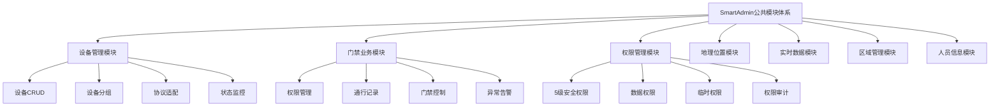
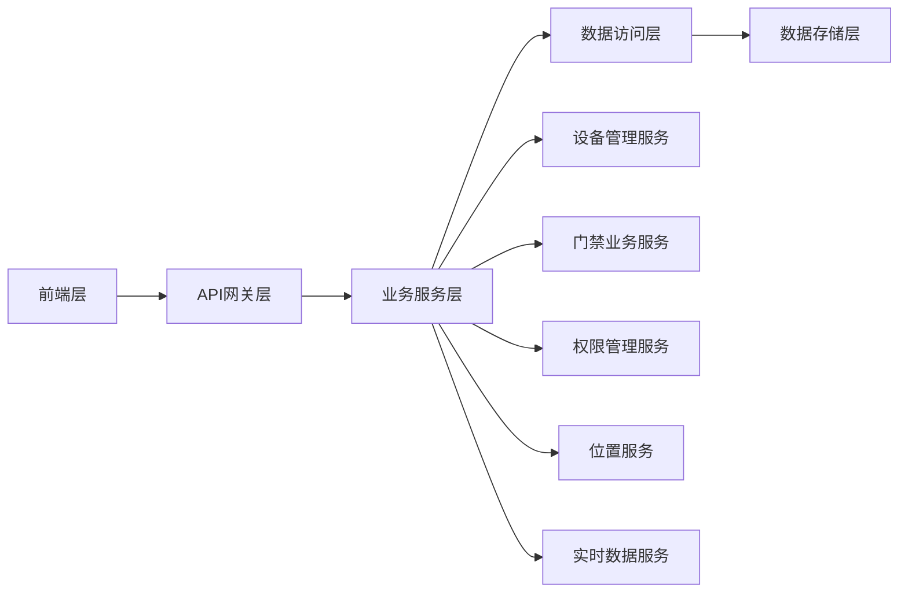
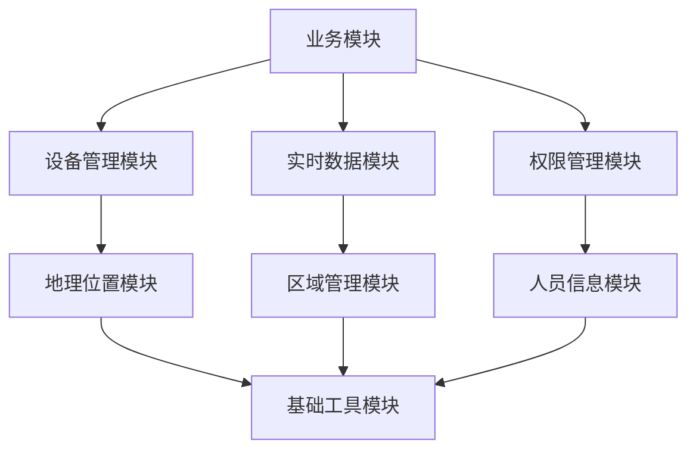
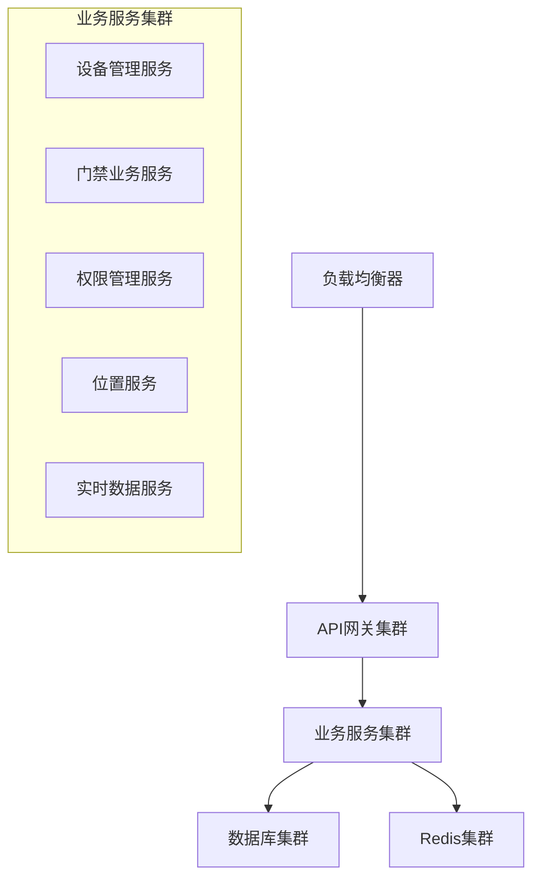

# SmartAdmin公共模块演示材料

> **IOE-DREAM智慧园区一卡通管理平台** - 公共模块体系演示与培训材料

---

## 📋 演示概述

### 🎯 演示目标
通过本次演示，向团队成员展示SmartAdmin公共模块体系的完整功能和使用方法，确保团队成员能够快速上手并有效使用这些公共模块。

### 👥 目标受众
- **开发团队**：前端开发工程师、后端开发工程师
- **测试团队**：测试工程师、QA工程师
- **运维团队**：运维工程师、DevOps工程师
- **产品团队**：产品经理、业务分析师

### ⏱️ 演示时长
- **总时长**：120分钟
- **理论讲解**：40分钟
- **功能演示**：60分钟
- **问答互动**：20分钟

---

## 🗂️ 演示目录

### 第一部分：系统架构介绍 (20分钟)
1.1 公共模块体系概览
1.2 技术架构设计
1.3 四层架构规范
1.4 模块间依赖关系

### 第二部分：核心模块功能演示 (60分钟)
2.1 设备管理模块演示 (15分钟)
2.2 门禁业务模块演示 (15分钟)
2.3 权限管理模块演示 (15分钟)
2.4 地理位置模块演示 (10分钟)
2.5 实时数据模块演示 (5分钟)

### 第三部分：集成开发指南 (20分钟)
3.1 环境搭建
3.2 API集成
3.3 前端组件使用
3.4 开发规范

### 第四部分：运维部署 (15分钟)
4.1 部署架构
4.2 监控告警
4.3 故障排查
4.4 性能优化

---

## 📊 第一部分：系统架构介绍

### 1.1 公共模块体系概览

#### 模块架构图


#### 核心特性
- ✅ **模块化设计**：单一职责原则，高内聚低耦合
- ✅ **统一接口**：标准化的API接口和数据格式
- ✅ **高性能**：多级缓存，异步处理，连接池优化
- ✅ **高可用**：故障转移，健康检查，自动恢复
- ✅ **易扩展**：插件化架构，配置化扩展

### 1.2 技术架构设计

#### 技术栈
| 层级 | 技术选型 | 版本 | 说明 |
|------|---------|------|------|
| 前端框架 | Vue.js | 3.4+ | 渐进式JavaScript框架 |
| 开发语言 | TypeScript | 5.2+ | JavaScript的超集 |
| UI组件库 | Ant Design Vue | 4.x | 企业级UI组件库 |
| 状态管理 | Pinia | 2.x | Vue 3推荐状态管理 |
| 后端框架 | Spring Boot | 3.5.4 | Java企业级应用框架 |
| 开发语言 | Java | 17 | 最新LTS版本 |
| 权限框架 | Sa-Token | 1.x | 轻量级权限框架 |
| 数据库 | PostgreSQL | 14+ | 开源关系型数据库 |
| 缓存 | Redis | 7.0+ | 内存数据库 |

#### 架构分层


### 1.3 四层架构规范

#### 标准四层架构
```
Controller (控制器层)
    ↓
Service (业务逻辑层)
    ↓
Manager (业务管理层)
    ↓
DAO (数据访问层)
```

#### 架构规范
1. **Controller层**：负责HTTP请求处理、参数校验、调用Service层
2. **Service层**：负责业务逻辑处理、事务管理
3. **Manager层**：负责复杂业务逻辑封装、跨模块调用
4. **DAO层**：负责数据访问、使用MyBatis Plus

### 1.4 模块间依赖关系

#### 依赖关系图


---

## 🖥️ 第二部分：核心模块功能演示

### 2.1 设备管理模块演示

#### 演示脚本
```bash
# 演示步骤
1. 设备列表展示
2. 设备状态监控
3. 设备分组管理
4. 设备控制操作
5. 设备配置管理
```

#### 关键功能点

##### 🔹 设备列表展示
- **功能**：展示所有接入设备的详细信息
- **特性**：
  - 支持多维度筛选（类型、状态、区域）
  - 实时状态更新
  - 批量操作支持
- **演示要点**：
  - 展示设备在线/离线状态
  - 演示设备搜索和过滤
  - 展示设备详细信息

##### 🔹 设备状态监控
- **功能**：实时监控设备运行状态
- **特性**：
  - 心跳检测
  - 性能指标监控
  - 异常告警
- **演示要点**：
  - 展示设备在线状态
  - 演示性能指标图表
  - 模拟设备离线告警

##### 🔹 设备控制操作
- **功能**：远程控制设备操作
- **特性**：
  - 门禁开关控制
  - 设备重启
  - 配置下发
- **演示要点**：
  - 演示门禁开关操作
  - 展示操作日志
  - 验证操作结果

### 2.2 门禁业务模块演示

#### 演示脚本
```bash
# 演示步骤
1. 权限管理演示
2. 通行记录查看
3. 实时监控
4. 异常处理
5. 数据分析
```

#### 关键功能点

##### 🔹 权限管理
- **功能**：管理人员和设备的门禁权限
- **特性**：
  - 5级安全级别权限控制
  - 权限模板管理
  - 权限继承机制
- **演示要点**：
  - 演示权限分配流程
  - 展示权限树结构
  - 演示批量权限操作

##### 🔹 通行记录
- **功能**：查看和管理门禁通行记录
- **特性**：
  - 实时记录更新
  - 多条件查询
  - 异常记录标记
- **演示要点**：
  - 展示实时通行记录
  - 演示记录查询过滤
  - 展示异常通行告警

##### 🔹 实时监控
- **功能**：实时监控门禁状态和通行情况
- **特性**：
  - WebSocket实时推送
  - 地图可视化
  - 告警通知
- **演示要点**：
  - 展示实时通行情况
  - 演示地图位置标记
  - 模拟异常告警

### 2.3 权限管理模块演示

#### 演示脚本
```bash
# 演示步骤
1. 权限分配演示
2. 权限模板管理
3. 临时权限设置
4. 权限审计
5. 权限统计
```

#### 关键功能点

##### 🔹 5级安全权限
- **功能**：实现5级安全级别的权限控制
- **安全级别**：
  - 绝密级 (TOP_SECRET)
  - 机密级 (SECRET)
  - 秘密级 (CONFIDENTIAL)
  - 内部级 (INTERNAL)
  - 公开级 (PUBLIC)
- **演示要点**：
  - 展示不同安全级别的UI表现
  - 演示权限级别过滤
  - 展示权限验证流程

##### 🔹 权限模板
- **功能**：创建和管理权限模板
- **特性**：
  - 模板复制和继承
  - 批量应用
  - 版本管理
- **演示要点**：
  - 演示权限模板创建
  - 展示模板应用流程
  - 演示模板版本管理

### 2.4 地理位置模块演示

#### 演示脚本
```bash
# 演示步骤
1. 地图展示
2. 位置标记
3. 地理围栏
4. 轨迹回放
5. 热力图分析
```

#### 关键功能点

##### 🔹 地图可视化
- **功能**：在地图上展示位置相关信息
- **特性**：
  - 多种地图图层
  - 实时位置更新
  - 交互式操作
- **演示要点**：
  - 展示不同地图类型
  - 演示实时位置更新
  - 展示地图交互功能

##### 🔹 地理围栏
- **功能**：创建和管理地理围栏
- **特性**：
  - 多种围栏形状
  - 进入/离开事件
  - 告警配置
- **演示要点**：
  - 演示围栏绘制
  - 展示围栏触发事件
  - 演示围栏告警

### 2.5 实时数据模块演示

#### 演示脚本
```bash
# 演示步骤
1. WebSocket连接
2. 实时数据推送
3. 告警通知
4. 性能监控
5. 事件处理
```

#### 关键功能点

##### 🔹 实时数据推送
- **功能**：实时推送系统数据更新
- **特性**：
  - WebSocket长连接
  - 自动重连机制
  - 消息队列
- **演示要点**：
  - 展示连接状态
  - 演示实时数据更新
  - 模拟断线重连

##### 🔹 告警通知
- **功能**：实时推送系统告警信息
- **特性**：
  - 多级告警
  - 通知渠道
  - 告警确认
- **演示要点**：
  - 展示告警推送
  - 演示告警处理流程
  - 展示告警统计

---

## 💻 第三部分：集成开发指南

### 3.1 环境搭建

#### 开发环境要求
```bash
# 基础环境
Node.js >= 18.0.0
Java >= 17
PostgreSQL >= 14
Redis >= 7.0

# 开发工具
IntelliJ IDEA 2023.3+
VS Code 1.84+
Git 2.40+
```

#### 项目搭建步骤
```bash
# 1. 克隆项目
git clone https://github.com/your-org/ioe-dream.git
cd ioe-dream

# 2. 后端环境搭建
cd smart-admin-api-java17-springboot3
mvn clean install -DskipTests

# 3. 前端环境搭建
cd ../smart-admin-web-javascript
npm install
npm run localhost

# 4. 数据库初始化
# 执行数据库SQL脚本
mysql -u root -p < database/smart_admin_v3.sql

# 5. 启动Redis服务
redis-server --port 6389

# 6. 启动后端服务
cd sa-admin
mvn spring-boot:run
```

### 3.2 API集成

#### API调用示例
```javascript
// 设备管理API示例
import { deviceApi } from '@/api/common/device';

// 获取设备列表
const deviceList = await deviceApi.getDeviceList({
  pageNum: 1,
  pageSize: 20,
  deviceType: 'CAMERA',
  status: 'ONLINE'
});

// 控制设备
await deviceApi.controlDevice({
  deviceId: 'device_001',
  action: 'OPEN',
  params: { duration: 5000 }
});
```

#### 权限验证示例
```javascript
// 前端权限验证
import { usePermissionStore } from '@/store/modules/permission';

const permissionStore = usePermissionStore();

// 检查权限
if (permissionStore.hasPermission('device:control')) {
  // 执行设备控制操作
  await deviceApi.controlDevice(deviceData);
} else {
  message.error('无设备控制权限');
}
```

### 3.3 前端组件使用

#### 设备管理组件使用
```vue
<template>
  <div>
    <!-- 设备列表组件 -->
    <DeviceList
      :device-type="deviceType"
      :show-status="true"
      @device-select="handleDeviceSelect"
      @device-control="handleDeviceControl"
    />

    <!-- 设备详情弹窗 -->
    <DeviceDetailModal
      v-model:visible="detailVisible"
      :device-id="selectedDeviceId"
    />
  </div>
</template>

<script setup>
import { ref } from 'vue';
import { DeviceList, DeviceDetailModal } from '@/components/common/device';

const deviceType = ref('CAMERA');
const detailVisible = ref(false);
const selectedDeviceId = ref(null);

const handleDeviceSelect = (device) => {
  selectedDeviceId.value = device.deviceId;
  detailVisible.value = true;
};

const handleDeviceControl = async (device, action) => {
  try {
    await deviceApi.controlDevice({
      deviceId: device.deviceId,
      action: action
    });
    message.success('设备控制成功');
  } catch (error) {
    message.error('设备控制失败');
  }
};
</script>
```

#### 权限管理组件使用
```vue
<template>
  <div>
    <!-- 权限树组件 -->
    <PermissionTree
      v-model:selected-keys="selectedPermissions"
      :checkable="true"
      :show-line="true"
      @select="handlePermissionSelect"
    />

    <!-- 安全级别选择器 -->
    <SecurityLevelSelector
      v-model:value="securityLevel"
      :disabled="false"
      @change="handleSecurityLevelChange"
    />
  </div>
</template>

<script setup>
import { ref } from 'vue';
import { PermissionTree, SecurityLevelSelector } from '@/components/system/permission';

const selectedPermissions = ref([]);
const securityLevel = ref('INTERNAL');

const handlePermissionSelect = (selectedKeys, info) => {
  console.log('选中的权限:', selectedKeys);
};

const handleSecurityLevelChange = (value) => {
  console.log('安全级别变更:', value);
};
</script>
```

### 3.4 开发规范

#### 代码规范
```javascript
// ✅ 正确的依赖注入
@Service
@RequiredArgsConstructor
public class DeviceService {
  private final DeviceDao deviceDao;
  private final DeviceManager deviceManager;

  public PageResult<DeviceVO> getDeviceList(DeviceQueryForm form) {
    return deviceDao.selectPage(form);
  }
}

// ❌ 错误的依赖注入
@Service
public class DeviceService {
  @Autowired  // 禁止使用@Autowired
  private DeviceDao deviceDao;
}
```

#### API接口规范
```java
// ✅ 正确的API返回格式
@RestController
@RequestMapping("/api/device")
public class DeviceController {

  @GetMapping("/list")
  @SaCheckPermission("device:list")
  public ResponseDTO<PageResult<DeviceVO>> getDeviceList(@Valid DeviceQueryForm form) {
    PageResult<DeviceVO> result = deviceService.getDeviceList(form);
    return ResponseDTO.ok(result);
  }
}

// ❌ 错误的API返回格式
@GetMapping("/list")
public List<DeviceVO> getDeviceList() {  // 未使用ResponseDTO包装
  return deviceService.getDeviceList();
}
```

---

## 🚀 第四部分：运维部署

### 4.1 部署架构

#### 生产环境架构


#### 容器化部署
```yaml
# docker-compose.yml
version: '3.8'
services:
  # 后端服务
  smart-admin-api:
    image: ioe-dream/smart-admin-api:latest
    ports:
      - "1024:1024"
    environment:
      - SPRING_PROFILES_ACTIVE=prod
      - DB_HOST=mysql
      - REDIS_HOST=redis
    depends_on:
      - mysql
      - redis

  # 数据库
  mysql:
    image: postgres:14
    environment:
      - POSTGRES_DB=smart_admin_v3
      - POSTGRES_USER=root
      - POSTGRES_PASSWORD=password
    volumes:
      - postgres_data:/var/lib/postgresql/data

  # 缓存
  redis:
    image: redis:7-alpine
    ports:
      - "6389:6379"
    command: redis-server --requirepass zkteco3100

  # 前端服务
  smart-admin-web:
    image: ioe-dream/smart-admin-web:latest
    ports:
      - "80:80"
    depends_on:
      - smart-admin-api

volumes:
  postgres_data:
```

### 4.2 监控告警

#### 监控指标
| 指标类型 | 监控项 | 告警阈值 | 说明 |
|---------|-------|---------|------|
| 系统指标 | CPU使用率 | > 80% | 系统负载过高 |
| 系统指标 | 内存使用率 | > 85% | 内存不足告警 |
| 应用指标 | 响应时间 | P95 > 500ms | 接口响应缓慢 |
| 应用指标 | 错误率 | > 5% | 服务异常告警 |
| 业务指标 | 设备离线率 | > 10% | 设备异常告警 |

#### 监控配置
```yaml
# prometheus.yml
global:
  scrape_interval: 15s

scrape_configs:
  - job_name: 'smart-admin'
    static_configs:
      - targets: ['localhost:1024']
    metrics_path: '/actuator/prometheus'
    scrape_interval: 10s

rule_files:
  - "alert_rules.yml"

alerting:
  alertmanagers:
    - static_configs:
        - targets:
          - alertmanager:9093
```

### 4.3 故障排查

#### 常见问题排查

##### 🔹 设备连接失败
```
排查步骤：
1. 检查网络连通性
2. 验证设备认证信息
3. 查看设备状态日志
4. 检查防火墙配置

常用命令：
ping [设备IP]
telnet [设备IP] [端口]
curl -X GET http://[设备IP]/status
```

##### 🔹 权限验证失败
```
排查步骤：
1. 检查用户权限配置
2. 验证权限缓存状态
3. 查看权限审计日志
4. 确认安全级别设置

调试方法：
1. 开启DEBUG日志
2. 查看权限验证流程
3. 检查权限数据一致性
```

##### 🔹 实时数据断线
```
排查步骤：
1. 检查WebSocket连接状态
2. 验证网络稳定性
3. 查看服务端日志
4. 检查客户端重连机制

优化方案：
1. 增加重连间隔
2. 优化心跳检测
3. 增加连接超时配置
```

### 4.4 性能优化

#### 数据库优化
```sql
-- 添加索引
CREATE INDEX idx_device_type_status ON t_smart_device(device_type, status);
CREATE INDEX idx_access_record_time ON t_posid_access_record(access_time);

-- 分区表优化
ALTER TABLE t_posid_access_record
PARTITION BY RANGE (TO_DAYS(access_time)) (
    PARTITION p202501 VALUES LESS THAN (TO_DAYS('2025-02-01')),
    PARTITION p202502 VALUES LESS THAN (TO_DAYS('2025-03-01'))
);

-- 查询优化
EXPLAIN SELECT * FROM t_smart_device
WHERE device_type = 'CAMERA' AND status = 'ONLINE';
```

#### 缓存优化
```yaml
# Redis缓存配置
spring:
  redis:
    lettuce:
      pool:
        max-active: 20
        max-idle: 10
        min-idle: 5
      shutdown-timeout: 100ms
    timeout: 2000ms

# 缓存策略配置
cache:
  device:
    ttl: 300s  # 设备信息缓存5分钟
  permission:
    ttl: 600s  # 权限信息缓存10分钟
  location:
    ttl: 60s   # 位置信息缓存1分钟
```

---

## ❓ 问答互动环节

### 常见问题

#### Q1: 如何新增设备类型？
**A**: 在设备管理模块中，通过设备类型管理功能添加新的设备类型，并配置对应的协议适配器。

#### Q2: 权限变更后多久生效？
**A**: 权限变更后会立即清除相关缓存，变更实时生效。如遇延迟，可手动清除权限缓存。

#### Q3: 如何处理高并发场景下的设备控制？
**A**: 系统采用分布式锁和消息队列处理高并发设备控制，确保操作的原子性和一致性。

#### Q4: 地理围栏支持哪些形状？
**A**: 目前支持圆形、矩形、多边形三种地理围栏，可以根据实际需求选择合适的围栏类型。

#### Q5: 实时数据推送的最大延迟是多少？
**A**: 在正常网络环境下，实时数据推送延迟控制在100ms以内，确保数据的实时性。

### 技术支持

#### 联系方式
- **技术支持邮箱**：tech-support@ioe-dream.com
- **开发团队**：dev-team@ioe-dream.com
- **运维团队**：ops-team@ioe-dream.com

#### 文档资源
- **API文档**：https://docs.ioe-dream.com/api
- **开发指南**：https://docs.ioe-dream.com/dev-guide
- **运维手册**：https://docs.ioe-dream.com/ops-guide

---

## 📚 附录

### A. 演示环境信息
- **演示地址**：https://demo.ioe-dream.com
- **测试账号**：demo / demo123
- **管理员账号**：admin / admin123

### B. 相关资源链接
- **项目仓库**：https://github.com/ioe-dream/smart-admin
- **技术博客**：https://blog.ioe-dream.com
- **视频教程**：https://video.ioe-dream.com

### C. 版本更新日志
- **v3.0.0** (2025-11-13) - 公共模块体系正式发布
- **v3.1.0** (计划中) - 性能优化和功能增强
- **v3.2.0** (计划中) - 移动端支持

---

**文档版本**: v1.0
**创建时间**: 2025-11-13
**更新时间**: 2025-11-13
**适用版本**: IOE-DREAM v3.0+
**维护团队**: IOE-DREAM技术团队