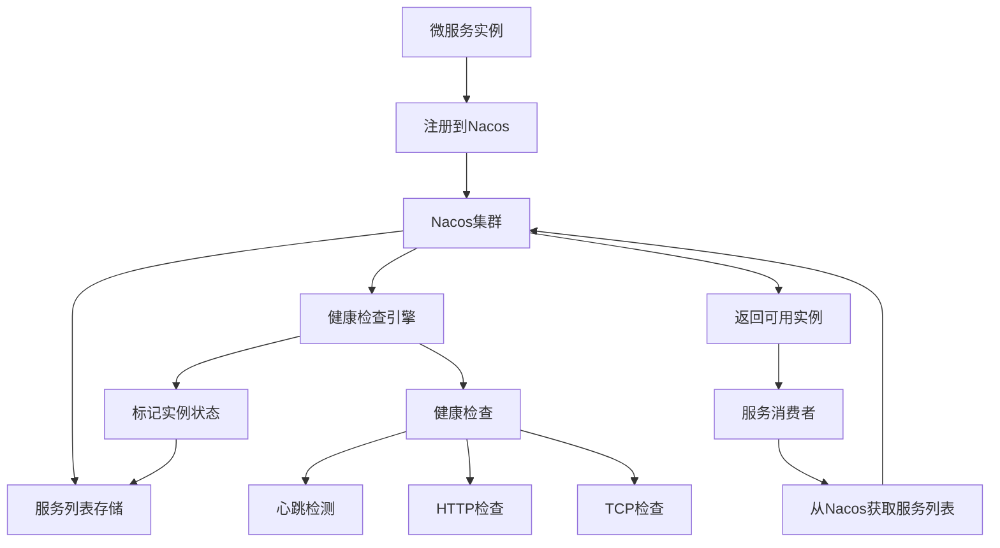

# Nacos高级特性与服务治理培训
## Day 5: 服务发现与配置管理深度实践

### 📚 培训目标

- 掌握Nacos的高级特性和最佳实践
- 实现服务健康检查和故障转移
- 配置动态更新和版本管理
- 服务权重和路由策略
- 多环境配置管理
- 服务治理监控和运维

---

## 🎯 学习目标

1. **Nacos深度理解**
   - 服务发现机制深入解析
   - 配置管理高级特性
   - 命名空间和环境隔离
   - 服务元数据管理

2. **高级服务治理**
   - 服务健康检查策略
   - 服务权重和负载均衡
   - 服务路由和流量调度
   - 故障转移和容灾机制

3. **生产环境最佳实践**
   - Nacos集群部署优化
   - 配置管理和版本控制
   - 监控告警和运维体系
   - 安全和权限管理

### 📖 Nacos高级概念

#### 1. 服务发现深度解析

**服务发现架构**


**服务生命周期管理**
```java
/**
 * Nacos服务生命周期管理演示
 */
@Component
@Slf4j
public class ServiceLifecycleManager {

    /**
     * 服务注册生命周期
     */
    public void demonstrateServiceLifecycle() {
        /*
         * 1. 服务注册 - 服务启动时向Nacos注册
         * 2. 健康检查 - Nacos定期检查服务健康状态
         * 3. 服务发现 - 消费者获取服务列表
         * 4. 负载均衡 - 选择合适的实例进行调用
         * 5. 故障转移 - 检测到故障时切换实例
         * 6. 服务下线 - 服务关闭时从Nacos注销
         */
    }

    /**
     * 实例状态变化监听
     */
    @EventListener
    public void handleInstanceStatusChange(InstanceStatusChangeEvent event) {
        log.info("实例状态变化: 服务={}, 实例={}, 状态={}",
            event.getServiceName(),
            event.getInstanceId(),
            event.getNewStatus());
    }
}
```

#### 2. 配置管理高级特性

**配置版本管理**
```java
/**
 * Nacos配置版本管理
 */
@Service
@Slf4j
public class ConfigurationManager {

    @Value("${spring.cloud.nacos.config.server-addr}")
    private String serverAddr;

    @Value("${spring.cloud.nacos.config.namespace}")
    private String namespace;

    @Value("${spring.application.name}")
    private String appName;

    /**
     * 配置版本管理
     */
    public ConfigResponse getConfigWithVersion(String dataId, String group) {
        try {
            ConfigService configService = NacosFactory.createConfigService(
                buildConfigProperties());

            // 获取配置内容
            String content = configService.getConfig(dataId, group, 5000);

            // 获取配置版本信息
            String version = configService.getConfig(dataId + ".version", group, 5000);

            return ConfigResponse.builder()
                .dataId(dataId)
                .group(group)
                .content(content)
                .version(version)
                .timestamp(System.currentTimeMillis())
                .build();

        } catch (NacosException e) {
            log.error("获取配置失败: dataId={}, group={}", dataId, group, e);
            throw new RuntimeException("获取配置失败", e);
        }
    }

    /**
     * 配置变更监听
     */
    public void addConfigListener(String dataId, String group, ConfigChangeListener listener) {
        try {
            ConfigService configService = NacosFactory.createConfigService(
                buildConfigProperties());

            configService.addListener(dataId, group, listener);
            log.info("配置监听器添加成功: dataId={}, group={}", dataId, group);

        } catch (NacosException e) {
            log.error("添加配置监听器失败", e);
            throw new RuntimeException("添加配置监听器失败", e);
        }
    }

    /**
     * 构建配置属性
     */
    private Properties buildConfigProperties() {
        Properties properties = new Properties();
        properties.setProperty("serverAddr", serverAddr);
        properties.setProperty("namespace", namespace);
        return properties;
    }
}
```

### 🛠️ 实战环境搭建

#### 1. Nacos集群部署配置

**cluster.conf**
```properties
# Nacos集群节点配置
192.168.1.10:8848
192.168.1.11:8848
192.168.1.12:8848
```

**application.properties**
```properties
# 集群配置
nacos.core.auth.enabled=true
nacos.core.auth.default.token.secret.key=SecretKey012345678901234567890123456789012345678901234567890123456789
nacos.core.auth.plugin.nacos.token.secret.key=SecretKey012345678901234567890123456789012345678901234567890123456789

# 数据库配置
spring.datasource.platform=mysql
db.num=1
db.url.0=jdbc:mysql://mysql:3306/nacos_config?characterEncoding=utf8&connectTimeout=1000&socketTimeout=3000&autoReconnect=true&useUnicode=true&useSSL=false&serverTimezone=UTC
db.user.0=nacos
db.password.0=nacos123
db.pool.config.connectionTimeout=30000
db.pool.config.maximumPoolSize=20
db.pool.config.minimumIdle=5

# 集群配置
nacos.standalone=false
nacos.cluster.enabled=true
cml.apply.nacos.server-port=8848
cml.apply.nacos.access-key=
cml.apply.nacos.secret-key=

# 日志配置
server.tomcat.accesslog.enabled=true
server.tomcat.accesslog.pattern=%h %l %u %t "%r" %s %b %D "%{Referer}i" "%{User-Agent}i" %{X-Real-IP}i
server.tomcat.basedir=

# 监控配置
management.endpoints.web.exposure.include=*
management.metrics.export.elastic.enabled=true
management.metrics.export.influx.enabled=true

# 性能优化
nacos.config.push.content.retryTime=3000
nacos.naming.distro.taskDispatchThreadCount=1
nacos.naming.distro.taskDispatchPeriod=200
nacos.naming.distro.batchSyncKeyCount=1000
nacos.naming.distro.initDataRatio=0.9
nacos.naming.distro.syncRetryDelay=5000
nacos.naming.data.warmup=true
```

**Docker Compose集群部署**
```yaml
version: '3.8'

services:
  nacos1:
    image: nacos/nacos-server:v2.2.3
    container_name: nacos1
    ports:
      - "8848:8848"
      - "9848:9848"
    environment:
      - MODE=cluster
      - NACOS_SERVERS=nacos2:8848,nacos3:8848
      - NACOS_SERVER_PORT=8848
      - PREFER_HOST_MODE=hostname
      - SPRING_DATASOURCE_PLATFORM=mysql
      - MYSQL_SERVICE_HOST=mysql
      - MYSQL_SERVICE_DB_NAME=nacos_config
      - MYSQL_SERVICE_PORT=3306
      - MYSQL_SERVICE_USER=nacos
      - MYSQL_SERVICE_PASSWORD=nacos123
      - NACOS_AUTH_ENABLE=true
      - NACOS_AUTH_TOKEN=SecretKey012345678901234567890123456789012345678901234567890123456789
      - JVM_XMS=512m
      - JVM_XMX=512m
    volumes:
      - ./nacos1/logs:/home/nacos/logs
      - ./cluster.conf:/home/nacos/conf/cluster.conf
    depends_on:
      - mysql
    networks:
      - nacos-network

  nacos2:
    image: nacos/nacos-server:v2.2.3
    container_name: nacos2
    ports:
      - "8849:8848"
      - "9849:9848"
    environment:
      - MODE=cluster
      - NACOS_SERVERS=nacos1:8848,nacos3:8848
      - NACOS_SERVER_PORT=8848
      - PREFER_HOST_MODE=hostname
      - SPRING_DATASOURCE_PLATFORM=mysql
      - MYSQL_SERVICE_HOST=mysql
      - MYSQL_SERVICE_DB_NAME=nacos_config
      - MYSQL_SERVICE_PORT=3306
      - MYSQL_SERVICE_USER=nacos
      - MYSQL_SERVICE_PASSWORD=nacos123
      - NACOS_AUTH_ENABLE=true
      - NACOS_AUTH_TOKEN=SecretKey012345678901234567890123456789012345678901234567890123456789
      - JVM_XMS=512m
      - JVM_XMX=512m
    volumes:
      - ./nacos2/logs:/home/nacos/logs
      - ./cluster.conf:/home/nacos/conf/cluster.conf
    depends_on:
      - mysql
    networks:
      - nacos-network

  nacos3:
    image: nacos/nacos-server:v2.2.3
    container_name: nacos3
    ports:
      - "8850:8848"
      - "9850:9848"
    environment:
      - MODE=cluster
      - NACOS_SERVERS=nacos1:8848,nacos2:8848
      - NACOS_SERVER_PORT=8848
      - PREFER_HOST_MODE=hostname
      - SPRING_DATASOURCE_PLATFORM=mysql
      - MYSQL_SERVICE_HOST=mysql
      - MYSQL_SERVICE_DB_NAME=nacos_config
      - MYSQL_SERVICE_PORT=3306
      - MYSQL_SERVICE_USER=nacos
      - MYSQL_SERVICE_PASSWORD=nacos123
      - NACOS_AUTH_ENABLE=true
      - NACOS_AUTH_TOKEN=SecretKey012345678901234567890123456789012345678901234567890123456789
      - JVM_XMS=512m
      - JVM_XMX=512m
    volumes:
      - ./nacos3/logs:/home/nacos/logs
      - ./cluster.conf:/home/nacos/conf/cluster.conf
    depends_on:
      - mysql
    networks:
      - nacos-network

  mysql:
    image: mysql:8.0
    container_name: nacos-mysql
    ports:
      - "3306:3306"
    environment:
      - MYSQL_ROOT_PASSWORD=root1234
      - MYSQL_DATABASE=nacos_config
      - MYSQL_USER=nacos
      - MYSQL_PASSWORD=nacos123
    volumes:
      - mysql-data:/var/lib/mysql
      - ./init.sql:/docker-entrypoint-initdb.d/init.sql
    networks:
      - nacos-network

  nginx:
    image: nginx:alpine
    container_name: nacos-nginx
    ports:
      - "80:80"
    volumes:
      - ./nginx.conf:/etc/nginx/nginx.conf
    depends_on:
      - nacos1
      - nacos2
      - nacos3
    networks:
      - nacos-network

volumes:
  mysql-data:

networks:
  nacos-network:
    driver: bridge
```

#### 2. Nginx负载均衡配置

**nginx.conf**
```nginx
upstream nacos_cluster {
    server nacos1:8848 weight=1 max_fails=3 fail_timeout=30s;
    server nacos2:8848 weight=1 max_fails=3 fail_timeout=30s;
    server nacos3:8848 weight=1 max_fails=3 fail_timeout=30s;
}

server {
    listen 80;
    server_name nacos.ioedream.com;

    # 健康检查端点
    location /nacos/v1/ns/operator/health {
        proxy_pass http://nacos_cluster;
        proxy_set_header Host $host;
        proxy_set_header X-Real-IP $remote_addr;
        proxy_set_header X-Forwarded-For $proxy_add_x_forwarded_for;
        proxy_connect_timeout 30s;
        proxy_send_timeout 30s;
        proxy_read_timeout 30s;
    }

    # 服务注册发现
    location /nacos/v1/ns/ {
        proxy_pass http://nacos_cluster;
        proxy_set_header Host $host;
        proxy_set_header X-Real-IP $remote_addr;
        proxy_set_header X-Forwarded-For $proxy_add_x_forwarded_for;
        proxy_connect_timeout 30s;
        proxy_send_timeout 30s;
        proxy_read_timeout 30s;
    }

    # 配置管理
    location /nacos/v1/cs/ {
        proxy_pass http://nacos_cluster;
        proxy_set_header Host $host;
        proxy_set_header X-Real-IP $remote_addr;
        proxy_set_header X-Forwarded-For $proxy_add_x_forwarded_for;
        proxy_connect_timeout 30s;
        proxy_send_timeout 30s;
        proxy_read_timeout 30s;
    }

    # 控制台页面
    location /nacos/ {
        proxy_pass http://nacos_cluster;
        proxy_set_header Host $host;
        proxy_set_header X-Real-IP $remote_addr;
        proxy_set_header X-Forwarded-For $proxy_add_x_forwarded_for;
        proxy_connect_timeout 30s;
        proxy_send_timeout 30s;
        proxy_read_timeout 30s;
    }

    # WebSocket支持
    location /nacos/v1/ws/ {
        proxy_pass http://nacos_cluster;
        proxy_http_version 1.1;
        proxy_set_header Upgrade $http_upgrade;
        proxy_set_header Connection "upgrade";
        proxy_set_header Host $host;
        proxy_set_header X-Real-IP $remote_addr;
        proxy_set_header X-Forwarded-For $proxy_add_x_forwarded_for;
        proxy_connect_timeout 30s;
        proxy_send_timeout 30s;
        proxy_read_timeout 86400s;
    }
}
```

### 🔧 高级服务治理实现

#### 1. 服务健康检查策略

**自定义健康检查配置**
```java
package net.lab1024.nacos.health;

import com.alibaba.cloud.nacos.NacosDiscoveryProperties;
import com.alibaba.nacos.api.naming.NamingService;
import com.alibaba.nacos.api.naming.pojo.Instance;
import lombok.RequiredArgsConstructor;
import lombok.extern.slf4j.Slf4j;
import org.springframework.boot.actuate.health.Health;
import org.springframework.boot.actuate.health.HealthIndicator;
import org.springframework.stereotype.Component;

import javax.annotation.PostConstruct;
import java.util.HashMap;
import java.util.Map;
import java.util.concurrent.Executors;
import java.util.concurrent.ScheduledExecutorService;
import java.util.concurrent.TimeUnit;

/**
 * Nacos服务健康检查管理器
 *
 * @author IOE-DREAM Team
 * @since 2025-11-27
 */
@Slf4j
@Component
@RequiredArgsConstructor
public class NacosHealthCheckManager {

    private final NacosDiscoveryProperties discoveryProperties;
    private final NamingService namingService;
    private final ScheduledExecutorService scheduler = Executors.newScheduledThreadPool(2);

    @PostConstruct
    public void init() {
        // 启动健康检查任务
        startHealthCheckTask();
        // 启动服务状态监控
        startServiceMonitoring();
    }

    /**
     * 启动健康检查任务
     */
    private void startHealthCheckTask() {
        scheduler.scheduleAtFixedRate(() -> {
            try {
                performHealthCheck();
            } catch (Exception e) {
                log.error("健康检查执行失败", e);
            }
        }, 30, 30, TimeUnit.SECONDS);
    }

    /**
     * 启动服务状态监控
     */
    private void startServiceMonitoring() {
        scheduler.scheduleAtFixedRate(() -> {
            try {
                monitorServiceStatus();
            } catch (Exception e) {
                log.error("服务状态监控执行失败", e);
            }
        }, 60, 60, TimeUnit.SECONDS);
    }

    /**
     * 执行健康检查
     */
    private void performHealthCheck() {
        String serviceName = discoveryProperties.getService();
        String groupName = discoveryProperties.getGroup();

        try {
            // 获取当前实例
            String instanceId = getInstanceId();
            Instance currentInstance = namingService.selectOneHealthyInstance(serviceName, groupName);

            if (currentInstance != null && instanceId.equals(currentInstance.getInstanceId())) {
                // 更新实例元数据中的健康检查信息
                updateInstanceMetadata(currentInstance);
                log.debug("健康检查通过: {}", instanceId);
            } else {
                log.warn("健康检查异常: 当前实例未在服务列表中找到");
            }

        } catch (Exception e) {
            log.error("健康检查失败: serviceName={}", serviceName, e);
        }
    }

    /**
     * 监控服务状态
     */
    private void monitorServiceStatus() {
        String serviceName = discoveryProperties.getService();
        String groupName = discoveryProperties.getGroup();

        try {
            // 获取所有实例
            var instances = namingService.selectInstances(serviceName, groupName, true);
            var allInstances = namingService.getAllInstances(serviceName, groupName);

            // 统计健康状态
            int totalCount = allInstances.size();
            int healthyCount = instances.size();
            int unhealthyCount = totalCount - healthyCount;
            double healthRate = totalCount > 0 ? (double) healthyCount / totalCount * 100 : 0;

            // 记录监控指标
            log.info("服务状态监控 - 服务: {}, 总实例: {}, 健康: {}, 不健康: {}, 健康率: {:.2f}%",
                serviceName, totalCount, healthyCount, unhealthyCount, healthRate);

            // 检查告警条件
            checkServiceHealthAlerts(serviceName, healthRate, unhealthyCount);

        } catch (Exception e) {
            log.error("服务状态监控失败: serviceName={}", serviceName, e);
        }
    }

    /**
     * 更新实例元数据
     */
    private void updateInstanceMetadata(Instance instance) {
        try {
            Map<String, String> metadata = instance.getMetadata();
            if (metadata == null) {
                metadata = new HashMap<>();
            }

            // 更新健康检查相关元数据
            metadata.put("health-check-timestamp", String.valueOf(System.currentTimeMillis()));
            metadata.put("health-check-status", "healthy");
            metadata.put("health-check-version", "1.0");

            // 添加系统信息
            Runtime runtime = Runtime.getRuntime();
            long totalMemory = runtime.totalMemory();
            long freeMemory = runtime.freeMemory();
            long usedMemory = totalMemory - freeMemory;

            metadata.put("system-memory-total", String.valueOf(totalMemory));
            metadata.put("system-memory-used", String.valueOf(usedMemory));
            metadata.put("system-memory-usage", String.valueOf((double) usedMemory / totalMemory));

            instance.setMetadata(metadata);

            // 更新实例
            namingService.registerInstance(discoveryProperties.getService(),
                discoveryProperties.getGroup(), instance);

        } catch (Exception e) {
            log.error("更新实例元数据失败", e);
        }
    }

    /**
     * 检查服务健康告警
     */
    private void checkServiceHealthAlerts(String serviceName, double healthRate, int unhealthyCount) {
        // 健康率告警
        if (healthRate < 50) {
            sendAlert("SERVICE_HEALTH_RATE_LOW",
                String.format("服务 %s 健康率过低: %.2f%%", serviceName, healthRate));
        }

        // 不健康实例数告警
        if (unhealthyCount > 5) {
            sendAlert("SERVICE_UNHEALTHY_INSTANCE_HIGH",
                String.format("服务 %s 不健康实例数过多: %d", serviceName, unhealthyCount));
        }
    }

    /**
     * 发送告警
     */
    private void sendAlert(String alertType, String message) {
        log.warn("🚨 NACOS ALERT [{}]: {}", alertType, message);
        // 这里可以集成实际的告警系统
    }

    /**
     * 获取当前实例ID
     */
    private String getInstanceId() {
        try {
            return discoveryProperties.getIp() + ":" + discoveryProperties.getPort();
        } catch (Exception e) {
            return "unknown";
        }
    }
}
```

**自定义健康检查指标**
```java
package net.lab1024.nacos.health;

import lombok.extern.slf4j.Slf4j;
import org.springframework.boot.actuate.health.Health;
import org.springframework.boot.actuate.health.HealthIndicator;
import org.springframework.stereotype.Component;

import java.lang.management.ManagementFactory;
import java.lang.management.MemoryMXBean;
import java.lang.management.OperatingSystemMXBean;
import java.util.HashMap;
import java.util.Map;

/**
 * 自定义健康检查指标
 *
 * @author IOE-DREAM Team
 * @since 2025-11-27
 */
@Slf4j
@Component
public class CustomHealthIndicator implements HealthIndicator {

    @Override
    public Health health() {
        try {
            // 收集系统指标
            Map<String, Object> details = collectSystemMetrics();

            // 判断健康状态
            if (isHealthy(details)) {
                return Health.up().withDetails(details).build();
            } else {
                return Health.down().withDetails(details).build();
            }

        } catch (Exception e) {
            log.error("健康检查执行失败", e);
            return Health.down().withDetail("error", e.getMessage()).build();
        }
    }

    /**
     * 收集系统指标
     */
    private Map<String, Object> collectSystemMetrics() {
        Map<String, Object> details = new HashMap<>();

        // JVM内存指标
        MemoryMXBean memoryBean = ManagementFactory.getMemoryMXBean();
        long heapUsed = memoryBean.getHeapMemoryUsage().getUsed();
        long heapMax = memoryBean.getHeapMemoryUsage().getMax();
        double heapUsagePercent = (double) heapUsed / heapMax * 100;

        details.put("heap.memory.used", heapUsed);
        details.put("heap.memory.max", heapMax);
        details.put("heap.memory.usage.percent", heapUsagePercent);

        // 操作系统指标
        OperatingSystemMXBean osBean = ManagementFactory.getOperatingSystemMXBean();
        double systemCpuUsage = osBean.getProcessCpuLoad() * 100;
        double systemLoadAverage = osBean.getSystemLoadAverage();

        details.put("system.cpu.usage", systemCpuUsage);
        details.put("system.load.average", systemLoadAverage);
        details.put("available.processors", osBean.getAvailableProcessors());

        // 线程指标
        int threadCount = Thread.activeCount();
        details.put("thread.count", threadCount);

        // 运行时信息
        details.put("uptime", ManagementFactory.getRuntimeMXBean().getUptime());
        details.put("start.time", ManagementFactory.getRuntimeMXBean().getStartTime());

        return details;
    }

    /**
     * 判断是否健康
     */
    private boolean isHealthy(Map<String, Object> details) {
        // 堆内存使用率检查
        Double heapUsage = (Double) details.get("heap.memory.usage.percent");
        if (heapUsage != null && heapUsage > 85) {
            log.warn("堆内存使用率过高: {}%", heapUsage);
            return false;
        }

        // CPU使用率检查
        Double cpuUsage = (Double) details.get("system.cpu.usage");
        if (cpuUsage != null && cpuUsage > 80) {
            log.warn("CPU使用率过高: {}%", cpuUsage);
            return false;
        }

        // 系统负载检查
        Double loadAverage = (Double) details.get("system.load.average");
        if (loadAverage != null && loadAverage > 10.0) {
            log.warn("系统负载过高: {}", loadAverage);
            return false;
        }

        return true;
    }
}
```

#### 2. 服务权重和路由策略

**服务权重管理器**
```java
package net.lab1024.nacos.routing;

import com.alibaba.cloud.nacos.NacosDiscoveryProperties;
import com.alibaba.nacos.api.naming.NamingService;
import com.alibaba.nacos.api.naming.pojo.Instance;
import lombok.RequiredArgsConstructor;
import lombok.extern.slf4j.Slf4j;
import org.springframework.scheduling.annotation.Scheduled;
import org.springframework.stereotype.Component;

import javax.annotation.PostConstruct;
import java.util.HashMap;
import java.util.List;
import java.util.Map;
import java.util.concurrent.ConcurrentHashMap;

/**
 * 服务权重管理器
 *
 * @author IOE-DREAM Team
 * @since 2025-11-27
 */
@Slf4j
@Component
@RequiredArgsConstructor
public class ServiceWeightManager {

    private final NacosDiscoveryProperties discoveryProperties;
    private final NamingService namingService;

    // 服务权重缓存
    private final Map<String, Double> serviceWeights = new ConcurrentHashMap<>();

    @PostConstruct
    public void init() {
        log.info("服务权重管理器初始化完成");
    }

    /**
     * 动态调整服务权重
     */
    public void adjustServiceWeight(String serviceName, String instanceId, double newWeight) {
        try {
            List<Instance> instances = namingService.getAllInstances(serviceName);

            for (Instance instance : instances) {
                if (instanceId.equals(instance.getInstanceId())) {
                    instance.setWeight(newWeight);
                    namingService.registerInstance(serviceName, instance);

                    log.info("服务权重调整成功: 服务={}, 实例={}, 新权重={}",
                        serviceName, instanceId, newWeight);
                    return;
                }
            }

            log.warn("未找到指定实例: 服务={}, 实例={}", serviceName, instanceId);

        } catch (Exception e) {
            log.error("调整服务权重失败", e);
            throw new RuntimeException("调整服务权重失败", e);
        }
    }

    /**
     * 基于性能自动调整权重
     */
    @Scheduled(fixedRate = 60000) // 每分钟执行一次
    public void autoAdjustWeights() {
        String serviceName = discoveryProperties.getService();

        try {
            List<Instance> instances = namingService.getAllInstances(serviceName);

            for (Instance instance : instances) {
                double performanceScore = calculatePerformanceScore(instance);
                double optimalWeight = calculateOptimalWeight(performanceScore);

                if (Math.abs(instance.getWeight() - optimalWeight) > 0.1) {
                    // 权重变化超过10%时才调整
                    adjustServiceWeight(serviceName, instance.getInstanceId(), optimalWeight);
                }
            }

        } catch (Exception e) {
            log.error("自动调整权重失败", e);
        }
    }

    /**
     * 计算实例性能分数
     */
    private double calculatePerformanceScore(Instance instance) {
        Map<String, String> metadata = instance.getMetadata();
        double score = 1.0;

        // 基于内存使用率计算分数
        String memoryUsage = metadata.get("system-memory-usage");
        if (memoryUsage != null) {
            try {
                double usage = Double.parseDouble(memoryUsage);
                if (usage < 0.5) {
                    score += 0.5; // 内存使用率低，加分
                } else if (usage > 0.8) {
                    score -= 0.3; // 内存使用率高，减分
                }
            } catch (NumberFormatException e) {
                log.debug("解析内存使用率失败: {}", memoryUsage);
            }
        }

        // 基于CPU使用率计算分数
        String cpuUsage = metadata.get("system-cpu-usage");
        if (cpuUsage != null) {
            try {
                double usage = Double.parseDouble(cpuUsage);
                if (usage < 0.3) {
                    score += 0.3; // CPU使用率低，加分
                } else if (usage > 0.7) {
                    score -= 0.2; // CPU使用率高，减分
                }
            } catch (NumberFormatException e) {
                log.debug("解析CPU使用率失败: {}", cpuUsage);
            }
        }

        // 基于响应时间计算分数（如果有的话）
        String avgResponseTime = metadata.get("avg-response-time");
        if (avgResponseTime != null) {
            try {
                double rt = Double.parseDouble(avgResponseTime);
                if (rt < 100) {
                    score += 0.2; // 响应时间短，加分
                } else if (rt > 500) {
                    score -= 0.3; // 响应时间长，减分
                }
            } catch (NumberFormatException e) {
                log.debug("解析响应时间失败: {}", avgResponseTime);
            }
        }

        return Math.max(0.1, Math.min(2.0, score)); // 限制在0.1-2.0之间
    }

    /**
     * 计算最优权重
     */
    private double calculateOptimalWeight(double performanceScore) {
        // 基础权重为1.0，根据性能分数调整
        double baseWeight = 1.0;
        double adjustedWeight = baseWeight * performanceScore;

        // 限制权重范围
        return Math.max(0.1, Math.min(2.0, adjustedWeight));
    }

    /**
     * 获取服务权重信息
     */
    public Map<String, Object> getServiceWeightInfo(String serviceName) {
        try {
            List<Instance> instances = namingService.getAllInstances(serviceName);
            Map<String, Object> weightInfo = new HashMap<>();

            for (Instance instance : instances) {
                Map<String, Object> instanceInfo = new HashMap<>();
                instanceInfo.put("weight", instance.getWeight());
                instanceInfo.put("ip", instance.getIp());
                instanceInfo.put("port", instance.getPort());
                instanceInfo.put("healthy", instance.isHealthy());
                instanceInfo.put("metadata", instance.getMetadata());

                weightInfo.put(instance.getInstanceId(), instanceInfo);
            }

            return weightInfo;

        } catch (Exception e) {
            log.error("获取服务权重信息失败", e);
            return new HashMap<>();
        }
    }

    /**
     * 手动设置服务权重
     */
    public void setServiceWeight(String serviceName, String instanceId, double weight) {
        if (weight < 0.1 || weight > 2.0) {
            throw new IllegalArgumentException("权重必须在0.1-2.0之间");
        }

        serviceWeights.put(serviceName + ":" + instanceId, weight);
        adjustServiceWeight(serviceName, instanceId, weight);
    }

    /**
     * 重置服务权重
     */
    public void resetServiceWeight(String serviceName, String instanceId) {
        serviceWeights.remove(serviceName + ":" + instanceId);
        adjustServiceWeight(serviceName, instanceId, 1.0);
    }
}
```

#### 3. 多环境配置管理

**环境配置管理器**
```java
package net.lab1024.nacos.config;

import com.alibaba.nacos.api.NacosFactory;
import com.alibaba.nacos.api.config.ConfigService;
import com.alibaba.nacos.api.config.ConfigType;
import com.alibaba.nacos.api.config.listener.Listener;
import com.alibaba.nacos.api.exception.NacosException;
import lombok.RequiredArgsConstructor;
import lombok.extern.slf4j.Slf4j;
import org.springframework.beans.factory.annotation.Value;
import org.springframework.stereotype.Component;

import javax.annotation.PostConstruct;
import java.util.Properties;
import java.util.concurrent.ConcurrentHashMap;
import java.util.concurrent.Executor;

/**
 * 多环境配置管理器
 *
 * @author IOE-DREAM Team
 * @since 2025-11-27
 */
@Slf4j
@Component
@RequiredArgsConstructor
public class EnvironmentConfigManager {

    @Value("${spring.cloud.nacos.config.server-addr}")
    private String serverAddr;

    @Value("${spring.profiles.active}")
    private String activeProfile;

    @Value("${spring.application.name}")
    private String appName;

    private ConfigService configService;
    private final ConcurrentHashMap<String, String> configCache = new ConcurrentHashMap<>();

    @PostConstruct
    public void init() {
        try {
            configService = NacosFactory.createConfigService(buildConfigProperties());
            log.info("Nacos配置服务初始化成功");

            // 预加载配置
            preloadConfigs();

        } catch (NacosException e) {
            log.error("初始化Nacos配置服务失败", e);
            throw new RuntimeException("初始化Nacos配置服务失败", e);
        }
    }

    /**
     * 预加载配置
     */
    private void preloadConfigs() {
        String[] commonConfigs = {
            "application.yml",
            "application-" + activeProfile + ".yml",
            appName + ".yml",
            appName + "-" + activeProfile + ".yml"
        };

        for (String dataId : commonConfigs) {
            loadConfig(dataId, "DEFAULT_GROUP");
        }

        // 加载特定业务配置
        String[] businessConfigs = {
            "database.yml",
            "redis.yml",
            "rabbitmq.yml",
            "logging.yml"
        };

        for (String dataId : businessConfigs) {
            loadConfig(dataId, "BUSINESS_GROUP");
        }
    }

    /**
     * 加载配置
     */
    private void loadConfig(String dataId, String group) {
        try {
            String config = configService.getConfig(dataId, group, 5000);
            if (config != null && !config.isEmpty()) {
                String key = dataId + ":" + group;
                configCache.put(key, config);

                // 添加配置监听
                addConfigListener(dataId, group);

                log.info("配置加载成功: dataId={}, group={}, 长度={}",
                    dataId, group, config.length());
            }
        } catch (NacosException e) {
            log.error("加载配置失败: dataId={}, group={}", dataId, group, e);
        }
    }

    /**
     * 添加配置监听
     */
    private void addConfigListener(String dataId, String group) {
        try {
            configService.addListener(dataId, group, new Listener() {
                @Override
                public Executor getExecutor() {
                    return null; // 使用默认执行器
                }

                @Override
                public void receiveConfigInfo(String configInfo) {
                    String key = dataId + ":" + group;
                    String oldConfig = configCache.get(key);

                    configCache.put(key, configInfo);

                    log.info("配置更新: dataId={}, group={}, 变化长度={}",
                        dataId, group,
                        configInfo.length() - (oldConfig != null ? oldConfig.length() : 0));

                    // 触发配置变更事件
                    onConfigChange(dataId, group, oldConfig, configInfo);
                }
            });
        } catch (NacosException e) {
            log.error("添加配置监听失败: dataId={}, group={}", dataId, group, e);
        }
    }

    /**
     * 配置变更处理
     */
    private void onConfigChange(String dataId, String group, String oldConfig, String newConfig) {
        // 根据配置类型进行不同处理
        if (dataId.contains("database")) {
            handleDatabaseConfigChange(oldConfig, newConfig);
        } else if (dataId.contains("redis")) {
            handleRedisConfigChange(oldConfig, newConfig);
        } else if (dataId.contains("logging")) {
            handleLoggingConfigChange(oldConfig, newConfig);
        } else {
            log.info("通用配置变更: dataId={}, group={}", dataId, group);
        }
    }

    /**
     * 处理数据库配置变更
     */
    private void handleDatabaseConfigChange(String oldConfig, String newConfig) {
        log.info("检测到数据库配置变更，准备重新初始化数据源");
        // 这里可以实现数据源的热更新逻辑
    }

    /**
     * 处理Redis配置变更
     */
    private void handleRedisConfigChange(String oldConfig, String newConfig) {
        log.info("检测到Redis配置变更，准备重新初始化Redis连接");
        // 这里可以实现Redis连接的热更新逻辑
    }

    /**
     * 处理日志配置变更
     */
    private void handleLoggingConfigChange(String oldConfig, String newConfig) {
        log.info("检测到日志配置变更，准备更新日志级别");
        // 这里可以实现日志级别的热更新逻辑
    }

    /**
     * 获取配置
     */
    public String getConfig(String dataId, String group) {
        String key = dataId + ":" + group;
        return configCache.get(key);
    }

    /**
     * 发布配置
     */
    public boolean publishConfig(String dataId, String group, String content) {
        try {
            boolean success = configService.publishConfig(dataId, group, content, ConfigType.YAML.getType());
            if (success) {
                log.info("配置发布成功: dataId={}, group={}, 长度={}",
                    dataId, group, content.length());
            }
            return success;
        } catch (NacosException e) {
            log.error("配置发布失败: dataId={}, group={}", dataId, group, e);
            return false;
        }
    }

    /**
     * 构建配置属性
     */
    private Properties buildConfigProperties() {
        Properties properties = new Properties();
        properties.setProperty("serverAddr", serverAddr);
        properties.setProperty("namespace", activeProfile);
        return properties;
    }

    /**
     * 获取配置缓存信息
     */
    public java.util.Map<String, Object> getConfigCacheInfo() {
        java.util.Map<String, Object> info = new HashMap<>();
        info.put("cacheSize", configCache.size());
        info.put("serverAddr", serverAddr);
        info.put("namespace", activeProfile);
        info.put("appName", appName);
        return info;
    }
}
```

### 📊 监控和告警系统

#### 1. Nacos监控指标收集

**监控指标收集器**
```java
package net.lab1024.nacos.monitor;

import com.alibaba.cloud.nacos.NacosDiscoveryProperties;
import com.alibaba.nacos.api.naming.NamingService;
import com.alibaba.nacos.api.naming.pojo.Instance;
import lombok.RequiredArgsConstructor;
import lombok.extern.slf4j.Slf4j;
import org.springframework.scheduling.annotation.Scheduled;
import org.springframework.stereotype.Component;

import java.util.*;
import java.util.concurrent.ConcurrentHashMap;

/**
 * Nacos监控指标收集器
 *
 * @author IOE-DREAM Team
 * @since 2025-11-27
 */
@Slf4j
@Component
@RequiredArgsConstructor
public class NacosMetricsCollector {

    private final NacosDiscoveryProperties discoveryProperties;
    private final NamingService namingService;

    // 监控指标缓存
    private final Map<String, ServiceMetrics> serviceMetricsCache = new ConcurrentHashMap<>();
    private final Map<String, Long> metricsHistory = new ConcurrentHashMap<>();

    /**
     * 收集服务指标
     */
    @Scheduled(fixedRate = 30000) // 每30秒收集一次
    public void collectServiceMetrics() {
        try {
            String currentService = discoveryProperties.getService();
            var services = namingService.getServicesOfServer(1, 100);

            for (String serviceName : services) {
                ServiceMetrics metrics = collectMetricsForService(serviceName);
                serviceMetricsCache.put(serviceName, metrics);

                // 检查告警条件
                checkAlerts(serviceName, metrics);
            }

            log.debug("服务指标收集完成，共收集 {} 个服务的指标", services.size());

        } catch (Exception e) {
            log.error("收集服务指标失败", e);
        }
    }

    /**
     * 收集单个服务的指标
     */
    private ServiceMetrics collectMetricsForService(String serviceName) {
        ServiceMetrics metrics = new ServiceMetrics();
        metrics.setServiceName(serviceName);
        metrics.setCollectTime(System.currentTimeMillis());

        try {
            // 获取所有实例
            List<Instance> allInstances = namingService.getAllInstances(serviceName);
            List<Instance> healthyInstances = namingService.selectInstances(serviceName, true);

            // 基本指标
            metrics.setTotalInstances(allInstances.size());
            metrics.setHealthyInstances(healthyInstances.size());
            metrics.setUnhealthyInstances(allInstances.size() - healthyInstances.size());
            metrics.setHealthRate(allInstances.size() > 0 ?
                (double) healthyInstances.size() / allInstances.size() * 100 : 0);

            // 权重指标
            double totalWeight = allInstances.stream()
                .mapToDouble(Instance::getWeight)
                .sum();
            metrics.setTotalWeight(totalWeight);
            metrics.setAverageWeight(allInstances.size() > 0 ? totalWeight / allInstances.size() : 0);

            // 实例详情
            List<InstanceDetail> instanceDetails = new ArrayList<>();
            for (Instance instance : allInstances) {
                InstanceDetail detail = new InstanceDetail();
                detail.setInstanceId(instance.getInstanceId());
                detail.setIp(instance.getIp());
                detail.setPort(instance.getPort());
                detail.setWeight(instance.getWeight());
                detail.setHealthy(instance.isHealthy());
                detail.setMetadata(instance.getMetadata());
                instanceDetails.add(detail);
            }
            metrics.setInstanceDetails(instanceDetails);

            // 历史对比
            Long lastCollectTime = metricsHistory.get(serviceName);
            if (lastCollectTime != null) {
                metrics.setCollectInterval(System.currentTimeMillis() - lastCollectTime);
            }
            metricsHistory.put(serviceName, System.currentTimeMillis());

        } catch (Exception e) {
            log.error("收集服务指标失败: serviceName={}", serviceName, e);
            metrics.setError(e.getMessage());
        }

        return metrics;
    }

    /**
     * 检查告警条件
     */
    private void checkAlerts(String serviceName, ServiceMetrics metrics) {
        // 健康率告警
        if (metrics.getHealthRate() < 50 && metrics.getTotalInstances() > 1) {
            sendAlert("SERVICE_HEALTH_RATE_LOW",
                String.format("服务 %s 健康率过低: %.2f%%", serviceName, metrics.getHealthRate()));
        }

        // 实例数量告警
        if (metrics.getTotalInstances() < 1) {
            sendAlert("SERVICE_NO_INSTANCES",
                String.format("服务 %s 没有可用实例", serviceName));
        }

        // 权重异常告警
        if (metrics.getAverageWeight() < 0.5 || metrics.getAverageWeight() > 1.5) {
            sendAlert("SERVICE_WEIGHT_ABNORMAL",
                String.format("服务 %s 平均权重异常: %.2f", serviceName, metrics.getAverageWeight()));
        }
    }

    /**
     * 发送告警
     */
    private void sendAlert(String alertType, String message) {
        log.warn("🚨 NACOS METRICS ALERT [{}]: {}", alertType, message);
        // 这里可以集成实际的告警系统
    }

    /**
     * 获取服务指标
     */
    public ServiceMetrics getServiceMetrics(String serviceName) {
        return serviceMetricsCache.get(serviceName);
    }

    /**
     * 获取所有服务指标
     */
    public Map<String, ServiceMetrics> getAllServiceMetrics() {
        return new HashMap<>(serviceMetricsCache);
    }

    /**
     * 服务指标类
     */
    public static class ServiceMetrics {
        private String serviceName;
        private long collectTime;
        private long collectInterval;
        private int totalInstances;
        private int healthyInstances;
        private int unhealthyInstances;
        private double healthRate;
        private double totalWeight;
        private double averageWeight;
        private List<InstanceDetail> instanceDetails;
        private String error;

        // getters and setters
        public String getServiceName() { return serviceName; }
        public void setServiceName(String serviceName) { this.serviceName = serviceName; }
        public long getCollectTime() { return collectTime; }
        public void setCollectTime(long collectTime) { this.collectTime = collectTime; }
        public long getCollectInterval() { return collectInterval; }
        public void setCollectInterval(long collectInterval) { this.collectInterval = collectInterval; }
        public int getTotalInstances() { return totalInstances; }
        public void setTotalInstances(int totalInstances) { this.totalInstances = totalInstances; }
        public int getHealthyInstances() { return healthyInstances; }
        public void setHealthyInstances(int healthyInstances) { this.healthyInstances = healthyInstances; }
        public int getUnhealthyInstances() { return unhealthyInstances; }
        public void setUnhealthyInstances(int unhealthyInstances) { this.unhealthyInstances = unhealthyInstances; }
        public double getHealthRate() { return healthRate; }
        public void setHealthRate(double healthRate) { this.healthRate = healthRate; }
        public double getTotalWeight() { return totalWeight; }
        public void setTotalWeight(double totalWeight) { this.totalWeight = totalWeight; }
        public double getAverageWeight() { return averageWeight; }
        public void setAverageWeight(double averageWeight) { this.averageWeight = averageWeight; }
        public List<InstanceDetail> getInstanceDetails() { return instanceDetails; }
        public void setInstanceDetails(List<InstanceDetail> instanceDetails) { this.instanceDetails = instanceDetails; }
        public String getError() { return error; }
        public void setError(String error) { this.error = error; }
    }

    /**
     * 实例详情类
     */
    public static class InstanceDetail {
        private String instanceId;
        private String ip;
        private int port;
        private double weight;
        private boolean healthy;
        private Map<String, String> metadata;

        // getters and setters
        public String getInstanceId() { return instanceId; }
        public void setInstanceId(String instanceId) { this.instanceId = instanceId; }
        public String getIp() { return ip; }
        public void setIp(String ip) { this.ip = ip; }
        public int getPort() { return port; }
        public void setPort(int port) { this.port = port; }
        public double getWeight() { return weight; }
        public void setWeight(double weight) { this.weight = weight; }
        public boolean isHealthy() { return healthy; }
        public void setHealthy(boolean healthy) { this.healthy = healthy; }
        public Map<String, String> getMetadata() { return metadata; }
        public void setMetadata(Map<String, String> metadata) { this.metadata = metadata; }
    }
}
```

### 🐳 生产部署和运维

#### 1. 完整的生产环境部署

**生产环境部署脚本**
```bash
#!/bin/bash

# Nacos生产环境部署脚本
echo "🚀 开始部署Nacos生产环境"

# 环境变量
export NACOS_VERSION="v2.2.3"
export MYSQL_HOST="mysql-cluster.ioedream.com"
export MYSQL_PORT="3306"
export MYSQL_USER="nacos"
export MYSQL_PASSWORD="your_secure_password"
export NACOS_AUTH_TOKEN="your_auth_token_here"

# 创建网络
docker network create --driver bridge nacos-prod-network 2>/dev/null || true

# 部署MySQL集群
echo "📦 部署MySQL集群..."
docker-compose -f mysql-cluster.yml up -d

# 等待MySQL启动
echo "⏳ 等待MySQL集群启动..."
sleep 60

# 部署Nacos集群
echo "📦 部署Nacos集群..."
docker-compose -f nacos-cluster.yml up -d

# 等待Nacos启动
echo "⏳ 等待Nacos集群启动..."
sleep 120

# 健康检查
echo "🔍 执行健康检查..."
./health-check.sh

# 初始化配置
echo "⚙️ 初始化配置..."
./init-configs.sh

echo "🎉 Nacos生产环境部署完成"
echo "📊 访问地址: http://nacos.ioedream.com/nacos"
```

**健康检查脚本**
```bash
#!/bin/bash

echo "🔍 Nacos生产环境健康检查"

# 检查Nacos节点状态
NACOS_NODES=("nacos1:8848" "nacos2:8848" "nacos3:8848")
HEALTHY_NODES=0

for node in "${NACOS_NODES[@]}"; do
    if curl -f http://$node/nacos/v1/ns/operator/health > /dev/null 2>&1; then
        echo "✅ $node 健康状态正常"
        ((HEALTHY_NODES++))
    else
        echo "❌ $node 健康状态异常"
    fi
done

# 检查集群状态
if [ $HEALTHY_NODES -ge 2 ]; then
    echo "✅ Nacos集群状态正常，健康节点数: $HEALTHY_NODES"
else
    echo "❌ Nacos集群状态异常，健康节点数: $HEALTHY_NODES"
    exit 1
fi

# 检查服务注册情况
SERVICE_COUNT=$(curl -s "http://nacos.ioedream.com/nacos/v1/ns/service/list?pageNo=1&pageSize=100" | jq '.count')
if [ $SERVICE_COUNT -gt 0 ]; then
    echo "✅ 服务注册正常，已注册服务数: $SERVICE_COUNT"
else
    echo "⚠️ 尚未注册任何服务"
fi

# 检查配置数量
CONFIG_COUNT=$(curl -s "http://nacos.ioedream.com/nacos/v1/cs/configs?dataId=&group=&search=accurate&pageNo=1&pageSize=100" | jq '.pageItems' | jq 'length')
if [ $CONFIG_COUNT -gt 0 ]; then
    echo "✅ 配置管理正常，配置数量: $CONFIG_COUNT"
else
    echo "⚠️ 尚无任何配置"
fi

echo "🎉 Nacos生产环境健康检查完成"
```

### 📝 培训总结

**Day 5学习成果**
1. ✅ 掌握了Nacos集群部署和高可用架构
2. ✅ 实现了服务健康检查和自动故障转移
3. ✅ 配置了动态配置管理和多环境支持
4. ✅ 建立了服务权重管理和负载均衡策略
5. ✅ 部署了完整的监控告警体系

**关键技能点**
- Nacos集群部署和负载均衡配置
- 服务健康检查策略和故障转移机制
- 配置版本管理和动态更新
- 服务权重自动调整和性能优化
- 监控指标收集和告警设置

**最佳实践**
- 使用集群模式确保高可用性
- 定期备份配置数据
- 设置合理的健康检查间隔
- 实现配置变更的审批流程
- 建立完善的监控告警机制

**下一步学习重点**
- Day 6-7: Kubernetes深度实践
- Day 8: CI/CD流水线建设
- Day 9: 监控告警体系完善
- Day 10: 故障排查和性能优化

**实践作业**
1. 部署一个完整的Nacos高可用集群
2. 实现服务权重的动态调整策略
3. 建立多环境配置管理体系
4. 配置完善的监控告警规则