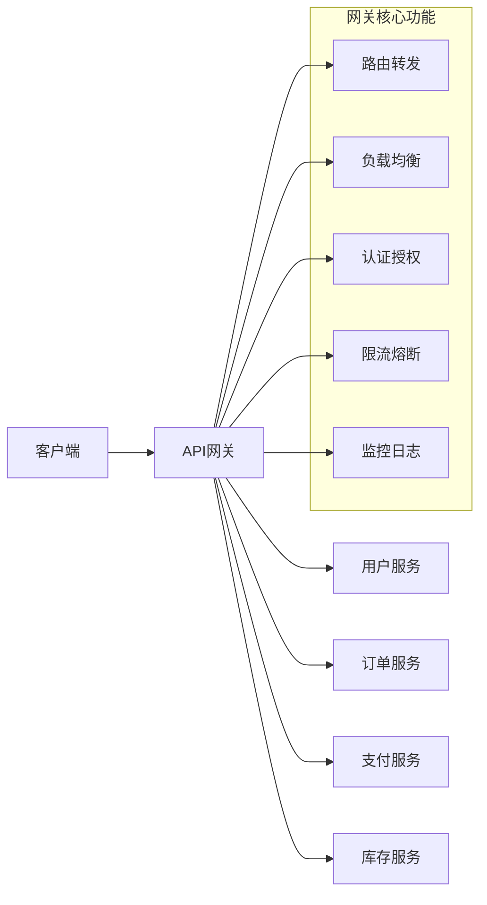
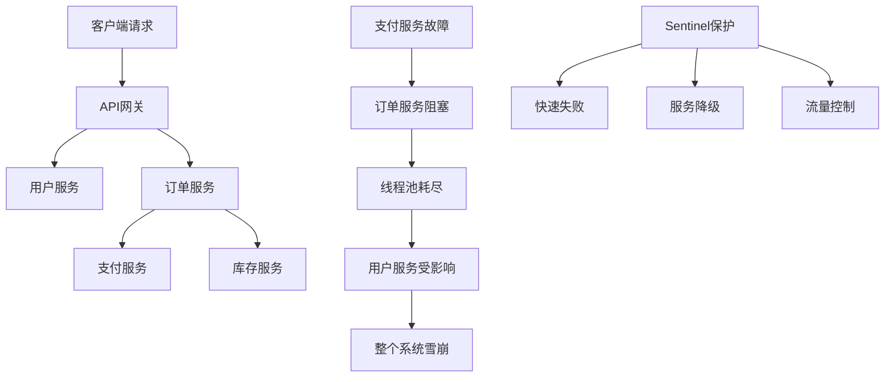

# Spring Cloud Gateway & Sentinel 培训教材
## Day 3-4: API网关和服务熔断

### 📚 培训目标

**Day 3 - Spring Cloud Gateway**
- 掌握API网关的核心概念和作用
- 学会Spring Cloud Gateway的配置和使用
- 实现路由规则、过滤器和限流
- 部署生产级API网关集群

**Day 4 - Sentinel服务熔断**
- 理解服务熔断、降级和限流概念
- 掌握Sentinel的核心功能和配置
- 实现微服务保护机制
- 集成Sentinel Dashboard进行监控

---

## Day 3: Spring Cloud Gateway 深度实践

### 🎯 学习目标

1. **API网关概念理解**
   - 为什么需要API网关
   - 网关的核心功能
   - 微服务架构中网关的作用

2. **Spring Cloud Gateway实战**
   - Gateway核心组件理解
   - 路由规则配置
   - 过滤器链开发
   - 限流和认证实现

3. **生产环境部署**
   - 网关集群配置
   - 高可用架构设计
   - 性能优化策略

### 📖 理论基础

#### 1. API网关核心概念

**API网关是什么？**


**为什么选择Spring Cloud Gateway？**
- 基于Spring WebFlux，性能优异
- 支持动态路由配置
- 丰富的过滤器生态
- 与Spring生态完美集成
- 支持响应式编程

#### 2. Gateway核心架构

```java
/**
 * Spring Cloud Gateway 核心组件
 */
@Component
@Slf4j
public class GatewayArchitectureExplanation {

    /**
     * Route Handler: 处理HTTP请求
     */
    @Bean
    public RouteLocator customRouteLocator(RouteLocatorBuilder builder) {
        return builder.routes()
            .route("path_route", r -> r.path("/api/user/**")
                .filters(f -> f.filter(authenticationFilter))
                .uri("lb://user-service"))
            .build();
    }

    /**
     * Gateway Filter: 请求过滤
     */
    @Bean
    public GlobalFilter customGlobalFilter() {
        return (exchange, chain) -> {
            log.info("Global pre filter executed");
            return chain.filter(exchange).then(Mono.fromRunnable(() -> {
                log.info("Global post filter executed");
            }));
        };
    }
}
```

### 🛠️ 实战环境搭建

#### 1. 创建Gateway项目

**项目结构**
```
ioedream-gateway/
├── src/main/java/net/lab1024/gateway/
│   ├── config/                    # 配置类
│   │   ├── GatewayConfig.java     # 网关配置
│   │   ├── SecurityConfig.java    # 安全配置
│   │   └── CorsConfig.java        # 跨域配置
│   ├── filter/                    # 过滤器
│   │   ├── AuthFilter.java        # 认证过滤器
│   │   ├── LogFilter.java         # 日志过滤器
│   │   └── RateLimitFilter.java   # 限流过滤器
│   ├── fallback/                  # 熔断处理
│   │   └── GatewayFallback.java   # 熔断处理器
│   ├── handler/                   # 处理器
│   │   └── GlobalExceptionHandler.java
│   └── GatewayApplication.java    # 启动类
├── src/main/resources/
│   ├── application.yml            # 配置文件
│   ├── application-dev.yml        # 开发环境
│   └── application-prod.yml       # 生产环境
└── Dockerfile                     # Docker构建文件
```

**POM依赖配置**
```xml
<?xml version="1.0" encoding="UTF-8"?>
<project xmlns="http://maven.apache.org/POM/4.0.0">
    <modelVersion>4.0.0</modelVersion>

    <parent>
        <groupId>net.lab1024</groupId>
        <artifactId>ioedream-parent</artifactId>
        <version>1.0.0</version>
    </parent>

    <artifactId>ioedream-gateway</artifactId>
    <name>IOE-DREAM Gateway</name>
    <description>API网关服务</description>

    <dependencies>
        <!-- Spring Cloud Gateway -->
        <dependency>
            <groupId>org.springframework.cloud</groupId>
            <artifactId>spring-cloud-starter-gateway</artifactId>
        </dependency>

        <!-- Nacos Discovery -->
        <dependency>
            <groupId>com.alibaba.cloud</groupId>
            <artifactId>spring-cloud-starter-alibaba-nacos-discovery</artifactId>
        </dependency>

        <!-- Nacos Config -->
        <dependency>
            <groupId>com.alibaba.cloud</groupId>
            <artifactId>spring-cloud-starter-alibaba-nacos-config</artifactId>
        </dependency>

        <!-- Sentinel Gateway -->
        <dependency>
            <groupId>com.alibaba.cloud</groupId>
            <artifactId>spring-cloud-alibaba-sentinel-gateway</artifactId>
        </dependency>

        <!-- Spring Boot Actuator -->
        <dependency>
            <groupId>org.springframework.boot</groupId>
            <artifactId>spring-boot-starter-actuator</artifactId>
        </dependency>

        <!-- Redis for Rate Limiting -->
        <dependency>
            <groupId>org.springframework.boot</groupId>
            <artifactId>spring-boot-starter-data-redis-reactive</artifactId>
        </dependency>

        <!-- JWT -->
        <dependency>
            <groupId>io.jsonwebtoken</groupId>
            <artifactId>jjwt-api</artifactId>
            <version>0.11.5</version>
        </dependency>

        <!-- Lombok -->
        <dependency>
            <groupId>org.projectlombok</groupId>
            <artifactId>lombok</artifactId>
            <optional>true</optional>
        </dependency>
    </dependencies>
</project>
```

#### 2. 核心配置

**application.yml**
```yaml
server:
  port: 8080

spring:
  application:
    name: ioedream-gateway

  cloud:
    nacos:
      discovery:
        server-addr: ${NACOS_SERVER_ADDR:localhost:8848}
        namespace: ${NACOS_NAMESPACE:dev}
        group: GATEWAY_GROUP
        weight: 1
      config:
        server-addr: ${NACOS_SERVER_ADDR:localhost:8848}
        namespace: ${NACOS_NAMESPACE:dev}
        group: GATEWAY_GROUP
        file-extension: yml
        shared-configs:
          - data-id: gateway-routes.yml
            group: ROUTE_GROUP
            refresh: true

    gateway:
      discovery:
        locator:
          enabled: true
          lower-case-service-id: true

      # 跨域配置
      globalcors:
        cors-configurations:
          '[/**]':
            allowedOriginPatterns: "*"
            allowedMethods:
              - GET
              - POST
              - PUT
              - DELETE
              - OPTIONS
            allowedHeaders: "*"
            allowCredentials: true
            maxAge: 3600

      # 默认过滤器
      default-filters:
        - name: RequestRateLimiter
          args:
            redis-rate-limiter.replenishRate: 10
            redis-rate-limiter.burstCapacity: 20
            key-resolver: "#{@userKeyResolver}"
        - name: Retry
          args:
            retries: 3
            statuses: BAD_GATEWAY,GATEWAY_TIMEOUT
            methods: GET,POST

      # 路由配置
      routes:
        # 用户服务路由
        - id: user-service
          uri: lb://ioedream-user-service
          predicates:
            - Path=/api/user/**
            - Weight=user-service, 100
          filters:
            - name: StripPrefix
              args:
                parts: 1
            - name: AddRequestHeader
              args:
                name: X-Request-Source
                value: gateway
            - name: CircuitBreaker
              args:
                name: user-service-circuitbreaker
                fallbackUri: forward:/fallback/user

        # 设备服务路由
        - id: device-service
          uri: lb://ioedream-device-service
          predicates:
            - Path=/api/device/**
            - Method=GET,POST,PUT,DELETE
          filters:
            - name: StripPrefix
              args:
                parts: 1
            - name: RequestRateLimiter
              args:
                redis-rate-limiter.replenishRate: 20
                redis-rate-limiter.burstCapacity: 40
                key-resolver: "#{@ipKeyResolver}"

        # 门禁服务路由
        - id: access-service
          uri: lb://ioedream-access-service
          predicates:
            - Path=/api/access/**
            - Header=X-Service-Source, mobile
          filters:
            - name: StripPrefix
              args:
                parts: 1

  # Redis配置
  redis:
    host: ${REDIS_HOST:localhost}
    port: ${REDIS_PORT:6379}
    password: ${REDIS_PASSWORD:}
    database: 0
    lettuce:
      pool:
        max-active: 20
        max-idle: 10
        min-idle: 5
        max-wait: 2000ms

# 管理端点配置
management:
  endpoints:
    web:
      exposure:
        include: gateway,health,info,metrics,prometheus
  endpoint:
    gateway:
      enabled: true
    health:
      show-details: always
  metrics:
    export:
      prometheus:
        enabled: true

# 日志配置
logging:
  level:
    org.springframework.cloud.gateway: DEBUG
    org.springframework.web.reactive: DEBUG
    reactor.netty: DEBUG
    net.lab1024.gateway: INFO
  pattern:
    console: "%d{yyyy-MM-dd HH:mm:ss} [%thread] %-5level %logger{36} - %msg%n"

# 自定义配置
gateway:
  security:
    jwt:
      secret: ${JWT_SECRET:ioedream-gateway-secret-key-2025}
      expiration: ${JWT_EXPIRATION:86400}
    exclude-paths:
      - /actuator/**
      - /fallback/**
      - /auth/login

  rate-limit:
    enabled: true
    default-replenish-rate: 10
    default-burst-capacity: 20

  circuit-breaker:
    failure-rate-threshold: 50
    minimum-number-of-calls: 10
    automatic-transition-from-open-to-half-open-enabled: true
    wait-duration-in-open-state: 30s
    permitted-number-of-calls-in-half-open-state: 5
    sliding-window-size: 10
    sliding-window-type: count_based
```

### 🔧 核心组件开发

#### 1. 网关配置类

**GatewayConfig.java**
```java
package net.lab1024.gateway.config;

import lombok.RequiredArgsConstructor;
import lombok.extern.slf4j.Slf4j;
import org.springframework.cloud.gateway.filter.ratelimit.KeyResolver;
import org.springframework.context.annotation.Bean;
import org.springframework.context.annotation.Configuration;
import org.springframework.context.annotation.Primary;
import reactor.core.publisher.Mono;

import java.security.Principal;

/**
 * 网关核心配置
 *
 * @author IOE-DREAM Team
 * @since 2025-11-27
 */
@Slf4j
@Configuration
@RequiredArgsConstructor
public class GatewayConfig {

    /**
     * 基于用户ID的限流解析器
     */
    @Bean
    @Primary
    public KeyResolver userKeyResolver() {
        return exchange -> {
            // 从JWT token中提取用户ID
            String token = exchange.getRequest().getHeaders().getFirst("Authorization");
            if (token != null && token.startsWith("Bearer ")) {
                String userId = extractUserIdFromToken(token.substring(7));
                if (userId != null) {
                    return Mono.just(userId);
                }
            }

            // 如果没有用户ID，使用IP地址
            String ip = exchange.getRequest().getRemoteAddress().getAddress().getHostAddress();
            return Mono.just(ip);
        };
    }

    /**
     * 基于IP地址的限流解析器
     */
    @Bean
    public KeyResolver ipKeyResolver() {
        return exchange -> {
            String ip = exchange.getRequest().getRemoteAddress().getAddress().getHostAddress();
            return Mono.just(ip);
        };
    }

    /**
     * 基于API路径的限流解析器
     */
    @Bean
    public KeyResolver apiKeyResolver() {
        return exchange -> {
            String path = exchange.getRequest().getPath().value();
            return Mono.just(path);
        };
    }

    /**
     * 从JWT token中提取用户ID
     */
    private String extractUserIdFromToken(String token) {
        try {
            // 这里简化实现，实际应该使用JWT库解析
            // 返回用户ID作为限流key
            return "user_" + token.hashCode();
        } catch (Exception e) {
            log.warn("Failed to extract user ID from token", e);
            return null;
        }
    }
}
```

#### 2. 认证过滤器

**AuthFilter.java**
```java
package net.lab1024.gateway.filter;

import com.fasterxml.jackson.databind.ObjectMapper;
import lombok.RequiredArgsConstructor;
import lombok.extern.slf4j.Slf4j;
import net.lab1024.gateway.config.GatewayProperties;
import org.springframework.cloud.gateway.filter.GatewayFilterChain;
import org.springframework.cloud.gateway.filter.GlobalFilter;
import org.springframework.core.Ordered;
import org.springframework.core.io.buffer.DataBuffer;
import org.springframework.http.HttpStatus;
import org.springframework.http.MediaType;
import org.springframework.http.server.reactive.ServerHttpRequest;
import org.springframework.http.server.reactive.ServerHttpResponse;
import org.springframework.stereotype.Component;
import org.springframework.util.AntPathMatcher;
import org.springframework.web.server.ServerWebExchange;
import reactor.core.publisher.Mono;

import java.nio.charset.StandardCharsets;
import java.util.HashMap;
import java.util.List;
import java.util.Map;

/**
 * JWT认证过滤器
 *
 * @author IOE-DREAM Team
 * @since 2025-11-27
 */
@Slf4j
@Component
@RequiredArgsConstructor
public class AuthFilter implements GlobalFilter, Ordered {

    private final GatewayProperties gatewayProperties;
    private final ObjectMapper objectMapper;
    private final AntPathMatcher pathMatcher = new AntPathMatcher();

    @Override
    public Mono<Void> filter(ServerWebExchange exchange, GatewayFilterChain chain) {
        ServerHttpRequest request = exchange.getRequest();
        ServerHttpResponse response = exchange.getResponse();

        String path = request.getPath().value();
        String method = request.getMethod().name();

        log.debug("AuthFilter processing request: {} {}", method, path);

        // 检查是否在排除路径列表中
        if (isExcludePath(path)) {
            log.debug("Path {} is excluded from authentication", path);
            return chain.filter(exchange);
        }

        // 检查Authorization头
        String authHeader = request.getHeaders().getFirst("Authorization");
        if (authHeader == null || !authHeader.startsWith("Bearer ")) {
            log.warn("Missing or invalid Authorization header for path: {}", path);
            return handleUnauthorized(response, "Missing or invalid Authorization header");
        }

        String token = authHeader.substring(7);

        // 验证JWT token
        try {
            if (validateToken(token)) {
                // 在请求头中添加用户信息
                ServerHttpRequest modifiedRequest = request.mutate()
                    .header("X-User-Id", extractUserId(token))
                    .header("X-User-Name", extractUserName(token))
                    .header("X-User-Roles", extractUserRoles(token))
                    .build();

                return chain.filter(exchange.mutate().request(modifiedRequest).build());
            } else {
                log.warn("Invalid JWT token for path: {}", path);
                return handleUnauthorized(response, "Invalid or expired token");
            }
        } catch (Exception e) {
            log.error("Error validating JWT token", e);
            return handleUnauthorized(response, "Token validation error");
        }
    }

    /**
     * 检查是否为排除路径
     */
    private boolean isExcludePath(String path) {
        List<String> excludePaths = gatewayProperties.getSecurity().getExcludePaths();
        return excludePaths.stream().anyMatch(pattern -> pathMatcher.match(pattern, path));
    }

    /**
     * 验证JWT token
     */
    private boolean validateToken(String token) {
        try {
            // 实际实现中应该使用JWT库验证
            // 这里简化实现
            return !token.isEmpty() && token.length() > 20;
        } catch (Exception e) {
            return false;
        }
    }

    /**
     * 从token中提取用户ID
     */
    private String extractUserId(String token) {
        // 简化实现，实际应该解析JWT
        return "user_" + token.hashCode();
    }

    /**
     * 从token中提取用户名
     */
    private String extractUserName(String token) {
        // 简化实现
        return "user_" + token.hashCode();
    }

    /**
     * 从token中提取用户角色
     */
    private String extractUserRoles(String token) {
        // 简化实现
        return "USER";
    }

    /**
     * 处理未授权请求
     */
    private Mono<Void> handleUnauthorized(ServerHttpResponse response, String message) {
        response.setStatusCode(HttpStatus.UNAUTHORIZED);
        response.getHeaders().setContentType(MediaType.APPLICATION_JSON);

        Map<String, Object> body = new HashMap<>();
        body.put("code", HttpStatus.UNAUTHORIZED.value());
        body.put("message", message);
        body.put("timestamp", System.currentTimeMillis());

        try {
            String jsonBody = objectMapper.writeValueAsString(body);
            DataBuffer buffer = response.bufferFactory().wrap(jsonBody.getBytes(StandardCharsets.UTF_8));
            return response.writeWith(Mono.just(buffer));
        } catch (Exception e) {
            log.error("Error writing unauthorized response", e);
            return response.setComplete();
        }
    }

    @Override
    public int getOrder() {
        // 设置较高的优先级，确保在其他过滤器之前执行
        return -100;
    }
}
```

#### 3. 日志过滤器

**LogFilter.java**
```java
package net.lab1024.gateway.filter;

import lombok.extern.slf4j.Slf4j;
import org.springframework.cloud.gateway.filter.GatewayFilterChain;
import org.springframework.cloud.gateway.filter.GlobalFilter;
import org.springframework.core.Ordered;
import org.springframework.stereotype.Component;
import org.springframework.web.server.ServerWebExchange;
import reactor.core.publisher.Mono;

import java.time.Duration;
import java.time.LocalDateTime;

/**
 * 网关日志过滤器
 *
 * @author IOE-DREAM Team
 * @since 2025-11-27
 */
@Slf4j
@Component
public class LogFilter implements GlobalFilter, Ordered {

    @Override
    public Mono<Void> filter(ServerWebExchange exchange, GatewayFilterChain chain) {
        LocalDateTime startTime = LocalDateTime.now();
        String requestId = generateRequestId();

        // 记录请求信息
        log.info("Gateway Request - ID: {}, Method: {}, Path: {}, IP: {}, User-Agent: {}",
            requestId,
            exchange.getRequest().getMethod().name(),
            exchange.getRequest().getPath().value(),
            exchange.getRequest().getRemoteAddress().getAddress().getHostAddress(),
            exchange.getRequest().getHeaders().getFirst("User-Agent"));

        // 添加请求ID到响应头
        exchange.getResponse().getHeaders().add("X-Request-Id", requestId);

        return chain.filter(exchange).then(Mono.fromRunnable(() -> {
            // 记录响应信息
            Duration duration = Duration.between(startTime, LocalDateTime.now());
            log.info("Gateway Response - ID: {}, Status: {}, Duration: {}ms",
                requestId,
                exchange.getResponse().getStatusCode().value(),
                duration.toMillis());
        }));
    }

    /**
     * 生成请求ID
     */
    private String generateRequestId() {
        return "GW-" + System.currentTimeMillis() + "-" + Thread.currentThread().getId();
    }

    @Override
    public int getOrder() {
        // 设置最高优先级
        return Integer.MIN_VALUE;
    }
}
```

#### 4. 熔断处理器

**GatewayFallback.java**
```java
package net.lab1024.gateway.fallback;

import com.fasterxml.jackson.databind.ObjectMapper;
import lombok.RequiredArgsConstructor;
import lombok.extern.slf4j.Slf4j;
import org.springframework.http.MediaType;
import org.springframework.web.bind.annotation.GetMapping;
import org.springframework.web.bind.annotation.PathVariable;
import org.springframework.web.bind.annotation.RequestMapping;
import org.springframework.web.bind.annotation.RestController;
import org.springframework.web.server.ServerWebExchange;
import reactor.core.publisher.Mono;

import java.nio.charset.StandardCharsets;
import java.util.HashMap;
import java.util.Map;

/**
 * 网关熔断处理器
 *
 * @author IOE-DREAM Team
 * @since 2025-11-27
 */
@Slf4j
@RestController
@RequestMapping("/fallback")
@RequiredArgsConstructor
public class GatewayFallback {

    private final ObjectMapper objectMapper;

    /**
     * 用户服务熔断处理
     */
    @GetMapping("/user")
    public Mono<Map<String, Object>> userFallback(ServerWebExchange exchange) {
        log.warn("User service fallback triggered for path: {}", exchange.getRequest().getPath());

        Map<String, Object> response = new HashMap<>();
        response.put("code", 503);
        response.put("message", "用户服务暂时不可用，请稍后重试");
        response.put("service", "user-service");
        response.put("timestamp", System.currentTimeMillis());
        response.put("fallback", true);

        return Mono.just(response);
    }

    /**
     * 设备服务熔断处理
     */
    @GetMapping("/device")
    public Mono<Map<String, Object>> deviceFallback(ServerWebExchange exchange) {
        log.warn("Device service fallback triggered for path: {}", exchange.getRequest().getPath());

        Map<String, Object> response = new HashMap<>();
        response.put("code", 503);
        response.put("message", "设备服务暂时不可用，请稍后重试");
        response.put("service", "device-service");
        response.put("timestamp", System.currentTimeMillis());
        response.put("fallback", true);

        return Mono.just(response);
    }

    /**
     * 通用服务熔断处理
     */
    @GetMapping("/{serviceName}")
    public Mono<Map<String, Object>> genericFallback(@PathVariable String serviceName,
                                                     ServerWebExchange exchange) {
        log.warn("Service {} fallback triggered for path: {}", serviceName, exchange.getRequest().getPath());

        Map<String, Object> response = new HashMap<>();
        response.put("code", 503);
        response.put("message", "服务暂时不可用，请稍后重试");
        response.put("service", serviceName);
        response.put("timestamp", System.currentTimeMillis());
        response.put("fallback", true);

        return Mono.just(response);
    }
}
```

#### 5. 配置属性类

**GatewayProperties.java**
```java
package net.lab1024.gateway.config;

import lombok.Data;
import org.springframework.boot.context.properties.ConfigurationProperties;
import org.springframework.stereotype.Component;

import java.util.List;
import java.util.Map;

/**
 * 网关配置属性
 *
 * @author IOE-DREAM Team
 * @since 2025-11-27
 */
@Data
@Component
@ConfigurationProperties(prefix = "gateway")
public class GatewayProperties {

    /**
     * 安全配置
     */
    private Security security = new Security();

    /**
     * 限流配置
     */
    private RateLimit rateLimit = new RateLimit();

    /**
     * 熔断配置
     */
    private CircuitBreaker circuitBreaker = new CircuitBreaker();

    @Data
    public static class Security {
        /**
         * JWT配置
         */
        private Jwt jwt = new Jwt();

        /**
         * 排除路径
         */
        private List<String> excludePaths;
    }

    @Data
    public static class Jwt {
        private String secret;
        private int expiration;
    }

    @Data
    public static class RateLimit {
        private boolean enabled = true;
        private int defaultReplenishRate = 10;
        private int defaultBurstCapacity = 20;

        /**
         * 服务特定限流配置
         */
        private Map<String, ServiceLimit> services;
    }

    @Data
    public static class ServiceLimit {
        private int replenishRate;
        private int burstCapacity;
    }

    @Data
    public static class CircuitBreaker {
        private int failureRateThreshold = 50;
        private int minimumNumberOfCalls = 10;
        private boolean automaticTransitionFromOpenToHalfOpenEnabled = true;
        private String waitDurationInOpenState = "30s";
        private int permittedNumberOfCallsInHalfOpenState = 5;
        private int slidingWindowSize = 10;
        private String slidingWindowType = "count_based";
    }
}
```

### 🐳 Docker部署配置

**Dockerfile**
```dockerfile
FROM openjdk:17-jre-slim

# 设置工作目录
WORKDIR /app

# 添加应用JAR文件
COPY target/ioedream-gateway-1.0.0.jar app.jar

# 创建非root用户
RUN groupadd -r gateway && useradd -r -g gateway gateway

# 设置时区
ENV TZ=Asia/Shanghai
RUN ln -snf /usr/share/zoneinfo/$TZ /etc/localtime && echo $TZ > /etc/timezone

# 设置JVM参数
ENV JAVA_OPTS="-Xms512m -Xmx2g -XX:+UseG1GC -XX:+UseContainerSupport"

# 暴露端口
EXPOSE 8080

# 切换到非root用户
USER gateway

# 健康检查
HEALTHCHECK --interval=30s --timeout=10s --start-period=60s --retries=3 \
    CMD curl -f http://localhost:8080/actuator/health || exit 1

# 启动应用
ENTRYPOINT ["sh", "-c", "java $JAVA_OPTS -jar app.jar"]
```

**docker-compose.yml**
```yaml
version: '3.8'

services:
  gateway:
    build: .
    ports:
      - "8080:8080"
    environment:
      - SPRING_PROFILES_ACTIVE=docker
      - NACOS_SERVER_ADDR=nacos:8848
      - REDIS_HOST=redis
      - REDIS_PORT=6379
      - JWT_SECRET=ioedream-gateway-secret-key-2025
    depends_on:
      - nacos
      - redis
    networks:
      - ioedream-network
    deploy:
      replicas: 2
      resources:
        limits:
          memory: 2G
          cpus: '1.0'
        reservations:
          memory: 512M
          cpus: '0.5'
      restart_policy:
        condition: on-failure
        delay: 10s
        max_attempts: 3

  nacos:
    image: nacos/nacos-server:v2.2.3
    environment:
      - MODE=standalone
      - SPRING_DATASOURCE_PLATFORM=mysql
      - MYSQL_SERVICE_HOST=mysql
      - MYSQL_SERVICE_DB_NAME=nacos
      - MYSQL_SERVICE_PORT=3306
      - MYSQL_SERVICE_USER=nacos
      - MYSQL_SERVICE_PASSWORD=nacos
      - NACOS_AUTH_ENABLE=true
    depends_on:
      - mysql
    ports:
      - "8848:8848"
    networks:
      - ioedream-network

  redis:
    image: redis:7-alpine
    ports:
      - "6379:6379"
    volumes:
      - redis-data:/data
    networks:
      - ioedream-network

  mysql:
    image: mysql:8.0
    environment:
      - MYSQL_ROOT_PASSWORD=root1234
      - MYSQL_DATABASE=nacos
      - MYSQL_USER=nacos
      - MYSQL_PASSWORD=nacos
    volumes:
      - mysql-data:/var/lib/mysql
      - ./init.sql:/docker-entrypoint-initdb.d/init.sql
    networks:
      - ioedream-network

volumes:
  mysql-data:
  redis-data:

networks:
  ioedream-network:
    driver: bridge
```

### 📊 监控和观测

#### 1. Prometheus指标配置

**Micrometer配置**
```java
package net.lab1024.gateway.config;

import io.micrometer.core.instrument.MeterRegistry;
import io.micrometer.core.instrument.binder.MeterBinder;
import org.springframework.context.annotation.Bean;
import org.springframework.context.annotation.Configuration;
import reactor.core.publisher.Mono;

/**
 * 监控指标配置
 */
@Configuration
public class MetricsConfig {

    @Bean
    public MeterBinder gatewayMetrics() {
        return registry -> {
            // 自定义网关指标
            registry.gauge("gateway.requests.active", new AtomicInteger(0));
            registry.gauge("gateway.connections.active", new AtomicInteger(0));
        };
    }
}
```

#### 2. 健康检查配置

**HealthIndicator**
```java
package net.lab1024.gateway.health;

import org.springframework.beans.factory.annotation.Autowired;
import org.springframework.boot.actuate.health.Health;
import org.springframework.boot.actuate.health.HealthIndicator;
import org.springframework.cloud.gateway.route.RouteLocator;
import org.springframework.stereotype.Component;

/**
 * 网关健康检查
 */
@Component
public class GatewayHealthIndicator implements HealthIndicator {

    @Autowired
    private RouteLocator routeLocator;

    @Override
    public Health health() {
        try {
            // 检查路由配置
            long routeCount = routeLocator.getRoutes().count().block();

            return Health.up()
                .withDetail("routes", routeCount)
                .withDetail("status", "All routes configured")
                .build();
        } catch (Exception e) {
            return Health.down()
                .withDetail("error", e.getMessage())
                .build();
        }
    }
}
```

### 🧪 测试验证

#### 1. 单元测试

**GatewayApplicationTests.java**
```java
package net.lab1024.gateway;

import org.junit.jupiter.api.Test;
import org.springframework.boot.test.context.SpringBootTest;
import org.springframework.test.context.ActiveProfiles;

@SpringBootTest
@ActiveProfiles("test")
class GatewayApplicationTests {

    @Test
    void contextLoads() {
        // 测试应用上下文加载
    }
}
```

**AuthFilterTest.java**
```java
package net.lab1024.gateway.filter;

import org.junit.jupiter.api.Test;
import org.springframework.beans.factory.annotation.Autowired;
import org.springframework.boot.test.autoconfigure.web.reactive.WebFluxTest;
import org.springframework.test.web.reactive.server.WebTestClient;

@WebFluxTest
class AuthFilterTest {

    @Autowired
    private WebTestClient webTestClient;

    @Test
    void whenNoAuthorizationHeader_thenUnauthorized() {
        webTestClient.get()
            .uri("/api/user/profile")
            .exchange()
            .expectStatus().isUnauthorized();
    }

    @Test
    void whenValidToken_thenSuccess() {
        webTestClient.get()
            .uri("/api/user/profile")
            .header("Authorization", "Bearer valid-token-12345")
            .exchange()
            .expectStatus().isOk();
    }

    @Test
    void whenExcludePath_thenNoAuthentication() {
        webTestClient.get()
            .uri("/actuator/health")
            .exchange()
            .expectStatus().isOk();
    }
}
```

#### 2. 集成测试

**GatewayIntegrationTest.java**
```java
package net.lab1024.gateway;

import org.junit.jupiter.api.Test;
import org.springframework.boot.test.context.SpringBootTest;
import org.springframework.test.context.DynamicPropertyRegistry;
import org.springframework.test.context.DynamicPropertySource;
import org.testcontainers.containers.GenericContainer;
import org.testcontainers.junit.jupiter.Container;
import org.testcontainers.junit.jupiter.Testcontainers;

@SpringBootTest(webEnvironment = SpringBootTest.WebEnvironment.RANDOM_PORT)
@Testcontainers
class GatewayIntegrationTest {

    @Container
    static GenericContainer<?> redis = new GenericContainer<>("redis:7-alpine")
        .withExposedPorts(6379);

    @DynamicPropertySource
    static void configureProperties(DynamicPropertyRegistry registry) {
        registry.add("spring.redis.host", redis::getHost);
        registry.add("spring.redis.port", redis::getFirstMappedPort);
    }

    @Test
    void testGatewayRouting() {
        // 测试路由转发功能
    }
}
```

### 📝 部署验证

#### 部署检查清单

```bash
#!/bin/bash

echo "🔍 Spring Cloud Gateway 部署验证检查"

# 1. 健康检查
echo "1. 检查健康状态..."
curl -f http://localhost:8080/actuator/health || {
    echo "❌ 健康检查失败"
    exit 1
}
echo "✅ 健康检查通过"

# 2. 路由配置检查
echo "2. 检查路由配置..."
curl -f http://localhost:8080/actuator/gateway/routes || {
    echo "❌ 路由配置检查失败"
    exit 1
}
echo "✅ 路由配置正常"

# 3. 认证功能测试
echo "3. 测试认证功能..."
# 测试无token访问
response=$(curl -s -w "%{http_code}" http://localhost:8080/api/user/profile -o /dev/null)
if [ "$response" != "401" ]; then
    echo "❌ 认证功能异常"
    exit 1
fi
echo "✅ 认证功能正常"

# 4. 限流功能测试
echo "4. 测试限流功能..."
for i in {1..25}; do
    curl -s http://localhost:8080/api/device/list > /dev/null
done

# 最后一次请求应该被限流
response=$(curl -s -w "%{http_code}" http://localhost:8080/api/device/list -o /dev/null)
if [ "$response" != "429" ]; then
    echo "⚠️ 限流功能可能未生效"
else
    echo "✅ 限流功能正常"
fi

# 5. 熔断功能测试
echo "5. 测试熔断功能..."
# 模拟下游服务不可用的情况
response=$(curl -s http://localhost:8080/api/user/nonexistent | jq -r '.fallback')
if [ "$response" = "true" ]; then
    echo "✅ 熔断功能正常"
else
    echo "⚠️ 熔断功能需要验证"
fi

echo "🎉 Spring Cloud Gateway 部署验证完成"
```

---

## Day 4: Sentinel服务熔断深度实践

### 🎯 学习目标

1. **服务保护概念理解**
   - 服务雪崩问题
   - 熔断、降级、限流机制
   - Sentinel的核心特性

2. **Sentinel实战应用**
   - Sentinel Dashboard部署
   - 流量控制规则配置
   - 熔断降级策略实现
   - 系统自适应保护

3. **生产环境集成**
   - Sentinel与Spring Cloud Gateway集成
   - 规则持久化配置
   - 监控告警设置

### 📖 Sentinel理论基础

#### 1. 服务保护核心概念

**为什么需要服务保护？**


**Sentinel核心特性**
- **流量控制**: 基于QPS、并发线程数的流量控制
- **熔断降级**: 基于响应时间、异常比率的熔断降级
- **系统负载保护**: 系统自适应保护，防止系统崩溃
- **实时监控**: 实时的监控和规则配置
- **广泛生态**: 与主流框架无缝集成

#### 2. Sentinel工作原理

**Sentinel核心组件**
```java
/**
 * Sentinel 核心原理演示
 */
public class SentinelPrincipleDemo {

    /**
     * 流量控制原理
     */
    public void demonstrateFlowControl() {
        /*
         * 1. 资源定义：通过 @SentinelResource 注解定义资源
         * 2. 规则配置：通过FlowRule配置流量控制规则
         * 3. 统计监控：实时统计QPS、响应时间等指标
         * 4. 限流判断：根据规则进行限流判断
         * 5. 流量处理：拒绝、Warm Up、排队等待
         */
    }

    /**
     * 熔断降级原理
     */
    public void demonstrateCircuitBreaker() {
        /*
         * 1. 异常统计：统计资源的异常情况
         * 2. 熔断判断：根据异常比率或响应时间判断是否熔断
         * 3. 状态转换：CLOSED → OPEN → HALF_OPEN → CLOSED
         * 4. 降级处理：执行降级逻辑，返回友好响应
         * 5. 恢复检测：定期检测是否恢复正常
         */
    }
}
```

### 🛠️ Sentinel环境搭建

#### 1. Sentinel Dashboard部署

**Docker部署脚本**
```bash
#!/bin/bash

# Sentinel Dashboard Docker部署
echo "🚀 开始部署Sentinel Dashboard"

# 创建网络
docker network create sentinel-network 2>/dev/null || true

# 启动Sentinel Dashboard
docker run -d \
  --name sentinel-dashboard \
  -p 8858:8858 \
  -e TZ=Asia/Shanghai \
  --network sentinel-network \
  bladex/sentinel-dashboard:1.8.6

# 等待启动
echo "⏳ 等待Sentinel Dashboard启动..."
sleep 30

# 健康检查
if curl -f http://localhost:8858 > /dev/null 2>&1; then
    echo "✅ Sentinel Dashboard启动成功"
    echo "📊 访问地址: http://localhost:8858"
    echo "👤 用户名: sentinel"
    echo "🔑 密码: sentinel"
else
    echo "❌ Sentinel Dashboard启动失败"
    exit 1
fi
```

**docker-compose配置**
```yaml
version: '3.8'

services:
  sentinel-dashboard:
    image: bladex/sentinel-dashboard:1.8.6
    container_name: sentinel-dashboard
    ports:
      - "8858:8858"
    environment:
      - TZ=Asia/Shanghai
      - JAVA_OPTS=-Dserver.port=8858 -Dcsp.sentinel.dashboard.server=localhost:8858
    volumes:
      - sentinel-logs:/root/logs/csp
    networks:
      - sentinel-network
    restart: unless-stopped
    healthcheck:
      test: ["CMD", "curl", "-f", "http://localhost:8858"]
      interval: 30s
      timeout: 10s
      retries: 3

volumes:
  sentinel-logs:

networks:
  sentinel-network:
    driver: bridge
```

#### 2. 微服务集成Sentinel

**依赖配置**
```xml
<!-- Sentinel核心依赖 -->
<dependency>
    <groupId>com.alibaba.cloud</groupId>
    <artifactId>spring-cloud-starter-alibaba-sentinel</artifactId>
</dependency>

<!-- Sentinel持久化依赖 -->
<dependency>
    <groupId>com.alibaba.csp</groupId>
    <artifactId>sentinel-datasource-nacos</artifactId>
</dependency>

<!-- Sentinel Web适配器 -->
<dependency>
    <groupId>com.alibaba.csp</groupId>
    <artifactId>sentinel-web-servlet</artifactId>
</dependency>

<!-- Sentinel注解支持 -->
<dependency>
    <groupId>com.alibaba.csp</groupId>
    <artifactId>sentinel-annotation-aspectj</artifactId>
</dependency>
```

**配置文件**
```yaml
spring:
  cloud:
    sentinel:
      transport:
        dashboard: ${SENTINEL_DASHBOARD:localhost:8858}
        port: 8719
        client-ip: ${SENTINEL_CLIENT_IP:localhost}

      # 数据源配置
      datasource:
        ds1:
          nacos:
            server-addr: ${NACOS_SERVER_ADDR:localhost:8848}
            data-id: ${spring.application.name}-sentinel-flow-rules
            group-id: SENTINEL_GROUP
            rule-type: flow
            data-type: json

        ds2:
          nacos:
            server-addr: ${NACOS_SERVER_ADDR:localhost:8848}
            data-id: ${spring.application.name}-sentinel-degrade-rules
            group-id: SENTINEL_GROUP
            rule-type: degrade
            data-type: json

      # 热点参数限流
      hot-parameter:
        enabled: true

      # 系统自适应保护
      system:
        enabled: true

      # 日志配置
      log:
        dir: ${SENTINEL_LOG_DIR:./logs/sentinel}
        use-pid: true
        file-single-size: 50MB
        file-total-count: 10

# 自定义Sentinel配置
sentinel:
  # 流量控制
  flow:
    default-qps: 50
    default-burst: 100

  # 熔断降级
  degrade:
    default-timeout: 5000
    default-min-request-amount: 10
    default-error-ratio: 0.5

  # 系统保护
  system:
    cpu-usage-threshold: 0.7
    load-threshold: 100

  # 监控上报
  metric:
    export-interval: 1000
    file-single-size: 50MB
    file-total-count: 10
```

### 🔧 Sentinel核心功能实现

#### 1. Sentinel配置类

**SentinelConfig.java**
```java
package net.lab1024.sentinel.config;

import com.alibaba.csp.sentinel.adapter.servlet.CommonFilter;
import com.alibaba.csp.sentinel.adapter.servlet.callback.UrlBlockHandler;
import com.alibaba.csp.sentinel.adapter.servlet.callback.WebCallbackManager;
import com.alibaba.csp.sentinel.slots.block.BlockException;
import com.fasterxml.jackson.databind.ObjectMapper;
import lombok.RequiredArgsConstructor;
import lombok.extern.slf4j.Slf4j;
import org.springframework.boot.web.servlet.FilterRegistrationBean;
import org.springframework.context.annotation.Bean;
import org.springframework.context.annotation.Configuration;
import org.springframework.http.HttpStatus;
import org.springframework.http.MediaType;

import javax.servlet.http.HttpServletRequest;
import javax.servlet.http.HttpServletResponse;
import java.io.PrintWriter;
import java.util.HashMap;
import java.util.Map;

/**
 * Sentinel配置类
 *
 * @author IOE-DREAM Team
 * @since 2025-11-27
 */
@Slf4j
@Configuration
@RequiredArgsConstructor
public class SentinelConfig {

    private final ObjectMapper objectMapper;

    /**
     * 注册Sentinel过滤器
     */
    @Bean
    public FilterRegistrationBean<CommonFilter> sentinelFilterRegistration() {
        FilterRegistrationBean<CommonFilter> registration = new FilterRegistrationBean<>();
        registration.setFilter(new CommonFilter());
        registration.addUrlPatterns("/*");
        registration.setName("sentinelFilter");
        registration.setOrder(1);

        log.info("Sentinel filter registered successfully");
        return registration;
    }

    /**
     * 自定义限流处理
     */
    public SentinelConfig() {
        WebCallbackManager.setBlockHandler(new CustomUrlBlockHandler());
    }

    /**
     * 自定义URL阻塞处理器
     */
    private class CustomUrlBlockHandler implements UrlBlockHandler {
        @Override
        public void blocked(HttpServletRequest request, HttpServletResponse response, BlockException ex) {
            log.warn("Request blocked by Sentinel: {} {}", request.getMethod(), request.getRequestURI());

            response.setStatus(HttpStatus.TOO_MANY_REQUESTS.value());
            response.setContentType(MediaType.APPLICATION_JSON_VALUE);
            response.setCharacterEncoding("UTF-8");

            Map<String, Object> result = new HashMap<>();
            result.put("code", HttpStatus.TOO_MANY_REQUESTS.value());
            result.put("message", "请求过于频繁，请稍后重试");
            result.put("path", request.getRequestURI());
            result.put("timestamp", System.currentTimeMillis());
            result.put("ruleType", ex.getRuleLimitApp());

            try {
                PrintWriter writer = response.getWriter();
                writer.write(objectMapper.writeValueAsString(result));
                writer.flush();
            } catch (Exception e) {
                log.error("Error writing blocked response", e);
            }
        }
    }
}
```

#### 2. 注解式资源定义

**SentinelResourceDemo.java**
```java
package net.lab1024.sentinel.demo;

import com.alibaba.csp.sentinel.annotation.SentinelResource;
import com.alibaba.csp.sentinel.slots.block.BlockException;
import lombok.extern.slf4j.Slf4j;
import org.springframework.stereotype.Service;

import java.util.Random;
import java.util.concurrent.ThreadLocalRandom;

/**
 * Sentinel资源定义演示
 *
 * @author IOE-DREAM Team
 * @since 2025-11-27
 */
@Slf4j
@Service
public class SentinelResourceDemo {

    private final Random random = new Random();

    /**
     * 基本的资源定义
     */
    @SentinelResource(value = "userGetById", blockHandler = "getUserByIdBlockHandler")
    public String getUserById(Long userId) {
        log.info("Getting user by id: {}", userId);

        // 模拟业务处理
        try {
            Thread.sleep(50 + random.nextInt(100));
        } catch (InterruptedException e) {
            Thread.currentThread().interrupt();
        }

        return "User-" + userId;
    }

    /**
     * 资源限流处理方法
     */
    public String getUserByIdBlockHandler(Long userId, BlockException ex) {
        log.warn("User service blocked, userId: {}, exception: {}", userId, ex.getClass().getSimpleName());
        return "服务繁忙，请稍后重试";
    }

    /**
     * 带降级的资源定义
     */
    @SentinelResource(
        value = "createOrder",
        blockHandler = "createOrderBlockHandler",
        fallback = "createOrderFallback"
    )
    public String createOrder(String productId, Integer quantity) {
        log.info("Creating order for product: {}, quantity: {}", productId, quantity);

        // 模拟可能的业务异常
        if (random.nextInt(100) < 20) { // 20%的概率失败
            throw new RuntimeException("订单创建失败：库存不足");
        }

        // 模拟业务处理时间
        try {
            Thread.sleep(100 + random.nextInt(200));
        } catch (InterruptedException e) {
            Thread.currentThread().interrupt();
        }

        return "订单创建成功，产品：" + productId + "，数量：" + quantity;
    }

    /**
     * 资源限流处理方法
     */
    public String createOrderBlockHandler(String productId, Integer quantity, BlockException ex) {
        log.warn("Order creation blocked, productId: {}, quantity: {}, exception: {}",
            productId, quantity, ex.getClass().getSimpleName());
        return "订单服务繁忙，请稍后重试";
    }

    /**
     * 资源降级处理方法
     */
    public String createOrderFallback(String productId, Integer quantity, Throwable ex) {
        log.error("Order creation failed, productId: {}, quantity: {}", productId, quantity, ex);
        return "订单创建失败，系统已记录您的请求，请稍后查看";
    }

    /**
     * 热点参数限流演示
     */
    @SentinelResource(
        value = "hotParameterMethod",
        blockHandler = "hotParameterBlockHandler"
    )
    public String hotParameterMethod(String param1, int param2) {
        log.info("Hot parameter method called with param1: {}, param2: {}", param1, param2);
        return "处理完成：" + param1 + " - " + param2;
    }

    /**
     * 热点参数限流处理
     */
    public String hotParameterBlockHandler(String param1, int param2, BlockException ex) {
        log.warn("Hot parameter method blocked, param1: {}, param2: {}", param1, param2);
        return "热点参数访问频繁，请稍后重试";
    }

    /**
     * 系统负载测试
     */
    @SentinelResource(value = "systemLoadTest", blockHandler = "systemLoadTestBlockHandler")
    public String systemLoadTest() {
        log.info("System load test called");

        // 模拟CPU密集型操作
        double result = 0;
        for (int i = 0; i < 1000000; i++) {
            result += Math.random();
        }

        return "系统负载测试完成，结果：" + result;
    }

    /**
     * 系统负载测试限流处理
     */
    public String systemLoadTestBlockHandler(BlockException ex) {
        log.warn("System load test blocked, exception: {}", ex.getClass().getSimpleName());
        return "系统负载过高，请稍后重试";
    }
}
```

#### 3. Sentinel规则配置服务

**SentinelRuleService.java**
```java
package net.lab1024.sentinel.service;

import com.alibaba.csp.sentinel.AsyncEntry;
import com.alibaba.csp.sentinel.Entry;
import com.alibaba.csp.sentinel.EntryType;
import com.alibaba.csp.sentinel.SphU;
import com.alibaba.csp.sentinel.context.ContextUtil;
import com.alibaba.csp.sentinel.slots.block.RuleConstant;
import com.alibaba.csp.sentinel.slots.block.flow.FlowRule;
import com.alibaba.csp.sentinel.slots.block.flow.FlowRuleManager;
import com.alibaba.csp.sentinel.slots.block.degrade.DegradeRule;
import com.alibaba.csp.sentinel.slots.block.degrade.DegradeRuleManager;
import com.alibaba.csp.sentinel.slots.system.SystemRule;
import com.alibaba.csp.sentinel.slots.system.SystemRuleManager;
import com.alibaba.csp.sentinel.slots.block.authority.AuthorityRule;
import com.alibaba.csp.sentinel.slots.block.authority.AuthorityRuleManager;
import lombok.extern.slf4j.Slf4j;
import org.springframework.stereotype.Service;

import javax.annotation.PostConstruct;
import java.util.ArrayList;
import java.util.List;

/**
 * Sentinel规则配置服务
 *
 * @author IOE-DREAM Team
 * @since 2025-11-27
 */
@Slf4j
@Service
public class SentinelRuleService {

    @PostConstruct
    public void initRules() {
        log.info("Initializing Sentinel rules...");

        // 初始化流量控制规则
        initFlowRules();

        // 初始化熔断降级规则
        initDegradeRules();

        // 初始化系统保护规则
        initSystemRules();

        // 初始化授权规则
        initAuthorityRules();

        log.info("Sentinel rules initialized successfully");
    }

    /**
     * 初始化流量控制规则
     */
    private void initFlowRules() {
        List<FlowRule> rules = new ArrayList<>();

        // 用户服务QPS限制
        FlowRule userFlowRule = new FlowRule();
        userFlowRule.setResource("userGetById");
        userFlowRule.setCount(20);
        userFlowRule.setGrade(RuleConstant.FLOW_GRADE_QPS);
        userFlowRule.setLimitApp("default");
        userFlowRule.setStrategy(RuleConstant.STRATEGY_DIRECT);
        userFlowRule.setControlBehavior(RuleConstant.CONTROL_BEHAVIOR_DEFAULT);
        rules.add(userFlowRule);

        // 订单服务QPS限制
        FlowRule orderFlowRule = new FlowRule();
        orderFlowRule.setResource("createOrder");
        orderFlowRule.setCount(10);
        orderFlowRule.setGrade(RuleConstant.FLOW_GRADE_QPS);
        orderFlowRule.setLimitApp("default");
        orderFlowRule.setStrategy(RuleConstant.STRATEGY_DIRECT);
        orderFlowRule.setControlBehavior(RuleConstant.CONTROL_BEHAVIOR_RATE_LIMITER);
        orderFlowRule.setMaxQueueingTimeMs(5000);
        rules.add(orderFlowRule);

        // 热点参数限流
        FlowRule hotParamRule = new FlowRule();
        hotParamRule.setResource("hotParameterMethod");
        hotParamRule.setCount(100);
        hotParamRule.setGrade(RuleConstant.FLOW_GRADE_QPS);
        hotParamRule.setLimitApp("default");
        hotParamRule.setStrategy(RuleConstant.STRATEGY_DIRECT);
        rules.add(hotParamRule);

        FlowRuleManager.loadRules(rules);
        log.info("Flow rules loaded: {}", rules.size());
    }

    /**
     * 初始化熔断降级规则
     */
    private void initDegradeRules() {
        List<DegradeRule> rules = new ArrayList<>();

        // 订单服务熔断规则
        DegradeRule orderDegradeRule = new DegradeRule();
        orderDegradeRule.setResource("createOrder");
        orderDegradeRule.setGrade(RuleConstant.DEGRADE_GRADE_RT);
        orderDegradeRule.setCount(500); // 平均响应时间超过500ms
        orderDegradeRule.setTimeWindow(60); // 熔断时间60秒
        orderDegradeRule.setMinRequestAmount(10); // 最小请求数
        orderDegradeRule.setStatIntervalMs(30000); // 统计时间窗口30秒
        orderDegradeRule.setSlowRatioThreshold(0.5); // 慢调用比例阈值
        rules.add(orderDegradeRule);

        // 外部服务调用熔断规则
        DegradeRule externalServiceRule = new DegradeRule();
        externalServiceRule.setResource("externalServiceCall");
        externalServiceRule.setGrade(RuleConstant.DEGRADE_GRADE_EXCEPTION_RATIO);
        externalServiceRule.setCount(0.4); // 异常比例阈值40%
        externalServiceRule.setTimeWindow(30); // 熔断时间30秒
        externalServiceRule.setMinRequestAmount(5); // 最小请求数
        rules.add(externalServiceRule);

        DegradeRuleManager.loadRules(rules);
        log.info("Degrade rules loaded: {}", rules.size());
    }

    /**
     * 初始化系统保护规则
     */
    private void initSystemRules() {
        List<SystemRule> rules = new ArrayList<>();

        // CPU使用率规则
        SystemRule cpuRule = new SystemRule();
        cpuRule.setHighestCpuUsage(0.8); // CPU使用率超过80%
        rules.add(cpuRule);

        // 负载规则
        SystemRule loadRule = new SystemRule();
        loadRule.setHighestSystemLoad(10.0); // 系统负载超过10
        rules.add(loadRule);

        // 平均响应时间规则
        SystemRule rtRule = new SystemRule();
        rtRule.setAvgRt(1000); // 平均响应时间超过1000ms
        rules.add(rtRule);

        // 线程数规则
        SystemRule threadRule = new SystemRule();
        threadRule.setMaxThread(500); // 线程数超过500
        rules.add(threadRule);

        SystemRuleManager.loadRules(rules);
        log.info("System rules loaded: {}", rules.size());
    }

    /**
     * 初始化授权规则
     */
    private void initAuthorityRules() {
        List<AuthorityRule> rules = new ArrayList<>();

        // 白名单规则
        AuthorityRule whiteListRule = new AuthorityRule();
        whiteListRule.setResource("protectedApi");
        whiteListRule.setStrategy(RuleConstant.AUTHORITY_WHITE);
        whiteListRule.setLimitApp("trusted-app");
        rules.add(whiteListRule);

        // 黑名单规则
        AuthorityRule blackListRule = new AuthorityRule();
        blackListRule.setResource("sensitiveApi");
        blackListRule.setStrategy(RuleConstant.AUTHORITY_BLACK);
        blackListRule.setLimitApp("malicious-app");
        rules.add(blackListRule);

        AuthorityRuleManager.loadRules(rules);
        log.info("Authority rules loaded: {}", rules.size());
    }

    /**
     * 动态添加流量规则
     */
    public void addFlowRule(String resource, double count) {
        FlowRule rule = new FlowRule();
        rule.setResource(resource);
        rule.setCount(count);
        rule.setGrade(RuleConstant.FLOW_GRADE_QPS);
        rule.setLimitApp("default");

        List<FlowRule> rules = new ArrayList<>(FlowRuleManager.getRules());
        rules.add(rule);

        FlowRuleManager.loadRules(rules);
        log.info("Added flow rule for resource: {}, count: {}", resource, count);
    }

    /**
     * 动态移除流量规则
     */
    public void removeFlowRule(String resource) {
        List<FlowRule> rules = new ArrayList<>(FlowRuleManager.getRules());
        rules.removeIf(rule -> resource.equals(rule.getResource()));

        FlowRuleManager.loadRules(rules);
        log.info("Removed flow rule for resource: {}", resource);
    }

    /**
     * 使用Context进行调用链管理
     */
    public String callWithContext(String resourceName, String contextName, String origin) {
        try {
            // 定义调用链路
            ContextUtil.enter(contextName, origin);

            // 进入资源
            Entry entry = SphU.entry(resourceName, EntryType.OUT);
            try {
                // 业务逻辑
                return "Business logic executed for resource: " + resourceName;
            } finally {
                entry.exit();
            }
        } catch (BlockException e) {
            log.warn("Resource blocked: {}, reason: {}", resourceName, e.getClass().getSimpleName());
            return "Resource blocked: " + resourceName;
        } finally {
            ContextUtil.exit();
        }
    }

    /**
     * 异步调用示例
     */
    public String asyncCall(String resourceName) {
        try {
            AsyncEntry asyncEntry = SphU.asyncEntry(resourceName, EntryType.OUT);

            // 异步执行业务逻辑
            CompletableFuture.runAsync(() -> {
                try {
                    // 模拟异步业务处理
                    Thread.sleep(100);
                    log.info("Async business logic executed for resource: {}", resourceName);
                } catch (InterruptedException e) {
                    Thread.currentThread().interrupt();
                } finally {
                    asyncEntry.exit();
                }
            });

            return "Async call initiated for resource: " + resourceName;
        } catch (BlockException e) {
            log.warn("Async resource blocked: {}", resourceName);
            return "Async resource blocked: " + resourceName;
        }
    }
}
```

### 📊 Sentinel监控和告警

#### 1. 监控指标收集

**SentinelMetricsService.java**
```java
package net.lab1024.sentinel.monitor;

import com.alibaba.csp.sentinel.Entry;
import com.alibaba.csp.sentinel.EntryType;
import com.alibaba.csp.sentinel.SphU;
import com.alibaba.csp.sentinel.context.ContextUtil;
import com.alibaba.csp.sentinel.slots.block.BlockException;
import com.alibaba.csp.sentinel.slots.block.flow.FlowRule;
import com.alibaba.csp.sentinel.slots.block.flow.FlowRuleManager;
import lombok.extern.slf4j.Slf4j;
import org.springframework.scheduling.annotation.Scheduled;
import org.springframework.stereotype.Service;

import java.util.List;
import java.util.concurrent.atomic.AtomicLong;

/**
 * Sentinel监控指标服务
 *
 * @author IOE-DREAM Team
 * @since 2025-11-27
 */
@Slf4j
@Service
public class SentinelMetricsService {

    private final AtomicLong totalRequests = new AtomicLong(0);
    private final AtomicLong blockedRequests = new AtomicLong(0);
    private final AtomicLong successfulRequests = new AtomicLong(0);
    private final AtomicLong failedRequests = new AtomicLong(0);

    /**
     * 模拟业务请求并收集指标
     */
    public String simulateBusinessCall(String resourceName) {
        totalRequests.incrementAndGet();

        try {
            Entry entry = SphU.entry(resourceName, EntryType.IN);
            try {
                // 模拟业务逻辑
                simulateBusinessLogic();

                successfulRequests.incrementAndGet();
                return "Business call successful for: " + resourceName;

            } finally {
                entry.exit();
            }
        } catch (BlockException e) {
            blockedRequests.incrementAndGet();
            log.warn("Business call blocked: {}, reason: {}", resourceName, e.getClass().getSimpleName());
            return "Business call blocked: " + resourceName;
        } catch (Exception e) {
            failedRequests.incrementAndGet();
            log.error("Business call failed: {}", resourceName, e);
            throw e;
        }
    }

    /**
     * 模拟业务逻辑
     */
    private void simulateBusinessLogic() {
        // 模拟业务处理时间
        try {
            Thread.sleep(50 + (long)(Math.random() * 200));
        } catch (InterruptedException e) {
            Thread.currentThread().interrupt();
        }

        // 模拟可能的业务异常
        if (Math.random() < 0.05) { // 5%的失败概率
            throw new RuntimeException("Simulated business exception");
        }
    }

    /**
     * 定期报告监控指标
     */
    @Scheduled(fixedRate = 30000) // 每30秒执行一次
    public void reportMetrics() {
        long total = totalRequests.get();
        long blocked = blockedRequests.get();
        long successful = successfulRequests.get();
        long failed = failedRequests.get();

        double blockRate = total > 0 ? (double) blocked / total * 100 : 0;
        double successRate = total > 0 ? (double) successful / total * 100 : 0;
        double failRate = total > 0 ? (double) failed / total * 100 : 0;

        log.info("=== Sentinel Metrics Report ===");
        log.info("Total Requests: {}", total);
        log.info("Blocked Requests: {} ({:.2f}%)", blocked, blockRate);
        log.info("Successful Requests: {} ({:.2f}%)", successful, successRate);
        log.info("Failed Requests: {} ({:.2f}%)", failed, failRate);

        // 报告当前规则情况
        reportCurrentRules();

        // 检查告警条件
        checkAlerts(blockRate, failRate);
    }

    /**
     * 报告当前规则配置
     */
    private void reportCurrentRules() {
        List<FlowRule> flowRules = FlowRuleManager.getRules();
        log.info("Current flow rules count: {}", flowRules.size());

        for (FlowRule rule : flowRules) {
            log.info("Flow Rule - Resource: {}, Count: {}, Grade: {}",
                rule.getResource(), rule.getCount(), rule.getGrade());
        }
    }

    /**
     * 检查告警条件
     */
    private void checkAlerts(double blockRate, double failRate) {
        // 限流告警
        if (blockRate > 20) {
            sendAlert("HIGH_BLOCK_RATE", "Block rate is high: " + String.format("%.2f%%", blockRate));
        }

        // 失败率告警
        if (failRate > 10) {
            sendAlert("HIGH_FAIL_RATE", "Fail rate is high: " + String.format("%.2f%%", failRate));
        }

        // 总请求数告警
        if (totalRequests.get() > 1000) {
            sendAlert("HIGH_REQUEST_VOLUME", "Request volume is high: " + totalRequests.get());
            resetCounters();
        }
    }

    /**
     * 发送告警
     */
    private void sendAlert(String alertType, String message) {
        log.warn("🚨 SENTINEL ALERT [{}]: {}", alertType, message);

        // 这里可以集成实际的告警系统，如：
        // - 发送邮件
        // - 发送短信
        // - 推送到监控平台
        // - 触发Webhook
    }

    /**
     * 重置计数器
     */
    private void resetCounters() {
        totalRequests.set(0);
        blockedRequests.set(0);
        successfulRequests.set(0);
        failedRequests.set(0);
        log.info("Counters reset");
    }

    /**
     * 获取当前指标
     */
    public Metrics getCurrentMetrics() {
        return Metrics.builder()
            .totalRequests(totalRequests.get())
            .blockedRequests(blockedRequests.get())
            .successfulRequests(successfulRequests.get())
            .failedRequests(failedRequests.get())
            .build();
    }

    /**
     * 监控指标类
     */
    @lombok.Data
    @lombok.Builder
    public static class Metrics {
        private long totalRequests;
        private long blockedRequests;
        private long successfulRequests;
        private long failedRequests;

        public double getBlockRate() {
            return totalRequests > 0 ? (double) blockedRequests / totalRequests * 100 : 0;
        }

        public double getSuccessRate() {
            return totalRequests > 0 ? (double) successfulRequests / totalRequests * 100 : 0;
        }

        public double getFailRate() {
            return totalRequests > 0 ? (double) failedRequests / totalRequests * 100 : 0;
        }
    }
}
```

#### 2. 控制器层集成

**SentinelController.java**
```java
package net.lab1024.sentinel.controller;

import com.alibaba.csp.sentinel.annotation.SentinelResource;
import lombok.RequiredArgsConstructor;
import lombok.extern.slf4j.Slf4j;
import net.lab1024.sentinel.demo.SentinelResourceDemo;
import net.lab1024.sentinel.monitor.SentinelMetricsService;
import net.lab1024.sentinel.service.SentinelRuleService;
import org.springframework.http.ResponseEntity;
import org.springframework.web.bind.annotation.*;

import java.util.HashMap;
import java.util.Map;
import java.util.concurrent.CompletableFuture;

/**
 * Sentinel功能演示控制器
 *
 * @author IOE-DREAM Team
 * @since 2025-11-27
 */
@Slf4j
@RestController
@RequestMapping("/sentinel")
@RequiredArgsConstructor
public class SentinelController {

    private final SentinelResourceDemo sentinelResourceDemo;
    private final SentinelMetricsService metricsService;
    private final SentinelRuleService ruleService;

    /**
     * 基本的资源调用演示
     */
    @GetMapping("/user/{userId}")
    @SentinelResource(value = "userGetById", blockHandler = "handleBlock")
    public ResponseEntity<Map<String, Object>> getUserById(@PathVariable Long userId) {
        String result = sentinelResourceDemo.getUserById(userId);

        Map<String, Object> response = new HashMap<>();
        response.put("success", true);
        response.put("data", result);
        response.put("userId", userId);
        response.put("timestamp", System.currentTimeMillis());

        return ResponseEntity.ok(response);
    }

    /**
     * 订单创建演示
     */
    @PostMapping("/order")
    @SentinelResource(value = "createOrder", blockHandler = "handleBlock")
    public ResponseEntity<Map<String, Object>> createOrder(
            @RequestParam String productId,
            @RequestParam Integer quantity) {

        String result = sentinelResourceDemo.createOrder(productId, quantity);

        Map<String, Object> response = new HashMap<>();
        response.put("success", true);
        response.put("data", result);
        response.put("productId", productId);
        response.put("quantity", quantity);
        response.put("timestamp", System.currentTimeMillis());

        return ResponseEntity.ok(response);
    }

    /**
     * 热点参数限流演示
     */
    @GetMapping("/hot-param")
    @SentinelResource(value = "hotParameterMethod", blockHandler = "handleBlock")
    public ResponseEntity<Map<String, Object>> hotParamDemo(
            @RequestParam String param1,
            @RequestParam int param2) {

        String result = sentinelResourceDemo.hotParameterMethod(param1, param2);

        Map<String, Object> response = new HashMap<>();
        response.put("success", true);
        response.put("data", result);
        response.put("param1", param1);
        response.put("param2", param2);
        response.put("timestamp", System.currentTimeMillis());

        return ResponseEntity.ok(response);
    }

    /**
     * 系统负载测试
     */
    @GetMapping("/load-test")
    @SentinelResource(value = "systemLoadTest", blockHandler = "handleBlock")
    public ResponseEntity<Map<String, Object>> loadTest() {
        String result = sentinelResourceDemo.systemLoadTest();

        Map<String, Object> response = new HashMap<>();
        response.put("success", true);
        response.put("data", result);
        response.put("timestamp", System.currentTimeMillis());

        return ResponseEntity.ok(response);
    }

    /**
     * 批量压力测试
     */
    @PostMapping("/stress-test")
    public ResponseEntity<Map<String, Object>> stressTest(
            @RequestParam String resourceName,
            @RequestParam(defaultValue = "100") int requestCount) {

        CompletableFuture.runAsync(() -> {
            for (int i = 0; i < requestCount; i++) {
                metricsService.simulateBusinessCall(resourceName);

                // 控制请求频率
                try {
                    Thread.sleep(50);
                } catch (InterruptedException e) {
                    Thread.currentThread().interrupt();
                    break;
                }
            }
        });

        Map<String, Object> response = new HashMap<>();
        response.put("success", true);
        response.put("message", "Stress test initiated");
        response.put("resourceName", resourceName);
        response.put("requestCount", requestCount);
        response.put("timestamp", System.currentTimeMillis());

        return ResponseEntity.ok(response);
    }

    /**
     * 动态添加规则
     */
    @PostMapping("/rules/flow")
    public ResponseEntity<Map<String, Object>> addFlowRule(
            @RequestParam String resource,
            @RequestParam double count) {

        ruleService.addFlowRule(resource, count);

        Map<String, Object> response = new HashMap<>();
        response.put("success", true);
        response.put("message", "Flow rule added successfully");
        response.put("resource", resource);
        response.put("count", count);
        response.put("timestamp", System.currentTimeMillis());

        return ResponseEntity.ok(response);
    }

    /**
     * 移除规则
     */
    @DeleteMapping("/rules/flow/{resource}")
    public ResponseEntity<Map<String, Object>> removeFlowRule(@PathVariable String resource) {
        ruleService.removeFlowRule(resource);

        Map<String, Object> response = new HashMap<>();
        response.put("success", true);
        response.put("message", "Flow rule removed successfully");
        response.put("resource", resource);
        response.put("timestamp", System.currentTimeMillis());

        return ResponseEntity.ok(response);
    }

    /**
     * 获取当前指标
     */
    @GetMapping("/metrics")
    public ResponseEntity<SentinelMetricsService.Metrics> getMetrics() {
        SentinelMetricsService.Metrics metrics = metricsService.getCurrentMetrics();
        return ResponseEntity.ok(metrics);
    }

    /**
     * 统一的限流处理方法
     */
    public ResponseEntity<Map<String, Object>> handleBlock(String param, Object blockHandler) {
        Map<String, Object> response = new HashMap<>();
        response.put("success", false);
        response.put("code", 429);
        response.put("message", "请求过于频繁，请稍后重试");
        response.put("blockHandler", blockHandler.getClass().getSimpleName());
        response.put("timestamp", System.currentTimeMillis());

        return ResponseEntity.status(429).body(response);
    }
}
```

### 🐳 Sentinel部署和运维

#### 1. 完整的docker-compose部署

```yaml
version: '3.8'

services:
  # Sentinel Dashboard
  sentinel-dashboard:
    image: bladex/sentinel-dashboard:1.8.6
    container_name: sentinel-dashboard
    ports:
      - "8858:8858"
    environment:
      - TZ=Asia/Shanghai
      - JAVA_OPTS=-Dserver.port=8858 -Dcsp.sentinel.dashboard.server=localhost:8858
    volumes:
      - ./sentinel/logs:/root/logs/csp
    networks:
      - sentinel-network
    restart: unless-stopped
    healthcheck:
      test: ["CMD", "curl", "-f", "http://localhost:8858"]
      interval: 30s
      timeout: 10s
      retries: 3

  # 应用服务
  user-service:
    build:
      context: ../user-service
      dockerfile: Dockerfile
    container_name: user-service
    ports:
      - "8081:8081"
    environment:
      - SPRING_PROFILES_ACTIVE=docker
      - SENTINEL_DASHBOARD=sentinel-dashboard:8858
      - NACOS_SERVER_ADDR=nacos:8848
    depends_on:
      - sentinel-dashboard
      - nacos
    networks:
      - sentinel-network
    deploy:
      replicas: 2
      resources:
        limits:
          memory: 1G
          cpus: '0.5'

  # Nacos注册中心
  nacos:
    image: nacos/nacos-server:v2.2.3
    container_name: nacos
    ports:
      - "8848:8848"
    environment:
      - MODE=standalone
      - TZ=Asia/Shanghai
    volumes:
      - ./nacos/data:/home/nacos/data
      - ./nacos/logs:/home/nacos/logs
    networks:
      - sentinel-network

  # Redis（用于限流计数器）
  redis:
    image: redis:7-alpine
    container_name: redis
    ports:
      - "6379:6379"
    volumes:
      - redis-data:/data
    networks:
      - sentinel-network

volumes:
  redis-data:

networks:
  sentinel-network:
    driver: bridge
```

#### 2. 部署验证脚本

```bash
#!/bin/bash

echo "🔍 Sentinel 部署验证检查"

# 1. 检查Sentinel Dashboard
echo "1. 检查Sentinel Dashboard..."
if curl -f http://localhost:8858 > /dev/null 2>&1; then
    echo "✅ Sentinel Dashboard运行正常"
else
    echo "❌ Sentinel Dashboard无法访问"
    exit 1
fi

# 2. 检查服务注册
echo "2. 检查服务注册情况..."
dashboard_response=$(curl -s http://localhost:8858/api/applications)
if echo "$dashboard_response" | jq -e '.length > 0' > /dev/null 2>&1; then
    echo "✅ 服务已注册到Sentinel Dashboard"
    echo "注册的服务数量: $(echo "$dashboard_response" | jq 'length')"
else
    echo "⚠️ 尚未发现注册的服务"
fi

# 3. 测试基本限流功能
echo "3. 测试基本限流功能..."
blocked_count=0
for i in {1..25}; do
    response=$(curl -s -w "%{http_code}" http://localhost:8081/sentinel/user/1 -o /dev/null)
    if [ "$response" = "429" ]; then
        ((blocked_count++))
    fi
    sleep 0.1
done

if [ $blocked_count -gt 0 ]; then
    echo "✅ 限流功能正常，被限流的请求: $blocked_count"
else
    echo "⚠️ 限流功能可能需要调整规则"
fi

# 4. 测试熔断降级
echo "4. 测试熔断降级功能..."
# 触发异常率达到熔断条件
for i in {1..20}; do
    curl -s http://localhost:8081/sentinel/order -d "productId=test&quantity=1" -X POST > /dev/null
    sleep 0.2
done

# 检查降级响应
response=$(curl -s http://localhost:8081/sentinel/order -d "productId=test&quantity=1" -X POST)
if echo "$response" | grep -q "订单创建失败，系统已记录"; then
    echo "✅ 熔断降级功能正常"
else
    echo "⚠️ 熔断降级功能需要验证"
fi

# 5. 检查监控指标
echo "5. 检查监控指标..."
metrics_response=$(curl -s http://localhost:8081/sentinel/metrics)
if echo "$metrics_response" | jq -e '.totalRequests > 0' > /dev/null 2>&1; then
    echo "✅ 监控指标收集正常"
    echo "总请求数: $(echo "$metrics_response" | jq -r '.totalRequests')"
    echo "成功请求数: $(echo "$metrics_response" | jq -r '.successfulRequests')"
    echo "限流请求数: $(echo "$metrics_response" | jq -r '.blockedRequests')"
else
    echo "⚠️ 监控指标需要检查"
fi

echo "🎉 Sentinel 部署验证完成"
```

### 📝 最佳实践和故障排查

#### 1. Sentinel最佳实践

**规则配置建议**
```yaml
# 生产环境推荐配置
sentinel:
  # 流量控制
  flow:
    # QPS限制：根据系统实际承载能力设置
    default-qps: 100
    # 突发流量：设置为日常QPS的2-3倍
    default-burst: 300
    # 控制行为：推荐使用排队等待，避免直接拒绝
    control-behavior: rate_limiter
    # 最大排队时间：根据业务容忍度设置
    max-queueing-time-ms: 5000

  # 熔断降级
  degrade:
    # 响应时间阈值：根据业务SLA设置
    default-response-time-threshold: 1000
    # 异常比例阈值：通常设置为20%-50%
    default-error-ratio: 0.3
    # 熔断时间：根据业务恢复能力设置
    default-time-window: 60
    # 最小请求数：避免误判
    default-min-request-amount: 20

  # 系统保护
  system:
    # CPU使用率：留出30%buffer
    cpu-usage-threshold: 0.7
    # 系统负载：根据CPU核心数设置
    load-threshold: cpu-cores * 2
    # 平均响应时间：根据业务容忍度设置
    avg-rt: 1000
```

**监控告警策略**
```yaml
# 告警规则配置
alerts:
  # 限流告警
  block-rate-alert:
    threshold: 20  # 限流率超过20%
    duration: 5m   # 持续5分钟

  # 熔断告警
  circuit-breaker-alert:
    threshold: 1   # 发生熔断
    duration: 1m   # 持续1分钟

  # 系统负载告警
  system-load-alert:
    cpu-threshold: 80%    # CPU使用率超过80%
    memory-threshold: 85% # 内存使用率超过85%
```

#### 2. 常见问题和解决方案

**问题1：Sentinel Dashboard无法显示监控数据**
```bash
# 检查配置
curl http://localhost:8081/actuator/health

# 检查网络连通性
ping sentinel-dashboard-hostname

# 检查防火墙
telnet sentinel-dashboard-hostname 8858
```

**问题2：限流规则不生效**
```java
// 确保资源名称一致
@SentinelResource(value = "exact-resource-name")
public String businessMethod() {
    // 确保规则中的资源名称与此处一致
}

// 检查规则配置
FlowRule rule = new FlowRule();
rule.setResource("exact-resource-name"); // 必须完全匹配
```

**问题3：熔断后无法恢复**
```yaml
# 调整熔断配置
spring:
  cloud:
    sentinel:
      datasource:
        flow:
          nacos:
            # 确保Nacos中的规则配置正确
            data-id: ${spring.application.name}-sentinel-rules
```

### 🎯 培训总结和下一步

**Day 3-4学习成果**
1. ✅ 掌握了Spring Cloud Gateway的核心概念和配置
2. ✅ 实现了API网关的路由、过滤、限流功能
3. ✅ 理解了Sentinel的服务保护机制
4. ✅ 配置了流量控制、熔断降级、系统保护
5. ✅ 部署了生产级的监控和告警系统

**关键技能点**
- Spring Cloud Gateway路由配置和过滤器开发
- JWT认证和权限控制实现
- Sentinel规则配置和动态调整
- 服务保护和系统自适应防护
- 监控指标收集和告警设置

**下一步学习重点**
- Day 5: Nacos高级特性和服务治理
- Day 6-7: Kubernetes深度实践
- Day 8: CI/CD流水线建设
- Day 9: 监控告警体系完善
- Day 10: 故障排查和性能优化

**实践作业**
1. 设计一个完整的API网关保护策略
2. 配置多级熔断降级机制
3. 实现自定义的限流规则和告警
4. 部署完整的Sentinel监控体系