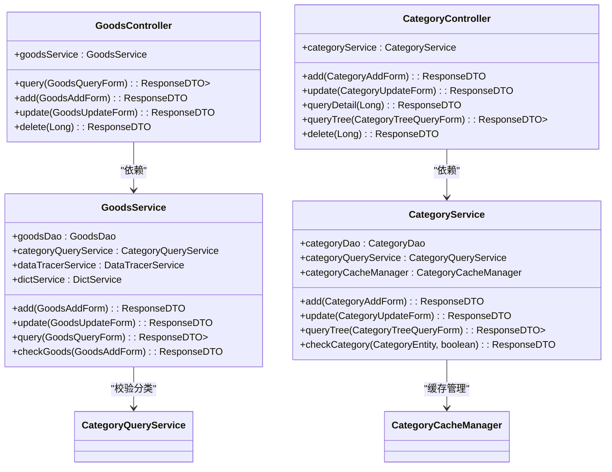
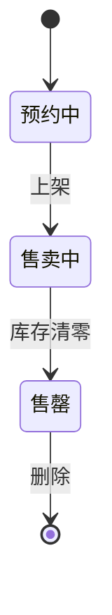
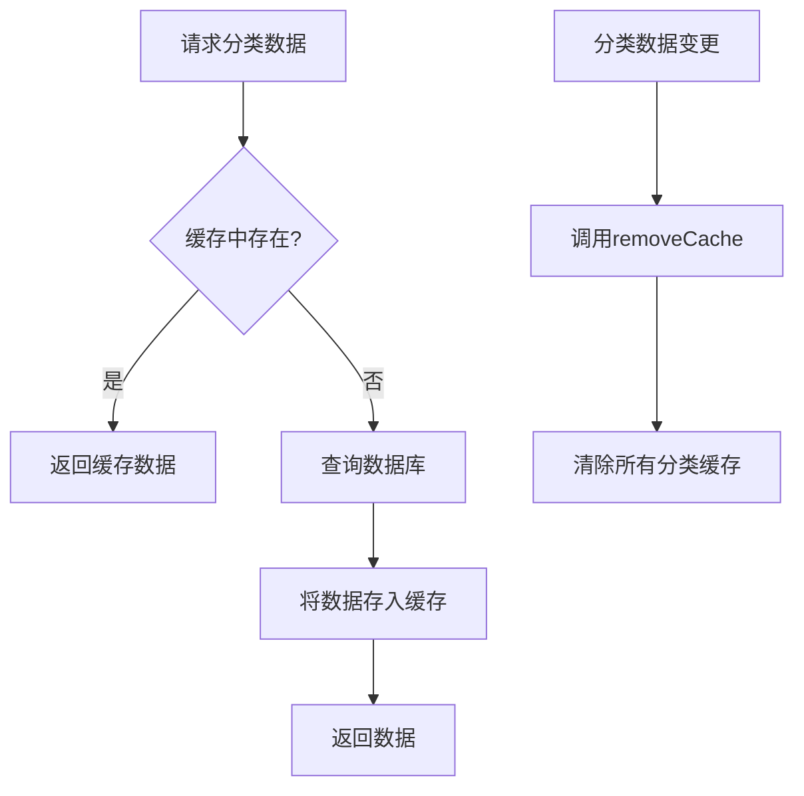
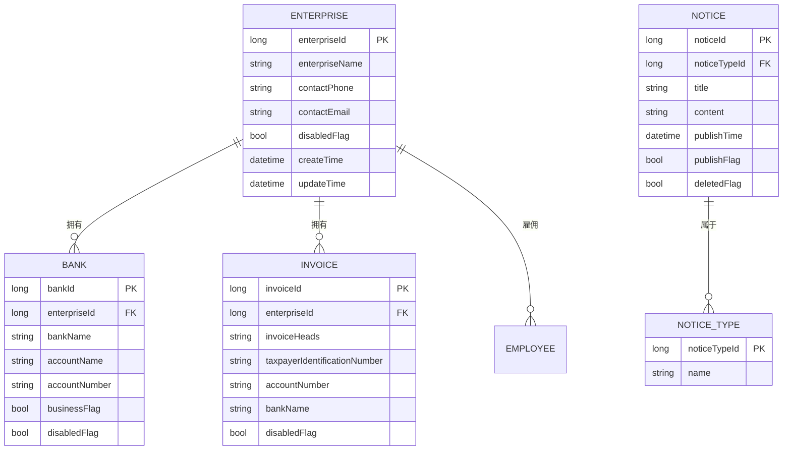
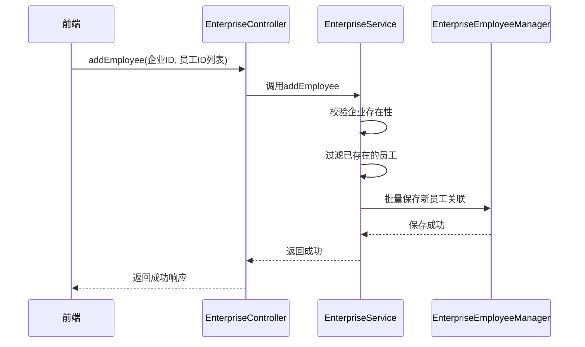
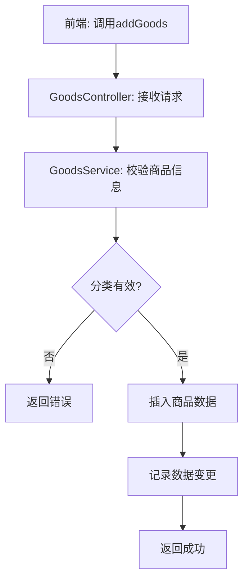
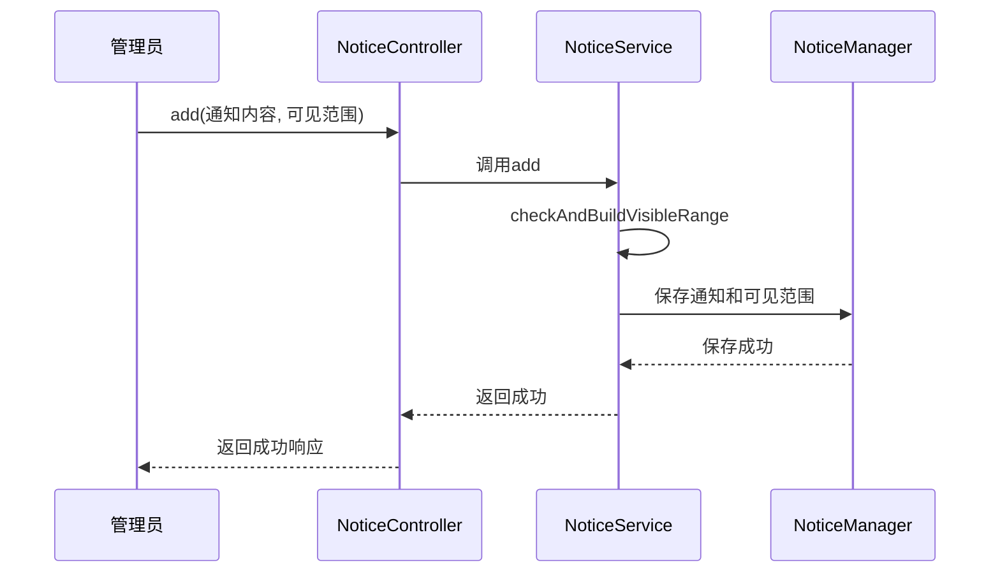

# 业务功能模块

<cite>
**本文档引用的文件**  
- [CategoryController.java](file://smart-admin-api-java17-springboot3/sa-admin/src/main/java/net/lab1024/sa/admin/module/business/category/controller/CategoryController.java)
- [GoodsController.java](file://smart-admin-api-java17-springboot3/sa-admin/src/main/java/net/lab1024/sa/admin/module/business/goods/controller/GoodsController.java)
- [CategoryService.java](file://smart-admin-api-java17-springboot3/sa-admin/src/main/java/net/lab1024/sa/admin/module/business/category/service/CategoryService.java)
- [GoodsService.java](file://smart-admin-api-java17-springboot3/sa-admin/src/main/java/net/lab1024/sa/admin/module/business/goods/service/GoodsService.java)
- [EnterpriseController.java](file://smart-admin-api-java17-springboot3/sa-admin/src/main/java/net/lab1024/sa/admin/module/business/oa/enterprise/controller/EnterpriseController.java)
- [BankController.java](file://smart-admin-api-java17-springboot3/sa-admin/src/main/java/net/lab1024/sa/admin/module/business/oa/bank/controller/BankController.java)
- [InvoiceController.java](file://smart-admin-api-java17-springboot3/sa-admin/src/main/java/net/lab1024/sa/admin/module/business/oa/invoice/controller/InvoiceController.java)
- [NoticeController.java](file://smart-admin-api-java17-springboot3/sa-admin/src/main/java/net/lab1024/sa/admin/module/business/oa/notice/controller/NoticeController.java)
- [CategoryCacheManager.java](file://smart-admin-api-java17-springboot3/sa-admin/src/main/java/net/lab1024/sa/admin/module/business/category/manager/CategoryCacheManager.java)
- [GoodsStatusEnum.java](file://smart-admin-api-java17-springboot3/sa-admin/src/main/java/net/lab1024/sa/admin/module/business/goods/constant/GoodsStatusEnum.java)
- [category-api.js](file://smart-admin-web-javascript/src/api/business/category/category-api.js)
- [goods-api.js](file://smart-admin-web-javascript/src/api/business/goods/goods-api.js)
- [enterprise-api.js](file://smart-admin-web-javascript/src/api/business/oa/enterprise-api.js)
- [notice-api.js](file://smart-admin-web-javascript/src/api/business/oa/notice-api.js)
</cite>

## 目录
1. [商品管理与分类管理](#商品管理与分类管理)
2. [企业OA模块](#企业oa模块)
3. [典型业务流程实现](#典型业务流程实现)
4. [开发范式指导](#开发范式指导)

## 商品管理与分类管理

商品管理与分类管理是系统中的核心业务域，通过`GoodsController`和`CategoryController`两个控制器实现。`GoodsController`负责商品的增删改查、导入导出等操作，而`CategoryController`则管理商品分类的层级结构。两者通过服务层的依赖关系紧密关联，商品在创建和更新时会校验其所属分类的有效性。

**图表来源**  
- [GoodsController.java](file://smart-admin-api-java17-springboot3/sa-admin/src/main/java/net/lab1024/sa/admin/module/business/goods/controller/GoodsController.java)
- [CategoryController.java](file://smart-admin-api-java17-springboot3/sa-admin/src/main/java/net/lab1024/sa/admin/module/business/category/controller/CategoryController.java)
- [GoodsService.java](file://smart-admin-api-java17-springboot3/sa-admin/src/main/java/net/lab1024/sa/admin/module/business/goods/service/GoodsService.java)
- [CategoryService.java](file://smart-admin-api-java17-springboot3/sa-admin/src/main/java/net/lab1024/sa/admin/module/business/category/service/CategoryService.java)

**本节来源**  
- [GoodsController.java](file://smart-admin-api-java17-springboot3/sa-admin/src/main/java/net/lab1024/sa/admin/module/business/goods/controller/GoodsController.java)
- [CategoryController.java](file://smart-admin-api-java17-springboot3/sa-admin/src/main/java/net/lab1024/sa/admin/module/business/category/controller/CategoryController.java)

### 商品状态的作用

`GoodsStatusEnum`枚举定义了商品的生命周期状态，包括"预约中"、"售卖中"和"售罄"。这些状态在业务流程中起着关键作用，例如在删除商品时，系统会检查商品状态，只有处于"售罄"状态的商品才允许被删除，这确保了业务数据的完整性和一致性。

**图表来源**  
- [GoodsStatusEnum.java](file://smart-admin-api-java17-springboot3/sa-admin/src/main/java/net/lab1024/sa/admin/module/business/goods/constant/GoodsStatusEnum.java)

**本节来源**  
- [GoodsStatusEnum.java](file://smart-admin-api-java17-springboot3/sa-admin/src/main/java/net/lab1024/sa/admin/module/business/goods/constant/GoodsStatusEnum.java)
- [GoodsService.java](file://smart-admin-api-java17-springboot3/sa-admin/src/main/java/net/lab1024/sa/admin/module/business/goods/service/GoodsService.java#L116-L128)

### 分类管理的缓存策略

`CategoryCacheManager`是分类管理中的核心组件，它利用Spring Cache的`@Cacheable`和`@CacheEvict`注解实现了高效的缓存策略。当查询分类树、子分类或单个分类时，系统会优先从缓存中获取数据，显著提升了查询性能。当分类数据发生变更（如添加、更新、删除）时，`removeCache`方法会被调用，清除所有相关的缓存条目，保证了缓存数据与数据库的一致性。

**图表来源**  
- [CategoryCacheManager.java](file://smart-admin-api-java17-springboot3/sa-admin/src/main/java/net/lab1024/sa/admin/module/business/category/manager/CategoryCacheManager.java)

**本节来源**  
- [CategoryCacheManager.java](file://smart-admin-api-java17-springboot3/sa-admin/src/main/java/net/lab1024/sa/admin/module/business/category/manager/CategoryCacheManager.java)
- [CategoryService.java](file://smart-admin-api-java17-springboot3/sa-admin/src/main/java/net/lab1024/sa/admin/module/business/category/service/CategoryService.java#L64-L66)

## 企业OA模块

企业OA模块包含企业信息、银行账户、发票信息和通知公告四个子模块，每个子模块都有独立的控制器、服务和数据访问层，实现了高内聚低耦合的设计。

### 数据模型设计

四个子模块的数据模型设计遵循统一的规范。`EnterpriseEntity`、`BankEntity`、`InvoiceEntity`和`NoticeEntity`都继承了基础的实体特性，如主键ID、创建时间、更新时间等。它们之间通过外键关联，例如`InvoiceEntity`通过`enterpriseId`字段与`EnterpriseEntity`建立关联，形成了清晰的数据关系。

**图表来源**  
- [EnterpriseEntity.java](file://smart-admin-api-java17-springboot3/sa-admin/src/main/java/net/lab1024/sa/admin/module/business/oa/enterprise/domain/entity/EnterpriseEntity.java)
- [BankEntity.java](file://smart-admin-api-java17-springboot3/sa-admin/src/main/java/net/lab1024/sa/admin/module/business/oa/bank/domain/BankEntity.java)
- [InvoiceEntity.java](file://smart-admin-api-java17-springboot3/sa-admin/src/main/java/net/lab1024/sa/admin/module/business/oa/invoice/domain/InvoiceEntity.java)
- [NoticeEntity.java](file://smart-admin-api-java17-springboot3/sa-admin/src/main/java/net/lab1024/sa/admin/module/business/oa/notice/domain/entity/NoticeEntity.java)

**本节来源**  
- [EnterpriseEntity.java](file://smart-admin-api-java17-springboot3/sa-admin/src/main/java/net/lab1024/sa/admin/module/business/oa/enterprise/domain/entity/EnterpriseEntity.java)
- [BankEntity.java](file://smart-admin-api-java17-springboot3/sa-admin/src/main/java/net/lab1024/sa/admin/module/business/oa/bank/domain/BankEntity.java)
- [InvoiceEntity.java](file://smart-admin-api-java17-springboot3/sa-admin/src/main/java/net/lab1024/sa/admin/module/business/oa/invoice/domain/InvoiceEntity.java)
- [NoticeEntity.java](file://smart-admin-api-java17-springboot3/sa-admin/src/main/java/net/lab1024/sa/admin/module/business/oa/notice/domain/entity/NoticeEntity.java)

### 服务层交互逻辑

服务层的交互逻辑体现了业务的复杂性。以企业信息维护为例，`EnterpriseService`不仅处理企业自身的CRUD操作，还通过`EnterpriseEmployeeManager`管理企业与员工的关联关系。在添加员工时，服务会先检查员工是否已存在，避免重复添加，然后批量保存关联记录。通知公告模块则更为复杂，`NoticeService`在发布通知时需要校验可见范围，确保通知可以正确地推送给指定的部门或员工。

**图表来源**  
- [EnterpriseController.java](file://smart-admin-api-java17-springboot3/sa-admin/src/main/java/net/lab1024/sa/admin/module/business/oa/enterprise/controller/EnterpriseController.java)
- [EnterpriseService.java](file://smart-admin-api-java17-springboot3/sa-admin/src/main/java/net/lab1024/sa/admin/module/business/oa/enterprise/service/EnterpriseService.java)
- [EnterpriseEmployeeManager.java](file://smart-admin-api-java17-springboot3/sa-admin/src/main/java/net/lab1024/sa/admin/module/business/oa/enterprise/manager/EnterpriseEmployeeManager.java)

**本节来源**  
- [EnterpriseController.java](file://smart-admin-api-java17-springboot3/sa-admin/src/main/java/net/lab1024/sa/admin/module/business/oa/enterprise/controller/EnterpriseController.java)
- [EnterpriseService.java](file://smart-admin-api-java17-springboot3/sa-admin/src/main/java/net/lab1024/sa/admin/module/business/oa/enterprise/service/EnterpriseService.java)

## 典型业务流程实现

### 商品发布流程

商品发布流程始于前端调用`goodsApi.addGoods`，该请求被路由到`GoodsController`的`add`方法。控制器将表单数据传递给`GoodsService`，服务层首先通过`checkGoods`方法校验商品信息，特别是验证商品所属的分类ID是否有效且为商品类型。校验通过后，商品数据被插入数据库，并记录数据变更日志，最后返回成功响应。

**图表来源**  
- [goods-api.js](file://smart-admin-web-javascript/src/api/business/goods/goods-api.js)
- [GoodsController.java](file://smart-admin-api-java17-springboot3/sa-admin/src/main/java/net/lab1024/sa/admin/module/business/goods/controller/GoodsController.java)
- [GoodsService.java](file://smart-admin-api-java17-springboot3/sa-admin/src/main/java/net/lab1024/sa/admin/module/business/goods/service/GoodsService.java)

**本节来源**  
- [goods-api.js](file://smart-admin-web-javascript/src/api/business/goods/goods-api.js)
- [GoodsController.java](file://smart-admin-api-java17-springboot3/sa-admin/src/main/java/net/lab1024/sa/admin/module/business/goods/controller/GoodsController.java)
- [GoodsService.java](file://smart-admin-api-java17-springboot3/sa-admin/src/main/java/net/lab1024/sa/admin/module/business/goods/service/GoodsService.java)

### 企业信息维护流程

企业信息维护流程包括创建、更新和删除企业。创建企业时，`EnterpriseService`会检查企业名称是否重复，防止数据冗余。更新企业信息时，系统不仅更新企业数据，还会生成详细的变更记录（DataTracer），记录新旧数据的差异，便于审计追踪。删除企业时，会同时删除其关联的银行账户、发票信息等，确保数据的完整性。

**本节来源**  
- [EnterpriseService.java](file://smart-admin-api-java17-springboot3/sa-admin/src/main/java/net/lab1024/sa/admin/module/business/oa/enterprise/service/EnterpriseService.java)

### 通知公告发布机制

通知公告的发布机制支持定时发布和立即发布。当管理员创建通知时，如果选择了定时发布，`NoticeService`会将发布时间设置为指定时间；否则，发布时间为当前时间。通知的可见范围可以是全部员工，也可以是特定的部门或员工。系统会校验所选的部门和员工ID是否存在，确保通知能够准确送达。

**图表来源**  
- [NoticeController.java](file://smart-admin-api-java17-springboot3/sa-admin/src/main/java/net/lab1024/sa/admin/module/business/oa/notice/controller/NoticeController.java)
- [NoticeService.java](file://smart-admin-api-java17-springboot3/sa-admin/src/main/java/net/lab1024/sa/admin/module/business/oa/notice/service/NoticeService.java)
- [NoticeManager.java](file://smart-admin-api-java17-springboot3/sa-admin/src/main/java/net/lab1024/sa/admin/module/business/oa/notice/manager/NoticeManager.java)

**本节来源**  
- [NoticeController.java](file://smart-admin-api-java17-springboot3/sa-admin/src/main/java/net/lab1024/sa/admin/module/business/oa/notice/controller/NoticeController.java)
- [NoticeService.java](file://smart-admin-api-java17-springboot3/sa-admin/src/main/java/net/lab1024/sa/admin/module/business/oa/notice/service/NoticeService.java)

## 开发范式指导

为开发者提供新增业务模块（如订单、合同）的开发范式指导，应遵循以下原则：

1.  **领域模型设计**：首先定义清晰的领域模型，如`OrderEntity`和`ContractEntity`，并确定其与现有模型（如`EnterpriseEntity`、`GoodsEntity`）的关系。使用Lombok注解减少样板代码，并通过`@TableName`等MyBatis-Plus注解映射数据库表。

2.  **服务编排**：服务层应专注于业务逻辑。对于复杂的业务，如创建订单，应编排多个原子服务（如库存检查、价格计算、支付处理）。使用`@Transactional`注解确保操作的原子性。

3.  **事务管理**：对于涉及多个数据库操作的业务，必须使用`@Transactional`注解。在`rollbackFor = Exception.class`的配置下，任何异常都会触发回滚，保证数据一致性。

4.  **分层架构**：严格遵守MVC分层架构。控制器（Controller）负责接收和响应HTTP请求，服务层（Service）处理核心业务逻辑，数据访问层（DAO）负责与数据库交互。避免在控制器中编写业务逻辑。

5.  **异常处理**：使用统一的异常处理机制。通过`GlobalExceptionHandler`捕获并处理业务异常（`BusinessException`），返回标准化的错误响应。

6.  **安全与权限**：使用`@SaCheckPermission`注解进行权限校验，确保只有授权用户才能访问特定接口。

7.  **数据变更追踪**：对于关键业务数据，集成`DataTracerService`，记录数据的创建、更新和删除操作，便于审计和问题排查。

**本节来源**  
- [GoodsService.java](file://smart-admin-api-java17-springboot3/sa-admin/src/main/java/net/lab1024/sa/admin/module/business/goods/service/GoodsService.java)
- [EnterpriseService.java](file://smart-admin-api-java17-springboot3/sa-admin/src/main/java/net/lab1024/sa/admin/module/business/oa/enterprise/service/EnterpriseService.java)
- [NoticeService.java](file://smart-admin-api-java17-springboot3/sa-admin/src/main/java/net/lab1024/sa/admin/module/business/oa/notice/service/NoticeService.java)