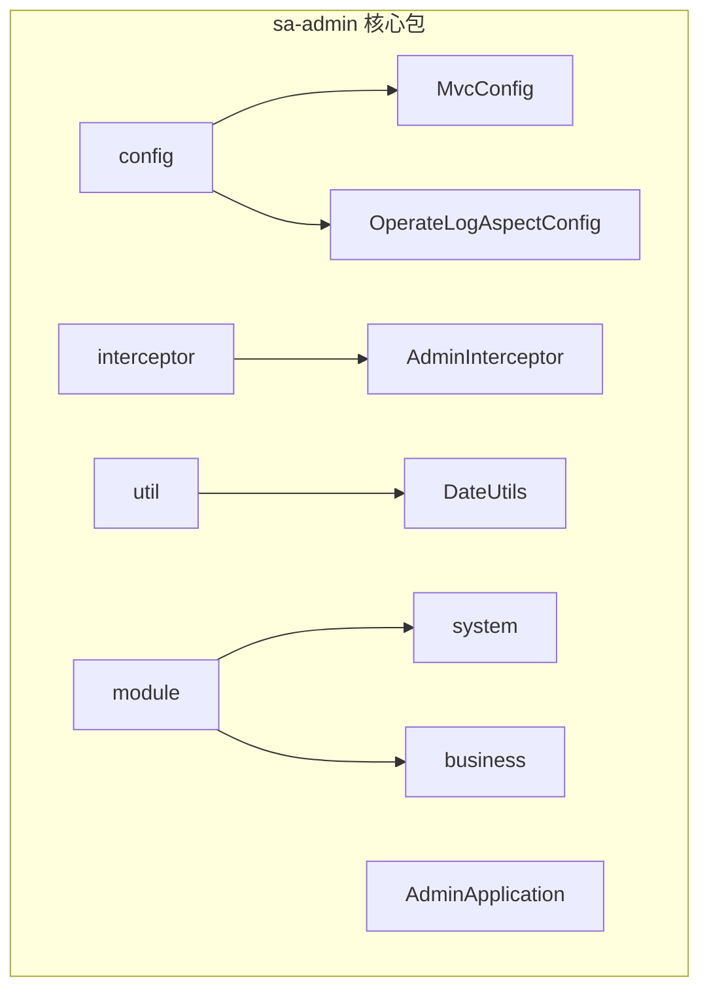
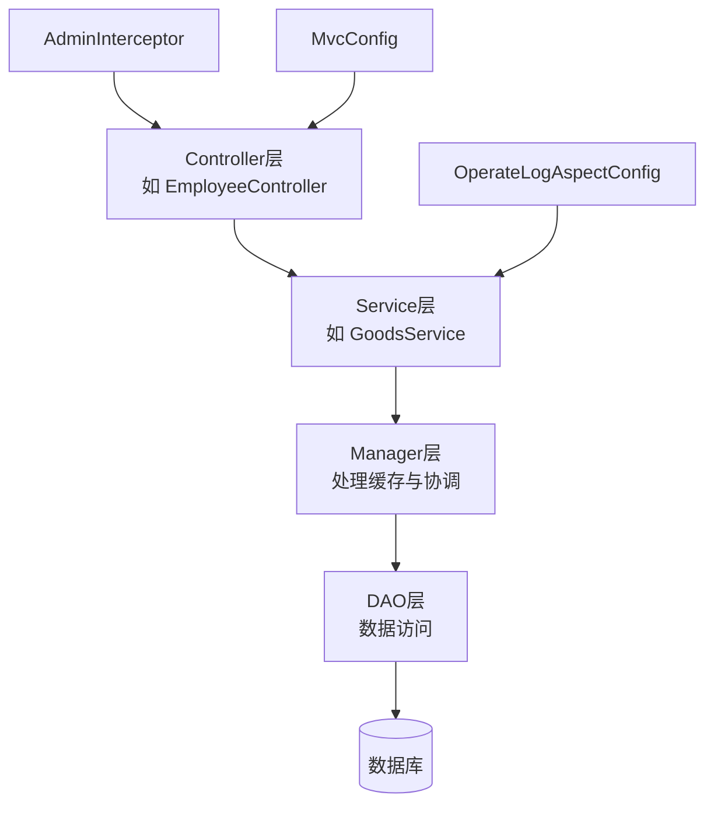
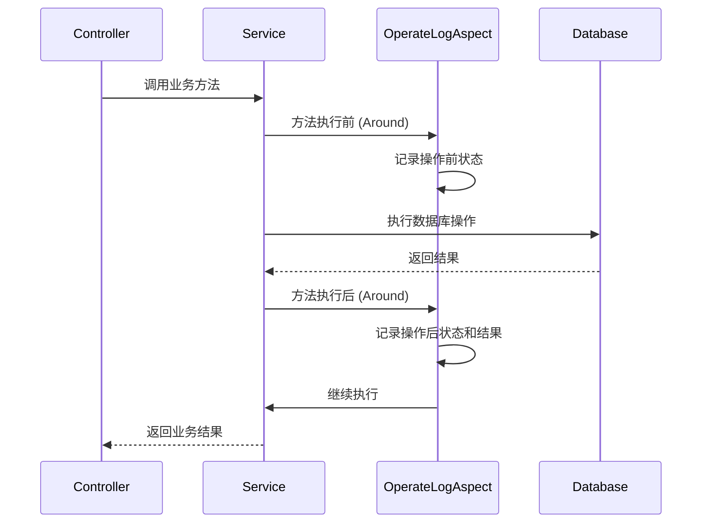
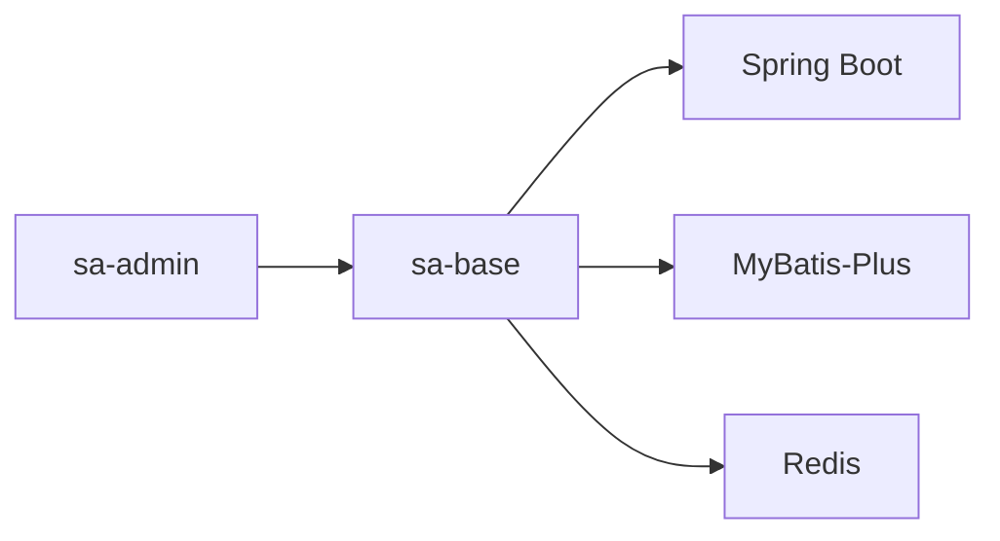

# 业务模块 (sa-admin)

<cite>
**本文档中引用的文件**  
- [AdminApplication.java](file://smart-admin-api-java17-springboot3/sa-admin/src/main/java/net/lab1024/sa/admin/AdminApplication.java)
- [MvcConfig.java](file://smart-admin-api-java17-springboot3/sa-admin/src/main/java/net/lab1024/sa/admin/config/MvcConfig.java)
- [OperateLogAspectConfig.java](file://smart-admin-api-java17-springboot3/sa-admin/src/main/java/net/lab1024/sa/admin/config/OperateLogAspectConfig.java)
- [AdminInterceptor.java](file://smart-admin-api-java17-springboot3/sa-admin/src/main/java/net/lab1024/sa/admin/interceptor/AdminInterceptor.java)
- [DateUtils.java](file://smart-admin-api-java17-springboot3/sa-admin/src/main/java/net/lab1024/sa/admin/util/DateUtils.java)
- [system](file://smart-admin-api-java17-springboot3/sa-admin/src/main/java/net/lab1024/sa/admin/module/system)
- [business](file://smart-admin-api-java17-springboot3/sa-admin/src/main/java/net/lab1024/sa/admin/module/business)
</cite>

## 目录

1. [简介](#简介)
2. [项目结构](#项目结构)
3. [核心组件](#核心组件)
4. [架构概述](#架构概述)
5. [详细组件分析](#详细组件分析)
6. [依赖分析](#依赖分析)
7. [性能考虑](#性能考虑)
8. [故障排除指南](#故障排除指南)
9. [结论](#结论)

## 简介

sa-admin 是一个基于 Spring Boot 3 和 Java 17 构建的企业级后台管理系统核心模块，专注于系统管理与业务功能的实现。该模块采用典型的四层架构设计，包含 Controller、Service、Manager 和 DAO 层，实现了清晰的职责分离。系统管理域涵盖用户、部门、角色、菜单等基础功能，而业务功能域则包括商品、分类、OA（办公自动化）等扩展功能。本文档旨在全面解析 sa-admin 模块的业务架构，为新业务模块的开发提供指导。

## 项目结构

sa-admin 模块的 Java 源码位于 `src/main/java/net/lab1024/sa/admin` 目录下，其核心结构由 `config`、`constant`、`interceptor`、`module` 和 `util` 等包组成。`module` 目录是业务逻辑的核心，分为 `system` 和 `business` 两大业务域。`config` 包负责系统配置，`interceptor` 包包含请求拦截器，`util` 包提供通用工具类。

**Diagram sources**
- [AdminApplication.java](file://smart-admin-api-java17-springboot3/sa-admin/src/main/java/net/lab1024/sa/admin/AdminApplication.java)
- [config](file://smart-admin-api-java17-springboot3/sa-admin/src/main/java/net/lab1024/sa/admin/config)
- [interceptor](file://smart-admin-api-java17-springboot3/sa-admin/src/main/java/net/lab1024/sa/admin/interceptor)
- [util](file://smart-admin-api-java17-springboot3/sa-admin/src/main/java/net/lab1024/sa/admin/util)
- [module](file://smart-admin-api-java17-springboot3/sa-admin/src/main/java/net/lab1024/sa/admin/module)

**Section sources**
- [AdminApplication.java](file://smart-admin-api-java17-springboot3/sa-admin/src/main/java/net/lab1024/sa/admin/AdminApplication.java)

## 核心组件

sa-admin 模块的核心在于其分层架构和业务域划分。`module` 目录下的 `system` 和 `business` 包分别承载了系统管理和业务功能。`system` 包通常包含用户(Employee)、部门(Department)、角色(Role)、菜单(Menu)等实体的控制器、服务和数据访问对象。`business` 包则根据具体业务需求，如商品(Goods)、分类(Category)、OA等，组织相应的业务逻辑。`config` 包中的配置类和 `interceptor` 包中的拦截器共同保障了系统的运行时行为。

**Section sources**
- [system](file://smart-admin-api-java17-springboot3/sa-admin/src/main/java/net/lab1024/sa/admin/module/system)
- [business](file://smart-admin-api-java17-springboot3/sa-admin/src/main/java/net/lab1024/sa/admin/module/business)

## 架构概述

sa-admin 模块遵循典型的四层架构模式，确保了代码的可维护性和可扩展性。

**Diagram sources**
- [AdminInterceptor.java](file://smart-admin-api-java17-springboot3/sa-admin/src/main/java/net/lab1024/sa/admin/interceptor/AdminInterceptor.java)
- [MvcConfig.java](file://smart-admin-api-java17-springboot3/sa-admin/src/main/java/net/lab1024/sa/admin/config/MvcConfig.java)
- [OperateLogAspectConfig.java](file://smart-admin-api-java17-springboot3/sa-admin/src/main/java/net/lab1024/sa/admin/config/OperateLogAspectConfig.java)

## 详细组件分析

### 四层架构实现

sa-admin 模块的四层架构实现了清晰的关注点分离。
- **Controller层**：位于 `module` 包下的各个子包中（如 `system/employee/controller`），负责接收 HTTP 请求，进行参数校验，并调用相应的 Service 层方法。它将请求和响应的数据模型进行转换。
- **Service层**：位于 `module` 包下的 `service` 子包中，是业务逻辑的核心实现。它处理复杂的业务规则、事务管理，并调用 Manager 层进行缓存操作或跨服务协调。
- **Manager层**：位于 `module` 包下的 `manager` 子包中，主要职责是处理缓存（如 Redis）的读写，以及协调多个 DAO 或 Service 之间的复杂业务流程，充当 Service 层与数据访问层之间的协调者。
- **DAO层**：位于 `module` 包下的 `dao` 子包中，使用 MyBatis-Plus 框架直接与数据库交互，执行 CRUD 操作。其对应的 XML 映射文件位于 `resources/mapper` 目录下。

**Section sources**
- [system](file://smart-admin-api-java17-springboot3/sa-admin/src/main/java/net/lab1024/sa/admin/module/system)
- [business](file://smart-admin-api-java17-springboot3/sa-admin/src/main/java/net/lab1024/sa/admin/module/business)

### 配置与拦截器

#### 业务相关配置
- **MvcConfig**：该配置类位于 `config` 包下，用于自定义 Spring MVC 的行为，例如注册拦截器、配置消息转换器、设置跨域策略等，是 Web 层行为的集中配置点。
- **OperateLogAspectConfig**：该配置类定义了操作日志切面（AOP），通过注解（如 `@OperateLog`）自动记录关键业务操作的日志，无需在业务代码中手动编写日志记录语句，实现了日志记录的非侵入性。

**Diagram sources**
- [OperateLogAspectConfig.java](file://smart-admin-api-java17-springboot3/sa-admin/src/main/java/net/lab1024/sa/admin/config/OperateLogAspectConfig.java)

#### AdminInterceptor 拦截器
`AdminInterceptor` 是一个关键的请求拦截器，位于 `interceptor` 包下。它在请求到达 Controller 之前执行，主要负责：
1.  **身份验证**：检查请求头中的 Token 是否有效。
2.  **权限校验**：根据当前用户的角色和权限，判断其是否有权访问目标 URL。
3.  **会话管理**：维护用户会话状态。
4.  **请求预处理**：可以在此进行一些通用的请求处理，如日志记录、性能监控等。
该拦截器是保障系统安全的第一道防线。

**Section sources**
- [AdminInterceptor.java](file://smart-admin-api-java17-springboot3/sa-admin/src/main/java/net/lab1024/sa/admin/interceptor/AdminInterceptor.java)
- [MvcConfig.java](file://smart-admin-api-java17-springboot3/sa-admin/src/main/java/net/lab1024/sa/admin/config/MvcConfig.java)

### 工具类与常量类

#### Util 工具类
`util` 包（如 `DateUtils`）提供了项目中通用的静态方法，避免代码重复。常见的工具类包括日期时间处理、字符串处理、加密解密、文件操作等。这些工具类是无状态的，通过静态方法提供服务。

#### Constant 常量类
`constant` 包用于集中管理项目中的常量，如 Redis 键名、系统配置项、状态码、枚举值等。将常量集中管理的好处是便于维护和修改，避免了在代码中出现“魔法值”，提高了代码的可读性和可维护性。

**Section sources**
- [DateUtils.java](file://smart-admin-api-java17-springboot3/sa-admin/src/main/java/net/lab1024/sa/admin/util/DateUtils.java)
- [constant](file://smart-admin-api-java17-springboot3/sa-admin/src/main/java/net/lab1024/sa/admin/constant)

## 依赖分析

sa-admin 模块依赖于 `sa-base` 模块提供的基础能力。`sa-base` 模块包含了全局异常处理器、MyBatis-Plus 配置、Redis 配置、通用工具类等，为 `sa-admin` 提供了坚实的基础。`sa-admin` 通过 Maven 依赖引入 `sa-base`，实现了基础功能与业务功能的解耦。

**Diagram sources**
- [pom.xml](file://smart-admin-api-java17-springboot3/sa-admin/pom.xml)

## 性能考虑

该架构通过分层设计和缓存机制（Manager 层）来优化性能。Service 层的事务管理确保了数据一致性，而 Manager 层对热点数据的缓存可以显著减少数据库访问压力。AOP 的使用避免了在业务代码中混杂日志等横切关注点，保持了核心业务逻辑的简洁和高效。

## 故障排除指南

当遇到问题时，应遵循以下步骤：
1.  **检查日志**：首先查看应用日志，特别是 `GlobalExceptionHandler` 捕获的异常和 `OperateLogAspect` 记录的操作日志。
2.  **验证拦截器**：如果请求无法到达 Controller，检查 `AdminInterceptor` 的逻辑，确认 Token 和权限是否正确。
3.  **审查配置**：确认 `MvcConfig` 中的配置是否正确，特别是拦截器的注册路径。
4.  **调试业务逻辑**：对于业务功能问题，从 Controller 层开始，逐层向下调试，检查 Service、Manager 和 DAO 层的数据流转。

**Section sources**
- [AdminInterceptor.java](file://smart-admin-api-java17-springboot3/sa-admin/src/main/java/net/lab1024/sa/admin/interceptor/AdminInterceptor.java)
- [OperateLogAspectConfig.java](file://smart-admin-api-java17-springboot3/sa-admin/src/main/java/net/lab1024/sa/admin/config/OperateLogAspectConfig.java)

## 结论

sa-admin 模块通过清晰的四层架构、合理的业务域划分以及强大的配置和拦截机制，构建了一个健壮、可扩展的后台管理系统。理解其 `Controller-Service-Manager-DAO` 的分层模式、`config` 和 `interceptor` 包的作用，是进行新功能开发和维护的关键。遵循此架构模式，可以确保新代码与现有系统风格一致，易于集成和维护。