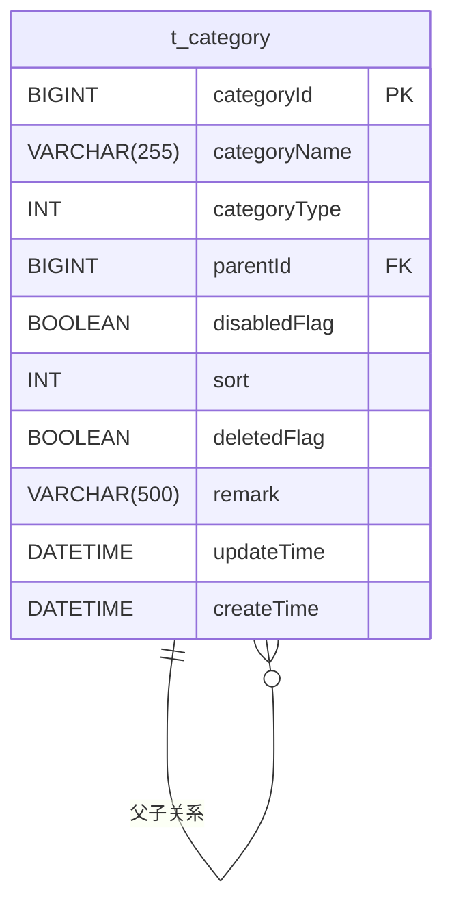
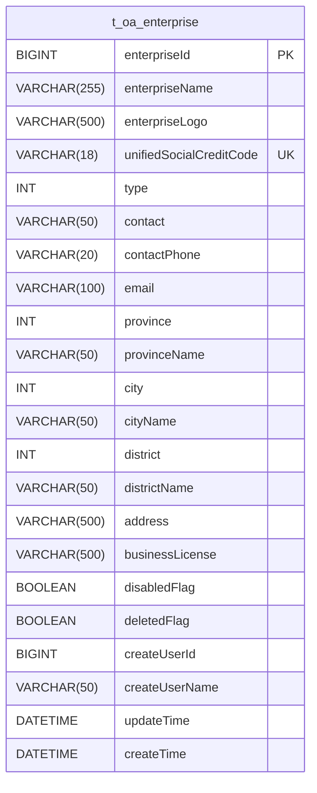
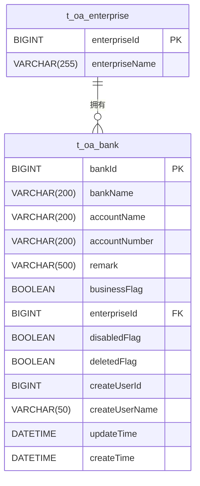
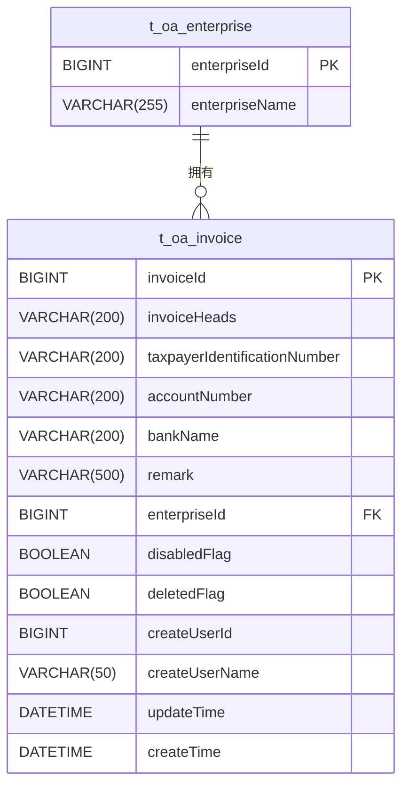
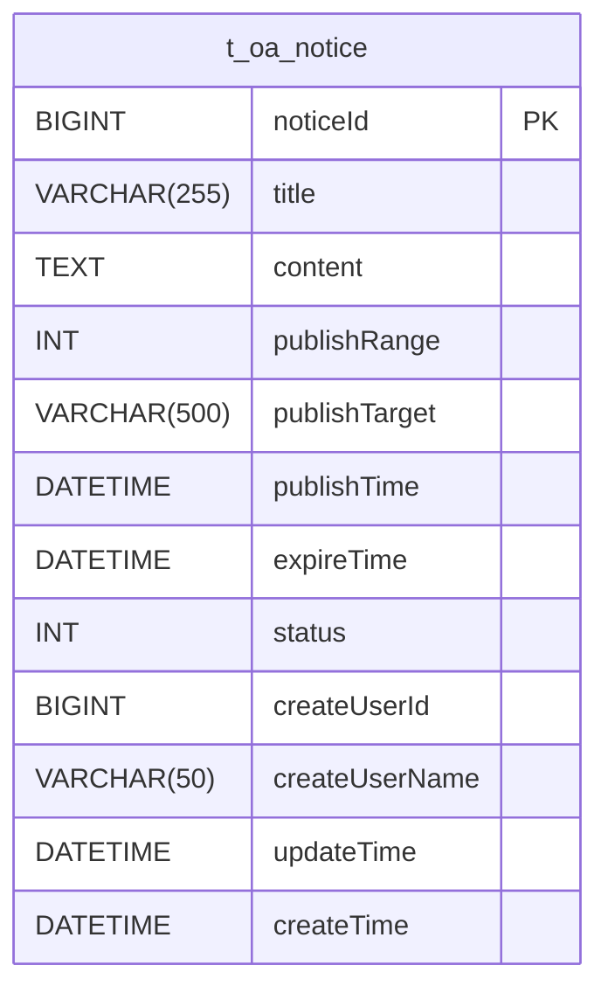
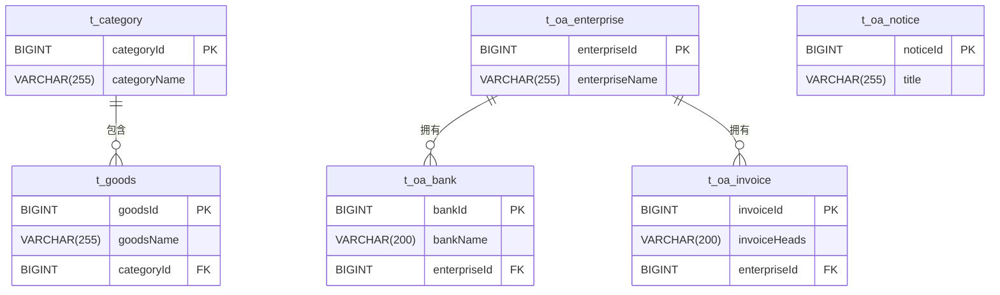

# 业务模块表结构

<cite>
**本文档引用的文件**
- [CategoryEntity.java](file://smart-admin-api-java17-springboot3\sa-admin\src\main\java\net\lab1024\sa\admin\module\business\category\domain\entity\CategoryEntity.java)
- [GoodsEntity.java](file://smart-admin-api-java17-springboot3\sa-admin\src\main\java\net\lab1024\sa\admin\module\business\goods\domain\entity\GoodsEntity.java)
- [EnterpriseEntity.java](file://smart-admin-api-java17-springboot3\sa-admin\src\main\java\net\lab1024\sa\admin\module\business\oa\enterprise\domain\entity\EnterpriseEntity.java)
- [BankEntity.java](file://smart-admin-api-java17-springboot3\sa-admin\src\main\java\net\lab1024\sa\admin\module\business\oa\bank\domain\BankEntity.java)
- [InvoiceEntity.java](file://smart-admin-api-java17-springboot3\sa-admin\src\main\java\net\lab1024\sa\admin\module\business\oa\invoice\domain\InvoiceEntity.java)
- [NoticeEntity.java](file://smart-admin-api-java17-springboot3\sa-admin\src\main\java\net\lab1024\sa\admin\module\business\oa\notice\domain\entity\NoticeEntity.java)
- [table-id-const.js](file://smart-admin-web-javascript\src\constants\support\table-id-const.js)
</cite>

## 目录
1. [引言](#引言)
2. [分类表结构](#分类表结构)
3. [商品表结构](#商品表结构)
4. [企业表结构](#企业表结构)
5. [银行表结构](#银行表结构)
6. [发票表结构](#发票表结构)
7. [通知表结构](#通知表结构)
8. [业务实体关系](#业务实体关系)
9. [数据访问模式](#数据访问模式)
10. [性能优化建议](#性能优化建议)
11. [数据一致性解决方案](#数据一致性解决方案)

## 引言
本文档详细介绍了智能管理系统中核心业务模块的表结构设计，重点涵盖分类、商品、企业、银行、发票和通知等业务实体。文档详细说明了各业务表的字段含义、数据类型、约束条件和索引设计，阐述了分类表的树形结构实现方式，商品与分类的关联关系，企业与其银行账户、发票信息的多对多关系，以及通知模块的发布范围控制和阅读记录追踪机制。同时，结合MyBatis-Plus框架展示了业务数据访问模式，提供了ER图说明主要业务实体间的关系，并给出了业务查询的性能优化建议和常见数据一致性问题的解决方案。

## 分类表结构
分类表（t_category）用于管理系统的分类信息，支持树形结构，适用于商品分类、文章分类等场景。表结构设计如下：

| 字段名 | 数据类型 | 约束条件 | 索引 | 说明 |
|--------|----------|----------|------|------|
| categoryId | BIGINT | 主键，自增 | 主键索引 | 分类ID |
| categoryName | VARCHAR(255) | 非空 | 普通索引 | 分类名称 |
| categoryType | INT | 非空 | 普通索引 | 分类类型，关联CategoryTypeEnum枚举 |
| parentId | BIGINT | 可为空 | 普通索引 | 父级分类ID，实现树形结构 |
| disabledFlag | BOOLEAN | 非空 | 普通索引 | 是否禁用标志 |
| sort | INT | 可为空 | 普通索引 | 排序字段，数值越小越靠前 |
| deletedFlag | BOOLEAN | 非空 | 普通索引 | 删除状态标志 |
| remark | VARCHAR(500) | 可为空 | 无 | 备注信息 |
| updateTime | DATETIME | 非空 | 无 | 更新时间 |
| createTime | DATETIME | 非空 | 无 | 创建时间 |

分类表通过parentId字段实现树形结构，每个分类可以有零个或多个子分类，形成多级分类体系。系统通过递归查询或缓存机制来构建完整的分类树。分类类型（categoryType）字段用于区分不同业务场景下的分类，如商品分类、文章分类等。



**图表来源**
- [CategoryEntity.java](file://smart-admin-api-java17-springboot3\sa-admin\src\main\java\net\lab1024\sa\admin\module\business\category\domain\entity\CategoryEntity.java)

**章节来源**
- [CategoryEntity.java](file://smart-admin-api-java17-springboot3\sa-admin\src\main\java\net\lab1024\sa\admin\module\business\category\domain\entity\CategoryEntity.java)

## 商品表结构
商品表（t_goods）用于存储商品的基本信息，与分类表建立关联关系。表结构设计如下：

| 字段名 | 数据类型 | 约束条件 | 索引 | 说明 |
|--------|----------|----------|------|------|
| goodsId | BIGINT | 主键，自增 | 主键索引 | 商品ID |
| goodsStatus | INT | 非空 | 普通索引 | 商品状态：1-预约中，2-售卖中，3-售罄 |
| categoryId | BIGINT | 非空 | 普通索引 | 商品分类ID，外键关联分类表 |
| goodsName | VARCHAR(255) | 非空 | 普通索引 | 商品名称 |
| place | VARCHAR(255) | 可为空 | 无 | 产地 |
| price | DECIMAL(10,2) | 非空 | 无 | 商品价格 |
| shelvesFlag | BOOLEAN | 非空 | 普通索引 | 上架状态 |
| deletedFlag | BOOLEAN | 非空 | 普通索引 | 删除状态标志 |
| remark | VARCHAR(500) | 可为空 | 无 | 备注信息 |
| updateTime | DATETIME | 非空 | 无 | 更新时间 |
| createTime | DATETIME | 非空 | 无 | 创建时间 |

商品表通过categoryId字段与分类表建立关联关系，实现商品的分类管理。商品状态（goodsStatus）字段用于控制商品的生命周期，支持预约、售卖和售罄三种状态。上架状态（shelvesFlag）字段用于控制商品是否在前台展示。

```mermaid
erDiagram
t_goods {
BIGINT goodsId PK
INT goodsStatus
BIGINT categoryId FK
VARCHAR(255) goodsName
VARCHAR(255) place
DECIMAL(10,2) price
BOOLEAN shelvesFlag
BOOLEAN deletedFlag
VARCHAR(500) remark
DATETIME updateTime
DATETIME createTime
}
t_category {
BIGINT categoryId PK
VARCHAR(255) categoryName
}
t_category ||--o{ t_goods : "包含"
```

**图表来源**
- [GoodsEntity.java](file://smart-admin-api-java17-springboot3\sa-admin\src\main\java\net\lab1024\sa\admin\module\business\goods\domain\entity\GoodsEntity.java)

**章节来源**
- [GoodsEntity.java](file://smart-admin-api-java17-springboot3\sa-admin\src\main\java\net\lab1024\sa\admin\module\business\goods\domain\entity\GoodsEntity.java)

## 企业表结构
企业表（t_oa_enterprise）用于存储企业基本信息，作为银行账户和发票信息的关联主体。表结构设计如下：

| 字段名 | 数据类型 | 约束条件 | 索引 | 说明 |
|--------|----------|----------|------|------|
| enterpriseId | BIGINT | 主键，自增 | 主键索引 | 企业ID |
| enterpriseName | VARCHAR(255) | 非空 | 普通索引 | 企业名称 |
| enterpriseLogo | VARCHAR(500) | 可为空 | 无 | 企业logo |
| unifiedSocialCreditCode | VARCHAR(18) | 非空 | 唯一索引 | 统一社会信用代码 |
| type | INT | 非空 | 普通索引 | 企业类型，关联EnterpriseTypeEnum枚举 |
| contact | VARCHAR(50) | 可为空 | 无 | 联系人 |
| contactPhone | VARCHAR(20) | 可为空 | 无 | 联系人电话 |
| email | VARCHAR(100) | 可为空 | 无 | 邮箱 |
| province | INT | 可为空 | 无 | 省份ID |
| provinceName | VARCHAR(50) | 可为空 | 无 | 省份名称 |
| city | INT | 可为空 | 无 | 城市ID |
| cityName | VARCHAR(50) | 可为空 | 无 | 城市名称 |
| district | INT | 可为空 | 无 | 区县ID |
| districtName | VARCHAR(50) | 可为空 | 无 | 区县名称 |
| address | VARCHAR(500) | 可为空 | 无 | 详细地址 |
| businessLicense | VARCHAR(500) | 可为空 | 无 | 营业执照 |
| disabledFlag | BOOLEAN | 非空 | 普通索引 | 禁用状态 |
| deletedFlag | BOOLEAN | 非空 | 普通索引 | 删除状态标志 |
| createUserId | BIGINT | 非空 | 无 | 创建人ID |
| createUserName | VARCHAR(50) | 非空 | 无 | 创建人名称 |
| updateTime | DATETIME | 非空 | 无 | 更新时间 |
| createTime | DATETIME | 非空 | 无 | 创建时间 |

企业表存储了企业的基本信息，包括名称、logo、统一社会信用代码、联系人信息、地址信息等。统一社会信用代码字段设置了唯一索引，确保企业信息的唯一性。企业表作为银行账户和发票信息的关联主体，通过外键关系与银行表和发票表建立多对多关系。



**图表来源**
- [EnterpriseEntity.java](file://smart-admin-api-java17-springboot3\sa-admin\src\main\java\net\lab1024\sa\admin\module\business\oa\enterprise\domain\entity\EnterpriseEntity.java)

**章节来源**
- [EnterpriseEntity.java](file://smart-admin-api-java17-springboot3\sa-admin\src\main\java\net\lab1024\sa\admin\module\business\oa\enterprise\domain\entity\EnterpriseEntity.java)

## 银行表结构
银行表（t_oa_bank）用于存储企业的银行账户信息，与企业表建立多对多关系。表结构设计如下：

| 字段名 | 数据类型 | 约束条件 | 索引 | 说明 |
|--------|----------|----------|------|------|
| bankId | BIGINT | 主键，自增 | 主键索引 | 银行信息ID |
| bankName | VARCHAR(200) | 非空 | 无 | 开户银行 |
| accountName | VARCHAR(200) | 非空 | 无 | 账户名称 |
| accountNumber | VARCHAR(200) | 非空 | 组合索引 | 账号 |
| remark | VARCHAR(500) | 可为空 | 无 | 备注 |
| businessFlag | BOOLEAN | 非空 | 无 | 是否对公 |
| enterpriseId | BIGINT | 非空 | 组合索引 | 企业ID，外键关联企业表 |
| disabledFlag | BOOLEAN | 非空 | 普通索引 | 禁用状态 |
| deletedFlag | BOOLEAN | 非空 | 普通索引 | 删除状态标志 |
| createUserId | BIGINT | 非空 | 无 | 创建人ID |
| createUserName | VARCHAR(50) | 非空 | 无 | 创建人名称 |
| updateTime | DATETIME | 非空 | 无 | 更新时间 |
| createTime | DATETIME | 非空 | 无 | 创建时间 |

银行表通过enterpriseId字段与企业表建立多对多关系，一个企业可以有多个银行账户，一个银行账户属于一个企业。账号（accountNumber）字段与企业ID（enterpriseId）字段组合建立唯一索引，确保同一企业的银行账号不重复。是否对公（businessFlag）字段用于区分对公账户和个人账户。



**图表来源**
- [BankEntity.java](file://smart-admin-api-java17-springboot3\sa-admin\src\main\java\net\lab1024\sa\admin\module\business\oa\bank\domain\BankEntity.java)

**章节来源**
- [BankEntity.java](file://smart-admin-api-java17-springboot3\sa-admin\src\main\java\net\lab1024\sa\admin\module\business\oa\bank\domain\BankEntity.java)

## 发票表结构
发票表（t_oa_invoice）用于存储企业的发票信息，与企业表建立多对多关系。表结构设计如下：

| 字段名 | 数据类型 | 约束条件 | 索引 | 说明 |
|--------|----------|----------|------|------|
| invoiceId | BIGINT | 主键，自增 | 主键索引 | 发票信息ID |
| invoiceHeads | VARCHAR(200) | 非空 | 无 | 开票抬头 |
| taxpayerIdentificationNumber | VARCHAR(200) | 非空 | 无 | 纳税人识别号 |
| accountNumber | VARCHAR(200) | 非空 | 组合索引 | 银行账户 |
| bankName | VARCHAR(200) | 非空 | 无 | 开户行 |
| remark | VARCHAR(500) | 可为空 | 无 | 备注 |
| enterpriseId | BIGINT | 非空 | 组合索引 | 企业ID，外键关联企业表 |
| disabledFlag | BOOLEAN | 非空 | 普通索引 | 禁用状态 |
| deletedFlag | BOOLEAN | 非空 | 普通索引 | 删除状态标志 |
| createUserId | BIGINT | 非空 | 无 | 创建人ID |
| createUserName | VARCHAR(50) | 非空 | 无 | 创建人名称 |
| updateTime | DATETIME | 非空 | 无 | 更新时间 |
| createTime | DATETIME | 非空 | 无 | 创建时间 |

发票表通过enterpriseId字段与企业表建立多对多关系，一个企业可以有多个发票信息，一个发票信息属于一个企业。银行账户（accountNumber）字段与企业ID（enterpriseId）字段组合建立唯一索引，确保同一企业的发票银行账户不重复。发票信息与银行信息共同构成企业的财务信息体系。



**图表来源**
- [InvoiceEntity.java](file://smart-admin-api-java17-springboot3\sa-admin\src\main\java\net\lab1024\sa\admin\module\business\oa\invoice\domain\InvoiceEntity.java)

**章节来源**
- [InvoiceEntity.java](file://smart-admin-api-java17-springboot3\sa-admin\src\main\java\net\lab1024\sa\admin\module\business\oa\invoice\domain\InvoiceEntity.java)

## 通知表结构
通知表（t_oa_notice）用于存储系统通知信息，支持发布范围控制和阅读记录追踪。表结构设计如下：

| 字段名 | 数据类型 | 约束条件 | 索引 | 说明 |
|--------|----------|----------|------|------|
| noticeId | BIGINT | 主键，自增 | 主键索引 | 通知ID |
| title | VARCHAR(255) | 非空 | 普通索引 | 通知标题 |
| content | TEXT | 非空 | 无 | 通知内容 |
| publishRange | INT | 非空 | 普通索引 | 发布范围：1-全员，2-指定部门，3-指定人员 |
| publishTarget | VARCHAR(500) | 可为空 | 无 | 发布目标，JSON格式存储部门或人员ID |
| publishTime | DATETIME | 非空 | 普通索引 | 发布时间 |
| expireTime | DATETIME | 可为空 | 普通索引 | 过期时间 |
| status | INT | 非空 | 普通索引 | 状态：1-草稿，2-已发布，3-已过期 |
| createUserId | BIGINT | 非空 | 无 | 创建人ID |
| createUserName | VARCHAR(50) | 非空 | 无 | 创建人名称 |
| updateTime | DATETIME | 非空 | 无 | 更新时间 |
| createTime | DATETIME | 非空 | 无 | 创建时间 |

通知表通过publishRange字段实现发布范围控制，支持全员、指定部门和指定人员三种发布范围。发布目标（publishTarget）字段以JSON格式存储具体的部门或人员ID，实现灵活的发布控制。系统通过阅读记录表追踪通知的阅读情况，确保重要信息的传达效果。



**图表来源**
- [NoticeEntity.java](file://smart-admin-api-java17-springboot3\sa-admin\src\main\java\net\lab1024\sa\admin\module\business\oa\notice\domain\entity\NoticeEntity.java)

**章节来源**
- [NoticeEntity.java](file://smart-admin-api-java17-springboot3\sa-admin\src\main\java\net\lab1024\sa\admin\module\business\oa\notice\domain\entity\NoticeEntity.java)

## 业务实体关系
主要业务实体间的关系如下图所示，形成了企业-银行-发票的业务链条，以及分类-商品的业务链条。



**图表来源**
- [CategoryEntity.java](file://smart-admin-api-java17-springboot3\sa-admin\src\main\java\net\lab1024\sa\admin\module\business\category\domain\entity\CategoryEntity.java)
- [GoodsEntity.java](file://smart-admin-api-java17-springboot3\sa-admin\src\main\java\net\lab1024\sa\admin\module\business\goods\domain\entity\GoodsEntity.java)
- [EnterpriseEntity.java](file://smart-admin-api-java17-springboot3\sa-admin\src\main\java\net\lab1024\sa\admin\module\business\oa\enterprise\domain\entity\EnterpriseEntity.java)
- [BankEntity.java](file://smart-admin-api-java17-springboot3\sa-admin\src\main\java\net\lab1024\sa\admin\module\business\oa\bank\domain\BankEntity.java)
- [InvoiceEntity.java](file://smart-admin-api-java17-springboot3\sa-admin\src\main\java\net\lab1024\sa\admin\module\business\oa\invoice\domain\InvoiceEntity.java)
- [NoticeEntity.java](file://smart-admin-api-java17-springboot3\sa-admin\src\main\java\net\lab1024\sa\admin\module\business\oa\notice\domain\entity\NoticeEntity.java)

**章节来源**
- [CategoryEntity.java](file://smart-admin-api-java17-springboot3\sa-admin\src\main\java\net\lab1024\sa\admin\module\business\category\domain\entity\CategoryEntity.java)
- [GoodsEntity.java](file://smart-admin-api-java17-springboot3\sa-admin\src\main\java\net\lab1024\sa\admin\module\business\goods\domain\entity\GoodsEntity.java)
- [EnterpriseEntity.java](file://smart-admin-api-java17-springboot3\sa-admin\src\main\java\net\lab1024\sa\admin\module\business\oa\enterprise\domain\entity\EnterpriseEntity.java)
- [BankEntity.java](file://smart-admin-api-java17-springboot3\sa-admin\src\main\java\net\lab1024\sa\admin\module\business\oa\bank\domain\BankEntity.java)
- [InvoiceEntity.java](file://smart-admin-api-java17-springboot3\sa-admin\src\main\java\net\lab1024\sa\admin\module\business\oa\invoice\domain\InvoiceEntity.java)
- [NoticeEntity.java](file://smart-admin-api-java17-springboot3\sa-admin\src\main\java\net\lab1024\sa\admin\module\business\oa\notice\domain\entity\NoticeEntity.java)

## 数据访问模式
系统采用MyBatis-Plus框架实现数据访问，通过DAO层接口与数据库进行交互。以下是主要业务实体的DAO层实现模式：

```mermaid
classDiagram
class BaseMapper~T~ {
<<interface>>
+int insert(T entity)
+int deleteById(Serializable id)
+int updateById(T entity)
+T selectById(Serializable id)
+T[] selectList(Wrapper~T~ queryWrapper)
+IPage~T~ selectPage(IPage~T~ page, Wrapper~T~ queryWrapper)
}
class CategoryDao {
<<interface>>
+CategoryVO[] queryPage(Page page, @Param("queryForm") CategoryQueryForm queryForm)
+CategoryEntity queryById(Long categoryId)
}
class GoodsDao {
<<interface>>
+GoodsVO[] queryPage(Page page, @Param("queryForm") GoodsQueryForm queryForm)
+GoodsEntity queryById(Long goodsId)
}
class EnterpriseDao {
<<interface>>
+EnterpriseVO[] queryPage(Page page, @Param("queryForm") EnterpriseQueryForm queryForm)
+EnterpriseEntity queryById(Long enterpriseId)
}
class BankDao {
<<interface>>
+BankVO[] queryPage(Page page, @Param("queryForm") BankQueryForm queryForm)
+BankEntity queryByAccountNumber(Long enterpriseId, String accountNumber, Long excludeBankId, Boolean deletedFlag)
+void deleteBank(Long bankId, Boolean deletedFlag)
}
class InvoiceDao {
<<interface>>
+InvoiceVO[] queryPage(Page page, @Param("queryForm") InvoiceQueryForm queryForm)
+InvoiceEntity queryByAccountNumber(Long enterpriseId, String accountNumber, Long excludeInvoiceId, Boolean deletedFlag)
+void deleteInvoice(Long invoiceId, Boolean deletedFlag)
}
class NoticeDao {
<<interface>>
+NoticeVO[] queryPage(Page page, @Param("queryForm") NoticeQueryForm queryForm)
+NoticeEntity queryById(Long noticeId)
}
BaseMapper~CategoryEntity~ <|-- CategoryDao
BaseMapper~GoodsEntity~ <|-- GoodsDao
BaseMapper~EnterpriseEntity~ <|-- EnterpriseDao
BaseMapper~BankEntity~ <|-- BankDao
BaseMapper~InvoiceEntity~ <|-- InvoiceDao
BaseMapper~NoticeEntity~ <|-- NoticeDao
```



**图表来源**
- [CategoryEntity.java](file://smart-admin-api-java17-springboot3\sa-admin\src\main\java\net\lab1024\sa\admin\module\business\category\domain\entity\CategoryEntity.java)
- [GoodsEntity.java](file://smart-admin-api-java17-springboot3\sa-admin\src\main\java\net\lab1024\sa\admin\module\business\goods\domain\entity\GoodsEntity.java)
- [EnterpriseEntity.java](file://smart-admin-api-java17-springboot3\sa-admin\src\main\java\net\lab1024\sa\admin\module\business\oa\enterprise\domain\entity\EnterpriseEntity.java)
- [BankEntity.java](file://smart-admin-api-java17-springboot3\sa-admin\src\main\java\net\lab1024\sa\admin\module\business\oa\bank\domain\BankEntity.java)
- [InvoiceEntity.java](file://smart-admin-api-java17-springboot3\sa-admin\src\main\java\net\lab1024\sa\admin\module\business\oa\invoice\domain\InvoiceEntity.java)
- [NoticeEntity.java](file://smart-admin-api-java17-springboot3\sa-admin\src\main\java\net\lab1024\sa\admin\module\business\oa\notice\domain\entity\NoticeEntity.java)

**章节来源**
- [CategoryEntity.java](file://smart-admin-api-java17-springboot3\sa-admin\src\main\java\net\lab1024\sa\admin\module\business\category\domain\entity\CategoryEntity.java)
- [GoodsEntity.java](file://smart-admin-api-java17-springboot3\sa-admin\src\main\java\net\lab1024\sa\admin\module\business\goods\domain\entity\GoodsEntity.java)
- [EnterpriseEntity.java](file://smart-admin-api-java17-springboot3\sa-admin\src\main\java\net\lab1024\sa\admin\module\business\oa\enterprise\domain\entity\EnterpriseEntity.java)
- [BankEntity.java](file://smart-admin-api-java17-springboot3\sa-admin\src\main\java\net\lab1024\sa\admin\module\business\oa\bank\domain\BankEntity.java)
- [InvoiceEntity.java](file://smart-admin-api-java17-springboot3\sa-admin\src\main\java\net\lab1024\sa\admin\module\business\oa\invoice\domain\InvoiceEntity.java)
- [NoticeEntity.java](file://smart-admin-api-java17-springboot3\sa-admin\src\main\java\net\lab1024\sa\admin\module\business\oa\notice\domain\entity\NoticeEntity.java)

## 性能优化建议
针对业务查询的性能优化，建议采取以下措施：

1. **合理使用索引**：在经常用于查询条件的字段上创建索引，如分类表的parentId、商品表的categoryId、企业表的unifiedSocialCreditCode等。避免在低选择性的字段上创建索引。

2. **分页查询优化**：对于大数据量的分页查询，使用MyBatis-Plus的分页插件，避免一次性加载所有数据。对于深度分页，考虑使用游标分页或基于时间戳的分页。

3. **查询字段优化**：避免使用SELECT *，只查询需要的字段，减少网络传输和内存占用。

4. **缓存策略**：对于读多写少的数据，如分类信息、企业基本信息等，使用Redis缓存，减少数据库查询压力。

5. **批量操作**：对于批量插入、更新、删除操作，使用MyBatis-Plus的批量操作方法，减少数据库交互次数。

6. **连接查询优化**：避免复杂的多表连接查询，尽量将复杂查询拆分为多个简单查询，在应用层进行数据组装。

7. **慢查询监控**：启用数据库慢查询日志，定期分析慢查询，优化SQL语句和索引。

## 数据一致性解决方案
针对常见的数据一致性问题，建议采取以下解决方案：

1. **事务管理**：对于涉及多个表的更新操作，使用Spring的@Transactional注解，确保操作的原子性。例如，删除企业时，需要同时删除其关联的银行账户和发票信息。

2. **唯一性约束**：在数据库层面设置唯一性约束，如企业统一社会信用代码的唯一性、同一企业的银行账号唯一性等，防止数据重复。

3. **逻辑删除**：采用逻辑删除而非物理删除，通过deletedFlag字段标记删除状态，保留数据历史，便于数据恢复和审计。

4. **数据校验**：在服务层进行数据校验，确保数据的完整性和正确性。例如，在创建银行账户时，校验企业是否存在，账号是否重复。

5. **并发控制**：对于高并发场景，使用数据库的乐观锁或悲观锁机制，防止数据冲突。例如，在更新商品库存时，使用版本号控制。

6. **数据同步**：对于跨服务的数据一致性，使用消息队列实现最终一致性。例如，企业信息变更后，通过消息通知相关服务更新缓存。

7. **数据审计**：使用数据追踪功能，记录关键数据的变更历史，便于问题排查和责任追溯。