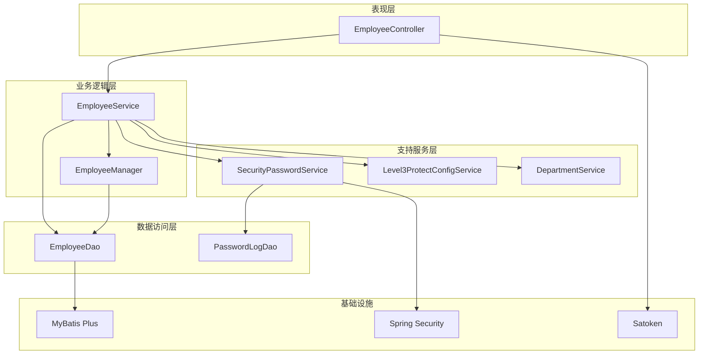
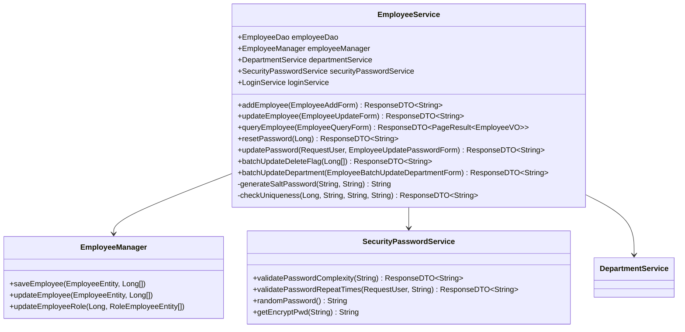
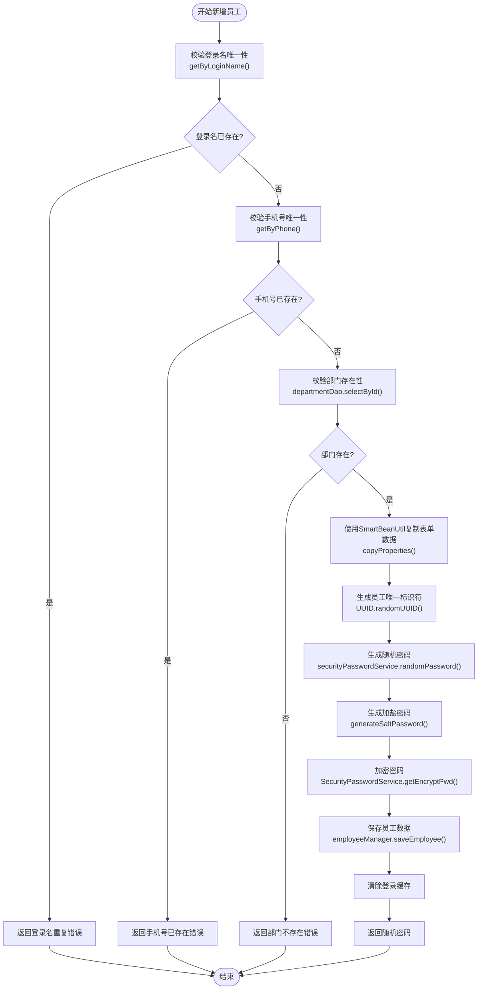
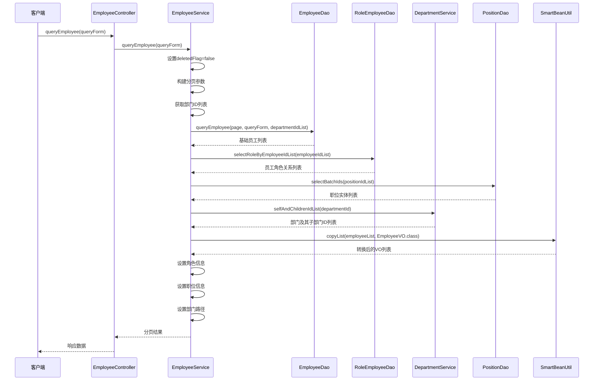
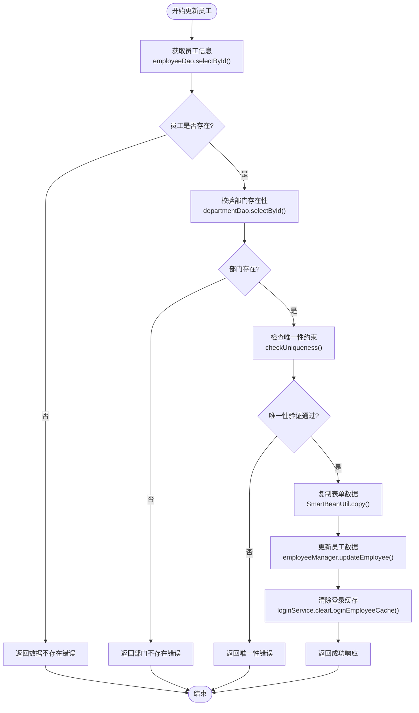
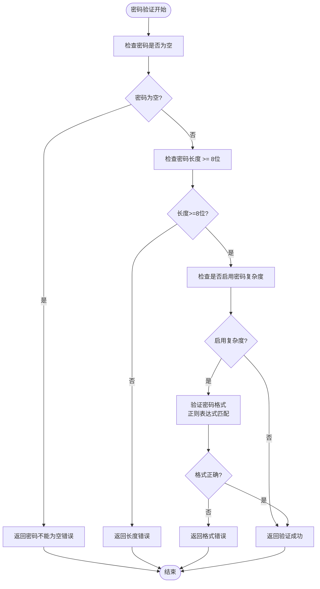
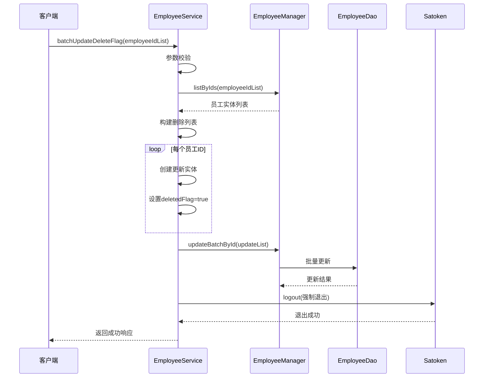
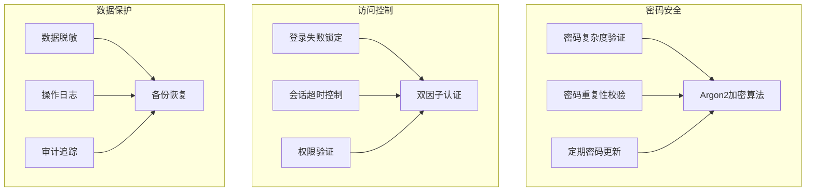

# 业务逻辑实现

<cite>
**本文档中引用的文件**
- [EmployeeService.java](file://smart-admin-api-java17-springboot3/sa-admin/src/main/java/net/lab1024.sa.admin/module/system/employee/service/EmployeeService.java)
- [EmployeeController.java](file://smart-admin-api-java17-springboot3/sa-admin/src/main/java/net/lab1024.sa.admin/module/system/employee/controller/EmployeeController.java)
- [EmployeeManager.java](file://smart-admin-api-java17-springboot3/sa-admin/src/main/java/net/lab1024.sa.admin/module/system/employee/manager/EmployeeManager.java)
- [EmployeeDao.java](file://smart-admin-api-java17-springboot3/sa-admin/src/main/java/net/lab1024.sa.admin/module/system/employee/dao/EmployeeDao.java)
- [SecurityPasswordService.java](file://smart-admin-api-java17-springboot3/sa-base/src/main/java/net/lab1024.sa.base/module/support/securityprotect/service/SecurityPasswordService.java)
- [Level3ProtectConfigService.java](file://smart-admin-api-java17-springboot3/sa-base/src/main/java/net/lab1024.sa.base/module/support/securityprotect/service/Level3ProtectConfigService.java)
- [SmartBeanUtil.java](file://smart-admin-api-java17-springboot3/sa-base/src/main/java/net/lab1024.sa.base/common/util/SmartBeanUtil.java)
- [EmployeeMapper.xml](file://smart-admin-api-java17-springboot3/sa-admin/src/main/resources/mapper/system/employee/EmployeeMapper.xml)
</cite>

## 目录
1. [系统架构概述](#系统架构概述)
2. [核心业务组件分析](#核心业务组件分析)
3. [员工新增业务流程详解](#员工新增业务流程详解)
4. [员工查询业务逻辑分析](#员工查询业务逻辑分析)
5. [员工更新业务逻辑详解](#员工更新业务逻辑详解)
6. [密码管理业务规则](#密码管理业务规则)
7. [批量操作实现模式](#批量操作实现模式)
8. [安全防护机制](#安全防护机制)
9. [性能优化策略](#性能优化策略)
10. [总结](#总结)

## 系统架构概述

智能视频系统采用分层架构设计，EmployeeService作为业务逻辑层的核心组件，负责处理员工管理相关的完整业务流程。该服务集成了数据访问、业务规则验证、安全控制和事务管理等功能。



**图表来源**
- [EmployeeController.java](file://smart-admin-api-java17-springboot3/sa-admin/src/main/java/net/lab1024.sa.admin/module/system/employee/controller/EmployeeController.java#L30-L130)
- [EmployeeService.java](file://smart-admin-api-java17-springboot3/sa-admin/src/main/java/net/lab1024.sa.admin/module/system/employee/service/EmployeeService.java#L47-L448)

## 核心业务组件分析

### EmployeeService 核心职责

EmployeeService作为员工管理的核心业务服务，承担以下关键职责：

1. **员工生命周期管理**：从员工创建到删除的完整生命周期
2. **业务规则验证**：确保数据完整性、唯一性和合规性
3. **安全控制**：实施三级等保要求的安全策略
4. **事务协调**：管理跨多个数据实体的事务一致性
5. **权限控制**：集成权限验证机制



**图表来源**
- [EmployeeService.java](file://smart-admin-api-java17-springboot3/sa-admin/src/main/java/net/lab1024.sa.admin/module/system/employee/service/EmployeeService.java#L47-L448)
- [EmployeeManager.java](file://smart-admin-api-java17-springboot3/sa-admin/src/main/java/net/lab1024.sa.admin/module/system/employee/manager/EmployeeManager.java#L27-L87)

**章节来源**
- [EmployeeService.java](file://smart-admin-api-java17-springboot3/sa-admin/src/main/java/net/lab1024.sa.admin/module/system/employee/service/EmployeeService.java#L47-L448)
- [EmployeeManager.java](file://smart-admin-api-java17-springboot3/sa-admin/src/main/java/net/lab1024.sa.admin/module/system/employee/manager/EmployeeManager.java#L27-L87)

## 员工新增业务流程详解

### addEmployee 方法核心流程

addEmployee方法实现了员工新增的完整业务流程，体现了严格的业务规则验证和安全控制。



**图表来源**
- [EmployeeService.java](file://smart-admin-api-java17-springboot3/sa-admin/src/main/java/net/lab1024.sa.admin/module/system/employee/service/EmployeeService.java#L122-L154)

### 关键业务规则实现

#### 1. 登录名唯一性校验

```java
// 校验登录名是否重复
EmployeeEntity employeeEntity = employeeDao.getByLoginName(employeeAddForm.getLoginName(), null);
if (null != employeeEntity) {
    return ResponseDTO.userErrorParam("登录名重复");
}
```

#### 2. 手机号唯一性校验

```java
// 校验电话是否存在
employeeEntity = employeeDao.getByPhone(employeeAddForm.getPhone(), null);
if (null != employeeEntity) {
    return ResponseDTO.userErrorParam("手机号已存在");
}
```

#### 3. 部门存在性验证

```java
// 部门是否存在
Long departmentId = employeeAddForm.getDepartmentId();
DepartmentEntity department = departmentDao.selectById(departmentId);
if (department == null) {
    return ResponseDTO.userErrorParam("部门不存在");
}
```

#### 4. 随机密码生成与加盐处理

```java
// 设置密码 随机密码
String randomPassword = securityPasswordService.randomPassword();
String generateSaltPassword = this.generateSaltPassword(randomPassword, employeeUid);
entity.setLoginPwd(SecurityPasswordService.getEncryptPwd(generateSaltPassword));
```

**章节来源**
- [EmployeeService.java](file://smart-admin-api-java17-springboot3/sa-admin/src/main/java/net/lab1024.sa.admin/module/system/employee/service/EmployeeService.java#L122-L154)

## 员工查询业务逻辑分析

### queryEmployee 方法多表查询实现

queryEmployee方法展示了复杂的多表联查和数据转换逻辑，体现了SmartBeanUtil在对象转换中的重要作用。



**图表来源**
- [EmployeeService.java](file://smart-admin-api-java17-springboot3/sa-admin/src/main/java/net/lab1024.sa.admin/module/system/employee/service/EmployeeService.java#L83-L116)

### 多表查询SQL实现

EmployeeMapper.xml中的queryEmployee方法实现了复杂的多表联查：

```xml
<select id="queryEmployee" resultType="net.lab1024.sa.admin.module.system.employee.domain.vo.EmployeeVO">
    SELECT
    t_employee.*,
    t_department.department_name
    FROM t_employee
    LEFT JOIN t_department ON t_department.department_id = t_employee.department_id
    <where>
        <if test="queryForm.keyword != null and queryForm.keyword != ''">
            AND (
            INSTR(t_employee.actual_name,#{queryForm.keyword})
            OR INSTR(t_employee.phone,#{queryForm.keyword})
            OR INSTR(t_employee.login_name,#{queryForm.keyword})
            )
        </if>
        <if test="departmentIdList != null and departmentIdList.size > 0">
            and
            t_employee.department_id
            in
            <foreach collection="departmentIdList" open="(" close=")" separator="," item="item">
                #{item}
            </foreach>
        </if>
        <if test="queryForm.disabledFlag != null">
            AND t_employee.disabled_flag = #{queryForm.disabledFlag}
        </if>
        <if test="queryForm.deletedFlag != null">
            AND t_employee.deleted_flag = #{queryForm.deletedFlag}
        </if>
    </where>
    ORDER BY create_time DESC
</select>
```

### SmartBeanUtil 对象转换

SmartBeanUtil提供了强大的对象转换能力，简化了实体类与VO类之间的转换过程：

```java
// 使用SmartBeanUtil进行对象转换
EmployeeEntity entity = SmartBeanUtil.copy(employeeAddForm, EmployeeEntity.class);
List<EmployeeVO> employeeList = SmartBeanUtil.copyList(employeeList, EmployeeVO.class);
```

**章节来源**
- [EmployeeService.java](file://smart-admin-api-java17-springboot3/sa-admin/src/main/java/net/lab1024.sa.admin/module/system/employee/service/EmployeeService.java#L83-L116)
- [EmployeeMapper.xml](file://smart-admin-api-java17-springboot3/sa-admin/src/main/resources/mapper/system/employee/EmployeeMapper.xml#L1-L30)

## 员工更新业务逻辑详解

### updateEmployee 方法并发控制

updateEmployee方法采用了`synchronized`关键字实现同步锁，防止并发更新冲突。



**图表来源**
- [EmployeeService.java](file://smart-admin-api-java17-springboot3/sa-admin/src/main/java/net/lab1024.sa.admin/module/system/employee/service/EmployeeService.java#L160-L191)

### 唯一性检查机制

checkUniqueness方法实现了全面的唯一性验证：

```java
private ResponseDTO<String> checkUniqueness(Long employeeId, String loginName, String phone, String email) {
    // 检查登录名唯一性
    EmployeeEntity existEntity = employeeDao.getByLoginName(loginName, null);
    if (null != existEntity && !Objects.equals(existEntity.getEmployeeId(), employeeId)) {
        return ResponseDTO.userErrorParam("登录名重复");
    }
    
    // 检查手机号唯一性
    existEntity = employeeDao.getByPhone(phone, null);
    if (null != existEntity && !Objects.equals(existEntity.getEmployeeId(), employeeId)) {
        return ResponseDTO.userErrorParam("手机号已存在");
    }
    
    // 检查邮箱唯一性
    existEntity = employeeDao.getByEmail(email, null);
    if (null != existEntity && !Objects.equals(existEntity.getEmployeeId(), employeeId)) {
        return ResponseDTO.userErrorParam("邮箱账号已存在");
    }
    
    return ResponseDTO.ok();
}
```

### 同步锁机制

```java
public synchronized ResponseDTO<String> updateEmployee(EmployeeUpdateForm employeeUpdateForm) {
    // 同步块确保同一时间只有一个线程可以执行更新操作
    // ...
}
```

**章节来源**
- [EmployeeService.java](file://smart-admin-api-java17-springboot3/sa-admin/src/main/java/net/lab1024.sa.admin/module/system/employee/service/EmployeeService.java#L160-L191)
- [EmployeeService.java](file://smart-admin-api-java17-springboot3/sa-admin/src/main/java/net/lab1024.sa.admin/module/system/employee/service/EmployeeService.java#L227-L244)

## 密码管理业务规则

### 密码复杂度验证

SecurityPasswordService实现了严格的密码复杂度验证机制，符合三级等保要求：



**图表来源**
- [SecurityPasswordService.java](file://smart-admin-api-java17-springboot3/sa-base/src/main/java/net/lab1024.sa.base/module/support/securityprotect/service/SecurityPasswordService.java#L44-L76)

### 密码重复性校验

updatePassword方法实现了三级等保要求的密码重复性校验：

```java
// 校验密码复杂度
ResponseDTO<String> validatePassComplexity = securityPasswordService.validatePasswordComplexity(updatePasswordForm.getNewPassword());
if (!validatePassComplexity.getOk()) {
    return validatePassComplexity;
}

// 根据三级等保规则，校验密码是否重复
ResponseDTO<String> passwordRepeatTimes = securityPasswordService.validatePasswordRepeatTimes(
    requestUser, 
    this.generateSaltPassword(updatePasswordForm.getNewPassword(), employeeEntity.getEmployeeUid())
);
if (!passwordRepeatTimes.getOk()) {
    return ResponseDTO.error(passwordRepeatTimes);
}
```

### 密码生成策略

```java
public String randomPassword() {
    // 未开启密码复杂度，则由8位数字构成
    if (!level3ProtectConfigService.isPasswordComplexityEnabled()) {
        return RandomStringUtils.randomNumeric(PASSWORD_LENGTH);
    }
    
    // 开启复杂度时，生成包含大小写字母、数字、特殊符号的密码
    // 具体实现省略...
}
```

**章节来源**
- [SecurityPasswordService.java](file://smart-admin-api-java17-springboot3/sa-base/src/main/java/net/lab1024.sa.base/module/support/securityprotect/service/SecurityPasswordService.java#L44-L102)
- [EmployeeService.java](file://smart-admin-api-java17-springboot3/sa-admin/src/main/java/net/lab1024.sa.admin/module/system/employee/service/EmployeeService.java#L339-L380)

## 批量操作实现模式

### batchUpdateDeleteFlag 批量删除



**图表来源**
- [EmployeeService.java](file://smart-admin-api-java17-springboot3/sa-admin/src/main/java/net/lab1024.sa.admin/module/system/employee/service/EmployeeService.java#L289-L312)

### batchUpdateDepartment 批量部门调整

```java
public ResponseDTO<String> batchUpdateDepartment(EmployeeBatchUpdateDepartmentForm batchUpdateDepartmentForm) {
    List<Long> employeeIdList = batchUpdateDepartmentForm.getEmployeeIdList();
    List<EmployeeEntity> employeeEntityList = employeeDao.selectBatchIds(employeeIdList);
    
    if (employeeIdList.size() != employeeEntityList.size()) {
        return ResponseDTO.error(UserErrorCode.DATA_NOT_EXIST);
    }
    
    // 构建更新列表
    List<EmployeeEntity> updateList = employeeIdList.stream().map(e -> {
        EmployeeEntity updateEmployee = new EmployeeEntity();
        updateEmployee.setEmployeeId(e);
        updateEmployee.setDepartmentId(batchUpdateDepartmentForm.getDepartmentId());
        return updateEmployee;
    }).collect(Collectors.toList());
    
    employeeManager.updateBatchById(updateList);
    return ResponseDTO.ok();
}
```

### 性能优化考虑

1. **批量操作**：使用MyBatis Plus的批量操作功能减少数据库交互
2. **事务控制**：每个批量操作都在独立的事务中执行
3. **缓存清理**：及时清理相关缓存避免数据不一致
4. **并发控制**：通过同步锁防止并发冲突

**章节来源**
- [EmployeeService.java](file://smart-admin-api-java17-springboot3/sa-admin/src/main/java/net/lab1024.sa.admin/module/system/employee/service/EmployeeService.java#L289-L334)

## 安全防护机制

### 三级等保安全策略

系统实现了完整的三级等保安全防护机制：



### 密码加密机制

```java
// 生成加盐密码格式：[password]_[uid大写]_[uid小写]
public String generateSaltPassword(String password, String employeeUid) {
    return password + StringConst.UNDERLINE +
           employeeUid.toUpperCase() +
           StringConst.UNDERLINE +
           employeeUid.toLowerCase();
}

// 使用Argon2算法加密密码
public static String getEncryptPwd(String password) {
    return ARGON2_PASSWORD_ENCODER.encode(password);
}
```

### 权限验证机制

```java
// 注解方式实现权限控制
@PostMapping("/employee/add")
@SaCheckPermission("system:employee:add")
public ResponseDTO<String> addEmployee(@Valid @RequestBody EmployeeAddForm employeeAddForm) {
    return employeeService.addEmployee(employeeAddForm);
}
```

**章节来源**
- [SecurityPasswordService.java](file://smart-admin-api-java17-springboot3/sa-base/src/main/java/net/lab1024.sa.base/module/support/securityprotect/service/SecurityPasswordService.java#L134-L156)
- [EmployeeService.java](file://smart-admin-api-java17-springboot3/sa-admin/src/main/java/net/lab1024.sa.admin/module/system/employee/service/EmployeeService.java#L438-L446)

## 性能优化策略

### 查询性能优化

1. **索引优化**：在关键查询字段上建立适当索引
2. **分页查询**：使用MyBatis Plus的分页功能
3. **缓存策略**：对频繁查询的数据进行缓存
4. **懒加载**：按需加载关联数据

### 写入性能优化

1. **批量操作**：减少数据库交互次数
2. **事务管理**：合理控制事务范围
3. **连接池配置**：优化数据库连接池设置
4. **异步处理**：对非关键操作进行异步处理

### 内存管理

1. **对象复用**：使用对象池减少GC压力
2. **流式处理**：大数据量处理时使用流式API
3. **内存监控**：实时监控内存使用情况

## 总结

EmployeeService作为智能视频系统员工管理的核心业务组件，展现了现代企业级应用的最佳实践：

### 核心优势

1. **完整的业务流程覆盖**：从员工创建到删除的全生命周期管理
2. **严格的安全控制**：三级等保要求的全面实现
3. **高效的性能表现**：批量操作和缓存策略的应用
4. **良好的可维护性**：清晰的分层架构和职责分离

### 技术亮点

1. **同步锁机制**：有效防止并发更新冲突
2. **SmartBeanUtil工具**：简化对象转换和映射
3. **多表联查**：复杂查询需求的优雅实现
4. **事务管理**：保证数据一致性的可靠机制

### 应用价值

该业务逻辑实现为企业级应用开发提供了优秀的参考模板，特别是在安全性、性能和可维护性方面的平衡，值得在类似系统中借鉴和应用。