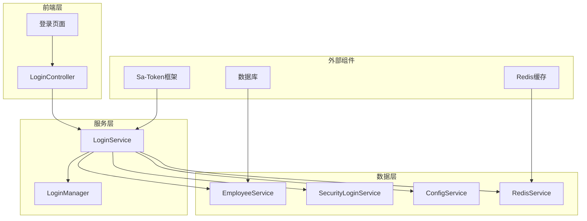
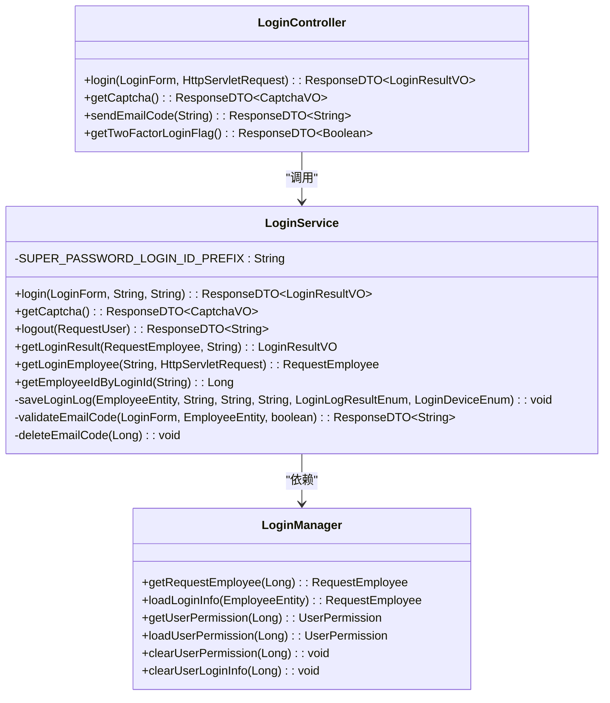
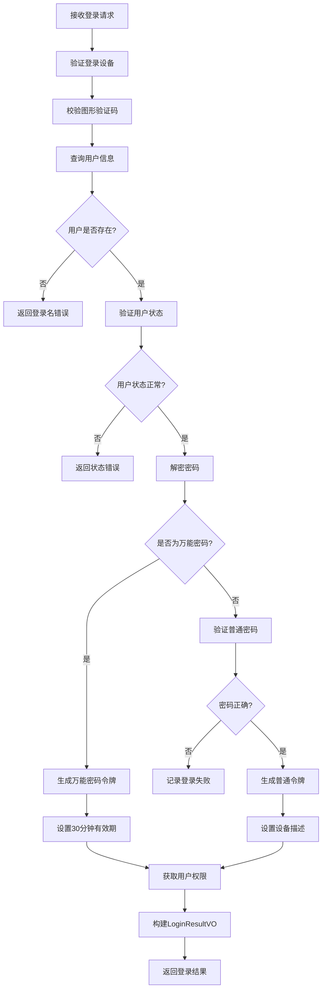
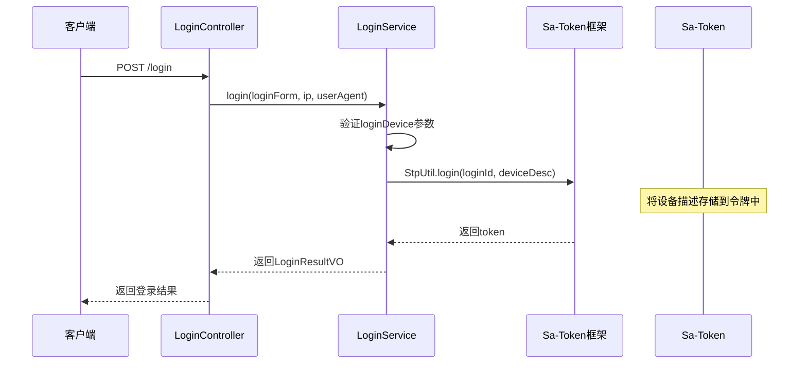
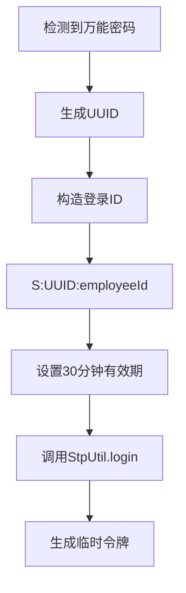
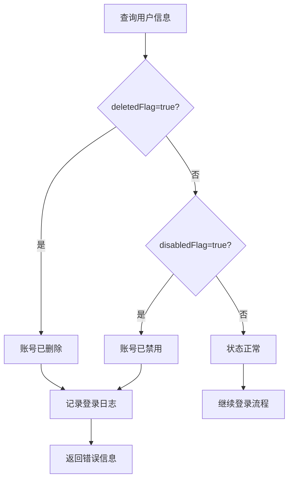
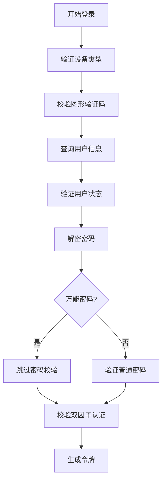
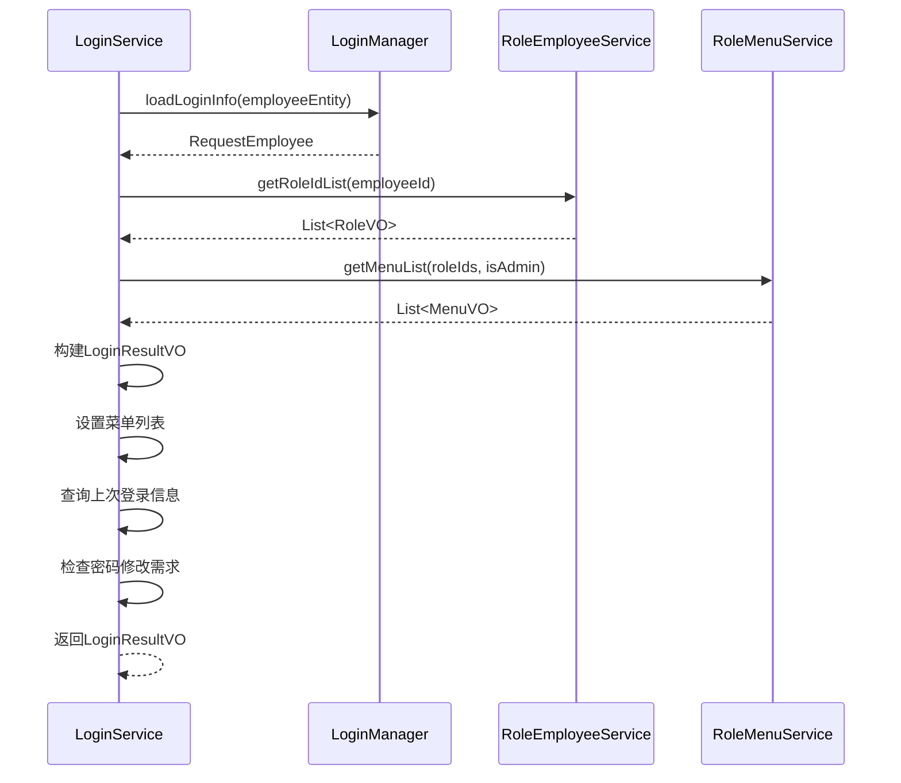

# 令牌生成机制深度解析

<cite>
**本文档引用的文件**
- [LoginService.java](file://smart-admin-api-java17-springboot3/sa-admin/src/main/java/net/lab1024/sa/admin/module/system/login/service/LoginService.java)
- [LoginController.java](file://smart-admin-api-java17-springboot3/sa-admin/src/main/java/net/lab1024/sa/admin/module/system/login/controller/LoginController.java)
- [LoginForm.java](file://smart-admin-api-java17-springboot3/sa-admin/src/main/java/net/lab1024/sa/admin/module/system/login/domain/LoginForm.java)
- [LoginResultVO.java](file://smart-admin-api-java17-springboot3/sa-admin/src/main/java/net/lab1024/sa/admin/module/system/login/domain/LoginResultVO.java)
- [RequestEmployee.java](file://smart-admin-api-java17-springboot3/sa-admin/src/main/java/net/lab1024/sa/admin/module/system/login/domain/RequestEmployee.java)
- [LoginManager.java](file://smart-admin-api-java17-springboot3/sa-admin/src/main/java/net/lab1024/sa/admin/module/system/login/manager/LoginManager.java)
- [EmployeeEntity.java](file://smart-admin-api-java17-springboot3/sa-admin/src/main/java/net/lab1024/sa/admin/module/system/employee/domain/entity/EmployeeEntity.java)
- [LoginDeviceEnum.java](file://smart-admin-api-java17-springboot3/sa-base/src/main/java/net/lab1024/sa/base/constant/LoginDeviceEnum.java)
- [ConfigKeyEnum.java](file://smart-admin-api-java17-springboot3/sa-base/src/main/java/net/lab1024/sa/base/module/support/config/ConfigKeyEnum.java)
</cite>

## 目录
1. [概述](#概述)
2. [项目架构](#项目架构)
3. [核心组件分析](#核心组件分析)
4. [令牌生成流程详解](#令牌生成流程详解)
5. [登录ID构造规则](#登录id构造规则)
6. [设备绑定机制](#设备绑定机制)
7. [万能密码登录机制](#万能密码登录机制)
8. [用户状态校验](#用户状态校验)
9. [前置校验步骤](#前置校验步骤)
10. [LoginResultVO封装](#loginresultvo封装)
11. [性能优化考虑](#性能优化考虑)
12. [故障排除指南](#故障排除指南)

## 概述

基于Sa-Token的令牌生成机制是智能管理系统的核心安全组件，负责处理用户身份验证和会话管理。该机制通过LoginService中的StpUtil.login()方法实现，支持普通登录和万能密码登录两种模式，具备完善的用户状态校验、设备绑定和权限控制功能。

## 项目架构



**图表来源**
- [LoginController.java](file://smart-admin-api-java17-springboot3/sa-admin/src/main/java/net/lab1024/sa/admin/module/system/login/controller/LoginController.java#L42-L48)
- [LoginService.java](file://smart-admin-api-java17-springboot3/sa-admin/src/main/java/net/lab1024/sa/admin/module/system/login/service/LoginService.java#L70-L114)

## 核心组件分析

### LoginService - 登录服务核心

LoginService是令牌生成的核心控制器，实现了Sa-Token的StpInterface接口，提供完整的登录验证和令牌管理功能。



**图表来源**
- [LoginService.java](file://smart-admin-api-java17-springboot3/sa-admin/src/main/java/net/lab1024/sa/admin/module/system/login/service/LoginService.java#L70-L114)
- [LoginController.java](file://smart-admin-api-java17-springboot3/sa-admin/src/main/java/net/lab1024/sa/admin/module/system/login/controller/LoginController.java#L34-L48)
- [LoginManager.java](file://smart-admin-api-java17-springboot3/sa-admin/src/main/java/net/lab1024/sa/admin/module/system/login/manager/LoginManager.java#L45-L174)

**章节来源**
- [LoginService.java](file://smart-admin-api-java17-springboot3/sa-admin/src/main/java/net/lab1024/sa/admin/module/system/login/service/LoginService.java#L1-L481)
- [LoginController.java](file://smart-admin-api-java17-springboot3/sa-admin/src/main/java/net/lab1024/sa/admin/module/system/login/controller/LoginController.java#L1-L90)

## 令牌生成流程详解

### 主流程图



**图表来源**
- [LoginService.java](file://smart-admin-api-java17-springboot3/sa-admin/src/main/java/net/lab1024/sa/admin/module/system/login/service/LoginService.java#L128-L224)

### 关键代码路径

令牌生成的核心逻辑集中在LoginService的login方法中，以下是主要执行路径：

1. **参数验证阶段**：验证登录设备类型和图形验证码
2. **用户查询阶段**：根据登录名查询用户信息
3. **状态校验阶段**：检查用户是否被删除或禁用
4. **密码验证阶段**：验证密码正确性或识别万能密码
5. **令牌生成阶段**：调用StpUtil.login()生成令牌
6. **权限加载阶段**：加载用户角色和权限信息
7. **结果封装阶段**：构建LoginResultVO返回给前端

**章节来源**
- [LoginService.java](file://smart-admin-api-java17-springboot3/sa-admin/src/main/java/net/lab1024/sa/admin/module/system/login/service/LoginService.java#L128-L224)

## 登录ID构造规则

### 普通用户登录ID

对于普通用户，Sa-Token的loginId采用以下格式：
```
{用户类型前缀}:{员工ID}
```

其中：
- 用户类型前缀：`UserTypeEnum.ADMIN_EMPLOYEE.getValue()`（通常为数字）
- 员工ID：数据库中的自增主键

例如：`1:12345` 表示管理员类型用户，员工ID为12345

### 万能密码用户登录ID

对于万能密码登录的用户，采用特殊的UUID格式：
```
S:{UUID}:{员工ID}
```

其中：
- 前缀固定为"S"（SUPER_PASSWORD_LOGIN_ID_PREFIX）
- UUID部分：使用cn.hutool.core.lang.UUID生成唯一标识符
- 员工ID：原始的员工ID

例如：`S:550e8400-e29b-41d4-a716-446655440000:12345`

这种设计确保了：
1. **唯一性**：每个万能密码登录都有独立的UUID
2. **可追溯性**：可以通过UUID反查对应的员工ID
3. **安全性**：即使UUID泄露，也无法直接推断出员工信息

**章节来源**
- [LoginService.java](file://smart-admin-api-java17-springboot3/sa-admin/src/main/java/net/lab1024/sa/admin/module/system/login/service/LoginService.java#L174-L177)
- [LoginService.java](file://smart-admin-api-java17-springboot3/sa-admin/src/main/java/net/lab1024/sa/admin/module/system/login/service/LoginService.java#L297-L302)

## 设备绑定机制

### 支持的设备类型

系统支持多种登录设备，通过LoginDeviceEnum枚举定义：

| 设备类型 | 数值 | 描述 |
|---------|------|------|
| PC | 1 | 电脑端 |
| ANDROID | 2 | 安卓设备 |
| APPLE | 3 | 苹果设备 |
| H5 | 4 | H5页面 |
| WEIXIN_MP | 5 | 微信小程序 |

### 设备绑定实现



**图表来源**
- [LoginService.java](file://smart-admin-api-java17-springboot3/sa-admin/src/main/java/net/lab1024/sa/admin/module/system/login/service/LoginService.java#L130-L133)
- [LoginService.java](file://smart-admin-api-java17-springboot3/sa-admin/src/main/java/net/lab1024/sa/admin/module/system/login/service/LoginService.java#L199)

### 设备绑定特点

1. **自动识别**：根据客户端传递的设备类型自动绑定
2. **持久化**：设备信息与令牌关联，长期有效
3. **查询能力**：可通过Sa-Token API查询特定设备的在线用户
4. **安全控制**：支持按设备类型进行访问控制

**章节来源**
- [LoginDeviceEnum.java](file://smart-admin-api-java17-springboot3/sa-base/src/main/java/net/lab1024/sa/base/constant/LoginDeviceEnum.java#L1-L43)
- [LoginService.java](file://smart-admin-api-java17-springboot3/sa-admin/src/main/java/net/lab1024/sa/admin/module/system/login/service/LoginService.java#L130-L133)

## 万能密码登录机制

### 万能密码特性

万能密码是一种特殊的登录方式，具有以下特点：

1. **临时性**：仅支持30分钟的有效期
2. **唯一性**：每次登录都生成新的UUID
3. **审计性**：可通过前缀"S"识别万能密码登录
4. **限制性**：无法强制修改密码

### 生成策略



**图表来源**
- [LoginService.java](file://smart-admin-api-java17-springboot3/sa-admin/src/main/java/net/lab1024/sa/admin/module/system/login/service/LoginService.java#L174-L177)

### 有效期设置

万能密码登录的30分钟有效期通过以下代码设置：
```java
// 万能密码登录只能登录30分钟
StpUtil.login(saTokenLoginId, 1800);
```

这里的1800秒等于30分钟，确保了万能密码的安全性。

### 特殊处理

对于万能密码登录，系统做了以下特殊处理：

1. **跳过密码校验**：不再进行密码解密和匹配
2. **禁用强制修改**：设置needUpdatePwdFlag=false
3. **简化流程**：减少不必要的权限检查

**章节来源**
- [LoginService.java](file://smart-admin-api-java17-springboot3/sa-admin/src/main/java/net/lab1024/sa/admin/module/system/login/service/LoginService.java#L172-L177)
- [LoginService.java](file://smart-admin-api-java17-springboot3/sa-admin/src/main/java/net/lab1024/sa/admin/module/system/login/service/LoginService.java#L255-L258)

## 用户状态校验

### 用户状态检查流程



**图表来源**
- [LoginService.java](file://smart-admin-api-java17-springboot3/sa-admin/src/main/java/net/lab1024/sa/admin/module/system/login/service/LoginService.java#L147-L156)

### 状态字段含义

| 字段 | 类型 | 含义 |
|------|------|------|
| deletedFlag | Boolean | 是否删除（true表示已删除） |
| disabledFlag | Boolean | 是否禁用（true表示已禁用） |

### 状态检查逻辑

系统在登录过程中严格检查以下状态：

1. **删除状态检查**：如果deletedFlag=true，拒绝登录并返回"账号已删除"错误
2. **禁用状态检查**：如果disabledFlag=true，拒绝登录并返回"账号已禁用"错误
3. **日志记录**：无论哪种状态错误，都会记录相应的登录日志

### 异常处理

当用户状态异常时，系统会：
- 记录详细的登录日志
- 返回明确的错误信息
- 不进行密码验证
- 不生成任何令牌

**章节来源**
- [LoginService.java](file://smart-admin-api-java17-springboot3/sa-admin/src/main/java/net/lab1024/sa/admin/module/system/login/service/LoginService.java#L147-L156)
- [EmployeeEntity.java](file://smart-admin-api-java17-springboot3/sa-admin/src/main/java/net/lab1024/sa/admin/module/system/employee/domain/entity/EmployeeEntity.java#L85-L95)

## 前置校验步骤

### 校验顺序



**图表来源**
- [LoginService.java](file://smart-admin-api-java17-springboot3/sa-admin/src/main/java/net/lab1024/sa/admin/module/system/login/service/LoginService.java#L128-L169)

### 具体校验项目

#### 1. 设备类型校验
```java
LoginDeviceEnum loginDeviceEnum = SmartEnumUtil.getEnumByValue(loginForm.getLoginDevice(), LoginDeviceEnum.class);
if (loginDeviceEnum == null) {
    return ResponseDTO.userErrorParam("登录设备暂不支持！");
}
```

#### 2. 图形验证码校验
```java
ResponseDTO<String> checkCaptcha = captchaService.checkCaptcha(loginForm);
if (!checkCaptcha.getOk()) {
    return ResponseDTO.error(UserErrorCode.PARAM_ERROR, checkCaptcha.getMsg());
}
```

#### 3. 用户存在性校验
```java
EmployeeEntity employeeEntity = employeeService.getByLoginName(loginForm.getLoginName());
if (null == employeeEntity) {
    return ResponseDTO.userErrorParam("登录名或密码错误！");
}
```

#### 4. 双因子认证校验
```java
ResponseDTO<String> validateEmailCode = validateEmailCode(loginForm, employeeEntity, superPasswordFlag);
if (!validateEmailCode.getOk()) {
    return ResponseDTO.error(validateEmailCode);
}
```

### 校验失败处理

每个校验步骤都有明确的错误处理机制：

1. **立即返回**：任何一个校验失败就立即返回错误
2. **详细信息**：提供具体的错误原因
3. **安全考虑**：避免泄露过多的系统信息
4. **日志记录**：记录所有校验失败的情况

**章节来源**
- [LoginService.java](file://smart-admin-api-java17-springboot3/sa-admin/src/main/java/net/lab1024/sa/admin/module/system/login/service/LoginService.java#L130-L139)
- [LoginService.java](file://smart-admin-api-java17-springboot3/sa-admin/src/main/java/net/lab1024/sa/admin/module/system/login/service/LoginService.java#L141-L145)
- [LoginService.java](file://smart-admin-api-java17-springboot3/sa-admin/src/main/java/net/lab1024/sa/admin/module/system/login/service/LoginService.java#L165-L169)

## LoginResultVO封装

### 结构设计

LoginResultVO是登录结果的完整封装，继承自RequestEmployee，包含以下关键字段：

| 字段 | 类型 | 描述 |
|------|------|------|
| token | String | 生成的登录令牌 |
| menuList | List<MenuVO> | 用户菜单权限列表 |
| needUpdatePwdFlag | Boolean | 是否需要修改密码 |
| lastLoginIp | String | 上次登录IP |
| lastLoginIpRegion | String | 上次登录IP地区 |
| lastLoginUserAgent | String | 上次登录User-Agent |
| lastLoginTime | LocalDateTime | 上次登录时间 |

### 构建流程



**图表来源**
- [LoginService.java](file://smart-admin-api-java17-springboot3/sa-admin/src/main/java/net/lab1024/sa/admin/module/system/login/service/LoginService.java#L231-L260)
- [LoginManager.java](file://smart-admin-api-java17-springboot3/sa-admin/src/main/java/net/lab1024/sa/admin/module/system/login/manager/LoginManager.java#L83-L102)

### 关键功能

#### 1. 权限信息加载
```java
// 前端菜单和功能点清单
List<RoleVO> roleList = roleEmployeeService.getRoleIdList(requestEmployee.getEmployeeId());
List<MenuVO> menuAndPointsList = roleMenuService.getMenuList(
    roleList.stream().map(RoleVO::getRoleId).collect(Collectors.toList()), 
    requestEmployee.getAdministratorFlag()
);
loginResultVO.setMenuList(menuAndPointsList);
```

#### 2. 上次登录信息
```java
// 上次登录信息
LoginLogVO loginLogVO = loginLogService.queryLastByUserId(
    requestEmployee.getEmployeeId(), 
    UserTypeEnum.ADMIN_EMPLOYEE, 
    LoginLogResultEnum.LOGIN_SUCCESS
);
if (loginLogVO != null) {
    loginResultVO.setLastLoginIp(loginLogVO.getLoginIp());
    loginResultVO.setLastLoginIpRegion(loginLogVO.getLoginIpRegion());
    loginResultVO.setLastLoginTime(loginLogVO.getCreateTime());
    loginResultVO.setLastLoginUserAgent(loginLogVO.getUserAgent());
}
```

#### 3. 密码修改检查
```java
// 是否需要强制修改密码
boolean needChangePasswordFlag = protectPasswordService.checkNeedChangePassword(
    requestEmployee.getUserType().getValue(), 
    requestEmployee.getUserId()
);
loginResultVO.setNeedUpdatePwdFlag(needChangePasswordFlag);
```

**章节来源**
- [LoginService.java](file://smart-admin-api-java17-springboot3/sa-admin/src/main/java/net/lab1024/sa/admin/module/system/login/service/LoginService.java#L231-L260)
- [LoginResultVO.java](file://smart-admin-api-java17-springboot3/sa-admin/src/main/java/net/lab1024/sa/admin/module/system/login/domain/LoginResultVO.java#L1-L44)

## 性能优化考虑

### 缓存策略

系统采用了多层缓存机制提升性能：

1. **用户信息缓存**：通过@Cacheable注解缓存RequestEmployee对象
2. **权限信息缓存**：缓存用户的角色和权限列表
3. **验证码缓存**：图形验证码和邮箱验证码存储在Redis中

### 数据库优化

1. **索引优化**：loginName字段建立了唯一索引
2. **查询优化**：使用批量查询减少数据库交互
3. **连接池**：合理配置数据库连接池参数

### 内存管理

1. **对象复用**：重用LoginResultVO对象
2. **流式处理**：对大量数据使用流式处理
3. **及时释放**：完成操作后及时释放资源

## 故障排除指南

### 常见问题及解决方案

#### 1. 登录失败问题

**问题现象**：用户输入正确的用户名密码但无法登录

**排查步骤**：
1. 检查用户状态：确认deletedFlag和disabledFlag均为false
2. 验证密码：确认密码解密和加密算法一致
3. 检查设备类型：确认设备类型在支持范围内
4. 验证验证码：确认图形验证码输入正确

**解决方案**：
```java
// 检查用户状态
if (employeeEntity.getDeletedFlag()) {
    log.error("用户已删除: {}", employeeEntity.getLoginName());
    return ResponseDTO.userErrorParam("账号已删除");
}
if (employeeEntity.getDisabledFlag()) {
    log.error("用户已禁用: {}", employeeEntity.getLoginName());
    return ResponseDTO.userErrorParam("账号已禁用");
}
```

#### 2. 令牌生成失败

**问题现象**：登录成功但未生成令牌

**排查步骤**：
1. 检查Sa-Token配置
2. 验证StpUtil.login()调用
3. 检查Redis连接状态

**解决方案**：
```java
// 确保正确调用StpUtil.login
String token = StpUtil.getTokenValue();
if (token == null) {
    log.error("令牌生成失败");
    return ResponseDTO.error("登录失败，请稍后重试");
}
```

#### 3. 权限加载异常

**问题现象**：登录成功但无权限信息

**排查步骤**：
1. 检查角色分配
2. 验证权限配置
3. 清理权限缓存

**解决方案**：
```java
// 清理权限缓存
loginManager.clearUserPermission(employeeEntity.getEmployeeId());
UserPermission userPermission = loginManager.loadUserPermission(employeeEntity.getEmployeeId());
```

### 监控指标

建议监控以下关键指标：
1. 登录成功率
2. 令牌生成耗时
3. 缓存命中率
4. 数据库查询耗时
5. 异常登录次数

**章节来源**
- [LoginService.java](file://smart-admin-api-java17-springboot3/sa-admin/src/main/java/net/lab1024/sa/admin/module/system/login/service/LoginService.java#L147-L156)
- [LoginService.java](file://smart-admin-api-java17-springboot3/sa-admin/src/main/java/net/lab1024/sa/admin/module/system/login/service/LoginService.java#L205-L223)

## 总结

基于Sa-Token的令牌生成机制是一个设计精良、功能完备的登录系统。它通过LoginService作为核心控制器，实现了以下关键特性：

1. **双重登录模式**：支持普通密码登录和万能密码登录
2. **完善的状态校验**：严格检查用户删除和禁用状态
3. **灵活的设备绑定**：支持多种设备类型的自动识别
4. **安全的权限控制**：通过LoginResultVO封装完整的权限信息
5. **高效的性能表现**：采用多层缓存和优化策略

该系统不仅满足了基本的登录需求，还提供了强大的安全性和可扩展性，为智能管理系统提供了可靠的身份认证基础。