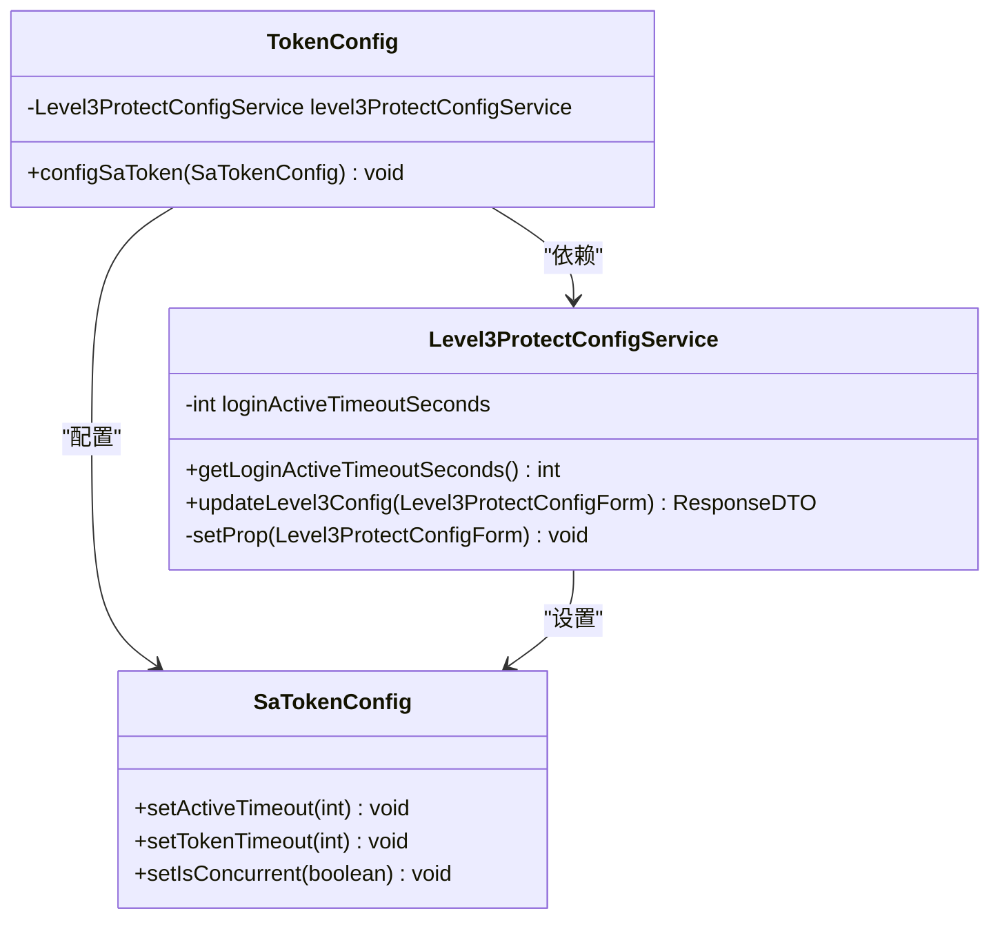
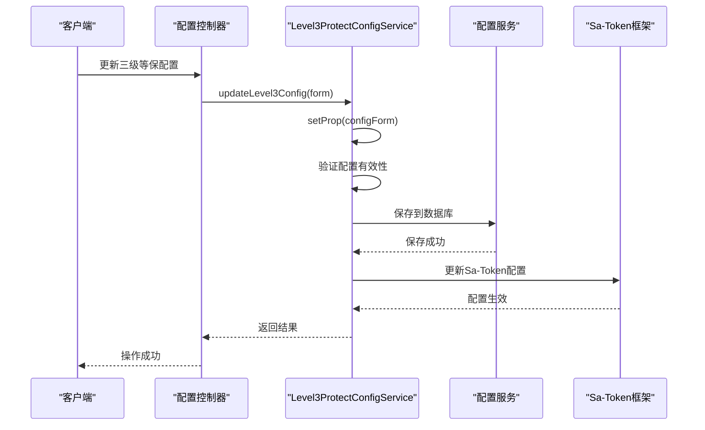
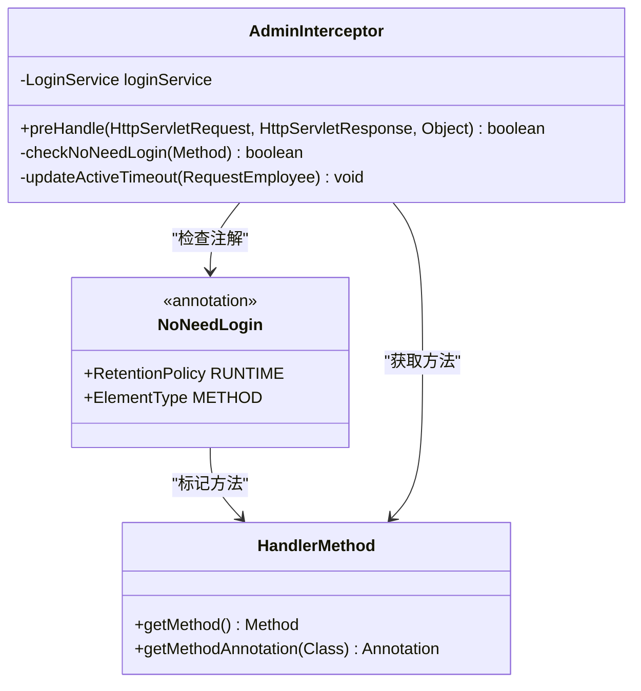
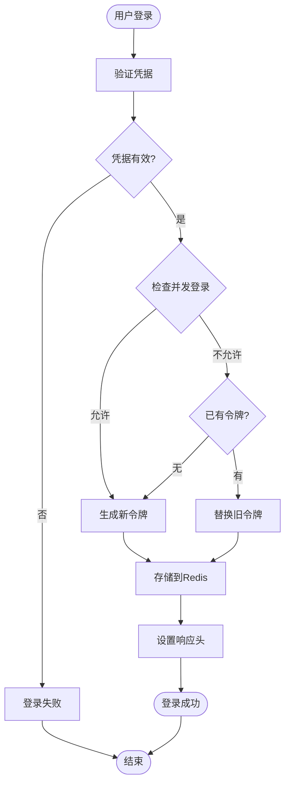
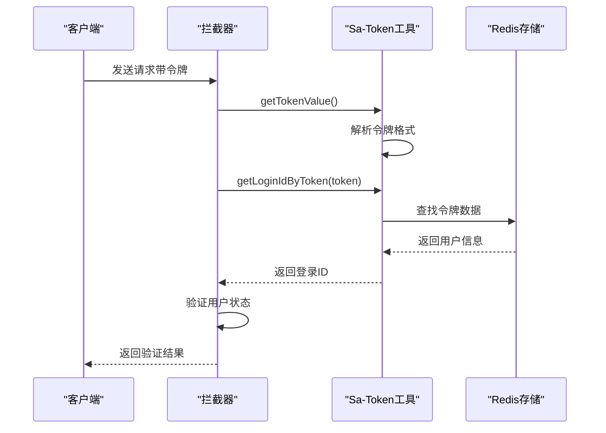
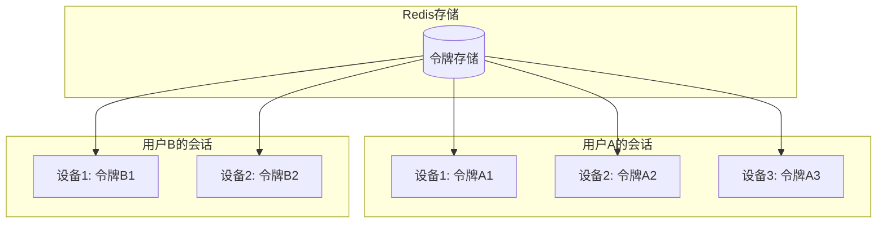
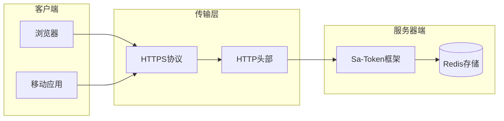

# 令牌管理

<cite>
**本文档引用的文件**
- [TokenConfig.java](file://smart-admin-api-java17-springboot3/sa-base/src/main/java/net/lab1024/sa/base/config/TokenConfig.java)
- [Level3ProtectConfigService.java](file://smart-admin-api-java17-springboot3/sa-base/src/main/java/net/lab1024/sa/base/module/support/securityprotect/service/Level3ProtectConfigService.java)
- [NoNeedLogin.java](file://smart-admin-api-java17-springboot3/sa-base/src/main/java/net/lab1024/sa/base/common/annoation/NoNeedLogin.java)
- [sa-base.yaml](file://smart-admin-api-java17-springboot3/sa-base/src/main/resources/dev/sa-base.yaml)
- [AdminInterceptor.java](file://smart-admin-api-java17-springboot3/sa-admin/src/main/java/net/lab1024/sa\admin\interceptor\AdminInterceptor.java)
- [LoginController.java](file://smart-admin-api-java17-springboot3/sa-admin/src/main/java/net/lab1024\sa\admin\module\system\login\controller\LoginController.java)
- [Level3ProtectConfigForm.java](file://smart-admin-api-java17-springboot3/sa-base/src/main/java/net/lab1024\sa\base\module\support\securityprotect\domain\Level3ProtectConfigForm.java)
- [SecurityPasswordService.java](file://smart-admin-api-java17-springboot3/sa-base/src/main/java/net/lab1024\sa\base\module\support\securityprotect\service\SecurityPasswordService.java)
</cite>

## 目录
1. [概述](#概述)
2. [TokenConfig配置详解](#tokenconfig配置详解)
3. [Level3ProtectConfigService动态调整机制](#level3protectconfigservice动态调整机制)
4. [NoNeedLogin注解实现原理](#noneedlogin注解实现原理)
5. [令牌生成、验证和刷新流程](#令牌生成验证和刷新流程)
6. [多设备登录支持与单点登录配置](#多设备登录支持与单点登录配置)
7. [安全最佳实践](#安全最佳实践)
8. [故障排除指南](#故障排除指南)
9. [总结](#总结)

## 概述

Sa-Token是一个轻量级的Java权限认证框架，提供了完整的令牌管理系统。本文档深入解析基于Sa-Token的令牌管理机制，涵盖配置管理、动态调整、安全控制等核心功能。

Sa-Token的令牌管理具有以下特点：
- 基于Spring Boot 3和Sa-Token 1.32.0构建
- 支持多种令牌风格（UUID、随机字符串等）
- 提供动态令牌有效期调整能力
- 实现了三级等保安全要求
- 支持多设备登录和单点登录配置

## TokenConfig配置详解

### 核心配置架构

TokenConfig类负责Sa-Token的核心配置管理，通过依赖注入Level3ProtectConfigService实现动态配置调整。



**图表来源**
- [TokenConfig.java](file://smart-admin-api-java17-springboot3/sa-base/src/main/java/net/lab1024/sa/base/config/TokenConfig.java#L21-L33)
- [Level3ProtectConfigService.java](file://smart-admin-api-java17-springboot3/sa-base/src/main/java/net/lab1024/sa/base/module/support/securityprotect/service/Level3ProtectConfigService.java#L112-L116)

### 配置参数详解

| 配置项 | 默认值 | 说明 | 影响范围 |
|--------|--------|------|----------|
| token-name | Authorization | 令牌名称，同时也是Cookie名称 | 全局 |
| token-prefix | Bearer | 令牌前缀 | HTTP请求头 |
| timeout | 2592000 | 令牌有效期（秒），默认30天 | 令牌生命周期 |
| active-timeout | -1 | 最低活跃时间（秒），-1表示不限制 | 令牌冻结机制 |
| is-concurrent | false | 是否允许多地同时登录 | 多设备支持 |
| is-share | false | 是否共用一个令牌 | 会话管理 |
| auto-renew | true | 是否自动续签 | 令牌续期 |
| token-style | simple-uuid | 令牌风格 | 令牌生成算法 |

**章节来源**
- [sa-base.yaml](file://smart-admin-api-java17-springboot3/sa-base/src/main/resources/dev/sa-base.yaml#L150-L175)

## Level3ProtectConfigService动态调整机制

### 动态配置架构

Level3ProtectConfigService实现了三级等保的安全配置动态调整机制，支持运行时修改令牌相关参数。



**图表来源**
- [Level3ProtectConfigService.java](file://smart-admin-api-java17-springboot3/sa-base/src/main/java/net/lab1024/sa/base/module/support/securityprotect/service/Level3ProtectConfigService.java#L178-L188)
- [Level3ProtectConfigForm.java](file://smart-admin-api-java17-springboot3/sa-base/src/main/java/net/lab1024/sa/base/module/support/securityprotect/domain/Level3ProtectConfigForm.java#L1-L37)

### 关键配置参数

| 参数名称 | 类型 | 默认值 | 动态调整范围 | 安全影响 |
|----------|------|--------|-------------|----------|
| loginFailMaxTimes | Integer | 5 | 0-10 | 登录失败锁定 |
| loginFailLockMinutes | Integer | 30 | 0-无限 | 锁定时间 |
| loginActiveTimeoutMinutes | Integer | 30 | 0-无限 | 活跃超时 |
| twoFactorLoginEnabled | Boolean | true | true/false | 双因子认证 |
| passwordComplexityEnabled | Boolean | true | true/false | 密码强度 |

### 令牌有效期动态调整

Level3ProtectConfigService通过以下机制实现令牌有效期的动态调整：

1. **配置加载**：启动时从数据库加载配置
2. **参数转换**：将分钟单位转换为秒单位
3. **边界检查**：确保有效值范围
4. **实时生效**：通过Sa-Token API即时更新配置

**章节来源**
- [Level3ProtectConfigService.java](file://smart-admin-api-java17-springboot3/sa-base/src/main/java/net/lab1024/sa/base/module/support/securityprotect/service/Level3ProtectConfigService.java#L122-L188)

## NoNeedLogin注解实现原理

### 注解设计架构

NoNeedLogin注解提供了灵活的开放接口控制机制，允许特定方法绕过登录验证。



**图表来源**
- [NoNeedLogin.java](file://smart-admin-api-java17-springboot3/sa-base/src/main/java/net/lab1024/sa/base/common/annoation/NoNeedLogin.java#L17-L21)
- [AdminInterceptor.java](file://smart-admin-api-java17-springboot3/sa-admin/src/main/java/net/lab1024/sa\admin\interceptor\AdminInterceptor.java#L68-L72)

### 实现机制详解

NoNeedLogin注解的工作流程如下：

1. **方法标记**：在Controller方法上添加@NoNeedLogin注解
2. **拦截器检查**：AdminInterceptor.preHandle方法检查注解
3. **权限跳过**：直接返回true，跳过登录验证
4. **活跃时间更新**：仍保持活跃时间更新逻辑
5. **上下文设置**：设置请求用户上下文

### 应用场景示例

常见的NoNeedLogin应用场景包括：
- 登录接口（/login）
- 验证码获取（/login/getCaptcha）
- 系统健康检查
- 公开API接口

**章节来源**
- [AdminInterceptor.java](file://smart-admin-api-java17-springboot3/sa-admin/src/main/java/net/lab1024/sa\admin\interceptor\AdminInterceptor.java#L68-L72)
- [LoginController.java](file://smart-admin-api-java17-springboot3/sa-admin/src/main/java/net/lab1024\sa\admin\module\system\login\controller\LoginController.java#L42-L48)

## 令牌生成、验证和刷新流程

### 令牌生命周期管理

Sa-Token提供了完整的令牌生命周期管理机制，包括生成、验证、刷新和销毁。



### 自动续签机制

Sa-Token的自动续签机制确保用户在活跃期间不会因令牌过期而中断操作：

1. **触发条件**：每次调用`StpUtil.getLoginId()`时
2. **检查逻辑**：判断令牌剩余有效期
3. **续签阈值**：默认提前1/3有效期进行续签
4. **续签操作**：延长令牌有效期并更新存储

### 令牌验证流程



**图表来源**
- [AdminInterceptor.java](file://smart-admin-api-java17-springboot3/sa-admin/src/main/java/net/lab1024/sa\admin\interceptor\AdminInterceptor.java#L61-L63)

**章节来源**
- [AdminInterceptor.java](file://smart-admin-api-java17-springboot3/sa-admin/src/main/java/net/lab1024/sa\admin\interceptor\AdminInterceptor.java#L125-L133)

## 多设备登录支持与单点登录配置

### 并发登录控制

Sa-Token提供了灵活的并发登录控制机制，支持多种登录模式：

| 配置项 | 值 | 行为描述 | 安全级别 |
|--------|-----|----------|----------|
| is-concurrent: false | false | 新登录挤掉旧登录 | 高 |
| is-concurrent: true | true | 允许多地同时登录 | 中 |
| is-share: false | false | 每次登录新建独立令牌 | 高 |
| is-share: true | true | 多设备共享同一令牌 | 低 |

### 令牌隔离机制



### 单点登录(SSO)配置

虽然当前配置中is-share为false，但Sa-Token支持通过以下方式实现SSO：

1. **共享令牌**：设置is-share=true
2. **统一注销**：通过StpUtil.logout()实现
3. **跨域支持**：配置适当的CORS策略
4. **会话同步**：使用Redis发布订阅机制

**章节来源**
- [sa-base.yaml](file://smart-admin-api-java17-springboot3/sa-base/src/main/resources/dev/sa-base.yaml#L160-L162)

## 安全最佳实践

### 令牌安全存储

Sa-Token采用Redis作为令牌存储后端，提供了以下安全保障：

1. **内存存储**：令牌存储在Redis中，避免内存泄漏
2. **序列化机制**：使用Jackson进行对象序列化
3. **过期策略**：自动清理过期令牌
4. **分布式支持**：支持集群环境下的令牌共享

### 传输加密



### 防重放攻击措施

1. **令牌唯一性**：每个会话生成唯一令牌
2. **时间戳验证**：结合时间戳防止重放
3. **请求签名**：可选的请求签名机制
4. **IP绑定**：可配置的IP地址绑定

### 密码安全机制

Level3ProtectConfigService集成了多层次的密码安全机制：

| 安全特性 | 实现方式 | 配置参数 |
|----------|----------|----------|
| 密码复杂度 | 正则表达式验证 | passwordComplexityEnabled |
| 密码历史 | 密码日志记录 | regularChangePasswordNotAllowRepeatTimes |
| 定期更换 | 时间间隔检查 | regularChangePasswordDays |
| 加密存储 | Argon2算法 | 内部实现 |

**章节来源**
- [SecurityPasswordService.java](file://smart-admin-api-java17-springboot3/sa-base/src/main/java/net/lab1024/sa/base/module/support/securityprotect/service\SecurityPasswordService.java#L134-L156)

## 故障排除指南

### 常见问题诊断

| 问题现象 | 可能原因 | 解决方案 |
|----------|----------|----------|
| 令牌过期频繁 | timeout配置过短 | 调整timeout参数 |
| 多设备冲突 | is-concurrent配置不当 | 根据需求调整并发设置 |
| 登录失效 | active-timeout触发 | 检查用户活跃状态 |
| 配置不生效 | 配置未正确加载 | 重启应用或重新加载配置 |

### 调试配置

启用Sa-Token调试日志以便问题排查：

```yaml
sa-token:
  is-log: true
  log-level: debug
```

### 性能监控

建议监控以下指标：
- 令牌生成频率
- Redis存储使用率
- 并发登录数量
- 登录失败率

**章节来源**
- [AdminInterceptor.java](file://smart-admin-api-java17-springboot3/sa-admin/src/main/java/net/lab1024/sa\admin\interceptor\AdminInterceptor.java#L101-L112)

## 总结

Sa-Token提供了一套完整而灵活的令牌管理解决方案，具有以下核心优势：

1. **配置灵活**：支持动态配置调整，适应不同安全需求
2. **安全可靠**：集成三级等保要求，提供多层次安全保护
3. **性能优异**：基于Redis存储，支持高并发场景
4. **易于集成**：简洁的API设计，快速实现权限控制
5. **扩展性强**：支持自定义扩展和第三方集成

通过合理配置TokenConfig、利用Level3ProtectConfigService的动态调整能力、正确使用NoNeedLogin注解，以及遵循安全最佳实践，可以构建一个既安全又高效的令牌管理系统。