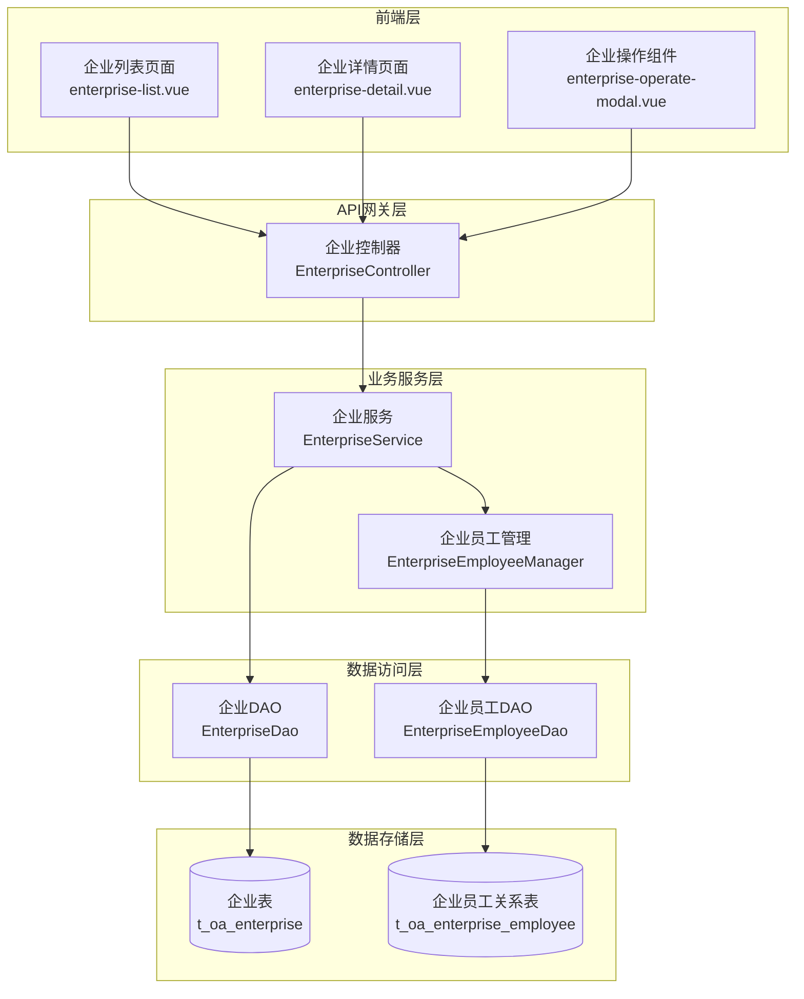
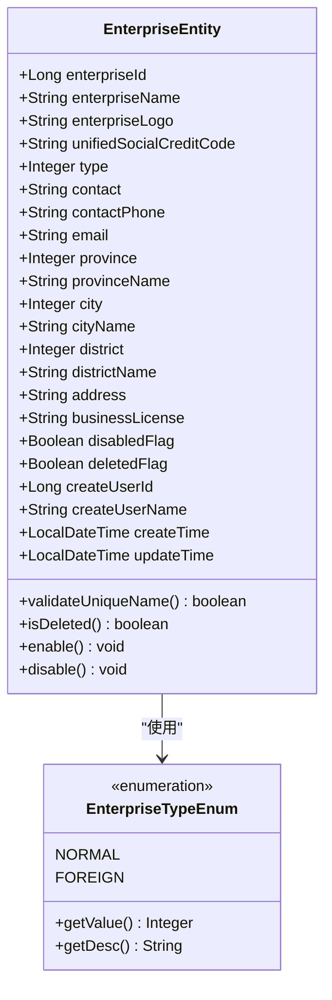
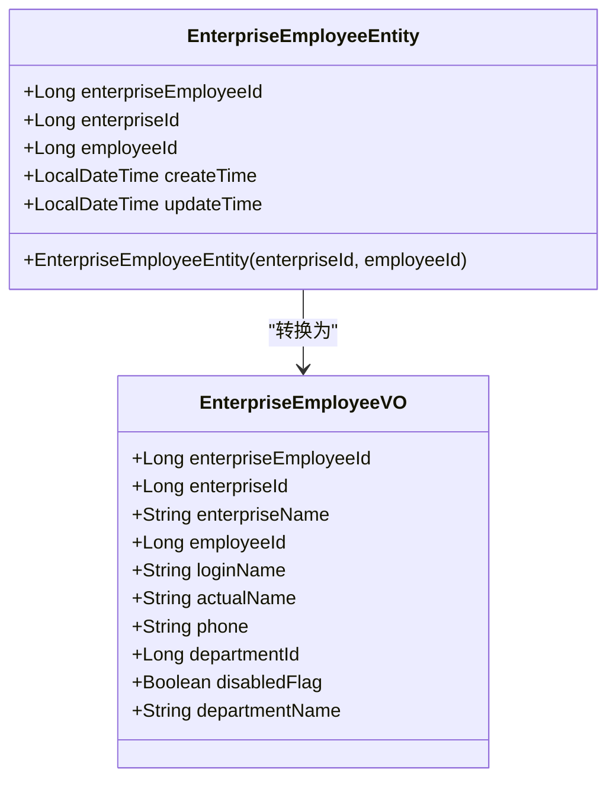
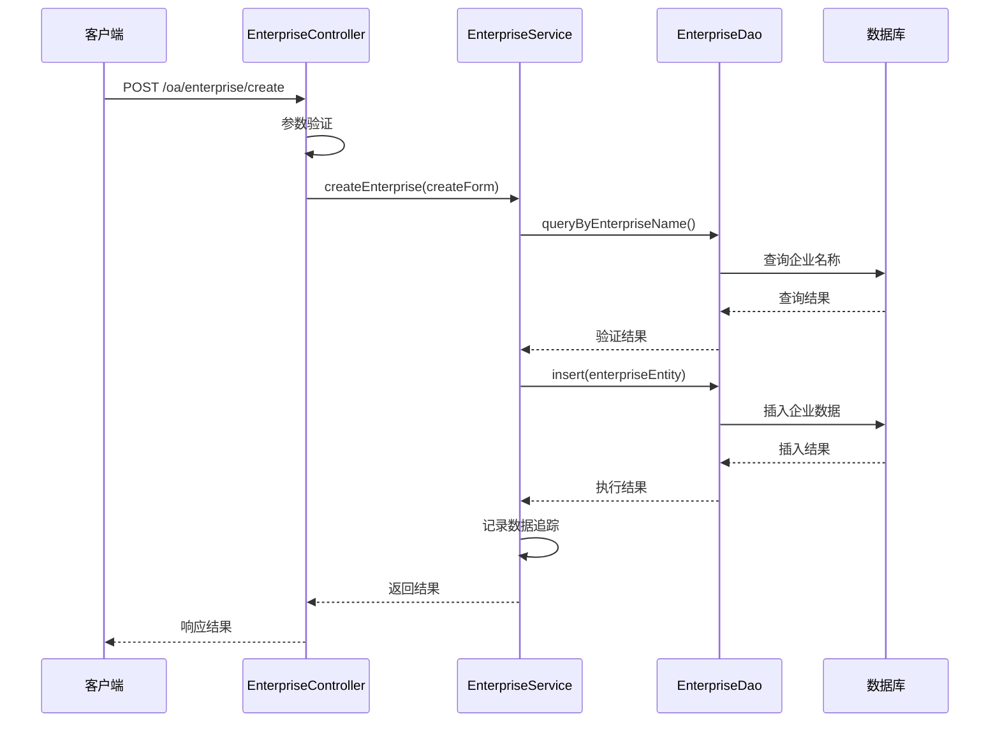
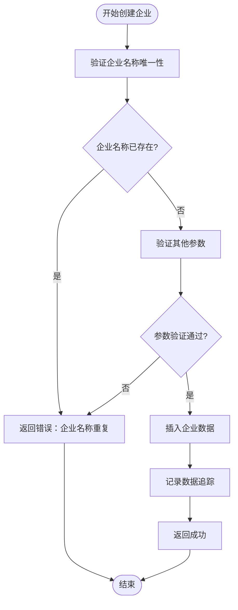
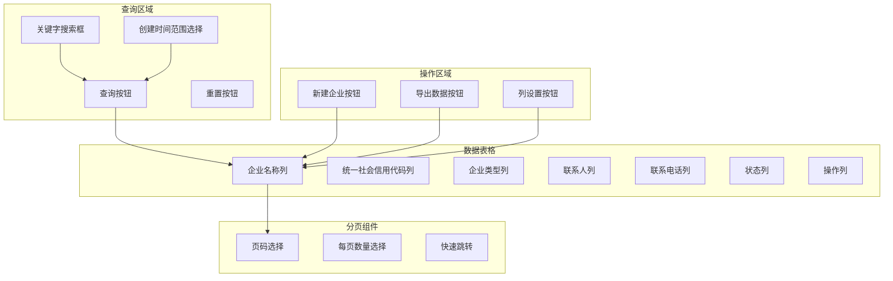
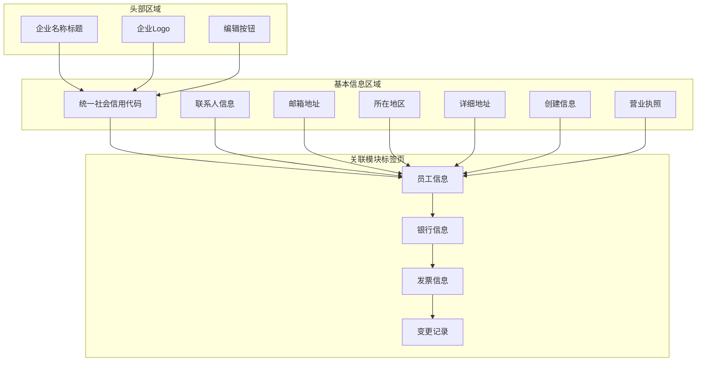
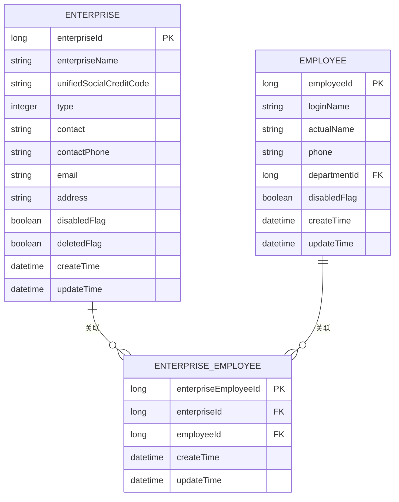

# 企业信息管理

<cite>
**本文档中引用的文件**
- [EnterpriseController.java](file://smart-admin-api-java17-springboot3\sa-admin\src\main\java\net\lab1024\sa\admin\module\business\oa\enterprise\controller\EnterpriseController.java)
- [EnterpriseService.java](file://smart-admin-api-java17-springboot3\sa-admin\src\main\java\net\lab1024\sa\admin\module\business\oa\enterprise\service\EnterpriseService.java)
- [EnterpriseEntity.java](file://smart-admin-api-java17-springboot3\sa-admin\src\main\java\net\lab1024\sa\admin\module\business\oa\enterprise\domain\entity\EnterpriseEntity.java)
- [EnterpriseTypeEnum.java](file://smart-admin-api-java17-springboot3\sa-admin\src\main\java\net\lab1024\sa\admin\module\business\oa\enterprise\constant\EnterpriseTypeEnum.java)
- [EnterpriseCreateForm.java](file://smart-admin-api-java17-springboot3\sa-admin\src\main\java\net\lab1024\sa\admin\module\business\oa\enterprise\domain\form\EnterpriseCreateForm.java)
- [EnterpriseUpdateForm.java](file://smart-admin-api-java17-springboot3\sa-admin\src\main\java\net\lab1024\sa\admin\module\business\oa\enterprise\domain\form\EnterpriseUpdateForm.java)
- [EnterpriseVO.java](file://smart-admin-api-java17-springboot3\sa-admin\src\main\java\net\lab1024\sa\admin\module\business\oa\enterprise\domain\vo\EnterpriseVO.java)
- [EnterpriseEmployeeEntity.java](file://smart-admin-api-java17-springboot3\sa-admin\src\main\java\net\lab1024\sa\admin\module\business\oa\enterprise\domain\entity\EnterpriseEmployeeEntity.java)
- [EnterpriseEmployeeVO.java](file://smart-admin-api-java17-springboot3\sa-admin\src\main\java\net\lab1024\sa\admin\module\business\oa\enterprise\domain\vo\EnterpriseEmployeeVO.java)
- [enterprise-list.vue](file://smart-admin-web-javascript\src\views\business\oa\enterprise\enterprise-list.vue)
- [enterprise-detail.vue](file://smart-admin-web-javascript\src\views\business\oa\enterprise\enterprise-detail.vue)
- [enterprise-api.js](file://smart-admin-web-javascript\src\api\business\oa\enterprise-api.js)
- [EnterpriseMapper.xml](file://smart-admin-api-java17-springboot3\sa-admin\src\main\resources\mapper\business\oa\enterprise\EnterpriseMapper.xml)
</cite>

## 目录
1. [概述](#概述)
2. [系统架构](#系统架构)
3. [核心实体类](#核心实体类)
4. [后端服务层](#后端服务层)
5. [前端界面设计](#前端界面设计)
6. [API接口规范](#api接口规范)
7. [数据关系模型](#数据关系模型)
8. [使用示例](#使用示例)
9. [性能优化建议](#性能优化建议)
10. [故障排除指南](#故障排除指南)

## 概述

企业信息管理系统是一个完整的企业基础信息管理解决方案，提供企业信息的全生命周期管理功能，包括企业基本信息维护、组织架构管理、员工关联关系维护等核心功能。系统采用前后端分离架构，后端基于Spring Boot 3构建RESTful API，前端使用Vue 3技术栈。

### 主要功能特性

- **企业信息管理**：支持企业基本信息的增删改查操作
- **企业类型管理**：支持有限企业和外资企业两种类型
- **员工关系管理**：提供企业与员工的关联关系维护
- **权限控制**：基于Sa-Token的细粒度权限控制
- **数据追踪**：完整的操作日志和变更记录
- **批量操作**：支持批量导入导出和批量操作

## 系统架构



**图表来源**
- [EnterpriseController.java](file://smart-admin-api-java17-springboot3\sa-admin\src\main\java\net\lab1024\sa\admin\module\business\oa\enterprise\controller\EnterpriseController.java#L29-L137)
- [EnterpriseService.java](file://smart-admin-api-java17-springboot3\sa-admin\src\main\java\net\lab1024\sa\admin\module\business\oa\enterprise\service\EnterpriseService.java#L33-L238)

## 核心实体类

### EnterpriseEntity - 企业实体

企业实体类是系统的核心数据模型，定义了企业基本信息的所有字段及其约束条件。



**图表来源**
- [EnterpriseEntity.java](file://smart-admin-api-java17-springboot3\sa-admin\src\main\java\net\lab1024\sa\admin\module\business\oa\enterprise\domain\entity\EnterpriseEntity.java#L21-L152)
- [EnterpriseTypeEnum.java](file://smart-admin-api-java17-springboot3\sa-admin\src\main\java\net\lab1024\sa\admin\module\business\oa\enterprise\constant\EnterpriseTypeEnum.java#L15-L46)

#### 字段定义与约束

| 字段名 | 类型 | 约束 | 描述 |
|--------|------|------|------|
| enterpriseId | Long | 主键自增 | 企业唯一标识符 |
| enterpriseName | String | 非空，长度≤200 | 企业名称，全局唯一 |
| unifiedSocialCreditCode | String | 非空，长度≤200 | 统一社会信用代码 |
| type | Integer | 非空 | 企业类型（1:有限企业，2:外资企业） |
| contact | String | 非空，长度≤100 | 联系人姓名 |
| contactPhone | String | 非空，手机格式 | 联系人电话号码 |
| email | String | 邮箱格式 | 企业邮箱地址 |
| address | String | 长度≤500 | 详细地址信息 |
| disabledFlag | Boolean | 非空 | 是否禁用企业 |
| deletedFlag | Boolean | 非空 | 逻辑删除标志 |

**节来源**
- [EnterpriseEntity.java](file://smart-admin-api-java17-springboot3\sa-admin\src\main\java\net\lab1024\sa\admin\module\business\oa\enterprise\domain\entity\EnterpriseEntity.java#L28-L152)

### EnterpriseTypeEnum - 企业类型枚举

企业类型枚举定义了系统支持的企业分类，提供了类型值与描述之间的映射关系。

#### 枚举类型说明

| 类型值 | 类型描述 | 用途说明 |
|--------|----------|----------|
| 1 | 有限企业 | 普通国内企业类型 |
| 2 | 外资企业 | 外资投资企业类型 |

**节来源**
- [EnterpriseTypeEnum.java](file://smart-admin-api-java17-springboot3\sa-admin\src\main\java\net\lab1024\sa\admin\module\business\oa\enterprise\constant\EnterpriseTypeEnum.java#L15-L46)

### EnterpriseEmployeeEntity - 企业员工关系实体

企业员工关系实体用于维护企业与员工之间的多对多关系。



**图表来源**
- [EnterpriseEmployeeEntity.java](file://smart-admin-api-java17-springboot3\sa-admin\src\main\java\net\lab1024\sa\admin\module\business\oa\enterprise\domain\entity\EnterpriseEmployeeEntity.java#L20-L50)
- [EnterpriseEmployeeVO.java](file://smart-admin-api-java17-springboot3\sa-admin\src\main\java\net\lab1024\sa\admin\module\business\oa\enterprise\domain\vo\EnterpriseEmployeeVO.java#L15-L47)

**节来源**
- [EnterpriseEmployeeEntity.java](file://smart-admin-api-java17-springboot3\sa-admin\src\main\java\net\lab1024\sa\admin\module\business\oa\enterprise\domain\entity\EnterpriseEmployeeEntity.java#L20-L50)

## 后端服务层

### EnterpriseController - 控制器层

EnterpriseController负责处理所有与企业相关的HTTP请求，提供RESTful API接口。

#### 核心功能接口



**图表来源**
- [EnterpriseController.java](file://smart-admin-api-java17-springboot3\sa-admin\src\main\java\net\lab1024\sa\admin\module\business\oa\enterprise\controller\EnterpriseController.java#L78-L84)
- [EnterpriseService.java](file://smart-admin-api-java17-springboot3\sa-admin\src\main\java\net\lab1024\sa\admin\module\business\oa\enterprise\service\EnterpriseService.java#L93-L104)

#### 权限控制机制

系统采用Sa-Token框架进行权限控制，每个API接口都标注了相应的权限注解：

| 接口路径 | 权限标识 | 功能描述 |
|----------|----------|----------|
| `/oa/enterprise/create` | `oa:enterprise:add` | 创建企业 |
| `/oa/enterprise/update` | `oa:enterprise:update` | 更新企业信息 |
| `/oa/enterprise/delete/{enterpriseId}` | `oa:enterprise:delete` | 删除企业 |
| `/oa/enterprise/get/{enterpriseId}` | `oa:enterprise:detail` | 查看企业详情 |
| `/oa/enterprise/page/query` | `oa:enterprise:query` | 分页查询企业 |
| `/oa/enterprise/employee/add` | `oa:enterprise:addEmployee` | 添加企业员工 |
| `/oa/enterprise/employee/delete` | `oa:enterprise:deleteEmployee` | 删除企业员工 |

**节来源**
- [EnterpriseController.java](file://smart-admin-api-java17-springboot3\sa-admin\src\main\java\net\lab1024\sa\admin\module\business\oa\enterprise\controller\EnterpriseController.java#L48-L137)

### EnterpriseService - 业务服务层

EnterpriseService是业务逻辑的核心实现，负责处理复杂的业务规则和数据验证。

#### 数据验证机制



**图表来源**
- [EnterpriseService.java](file://smart-admin-api-java17-springboot3\sa-admin\src\main\java\net\lab1024\sa\admin\module\business\oa\enterprise\service\EnterpriseService.java#L93-L104)

#### 事务处理机制

系统在关键业务操作中使用@Transactional注解确保数据一致性：

- **创建企业**：插入企业信息和数据追踪记录
- **更新企业**：修改企业信息并记录变更历史
- **删除企业**：逻辑删除企业并清理相关数据
- **员工管理**：添加/删除企业员工关系

**节来源**
- [EnterpriseService.java](file://smart-admin-api-java17-springboot3\sa-admin\src\main\java\net\lab1024\sa\admin\module\business\oa\enterprise\service\EnterpriseService.java#L33-L238)

### 数据库映射与查询

系统使用MyBatis Plus进行数据库操作，提供了丰富的CRUD功能和复杂查询能力。

#### 核心查询功能

| 查询类型 | 方法名 | 功能描述 |
|----------|--------|----------|
| 分页查询 | `queryPage()` | 支持关键字、时间范围、状态筛选的分页查询 |
| 详情查询 | `getDetail()` | 获取企业详细信息 |
| 名称验证 | `queryByEnterpriseName()` | 验证企业名称唯一性 |
| 导出数据 | `selectExcelExportData()` | 获取导出用的Excel数据 |
| 类型查询 | `queryList()` | 按类型查询企业列表 |

**节来源**
- [EnterpriseMapper.xml](file://smart-admin-api-java17-springboot3\sa-admin\src\main\resources\mapper\business\oa\enterprise\EnterpriseMapper.xml#L1-L89)

## 前端界面设计

### 企业列表页面 (enterprise-list.vue)

企业列表页面提供了企业信息的集中展示和管理功能。

#### 页面布局与功能



**图表来源**
- [enterprise-list.vue](file://smart-admin-web-javascript\src\views\business\oa\enterprise\enterprise-list.vue#L10-L108)

#### 组件交互逻辑

页面采用响应式设计，主要交互流程包括：

1. **查询功能**：支持关键字搜索和时间范围筛选
2. **分页加载**：点击分页组件自动加载对应页数据
3. **权限控制**：根据用户权限显示或隐藏操作按钮
4. **数据刷新**：操作完成后自动刷新列表数据

**节来源**
- [enterprise-list.vue](file://smart-admin-web-javascript\src\views\business\oa\enterprise\enterprise-list.vue#L112-L284)

### 企业详情页面 (enterprise-detail.vue)

企业详情页面展示了企业的详细信息和相关联的功能模块。

#### 页面结构



**图表来源**
- [enterprise-detail.vue](file://smart-admin-web-javascript\src\views\business\oa\enterprise\enterprise-detail.vue#L10-L52)

#### 状态管理方式

页面使用Vue 3的Composition API进行状态管理：

- **响应式数据**：使用`ref`和`reactive`管理页面状态
- **计算属性**：使用`computed`处理派生数据
- **生命周期**：使用`onMounted`钩子初始化数据
- **异步操作**：使用`async/await`处理异步请求

**节来源**
- [enterprise-detail.vue](file://smart-admin-web-javascript\src\views\business\oa\enterprise\enterprise-detail.vue#L56-L128)

### API调用封装

前端通过专门的API模块封装了所有企业相关的HTTP请求。

#### API接口定义

| 接口方法 | URL路径 | 功能描述 |
|----------|---------|----------|
| `create` | `/oa/enterprise/create` | 创建企业 |
| `update` | `/oa/enterprise/update` | 更新企业 |
| `delete` | `/oa/enterprise/delete/{id}` | 删除企业 |
| `detail` | `/oa/enterprise/get/{id}` | 获取企业详情 |
| `pageQuery` | `/oa/enterprise/page/query` | 分页查询 |
| `exportExcel` | `/oa/enterprise/exportExcel` | 导出Excel |
| `queryList` | `/oa/enterprise/query/list` | 查询企业列表 |

**节来源**
- [enterprise-api.js](file://smart-admin-web-javascript\src\api\business\oa\enterprise-api.js#L12-L69)

## API接口规范

### 请求参数规范

#### 创建企业请求参数

```json
{
  "enterpriseName": "字符串，必填，企业名称",
  "enterpriseLogo": "字符串，可选，企业Logo文件URL",
  "unifiedSocialCreditCode": "字符串，必填，统一社会信用代码",
  "type": "整数，必填，企业类型(1:有限企业, 2:外资企业)",
  "contact": "字符串，必填，联系人姓名",
  "contactPhone": "字符串，必填，联系人电话",
  "email": "字符串，可选，邮箱地址",
  "province": "整数，可选，省份ID",
  "city": "整数，可选，城市ID",
  "district": "整数，可选，区县ID",
  "address": "字符串，可选，详细地址",
  "businessLicense": "字符串，可选，营业执照文件URL",
  "disabledFlag": "布尔值，必填，是否禁用"
}
```

#### 分页查询请求参数

```json
{
  "keywords": "字符串，可选，搜索关键字",
  "startTime": "字符串，可选，开始时间",
  "endTime": "字符串，可选，结束时间",
  "pageNum": "整数，必填，当前页码",
  "pageSize": "整数，必填，每页大小",
  "sortItemList": "数组，可选，排序字段列表"
}
```

### 响应格式规范

#### 成功响应格式

```json
{
  "code": 200,
  "message": "操作成功",
  "data": {
    // 具体业务数据
  }
}
```

#### 错误响应格式

```json
{
  "code": 400,
  "message": "参数错误：企业名称重复",
  "data": null
}
```

### 错误码定义

| 错误码 | 错误描述 | 处理建议 |
|--------|----------|----------|
| 400 | 参数验证失败 | 检查请求参数格式和必填项 |
| 401 | 用户未登录 | 重新登录系统 |
| 403 | 权限不足 | 联系管理员分配相应权限 |
| 404 | 资源不存在 | 检查资源ID是否正确 |
| 500 | 服务器内部错误 | 联系技术支持 |

## 数据关系模型

### 企业与员工关系

企业与员工之间存在多对多的关系，通过中间表`t_oa_enterprise_employee`进行关联。



**图表来源**
- [EnterpriseEmployeeEntity.java](file://smart-admin-api-java17-springboot3\sa-admin\src\main\java\net\lab1024\sa\admin\module\business\oa\enterprise\domain\entity\EnterpriseEmployeeEntity.java#L20-L50)

### 企业与其他关联实体

企业还与多个业务实体存在关联关系：

| 关联实体 | 关联关系 | 功能描述 |
|----------|----------|----------|
| 银行账户 | 一对多 | 记录企业的银行开户信息 |
| 发票信息 | 一对多 | 存储企业的发票开具记录 |
| 部门信息 | 一对多 | 维护企业的组织架构 |
| 员工信息 | 多对多 | 建立企业与员工的关联关系 |

**节来源**
- [EnterpriseEmployeeVO.java](file://smart-admin-api-java17-springboot3\sa-admin\src\main\java\net\lab1024\sa\admin\module\business\oa\enterprise\domain\vo\EnterpriseEmployeeVO.java#L15-L47)

## 使用示例

### 创建新企业

以下是创建新企业的完整代码示例：

#### 后端实现

```java
// 创建企业请求参数
EnterpriseCreateForm createForm = new EnterpriseCreateForm();
createForm.setEnterpriseName("测试企业");
createForm.setUnifiedSocialCreditCode("123456789012345678");
createForm.setType(EnterpriseTypeEnum.NORMAL.getValue());
createForm.setContact("张三");
createForm.setContactPhone("13800138000");
createForm.setEmail("test@example.com");
createForm.setAddress("北京市朝阳区测试路123号");
createForm.setDisabledFlag(false);

// 调用服务层创建企业
ResponseDTO<String> result = enterpriseService.createEnterprise(createForm);
```

#### 前端实现

```javascript
// 调用API创建企业
const createEnterprise = async (formData) => {
  try {
    await enterpriseApi.create(formData);
    message.success('企业创建成功');
    // 刷新列表
    await ajaxQuery();
  } catch (error) {
    message.error('企业创建失败');
  }
};
```

**节来源**
- [EnterpriseService.java](file://smart-admin-api-java17-springboot3\sa-admin\src\main\java\net\lab1024\sa\admin\module\business\oa\enterprise\service\EnterpriseService.java#L93-L104)
- [enterprise-api.js](file://smart-admin-web-javascript\src\api\business\oa\enterprise-api.js#L14-L16)

### 更新企业信息

#### 后端实现

```java
// 更新企业请求参数
EnterpriseUpdateForm updateForm = new EnterpriseUpdateForm();
updateForm.setEnterpriseId(1L);
updateForm.setEnterpriseName("更新后的企业名称");
updateForm.setContact("李四");
updateForm.setContactPhone("13900139000");
updateForm.setAddress("上海市浦东新区更新路456号");

// 调用服务层更新企业
ResponseDTO<String> result = enterpriseService.updateEnterprise(updateForm);
```

#### 前端实现

```javascript
// 调用API更新企业
const updateEnterprise = async (formData) => {
  try {
    await enterpriseApi.update(formData);
    message.success('企业信息更新成功');
    // 刷新详情页面
    await getDetail();
  } catch (error) {
    message.error('企业信息更新失败');
  }
};
```

**节来源**
- [EnterpriseService.java](file://smart-admin-api-java17-springboot3\sa-admin\src\main\java\net\lab1024\sa\admin\module\business\oa\enterprise\service\EnterpriseService.java#L111-L139)
- [enterprise-api.js](file://smart-admin-web-javascript\src\api\business\oa\enterprise-api.js#L48-L50)

### 查询企业列表

#### 后端实现

```java
// 分页查询参数
EnterpriseQueryForm queryForm = new EnterpriseQueryForm();
queryForm.setKeywords("测试");
queryForm.setStartTime("2024-01-01");
queryForm.setEndTime("2024-12-31");
queryForm.setPageNum(1);
queryForm.setPageSize(10);

// 调用服务层查询
ResponseDTO<PageResult<EnterpriseVO>> result = enterpriseService.queryByPage(queryForm);
```

#### 前端实现

```javascript
// 调用API查询企业列表
const ajaxQuery = async () => {
  try {
    tableLoading.value = true;
    const response = await enterpriseApi.pageQuery(queryForm);
    tableData.value = response.data.list;
    total.value = response.data.total;
  } catch (error) {
    console.error('查询企业列表失败:', error);
  } finally {
    tableLoading.value = false;
  }
};
```

**节来源**
- [EnterpriseService.java](file://smart-admin-api-java17-springboot3\sa-admin\src\main\java\net\lab1024\sa\admin\module\business\oa\enterprise\service\EnterpriseService.java#L65-L70)
- [enterprise-api.js](file://smart-admin-web-javascript\src\api\business\oa\enterprise-api.js#L29-L31)

### 添加企业员工

#### 后端实现

```java
// 添加员工请求参数
EnterpriseEmployeeForm employeeForm = new EnterpriseEmployeeForm();
employeeForm.setEnterpriseId(1L);
employeeForm.setEmployeeIdList(Arrays.asList(101L, 102L, 103L));

// 调用服务层添加员工
ResponseDTO<String> result = enterpriseService.addEmployee(employeeForm);
```

#### 前端实现

```javascript
// 调用API添加员工
const addEmployees = async (enterpriseId, employeeIds) => {
  try {
    await enterpriseApi.addEmployee({
      enterpriseId: enterpriseId,
      employeeIdList: employeeIds
    });
    message.success('员工添加成功');
    // 刷新员工列表
    await refreshEmployeeList();
  } catch (error) {
    message.error('员工添加失败');
  }
};
```

**节来源**
- [EnterpriseService.java](file://smart-admin-api-java17-springboot3\sa-admin\src\main\java\net\lab1024\sa\admin\module\business\oa\enterprise\service\EnterpriseService.java#L169-L197)
- [enterprise-api.js](file://smart-admin-web-javascript\src\api\business\oa\enterprise-api.js#L60-L62)

## 性能优化建议

### 数据库优化

1. **索引优化**：
   - 在`enterprise_name`字段上建立唯一索引
   - 在`create_time`字段上建立普通索引
   - 在`deleted_flag`字段上建立索引

2. **查询优化**：
   - 使用分页查询避免一次性加载大量数据
   - 对于频繁查询的字段，考虑建立复合索引
   - 使用缓存机制减少数据库查询次数

3. **存储优化**：
   - 对于大文本字段（如地址信息），考虑使用压缩存储
   - 定期清理软删除的数据

### 前端优化

1. **组件懒加载**：
   - 对于非首屏使用的组件采用动态导入
   - 实现虚拟滚动处理大量数据展示

2. **状态管理优化**：
   - 使用Pinia进行状态管理，避免不必要的响应式开销
   - 合理使用计算属性和缓存机制

3. **网络请求优化**：
   - 实现请求去重机制
   - 使用HTTP缓存策略
   - 对于批量操作，考虑合并请求

### 服务层优化

1. **事务管理**：
   - 合理使用@Transactional注解，避免过长的事务
   - 对于批量操作，考虑使用批量提交

2. **并发控制**：
   - 对于关键业务操作，使用乐观锁或悲观锁
   - 实现幂等性设计，防止重复操作

## 故障排除指南

### 常见问题及解决方案

#### 1. 企业名称重复错误

**问题现象**：创建或更新企业时返回"企业名称重复"错误

**可能原因**：
- 企业名称已被其他企业使用
- 数据库索引损坏
- 并发创建相同名称的企业

**解决方案**：
```java
// 检查企业名称唯一性
EnterpriseEntity existing = enterpriseDao.queryByEnterpriseName(
    enterpriseName, excludeEnterpriseId, Boolean.FALSE);
if (existing != null) {
    throw new BusinessException("企业名称已存在，请使用其他名称");
}
```

#### 2. 权限不足错误

**问题现象**：API调用返回403权限不足错误

**可能原因**：
- 用户未登录或会话过期
- 用户缺少相应权限
- 权限配置错误

**解决方案**：
```java
// 检查权限注解
@SaCheckPermission("oa:enterprise:add")
public ResponseDTO<String> createEnterprise(@RequestBody EnterpriseCreateForm createVO) {
    // 方法实现
}
```

#### 3. 数据库连接超时

**问题现象**：大批量操作时出现数据库连接超时

**可能原因**：
- 事务执行时间过长
- 数据库连接池配置不当
- 查询语句效率低下

**解决方案**：
```java
// 优化批量操作
@Transactional(timeout = 30)
public void batchInsert(List<EnterpriseEntity> enterprises) {
    // 分批处理，避免单次事务过大
    int batchSize = 100;
    for (int i = 0; i < enterprises.size(); i += batchSize) {
        List<EnterpriseEntity> batch = enterprises.subList(i, 
            Math.min(i + batchSize, enterprises.size()));
        enterpriseDao.batchInsert(batch);
    }
}
```

#### 4. 前端页面加载缓慢

**问题现象**：企业列表页面加载时间过长

**可能原因**：
- 数据量过大
- 查询条件过于宽泛
- 前端渲染性能问题

**解决方案**：
```javascript
// 优化查询条件
const optimizeQuery = (originalQuery) => {
    const optimizedQuery = { ...originalQuery };
    
    // 限制查询时间范围
    if (!optimizedQuery.startTime) {
        optimizedQuery.startTime = moment().subtract(1, 'year').format('YYYY-MM-DD');
    }
    
    // 设置最大分页大小
    if (optimizedQuery.pageSize > 50) {
        optimizedQuery.pageSize = 50;
    }
    
    return optimizedQuery;
};
```

### 日志监控

系统提供了完善的日志记录机制，便于问题排查：

1. **操作日志**：记录所有企业相关的操作行为
2. **异常日志**：捕获并记录系统异常信息
3. **性能日志**：监控API响应时间和数据库查询性能

通过查看相关日志文件，可以快速定位和解决问题。