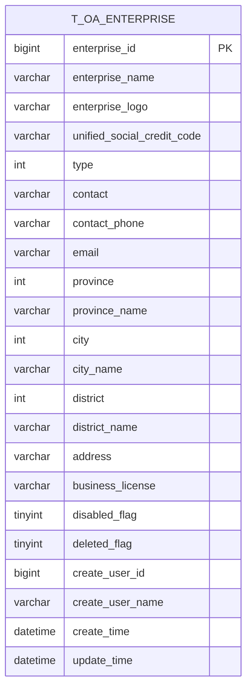
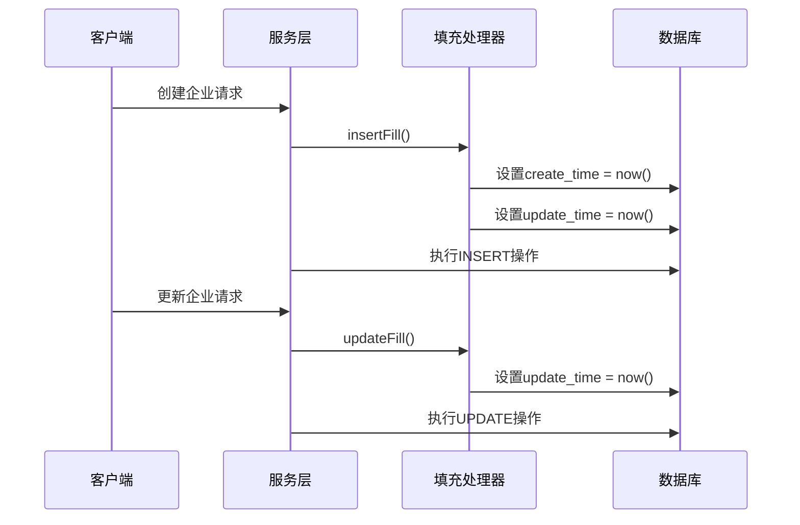
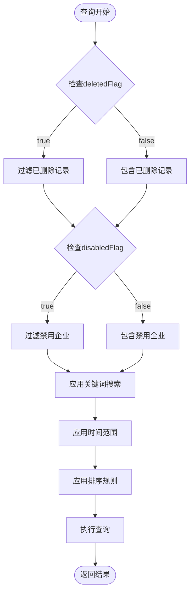
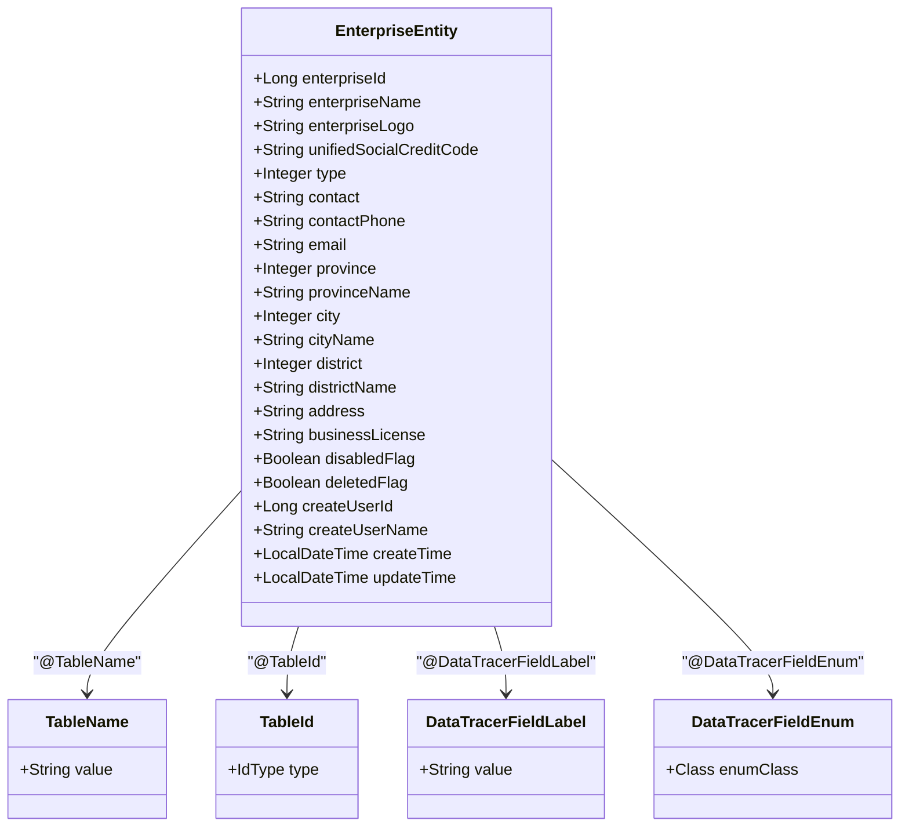
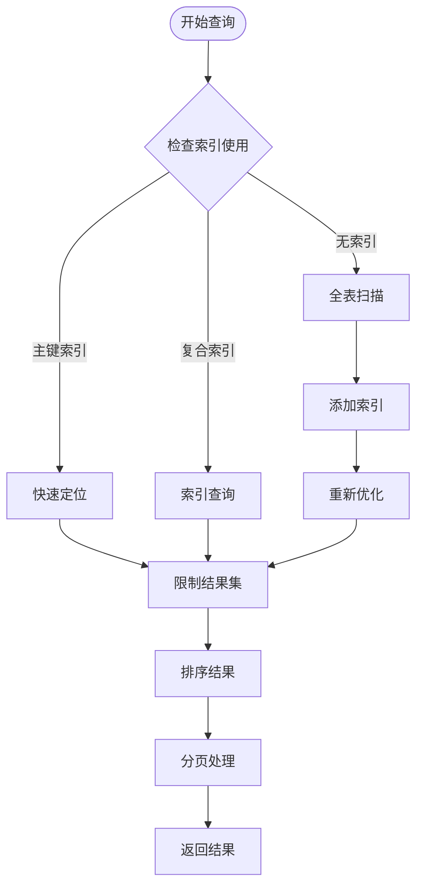

# 企业信息表结构

<cite>
**本文档引用的文件**
- [EnterpriseEntity.java](file://smart-admin-api-java17-springboot3/sa-admin/src/main/java/net/lab1024/sa/admin/module/business/oa/enterprise/domain/entity/EnterpriseEntity.java)
- [EnterpriseDao.java](file://smart-admin-api-java17-springboot3/sa-admin/src/main/java/net/lab1024/sa/admin/module/business/oa/enterprise/dao/EnterpriseDao.java)
- [EnterpriseMapper.xml](file://smart-admin-api-java17-springboot3/sa-admin/src/main/resources/mapper/business/oa/enterprise/EnterpriseMapper.xml)
- [EnterpriseService.java](file://smart-admin-api-java17-springboot3/sa-admin/src/main/java/net/lab1024/sa/admin/module/business/oa/enterprise/service/EnterpriseService.java)
- [EnterpriseQueryForm.java](file://smart-admin-api-java17-springboot3/sa-admin/src/main/java/net/lab1024/sa/admin/module/business/oa/enterprise/domain/form/EnterpriseQueryForm.java)
- [EnterpriseVO.java](file://smart-admin-api-java17-springboot3/sa-admin/src/main/java/net/lab1024/sa/admin/module/business/oa/enterprise/domain/vo/EnterpriseVO.java)
- [EnterpriseTypeEnum.java](file://smart-admin-api-java17-springboot3/sa-admin/src/main/java/net/lab1024/sa/admin/module/business/oa/enterprise/constant/EnterpriseTypeEnum.java)
- [MybatisPlusFillHandler.java](file://smart-admin-api-java17-springboot3/sa-base/src/main/java/net/lab1024/sa/base/handler/MybatisPlusFillHandler.java)
</cite>

## 目录
1. [概述](#概述)
2. [数据库表结构](#数据库表结构)
3. [核心字段详解](#核心字段详解)
4. [软删除机制](#软删除机制)
5. [时间戳管理](#时间戳管理)
6. [DAO层接口方法](#dao层接口方法)
7. [JPA注解与字段映射](#jpa注解与字段映射)
8. [分页查询优化](#分页查询优化)
9. [最佳实践建议](#最佳实践建议)

## 概述

企业信息表(`t_oa_enterprise`)是OA系统中的核心业务表，用于存储企业基本信息。该表采用软删除机制，支持企业信息的逻辑删除和禁用状态管理，同时具备完整的时间戳跟踪功能。

## 数据库表结构

### 表名与命名规范
- **表名**: `t_oa_enterprise`
- **命名规范**: 采用`t_模块名_业务名`的命名约定
- **主键**: 自增主键`enterprise_id`

### 字段设计架构

**图表来源**
- [EnterpriseEntity.java](file://smart-admin-api-java17-springboot3/sa-admin/src/main/java/net/lab1024/sa/admin/module/business/oa/enterprise/domain/entity/EnterpriseEntity.java#L24-L153)

## 核心字段详解

### 主键字段

| 字段名 | 数据类型 | 约束条件 | 说明 |
|--------|----------|----------|------|
| `enterprise_id` | `BIGINT` | PRIMARY KEY, AUTO_INCREMENT | 企业唯一标识符，自增主键 |

### 基础信息字段

| 字段名 | 数据类型 | 约束条件 | 说明 |
|--------|----------|----------|------|
| `enterprise_name` | `VARCHAR(255)` | NOT NULL | 企业名称，支持中文和英文 |
| `enterprise_logo` | `VARCHAR(255)` | NULLABLE | 企业logo图片路径 |
| `unified_social_credit_code` | `VARCHAR(18)` | NULLABLE | 统一社会信用代码 |
| `contact` | `VARCHAR(50)` | NULLABLE | 联系人姓名 |
| `contact_phone` | `VARCHAR(20)` | NULLABLE | 联系人电话号码 |
| `email` | `VARCHAR(100)` | NULLABLE | 企业邮箱地址 |

### 地理位置字段

| 字段名 | 数据类型 | 约束条件 | 说明 |
|--------|----------|----------|------|
| `province` | `INT` | NULLABLE | 省份编码 |
| `province_name` | `VARCHAR(50)` | NULLABLE | 省份名称 |
| `city` | `INT` | NULLABLE | 城市编码 |
| `city_name` | `VARCHAR(50)` | NULLABLE | 城市名称 |
| `district` | `INT` | NULLABLE | 区县编码 |
| `district_name` | `VARCHAR(50)` | NULLABLE | 区县名称 |
| `address` | `VARCHAR(255)` | NULLABLE | 详细地址 |

### 业务属性字段

| 字段名 | 数据类型 | 约束条件 | 说明 |
|--------|----------|----------|------|
| `type` | `INT` | NULLABLE | 企业类型，参考`EnterpriseTypeEnum`枚举 |
| `business_license` | `VARCHAR(255)` | NULLABLE | 营业执照图片路径 |

**章节来源**
- [EnterpriseEntity.java](file://smart-admin-api-java17-springboot3/sa-admin/src/main/java/net/lab1024/sa/admin/module/business/oa/enterprise/domain/entity/EnterpriseEntity.java#L29-L120)

## 软删除机制

### deletedFlag字段设计

`deleted_flag`字段用于实现逻辑删除功能，采用布尔型设计：

| 字段名 | 数据类型 | 默认值 | 说明 |
|--------|----------|--------|------|
| `deleted_flag` | `TINYINT(1)` | `0` | 删除标志位，0-未删除，1-已删除 |

#### 软删除特点
- **数据保留**: 删除操作仅更新`deleted_flag`，不物理删除数据
- **可恢复性**: 支持通过修改`deleted_flag`恢复被删除的企业
- **查询隔离**: 默认查询时自动过滤`deleted_flag=1`的记录

### disabledFlag字段设计

`disabled_flag`字段用于控制企业的启用/禁用状态：

| 字段名 | 数据类型 | 默认值 | 说明 |
|--------|----------|--------|------|
| `disabled_flag` | `TINYINT(1)` | `0` | 禁用标志位，0-启用，1-禁用 |

#### 禁用状态特点
- **临时停用**: 不影响历史数据查看
- **业务控制**: 可临时停止企业参与某些业务流程
- **状态保持**: 禁用状态下仍保留所有业务数据

### 软删除与禁用的区别对比

| 特性 | 软删除(deleted_flag) | 禁用状态(disabled_flag) |
|------|---------------------|------------------------|
| **目的** | 逻辑删除，标记数据不再显示 | 控制业务可用性 |
| **数据保留** | 完全保留，可恢复 | 完全保留，可恢复 |
| **查询行为** | 默认过滤，不显示 | 可选择性过滤 |
| **业务影响** | 彻底移除业务访问 | 限制业务功能 |
| **历史记录** | 保留完整历史 | 保留完整历史 |

**章节来源**
- [EnterpriseDao.java](file://smart-admin-api-java17-springboot3/sa-admin/src/main/java/net/lab1024/sa/admin/module/business/oa/enterprise/dao/EnterpriseDao.java#L37-L37)
- [EnterpriseMapper.xml](file://smart-admin-api-java17-springboot3/sa-admin/src/main/resources/mapper/business/oa/enterprise/EnterpriseMapper.xml#L4-L8)

## 时间戳管理

### createTime字段

| 字段名 | 数据类型 | 约束条件 | 说明 |
|--------|----------|----------|------|
| `create_time` | `DATETIME` | NOT NULL | 记录创建时间，默认值为当前时间 |

### updateTime字段

| 字段名 | 数据类型 | 约束条件 | 说明 |
|--------|----------|----------|------|
| `update_time` | `DATETIME` | NOT NULL | 记录最后更新时间 |

### 时间戳管理策略

#### 自动填充机制
系统通过`MybatisPlusFillHandler`实现自动时间戳填充：

**图表来源**
- [MybatisPlusFillHandler.java](file://smart-admin-api-java17-springboot3/sa-base/src/main/java/net/lab1024/sa/base/handler/MybatisPlusFillHandler.java#L20-L40)

#### 时间戳特性
- **精确度**: 支持毫秒级精度
- **自动维护**: 无需手动设置，系统自动处理
- **审计追踪**: 支持完整的数据变更审计

**章节来源**
- [MybatisPlusFillHandler.java](file://smart-admin-api-java17-springboot3/sa-base/src/main/java/net/lab1024/sa/base/handler/MybatisPlusFillHandler.java#L15-L40)
- [EnterpriseEntity.java](file://smart-admin-api-java17-springboot3/sa-admin/src/main/java/net/lab1024/sa/admin/module/business/oa/enterprise/domain/entity/EnterpriseEntity.java#L147-L152)

## DAO层接口方法

### 核心CRUD方法

#### 查询方法

| 方法名 | 参数 | 返回值 | 功能描述 |
|--------|------|--------|----------|
| `queryById` | `Long enterpriseId` | `EnterpriseEntity` | 根据ID查询企业详情 |
| `queryByEnterpriseName` | `String enterpriseName, Long excludeEnterpriseId, Boolean deletedFlag` | `EnterpriseEntity` | 根据企业名称查询 |
| `queryPage` | `Page page, EnterpriseQueryForm queryForm` | `List<EnterpriseVO>` | 分页查询企业列表 |
| `getDetail` | `Long enterpriseId, Boolean deletedFlag` | `EnterpriseVO` | 获取企业详细信息 |
| `queryList` | `Integer type, Boolean disabledFlag, Boolean deletedFlag` | `List<EnterpriseListVO>` | 查询企业列表 |

#### 修改方法

| 方法名 | 参数 | 功能描述 |
|--------|------|----------|
| `update` | `EnterpriseEntity entity` | 更新企业信息 |
| `deleteEnterprise` | `Long enterpriseId, Boolean deletedFlag` | 逻辑删除企业 |

#### 导出方法

| 方法名 | 参数 | 返回值 | 功能描述 |
|--------|------|--------|----------|
| `selectExcelExportData` | `EnterpriseQueryForm queryForm` | `List<EnterpriseExcelVO>` | 查询导出数据 |

### 查询条件组合

**图表来源**
- [EnterpriseMapper.xml](file://smart-admin-api-java17-springboot3/sa-admin/src/main/resources/mapper/business/oa/enterprise/EnterpriseMapper.xml#L20-L67)

**章节来源**
- [EnterpriseDao.java](file://smart-admin-api-java17-springboot3/sa-admin/src/main/java/net/lab1024/sa/admin/module/business/oa/enterprise/dao/EnterpriseDao.java#L28-L61)
- [EnterpriseMapper.xml](file://smart-admin-api-java17-springboot3/sa-admin/src/main/resources/mapper/business/oa/enterprise/EnterpriseMapper.xml#L1-L89)

## JPA注解与字段映射

### 实体类注解配置

#### @Data注解
- **作用**: 自动生成getter/setter、toString、equals、hashCode方法
- **位置**: 类级别注解

#### @TableName注解
- **作用**: 指定数据库表名
- **参数**: `"t_oa_enterprise"`
- **位置**: 类级别注解

#### @TableId注解
- **作用**: 标识主键字段
- **参数**: `type = IdType.AUTO`
- **位置**: `enterpriseId`字段

#### @DataTracerFieldLabel注解
- **作用**: 为字段添加标签，用于数据追踪
- **位置**: 多个业务字段

#### @DataTracerFieldEnum注解
- **作用**: 关联枚举类型，用于字段值的国际化显示
- **参数**: `enumClass = EnterpriseTypeEnum.class`
- **位置**: `type`字段

### 字段映射关系

**图表来源**
- [EnterpriseEntity.java](file://smart-admin-api-java17-springboot3/sa-admin/src/main/java/net/lab1024/sa/admin/module/business/oa/enterprise/domain/entity/EnterpriseEntity.java#L22-L153)

**章节来源**
- [EnterpriseEntity.java](file://smart-admin-api-java17-springboot3/sa-admin/src/main/java/net/lab1024/sa/admin/module/business/oa/enterprise/domain/entity/EnterpriseEntity.java#L22-L153)

## 分页查询优化

### SQL查询优化策略

#### 索引设计建议

| 索引类型 | 字段组合 | 用途 | 性能提升 |
|----------|----------|------|----------|
| **主键索引** | `enterprise_id` | 唯一标识查询 | O(log n) |
| **普通索引** | `deleted_flag` | 软删除过滤 | O(log n) |
| **复合索引** | `(deleted_flag, disabled_flag)` | 状态组合查询 | O(log n) |
| **全文索引** | `enterprise_name, contact, contact_phone` | 关键词搜索 | O(1) |
| **范围索引** | `(create_time, enterprise_id)` | 时间分页查询 | O(log n) |

#### 查询条件优化

**图表来源**
- [EnterpriseMapper.xml](file://smart-admin-api-java17-springboot3/sa-admin/src/main/resources/mapper/business/oa/enterprise/EnterpriseMapper.xml#L20-L67)

### 查询性能优化技巧

#### 1. 条件组合优化
- **优先级排序**: `deleted_flag` → `disabled_flag` → `keywords` → `time_range`
- **避免全表扫描**: 确保查询条件能利用现有索引
- **合理使用LIMIT**: 避免返回过多数据

#### 2. 分页查询优化
- **深度分页问题**: 使用基于游标的分页替代OFFSET LIMIT
- **缓存策略**: 对频繁查询的结果进行缓存
- **结果集限制**: 设置合理的最大返回条数

#### 3. 关键词搜索优化
- **LIKE优化**: 使用`INSTR()`函数替代`LIKE '%keyword%'`
- **全文检索**: 对于复杂搜索场景考虑使用全文索引
- **前缀匹配**: 优先匹配企业名称前缀

**章节来源**
- [EnterpriseMapper.xml](file://smart-admin-api-java17-springboot3/sa-admin/src/main/resources/mapper/business/oa/enterprise/EnterpriseMapper.xml#L20-L67)
- [EnterpriseService.java](file://smart-admin-api-java17-springboot3/sa-admin/src/main/java/net/lab1024/sa/admin/module/business/oa/enterprise/service/EnterpriseService.java#L66-L71)

## 最佳实践建议

### 数据完整性保障

#### 1. 业务验证规则
- **企业名称唯一性**: 在创建和更新时验证企业名称不重复
- **必填字段校验**: 确保关键字段如企业名称、联系人等不能为空
- **格式验证**: 对电话号码、邮箱地址等字段进行格式校验

#### 2. 状态管理建议
- **默认状态**: 新创建的企业默认启用状态(`disabled_flag=0`)
- **删除策略**: 建议采用软删除而非物理删除
- **状态切换**: 提供明确的状态切换日志记录

### 性能优化建议

#### 1. 查询优化
- **索引策略**: 为常用查询字段建立合适的索引
- **查询缓存**: 对静态数据查询结果进行缓存
- **分页策略**: 实现基于游标的高效分页

#### 2. 数据维护
- **定期清理**: 清理长期未使用的软删除数据
- **归档策略**: 对历史数据进行归档处理
- **监控告警**: 监控查询性能和数据增长趋势

### 安全性考虑

#### 1. 数据保护
- **敏感信息**: 对企业联系方式等敏感信息进行脱敏处理
- **访问控制**: 实现基于角色的数据访问权限控制
- **审计追踪**: 记录所有数据变更操作

#### 2. 业务安全
- **并发控制**: 在企业关联操作中使用同步机制
- **事务管理**: 确保数据一致性，特别是在批量操作中
- **异常处理**: 完善的错误处理和回滚机制

### 扩展性设计

#### 1. 枚举扩展
- **类型枚举**: 支持未来新增企业类型
- **状态枚举**: 为新的业务状态预留扩展空间
- **国际化支持**: 考虑多语言环境下的字段显示

#### 2. 功能扩展
- **附件管理**: 支持更多类型的附件上传和管理
- **地理位置**: 集成更详细的地理信息服务
- **业务关联**: 与其他业务模块的深度集成

**章节来源**
- [EnterpriseService.java](file://smart-admin-api-java17-springboot3/sa-admin/src/main/java/net/lab1024/sa/admin/module/business/oa/enterprise/service/EnterpriseService.java#L95-L140)
- [EnterpriseTypeEnum.java](file://smart-admin-api-java17-springboot3/sa-admin/src/main/java/net/lab1024/sa/admin/module/business/oa/enterprise/constant/EnterpriseTypeEnum.java#L15-L46)