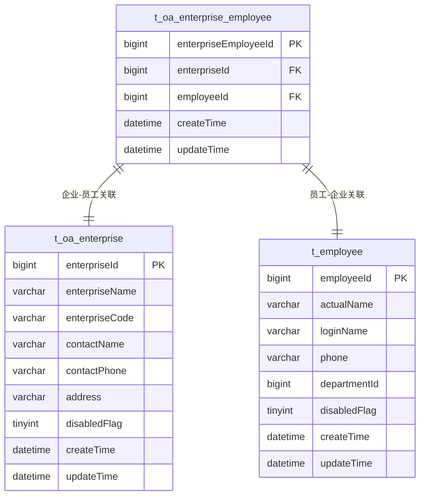
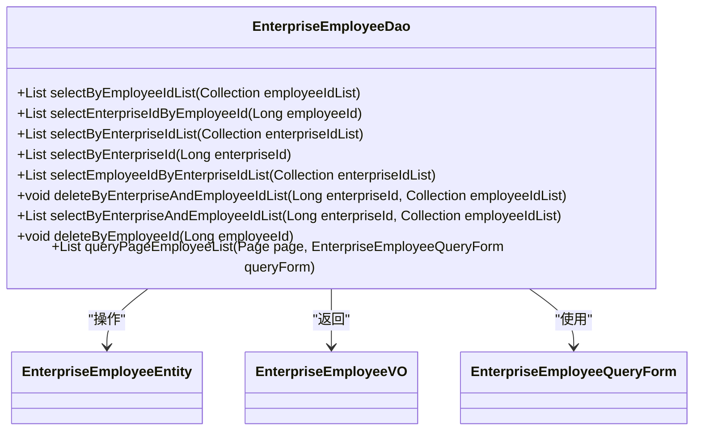
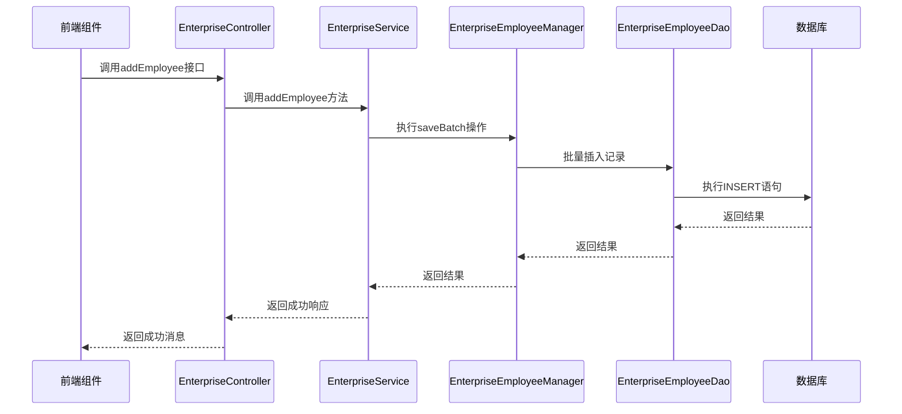
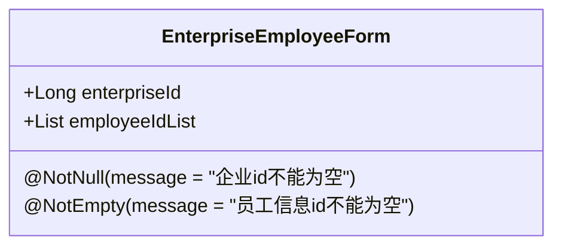
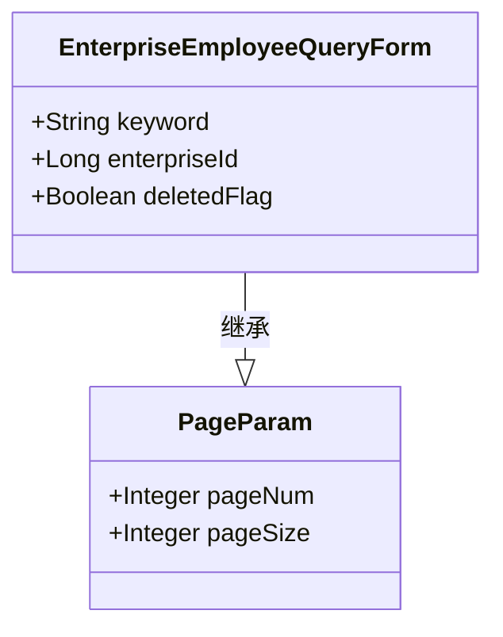
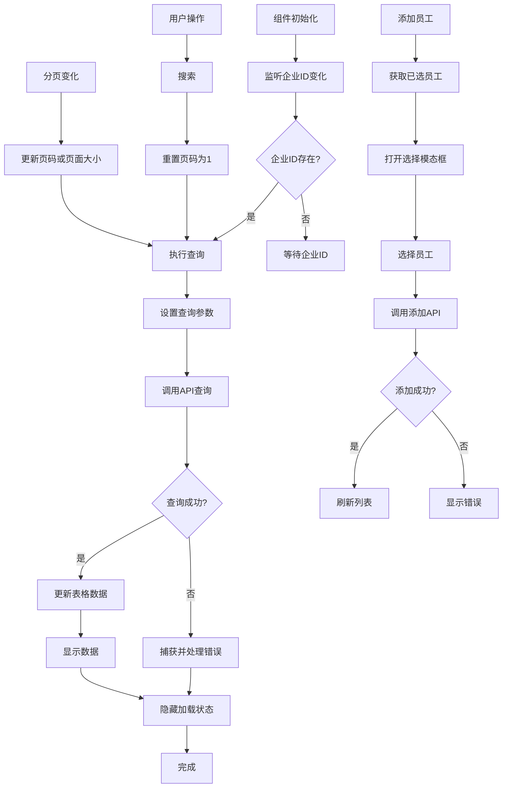

# 企业员工关联管理

<cite>
**本文档引用文件**  
- [EnterpriseEmployeeEntity.java](file://smart-admin-api-java17-springboot3/sa-admin/src/main/java/net/lab1024/sa/admin/module/business/oa/enterprise/domain/entity/EnterpriseEmployeeEntity.java)
- [EnterpriseEmployeeDao.java](file://smart-admin-api-java17-springboot3/sa-admin/src/main/java/net/lab1024/sa/admin/module/business/oa/enterprise/dao/EnterpriseEmployeeDao.java)
- [EnterpriseEmployeeManager.java](file://smart-admin-api-java17-springboot3/sa-admin/src/main/java/net/lab1024/sa/admin/module/business/oa/enterprise/manager/EnterpriseEmployeeManager.java)
- [EnterpriseEmployeeForm.java](file://smart-admin-api-java17-springboot3/sa-admin/src/main/java/net/lab1024/sa/admin/module/business/oa/enterprise/domain/form/EnterpriseEmployeeForm.java)
- [EnterpriseEmployeeQueryForm.java](file://smart-admin-api-java17-springboot3/sa-admin/src/main/java/net/lab1024/sa/admin/module/business/oa/enterprise/domain/form/EnterpriseEmployeeQueryForm.java)
- [EnterpriseEmployeeVO.java](file://smart-admin-api-java17-springboot3/sa-admin/src/main/java/net/lab1024/sa/admin/module/business/oa/enterprise/domain/vo/EnterpriseEmployeeVO.java)
- [EnterpriseController.java](file://smart-admin-api-java17-springboot3/sa-admin/src/main/java/net/lab1024/sa/admin/module/business/oa/enterprise/controller/EnterpriseController.java)
- [enterprise-api.js](file://smart-admin-web-javascript/src/api/business/oa/enterprise-api.js)
- [enterprise-employee-list.vue](file://smart-admin-web-javascript/src/views/business/oa/enterprise/components/enterprise-employee-list.vue)
- [EnterpriseEmployeeMapper.xml](file://smart-admin-api-java17-springboot3/sa-admin/src/main/resources/mapper/business/oa/enterprise/EnterpriseEmployeeMapper.xml)
</cite>

## 目录
1. [简介](#简介)
2. [实体模型设计](#实体模型设计)
3. [数据访问层实现](#数据访问层实现)
4. [业务逻辑层实现](#业务逻辑层实现)
5. [表单对象设计](#表单对象设计)
6. [前端组件实现](#前端组件实现)
7. [实际应用场景](#实际应用场景)
8. [总结](#总结)

## 简介
本文档详细描述了企业员工关联管理模块的设计与实现。该模块实现了企业与员工之间的多对多关系管理，支持企业批量分配员工、查询企业下所有员工信息等核心功能。系统采用分层架构设计，包含实体层、数据访问层、业务逻辑层和前端展示层，确保了数据的一致性和操作的可靠性。

## 实体模型设计

企业员工关联通过 `EnterpriseEmployeeEntity` 实体类实现，采用多对多关系模型。该实体作为连接企业与员工的中间表，存储企业ID和员工ID的关联关系。



**实体属性说明：**
- `enterpriseEmployeeId`：主键，自增ID
- `enterpriseId`：企业ID，外键关联企业表
- `employeeId`：员工ID，外键关联员工表
- `createTime`：创建时间
- `updateTime`：更新时间

**Diagram sources**
- [EnterpriseEmployeeEntity.java](file://smart-admin-api-java17-springboot3/sa-admin/src/main/java/net/lab1024/sa/admin/module/business/oa/enterprise/domain/entity/EnterpriseEmployeeEntity.java#L25-L35)

**Section sources**
- [EnterpriseEmployeeEntity.java](file://smart-admin-api-java17-springboot3/sa-admin/src/main/java/net/lab1024/sa/admin/module/business/oa/enterprise/domain/entity/EnterpriseEmployeeEntity.java#L1-L52)

## 数据访问层实现

`EnterpriseEmployeeDao` 接口继承自 MyBatis-Plus 的 `BaseMapper`，提供了对企业员工关联数据的增删改查操作。通过 XML 映射文件实现复杂的查询逻辑。

### 主要数据访问方法

| 方法名 | 参数 | 返回值 | 功能描述 |
|-------|------|-------|---------|
| selectByEnterpriseId | Long enterpriseId | List<EnterpriseEmployeeEntity> | 根据企业ID查询所有关联员工 |
| selectByEmployeeIdList | Collection<Long> employeeIdList | List<EnterpriseEmployeeVO> | 根据员工ID列表查询关联企业信息 |
| selectByEnterpriseIdList | Collection<Long> enterpriseIdList | List<EnterpriseEmployeeVO> | 根据企业ID列表查询关联员工信息 |
| deleteByEnterpriseAndEmployeeIdList | Long enterpriseId, Collection<Long> employeeIdList | void | 根据企业ID和员工ID列表删除关联关系 |
| selectByEnterpriseAndEmployeeIdList | Long enterpriseId, Collection<Long> employeeIdList | List<EnterpriseEmployeeEntity> | 根据企业ID和员工ID列表查询关联关系 |
| queryPageEmployeeList | Page<?>, EnterpriseEmployeeQueryForm | List<EnterpriseEmployeeVO> | 分页查询企业员工列表 |



**Diagram sources**
- [EnterpriseEmployeeDao.java](file://smart-admin-api-java17-springboot3/sa-admin/src/main/java/net/lab1024/sa/admin/module/business/oa/enterprise/dao/EnterpriseEmployeeDao.java#L24-L68)
- [EnterpriseEmployeeMapper.xml](file://smart-admin-api-java17-springboot3/sa-admin/src/main/resources/mapper/business/oa/enterprise/EnterpriseEmployeeMapper.xml#L1-L94)

**Section sources**
- [EnterpriseEmployeeDao.java](file://smart-admin-api-java17-springboot3/sa-admin/src/main/java/net/lab1024/sa/admin/module/business/oa/enterprise/dao/EnterpriseEmployeeDao.java#L1-L70)
- [EnterpriseEmployeeMapper.xml](file://smart-admin-api-java17-springboot3/sa-admin/src/main/resources/mapper/business/oa/enterprise/EnterpriseEmployeeMapper.xml#L1-L94)

## 业务逻辑层实现

`EnterpriseEmployeeManager` 类继承自 MyBatis-Plus 的 `ServiceImpl`，提供了对企业员工关联的事务管理。该层负责处理核心业务逻辑，确保数据的一致性和完整性。

### 事务管理与数据一致性

业务逻辑层通过 `@Service` 注解声明为Spring服务组件，利用Spring的事务管理机制确保操作的原子性。当批量绑定或解绑员工时，所有数据库操作都在同一个事务中执行，如果任何操作失败，整个事务将回滚，保证数据的一致性。



**Diagram sources**
- [EnterpriseEmployeeManager.java](file://smart-admin-api-java17-springboot3/sa-admin/src/main/java/net/lab1024/sa/admin/module/business/oa/enterprise/manager/EnterpriseEmployeeManager.java#L1-L19)
- [EnterpriseController.java](file://smart-admin-api-java17-springboot3/sa-admin/src/main/java/net/lab1024/sa/admin/module/business/oa/enterprise/controller/EnterpriseController.java#L112-L135)

**Section sources**
- [EnterpriseEmployeeManager.java](file://smart-admin-api-java17-springboot3/sa-admin/src/main/java/net/lab1024/sa/admin/module/business/oa/enterprise/manager/EnterpriseEmployeeManager.java#L1-L19)

## 表单对象设计

### EnterpriseEmployeeForm
该表单对象用于企业员工关联操作的参数传递，包含企业ID和员工ID列表两个核心字段。



### EnterpriseEmployeeQueryForm
该查询表单继承自分页参数基类，用于分页查询企业员工列表。



**Diagram sources**
- [EnterpriseEmployeeForm.java](file://smart-admin-api-java17-springboot3/sa-admin/src/main/java/net/lab1024/sa/admin/module/business/oa/enterprise/domain/form/EnterpriseEmployeeForm.java#L19-L29)
- [EnterpriseEmployeeQueryForm.java](file://smart-admin-api-java17-springboot3/sa-admin/src/main/java/net/lab1024/sa/admin/module/business/oa/enterprise/domain/form/EnterpriseEmployeeQueryForm.java#L18-L33)

**Section sources**
- [EnterpriseEmployeeForm.java](file://smart-admin-api-java17-springboot3/sa-admin/src/main/java/net/lab1024/sa/admin/module/business/oa/enterprise/domain/form/EnterpriseEmployeeForm.java#L1-L29)
- [EnterpriseEmployeeQueryForm.java](file://smart-admin-api-java17-springboot3/sa-admin/src/main/java/net/lab1024/sa/admin/module/business/oa/enterprise/domain/form/EnterpriseEmployeeQueryForm.java#L1-L33)

## 前端组件实现

`enterprise-employee-list.vue` 组件实现了企业员工列表的展示和操作功能，包括分页加载、搜索、添加和移除员工等操作。

### 展示逻辑与分页机制

组件使用 Ant Design Vue 的表格组件展示数据，通过 `queryForm` 对象管理查询参数，包括页码、页面大小、企业ID和搜索关键词。分页通过 `a-pagination` 组件实现，支持页码跳转和每页显示数量选择。



### 操作按钮事件处理

#### 添加员工
1. 点击"添加员工"按钮
2. 调用 `addEmployee` 方法
3. 获取当前企业已关联的员工ID列表
4. 打开员工选择模态框并传入已选员工
5. 用户选择员工后触发 `selectData` 回调
6. 调用 `addEmployee` API 添加关联
7. 添加成功后刷新员工列表

#### 移除员工
- **单个移除**：点击"移除"按钮，弹出确认对话框，确认后调用 `deleteEmployee` API
- **批量移除**：勾选多个员工，点击"批量移除"按钮，弹出确认对话框，确认后调用 `deleteEmployee` API

```javascript
// 伪代码示例
async function deleteEmployee(employeeId) {
    // 显示确认对话框
    Modal.confirm({
        title: '提示',
        content: '确定要删除该企业下的员工么？',
        async onOk() {
            try {
                // 调用删除API
                await enterpriseApi.deleteEmployee({
                    employeeIdList: [employeeId],
                    enterpriseId: props.enterpriseId
                });
                message.success('移除成功');
                // 刷新列表
                await queryEmployee();
            } catch (e) {
                smartSentry.captureError(e);
            }
        }
    });
}
```

**Diagram sources**
- [enterprise-employee-list.vue](file://smart-admin-web-javascript/src/views/business/oa/enterprise/components/enterprise-employee-list.vue#L1-L293)
- [enterprise-api.js](file://smart-admin-web-javascript/src/api/business/oa/enterprise-api.js)

**Section sources**
- [enterprise-employee-list.vue](file://smart-admin-web-javascript/src/views/business/oa/enterprise/components/enterprise-employee-list.vue#L1-L293)

## 实际应用场景

### 为企业批量分配员工

**API调用方式：**
```http
POST /oa/enterprise/employee/add
Content-Type: application/json

{
    "enterpriseId": 1001,
    "employeeIdList": [2001, 2002, 2003, 2004]
}
```

**响应数据结构：**
```json
{
    "code": 0,
    "data": "添加成功",
    "msg": null,
    "success": true
}
```

### 查询某企业下所有员工信息

**API调用方式：**
```http
POST /oa/enterprise/employee/queryPage
Content-Type: application/json

{
    "enterpriseId": 1001,
    "keyword": "张三",
    "pageNum": 1,
    "pageSize": 10
}
```

**响应数据结构：**
```json
{
    "code": 0,
    "data": {
        "list": [
            {
                "enterpriseEmployeeId": 1,
                "enterpriseId": 1001,
                "enterpriseName": "测试企业",
                "employeeId": 2001,
                "loginName": "zhangsan",
                "actualName": "张三",
                "phone": "13800138001",
                "departmentId": 3001,
                "departmentName": "技术部",
                "disabledFlag": false
            }
        ],
        "total": 1,
        "pageNum": 1,
        "pageSize": 10,
        "pages": 1
    },
    "msg": null,
    "success": true
}
```

**Section sources**
- [EnterpriseController.java](file://smart-admin-api-java17-springboot3/sa-admin/src/main/java/net/lab1024/sa/admin/module/business/oa/enterprise/controller/EnterpriseController.java#L112-L135)
- [enterprise-api.js](file://smart-admin-web-javascript/src/api/business/oa/enterprise-api.js)

## 总结
企业员工关联管理模块通过精心设计的实体模型、数据访问层、业务逻辑层和前端组件，实现了企业与员工之间的多对多关系管理。系统采用分层架构，确保了代码的可维护性和扩展性。通过事务管理保证了数据的一致性，通过分页查询和搜索功能提升了用户体验。该模块为企业的组织架构管理提供了可靠的技术支持，能够满足企业批量分配员工、查询员工信息等核心业务需求。