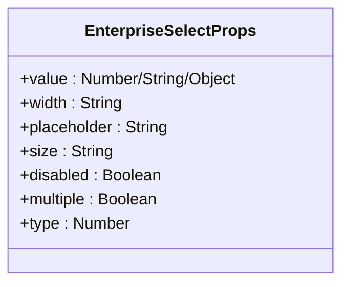
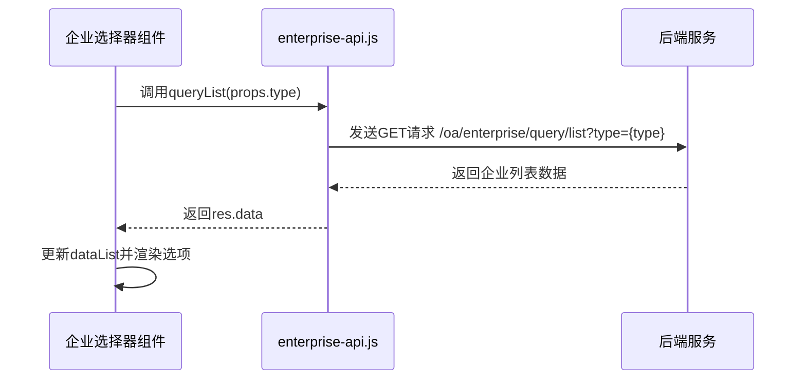
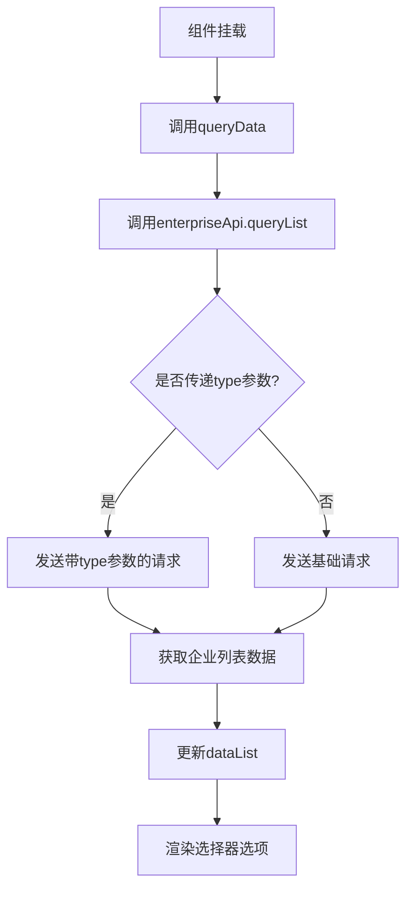
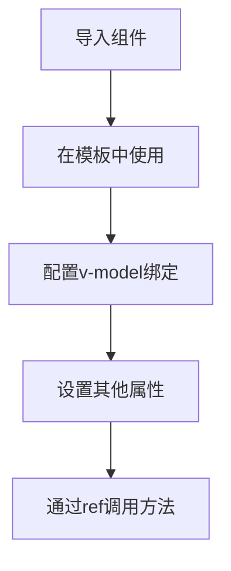
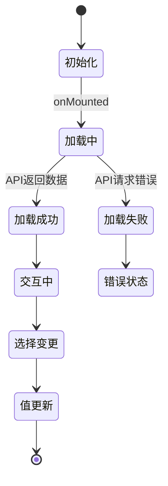

# 企业选择器

<cite>
**本文档引用的文件**
- [enterprise-select/index.vue](file://smart-admin-web-javascript\src\components\business\oa\enterprise-select\index.vue)
- [enterprise-api.js](file://smart-admin-web-javascript\src\api\business\oa\enterprise-api.js)
- [enterprise-const.js](file://smart-admin-web-javascript\src\constants\business\oa\enterprise-const.js)
- [enterprise-operate-modal.vue](file://smart-admin-web-javascript\src\views\business\oa\enterprise\components\enterprise-operate-modal.vue)
</cite>

## 目录
1. [简介](#简介)
2. [核心功能](#核心功能)
3. [属性配置](#属性配置)
4. [API集成](#api集成)
5. [数据加载与缓存](#数据加载与缓存)
6. [使用示例](#使用示例)
7. [错误处理与状态反馈](#错误处理与状态反馈)
8. [结论](#结论)

## 简介
企业选择器是一个基础选择器组件，用于在表单中选择企业信息。该组件封装了企业数据的获取、展示和选择功能，支持单选和多选模式，可灵活配置样式和行为。组件通过集成企业API服务，实现了与后端系统的无缝对接，确保数据的实时性和准确性。

**Section sources**
- [enterprise-select/index.vue](file://smart-admin-web-javascript\src\components\business\oa\enterprise-select\index.vue)

## 核心功能
企业选择器作为基础选择器，提供了以下核心功能：
- 支持单选和多选模式
- 可配置的宽度、大小和占位符
- 禁用状态控制
- 类型过滤功能
- 响应式数据绑定

组件在初始化时自动加载企业列表数据，并通过v-model实现双向数据绑定，确保选中值的实时同步。选择器采用Ant Design Vue的a-select组件作为基础，提供了良好的用户体验和丰富的交互功能。

**Section sources**
- [enterprise-select/index.vue](file://smart-admin-web-javascript\src\components\business\oa\enterprise-select\index.vue)

## 属性配置
企业选择器通过props接收多种配置参数，以满足不同的使用场景需求。



**Diagram sources**
- [enterprise-select/index.vue](file://smart-admin-web-javascript\src\components\business\oa\enterprise-select\index.vue)

### 属性说明
| 属性名 | 类型 | 默认值 | 说明 |
|-------|------|-------|------|
| value | Number/String/Object | - | 绑定值，通过v-model双向绑定 |
| width | String | '200px' | 选择器宽度 |
| placeholder | String | '请选择' | 未选择时的占位提示 |
| size | String | 'default' | 选择器大小（default/small/large） |
| disabled | Boolean | false | 是否禁用选择器 |
| multiple | Boolean | false | 是否支持多选 |
| type | Number | - | 企业类型过滤（对应ENTERPRISE_TYPE_ENUM） |

**Section sources**
- [enterprise-select/index.vue](file://smart-admin-web-javascript\src\components\business\oa\enterprise-select\index.vue)

## API集成
企业选择器与enterprise-api.js中的getEnterpriseList接口（实际为queryList方法）紧密集成，实现了企业数据的获取和展示。



**Diagram sources**
- [enterprise-select/index.vue](file://smart-admin-web-javascript\src\components\business\oa\enterprise-select\index.vue)
- [enterprise-api.js](file://smart-admin-web-javascript\src\api\business\oa\enterprise-api.js)

### 请求参数映射
当组件初始化或需要刷新数据时，会调用enterpriseApi.queryList方法，将props.type作为查询参数传递：

- **请求方法**: GET
- **请求路径**: /oa/enterprise/query/list
- **查询参数**: type（可选）
- **响应数据**: res.data（企业列表数组）

企业类型枚举值定义在enterprise-const.js中，包括：
- NORMAL: 1 (有限企业)
- FOREIGN: 2 (外资企业)

**Section sources**
- [enterprise-api.js](file://smart-admin-web-javascript\src\api\business\oa\enterprise-api.js)
- [enterprise-const.js](file://smart-admin-web-javascript\src\constants\business\oa\enterprise-const.js)

## 数据加载与缓存
企业选择器实现了高效的数据加载和缓存管理机制，确保用户体验的流畅性。

### 数据加载策略
组件在onMounted生命周期钩子中调用queryData方法，异步获取企业列表数据：

1. 调用enterpriseApi.queryList方法获取数据
2. 将响应数据赋值给dataList响应式变量
3. 自动渲染为选择器选项



**Diagram sources**
- [enterprise-select/index.vue](file://smart-admin-web-javascript\src\components\business\oa\enterprise-select\index.vue)

### 缓存管理
目前组件在每次加载时都会重新请求数据，未实现本地缓存机制。这意味着：
- 每次组件实例化都会触发API调用
- 相同页面中多个企业选择器会分别请求数据
- 数据实时性高，但可能增加服务器负载

**Section sources**
- [enterprise-select/index.vue](file://smart-admin-web-javascript\src\components\business\oa\enterprise-select\index.vue)

## 使用示例
企业选择器在OA模块的表单中有广泛应用，以下是具体的使用示例。

### 基本使用
在企业表单中使用企业选择器的典型代码：



**Diagram sources**
- [enterprise-operate-modal.vue](file://smart-admin-web-javascript\src\views\business\oa\enterprise\components\enterprise-operate-modal.vue)

### 代码示例
```vue
<template>
  <!-- 单选模式 -->
  <enterprise-select 
    v-model="selectedEnterprise" 
    placeholder="请选择企业" 
    :width="'300px'"
    ref="enterpriseSelector"
  />
  
  <!-- 多选模式 -->
  <enterprise-select 
    v-model="selectedEnterprises" 
    multiple
    placeholder="请选择企业" 
  />
  
  <!-- 按类型过滤 -->
  <enterprise-select 
    v-model="foreignEnterprise" 
    :type="ENTERPRISE_TYPE_ENUM.FOREIGN.value"
    placeholder="请选择外资企业" 
  />
</template>

<script setup>
import { ref, defineAsyncComponent } from 'vue';
import { ENTERPRISE_TYPE_ENUM } from '/@/constants/business/oa/enterprise-const';

// 引入企业选择器组件
const enterpriseSelect = defineAsyncComponent(() => import('/@/components/business/oa/enterprise-select/index.vue'));

// 绑定选中值
const selectedEnterprise = ref(null);
const selectedEnterprises = ref([]);
const foreignEnterprise = ref(null);

// 组件引用
const enterpriseSelector = ref(null);

// 手动刷新数据
function refreshEnterpriseList() {
  if (enterpriseSelector.value) {
    enterpriseSelector.value.queryData();
  }
}
</script>
```

**Section sources**
- [enterprise-operate-modal.vue](file://smart-admin-web-javascript\src\views\business\oa\enterprise\components\enterprise-operate-modal.vue)

## 错误处理与状态反馈
企业选择器内置了基本的错误处理和状态反馈机制，确保用户操作的可感知性。

### 错误处理
虽然组件本身没有显式的错误处理代码，但通过以下方式间接处理错误：
- 使用async/await语法处理异步请求
- 依赖enterprise-api.js的全局错误处理机制
- Ant Design Vue选择器组件自带的验证功能

### 加载状态反馈
目前组件没有显式的加载状态指示，用户在数据加载时无法感知请求状态。这是组件的一个改进点，建议添加：
- 加载中状态指示器
- 错误状态提示
- 空数据状态展示



**Diagram sources**
- [enterprise-select/index.vue](file://smart-admin-web-javascript\src\components\business\oa\enterprise-select\index.vue)

## 结论
企业选择器作为一个基础选择器组件，成功实现了企业信息的选择功能。组件通过简洁的API设计和良好的集成性，为OA模块的表单开发提供了便利。其主要特点包括：

1. **灵活的属性配置**：支持多种样式和行为的自定义
2. **无缝的API集成**：与enterprise-api.js紧密配合，实现数据的实时获取
3. **双向数据绑定**：通过v-model实现选中值的自动同步
4. **类型过滤功能**：支持按企业类型进行数据过滤

建议的改进方向：
- 添加加载状态指示
- 实现数据缓存机制以减少重复请求
- 增加防抖搜索功能以支持大型企业列表
- 完善错误处理和用户反馈机制

**Section sources**
- [enterprise-select/index.vue](file://smart-admin-web-javascript\src\components\business\oa\enterprise-select\index.vue)
- [enterprise-api.js](file://smart-admin-web-javascript\src\api\business\oa\enterprise-api.js)
- [enterprise-const.js](file://smart-admin-web-javascript\src\constants\business\oa\enterprise-const.js)