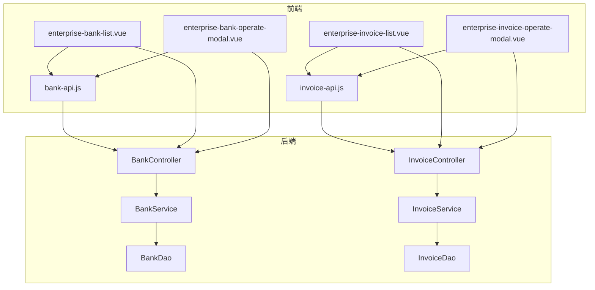
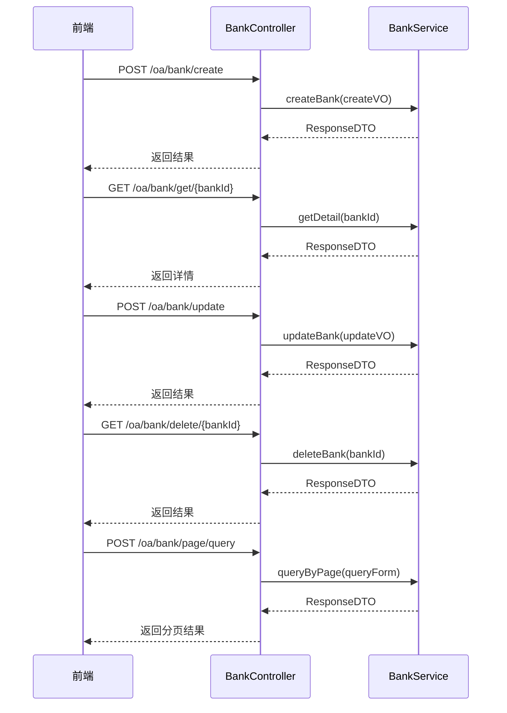
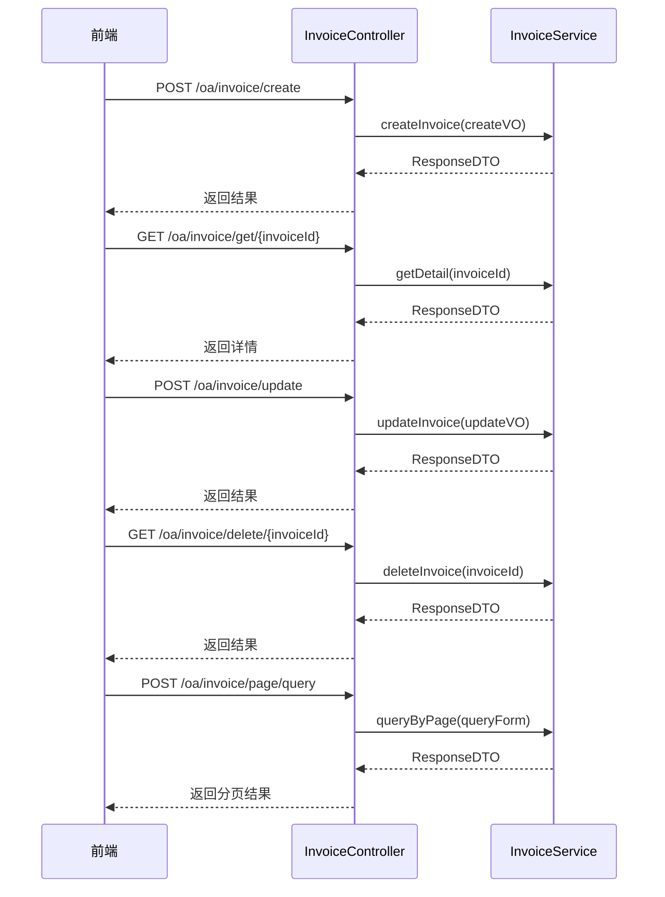
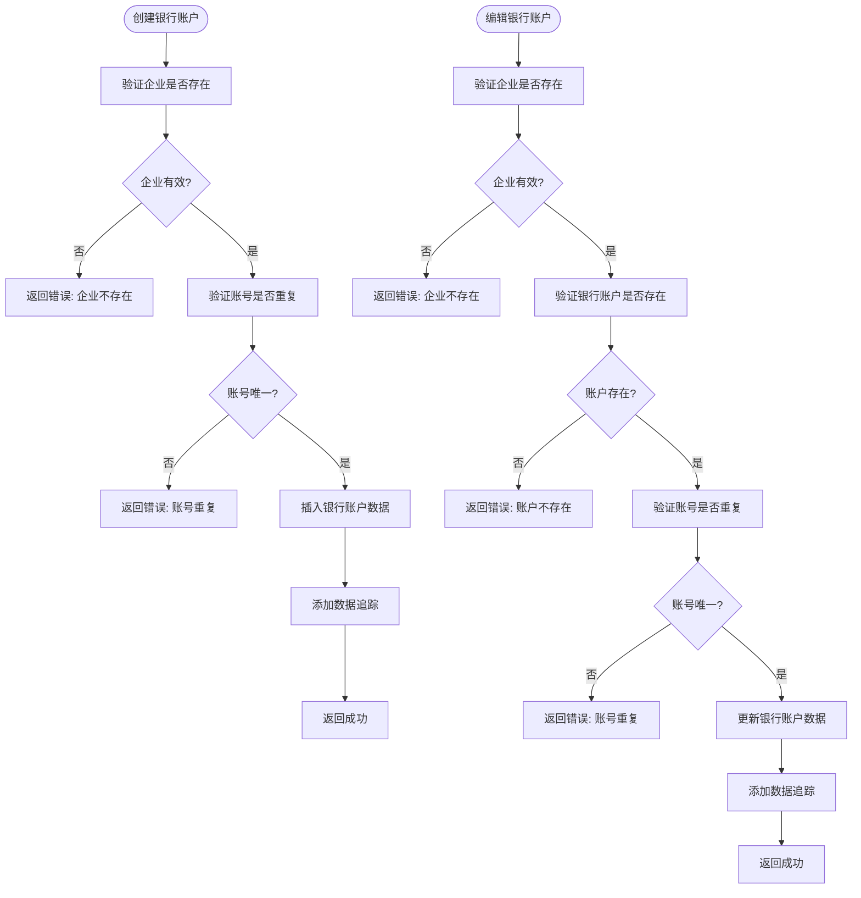
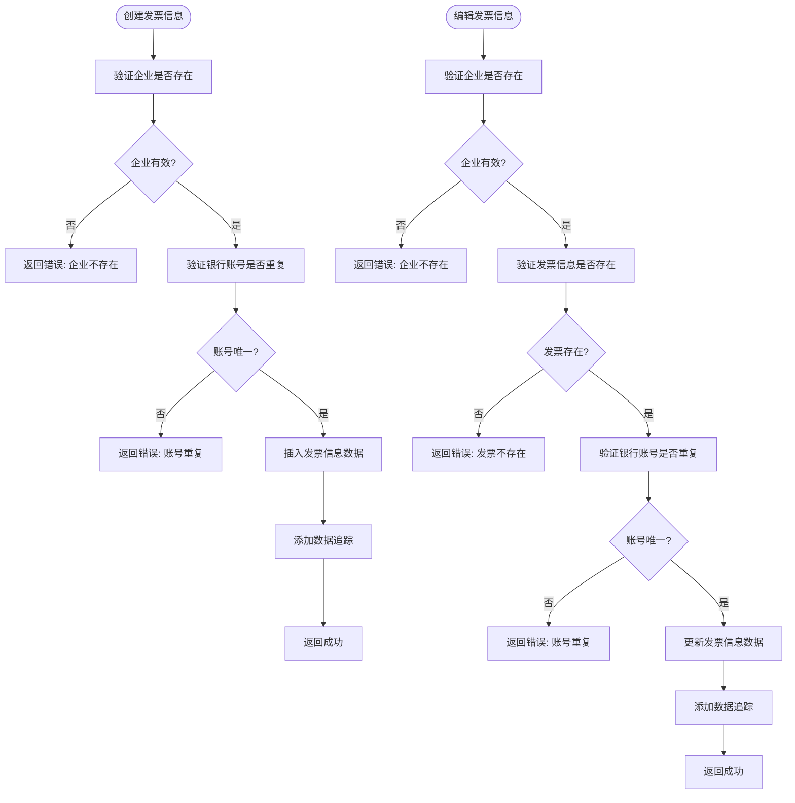
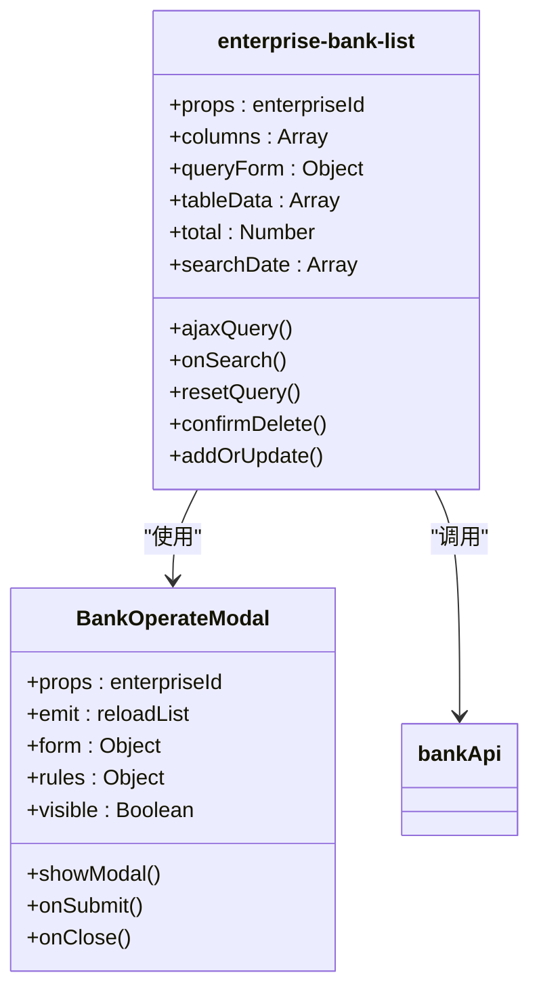
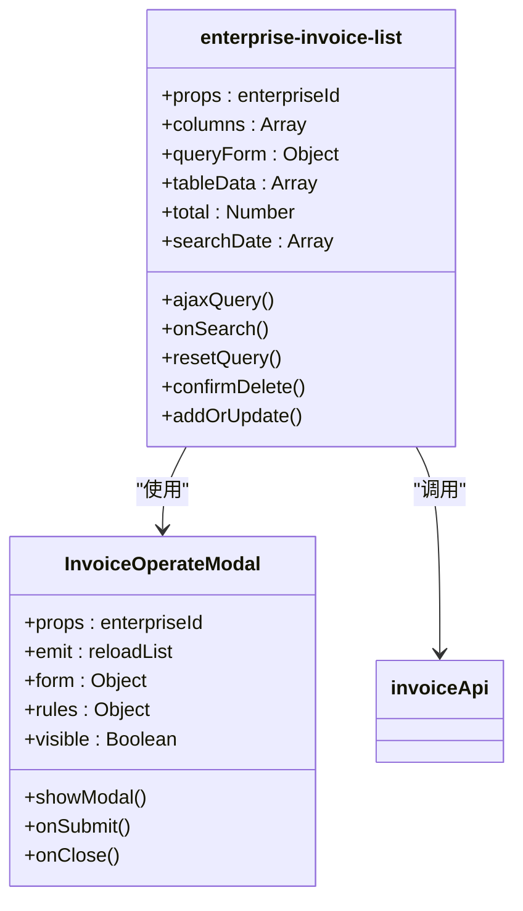
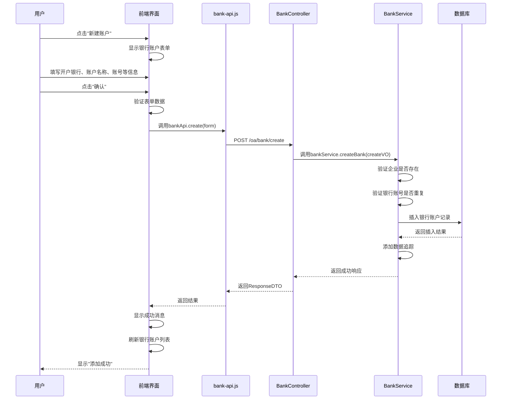
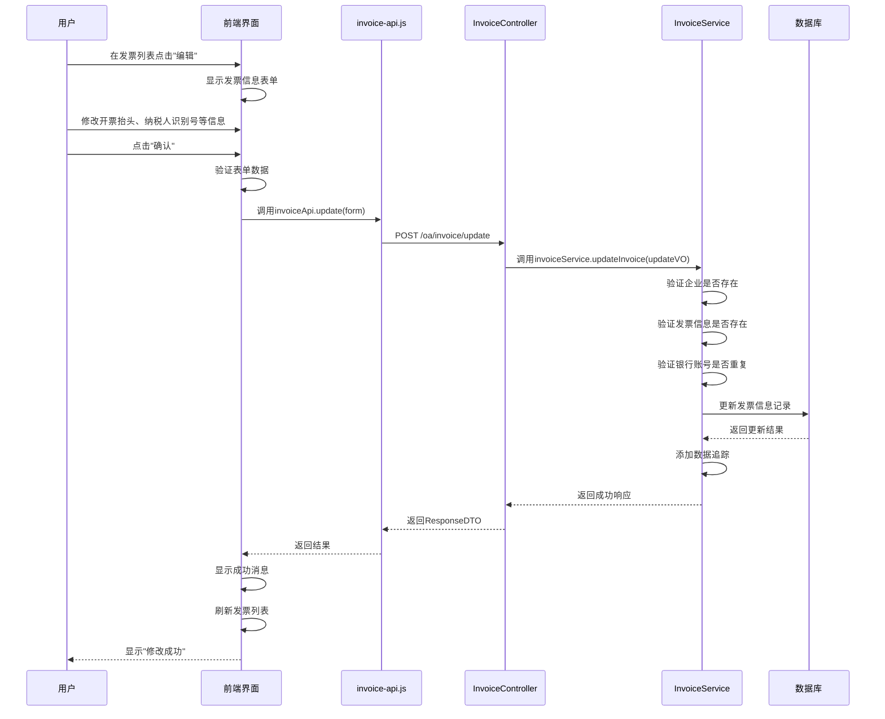
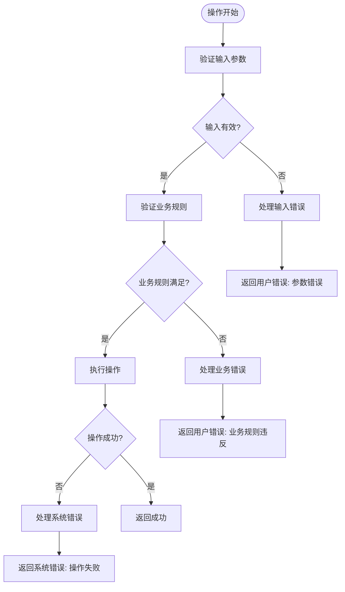

# 企业银行账户与发票管理

<cite>
**本文档引用文件**  
- [BankController.java](file://smart-admin-api-java17-springboot3/sa-admin/src/main/java/net/lab1024/sa/admin/module/business/oa/bank/controller/BankController.java)
- [InvoiceController.java](file://smart-admin-api-java17-springboot3/sa-admin/src/main/java/net/lab1024/sa/admin/module/business/oa/invoice/controller/InvoiceController.java)
- [BankService.java](file://smart-admin-api-java17-springboot3/sa-admin/src/main/java/net/lab1024/sa/admin/module/business/oa/bank/service/BankService.java)
- [InvoiceService.java](file://smart-admin-api-java17-springboot3/sa-admin/src/main/java/net/lab1024/sa/admin/module/business/oa/invoice/service/InvoiceService.java)
- [BankCreateForm.java](file://smart-admin-api-java17-springboot3/sa-admin/src/main/java/net/lab1024/sa/admin/module/business/oa/bank/domain/BankCreateForm.java)
- [InvoiceAddForm.java](file://smart-admin-api-java17-springboot3/sa-admin/src/main/java/net/lab1024/sa/admin/module/business/oa/invoice/domain/InvoiceAddForm.java)
- [bank-api.js](file://smart-admin-web-javascript/src/api/business/oa/bank-api.js)
- [invoice-api.js](file://smart-admin-web-javascript/src/api/business/oa/invoice-api.js)
- [enterprise-bank-list.vue](file://smart-admin-web-javascript/src/views/business/oa/enterprise/components/enterprise-bank-list.vue)
- [enterprise-invoice-list.vue](file://smart-admin-web-javascript/src/views/business/oa/enterprise/components/enterprise-invoice-list.vue)
- [enterprise-bank-operate-modal.vue](file://smart-admin-web-javascript/src/views/business/oa/enterprise/components/enterprise-bank-operate-modal.vue)
- [enterprise-invoice-operate-modal.vue](file://smart-admin-web-javascript/src/views/business/oa/enterprise/components/enterprise-invoice-operate-modal.vue)
</cite>

## 目录
1. [系统架构概述](#系统架构概述)
2. [后端接口设计](#后端接口设计)
3. [业务服务逻辑](#业务服务逻辑)
4. [前端组件分析](#前端组件分析)
5. [典型使用案例](#典型使用案例)
6. [数据约束与错误处理](#数据约束与错误处理)

## 系统架构概述

本系统采用前后端分离架构，后端基于Spring Boot 3框架实现RESTful API接口，前端使用Vue 3框架构建用户界面。企业银行账户和发票管理功能通过独立的控制器和服务层实现，确保了业务逻辑的清晰分离。

**图表来源**
- [enterprise-bank-list.vue](file://smart-admin-web-javascript/src/views/business/oa/enterprise/components/enterprise-bank-list.vue)
- [enterprise-invoice-list.vue](file://smart-admin-web-javascript/src/views/business/oa/enterprise/components/enterprise-invoice-list.vue)
- [BankController.java](file://smart-admin-api-java17-springboot3/sa-admin/src/main/java/net/lab1024/sa/admin/module/business/oa/bank/controller/BankController.java)
- [InvoiceController.java](file://smart-admin-api-java17-springboot3/sa-admin/src/main/java/net/lab1024/sa/admin/module/business/oa/invoice/controller/InvoiceController.java)

## 后端接口设计

企业银行账户和发票管理的后端接口设计遵循RESTful规范，通过EnterpriseController提供完整的CRUD操作。

### 银行账户接口

**图表来源**
- [BankController.java](file://smart-admin-api-java17-springboot3/sa-admin/src/main/java/net/lab1024/sa/admin/module/business/oa/bank/controller/BankController.java)

### 发票管理接口

**图表来源**
- [InvoiceController.java](file://smart-admin-api-java17-springboot3/sa-admin/src/main/java/net/lab1024/sa/admin/module/business/oa/invoice/controller/InvoiceController.java)

## 业务服务逻辑

### 银行账户服务逻辑

**图表来源**
- [BankService.java](file://smart-admin-api-java17-springboot3/sa-admin/src/main/java/net/lab1024/sa/admin/module/business/oa/bank/service/BankService.java)

### 发票管理服务逻辑

**图表来源**
- [InvoiceService.java](file://smart-admin-api-java17-springboot3/sa-admin/src/main/java/net/lab1024/sa/admin/module/business/oa/invoice/service/InvoiceService.java)

## 前端组件分析

### 列表组件分析

#### 银行账户列表组件

**图表来源**
- [enterprise-bank-list.vue](file://smart-admin-web-javascript/src/views/business/oa/enterprise/components/enterprise-bank-list.vue)
- [bank-api.js](file://smart-admin-web-javascript/src/api/business/oa/bank-api.js)

#### 发票列表组件

**图表来源**
- [enterprise-invoice-list.vue](file://smart-admin-web-javascript/src/views/business/oa/enterprise/components/enterprise-invoice-list.vue)
- [invoice-api.js](file://smart-admin-web-javascript/src/api/business/oa/invoice-api.js)

## 典型使用案例

### 新增企业银行账户

**图表来源**
- [enterprise-bank-operate-modal.vue](file://smart-admin-web-javascript/src/views/business/oa/enterprise/components/enterprise-bank-operate-modal.vue)
- [BankService.java](file://smart-admin-api-java17-springboot3/sa-admin/src/main/java/net/lab1024/sa/admin/module/business/oa/bank/service/BankService.java)

### 修改发票信息

**图表来源**
- [enterprise-invoice-operate-modal.vue](file://smart-admin-web-javascript/src/views/business/oa/enterprise/components/enterprise-invoice-operate-modal.vue)
- [InvoiceService.java](file://smart-admin-api-java17-springboot3/sa-admin/src/main/java/net/lab1024/sa/admin/module/business/oa/invoice/service/InvoiceService.java)

## 数据约束与错误处理

### 数据字段约束

| 模块 | 字段 | 约束条件 | 最大长度 | 是否必填 |
|------|------|----------|----------|----------|
| 银行账户 | 开户银行 | 非空 | 200字符 | 是 |
| 银行账户 | 账户名称 | 非空 | 200字符 | 是 |
| 银行账户 | 账号 | 非空 | 200字符 | 是 |
| 银行账户 | 是否对公 | 非空 | - | 是 |
| 银行账户 | 备注 | - | 500字符 | 否 |
| 发票信息 | 开票抬头 | 非空 | 200字符 | 是 |
| 发票信息 | 纳税人识别号 | 非空 | 200字符 | 是 |
| 发票信息 | 银行账户 | 非空 | 200字符 | 是 |
| 发票信息 | 开户行 | 非空 | 200字符 | 是 |
| 发票信息 | 备注 | - | 500字符 | 否 |

**图表来源**
- [BankCreateForm.java](file://smart-admin-api-java17-springboot3/sa-admin/src/main/java/net/lab1024/sa/admin/module/business/oa/bank/domain/BankCreateForm.java)
- [InvoiceAddForm.java](file://smart-admin-api-java17-springboot3/sa-admin/src/main/java/net/lab1024/sa/admin/module/business/oa/invoice/domain/InvoiceAddForm.java)

### 错误处理机制

**图表来源**
- [BankService.java](file://smart-admin-api-java17-springboot3/sa-admin/src/main/java/net/lab1024/sa/admin/module/business/oa/bank/service/BankService.java)
- [InvoiceService.java](file://smart-admin-api-java17-springboot3/sa-admin/src/main/java/net/lab1024/sa/admin/module/business/oa/invoice/service/InvoiceService.java)

**章节来源**
- [BankController.java](file://smart-admin-api-java17-springboot3/sa-admin/src/main/java/net/lab1024/sa/admin/module/business/oa/bank/controller/BankController.java)
- [InvoiceController.java](file://smart-admin-api-java17-springboot3/sa-admin/src/main/java/net/lab1024/sa/admin/module/business/oa/invoice/controller/InvoiceController.java)
- [BankService.java](file://smart-admin-api-java17-springboot3/sa-admin/src/main/java/net/lab1024/sa/admin/module/business/oa/bank/service/BankService.java)
- [InvoiceService.java](file://smart-admin-api-java17-springboot3/sa-admin/src/main/java/net/lab1024/sa/admin/module/business/oa/invoice/service/InvoiceService.java)
- [enterprise-bank-list.vue](file://smart-admin-web-javascript/src/views/business/oa/enterprise/components/enterprise-bank-list.vue)
- [enterprise-invoice-list.vue](file://smart-admin-web-javascript/src/views/business/oa/enterprise/components/enterprise-invoice-list.vue)
- [enterprise-bank-operate-modal.vue](file://smart-admin-web-javascript/src/views/business/oa/enterprise/components/enterprise-bank-operate-modal.vue)
- [enterprise-invoice-operate-modal.vue](file://smart-admin-web-javascript/src/views/business/oa/enterprise/components/enterprise-invoice-operate-modal.vue)