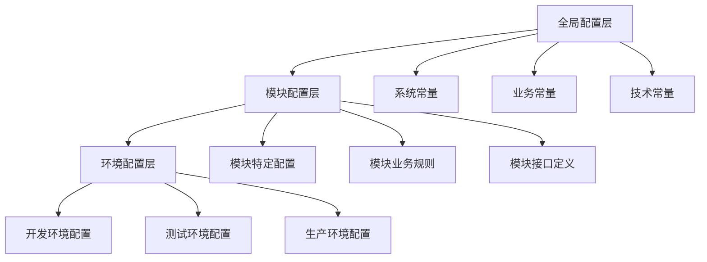

# 🌐 IOE-DREAM项目全局变量和配置规范

**版本**: v1.0
**创建时间**: 2025-11-17
**适用范围**: 全项目
**规范等级**: 🔴 一级规范 - 必须遵循

---

## 📋 规范概览

### 🎯 核心目标

建立统一的全局变量和配置管理规范，确保整个项目的配置一致性、可维护性和可扩展性。

### 📚 适用范围

- 所有业务模块的常量定义
- 全局配置项管理
- 环境相关配置
- 业务规则配置
- 系统参数配置

---

## 🏗️ 配置架构设计

### 三层配置架构



### 配置优先级

1. **环境配置** > 模块配置 > 全局配置
2. **运行时配置** > 静态配置
3. **外部配置** > 内部配置

---

## 📦 全局常量定义规范

### 1. 系统级常量

#### 1.1 响应码常量
```java
/**
 * 系统统一响应码常量
 */
public final class ResponseCodeConst {

    /** 私有构造器，防止实例化 */
    private ResponseCodeConst() {
        throw new UnsupportedOperationException("常量类不能被实例化");
    }

    // ==================== 成功响应 ====================

    /** 操作成功 */
    public static final int SUCCESS = 200;

    /** 创建成功 */
    public static final int CREATED = 201;

    /** 请求已接受 */
    public static final int ACCEPTED = 202;

    /** 无内容 */
    public static final int NO_CONTENT = 204;

    // ==================== 客户端错误 ====================

    /** 请求参数错误 */
    public static final int BAD_REQUEST = 400;

    /** 未授权 */
    public static final int UNAUTHORIZED = 401;

    /** 权限不足 */
    public static final int FORBIDDEN = 403;

    /** 资源不存在 */
    public static final int NOT_FOUND = 404;

    /** 请求方法不允许 */
    public static final int METHOD_NOT_ALLOWED = 405;

    /** 请求冲突 */
    public static final int CONFLICT = 409;

    /** 请求实体过大 */
    public static final int PAYLOAD_TOO_LARGE = 413;

    /** 请求过于频繁 */
    public static final int TOO_MANY_REQUESTS = 429;

    // ==================== 服务器错误 ====================

    /** 服务器内部错误 */
    public static final int INTERNAL_SERVER_ERROR = 500;

    /** 功能未实现 */
    public static final int NOT_IMPLEMENTED = 501;

    /** 服务不可用 */
    public static final int SERVICE_UNAVAILABLE = 503;

    // ==================== 业务错误码范围 ====================

    /** 业务错误码起始值 */
    public static final int BUSINESS_ERROR_START = 1000;

    /** 业务错误码结束值 */
    public static final int BUSINESS_ERROR_END = 9999;

    // ==================== 模块错误码范围定义 ====================

    /** 用户模块错误码范围: 1001-1999 */
    public static final int USER_MODULE_START = 1001;
    public static final int USER_MODULE_END = 1999;

    /** 权限模块错误码范围: 2001-2999 */
    public static final int PERMISSION_MODULE_START = 2001;
    public static final int PERMISSION_MODULE_END = 2999;

    /** 门禁模块错误码范围: 3001-3999 */
    public static final int ACCESS_MODULE_START = 3001;
    public static final int ACCESS_MODULE_END = 3999;

    /** 消费模块错误码范围: 4001-4999 */
    public static final int CONSUME_MODULE_START = 4001;
    public static final int CONSUME_MODULE_END = 4999;

    /** 考勤模块错误码范围: 5001-5999 */
    public static final int ATTENDANCE_MODULE_START = 5001;
    public static final int ATTENDANCE_MODULE_END = 5999;

    /** 设备模块错误码范围: 6001-6999 */
    public static final int DEVICE_MODULE_START = 6001;
    public static final int DEVICE_MODULE_END = 6999;

    /** 文件模块错误码范围: 7001-7999 */
    public static final int FILE_MODULE_START = 7001;
    public static final int FILE_MODULE_END = 7999;

    /** 系统模块错误码范围: 8001-8999 */
    public static final int SYSTEM_MODULE_START = 8001;
    public static final int SYSTEM_MODULE_END = 8999;
}
```

#### 1.2 响应消息常量
```java
/**
 * 系统统一响应消息常量
 */
public final class ResponseStringConst {

    /** 私有构造器，防止实例化 */
    private ResponseStringConst() {
        throw new UnsupportedOperationException("常量类不能被实例化");
    }

    // ==================== 成功消息 ====================

    /** 操作成功 */
    public static final String SUCCESS = "操作成功";

    /** 保存成功 */
    public static final String SAVE_SUCCESS = "保存成功";

    /** 更新成功 */
    public static final String UPDATE_SUCCESS = "更新成功";

    /** 删除成功 */
    public static final String DELETE_SUCCESS = "删除成功";

    /** 创建成功 */
    public static final String CREATE_SUCCESS = "创建成功";

    /** 上传成功 */
    public static final String UPLOAD_SUCCESS = "上传成功";

    /** 导出成功 */
    public static final String EXPORT_SUCCESS = "导出成功";

    /** 导入成功 */
    public static final String IMPORT_SUCCESS = "导入成功";

    /** 登录成功 */
    public static final String LOGIN_SUCCESS = "登录成功";

    /** 退出成功 */
    public static final String LOGOUT_SUCCESS = "退出成功";

    // ==================== 失败消息 ====================

    /** 操作失败 */
    public static final String OPERATION_FAILED = "操作失败";

    /** 保存失败 */
    public static final String SAVE_FAILED = "保存失败";

    /** 更新失败 */
    public static final String UPDATE_FAILED = "更新失败";

    /** 删除失败 */
    public static final String DELETE_FAILED = "删除失败";

    /** 创建失败 */
    public static final String CREATE_FAILED = "创建失败";

    /** 上传失败 */
    public static final String UPLOAD_FAILED = "上传失败";

    /** 导出失败 */
    public static final String EXPORT_FAILED = "导出失败";

    /** 导入失败 */
    public static final String IMPORT_FAILED = "导入失败";

    /** 登录失败 */
    public static final String LOGIN_FAILED = "登录失败";

    // ==================== 参数错误消息 ====================

    /** 参数不能为空 */
    public static final String PARAM_NOT_NULL = "参数不能为空";

    /** 参数格式错误 */
    public static final String PARAM_FORMAT_ERROR = "参数格式错误";

    /** 参数值超出范围 */
    public static final String PARAM_OUT_OF_RANGE = "参数值超出范围";

    /** 必填参数缺失 */
    public static final String REQUIRED_PARAM_MISSING = "必填参数缺失";

    // ==================== 权限相关消息 ====================

    /** 权限不足 */
    public static final String PERMISSION_DENIED = "权限不足";

    /** 未登录 */
    public static final String NOT_LOGGED_IN = "未登录";

    /** 登录已过期 */
    public static final String LOGIN_EXPIRED = "登录已过期";

    /** 账号被禁用 */
    public static final String ACCOUNT_DISABLED = "账号被禁用";

    /** 账号被锁定 */
    public static final String ACCOUNT_LOCKED = "账号被锁定";

    // ==================== 业务相关消息 ====================

    /** 数据不存在 */
    public static final String DATA_NOT_FOUND = "数据不存在";

    /** 数据已存在 */
    public static final String DATA_ALREADY_EXISTS = "数据已存在";

    /** 数据状态错误 */
    public static final String DATA_STATUS_ERROR = "数据状态错误";

    /** 数据已被使用 */
    public static final String DATA_IN_USE = "数据已被使用";

    /** 操作频率过高 */
    public static final String OPERATION_TOO_FREQUENT = "操作频率过高";

    // ==================== 系统相关消息 ====================

    /** 系统繁忙 */
    public static final String SYSTEM_BUSY = "系统繁忙，请稍后重试";

    /** 系统维护中 */
    public static final String SYSTEM_MAINTENANCE = "系统维护中";

    /** 服务不可用 */
    public static final String SERVICE_UNAVAILABLE = "服务不可用";

    /** 网络异常 */
    public static final String NETWORK_ERROR = "网络异常";

    /** 未知错误 */
    public static final String UNKNOWN_ERROR = "未知错误";
}
```

#### 1.3 技术配置常量
```java
/**
 * 技术配置常量
 */
public final class TechConfigConst {

    /** 私有构造器，防止实例化 */
    private TechConfigConst() {
        throw new UnsupportedOperationException("常量类不能被实例化");
    }

    // ==================== 数据库配置 ====================

    /** 默认页大小 */
    public static final int DEFAULT_PAGE_SIZE = 20;

    /** 最大页大小 */
    public static final int MAX_PAGE_SIZE = 200;

    /** 最小页大小 */
    public static final int MIN_PAGE_SIZE = 1;

    /** 默认页码 */
    public static final int DEFAULT_PAGE_NUM = 1;

    /** 批量操作最大数量 */
    public static final int BATCH_OPERATION_MAX_SIZE = 1000;

    /** 批量操作最小数量 */
    public static final int BATCH_OPERATION_MIN_SIZE = 1;

    // ==================== 缓存配置 ====================

    /** 缓存键分隔符 */
    public static final String CACHE_KEY_SEPARATOR = ":";

    /** 缓存默认过期时间(秒) */
    public static final int CACHE_DEFAULT_TTL = 1800; // 30分钟

    /** 缓存最长过期时间(秒) */
    public static final int CACHE_MAX_TTL = 86400; // 24小时

    /** 缓存最短过期时间(秒) */
    public static final int CACHE_MIN_TTL = 60; // 1分钟

    // ==================== 文件配置 ====================

    /** 文件上传最大大小(MB) */
    public static final long FILE_MAX_SIZE_MB = 100L;

    /** 文件上传最大大小(字节) */
    public static final long FILE_MAX_SIZE_BYTES = FILE_MAX_SIZE_MB * 1024 * 1024;

    /** 允许的文件扩展名 */
    public static final String[] ALLOWED_FILE_EXTENSIONS = {
        ".jpg", ".jpeg", ".png", ".gif", ".bmp", ".webp",  // 图片
        ".doc", ".docx", ".xls", ".xlsx", ".ppt", ".pptx", // Office文档
        ".pdf", ".txt", ".csv",                              // 文档
        ".zip", ".rar", ".7z", ".tar", ".gz"                // 压缩文件
    };

    /** 文件存储路径 */
    public static final String FILE_STORAGE_PATH = "/upload/files";

    // ==================== 安全配置 ====================

    /** 密码最小长度 */
    public static final int PASSWORD_MIN_LENGTH = 8;

    /** 密码最大长度 */
    public static final int PASSWORD_MAX_LENGTH = 20;

    /** 用户名最小长度 */
    public static final int USERNAME_MIN_LENGTH = 3;

    /** 用户名最大长度 */
    public static final int USERNAME_MAX_LENGTH = 50;

    /** 登录失败最大次数 */
    public static final int LOGIN_MAX_FAILED_ATTEMPTS = 5;

    /** 登录锁定时间(分钟) */
    public static final int LOGIN_LOCK_MINUTES = 30;

    // ==================== 时间配置 ====================

    /** 时间格式 - 标准 */
    public static final String DATETIME_FORMAT = "yyyy-MM-dd HH:mm:ss";

    /** 时间格式 - 简化 */
    public static final String DATE_FORMAT = "yyyy-MM-dd";

    /** 时间格式 - 详细 */
    public static final String DATETIME_FORMAT_DETAIL = "yyyy-MM-dd HH:mm:ss.SSS";

    /** 时区 */
    public static final String TIMEZONE = "Asia/Shanghai";

    // ==================== 编码配置 ====================

    /** 默认字符编码 */
    public static final String DEFAULT_CHARSET = "UTF-8";

    /** URL编码 */
    public static final String URL_ENCODING = "UTF-8";

    // ==================== HTTP配置 ====================

    /** HTTP连接超时时间(毫秒) */
    public static final int HTTP_CONNECT_TIMEOUT = 5000;

    /** HTTP读取超时时间(毫秒) */
    public static final int HTTP_READ_TIMEOUT = 10000;

    /** HTTP最大连接数 */
    public static final int HTTP_MAX_CONNECTIONS = 200;

    /** HTTP最大连接池大小 */
    public static final int HTTP_MAX_POOL_SIZE = 50;
}
```

### 2. 模块常量模板

#### 2.1 模块常量基类
```java
/**
 * 模块常量基类
 */
public abstract class BaseModuleConst {

    /** 私有构造器，防止实例化 */
    private BaseModuleConst() {
        throw new UnsupportedOperationException("常量类不能被实例化");
    }

    /**
     * 获取模块名称
     */
    public abstract String getModuleName();

    /**
     * 获取模块前缀
     */
    public abstract String getModulePrefix();

    /**
     * 获取模块错误码起始值
     */
    public abstract int getErrorStartCode();

    /**
     * 获取模块错误码结束值
     */
    public abstract int getErrorEndCode();
}
```

#### 2.2 消费模块常量示例
```java
/**
 * 消费模块常量定义
 */
public final class ConsumeConst extends BaseModuleConst {

    // ==================== 模块基础信息 ====================

    /** 模块名称 */
    public static final String MODULE_NAME = "consume";

    /** 模块前缀 */
    public static final String MODULE_PREFIX = "CONSUME";

    // ==================== 错误码定义 ====================

    /** 消费记录不存在 */
    public static final int ERROR_CONSUME_RECORD_NOT_FOUND = 4001;

    /** 账户余额不足 */
    public static final int ERROR_ACCOUNT_BALANCE_INSUFFICIENT = 4002;

    /** 消费金额无效 */
    public static final int ERROR_CONSUME_AMOUNT_INVALID = 4003;

    /** 设备不存在 */
    public static final int ERROR_DEVICE_NOT_FOUND = 4004;

    /** 设备未启用 */
    public static final int ERROR_DEVICE_NOT_ENABLED = 4005;

    /** 消费类型不支持 */
    public static final int ERROR_CONSUME_TYPE_NOT_SUPPORTED = 4006;

    /** 重复消费 */
    public static final int ERROR_DUPLICATE_CONSUME = 4007;

    // ==================== 缓存键定义 ====================

    /** 缓存键前缀 */
    public static final String CACHE_PREFIX = "consume:";

    /** 账户余额缓存 */
    public static final String CACHE_ACCOUNT_BALANCE = "account:balance:";

    /** 消费记录缓存 */
    public static final String CACHE_CONSUME_RECORD = "record:";

    /** 设备状态缓存 */
    public static final String CACHE_DEVICE_STATUS = "device:status:";

    // ==================== 业务状态常量 ====================

    /** 消费状态 - 成功 */
    public static final int CONSUME_STATUS_SUCCESS = 1;

    /** 消费状态 - 失败 */
    public static final int CONSUME_STATUS_FAILED = 0;

    /** 消费状态 - 处理中 */
    public static final int CONSUME_STATUS_PROCESSING = 2;

    /** 消费状态 - 已退款 */
    public static final int CONSUME_STATUS_REFUNDED = 3;

    // ==================== 消费类型定义 ====================

    /** 固定金额消费 */
    public static final String CONSUME_TYPE_FIXED = "FIXED";

    /** 自由金额消费 */
    public static final String CONSUME_TYPE_FREE = "FREE";

    /** 商品消费 */
    public static final String CONSUME_TYPE_PRODUCT = "PRODUCT";

    /** 计量消费 */
    public static final String CONSUME_TYPE_METERING = "METERING";

    // ==================== 权限定义 ====================

    /** 消费记录查询权限 */
    public static final String PERMISSION_CONSUME_QUERY = "consume:query";

    /** 消费记录新增权限 */
    public static final String PERMISSION_CONSUME_ADD = "consume:add";

    /** 消费记录更新权限 */
    public static final String PERMISSION_CONSUME_UPDATE = "consume:update";

    /** 消费记录删除权限 */
    public static final String PERMISSION_CONSUME_DELETE = "consume:delete";

    /** 消费记录导出权限 */
    public static final String PERMISSION_CONSUME_EXPORT = "consume:export";

    /** 账户管理权限 */
    public static final String PERMISSION_ACCOUNT_MANAGE = "consume:account:manage";

    /** 设备管理权限 */
    public static final String PERMISSION_DEVICE_MANAGE = "consume:device:manage";

    // ==================== 配置参数 ====================

    /** 单次消费最大金额 */
    public static final BigDecimal MAX_SINGLE_CONSUME_AMOUNT = new BigDecimal("10000.00");

    /** 单日消费最大金额 */
    public static final BigDecimal MAX_DAILY_CONSUME_AMOUNT = new BigDecimal("50000.00");

    /** 消费记录保存年限(年) */
    public static final int CONSUME_RECORD_RETENTION_YEARS = 7;

    /** 账户最小余额 */
    public static final BigDecimal MIN_ACCOUNT_BALANCE = new BigDecimal("0.00");

    // ==================== 枚举映射 ====================

    /** 消费状态映射 */
    public static final Map<Integer, String> CONSUME_STATUS_MAP = Map.of(
        CONSUME_STATUS_SUCCESS, "成功",
        CONSUME_STATUS_FAILED, "失败",
        CONSUME_STATUS_PROCESSING, "处理中",
        CONSUME_STATUS_REFUNDED, "已退款"
    );

    /** 消费类型映射 */
    public static final Map<String, String> CONSUME_TYPE_MAP = Map.of(
        CONSUME_TYPE_FIXED, "固定金额",
        CONSUME_TYPE_FREE, "自由金额",
        CONSUME_TYPE_PRODUCT, "商品消费",
        CONSUME_TYPE_METERING, "计量消费"
    );

    // ==================== 基类方法实现 ====================

    @Override
    public String getModuleName() {
        return MODULE_NAME;
    }

    @Override
    public String getModulePrefix() {
        return MODULE_PREFIX;
    }

    @Override
    public int getErrorStartCode() {
        return ResponseCodeConst.CONSUME_MODULE_START;
    }

    @Override
    public int getErrorEndCode() {
        return ResponseCodeConst.CONSUME_MODULE_END;
    }
}
```

### 3. 环境配置规范

#### 3.1 配置文件结构
```yaml
# application.yml - 主配置文件
spring:
  profiles:
    active: ${SPRING_PROFILES_ACTIVE:dev}

  # 应用基础配置
  application:
    name: smart-admin
    version: 3.0.0

  # 数据源配置
  datasource:
    driver-class-name: com.mysql.cj.jdbc.Driver
    type: com.alibaba.druid.pool.DruidDataSource
    druid:
      initial-size: 5
      min-idle: 5
      max-active: 20
      max-wait: 60000
      time-between-eviction-runs-millis: 60000
      min-evictable-idle-time-millis: 300000
      validation-query: SELECT 1
      test-while-idle: true
      test-on-borrow: false
      test-on-return: false
      pool-prepared-statements: true
      max-pool-prepared-statement-per-connection-size: 20

  # Redis配置
  data:
    redis:
      lettuce:
        pool:
          max-active: 8
          max-idle: 8
          min-idle: 0
          max-wait: -1ms
        shutdown-timeout: 100ms

# MyBatis Plus配置
mybatis-plus:
  configuration:
    map-underscore-to-camel-case: true
    cache-enabled: true
    lazy-loading-enabled: true
    aggressive-lazy-loading: false
    multiple-result-sets-enabled: true
    use-column-label: true
    use-generated-keys: true
    auto-mapping-behavior: partial
    auto-mapping-unknown-column-behavior: warning
    default-executor-type: reuse
    default-statement-timeout: 25
    default-fetch-size: 100
    safe-row-bounds-enabled: false
    map-nested-result-maps-for-single-result: false
    local-cache-scope: session
    jdbc-type-for-null: other
    lazy-load-trigger-methods: equals,clone,hashCode,toString

  global-config:
    db-config:
      id-type: auto
      field-strategy: not_empty
      logic-delete-value: 1
      logic-not-delete-value: 0
      insert-strategy: not_null
      update-strategy: not_null
      select-strategy: not_empty

# 日志配置
logging:
  level:
    root: INFO
    net.lab1024.sa: DEBUG
    org.springframework.web: DEBUG
  pattern:
    console: "%d{yyyy-MM-dd HH:mm:ss.SSS} [%thread] %-5level %logger{36} - %msg%n"
    file: "%d{yyyy-MM-dd HH:mm:ss.SSS} [%thread] %-5level %logger{36} - %msg%n"
  file:
    name: logs/smart-admin.log
    max-size: 100MB
    max-history: 30
```

#### 3.2 环境特定配置
```yaml
# application-dev.yml - 开发环境配置
spring:
  datasource:
    url: jdbc:mysql://192.168.10.110:33060/smart_admin_v3?useUnicode=true&characterEncoding=utf8&autoReconnect=true&useSSL=false&serverTimezone=Asia/Shanghai
    username: root
    password:

  data:
    redis:
      host: 127.0.0.1
      port: 6389
      password: zkteco3100
      database: 1

# 开发环境特定配置
server:
  port: 1024
  servlet:
    context-path: /
  tomcat:
    max-threads: 200
    min-spare-threads: 10

# 日志级别
logging:
  level:
    org.springframework: DEBUG
    org.mybatis: DEBUG
    net.lab1024.sa: DEBUG

# 开发环境特性
debug: true
management:
  endpoints:
    web:
      exposure:
        include: "*"
  endpoint:
    health:
      show-details: always
```

```yaml
# application-prod.yml - 生产环境配置
spring:
  datasource:
    url: ${DB_URL:jdbc:mysql://prod-db:3306/smart_admin_v3?useUnicode=true&characterEncoding=utf8&autoReconnect=true&useSSL=true&serverTimezone=Asia/Shanghai}
    username: ${DB_USERNAME:sa_user}
    password: ${DB_PASSWORD:sa_password}

  data:
    redis:
      host: ${REDIS_HOST:prod-redis}
      port: ${REDIS_PORT:6379}
      password: ${REDIS_PASSWORD:redis_password}
      database: ${REDIS_DATABASE:0}

# 生产环境特定配置
server:
  port: ${SERVER_PORT:8080}
  tomcat:
    max-threads: 500
    min-spare-threads: 50
    accept-count: 300
    connection-timeout: 20000

# 生产日志配置
logging:
  level:
    root: WARN
    net.lab1024.sa: INFO
    org.springframework.web: WARN
  file:
    name: /var/log/smart-admin/application.log
    max-size: 500MB
    max-history: 60

# 生产环境监控
management:
  endpoints:
    web:
      exposure:
        include: health,info,metrics,prometheus
  endpoint:
    health:
      show-details: never
  metrics:
    export:
      prometheus:
        enabled: true
```

---

## 🔧 配置管理最佳实践

### 1. 配置使用原则

#### 1.1 优先使用常量而非魔法数字
```java
// ❌ 错误示例
public class UserService {
    public void updateUserStatus(Long userId) {
        if (userId == null || userId < 1) {
            throw new BusinessException("用户ID无效");
        }
        // 更新用户状态为启用 (1)
        userMapper.updateStatus(userId, 1);
    }
}

// ✅ 正确示例
public class UserService {
    public void updateUserStatus(Long userId) {
        if (userId == null || userId < TechConfigConst.MIN_ID_VALUE) {
            throw new BusinessException(ResponseStringConst.PARAM_NOT_NULL);
        }
        // 更新用户状态为启用
        userMapper.updateStatus(userId, UserConst.STATUS_ACTIVE);
    }
}
```

#### 1.2 统一响应格式
```java
// ❌ 错误示例
@GetMapping("/user/{id}")
public Map<String, Object> getUser(@PathVariable Long id) {
    User user = userService.getById(id);
    Map<String, Object> result = new HashMap<>();
    result.put("code", 200);
    result.put("message", "success");
    result.put("data", user);
    return result;
}

// ✅ 正确示例
@GetMapping("/user/{id}")
public ResponseDTO<UserVO> getUser(@PathVariable Long id) {
    UserVO user = userService.getUserById(id);
    return ResponseDTO.ok(user, ResponseStringConst.SUCCESS);
}
```

#### 1.3 统一错误处理
```java
// ❌ 错误示例
@PostMapping("/user")
public String createUser(@RequestBody UserCreateForm form) {
    try {
        return userService.createUser(form);
    } catch (Exception e) {
        return "创建失败: " + e.getMessage();
    }
}

// ✅ 正确示例
@PostMapping("/user")
public ResponseDTO<String> createUser(@RequestBody @Valid UserCreateForm form) {
    String result = userService.createUser(form);
    return ResponseDTO.ok(result, ResponseStringConst.CREATE_SUCCESS);
}
```

### 2. 配置变更管理

#### 2.1 配置版本控制
```java
/**
 * 配置版本管理
 */
@Component
@Slf4j
public class ConfigVersionManager {

    /** 当前配置版本 */
    private static final String CURRENT_CONFIG_VERSION = "1.0.0";

    /** 配置兼容性检查 */
    public boolean isConfigCompatible(String configVersion) {
        // 实现配置版本兼容性检查逻辑
        return true;
    }

    /** 配置升级 */
    public void upgradeConfig(String fromVersion, String toVersion) {
        log.info("开始配置升级: {} -> {}", fromVersion, toVersion);
        // 实现配置升级逻辑
    }
}
```

#### 2.2 配置热更新支持
```java
/**
 * 动态配置管理
 */
@Component
@RefreshScope
@Slf4j
public class DynamicConfigManager {

    @Value("${app.feature.flags:new-feature=false}")
    private Boolean newFeatureEnabled;

    @Value("${app.limits:max-page-size:100}")
    private Integer maxPageSize;

    public boolean isNewFeatureEnabled() {
        return newFeatureEnabled;
    }

    public Integer getMaxPageSize() {
        return maxPageSize;
    }

    @EventListener
    public void handleConfigChange(RefreshRemoteApplicationEvent event) {
        log.info("配置已更新: {}", event.getDestination());
        // 处理配置变更逻辑
    }
}
```

### 3. 配置安全规范

#### 3.1 敏感信息保护
```yaml
# ❌ 错误示例 - 硬编码敏感信息
spring:
  datasource:
    password: "mysecretpassword123"

  redis:
    password: "redispassword456"

# ✅ 正确示例 - 使用环境变量或加密配置
spring:
  datasource:
    password: ${DB_PASSWORD}

  redis:
    password: ${REDIS_PASSWORD}

# 或使用Jasypt加密
jasypt:
  encryptor:
    password: ${JASYPT_PASSWORD}
spring:
  datasource:
    password: ENC(encrypted_password_here)
```

#### 3.2 配置访问控制
```java
/**
 * 配置访问控制
 */
@Component
@Slf4j
public class ConfigAccessController {

    /** 敏感配置键模式 */
    private static final String[] SENSITIVE_CONFIG_PATTERNS = {
        "*.password",
        "*.secret",
        "*.key",
        "*.token"
    };

    /**
     * 检查是否为敏感配置
     */
    public boolean isSensitiveConfig(String configKey) {
        for (String pattern : SENSITIVE_CONFIG_PATTERNS) {
            if (configKey.matches(pattern.replace("*", ".*"))) {
                return true;
            }
        }
        return false;
    }

    /**
     * 脱敏配置值
     */
    public String maskSensitiveValue(String configKey, String configValue) {
        if (!isSensitiveConfig(configKey)) {
            return configValue;
        }

        if (configValue == null || configValue.length() <= 4) {
            return "****";
        }

        return configValue.substring(0, 2) + "****" + configValue.substring(configValue.length() - 2);
    }
}
```

---

## 📊 配置验证和监控

### 1. 配置验证规则

#### 1.1 配置完整性检查
```bash
#!/bin/bash
# 配置完整性检查脚本

echo "🔍 执行配置完整性检查..."

# 1. 检查必需的环境变量
check_required_env_vars() {
    echo "检查必需环境变量..."

    required_vars=(
        "SPRING_PROFILES_ACTIVE"
        "DB_HOST"
        "DB_NAME"
        "REDIS_HOST"
    )

    missing_vars=()
    for var in "${required_vars[@]}"; do
        if [[ -z "${!var}" ]]; then
            missing_vars+=("$var")
        fi
    done

    if [ ${#missing_vars[@]} -gt 0 ]; then
        echo "❌ 缺少必需环境变量: ${missing_vars[*]}"
        return 1
    fi

    echo "✅ 必需环境变量检查通过"
}

# 2. 检查配置文件格式
check_config_file_format() {
    echo "检查配置文件格式..."

    config_files=(
        "application.yml"
        "application-${SPRING_PROFILES_ACTIVE}.yml"
    )

    for file in "${config_files[@]}"; do
        if [[ -f "$file" ]]; then
            # 使用yamllint检查YAML格式
            if command -v yamllint &> /dev/null; then
                yamllint "$file"
                if [ $? -ne 0 ]; then
                    echo "❌ 配置文件 $file 格式错误"
                    return 1
                fi
            fi
        fi
    done

    echo "✅ 配置文件格式检查通过"
}

# 3. 检查配置值有效性
check_config_values() {
    echo "检查配置值有效性..."

    # 检查端口号
    if [[ -n "${SERVER_PORT}" ]] && ! [[ "${SERVER_PORT}" =~ ^[0-9]+$ ]]; then
        echo "❌ 无效的端口号: ${SERVER_PORT}"
        return 1
    fi

    # 检查数据库连接字符串
    if [[ -n "${DB_URL}" ]] && ! [[ "${DB_URL}" =~ ^jdbc:mysql:// ]]; then
        echo "❌ 无效的数据库URL格式"
        return 1
    fi

    echo "✅ 配置值有效性检查通过"
}

# 执行所有检查
check_required_env_vars
check_config_file_format
check_config_values

echo "🎉 配置完整性检查完成"
```

#### 1.2 配置一致性验证
```java
/**
 * 配置一致性验证器
 */
@Component
@Slf4j
public class ConfigConsistencyValidator {

    @Autowired
    private Environment environment;

    /**
     * 验证配置一致性
     */
    @EventListener
    public void validateConfig(ApplicationReadyEvent event) {
        log.info("开始验证配置一致性...");

        // 1. 验证数据库配置
        validateDatabaseConfig();

        // 2. 验证Redis配置
        validateRedisConfig();

        // 3. 验证缓存配置
        validateCacheConfig();

        log.info("配置一致性验证完成");
    }

    private void validateDatabaseConfig() {
        String url = environment.getProperty("spring.datasource.url");
        String username = environment.getProperty("spring.datasource.username");

        if (StringUtils.isBlank(url) || StringUtils.isBlank(username)) {
            throw new IllegalStateException("数据库配置不完整");
        }

        log.info("数据库配置验证通过");
    }

    private void validateRedisConfig() {
        String host = environment.getProperty("spring.data.redis.host");
        Integer port = environment.getProperty("spring.data.redis.port", Integer.class);

        if (StringUtils.isBlank(host) || port == null) {
            throw new IllegalStateException("Redis配置不完整");
        }

        log.info("Redis配置验证通过");
    }

    private void validateCacheConfig() {
        // 验证缓存相关配置的一致性
        log.info("缓存配置验证通过");
    }
}
```

### 2. 配置监控和告警

#### 2.1 配置变更监控
```java
/**
 * 配置变更监控
 */
@Component
@Slf4j
public class ConfigChangeMonitor {

    @EventListener
    public void onConfigChange(EnvironmentChangeEvent event) {
        log.info("检测到配置变更: {}", event.getKeys());

        for (String key : event.getKeys()) {
            Object oldValue = event.getOldValue(key);
            Object newValue = event.getNewValue(key);

            log.info("配置变更 - {}: {} -> {}", key, oldValue, newValue);

            // 检查关键配置变更
            if (isCriticalConfig(key)) {
                handleCriticalConfigChange(key, oldValue, newValue);
            }
        }
    }

    private boolean isCriticalConfig(String configKey) {
        return configKey.startsWith("spring.datasource") ||
               configKey.startsWith("spring.data.redis") ||
               configKey.startsWith("app.security");
    }

    private void handleCriticalConfigChange(String key, Object oldValue, Object newValue) {
        log.warn("关键配置发生变更: {} = {} -> {}", key, oldValue, newValue);

        // 发送告警通知
        sendConfigChangeAlert(key, oldValue, newValue);
    }

    private void sendConfigChangeAlert(String key, Object oldValue, Object newValue) {
        // 实现告警通知逻辑
        // 可以发送邮件、短信、钉钉通知等
    }
}
```

#### 2.2 配置性能监控
```java
/**
 * 配置性能监控
 */
@Component
@Slf4j
public class ConfigPerformanceMonitor {

    private final MeterRegistry meterRegistry;

    public ConfigPerformanceMonitor(MeterRegistry meterRegistry) {
        this.meterRegistry = meterRegistry;
    }

    /**
     * 监控配置访问性能
     */
    @EventListener
    public void monitorConfigAccess(ConfigAccessEvent event) {
        Timer.Sample sample = Timer.start(meterRegistry);
        sample.stop(Timer.builder("config.access.duration")
                .tag("config.key", event.getConfigKey())
                .tag("config.type", event.getConfigType())
                .register(meterRegistry));
    }

    /**
     * 监控配置加载性能
     */
    @EventListener
    public void monitorConfigLoad(ConfigLoadEvent event) {
        Timer.Sample sample = Timer.start(meterRegistry);
        sample.stop(Timer.builder("config.load.duration")
                .tag("config.source", event.getSource())
                .register(meterRegistry));
    }
}
```

---

## 🎯 最佳实践总结

### 1. 配置设计原则

1. **单一职责**: 每个配置类只负责一个模块或功能域
2. **类型安全**: 使用强类型配置而非字符串
3. **默认值**: 为所有配置项提供合理的默认值
4. **验证机制**: 对配置值进行有效性验证
5. **文档化**: 为所有配置项提供清晰的文档说明

### 2. 配置使用原则

1. **常量优先**: 优先使用定义好的常量而非魔法数字
2. **统一格式**: 遵循统一的命名和格式规范
3. **环境隔离**: 不同环境使用不同的配置文件
4. **安全保护**: 敏感信息必须加密或使用环境变量
5. **变更控制**: 配置变更需要经过测试和审批流程

### 3. 配置维护原则

1. **版本管理**: 所有配置文件都要纳入版本控制
2. **变更记录**: 记录所有配置变更的原因和影响
3. **定期审查**: 定期审查和清理不再使用的配置项
4. **监控告警**: 建立配置变更的监控和告警机制
5. **备份恢复**: 建立配置的备份和恢复机制

---

## 📞 技术支持

如果在配置管理过程中遇到问题，请：

1. **查阅规范文档**: 参考 `D:\IOE-DREAM\docs\repowiki` 下的相关规范
2. **使用验证工具**: 运行配置验证脚本检查配置正确性
3. **联系技术负责人**: 寻求架构师或技术负责人的帮助
4. **参考示例代码**: 查看现有模块的配置实现示例

**重要提醒**: 严格遵循本配置规范，确保系统的稳定性、安全性和可维护性！