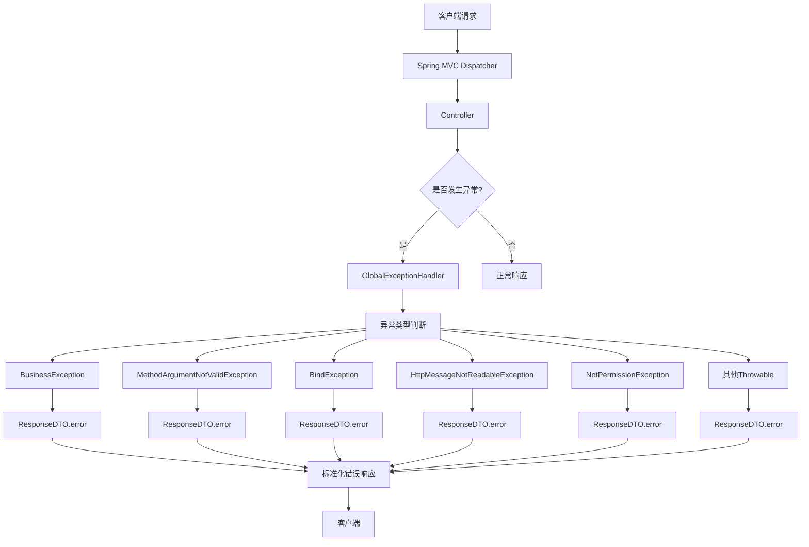
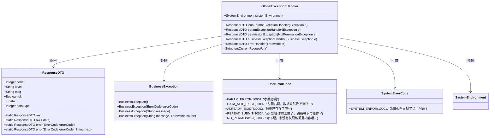
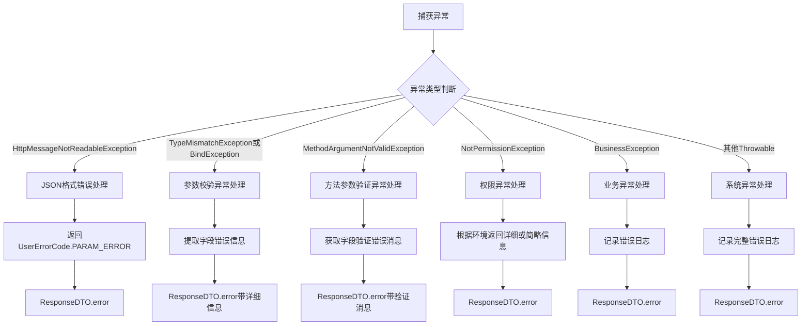
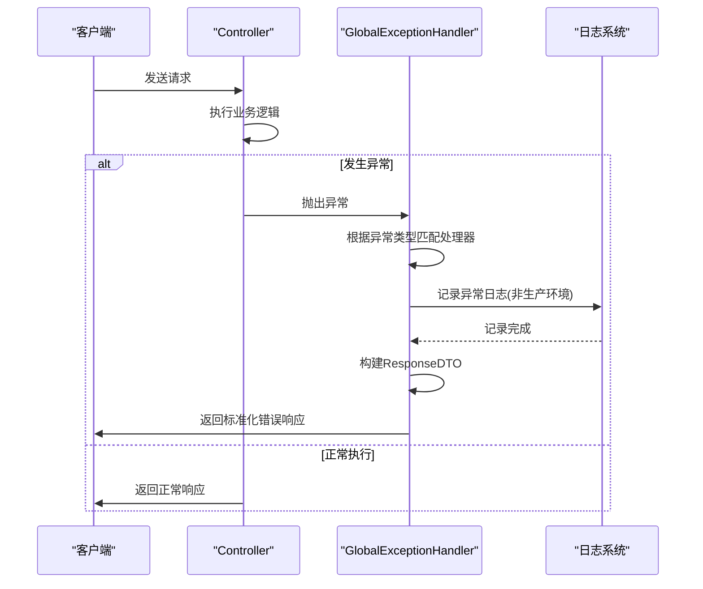
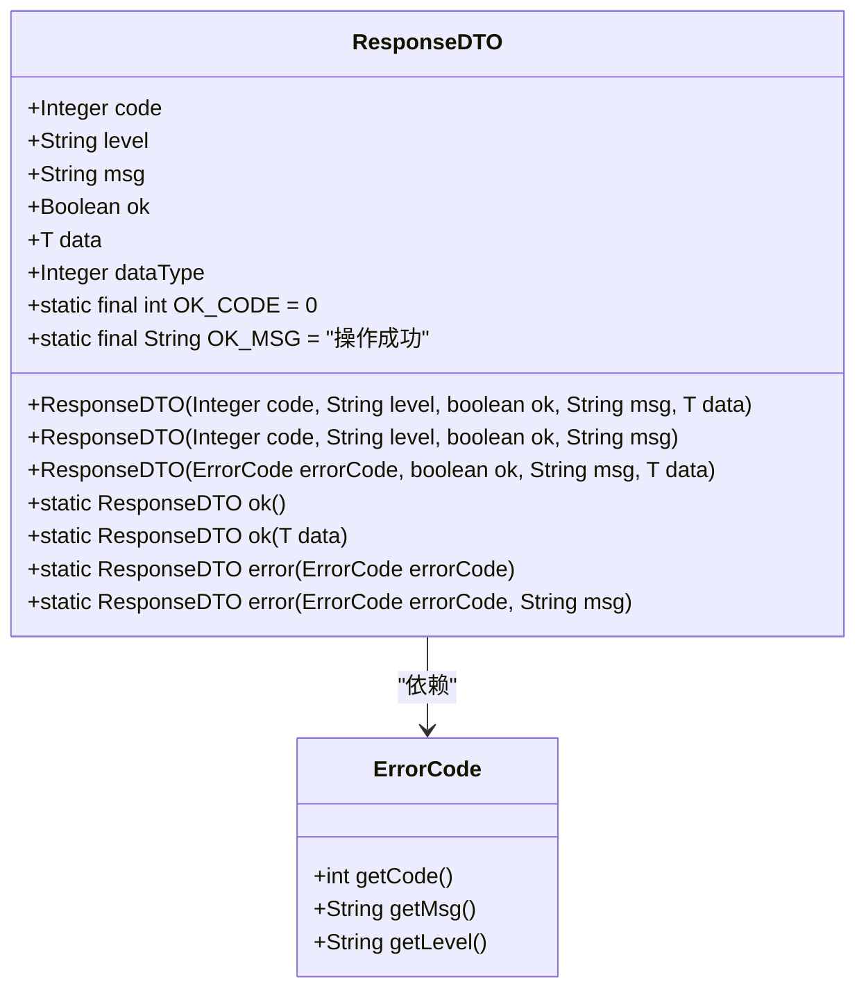
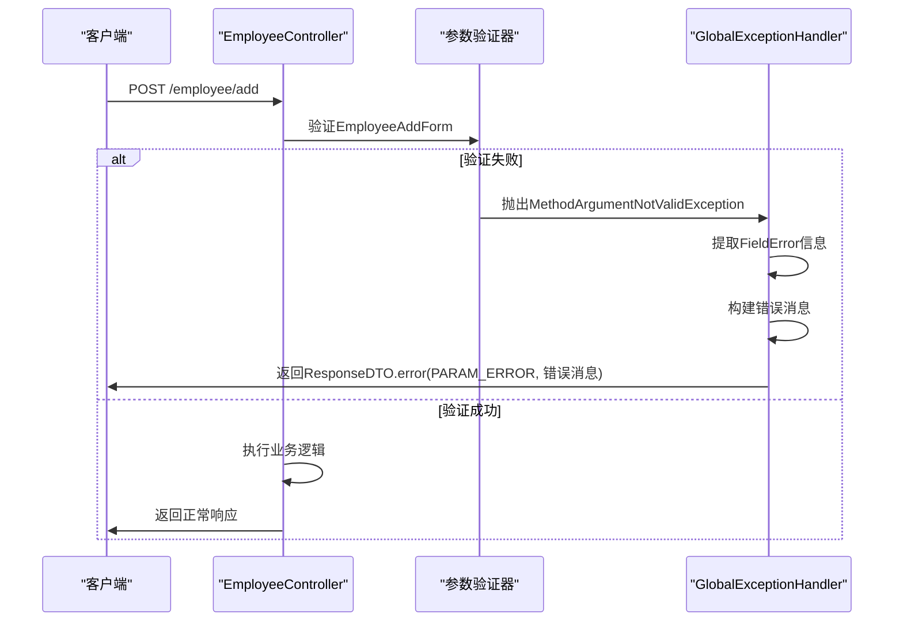
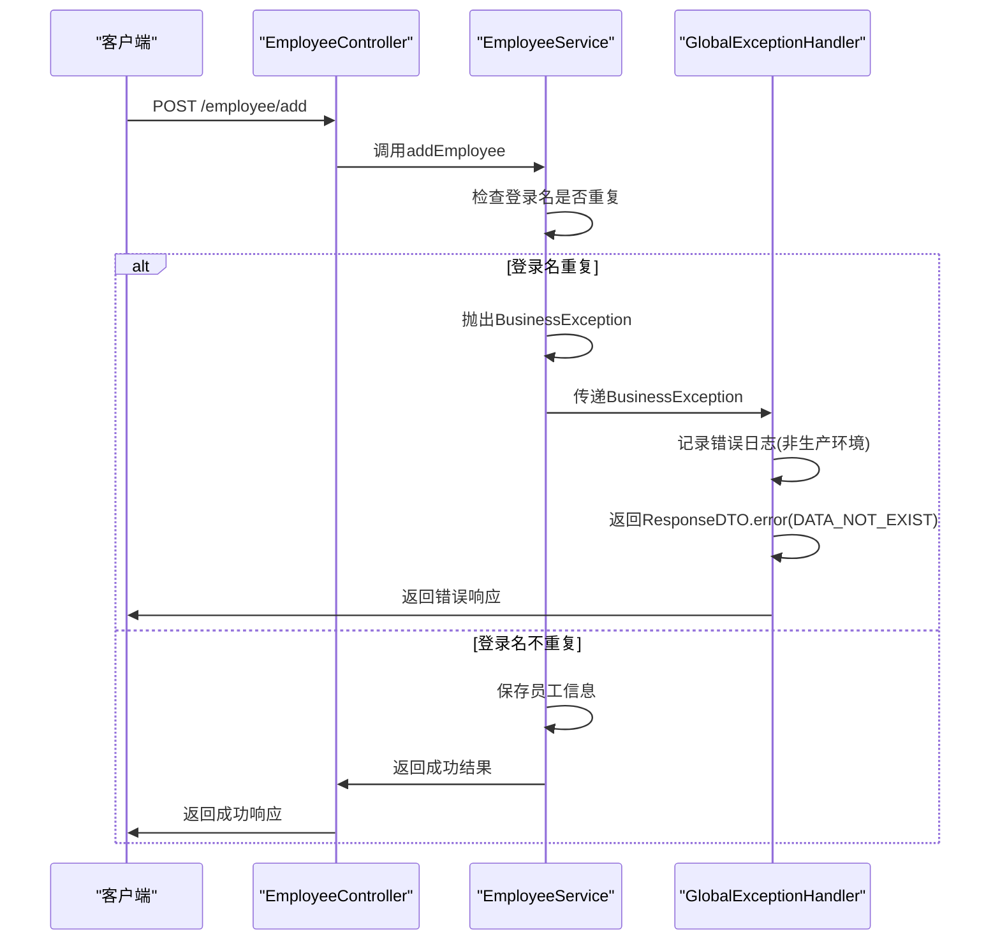
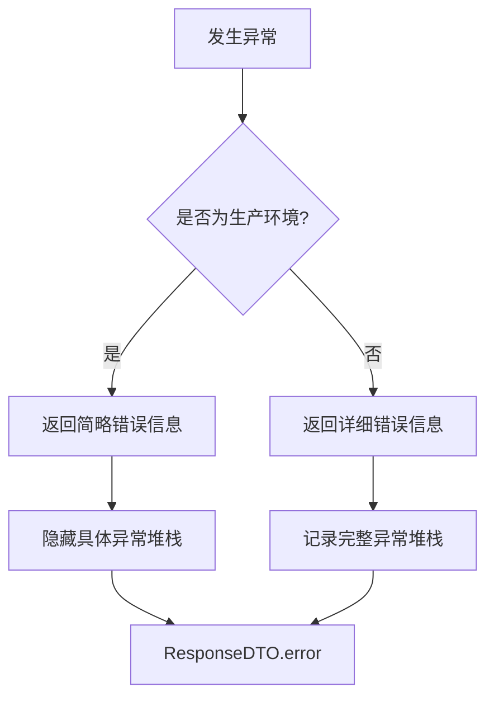

# 全局异常处理

<cite>
**本文档引用的文件**   
- [GlobalExceptionHandler.java](file://smart-admin-api-java17-springboot3\sa-base\src\main\java\net\lab1024\sa\base\handler\GlobalExceptionHandler.java)
- [ResponseDTO.java](file://smart-admin-api-java17-springboot3\sa-base\src\main\java\net\lab1024\sa\base\common\domain\ResponseDTO.java)
- [BusinessException.java](file://smart-admin-api-java17-springboot3\sa-base\src\main\java\net\lab1024\sa\base\common\exception\BusinessException.java)
- [UserErrorCode.java](file://smart-admin-api-java17-springboot3\sa-base\src\main\java\net\lab1024\sa\base\common\code\UserErrorCode.java)
- [SystemErrorCode.java](file://smart-admin-api-java17-springboot3\sa-base\src\main\java\net\lab1024\sa\base\common\code\SystemErrorCode.java)
- [SystemEnvironment.java](file://smart-admin-api-java17-springboot3\sa-base\src\main\java\net\lab1024\sa\base\common\domain\SystemEnvironment.java)
- [EmployeeController.java](file://smart-admin-api-java17-springboot3\sa-admin\src\main\java\net\lab1024\sa\admin\module\system\employee\controller\EmployeeController.java)
</cite>

## 目录
1. [简介](#简介)
2. [全局异常处理架构](#全局异常处理架构)
3. [核心组件分析](#核心组件分析)
4. [异常处理优先级机制](#异常处理优先级机制)
5. [响应格式统一化处理](#响应格式统一化处理)
6. [实际调用链路分析](#实际调用链路分析)
7. [自定义异常扩展方法](#自定义异常扩展方法)
8. [调试技巧与最佳实践](#调试技巧与最佳实践)

## 简介
本系统采用Spring Boot框架的@ControllerAdvice注解实现全局异常处理机制，通过GlobalExceptionHandler类统一捕获和处理系统中各类异常。该机制确保了系统在遇到各种异常情况时能够返回标准化的错误响应，提高了系统的稳定性和用户体验。异常处理涵盖了业务异常、参数校验异常、权限异常等多种类型，并根据系统环境（开发/生产）提供不同程度的错误信息暴露，既保证了开发调试的便利性，又确保了生产环境的安全性。

## 全局异常处理架构



**图示来源**
- [GlobalExceptionHandler.java](file://smart-admin-api-java17-springboot3\sa-base\src\main\java\net\lab1024\sa\base\handler\GlobalExceptionHandler.java#L37-L130)

## 核心组件分析

### GlobalExceptionHandler实现机制
系统通过@ControllerAdvice注解定义全局异常处理器，该注解使得异常处理器能够应用于所有@Controller注解的类。GlobalExceptionHandler类中定义了多个@ExceptionHandler方法，分别处理不同类型的异常。



**图示来源**
- [GlobalExceptionHandler.java](file://smart-admin-api-java17-springboot3\sa-base\src\main\java\net\lab1024\sa\base\handler\GlobalExceptionHandler.java#L37-L130)
- [ResponseDTO.java](file://smart-admin-api-java17-springboot3\sa-base\src\main\java\net\lab1024\sa\base\common\domain\ResponseDTO.java#L21-L122)
- [BusinessException.java](file://smart-admin-api-java17-springboot3\sa-base\src\main\java\net\lab1024\sa\base\common\exception\BusinessException.java#L14-L38)
- [UserErrorCode.java](file://smart-admin-api-java17-springboot3\sa-base\src\main\java\net\lab1024\sa\base\common\code\UserErrorCode.java#L17-L53)
- [SystemErrorCode.java](file://smart-admin-api-java17-springboot3\sa-base\src\main\java\net\lab1024\sa\base\common\code\SystemErrorCode.java#L17-L38)

**本节来源**
- [GlobalExceptionHandler.java](file://smart-admin-api-java17-springboot3\sa-base\src\main\java\net\lab1024\sa\base\handler\GlobalExceptionHandler.java#L37-L130)

### 异常类型处理策略
系统对不同类型的异常采用不同的处理策略，确保每种异常都能得到恰当的处理。



**图示来源**
- [GlobalExceptionHandler.java](file://smart-admin-api-java17-springboot3\sa-base\src\main\java\net\lab1024\sa\base\handler\GlobalExceptionHandler.java#L46-L116)

## 异常处理优先级机制
系统中的异常处理遵循特定的优先级顺序，确保最具体的异常处理器优先执行。Spring MVC的异常处理机制会按照异常类型的继承关系和声明顺序来确定优先级。



**图示来源**
- [GlobalExceptionHandler.java](file://smart-admin-api-java17-springboot3\sa-base\src\main\java\net\lab1024\sa\base\handler\GlobalExceptionHandler.java#L37-L130)

**本节来源**
- [GlobalExceptionHandler.java](file://smart-admin-api-java17-springboot3\sa-base\src\main\java\net\lab1024\sa\base\handler\GlobalExceptionHandler.java#L37-L130)

## 响应格式统一化处理

### ResponseDTO封装机制
系统使用ResponseDTO类封装所有响应数据，确保前后端交互的数据格式统一。该类包含状态码、消息、数据等标准字段，为前端提供一致的接口响应格式。



**图示来源**
- [ResponseDTO.java](file://smart-admin-api-java17-springboot3\sa-base\src\main\java\net\lab1024\sa\base\common\domain\ResponseDTO.java#L21-L122)

### ErrorCode映射关系
系统定义了清晰的错误码体系，将不同类型的错误映射到特定的错误码，便于前端识别和处理。

| 错误码 | 类型 | 描述 | 示例消息 |
|--------|------|------|---------|
| 30001 | 用户级 | 参数错误 | 参数错误 |
| 30002 | 用户级 | 数据不存在 | 左翻右翻，数据竟然找不到了~ |
| 30003 | 用户级 | 数据已存在 | 数据已存在了呀~ |
| 30004 | 用户级 | 重复提交 | 亲~您操作的太快了，请稍等下再操作~ |
| 30005 | 用户级 | 无权限 | 对不起，您没有权限访问此内容哦~ |
| 10001 | 系统级 | 系统错误 | 系统似乎出现了点小问题 |

**本节来源**
- [UserErrorCode.java](file://smart-admin-api-java17-springboot3\sa-base\src\main\java\net\lab1024\sa\base\common\code\UserErrorCode.java#L19-L40)
- [SystemErrorCode.java](file://smart-admin-api-java17-springboot3\sa-base\src\main\java\net\lab1024\sa\base\common\code\SystemErrorCode.java#L22-L24)

## 实际调用链路分析

### 参数校验异常处理流程
当控制器方法的参数验证失败时，系统会触发参数校验异常处理流程。



**图示来源**
- [GlobalExceptionHandler.java](file://smart-admin-api-java17-springboot3\sa-base\src\main\java\net\lab1024\sa\base\handler\GlobalExceptionHandler.java#L59-L74)
- [EmployeeController.java](file://smart-admin-api-java17-springboot3\sa-admin\src\main\java\net\lab1024\sa\admin\module\system\employee\controller\EmployeeController.java#L49-L51)

### 业务异常处理流程
当业务逻辑中抛出业务异常时，系统会进行统一处理。



**图示来源**
- [GlobalExceptionHandler.java](file://smart-admin-api-java17-springboot3\sa-base\src\main\java\net\lab1024\sa\base\handler\GlobalExceptionHandler.java#L97-L103)
- [EmployeeService.java](file://smart-admin-api-java17-springboot3\sa-admin\src\main\java\net\lab1024\sa\admin\module\system\employee\service\EmployeeService.java#L108-L136)

## 自定义异常扩展方法
系统提供了灵活的异常处理扩展机制，开发者可以轻松添加新的异常类型处理逻辑。

### 添加新的异常处理方法
要添加新的异常处理逻辑，只需在GlobalExceptionHandler类中添加新的@ExceptionHandler方法：

```java
@ResponseBody
@ExceptionHandler(CustomException.class)
public ResponseDTO<?> customExceptionHandler(CustomException e) {
    if (!systemEnvironment.isProd()) {
        log.error("自定义异常,URL:{}", getCurrentRequestUrl(), e);
    }
    return ResponseDTO.error(CustomErrorCode.CUSTOM_ERROR, e.getMessage());
}
```

### 扩展错误码体系
可以通过创建新的错误码枚举来扩展系统的错误码体系：

```java
@Getter
@AllArgsConstructor
public enum CustomErrorCode implements ErrorCode {
    CUSTOM_ERROR(40001, "自定义错误"),
    VALIDATION_ERROR(40002, "验证错误");
    
    private final int code;
    private final String msg;
    private final String level = "CUSTOM";
}
```

**本节来源**
- [GlobalExceptionHandler.java](file://smart-admin-api-java17-springboot3\sa-base\src\main\java\net\lab1024\sa\base\handler\GlobalExceptionHandler.java#L37-L130)
- [UserErrorCode.java](file://smart-admin-api-java17-springboot3\sa-base\src\main\java\net\lab1024\sa\base\common\code\UserErrorCode.java#L17-L53)

## 调试技巧与最佳实践

### 环境相关的错误信息暴露
系统根据运行环境决定错误信息的详细程度，确保生产环境的安全性：



**本节来源**
- [GlobalExceptionHandler.java](file://smart-admin-api-java17-springboot3\sa-base\src\main\java\net\lab1024\sa\base\handler\GlobalExceptionHandler.java#L49-L52)
- [GlobalExceptionHandler.java](file://smart-admin-api-java17-springboot3\sa-base\src\main\java\net\lab1024\sa\base\handler\GlobalExceptionHandler.java#L115-L116)

### 最佳实践建议
1. **异常分类清晰**：将异常分为用户级和系统级，便于前端区分处理
2. **错误码体系完整**：为每种可能的错误情况定义明确的错误码
3. **环境感知**：在非生产环境提供详细的错误信息，便于调试
4. **日志记录**：对重要异常进行日志记录，便于问题追踪
5. **响应格式统一**：所有异常都返回标准化的ResponseDTO格式
6. **安全性考虑**：生产环境避免暴露敏感的系统信息

**本节来源**
- [GlobalExceptionHandler.java](file://smart-admin-api-java17-springboot3\sa-base\src\main\java\net\lab1024\sa\base\handler\GlobalExceptionHandler.java#L37-L130)
- [SystemEnvironment.java](file://smart-admin-api-java17-springboot3\sa-base\src\main\java\net\lab1024\sa\base\common\domain\SystemEnvironment.java#L17-L35)