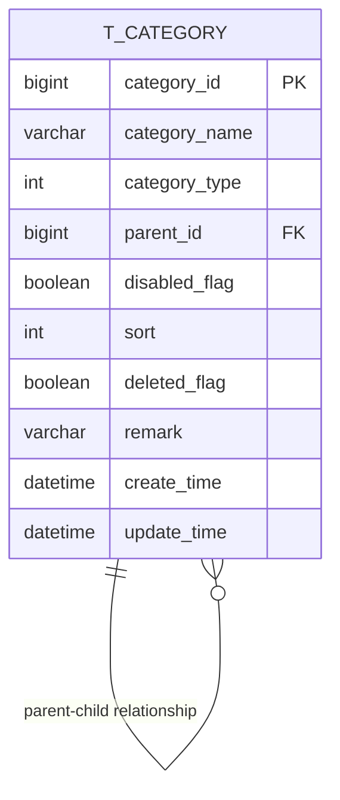
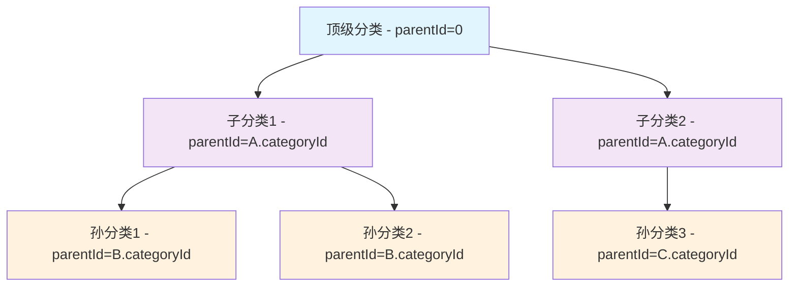
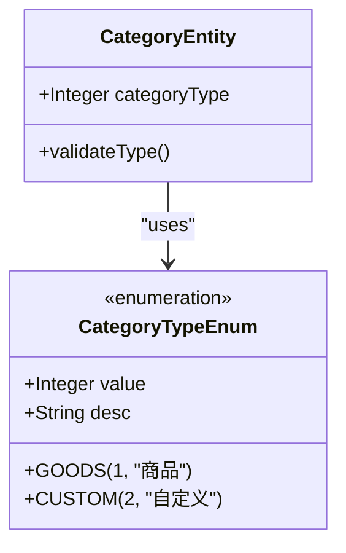
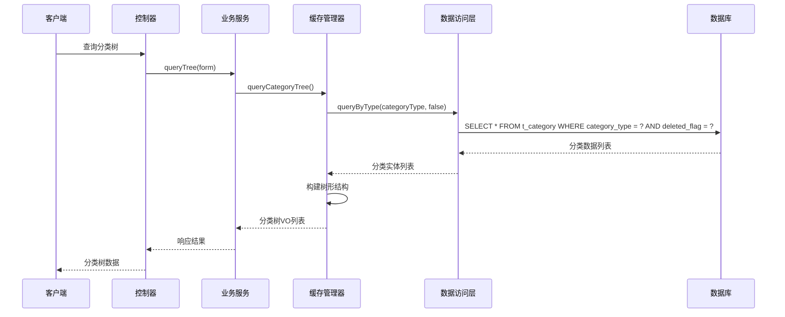
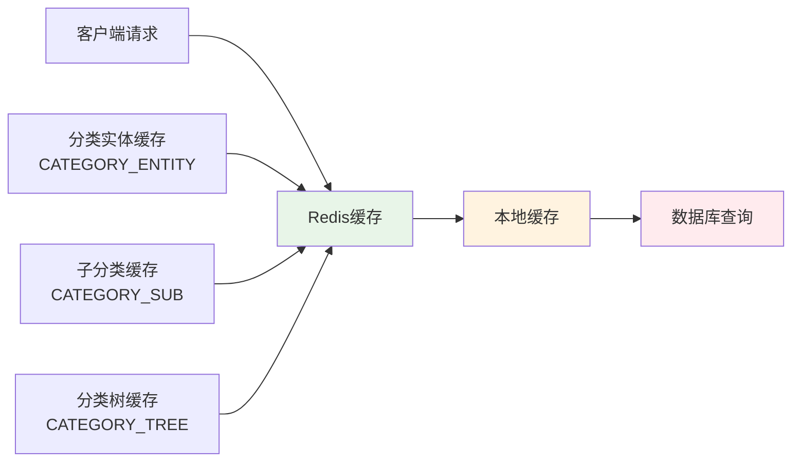
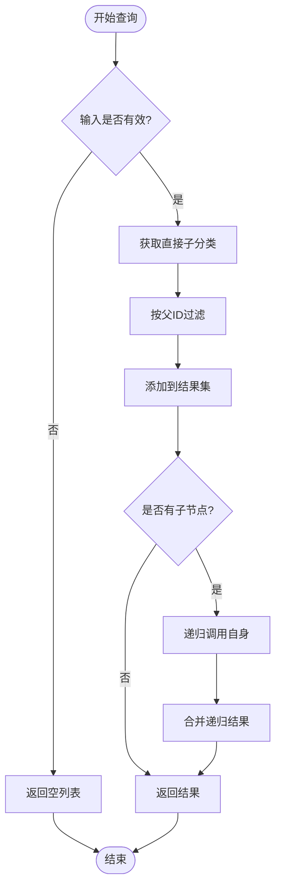
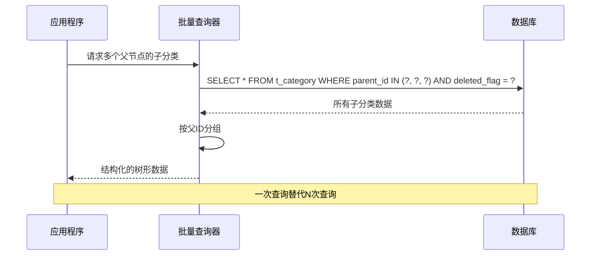

# 分类管理表结构

<cite>
**本文档引用的文件**
- [CategoryEntity.java](file://smart-admin-api-java17-springboot3/sa-admin/src/main/java/net/lab1024/sa/admin/module/business/category/domain/entity/CategoryEntity.java)
- [CategoryDao.java](file://smart-admin-api-java17-springboot3/sa-admin/src/main/java/net/lab1024/sa/admin/module/business/category/dao/CategoryDao.java)
- [CategoryMapper.xml](file://smart-admin-api-java17-springboot3/sa-admin/src/main/resources/mapper/business/category/CategoryMapper.xml)
- [CategoryTypeEnum.java](file://smart-admin-api-java17-springboot3/sa-admin/src/main/java/net/lab1024/sa/admin/module/business/category/constant/CategoryTypeEnum.java)
- [CategoryQueryService.java](file://smart-admin-api-java17-springboot3/sa-admin/src/main/java/net/lab1024/sa/admin/module/business/category/service/CategoryQueryService.java)
- [CategoryCacheManager.java](file://smart-admin-api-java17-springboot3/sa-admin/src/main/java/net/lab1024/sa/admin/module/business/category/manager/CategoryCacheManager.java)
- [CategoryService.java](file://smart-admin-api-java17-springboot3/sa-admin/src/main/java/net/lab1024/sa/admin/module/business/category/service/CategoryService.java)
- [CategoryController.java](file://smart-admin-api-java17-springboot3/sa-admin/src/main/java/net/lab1024/sa/admin/module/business/category/controller/CategoryController.java)
</cite>

## 目录
1. [概述](#概述)
2. [数据库表结构设计](#数据库表结构设计)
3. [核心字段详解](#核心字段详解)
4. [树形层级结构实现](#树形层级结构实现)
5. [分类类型体系](#分类类型体系)
6. [查询模式与索引优化](#查询模式与索引优化)
7. [缓存机制与性能优化](#缓存机制与性能优化)
8. [分类树形结构遍历算法](#分类树形结构遍历算法)
9. [N+1查询问题解决方案](#n1查询问题解决方案)
10. [最佳实践建议](#最佳实践建议)

## 概述

分类管理模块是智能管理系统中的核心功能之一，采用树形结构设计支持多层级分类体系。该模块通过`t_category`表实现了灵活的商品分类和自定义分类管理，支持软删除机制和高效的查询优化。

## 数据库表结构设计

### t_category表结构

**图表来源**
- [CategoryEntity.java](file://smart-admin-api-java17-springboot3/sa-admin/src/main/java/net/lab1024/sa/admin/module/business/category/domain/entity/CategoryEntity.java#L27-L70)

### 字段约束与索引设计

| 字段名 | 数据类型 | 约束条件 | 索引类型 | 说明 |
|--------|----------|----------|----------|------|
| categoryId | BIGINT | PRIMARY KEY, AUTO_INCREMENT | 主键索引 | 分类唯一标识符 |
| categoryName | VARCHAR(20) | NOT NULL | 普通索引 | 分类名称，最大20字符 |
| categoryType | INT | NOT NULL | 普通索引 | 分类类型，区分业务场景 |
| parentId | BIGINT | DEFAULT 0 | 普通索引 | 父分类ID，0表示顶级分类 |
| disabledFlag | BOOLEAN | DEFAULT FALSE | 普通索引 | 是否禁用状态 |
| sort | INT | DEFAULT 0 | 普通索引 | 排序权重，用于前端展示顺序 |
| deletedFlag | BOOLEAN | DEFAULT FALSE | 普通索引 | 软删除标志位 |
| remark | VARCHAR(200) | NULLABLE | 普通索引 | 备注信息，最大200字符 |
| createTime | DATETIME | DEFAULT CURRENT_TIMESTAMP | 普通索引 | 记录创建时间 |
| updateTime | DATETIME | DEFAULT CURRENT_TIMESTAMP ON UPDATE CURRENT_TIMESTAMP | 普通索引 | 记录更新时间 |

**节来源**
- [CategoryEntity.java](file://smart-admin-api-java17-springboot3/sa-admin/src/main/java/net/lab1024/sa/admin/module/business/category/domain/entity/CategoryEntity.java#L27-L70)

## 核心字段详解

### categoryId - 分类唯一标识

- **数据类型**: BIGINT
- **约束**: 主键，自动增长
- **用途**: 作为分类的唯一标识符，在整个系统中保持唯一性
- **特点**: 支持分布式环境下的分类关联和引用

### categoryName - 分类名称

- **数据类型**: VARCHAR(20)
- **约束**: 非空，最大长度20字符
- **验证**: 支持中文、英文、数字和特殊字符
- **业务意义**: 显示给用户的主要分类标识

### categoryType - 分类类型

- **数据类型**: INT
- **约束**: 非空
- **枚举值**: 
  - 1: 商品分类 (GOODS)
  - 2: 自定义分类 (CUSTOM)
- **业务场景**: 区分不同的分类管理体系

### parentCategoryId - 父分类ID

- **数据类型**: BIGINT
- **默认值**: 0 (表示顶级分类)
- **约束**: 支持NULL值
- **关系**: 自引用外键，形成树形结构
- **特殊值**: 0表示无父级，即顶级分类节点

### sort - 排序权重

- **数据类型**: INT
- **默认值**: 0
- **用途**: 决定分类在前端的显示顺序
- **特点**: 支持负数和重复值，便于灵活排序

### disabledFlag - 禁用状态

- **数据类型**: BOOLEAN
- **默认值**: FALSE
- **用途**: 控制分类是否可用
- **影响**: 影响查询结果过滤和前端显示

### deletedFlag - 软删除标志

- **数据类型**: BOOLEAN
- **默认值**: FALSE
- **软删除机制**: 逻辑删除，保留数据完整性
- **查询影响**: 默认查询排除deletedFlag=true的记录

**节来源**
- [CategoryEntity.java](file://smart-admin-api-java17-springboot3/sa-admin/src/main/java/net/lab1024/sa/admin/module/business/category/domain/entity/CategoryEntity.java#L27-L70)
- [CategoryTypeEnum.java](file://smart-admin-api-java17-springboot3/sa-admin/src/main/java/net/lab1024/sa/admin/module/business/category/constant/CategoryTypeEnum.java#L24-L29)

## 树形层级结构实现

### 父子关系设计原理

分类管理采用邻接列表模型实现树形结构，通过parentCategoryId字段建立父子关系：

**图表来源**
- [CategoryQueryService.java](file://smart-admin-api-java17-springboot3/sa-admin/src/main/java/net/lab1024/sa/admin/module/business/category/service/CategoryQueryService.java#L150-L165)

### 树形结构查询策略

系统提供了多种查询策略来处理树形结构：

1. **按父级查询子分类**: 通过parentId快速定位直接子节点
2. **递归查询子分类**: 支持深度递归查询所有后代节点
3. **查询父级路径**: 支持从任意节点向上追溯到根节点
4. **层级树构建**: 将扁平数据转换为嵌套树形结构

**节来源**
- [CategoryDao.java](file://smart-admin-api-java17-springboot3/sa-admin/src/main/java/net/lab1024/sa/admin/module/business/category/dao/CategoryDao.java#L31-L60)
- [CategoryQueryService.java](file://smart-admin-api-java17-springboot3/sa-admin/src/main/java/net/lab1024/sa/admin/module/business/category/service/CategoryQueryService.java#L79-L96)

## 分类类型体系

### CategoryTypeEnum枚举设计

**图表来源**
- [CategoryTypeEnum.java](file://smart-admin-api-java17-springboot3/sa-admin/src/main/java/net/lab1024/sa/admin/module/business/category/constant/CategoryTypeEnum.java#L17-L36)

### 分类类型应用场景

| 类型 | 数值 | 应用场景 | 特点 |
|------|------|----------|------|
| 商品分类 | 1 | 商品管理、电商系统 | 支持商品属性绑定 |
| 自定义分类 | 2 | 系统扩展、业务定制 | 灵活度高，无固定规则 |

### 类型一致性校验

系统在新增和更新分类时会进行类型一致性检查：
- 父子节点必须具有相同的categoryType
- 同级分类间不允许类型冲突
- 类型一旦确定不可更改

**节来源**
- [CategoryTypeEnum.java](file://smart-admin-api-java17-springboot3/sa-admin/src/main/java/net/lab1024/sa/admin/module/business/category/constant/CategoryTypeEnum.java#L17-L36)
- [CategoryService.java](file://smart-admin-api-java17-springboot3/sa-admin/src/main/java/net/lab1024/sa/admin/module/business/category/service/CategoryService.java#L106-L147)

## 查询模式与索引优化

### 主要查询接口

系统提供了以下核心查询方法：

**图表来源**
- [CategoryController.java](file://smart-admin-api-java17-springboot3/sa-admin/src/main/java/net/lab1024/sa/admin/module/business/category/controller/CategoryController.java#L56-L61)
- [CategoryCacheManager.java](file://smart-admin-api-java17-springboot3/sa-admin/src/main/java/net/lab1024/sa/admin/module/business/category/manager/CategoryCacheManager.java#L70-L84)

### 查询方法详解

| 方法名 | 参数 | 功能 | 性能特点 |
|--------|------|------|----------|
| queryByParentId | parentIdList, deletedFlag | 根据父级ID查询子分类 | 批量查询，支持IN子句 |
| queryByParentIdAndType | parentIdList, categoryType, deletedFlag | 带类型的批量查询 | 组合索引优化 |
| queryByType | categoryType, deletedFlag | 查询指定类型的全部分类 | 类型过滤，有序返回 |
| selectOne | CategoryEntity | 条件查询单条记录 | 动态WHERE条件 |

### 索引优化策略

1. **复合索引设计**:
   - `(category_type, deleted_flag)` - 类型过滤索引
   - `(parent_id, deleted_flag)` - 父子关系索引
   - `(category_type, sort)` - 排序索引

2. **查询优化技巧**:
   - 使用IN子句进行批量查询
   - 合理利用索引覆盖查询
   - 避免SELECT *，只查询必要字段

**节来源**
- [CategoryDao.java](file://smart-admin-api-java17-springboot3/sa-admin/src/main/java/net/lab1024/sa/admin/module/business/category/dao/CategoryDao.java#L31-L60)
- [CategoryMapper.xml](file://smart-admin-api-java17-springboot3/sa-admin/src/main/resources/mapper/business/category/CategoryMapper.xml#L6-L60)

## 缓存机制与性能优化

### 多层缓存架构

**图表来源**
- [CategoryCacheManager.java](file://smart-admin-api-java17-springboot3/sa-admin/src/main/java/net/lab1024/sa/admin/module/business/category/manager/CategoryCacheManager.java#L32-L45)

### 缓存策略设计

| 缓存类型 | 键空间 | 过期策略 | 更新时机 |
|----------|--------|----------|----------|
| 分类实体缓存 | CATEGORY_ENTITY | 永久缓存 | 数据变更时清除 |
| 子分类缓存 | CATEGORY_SUB | 永久缓存 | 数据变更时清除 |
| 分类树缓存 | CATEGORY_TREE | 永久缓存 | 数据变更时清除 |

### 缓存失效机制

系统采用主动缓存失效策略：
- 数据插入/更新时清除相关缓存
- 批量操作时统一清理
- 提供缓存监控和调试功能

**节来源**
- [CategoryCacheManager.java](file://smart-admin-api-java17-springboot3/sa-admin/src/main/java/net/lab1024/sa/admin/module/business/category/manager/CategoryCacheManager.java#L32-L45)
- [CategoryService.java](file://smart-admin-api-java17-springboot3/sa-admin/src/main/java/net/lab1024/sa/admin/module/business/category/service/CategoryService.java#L64-L66)

## 分类树形结构遍历算法

### 递归查询算法

系统提供了两种主要的树形结构遍历算法：

#### 1. 递归查询所有子节点

**图表来源**
- [CategoryQueryService.java](file://smart-admin-api-java17-springboot3/sa-admin/src/main/java/net/lab1024/sa/admin/module/business/category/service/CategoryQueryService.java#L79-L96)

#### 2. 构建完整分类树

系统采用层次化构建算法：
1. 查询所有分类数据
2. 按父ID分组组织
3. 递归设置子节点
4. 构建完整的树形结构

### 算法复杂度分析

| 操作 | 时间复杂度 | 空间复杂度 | 说明 |
|------|------------|------------|------|
| 查询单层子节点 | O(n) | O(k) | n为总分类数，k为子节点数 |
| 构建完整树 | O(n²) | O(n) | 最坏情况需要多次遍历 |
| 查询父级路径 | O(h) | O(h) | h为树的高度 |

**节来源**
- [CategoryQueryService.java](file://smart-admin-api-java17-springboot3/sa-admin/src/main/java/net/lab1024/sa/admin/module/business/category/service/CategoryQueryService.java#L150-L165)
- [CategoryCacheManager.java](file://smart-admin-api-java17-springboot3/sa-admin/src/main/java/net/lab1024/sa/admin/module/business/category/manager/CategoryCacheManager.java#L91-L110)

## N+1查询问题解决方案

### 问题识别与影响

N+1查询问题是树形结构查询中的常见性能瓶颈：
- **问题表现**: 每次查询子节点都需要单独执行数据库查询
- **性能影响**: 当树形结构较深或节点较多时，查询次数呈指数级增长
- **资源消耗**: 大量数据库连接和网络开销

### 优化策略

#### 1. 批量查询优化

**图表来源**
- [CategoryDao.java](file://smart-admin-api-java17-springboot3/sa-admin/src/main/java/net/lab1024/sa/admin/module/business/category/dao/CategoryDao.java#L31-L41)

#### 2. 预加载策略

系统采用预加载策略减少查询次数：
- 一次性查询所有相关分类
- 在内存中构建树形结构
- 避免重复查询相同数据

#### 3. 缓存策略

通过多层缓存机制解决N+1问题：
- 分类实体缓存 - 避免重复查询单个分类
- 子分类缓存 - 预先加载子节点数据
- 分类树缓存 - 缓存完整的树形结构

### 性能对比

| 方案 | 查询次数 | 响应时间 | 内存使用 | 适用场景 |
|------|----------|----------|----------|----------|
| 传统N+1 | N+1 | 较慢 | 低 | 小规模数据 |
| 批量查询 | 1 | 快 | 中等 | 中等规模数据 |
| 缓存优化 | 1 | 最快 | 高 | 大规模数据 |

**节来源**
- [CategoryDao.java](file://smart-admin-api-java17-springboot3/sa-admin/src/main/java/net/lab1024/sa/admin/module/business/category/dao/CategoryDao.java#L31-L60)
- [CategoryCacheManager.java](file://smart-admin-api-java17-springboot3/sa-admin/src/main/java/net/lab1024/sa/admin/module/business/category/manager/CategoryCacheManager.java#L58-L63)

## 最佳实践建议

### 数据库设计建议

1. **索引设计**:
   - 为常用查询字段建立复合索引
   - 考虑添加`(category_type, parent_id, sort)`复合索引
   - 定期分析查询计划，优化索引策略

2. **数据完整性**:
   - 设置合理的字段长度限制
   - 使用NOT NULL约束保证数据质量
   - 建立适当的外键约束

3. **性能监控**:
   - 监控查询响应时间和执行计划
   - 定期分析慢查询日志
   - 关注缓存命中率指标

### 应用层优化建议

1. **查询策略**:
   - 优先使用批量查询替代循环查询
   - 合理利用缓存机制
   - 避免不必要的树形结构重建

2. **业务逻辑**:
   - 实施严格的分类类型校验
   - 提供友好的错误提示信息
   - 支持分类的导入导出功能

3. **用户体验**:
   - 提供分类搜索和筛选功能
   - 支持拖拽式分类结构调整
   - 实现分类的快速定位和导航

### 维护和扩展

1. **版本兼容性**:
   - 保持向后兼容的数据结构
   - 提供数据迁移工具
   - 文档化重要的变更历史

2. **监控告警**:
   - 监控数据库性能指标
   - 设置缓存异常告警
   - 跟踪用户操作行为

3. **容量规划**:
   - 评估数据增长趋势
   - 制定扩容计划
   - 优化存储结构

通过以上设计和优化策略，分类管理模块能够高效地支持复杂的树形结构管理和查询需求，同时保持良好的性能和可维护性。