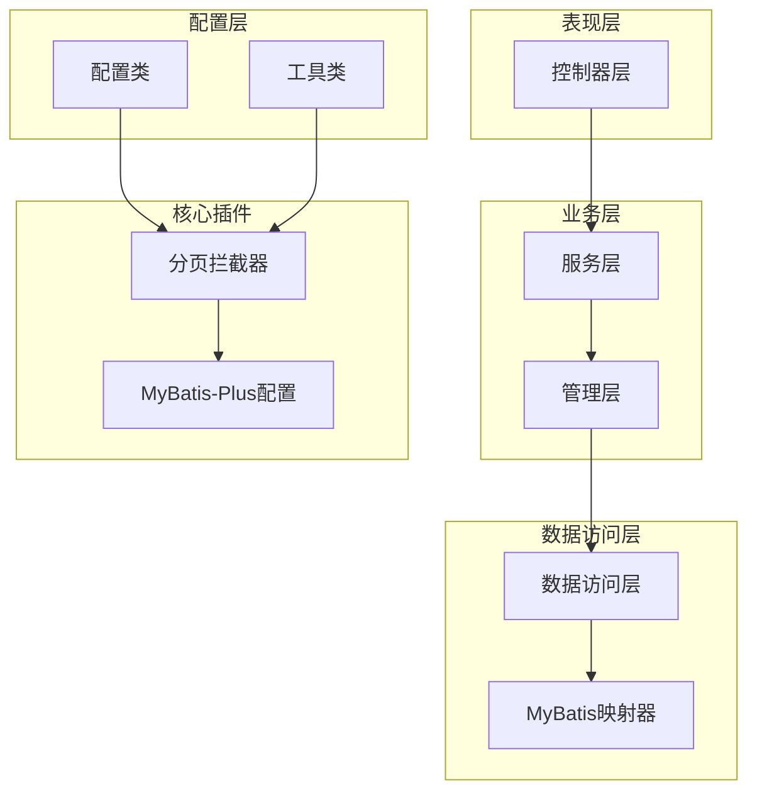
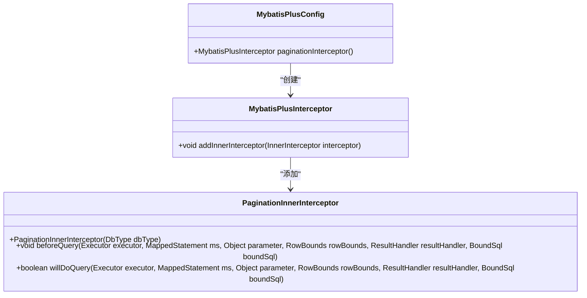
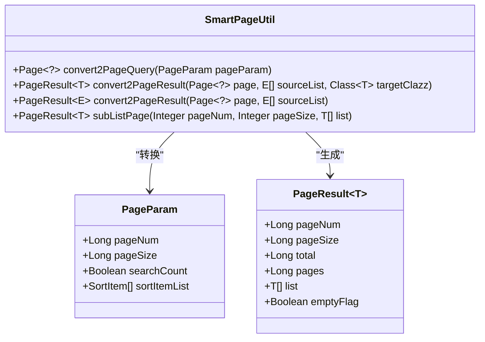
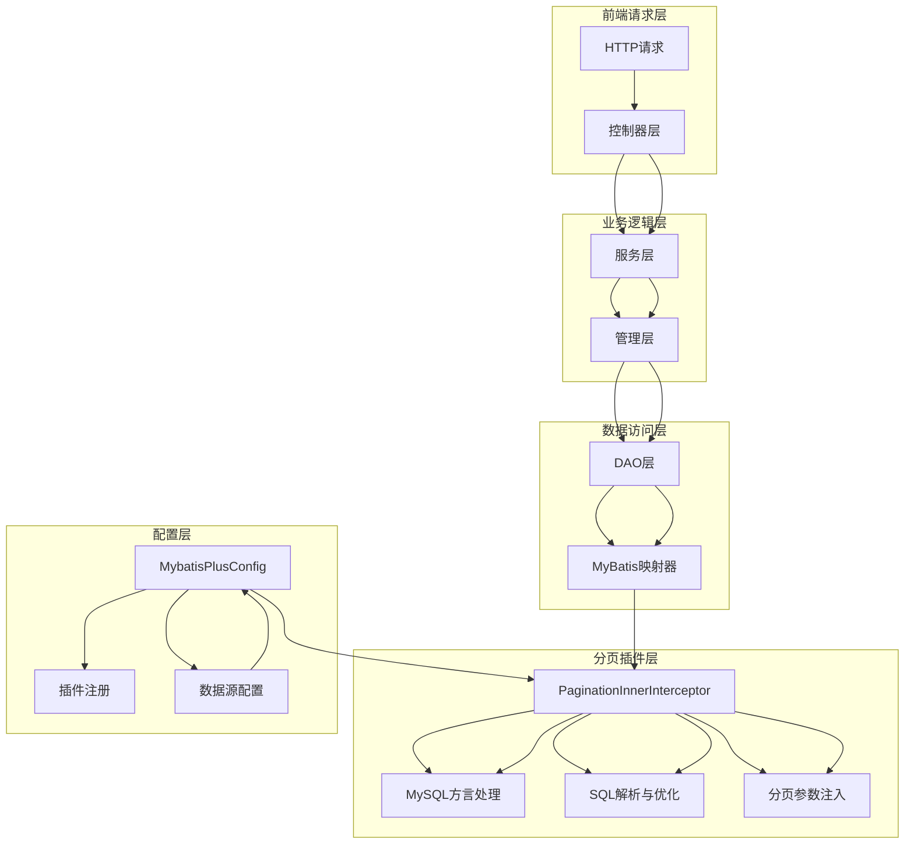
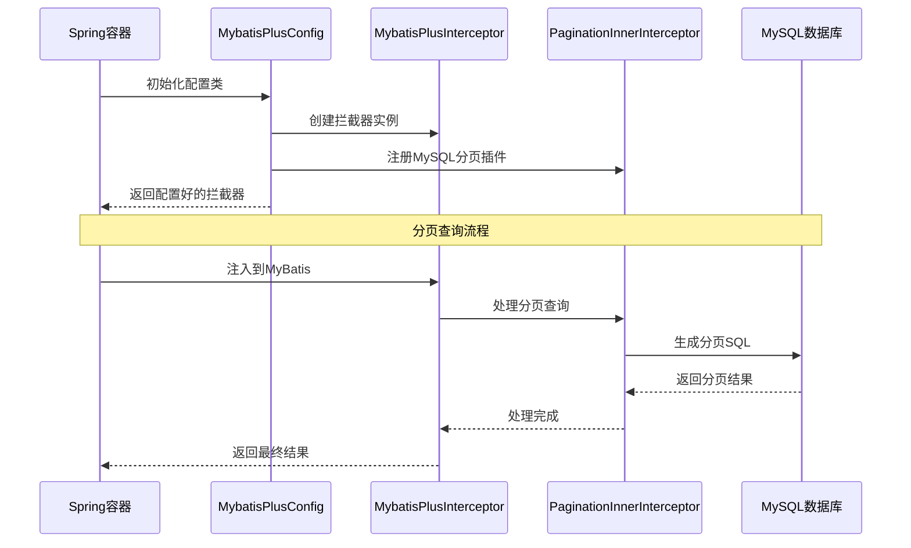
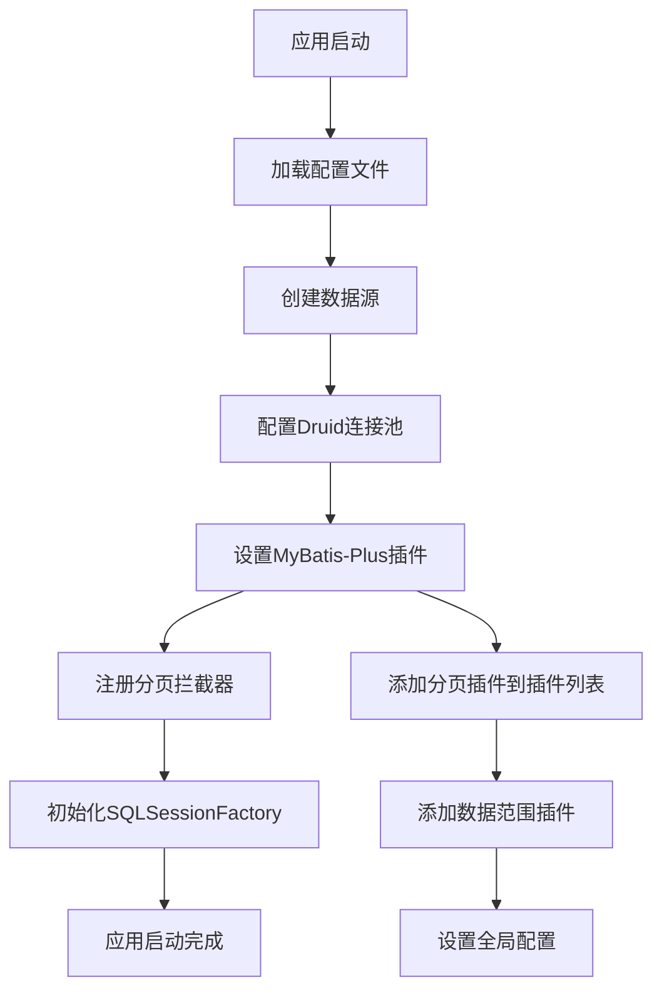
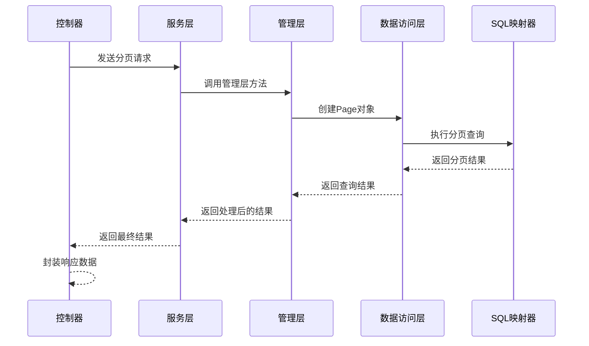
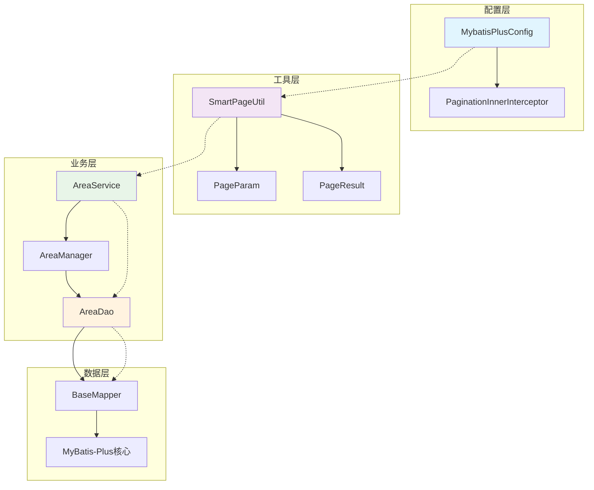
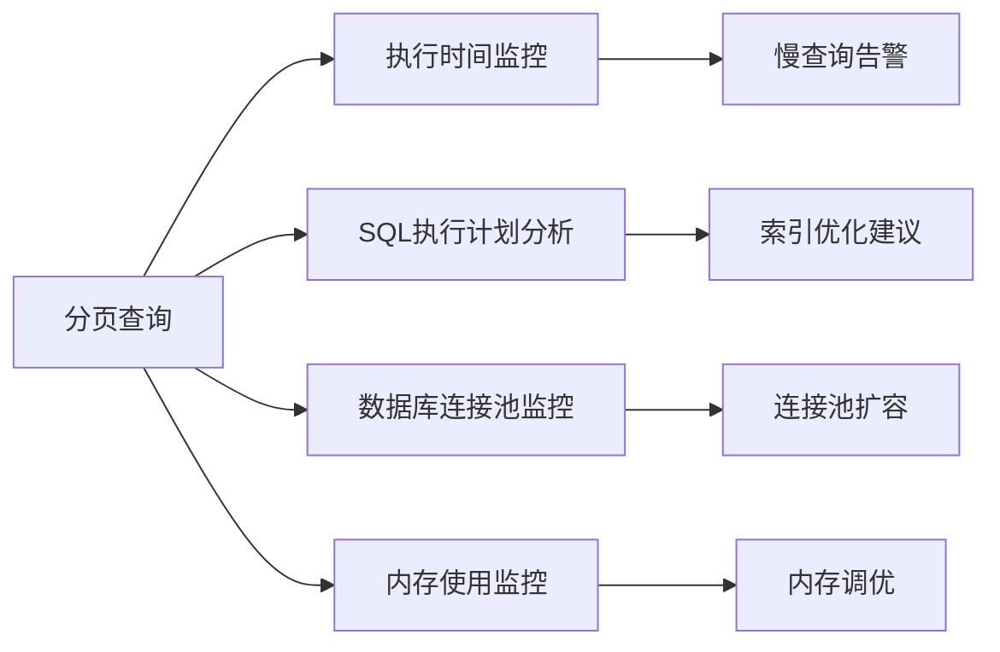

# 分页插件配置

<cite>
**本文档引用的文件**
- [MybatisPlusConfig.java](file://smart-admin-api-java17-springboot3/sa-base/src/main/java/net/lab1024/sa/base/config/MybatisPlusConfig.java)
- [SmartPageUtil.java](file://smart-admin-api-java17-springboot3/sa-base/src/main/java/net/lab1024/sa/base/common/util/SmartPageUtil.java)
- [PageParam.java](file://smart-admin-api-java17-springboot3/sa-base/src/main/java/net/lab1024/sa/base/common/domain/PageParam.java)
- [PageResult.java](file://smart-admin-api-java17-springboot3/sa-base/src/main/java/net/lab1024/sa/base/common/domain/PageResult.java)
- [AreaController.java](file://smart-admin-api-java17-springboot3/sa-admin/src/main/java/net/lab1024/sa/admin/module/system/area/controller/AreaController.java)
- [AreaService.java](file://smart-admin-api-java17-springboot3/sa-admin/src/main/java/net/lab1024/sa/admin/module/system/area/service/AreaService.java)
- [AreaDao.java](file://smart-admin-api-java17-springboot3/sa-admin/src/main/java/net/lab1024/sa/admin/module/system/area/dao/AreaDao.java)
- [AreaManager.java](file://smart-admin-api-java17-springboot3/sa-admin/src/main/java/net/lab1024/sa/admin/module/system/area/manager/AreaManager.java)
- [DataSourceConfig.java](file://smart-admin-api-java17-springboot3/sa-base/src/main/java/net/lab1024/sa/base/config/DataSourceConfig.java)
- [sa-base.yaml](file://smart-admin-api-java17-springboot3/sa-base/src/main/resources/dev/sa-base.yaml)
</cite>

## 目录
1. [简介](#简介)
2. [项目结构](#项目结构)
3. [核心组件](#核心组件)
4. [架构概述](#架构概述)
5. [详细组件分析](#详细组件分析)
6. [依赖关系分析](#依赖关系分析)
7. [性能考虑](#性能考虑)
8. [故障排除指南](#故障排除指南)
9. [结论](#结论)

## 简介

Smart Admin项目采用MyBatis-Plus作为ORM框架，并通过PaginationInnerInterceptor实现了高效的分页查询功能。该分页插件配置方案提供了完整的分页解决方案，包括Spring Boot集成、DAO层分页查询支持、以及性能优化策略。

本文档详细介绍了MyBatis-Plus分页插件的配置过程、使用方法以及最佳实践，帮助开发者理解和正确使用分页功能。

## 项目结构

Smart Admin项目采用分层架构设计，分页功能分布在多个层次中：

**图表来源**
- [MybatisPlusConfig.java](file://smart-admin-api-java17-springboot3/sa-base/src/main/java/net/lab1024/sa/base/config/MybatisPlusConfig.java#L21-L33)
- [AreaController.java](file://smart-admin-api-java17-springboot3/sa-admin/src/main/java/net/lab1024/sa/admin/module/system/area/controller/AreaController.java#L33-L41)

**章节来源**
- [MybatisPlusConfig.java](file://smart-admin-api-java17-springboot3/sa-base/src/main/java/net/lab1024/sa/base/config/MybatisPlusConfig.java#L1-L34)
- [AreaController.java](file://smart-admin-api-java17-springboot3/sa-admin/src/main/java/net/lab1024/sa/admin/module/system/area/controller/AreaController.java#L1-L93)

## 核心组件

### MybatisPlusConfig类

MybatisPlusConfig类是分页插件配置的核心入口，负责创建和注册PaginationInnerInterceptor实例。

**图表来源**
- [MybatisPlusConfig.java](file://smart-admin-api-java17-springboot3/sa-base/src/main/java/net/lab1024/sa/base/config/MybatisPlusConfig.java#L26-L30)

### 分页工具类

SmartPageUtil提供了分页参数转换和结果封装的功能：

**图表来源**
- [SmartPageUtil.java](file://smart-admin-api-java17-springboot3/sa-base/src/main/java/net/lab1024/sa/base/common/util/SmartPageUtil.java#L31-L58)
- [PageParam.java](file://smart-admin-api-java17-springboot3/sa-base/src/main/java/net/lab1024/sa/base/common/domain/PageParam.java#L25-L48)
- [PageResult.java](file://smart-admin-api-java17-springboot3/sa-base/src/main/java/net/lab1024/sa/base/common/domain/PageResult.java#L18-L53)

**章节来源**
- [SmartPageUtil.java](file://smart-admin-api-java17-springboot3/sa-base/src/main/java/net/lab1024/sa/base/common/util/SmartPageUtil.java#L1-L119)
- [PageParam.java](file://smart-admin-api-java17-springboot3/sa-base/src/main/java/net/lab1024/sa/base/common/domain/PageParam.java#L1-L48)
- [PageResult.java](file://smart-admin-api-java17-springboot3/sa-base/src/main/java/net/lab1024/sa/base/common/domain/PageResult.java#L1-L54)

## 架构概述

Smart Admin的分页架构采用了多层设计，确保了良好的可维护性和扩展性：

**图表来源**
- [MybatisPlusConfig.java](file://smart-admin-api-java17-springboot3/sa-base/src/main/java/net/lab1024/sa/base/config/MybatisPlusConfig.java#L26-L30)
- [DataSourceConfig.java](file://smart-admin-api-java17-springboot3/sa-base/src/main/java/net/lab1024/sa/base/config/DataSourceConfig.java#L139-L145)

## 详细组件分析

### MyBatis-Plus分页插件配置

#### paginationInterceptor()方法实现

MyBatis-Plus分页插件的核心配置通过paginationInterceptor()方法实现：

**图表来源**
- [MybatisPlusConfig.java](file://smart-admin-api-java17-springboot3/sa-base/src/main/java/net/lab1024/sa/base/config/MybatisPlusConfig.java#L26-L30)

#### 分页插件注册过程

分页插件的注册过程涉及多个关键步骤：

1. **创建MybatisPlusInterceptor实例**：作为主拦截器容器
2. **添加PaginationInnerInterceptor**：注册MySQL特定的分页处理器
3. **配置数据库类型**：明确指定使用MySQL数据库
4. **集成到MyBatis**：通过DataSourceConfig配置集成

**章节来源**
- [MybatisPlusConfig.java](file://smart-admin-api-java17-springboot3/sa-base/src/main/java/net/lab1024/sa/base/config/MybatisPlusConfig.java#L26-L30)
- [DataSourceConfig.java](file://smart-admin-api-java17-springboot3/sa-base/src/main/java/net/lab1024/sa/base/config/DataSourceConfig.java#L139-L145)

### Spring Boot集成

#### 数据源配置

分页插件与Spring Boot的数据源配置紧密集成：

**图表来源**
- [DataSourceConfig.java](file://smart-admin-api-java17-springboot3/sa-base/src/main/java/net/lab1024/sa/base/config/DataSourceConfig.java#L139-L145)
- [sa-base.yaml](file://smart-admin-api-java17-springboot3/sa-base/src/main/resources/dev/sa-base.yaml#L3-L15)

**章节来源**
- [DataSourceConfig.java](file://smart-admin-api-java17-springboot3/sa-base/src/main/java/net/lab1024/sa/base/config/DataSourceConfig.java#L72-L169)
- [sa-base.yaml](file://smart-admin-api-java17-springboot3/sa-base/src/main/resources/dev/sa-base.yaml#L1-L187)

### DAO层分页查询

#### 分页查询调用方式

DAO层的分页查询遵循标准的MyBatis-Plus模式：

**图表来源**
- [AreaController.java](file://smart-admin-api-java17-springboot3/sa-admin/src/main/java/net/lab1024/sa/admin/module/system/area/controller/AreaController.java#L39-L41)
- [AreaService.java](file://smart-admin-api-java17-springboot3/sa-admin/src/main/java/net/lab1024/sa/admin/module/system/area/service/AreaService.java#L44-L46)
- [AreaManager.java](file://smart-admin-api-java17-springboot3/sa-admin/src/main/java/net/lab1024/sa/admin/module/system/area/manager/AreaManager.java#L35-L40)

#### 返回结果处理

分页查询的结果通过SmartPageUtil进行统一处理：

**图表来源**
- [SmartPageUtil.java](file://smart-admin-api-java17-springboot3/sa-base/src/main/java/net/lab1024/sa/base/common/util/SmartPageUtil.java#L64-L80)

**章节来源**
- [AreaController.java](file://smart-admin-api-java17-springboot3/sa-admin/src/main/java/net/lab1024/sa/admin/module/system/area/controller/AreaController.java#L39-L41)
- [AreaService.java](file://smart-admin-api-java17-springboot3/sa-admin/src/main/java/net/lab1024/sa/admin/module/system/area/service/AreaService.java#L44-L46)
- [AreaManager.java](file://smart-admin-api-java17-springboot3/sa-admin/src/main/java/net/lab1024/sa/admin/module/system/area/manager/AreaManager.java#L35-L40)
- [AreaDao.java](file://smart-admin-api-java17-springboot3/sa-admin/src/main/java/net/lab1024/sa/admin/module/system/area/dao/AreaDao.java#L29-L30)

## 依赖关系分析

### 组件耦合度分析

Smart Admin的分页功能展现了良好的模块化设计：

**图表来源**
- [MybatisPlusConfig.java](file://smart-admin-api-java17-springboot3/sa-base/src/main/java/net/lab1024/sa/base/config/MybatisPlusConfig.java#L26-L30)
- [SmartPageUtil.java](file://smart-admin-api-java17-springboot3/sa-base/src/main/java/net/lab1024/sa/base/common/util/SmartPageUtil.java#L31-L58)

### 外部依赖分析

分页插件的主要外部依赖包括：

| 依赖组件 | 版本要求 | 用途 | 配置位置 |
|---------|---------|------|----------|
| MyBatis-Plus | 3.x | ORM框架和分页支持 | MybatisPlusConfig |
| MySQL驱动 | 8.x+ | 数据库连接 | application.yml |
| Druid连接池 | 1.2.x+ | 数据源管理 | DataSourceConfig |
| Spring Boot | 3.x | 应用框架 | pom.xml |

**章节来源**
- [MybatisPlusConfig.java](file://smart-admin-api-java17-springboot3/sa-base/src/main/java/net/lab1024/sa/base/config/MybatisPlusConfig.java#L1-L34)
- [DataSourceConfig.java](file://smart-admin-api-java17-springboot3/sa-base/src/main/java/net/lab1024/sa/base/config/DataSourceConfig.java#L72-L169)

## 性能考虑

### 分页性能优化策略

Smart Admin采用了多种性能优化策略来提升分页查询效率：

#### 页面大小限制

系统对页面大小进行了合理的限制，防止用户设置过大的页面导致性能问题：

| 参数 | 默认值 | 最大值 | 说明 |
|------|--------|--------|------|
| pageSize | 10 | 500 | 每页最大记录数 |
| searchCount | true | - | 是否查询总记录数 |
| 排序字段数 | 10 | 10 | 排序字段最大数量 |

#### 深度分页优化

对于大数据量场景，系统提供了以下优化措施：

1. **索引优化**：确保分页查询的排序字段有适当的索引
2. **查询优化**：避免在WHERE条件中使用函数表达式
3. **缓存策略**：对频繁查询的分页结果进行缓存
4. **异步处理**：对于特别大的数据集，考虑异步导出功能

#### 性能监控指标

### 最佳实践建议

1. **合理设置页面大小**：根据业务需求设置合适的页面大小
2. **使用索引**：确保分页查询的排序字段有索引
3. **控制查询复杂度**：避免在分页查询中使用复杂的JOIN操作
4. **监控性能指标**：定期监控分页查询的性能表现
5. **缓存策略**：对静态数据或不经常变化的数据进行缓存

## 故障排除指南

### 常见问题及解决方案

#### 分页插件未生效

**问题描述**：分页查询没有按照预期进行分页

**可能原因**：
1. 分页插件未正确注册
2. 数据源配置问题
3. MyBatis-Plus版本不兼容

**解决方案**：
1. 检查MybatisPlusConfig配置是否正确
2. 确认DataSourceConfig中是否正确添加了分页插件
3. 验证MyBatis-Plus版本兼容性

#### 分页查询性能问题

**问题描述**：大数据量分页查询响应缓慢

**诊断步骤**：
1. 检查SQL执行计划
2. 分析数据库索引使用情况
3. 监控数据库连接池状态

**优化建议**：
1. 添加适当的数据库索引
2. 优化查询条件
3. 考虑使用游标分页替代传统分页

#### 内存溢出问题

**问题描述**：大数据量查询导致内存溢出

**预防措施**：
1. 设置合理的页面大小限制
2. 实现流式处理机制
3. 使用异步查询处理大结果集

**章节来源**
- [SmartPageUtil.java](file://smart-admin-api-java17-springboot3/sa-base/src/main/java/net/lab1024/sa/base/common/util/SmartPageUtil.java#L44-L56)
- [PageParam.java](file://smart-admin-api-java17-springboot3/sa-base/src/main/java/net/lab1024/sa/base/common/domain/PageParam.java#L25-L48)

## 结论

Smart Admin项目的MyBatis-Plus分页插件配置方案展现了优秀的架构设计和工程实践。通过合理的分层设计、完善的工具类支持以及全面的性能优化策略，该方案能够满足大多数业务场景的分页需求。

### 主要优势

1. **配置简单**：通过MybatisPlusConfig即可完成分页插件的配置
2. **集成完善**：与Spring Boot和MyBatis-Plus无缝集成
3. **性能优化**：内置多种性能优化策略
4. **易于扩展**：良好的模块化设计便于功能扩展
5. **安全可靠**：包含SQL注入防护等安全措施

### 使用建议

1. **遵循最佳实践**：合理设置页面大小，确保查询性能
2. **监控系统性能**：定期检查分页查询的性能表现
3. **持续优化**：根据业务发展调整分页策略
4. **文档维护**：保持配置文档的及时更新

通过本文档的详细介绍，开发者可以深入理解Smart Admin分页插件的工作原理，并能够正确配置和使用这一重要的功能特性。