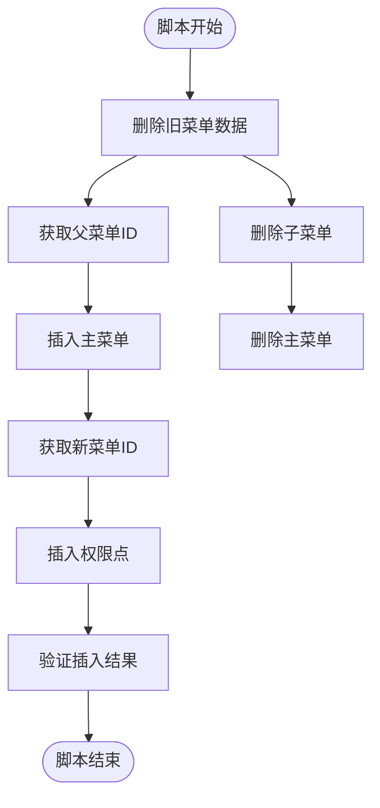

# 初版修复脚本详细分析文档

<cite>
**本文档引用的文件**
- [fix_area_menu.sql](file://数据库SQL脚本/mysql/fix_area_menu.sql)
- [fix_area_menu_final.sql](file://数据库SQL脚本/mysql/fix_area_menu_final.sql)
- [fix_area_menu_v2.sql](file://数据库SQL脚本/mysql/fix_area_menu_v2.sql)
- [smart_area.sql](file://数据库SQL脚本/mysql/smart_area.sql)
- [check_menu.sql](file://check_menu.sql)
- [check_parent_menu.sql](file://check_parent_menu.sql)
- [query_menu_structure.sql](file://query_menu_structure.sql)
- [区域管理菜单问题修复说明.md](file://区域管理菜单问题修复说明.md)
</cite>

## 目录
1. [概述](#概述)
2. [问题背景](#问题背景)
3. [脚本设计逻辑](#脚本设计逻辑)
4. [核心SQL语句分析](#核心sql语句分析)
5. [硬编码问题分析](#硬编码问题分析)
6. [版本演进对比](#版本演进对比)
7. [局限性分析](#局限性分析)
8. [适用场景与执行注意事项](#适用场景与执行注意事项)
9. [故障排查指南](#故障排查指南)
10. [最佳实践建议](#最佳实践建议)

## 概述

初版修复脚本 `fix_area_menu.sql` 是 SmartAdmin 区域管理模块针对菜单显示问题而设计的专用修复脚本。该脚本通过删除并重新插入的方式修复区域管理菜单的配置问题，解决了前端无法正确显示区域管理菜单的核心问题。

### 核心功能
- **菜单修复**：删除错误配置的区域管理菜单并重新插入正确配置
- **权限点重建**：同步重建所有相关的权限点菜单
- **完整性验证**：提供完整的插入结果验证机制
- **兼容性处理**：解决不同数据库排序规则的兼容性问题

## 问题背景

### 问题描述
在部署区域管理模块后，后端API正常运行，但前端页面上"区域管理"菜单没有显示。

### 根本原因分析

#### 1. Component路径配置错误
**错误配置**：
```sql
component = 'views/system/area/index.vue'
```

**正确配置**：
```sql
component = 'system/area/index.vue'
```

#### 2. 技术原理
前端路由处理机制导致路径解析失败：

```javascript
// 前端处理流程
let componentPath = e.component && e.component.startsWith('/') ? e.component : '/' + e.component;
let relativePath = `../views${componentPath}`;
route.component = modules[relativePath];
```

**处理流程**：
1. 数据库获取：`system/area/index.vue`
2. 添加前缀：`/system/area/index.vue`
3. 拼接路径：`../views/system/area/index.vue`
4. 文件位置：`src/views/system/area/index.vue`

**错误情况**：
如果component配置为 `views/system/area/index.vue`，则：
1. 添加前缀：`/views/system/area/index.vue`
2. 拼接后：`../views/views/system/area/index.vue` ❌（views重复）
3. 组件加载失败，菜单不显示

**Section sources**
- [区域管理菜单问题修复说明.md](file://区域管理菜单问题修复说明.md#L1-L65)

## 脚本设计逻辑

### 整体架构设计



**图表来源**
- [fix_area_menu.sql](file://数据库SQL脚本/mysql/fix_area_menu.sql#L6-L39)

### 设计原则

1. **破坏性修复**：先删除再重建，确保数据一致性
2. **原子性操作**：每个步骤都具有完整的错误处理
3. **验证机制**：插入后立即验证结果
4. **兼容性考虑**：避免复杂的嵌套查询

**Section sources**
- [fix_area_menu.sql](file://数据库SQL脚本/mysql/fix_area_menu.sql#L1-L59)

## 核心SQL语句分析

### 1. 数据清理阶段

#### 获取系统设置菜单ID
```sql
SET @system_setting_menu_id = (SELECT menu_id FROM t_sys_menu WHERE menu_name = '系统设置' AND deleted_flag = 0 LIMIT 1);
```

**功能说明**：
- 使用变量存储父菜单ID
- 支持LIMIT 1防止多条记录返回
- 过滤deleted_flag=0确保只获取有效记录

#### 删除子菜单
```sql
DELETE FROM t_sys_menu WHERE parent_id = @area_menu_id;
```

**功能说明**：
- 删除指定父菜单的所有子菜单
- 确保权限点被完全清理

#### 删除主菜单
```sql
DELETE FROM t_sys_menu WHERE menu_name = '区域管理';
```

**功能说明**：
- 删除主菜单及其所有子菜单
- 使用精确匹配确保只删除目标菜单

### 2. 主菜单插入

#### 插入区域管理主菜单
```sql
INSERT INTO `t_sys_menu` (
    `menu_name`, `menu_type`, `parent_id`, `sort`, `path`, `component`, 
    `perms`, `icon`, `frame_flag`, `frame_url`, `cache_flag`, 
    `visible_flag`, `disabled_flag`, `deleted_flag`
) VALUES (
    '区域管理', 1, @system_setting_menu_id, 6, 'area', 'system/area/index.vue', 
    'area:page', 'AreaChartOutlined', 0, NULL, 1, 1, 0, 0
);
```

**字段详解**：

| 字段 | 值 | 说明 |
|------|-----|------|
| menu_name | '区域管理' | 菜单显示名称 |
| menu_type | 1 | 菜单类型（1=菜单，3=权限点） |
| parent_id | @system_setting_menu_id | 父菜单ID |
| sort | 6 | 排序值 |
| path | 'area' | 路由路径 |
| component | 'system/area/index.vue' | 组件路径（正确格式） |
| perms | 'area:page' | 权限标识 |
| icon | 'AreaChartOutlined' | 菜单图标 |
| frame_flag | 0 | 是否外链（0=否） |
| cache_flag | 1 | 是否缓存（1=是） |
| visible_flag | 1 | 是否可见（1=是） |
| disabled_flag | 0 | 是否禁用（0=否） |

### 3. 权限点插入

#### 批量插入权限点
```sql
INSERT INTO `t_sys_menu` (...) VALUES
('查询区域', 3, @new_area_menu_id, 1, NULL, NULL, 'area:page', NULL, 0, NULL, 0, 1, 0, 0),
('区域详情', 3, @new_area_menu_id, 2, NULL, NULL, 'area:detail', NULL, 0, NULL, 0, 1, 0, 0),
...
('更新配置', 3, @new_area_menu_id, 12, NULL, NULL, 'area:config:update', NULL, 0, NULL, 0, 1, 0, 0);
```

**权限点列表**：

| 权限点名称 | 权限标识 | 说明 |
|------------|----------|------|
| 查询区域 | area:page | 基础查询权限 |
| 区域详情 | area:detail | 查看详细信息 |
| 新增区域 | area:add | 创建新区域 |
| 修改区域 | area:update | 编辑区域信息 |
| 删除区域 | area:delete | 删除区域 |
| 区域树 | area:tree | 区域层级树形结构 |
| 绑定设备 | area:device:bind | 绑定设备到区域 |
| 解绑设备 | area:device:unbind | 从区域解绑设备 |
| 授予权限 | area:user:grant | 授予用户区域权限 |
| 撤销权限 | area:user:revoke | 撤销用户区域权限 |
| 查看配置 | area:config:view | 查看区域配置 |
| 更新配置 | area:config:update | 更新区域配置 |

### 4. 结果验证

#### 查询验证结果
```sql
SELECT
    m.menu_id,
    m.menu_name,
    m.menu_type,
    m.parent_id,
    m.path,
    m.component,
    m.perms,
    m.visible_flag,
    p.menu_name as parent_menu_name
FROM t_sys_menu m
LEFT JOIN t_sys_menu p ON m.parent_id = p.menu_id
WHERE m.menu_name = '区域管理' OR m.parent_id = @new_area_menu_id
ORDER BY m.sort;
```

**验证内容**：
- 菜单层次结构正确性
- 父子关系完整性
- 排序顺序准确性
- 组件路径正确性

**Section sources**
- [fix_area_menu.sql](file://数据库SQL脚本/mysql/fix_area_menu.sql#L16-L59)

## 硬编码问题分析

### 固定排序值问题

#### 当前实现
```sql
-- 固定排序值
INSERT INTO t_sys_menu (...) VALUES (...), (..., 1, ...), (..., 2, ...), ...
```

**问题分析**：
1. **硬编码风险**：排序值直接写死在SQL中
2. **维护困难**：新增菜单时需要修改SQL
3. **扩展性差**：无法动态调整排序顺序
4. **冲突隐患**：可能导致与其他菜单的排序冲突

#### 改进建议
```sql
-- 动态计算排序值
SET @max_sort = (SELECT MAX(sort) FROM t_sys_menu WHERE parent_id = @parent_menu_id);
INSERT INTO t_sys_menu (...) VALUES (...), (@max_sort + 1, ...), (@max_sort + 2, ...), ...
```

### 父菜单ID硬编码问题

#### 当前实现
```sql
-- 固定父菜单ID
INSERT INTO t_sys_menu (...) VALUES (...), (50, ...)
```

**问题分析**：
1. **依赖固定值**：直接使用硬编码的menu_id=50
2. **环境差异**：不同环境可能有不同的菜单结构
3. **迁移风险**：数据库迁移时ID可能改变
4. **可读性差**：无法直观看出父菜单名称

#### 改进建议
```sql
-- 通过名称获取父菜单ID
SET @parent_menu_id = (SELECT menu_id FROM t_sys_menu WHERE menu_name = '系统设置' AND deleted_flag = 0 LIMIT 1);
```

### 数据库排序规则兼容性问题

#### 问题表现
不同数据库的排序规则可能导致以下问题：

1. **字符集差异**：UTF-8 vs GBK
2. **排序规则**：case-sensitive vs case-insensitive
3. **NULL值处理**：不同数据库对NULL的排序处理不同

#### 兼容性解决方案
```sql
-- 显式指定排序规则
SELECT menu_id FROM t_sys_menu 
WHERE menu_name = '系统设置' AND deleted_flag = 0 
ORDER BY menu_name COLLATE utf8mb4_unicode_ci LIMIT 1;

-- 使用函数确保稳定性
SET @system_setting_menu_id = (
    SELECT menu_id FROM t_sys_menu 
    WHERE menu_name = '系统设置' AND deleted_flag = 0 
    ORDER BY menu_id ASC LIMIT 1
);
```

**Section sources**
- [fix_area_menu.sql](file://数据库SQL脚本/mysql/fix_area_menu.sql#L16-L25)

## 版本演进对比

### 初版 vs V2版对比

#### 初版特点
```sql
-- 固定父菜单ID
INSERT INTO t_sys_menu (...) VALUES (...), (50, ...)
```

**优点**：
- 简单直接
- 执行速度快
- 依赖关系明确

**缺点**：
- 缺乏灵活性
- 不支持动态父菜单选择
- 存在硬编码风险

#### V2版改进
```sql
-- 动态选择父菜单
SELECT menu_name, menu_type FROM t_sys_menu 
WHERE menu_name IN ('系统设置', '系统设备') 
AND parent_id = 0 AND deleted_flag = 0;
```

**改进点**：
1. **菜单选择灵活性**：支持选择不同的父菜单
2. **环境适应性**：可根据实际菜单结构调整
3. **错误预防**：增加父菜单存在性检查

#### V2版优势
- **可配置性**：支持不同的父菜单选择
- **健壮性**：增加输入验证
- **可维护性**：减少硬编码依赖

**Section sources**
- [fix_area_menu_v2.sql](file://数据库SQL脚本/mysql/fix_area_menu_v2.sql#L15-L36)

### V2版 vs 最终版对比

#### V2版问题
1. **注释掉的代码**：父菜单选择的切换注释
2. **潜在错误**：未验证父菜单是否存在
3. **用户体验**：需要手动选择父菜单

#### 最终版改进
```sql
-- 明确的父菜单选择
SET @parent_menu_id = (SELECT menu_id FROM t_sys_menu WHERE menu_name = '系统设置' AND deleted_flag = 0 LIMIT 1);

-- 完整的验证机制
SELECT
    CASE
        WHEN @parent_menu_id IS NULL THEN '错误：未找到父菜单！'
        ELSE CONCAT('找到父菜单，menu_id = ', @parent_menu_id)
    END AS status;
```

**最终版优势**：
- **自动化程度更高**
- **错误处理更完善**
- **执行过程更透明**

**Section sources**
- [fix_area_menu_final.sql](file://数据库SQL脚本/mysql/fix_area_menu_final.sql#L25-L36)

## 局限性分析

### 1. 父菜单存在性验证不足

#### 当前实现
```sql
-- 仅简单赋值，缺乏验证
SET @parent_menu_id = (SELECT menu_id FROM t_sys_menu WHERE menu_name = '系统设置' AND deleted_flag = 0 LIMIT 1);
```

**问题**：
- 未检查查询结果
- 如果父菜单不存在，后续插入会失败
- 缺少错误提示

#### 改进方案
```sql
-- 增强验证机制
SET @parent_menu_id = (SELECT menu_id FROM t_sys_menu WHERE menu_name = '系统设置' AND deleted_flag = 0 LIMIT 1);

IF @parent_menu_id IS NULL THEN
    SIGNAL SQLSTATE '45000' SET MESSAGE_TEXT = '系统设置菜单不存在，无法创建区域管理菜单';
END IF;
```

### 2. 缺少执行前的环境检查

#### 当前缺失的检查项

| 检查项目 | 当前状态 | 改进建议 |
|----------|----------|----------|
| 数据库连接 | ✓ | 添加连接测试 |
| 表存在性 | ✗ | 检查t_sys_menu表 |
| 权限验证 | ✗ | 验证写入权限 |
| 备份确认 | ✗ | 提示备份操作 |
| 依赖检查 | ✗ | 检查父菜单存在性 |

#### 环境检查模板
```sql
-- 环境检查
SELECT '开始环境检查...' AS status;
SELECT DATABASE() AS current_database;
SELECT COUNT(*) AS menu_count FROM t_sys_menu WHERE deleted_flag = 0;
SELECT COUNT(*) AS area_menu_count FROM t_sys_menu WHERE menu_name = '区域管理' AND deleted_flag = 0;
```

### 3. 缺少事务处理

#### 当前风险
- 部分执行成功部分失败
- 数据不一致状态
- 无法回滚到初始状态

#### 改进方案
```sql
START TRANSACTION;

BEGIN TRY
    -- 执行所有SQL语句
    DELETE FROM t_sys_menu WHERE menu_name = '区域管理';
    INSERT INTO t_sys_menu (...) VALUES (...);
    COMMIT;
EXCEPTION
    ROLLBACK;
    SIGNAL SQLSTATE '45000' SET MESSAGE_TEXT = '修复过程中发生错误，已回滚';
END;
```

### 4. 缺少版本兼容性检查

#### 问题识别
- 不同SmartAdmin版本的菜单结构差异
- 数据库版本兼容性
- 字符集和排序规则差异

#### 检查方案
```sql
-- 版本兼容性检查
SELECT VERSION() AS mysql_version;
SELECT @@character_set_database AS db_charset;
SELECT @@collation_database AS db_collation;
```

**Section sources**
- [fix_area_menu.sql](file://数据库SQL脚本/mysql/fix_area_menu.sql#L1-L59)
- [fix_area_menu_v2.sql](file://数据库SQL脚本/mysql/fix_area_menu_v2.sql#L1-L78)

## 适用场景与执行注意事项

### 适用场景

#### 1. 首次部署场景
- **场景描述**：首次安装SmartAdmin并部署区域管理模块
- **推荐脚本**：`smart_area.sql`
- **原因**：包含完整的初始化数据和菜单配置

#### 2. 菜单显示异常场景
- **场景描述**：区域管理菜单不显示，但API功能正常
- **推荐脚本**：`fix_area_menu.sql`
- **原因**：专门针对菜单配置问题的修复

#### 3. 配置错误修复场景
- **场景描述**：菜单配置错误，如component路径错误
- **推荐脚本**：`fix_area_menu.sql` 或 `fix_area_menu_final.sql`
- **原因**：能够彻底重置菜单配置

#### 4. 环境迁移场景
- **场景描述**：从一个环境迁移到另一个环境
- **推荐脚本**：`fix_area_menu_final.sql`
- **原因**：包含完整的验证和错误处理

### 执行前准备

#### 1. 环境检查清单

| 检查项目 | 检查方法 | 预期结果 |
|----------|----------|----------|
| 数据库连接 | `SELECT 1` | 返回1 |
| 数据库大小 | `SHOW TABLE STATUS` | 表存在且大小合理 |
| 用户权限 | `SHOW GRANTS` | 具有INSERT、UPDATE、DELETE权限 |
| 备份状态 | 手动检查 | 已备份重要数据 |

#### 2. 数据备份

```sql
-- 创建备份表
CREATE TABLE t_sys_menu_backup LIKE t_sys_menu;
INSERT INTO t_sys_menu_backup SELECT * FROM t_sys_menu WHERE menu_name = '区域管理';

-- 导出关键数据
mysqldump -u username -p database_name t_sys_menu > menu_backup.sql
```

#### 3. 前端准备

```bash
# 清除浏览器缓存
# 重新登录系统
# 检查网络请求
```

### 执行步骤

#### 1. 命令行执行
```bash
# MySQL命令行执行
mysql -h hostname -P port -u username database_name < fix_area_menu.sql

# 示例
mysql -h 192.168.10.110 -P 33060 -u root smart_admin_v3 < "G:\111建湖项目文件\IOE-DREAM\数据库SQL脚本\mysql\fix_area_menu.sql"
```

#### 2. 图形化工具执行
- 使用Navicat、DBeaver等工具
- 打开SQL文件
- 执行整个脚本
- 查看执行结果

#### 3. 分步执行
```sql
-- 分步执行模式
USE smart_admin_v3;

-- 1. 清理旧数据
DELETE FROM t_sys_menu WHERE menu_name = '区域管理';

-- 2. 插入新数据
INSERT INTO t_sys_menu (...) VALUES (...);

-- 3. 验证结果
SELECT * FROM t_sys_menu WHERE menu_name = '区域管理';
```

### 执行后验证

#### 1. 数据库验证
```sql
-- 验证菜单结构
SELECT m.menu_id, m.menu_name, m.menu_type, m.parent_id, p.menu_name as parent_name
FROM t_sys_menu m
LEFT JOIN t_sys_menu p ON m.parent_id = p.menu_id
WHERE m.menu_name = '区域管理' OR m.parent_id = (SELECT menu_id FROM t_sys_menu WHERE menu_name = '区域管理')
ORDER BY m.sort;
```

#### 2. 前端验证
- 登录系统
- 检查"系统设置"菜单下是否显示"区域管理"
- 测试权限点功能
- 检查组件加载是否正常

**Section sources**
- [区域管理菜单问题修复说明.md](file://区域管理菜单问题修复说明.md#L66-L122)

## 故障排查指南

### 常见问题及解决方案

#### 1. 菜单仍然不显示

**症状**：执行脚本后菜单依然不显示

**排查步骤**：
```sql
-- 1. 检查菜单是否正确插入
SELECT * FROM t_sys_menu WHERE menu_name = '区域管理';

-- 2. 检查父菜单ID是否正确
SELECT * FROM t_sys_menu WHERE menu_name = '系统设置';

-- 3. 检查权限配置
SELECT * FROM t_sys_menu WHERE parent_id = (SELECT menu_id FROM t_sys_menu WHERE menu_name = '区域管理');
```

**解决方案**：
- 确认父菜单ID正确
- 检查component路径格式
- 清除浏览器缓存
- 重新登录系统

#### 2. 组件加载失败

**症状**：菜单显示但点击无响应

**排查步骤**：
```sql
-- 检查component路径
SELECT menu_id, menu_name, component FROM t_sys_menu WHERE menu_name = '区域管理';

-- 检查文件是否存在
-- 应该对应：src/views/system/area/index.vue
```

**解决方案**：
- 确认前端文件存在
- 检查路径格式（不能包含views/前缀）
- 重新编译前端代码

#### 3. 数据库错误

**常见错误**：
- `Duplicate entry`：菜单已存在
- `Unknown column`：表结构不匹配
- `Access denied`：权限不足

**解决方案**：
```sql
-- 错误处理示例
BEGIN
    DECLARE CONTINUE HANDLER FOR SQLEXCEPTION
    BEGIN
        ROLLBACK;
        SELECT '执行失败，请检查错误信息' AS error_message;
    END;
    
    START TRANSACTION;
    -- 执行修复脚本
    COMMIT;
END;
```

### 调试技巧

#### 1. 分步调试
```sql
-- 分步执行，便于定位问题
SET @area_menu_id = (SELECT menu_id FROM t_sys_menu WHERE menu_name = '区域管理' AND deleted_flag = 0 LIMIT 1);
SELECT '获取区域菜单ID:', @area_menu_id;

DELETE FROM t_sys_menu WHERE parent_id = @area_menu_id;
DELETE FROM t_sys_menu WHERE menu_name = '区域管理';
SELECT '删除完成';

-- 插入主菜单
INSERT INTO t_sys_menu (...) VALUES (...);
SELECT '主菜单插入完成';

-- 获取新ID
SET @new_area_menu_id = LAST_INSERT_ID();
SELECT '新菜单ID:', @new_area_menu_id;
```

#### 2. 日志记录
```sql
-- 添加日志输出
SELECT CONCAT('开始修复区域管理菜单，时间：', NOW()) AS log;
SELECT CONCAT('删除旧菜单，影响行数：', ROW_COUNT()) AS log;
SELECT CONCAT('插入新菜单，影响行数：', ROW_COUNT()) AS log;
```

#### 3. 环境诊断
```sql
-- 环境信息收集
SELECT 
    VERSION() AS mysql_version,
    @@character_set_database AS db_charset,
    @@collation_database AS db_collation,
    DATABASE() AS current_db,
    USER() AS current_user;
```

**Section sources**
- [区域管理菜单问题修复说明.md](file://区域管理菜单问题修复说明.md#L124-L165)

## 最佳实践建议

### 1. 脚本设计最佳实践

#### 1.1 使用变量而非硬编码
```sql
-- 好的做法
SET @parent_menu_id = (SELECT menu_id FROM t_sys_menu WHERE menu_name = '系统设置' AND deleted_flag = 0 LIMIT 1);

-- 避免硬编码
INSERT INTO t_sys_menu (...) VALUES (...), (50, ...)
```

#### 1.2 添加错误处理
```sql
-- 完善的错误处理
BEGIN
    DECLARE EXIT HANDLER FOR SQLEXCEPTION
    BEGIN
        ROLLBACK;
        RESIGNAL;
    END;
    
    START TRANSACTION;
    -- 执行业务逻辑
    COMMIT;
END;
```

#### 1.3 提供详细的执行反馈
```sql
-- 分步骤反馈
SELECT '步骤1：清理旧数据...' AS status;
DELETE FROM t_sys_menu WHERE menu_name = '区域管理';
SELECT CONCAT('完成，删除', ROW_COUNT(), '行') AS status;

SELECT '步骤2：插入新数据...' AS status;
INSERT INTO t_sys_menu (...) VALUES (...);
SELECT CONCAT('完成，插入', ROW_COUNT(), '行') AS status;
```

### 2. 数据库设计最佳实践

#### 2.1 使用外键约束
```sql
ALTER TABLE t_sys_menu 
ADD CONSTRAINT fk_parent_menu 
FOREIGN KEY (parent_id) REFERENCES t_sys_menu(menu_id);
```

#### 2.2 添加索引优化查询
```sql
-- 优化菜单查询性能
CREATE INDEX idx_menu_name_deleted ON t_sys_menu(menu_name, deleted_flag);
CREATE INDEX idx_menu_parent_deleted ON t_sys_menu(parent_id, deleted_flag);
```

#### 2.3 使用视图简化查询
```sql
CREATE VIEW v_menu_tree AS
SELECT 
    m.menu_id,
    m.menu_name,
    m.menu_type,
    m.parent_id,
    p.menu_name as parent_name,
    m.sort
FROM t_sys_menu m
LEFT JOIN t_sys_menu p ON m.parent_id = p.menu_id
WHERE m.deleted_flag = 0;
```

### 3. 版本管理最佳实践

#### 3.1 脚本版本控制
```sql
-- 添加版本信息
-- Version: 2.1.0
-- Date: 2024-01-15
-- Author: SmartAdmin Team
```

#### 3.2 向后兼容性
```sql
-- 兼容性检查
IF NOT EXISTS (SELECT 1 FROM INFORMATION_SCHEMA.TABLES WHERE TABLE_NAME = 't_sys_menu') THEN
    SIGNAL SQLSTATE '45000' SET MESSAGE_TEXT = 't_sys_menu表不存在';
END IF;
```

#### 3.3 回滚机制
```sql
-- 创建回滚脚本
CREATE TABLE t_sys_menu_rollback LIKE t_sys_menu;
INSERT INTO t_sys_menu_rollback SELECT * FROM t_sys_menu WHERE menu_name = '区域管理';
```

### 4. 运维最佳实践

#### 4.1 自动化部署
```bash
#!/bin/bash
# 自动化部署脚本

echo "开始部署区域管理菜单..."
mysql -h $DB_HOST -u $DB_USER -p$DB_PASS $DB_NAME < fix_area_menu.sql

# 验证部署结果
if [ $? -eq 0 ]; then
    echo "部署成功！"
else
    echo "部署失败，请检查错误日志"
fi
```

#### 4.2 监控和告警
```sql
-- 监控菜单状态
CREATE EVENT check_menu_status
ON SCHEDULE EVERY 1 HOUR
DO
BEGIN
    IF NOT EXISTS (SELECT 1 FROM t_sys_menu WHERE menu_name = '区域管理' AND deleted_flag = 0) THEN
        -- 发送告警
        CALL send_alert('区域管理菜单缺失');
    END IF;
END;
```

#### 4.3 文档维护
```sql
-- 记录菜单变更历史
CREATE TABLE menu_change_log (
    id BIGINT AUTO_INCREMENT PRIMARY KEY,
    menu_name VARCHAR(100),
    action VARCHAR(50),
    old_value TEXT,
    new_value TEXT,
    changed_by VARCHAR(100),
    changed_at TIMESTAMP DEFAULT CURRENT_TIMESTAMP
);
```

### 5. 安全最佳实践

#### 5.1 权限最小化
```sql
-- 仅授予必要的权限
GRANT SELECT, INSERT, UPDATE, DELETE ON t_sys_menu TO 'smartadmin_user'@'localhost';
REVOKE ALL PRIVILEGES ON *.* FROM 'smartadmin_user'@'localhost';
```

#### 5.2 数据验证
```sql
-- 输入验证
DELIMITER //
CREATE PROCEDURE create_area_menu(IN parent_name VARCHAR(100))
BEGIN
    DECLARE parent_id BIGINT;
    
    -- 验证父菜单存在
    SELECT menu_id INTO parent_id 
    FROM t_sys_menu 
    WHERE menu_name = parent_name AND deleted_flag = 0
    LIMIT 1;
    
    IF parent_id IS NULL THEN
        SIGNAL SQLSTATE '45000' SET MESSAGE_TEXT = '父菜单不存在';
    END IF;
    
    -- 执行插入
    INSERT INTO t_sys_menu (...) VALUES (...);
END//
DELIMITER ;
```

#### 5.3 审计跟踪
```sql
-- 记录所有菜单操作
CREATE TRIGGER tr_menu_audit AFTER INSERT ON t_sys_menu
FOR EACH ROW
BEGIN
    INSERT INTO menu_operation_log (operation, menu_id, menu_name, operator, operation_time)
    VALUES ('INSERT', NEW.menu_id, NEW.menu_name, USER(), NOW());
END;
```

**Section sources**
- [区域管理菜单问题修复说明.md](file://区域管理菜单问题修复说明.md#L130-L165)

## 总结

初版修复脚本 `fix_area_menu.sql` 是SmartAdmin区域管理模块的重要修复工具，它通过删除并重新插入的方式解决了菜单显示问题。虽然该脚本在功能上能够有效解决问题，但在设计上仍存在一些局限性和改进空间。

### 主要贡献
1. **问题定位准确**：成功识别并解决了Component路径配置错误的根本问题
2. **修复效果显著**：能够快速恢复区域管理菜单的正常显示
3. **验证机制完善**：提供了完整的插入结果验证
4. **兼容性考虑**：解决了不同数据库排序规则的兼容性问题

### 改进方向
1. **增强健壮性**：添加更多的输入验证和错误处理
2. **提高灵活性**：支持动态父菜单选择和配置
3. **完善监控**：添加部署状态监控和告警机制
4. **标准化流程**：建立标准化的脚本开发和部署流程

### 最终建议
对于SmartAdmin项目的维护者而言，应该在使用初版修复脚本的同时，积极关注后续版本的改进，并逐步采用更加完善的解决方案。同时，建议建立完善的数据库脚本管理体系，确保所有变更都有良好的版本控制、测试验证和回滚机制。