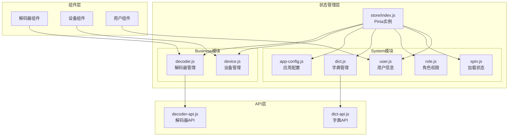
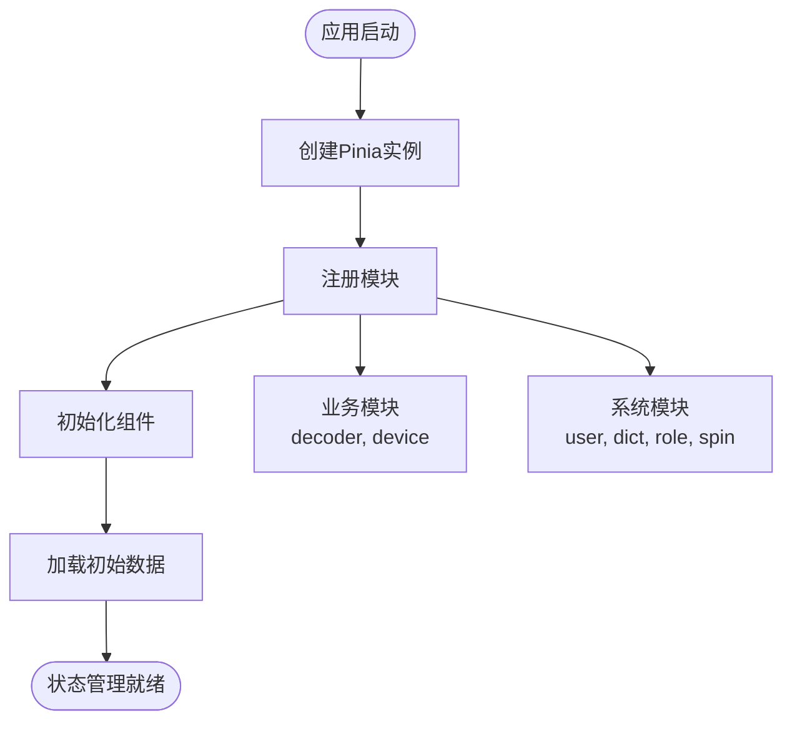
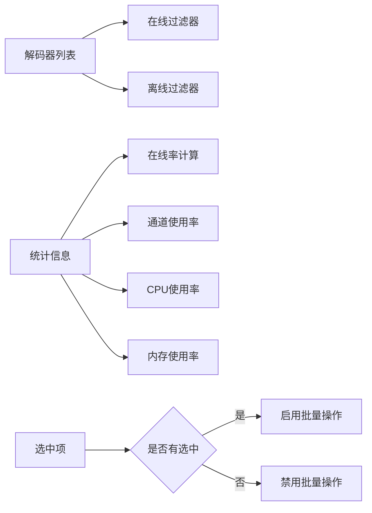
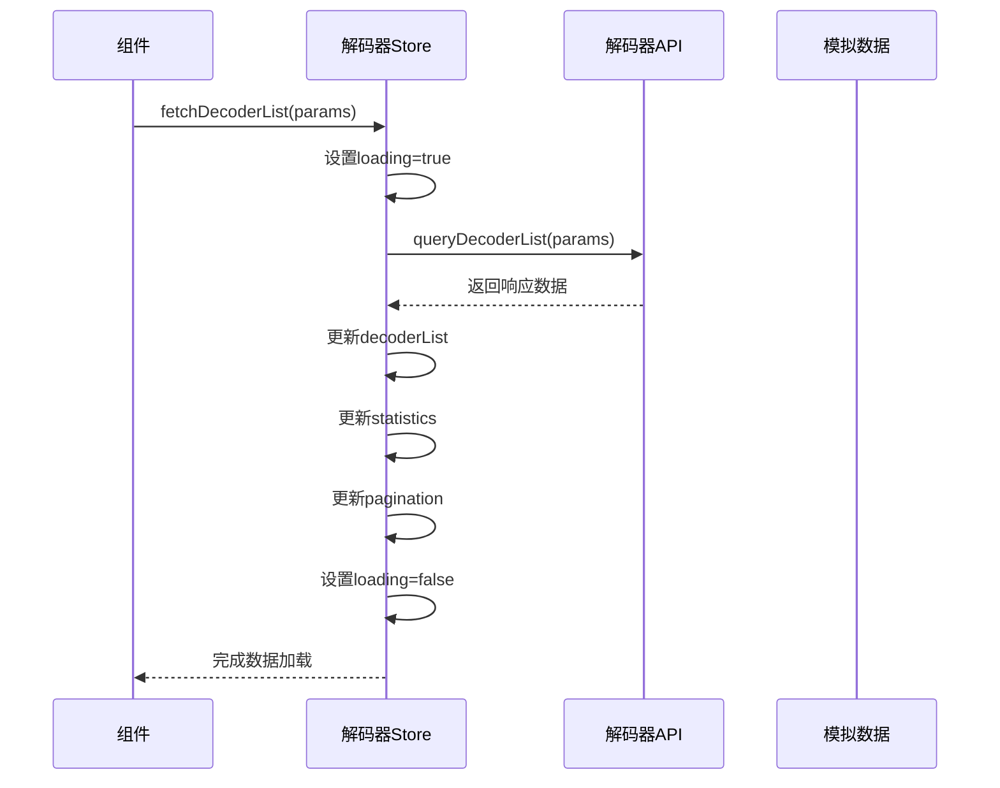
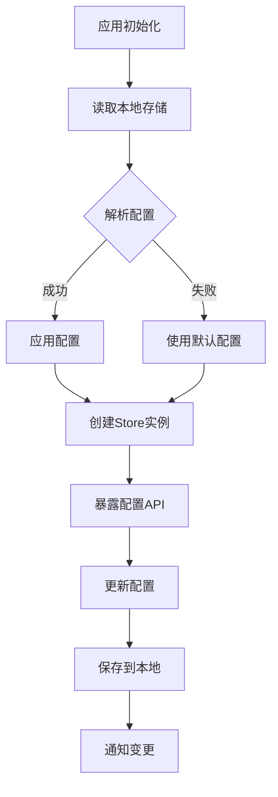
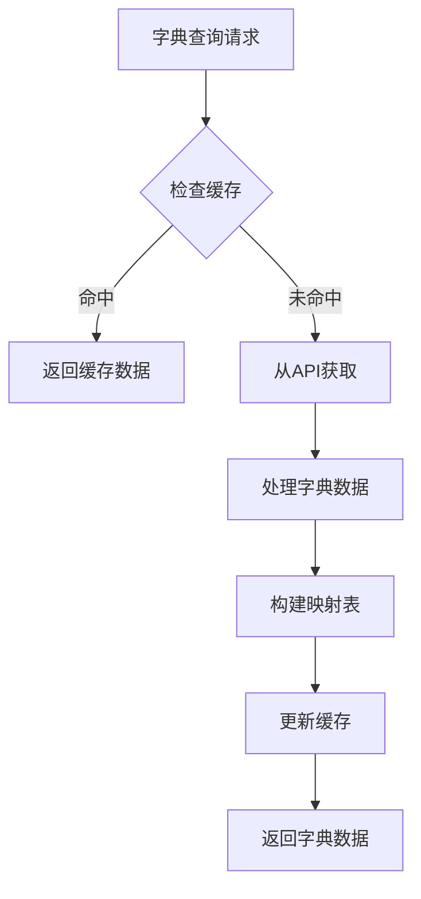
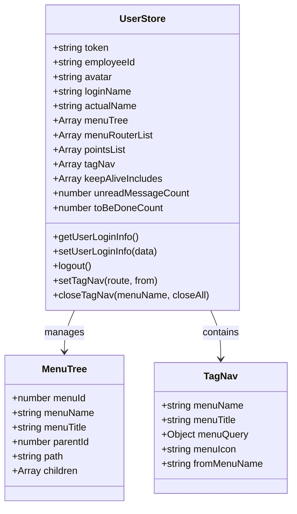
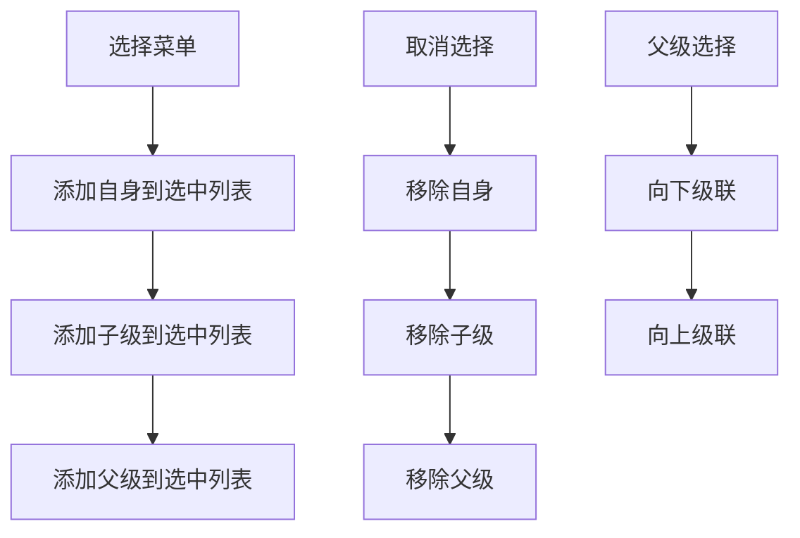
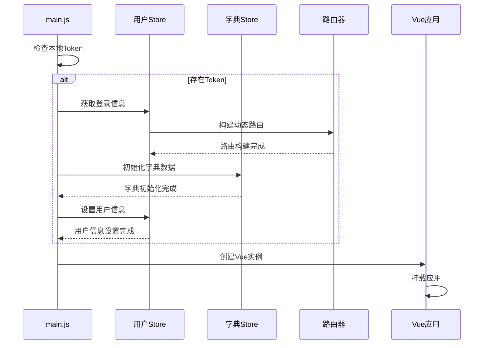
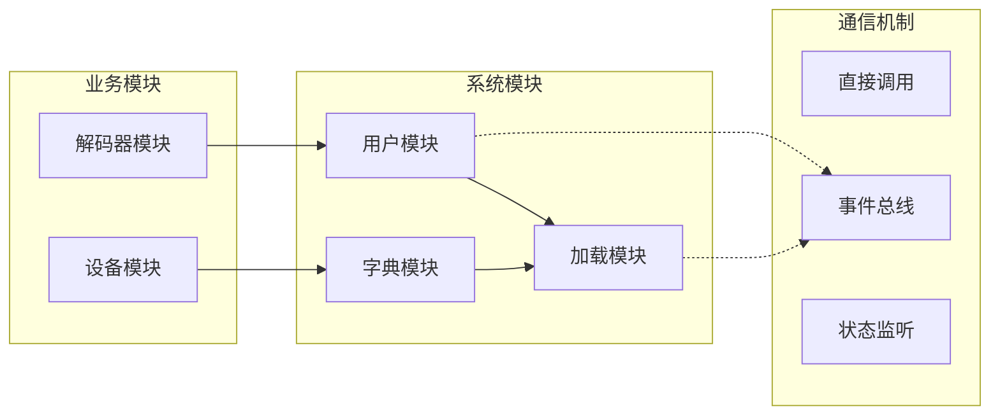

# 前端状态管理

<cite>
**本文档中引用的文件**
- [store/index.js](file://smart-admin-web-javascript/src/store/index.js)
- [store/modules/business/decoder.js](file://smart-admin-web-javascript/src/store/modules/business/decoder.js)
- [store/modules/business/device.js](file://smart-admin-web-javascript/src/store/modules/business/device.js)
- [store/modules/system/app-config.js](file://smart-admin-web-javascript/src/store/modules/system/app-config.js)
- [store/modules/system/dict.js](file://smart-admin-web-javascript/src/store/modules/system/dict.js)
- [store/modules/system/role.js](file://smart-admin-web-javascript/src/store/modules/system/role.js)
- [store/modules/system/spin.js](file://smart-admin-web-javascript/src/store/modules/system/spin.js)
- [store/modules/system/user.js](file://smart-admin-web-javascript/src/store/modules/system/user.js)
- [main.js](file://smart-admin-web-javascript/src/main.js)
- [decoder-api.js](file://smart-admin-web-javascript/src/api/business/smart-video/decoder-api.js)
- [dict-api.js](file://smart-admin-web-javascript/src/api/support/dict-api.js)
</cite>

## 目录
1. [简介](#简介)
2. [项目架构](#项目架构)
3. [Pinia状态管理核心](#pinia状态管理核心)
4. [Business业务模块](#business业务模块)
5. [System系统模块](#system系统模块)
6. [状态管理初始化流程](#状态管理初始化流程)
7. [状态定义与实现](#状态定义与实现)
8. [组件使用示例](#组件使用示例)
9. [状态持久化策略](#状态持久化策略)
10. [模块间通信机制](#模块间通信机制)
11. [性能优化建议](#性能优化建议)
12. [总结](#总结)

## 简介

本文档详细介绍了基于Pinia的状态管理系统实现，涵盖business业务模块和system系统模块的状态管理策略。该系统采用模块化设计，通过清晰的职责分离实现了高效的状态管理机制。

## 项目架构



**图表来源**
- [store/index.js](file://smart-admin-web-javascript/src/store/index.js#L1-L13)
- [store/modules/business/decoder.js](file://smart-admin-web-javascript/src/store/modules/business/decoder.js#L1-L50)
- [store/modules/business/device.js](file://smart-admin-web-javascript/src/store/modules/business/device.js#L1-L50)

## Pinia状态管理核心

### Store初始化

系统通过统一的store入口文件创建Pinia实例，实现了集中化的状态管理配置。



**图表来源**
- [store/index.js](file://smart-admin-web-javascript/src/store/index.js#L10-L13)
- [main.js](file://smart-admin-web-javascript/src/main.js#L73-L98)

**章节来源**
- [store/index.js](file://smart-admin-web-javascript/src/store/index.js#L1-L13)
- [main.js](file://smart-admin-web-javascript/src/main.js#L73-L98)

## Business业务模块

### 解码器管理模块 (decoder.js)

解码器模块负责智能视频系统中解码器的完整生命周期管理，包括设备状态监控、性能统计和远程控制。

#### 状态结构设计

| 状态字段 | 类型 | 描述 | 默认值 |
|---------|------|------|--------|
| decoderList | Array | 解码器设备列表 | [] |
| statistics | Object | 性能统计信息 | 包含各类统计指标 |
| loading | Boolean | 加载状态 | false |
| queryParams | Object | 查询参数 | 分页和过滤条件 |
| pagination | Object | 分页信息 | 当前页、每页大小、总数 |
| selectedRowKeys | Array | 选中项标识 | [] |

#### 关键Getter实现



**图表来源**
- [store/modules/business/decoder.js](file://smart-admin-web-javascript/src/store/modules/business/decoder.js#L53-L74)

#### 核心Action流程



**图表来源**
- [store/modules/business/decoder.js](file://smart-admin-web-javascript/src/store/modules/business/decoder.js#L76-L125)

**章节来源**
- [store/modules/business/decoder.js](file://smart-admin-web-javascript/src/store/modules/business/decoder.js#L1-L439)

### 设备管理模块 (device.js)

设备模块专注于智能视频系统中的设备管理，提供完整的设备生命周期管理和分组功能。

#### 状态管理特点

- **实时性**：支持设备状态的实时更新
- **分组管理**：提供树形结构的设备分组
- **批量操作**：支持设备的批量添加、删除和更新
- **状态同步**：与后端保持设备状态的一致性

**章节来源**
- [store/modules/business/device.js](file://smart-admin-web-javascript/src/store/modules/business/device.js#L1-L227)

## System系统模块

### 应用配置模块 (app-config.js)

应用配置模块管理全局应用设置，支持配置的持久化和动态更新。

#### 配置持久化机制



**图表来源**
- [store/modules/system/app-config.js](file://smart-admin-web-javascript/src/store/modules/system/app-config.js#L16-L30)

**章节来源**
- [store/modules/system/app-config.js](file://smart-admin-web-javascript/src/store/modules/system/app-config.js#L1-L66)

### 字典管理模块 (dict.js)

字典模块提供全局字典数据的统一管理，支持多语言和动态字典更新。

#### 字典数据结构

| 字段 | 类型 | 描述 |
|------|------|------|
| dictList | Array | 字典代码列表 |
| dictMap | Map | 字典数据映射表 |

#### 字典查询流程



**图表来源**
- [store/modules/system/dict.js](file://smart-admin-web-javascript/src/store/modules/system/dict.js#L16-L86)

**章节来源**
- [store/modules/system/dict.js](file://smart-admin-web-javascript/src/store/modules/system/dict.js#L1-L87)

### 用户信息模块 (user.js)

用户模块是最复杂的状态管理模块，负责用户认证、权限管理和界面状态。

#### 用户状态结构



**图表来源**
- [store/modules/system/user.js](file://smart-admin-web-javascript/src/store/modules/system/user.js#L20-L68)

**章节来源**
- [store/modules/system/user.js](file://smart-admin-web-javascript/src/store/modules/system/user.js#L1-L908)

### 角色权限模块 (role.js)

角色模块专门处理权限树的选中状态管理，支持父子级联动选择。

#### 权限树操作



**图表来源**
- [store/modules/system/role.js](file://smart-admin-web-javascript/src/store/modules/system/role.js#L21-L95)

**章节来源**
- [store/modules/system/role.js](file://smart-admin-web-javascript/src/store/modules/system/role.js#L1-L96)

### 加载状态模块 (spin.js)

加载状态模块提供全局的加载指示器管理，确保用户体验的一致性。

**章节来源**
- [store/modules/system/spin.js](file://smart-admin-web-javascript/src/store/modules/system/spin.js#L1-L46)

## 状态管理初始化流程

### 应用启动序列



**图表来源**
- [main.js](file://smart-admin-web-javascript/src/main.js#L50-L71)

### 动态路由构建

系统采用动态路由架构，根据用户权限动态构建路由表：

1. **权限验证**：检查用户Token有效性
2. **菜单获取**：从后端获取用户权限菜单
3. **路由构建**：将菜单转换为路由配置
4. **路由注册**：动态注册到Vue Router

**章节来源**
- [main.js](file://smart-admin-web-javascript/src/main.js#L1-L107)

## 状态定义与实现

### Pinia Store定义模式

所有Store都遵循统一的定义模式：

```javascript
// Store定义模板
export const useStoreName = defineStore({
  id: 'storeName',
  state: () => ({ /* 状态定义 */ }),
  getters: { /* 计算属性 */ },
  actions: { /* 方法实现 */ }
});
```

### Getter实现策略

Getter采用计算属性模式，提供高效的派生状态：

- **缓存机制**：自动缓存计算结果
- **依赖追踪**：只在依赖变化时重新计算
- **链式组合**：支持多个Getter的组合使用

### Action异步处理

Action采用异步模式处理业务逻辑：

- **错误处理**：统一的异常捕获和错误提示
- **状态同步**：API调用前后更新加载状态
- **数据验证**：请求参数和响应数据的验证

**章节来源**
- [store/modules/business/decoder.js](file://smart-admin-web-javascript/src/store/modules/business/decoder.js#L13-L439)
- [store/modules/business/device.js](file://smart-admin-web-javascript/src/store/modules/business/device.js#L13-L227)

## 组件使用示例

### 解码器管理组件

组件通过Composition API使用解码器Store：

```javascript
// 组件使用示例
import { useDecoderStore } from '/@/store/modules/business/decoder'

export default {
  setup() {
    const decoderStore = useDecoderStore()
    
    // 使用状态
    const decoderList = computed(() => decoderStore.decoderList)
    const loading = computed(() => decoderStore.loading)
    
    // 调用Action
    const fetchDecoderList = async (params) => {
      await decoderStore.fetchDecoderList(params)
    }
    
    return {
      decoderList,
      loading,
      fetchDecoderList
    }
  }
}
```

### 用户信息组件

用户组件展示复杂的用户状态管理：

```javascript
// 用户信息组件示例
import { useUserStore } from '/@/store/modules/system/user'

export default {
  setup() {
    const userStore = useUserStore()
    
    // 获取用户信息
    const userInfo = computed(() => ({
      name: userStore.actualName,
      avatar: userStore.avatar,
      menuTree: userStore.menuTree
    }))
    
    // 标签页管理
    const tagNav = computed(() => userStore.getTagNav)
    
    return {
      userInfo,
      tagNav
    }
  }
}
```

## 状态持久化策略

### 本地存储机制

系统采用多层次的持久化策略：

| 存储层级 | 存储内容 | 生命周期 | 更新策略 |
|---------|----------|----------|----------|
| 内存状态 | 实时数据 | 应用会话 | 自动更新 |
| LocalStorage | 用户配置、Token | 持久化 | 手动触发 |
| SessionStorage | 临时会话数据 | 浏览器会话 | 自动清理 |

### 配置持久化

应用配置通过localStorage实现持久化：

```javascript
// 配置持久化流程
const saveConfig = (config) => {
  localStorage.setItem('appConfig', JSON.stringify(config))
}

const loadConfig = () => {
  const saved = localStorage.getItem('appConfig')
  return saved ? JSON.parse(saved) : getDefaultConfig()
}
```

### 用户状态持久化

用户信息通过多种方式持久化：

- **Token**：存储在LocalStorage，支持长期登录
- **用户信息**：存储在Pinia状态中，应用重启后重新加载
- **标签页**：存储在LocalStorage，支持页面刷新后恢复

**章节来源**
- [store/modules/system/app-config.js](file://smart-admin-web-javascript/src/store/modules/system/app-config.js#L16-L30)
- [store/modules/system/user.js](file://smart-admin-web-javascript/src/store/modules/system/user.js#L119-L131)

## 模块间通信机制

### 状态共享模式



### 状态监听机制

系统支持跨模块的状态监听：

```javascript
// 状态监听示例
watch(() => userStore.menuTree, (newTree) => {
  // 当用户菜单发生变化时
  // 更新其他模块的路由配置
  updateOtherModuleRoutes(newTree)
})
```

### 异步状态同步

不同模块间的异步状态同步：

```javascript
// 异步同步流程
const syncUserData = async () => {
  // 等待用户数据加载完成
  await userStore.loadUserInfo()
  
  // 通知其他模块用户信息已更新
  eventBus.emit('user:updated', userStore.userInfo)
  
  // 其他模块响应更新
  eventBus.on('user:updated', (userInfo) => {
    updateUserRelatedStates(userInfo)
  })
}
```

## 性能优化建议

### 状态分割策略

1. **按功能分割**：将相关状态组织在同一模块内
2. **按访问频率分割**：高频访问的状态放在独立模块
3. **按更新频率分割**：频繁更新的状态使用局部状态

### 计算属性优化

```javascript
// 优化前：每次访问都重新计算
computed(() => {
  return expensiveOperation(data)
})

// 优化后：使用缓存的getter
getters: {
  cachedExpensive: (state) => {
    return expensiveOperation(state.data)
  }
}
```

### 异步操作优化

1. **并发控制**：限制同时进行的API请求数量
2. **防抖节流**：对频繁触发的操作进行防抖处理
3. **缓存策略**：合理使用缓存减少重复请求

### 内存管理

1. **及时清理**：不再使用的状态及时清理
2. **弱引用**：对大型对象使用弱引用
3. **懒加载**：按需加载模块和数据

## 总结

本文档全面介绍了基于Pinia的状态管理系统实现，涵盖了：

1. **架构设计**：模块化、职责分离的设计原则
2. **业务实现**：business和system模块的具体实现
3. **初始化流程**：完整的应用启动和状态初始化过程
4. **使用模式**：组件中状态管理的最佳实践
5. **优化策略**：性能优化和最佳实践建议

该状态管理系统通过清晰的模块划分、统一的API接口和完善的错误处理，为大型前端应用提供了稳定可靠的状态管理解决方案。系统支持状态持久化、模块间通信和性能优化，能够满足复杂业务场景的需求。