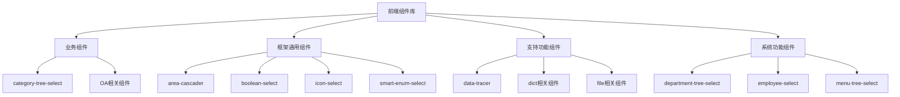

# 前端组件库

<cite>
**本文档引用文件**   
- [category-tree-select/index.vue](file://smart-admin-web-javascript/src/components/business/category-tree-select/index.vue)
- [oa/enterprise-select/index.vue](file://smart-admin-web-javascript/src/components/business/oa/enterprise-select/index.vue)
- [oa/enterprise-bank-select/index.vue](file://smart-admin-web-javascript/src/components/business/oa/enterprise-bank-select/index.vue)
- [oa/enterprise-invoice-select/index.vue](file://smart-admin-web-javascript/src/components/business/oa/enterprise-invoice-select/index.vue)
- [framework/area-cascader/index.vue](file://smart-admin-web-javascript/src/components/framework/area-cascader/index.vue)
- [framework/boolean-select/index.vue](file://smart-admin-web-javascript/src/components/framework/boolean-select/index.vue)
- [framework/icon-select/index.vue](file://smart-admin-web-javascript/src/components/framework/icon-select/index.vue)
- [framework/smart-enum-select/index.vue](file://smart-admin-web-javascript/src/components/framework/smart-enum-select/index.vue)
- [support/data-tracer/index.vue](file://smart-admin-web-javascript/src/components/support/data-tracer/index.vue)
- [support/dict-select/index.vue](file://smart-admin-web-javascript/src/components/support/dict-select/index.vue)
- [support/dict-code-select/index.vue](file://smart-admin-web-javascript/src/components/support/dict-code-select/index.vue)
- [support/file-upload/index.vue](file://smart-admin-web-javascript/src/components/support/file-upload/index.vue)
- [system/department-tree-select/index.vue](file://smart-admin-web-javascript/src/components/system/department-tree-select/index.vue)
- [system/employee-select/index.vue](file://smart-admin-web-javascript/src/components/system/employee-select/index.vue)
- [system/menu-tree-select/index.vue](file://smart-admin-web-javascript/src/components/system/menu-tree-select/index.vue)
- [framework/wangeditor/index.vue](file://smart-admin-web-javascript/src/components/framework/wangeditor/index.vue)
</cite>

## 目录
1. [组件分类体系](#组件分类体系)
2. [业务组件](#业务组件)
3. [框架通用组件](#框架通用组件)
4. [支持功能组件](#支持功能组件)
5. [系统功能组件](#系统功能组件)
6. [样式定制与主题适配](#样式定制与主题适配)
7. [响应式设计支持](#响应式设计支持)

## 组件分类体系

前端组件库按照功能和使用场景分为四大类：业务组件、框架通用组件、支持功能组件和系统功能组件。这种分类体系旨在提高组件的可维护性和复用性，同时为开发者提供清晰的组件使用指引。

**组件分类体系图**


**Diagram sources**
- [components/business](file://smart-admin-web-javascript/src/components/business)
- [components/framework](file://smart-admin-web-javascript/src/components/framework)
- [components/support](file://smart-admin-web-javascript/src/components/support)
- [components/system](file://smart-admin-web-javascript/src/components/system)

## 业务组件

业务组件是针对特定业务场景开发的专用组件，主要封装了业务逻辑和数据处理，为特定业务功能提供支持。

### category-tree-select 组件

category-tree-select 组件用于目录树形选择，适用于商品分类、内容分类等需要层级选择的业务场景。

**Props 说明**
- value: Number - 绑定值，选中的分类ID
- placeholder: String - 占位符文本，默认为"请选择"
- categoryType: Number - 分类类型，用于区分不同业务的分类体系
- width: String - 组件宽度，默认为"100%"

**Events 说明**
- update:value: 当选择值发生变化时触发，返回选中的分类ID
- change: 当选择值发生变化时触发，返回选中的分类ID

**Slots 说明**
- 无插槽

**使用示例**
```vue
<category-tree-select 
  v-model:value="categoryId" 
  :categoryType="1" 
  placeholder="请选择商品分类" />
```

**Section sources**
- [category-tree-select/index.vue](file://smart-admin-web-javascript/src/components/business/category-tree-select/index.vue#L29-L40)

### OA相关组件

OA相关组件是一系列针对办公自动化业务场景开发的组件，包括企业选择、银行账户选择、发票选择等。

#### enterprise-select 组件

enterprise-select 组件用于企业列表下拉选择，适用于需要选择合作企业、客户单位等场景。

**Props 说明**
- value: [Number, String, Object] - 绑定值，选中的企业ID
- width: String - 组件宽度，默认为"200px"
- placeholder: String - 占位符文本，默认为"请选择"
- size: String - 组件大小，可选值：'default', 'small', 'large'，默认为'default'
- disabled: Boolean - 是否禁用组件，默认为false
- multiple: Boolean - 是否支持多选，默认为false
- type: Number - 企业类型，用于筛选特定类型的企业

**Events 说明**
- update:value: 当选择值发生变化时触发，返回选中的企业ID
- change: 当选择值发生变化时触发，返回选中的企业ID

**Slots 说明**
- 无插槽

**使用示例**
```vue
<enterprise-select 
  v-model:value="enterpriseId" 
  :type="1" 
  placeholder="请选择供应商" />
```

**Section sources**
- [oa/enterprise-select/index.vue](file://smart-admin-web-javascript/src/components/business/oa/enterprise-select/index.vue#L34-L60)

#### enterprise-bank-select 组件

enterprise-bank-select 组件用于企业银行账户选择，特别适用于财务系统中选择付款账户的场景。

**Props 说明**
- value: [Number, String, Object] - 绑定值，选中的银行账户ID
- width: String - 组件宽度，默认为"200px"
- placeholder: String - 占位符文本，默认为"请选择"
- size: String - 组件大小，默认为"default"
- disabled: Boolean - 是否禁用组件，默认为false
- multiple: Boolean - 是否支持多选，默认为false
- enterpriseId: Number - 企业ID，用于筛选该企业的银行账户

**Events 说明**
- update:value: 当选择值发生变化时触发，返回选中的银行账户ID
- change: 当选择值发生变化时触发，返回选中的银行账户ID

**Slots 说明**
- 无插槽

**使用示例**
```vue
<enterprise-bank-select 
  v-model:value="bankId" 
  :enterpriseId="currentEnterpriseId" 
  placeholder="请选择付款账户" />
```

**Section sources**
- [oa/enterprise-bank-select/index.vue](file://smart-admin-web-javascript/src/components/business/oa/enterprise-bank-select/index.vue#L35-L60)

## 框架通用组件

框架通用组件是跨业务场景可复用的基础组件，设计原则是高内聚、低耦合，提供通用功能支持。

### area-cascader 组件

area-cascader 组件用于地区级联选择，支持省市区三级联动选择。

**设计原则**
- 数据驱动：组件内部预置了全国省市区数据，无需外部API调用
- 类型区分：支持两种级联模式：省-市-区完整模式和省-市简化模式
- 搜索优化：支持在级联选择器中进行关键词搜索，提高选择效率

**Props 说明**
- type: String - 级联类型，可选值：'province_city_district'(省市区)、'province_city'(省市)
- value: [Number, Array] - 绑定值，选中的地区数据
- width: String - 组件宽度，默认为"200px"
- placeholder: String - 占位符文本，默认为"请选择地区"
- size: String - 组件大小，默认为"default"
- disabled: Boolean - 是否禁用组件，默认为false

**Events 说明**
- update:value: 当选择值发生变化时触发，返回选中的地区数据对象数组
- change: 当选择值发生变化时触发，返回选中的地区值数组和选中的地区数据对象数组

**Slots 说明**
- 无插槽

**使用示例**
```vue
<area-cascader 
  v-model:value="areaData" 
  type="province_city_district" 
  placeholder="请选择服务区域" />
```

**Section sources**
- [framework/area-cascader/index.vue](file://smart-admin-web-javascript/src/components/framework/area-cascader/index.vue#L33-L52)

### boolean-select 组件

boolean-select 组件用于布尔值选择，将布尔值转换为数字枚举进行选择。

**复用机制**
- 枚举插件集成：使用全局的 $smartEnumPlugin 插件获取枚举值描述列表
- 类型转换：内部自动处理布尔值与数字值之间的转换
- 样式统一：遵循统一的下拉选择器样式规范

**Props 说明**
- value: Boolean - 绑定值，布尔值
- width: Number - 组件宽度，默认为100
- placeholder: String - 占位符文本，默认为"请选择"
- size: String - 组件大小，默认为"default"
- disabled: Boolean - 是否禁用组件，默认为false

**Events 说明**
- update:value: 当选择值发生变化时触发，返回布尔值
- change: 当选择值发生变化时触发，返回布尔值

**Slots 说明**
- 无插槽

**使用示例**
```vue
<boolean-select 
  v-model:value="isActive" 
  width="120" 
  placeholder="请选择状态" />
```

**Section sources**
- [framework/boolean-select/index.vue](file://smart-admin-web-javascript/src/components/framework/boolean-select/index.vue#L31-L49)

### icon-select 组件

icon-select 组件用于图标选择，集成了Ant Design Vue的所有图标。

**设计原则**
- 按风格分类：支持线框、实底、双色三种风格的图标选择
- 关键词搜索：支持通过英文关键词搜索图标
- 懒加载优化：初始只显示部分图标，点击"展开更多"才加载全部图标，避免页面卡顿

**Props 说明**
- 无自定义props

**Events 说明**
- updateIcon: 当选择图标后触发，返回选中的图标名称

**Slots 说明**
- iconSelect: 自定义触发图标选择的元素

**使用示例**
```vue
<icon-select @updateIcon="handleIconSelected">
  <a-button>选择图标</a-button>
</icon-select>
```

**Section sources**
- [framework/icon-select/index.vue](file://smart-admin-web-javascript/src/components/framework/icon-select/index.vue#L46-L51)

### smart-enum-select 组件

smart-enum-select 组件用于枚举值选择，是通用的枚举下拉选择器。

**复用机制**
- 动态枚举加载：通过enumName参数动态加载对应的枚举数据
- 全局插件支持：依赖$smartEnumPlugin全局插件获取枚举值描述
- 灵活配置：支持禁用和隐藏特定枚举选项

**Props 说明**
- enumName: String - 枚举名称，用于获取对应的枚举数据
- value: [Number, String] - 绑定值，选中的枚举值
- width: String - 组件宽度，默认为"100%"
- placeholder: String - 占位符文本，默认为"请选择"
- size: String - 组件大小，默认为"default"
- disabled: Boolean - 是否禁用组件，默认为false
- disabledOption: Array - 需要禁用的选项枚举值数组
- hiddenOption: Array - 需要隐藏的选项枚举值数组

**Events 说明**
- update:value: 当选择值发生变化时触发，返回选中的枚举值
- change: 当选择值发生变化时触发，返回选中的枚举值

**Slots 说明**
- 无插槽

**使用示例**
```vue
<smart-enum-select 
  v-model:value="status" 
  enumName="ORDER_STATUS_ENUM" 
  placeholder="请选择订单状态" />
```

**Section sources**
- [framework/smart-enum-select/index.vue](file://smart-admin-web-javascript/src/components/framework/smart-enum-select/index.vue#L31-L61)

## 支持功能组件

支持功能组件提供系统级支持功能，如数据追踪、字典管理、文件处理等。

### data-tracer 组件

data-tracer 组件用于展示数据变更记录，提供数据变动的审计功能。

**功能特性**
- 多视图展示：支持表格和时间轴两种展示模式
- 关键词搜索：支持通过关键词搜索变更记录
- 详细比对：点击记录可查看变更前后的详细对比
- 分页支持：支持大数据量的分页加载

**Props 说明**
- dataId: Number - 数据ID，用于查询特定数据的变更记录
- type: Number - 数据类型，用于区分不同业务的数据变更

**Events 说明**
- 无自定义事件

**Slots 说明**
- 无插槽

**集成方法**
```vue
<data-tracer 
  :dataId="currentRecordId" 
  :type="RECORD_TYPE" />
```

**Section sources**
- [support/data-tracer/index.vue](file://smart-admin-web-javascript/src/components/support/data-tracer/index.vue#L72-L81)

### dict相关组件

dict相关组件提供字典数据支持，包括字典值选择和字典编码选择。

#### dict-select 组件

dict-select 组件用于字典值选择，基于字典编码获取对应的字典值列表。

**功能特性**
- 动态数据加载：根据dictCode自动从字典store中获取数据
- 选项控制：支持禁用和隐藏特定字典选项
- 多选支持：通过mode属性支持单选和多选模式

**Props 说明**
- dictCode: String - 字典编码，用于获取对应的字典数据
- value: [Array, String, Number] - 绑定值，选中的字典值
- mode: String - 选择模式，默认为'combobox'
- width: String - 组件宽度，默认为"200px"
- placeholder: String - 占位符文本，默认为"请选择"
- size: String - 组件大小，默认为"default"
- disabled: Boolean - 是否禁用组件，默认为false
- disabledOption: Array - 需要禁用的选项字典值编码数组
- hiddenOption: Array - 需要隐藏的选项字典值编码数组

**Events 说明**
- update:value: 当选择值发生变化时触发，返回选中的字典值
- change: 当选择值发生变化时触发，返回选中的字典值

**Slots 说明**
- 无插槽

**使用示例**
```vue
<dict-select 
  v-model:value="category" 
  dictCode="PRODUCT_CATEGORY" 
  placeholder="请选择产品类别" />
```

**Section sources**
- [support/dict-select/index.vue](file://smart-admin-web-javascript/src/components/support/dict-select/index.vue#L34-L68)

#### dict-code-select 组件

dict-code-select 组件用于字典编码选择，允许用户选择字典本身。

**功能特性**
- 字典列表展示：展示系统中所有可用的字典
- 状态过滤：自动过滤已禁用的字典

**Props 说明**
- value: [Array, String, Number] - 绑定值，选中的字典编码
- placeholder: String - 占位符文本，默认为"请选择字典"
- width: String - 组件宽度，默认为"100%"
- size: String - 组件大小，默认为"default"
- disabled: Boolean - 是否禁用组件，默认为false

**Events 说明**
- update:value: 当选择值发生变化时触发，返回选中的字典编码
- change: 当选择值发生变化时触发，返回选中的字典编码

**Slots 说明**
- 无插槽

**使用示例**
```vue
<dict-code-select 
  v-model:value="selectedDictCode" 
  placeholder="请选择字典" />
```

**Section sources**
- [support/dict-code-select/index.vue](file://smart-admin-web-javascript/src/components/support/dict-code-select/index.vue#L34-L53)

### file相关组件

file相关组件提供文件上传和预览功能。

#### file-upload 组件

file-upload 组件用于文件上传，支持多种上传模式和文件类型限制。

**功能特性**
- 多文件上传：支持一次上传多个文件
- 类型限制：通过accept属性限制可上传的文件类型
- 大小限制：通过maxSize属性限制单个文件大小
- 数量限制：通过maxUploadSize属性限制最多上传文件数量
- 预览支持：支持图片文件的预览功能

**Props 说明**
- value: String - 绑定值，上传成功的文件信息
- buttonText: String - 上传按钮文本，默认为"点击上传附件"
- showUploadBtn: Boolean - 是否显示上传按钮，默认为true
- defaultFileList: Array - 默认文件列表，用于显示已上传的文件
- multiple: Boolean - 是否支持多选文件上传，默认为false
- maxUploadSize: Number - 最多上传文件数量，默认为10
- maxSize: Number - 单个文件最大大小(MB)，默认为10
- accept: String - 接受的文件类型，如".jpg,.png"
- folder: Number - 文件上传类型，默认为普通文件
- listType: String - 上传列表样式，可选值：'text', 'picture', 'picture-card'，默认为'picture-card'

**Events 说明**
- update:value: 当文件列表发生变化时触发
- change: 当文件列表发生变化时触发，返回当前文件列表

**Slots 说明**
- 无插槽

**使用示例**
```vue
<file-upload 
  v-model:value="fileInfo" 
  :maxUploadSize="5" 
  maxSize="20" 
  accept=".jpg,.png,.pdf" 
  listType="picture-card" />
```

**Section sources**
- [support/file-upload/index.vue](file://smart-admin-web-javascript/src/components/support/file-upload/index.vue#L53-L95)

## 系统功能组件

系统功能组件主要用于权限管理和组织架构相关的功能。

### department-tree-select 组件

department-tree-select 组件用于部门树形选择，在权限管理中用于分配部门权限。

**在权限管理中的应用**
- 组织架构选择：用于选择用户所属部门或负责部门
- 权限分配：在角色权限配置中选择可访问的部门范围
- 数据权限：在数据权限设置中定义部门级别的数据访问范围

**Props 说明**
- value: Number - 绑定值，选中的部门ID
- multiple: Boolean - 是否支持多选，默认为false

**Events 说明**
- update:value: 当选择值发生变化时触发，返回选中的部门ID或ID数组

**Slots 说明**
- 无插槽

**使用示例**
```vue
<department-tree-select 
  v-model:value="departmentId" 
  :multiple="true" 
  placeholder="请选择负责部门" />
```

**Section sources**
- [system/department-tree-select/index.vue](file://smart-admin-web-javascript/src/components/system/department-tree-select/index.vue#L31-L38)

### employee-select 组件

employee-select 组件用于员工选择，在组织架构管理中用于人员关联。

**在组织架构中的应用**
- 人员选择：在审批流程中选择审批人、抄送人
- 责任分配：在任务分配中选择负责人
- 上下级关系：在组织架构图中选择上级或下级人员

**Props 说明**
- value: [Number, Array] - 绑定值，选中的员工ID
- placeholder: String - 占位符文本，默认为"请选择"
- width: String - 组件宽度，默认为"100%"
- size: String - 组件大小，默认为"default"
- roleId: Number - 角色ID，用于筛选具有特定角色的员工
- disabledFlag: Number - 禁用标识，用于筛选启用或禁用状态的员工

**Events 说明**
- update:value: 当选择值发生变化时触发，返回选中的员工ID
- change: 当选择值发生变化时触发，返回选中的员工ID

**Slots 说明**
- 无插槽

**使用示例**
```vue
<employee-select 
  v-model:value="approverId" 
  :roleId="APPROVER_ROLE_ID" 
  placeholder="请选择审批人" />
```

**Section sources**
- [system/employee-select/index.vue](file://smart-admin-web-javascript/src/components/system/employee-select/index.vue#L34-L58)

### menu-tree-select 组件

menu-tree-select 组件用于菜单树形选择，在权限配置中用于分配菜单权限。

**在权限管理中的应用**
- 菜单权限分配：在角色配置中选择可访问的菜单
- 功能权限控制：通过菜单选择实现细粒度的功能权限控制
- 导航配置：在个性化设置中选择显示的导航菜单

**Props 说明**
- value: Array - 绑定值，选中的菜单ID数组
- multiple: Boolean - 是否支持多选，默认为false

**Events 说明**
- update:value: 当选择值发生变化时触发，返回选中的菜单ID数组

**Slots 说明**
- 无插槽

**使用示例**
```vue
<menu-tree-select 
  v-model:value="menuIds" 
  :multiple="true" 
  placeholder="请选择可访问菜单" />
```

**Section sources**
- [system/menu-tree-select/index.vue](file://smart-admin-web-javascript/src/components/system/menu-tree-select/index.vue#L32-L40)

## 样式定制与主题适配

组件库提供了灵活的样式定制和主题适配能力，支持通过多种方式实现视觉个性化。

### 样式定制方式

1. **内联样式**：通过width、size等props直接控制组件尺寸
2. **CSS类覆盖**：通过deep选择器覆盖组件内部样式
3. **主题变量**：通过修改主题变量实现全局样式调整

### 主题适配机制

组件库基于Ant Design Vue构建，继承了其主题适配能力：
- 支持通过theme变量配置主题
- 提供dark和light两种主题模式
- 支持自定义主题颜色

**主题配置示例**
```javascript
// theme/custom-variables.js
module.exports = {
  '@primary-color': '#1890ff',
  '@success-color': '#52c41a',
  '@warning-color': '#faad14',
  '@error-color': '#f5222d'
}
```

## 响应式设计支持

组件库全面支持响应式设计，确保在不同设备上都有良好的用户体验。

### 响应式特性

1. **断点适配**：支持移动端、平板和桌面端的断点适配
2. **弹性布局**：组件宽度支持百分比设置，可随容器大小自适应
3. **触摸优化**：移动端优化了触摸操作的交互体验

### 响应式使用建议

- 在移动端使用时，建议设置合适的width值避免溢出
- 对于复杂表单，建议使用栅格布局配合响应式组件
- 在小屏幕设备上，优先使用简洁的组件模式