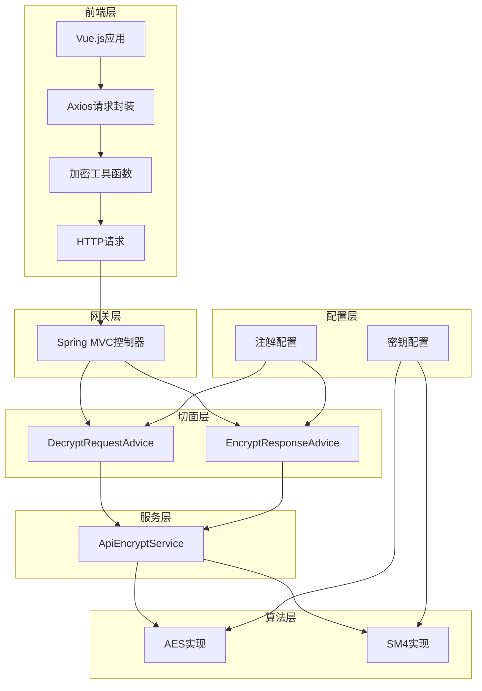
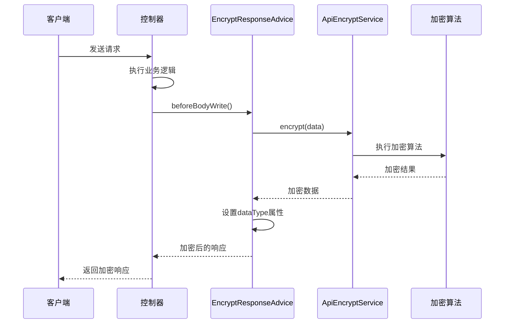
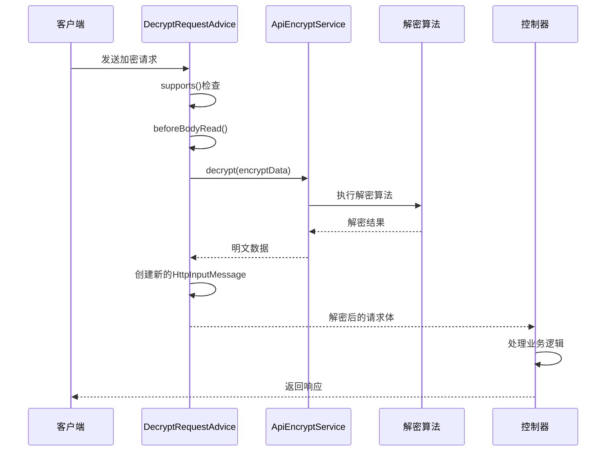
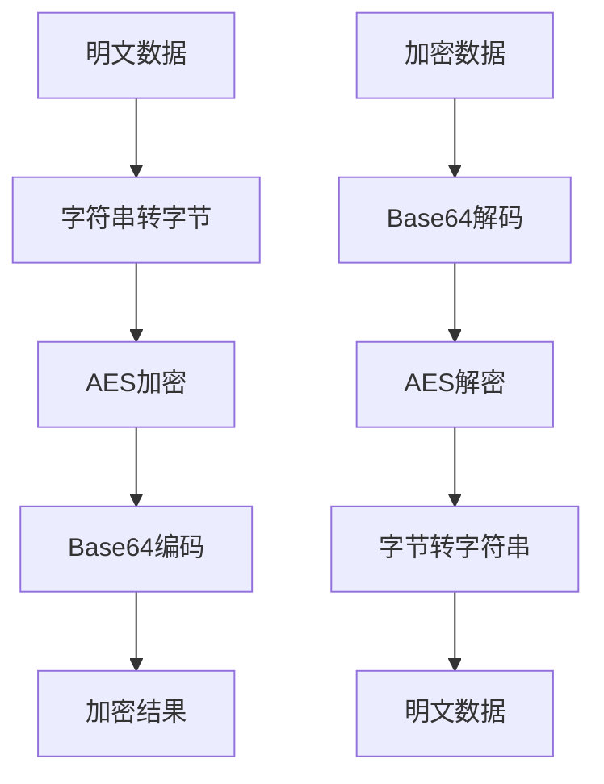
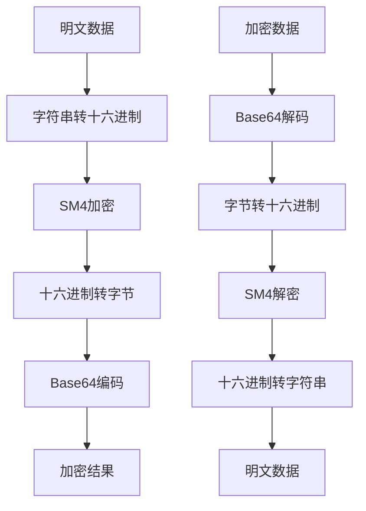

# 加解密切面实现

<cite>
**本文档引用的文件**
- [EncryptResponseAdvice.java](file://d%3A/IOE-DREAM/smart-admin-api-java17-springboot3/sa-base/src/main/java/net/lab1024/sa/base/module/support/apiencrypt/advice/EncryptResponseAdvice.java)
- [DecryptRequestAdvice.java](file://d%3A/IOE-DREAM/smart-admin-api-java17-springboot3/sa-base/src/main/java/net/lab1024/sa/base/module/support/apiencrypt/advice/DecryptRequestAdvice.java)
- [ApiEncryptService.java](file://d%3A/IOE-DREAM/smart-admin-api-java17-springboot3/sa-base/src/main/java/net/lab1024/sa/base/module/support/apiencrypt/service/ApiEncryptService.java)
- [ApiEncryptServiceAesImpl.java](file://d%3A/IOE-DREAM/smart-admin-api-java17-springboot3/sa-base/src/main/java/net/lab1024/sa/base/module/support/apiencrypt/service/ApiEncryptServiceAesImpl.java)
- [ApiEncryptServiceSmImpl.java](file://d%3A/IOE-DREAM/smart-admin-api-java17-springboot3/sa-base/src/main/java/net/lab1024/sa/base/module/support/apiencrypt/service/ApiEncryptServiceSmImpl.java)
- [ApiEncrypt.java](file://d%3A/IOE-DREAM/smart-admin-api-java17-springboot3/sa-base/src/main/java/net/lab1024/sa/base/module/support/apiencrypt/annotation/ApiEncrypt.java)
- [ApiDecrypt.java](file://d%3A/IOE-DREAM/smart-admin-api-java17-springboot3/sa-base/src/main/java/net/lab1024/sa/base/module/support/apiencrypt/annotation/ApiDecrypt.java)
- [ApiEncryptForm.java](file://d%3A/IOE-DREAM/smart-admin-api-java17-springboot3/sa-base/src/main/java/net/lab1024/sa/base/module/support/apiencrypt/domain/ApiEncryptForm.java)
- [AdminApiEncryptController.java](file://d%3A/IOE-DREAM/smart-admin-api-java17-springboot3/sa-admin/src/main/java/net/lab1024/sa/admin/module/system/support/AdminApiEncryptController.java)
- [encrypt.js](file://d%3A/IOE-DREAM/smart-admin-web-javascript/src/lib/encrypt.js)
- [axios.js](file://d%3A/IOE-DREAM/smart-admin-web-javascript/src/lib/axios.js)
</cite>

## 目录
1. [概述](#概述)
2. [架构设计](#架构设计)
3. [核心组件分析](#核心组件分析)
4. [执行流程详解](#执行流程详解)
5. [数据处理策略](#数据处理策略)
6. [加密算法实现](#加密算法实现)
7. [异常处理机制](#异常处理机制)
8. [性能优化考虑](#性能优化考虑)
9. [最佳实践建议](#最佳实践建议)
10. [总结](#总结)

## 概述

智能加解密切面系统是一个基于Spring MVC的自动化加密解密解决方案，通过AOP切面编程实现了对API请求和响应的透明加密处理。该系统支持AES和国密SM4两种加密算法，提供了完整的前后端加密通信能力。

### 主要特性

- **透明化处理**：无需业务代码干预，自动对指定接口进行加解密
- **多算法支持**：支持AES和国密SM4两种主流加密算法
- **灵活配置**：通过注解方式精确控制加解密范围
- **高性能**：采用流式处理和缓存机制提升性能
- **高安全性**：提供完善的异常处理和错误恢复机制

## 架构设计

系统采用分层架构设计，包含切面层、服务层、算法层和配置层。

**图表来源**
- [EncryptResponseAdvice.java](file://d%3A/IOE-DREAM/smart-admin-api-java17-springboot3/sa-base/src/main/java/net/lab1024/sa/base/module/support/apiencrypt/advice/EncryptResponseAdvice.java#L31-L64)
- [DecryptRequestAdvice.java](file://d%3A/IOE-DREAM/smart-admin-api-java17-springboot3/sa-base/src/main/java/net/lab1024/sa/base/module/support/apiencrypt/advice/DecryptRequestAdvice.java#L32-L96)

## 核心组件分析

### EncryptResponseAdvice - 响应加密切面

EncryptResponseAdvice实现了Spring的ResponseBodyAdvice接口，负责在控制器方法返回响应前对数据进行加密处理。

#### 核心功能

- **条件判断**：通过supports方法确定是否需要加密
- **数据加密**：在beforeBodyWrite方法中对响应数据进行加密
- **类型标记**：设置数据类型为加密状态

#### 执行时机

**图表来源**
- [EncryptResponseAdvice.java](file://d%3A/IOE-DREAM/smart-admin-api-java17-springboot3/sa-base/src/main/java/net/lab1024/sa/base/module/support/apiencrypt/advice/EncryptResponseAdvice.java#L41-L60)

**章节来源**
- [EncryptResponseAdvice.java](file://d%3A/IOE-DREAM/smart-admin-api-java17-springboot3/sa-base/src/main/java/net/lab1024/sa/base/module/support/apiencrypt/advice/EncryptResponseAdvice.java#L31-L64)

### DecryptRequestAdvice - 请求解密切面

DecryptRequestAdvice继承自RequestBodyAdviceAdapter，负责在控制器接收请求前对加密数据进行解密。

#### 核心功能

- **请求拦截**：通过supports方法判断是否需要解密
- **数据解密**：在beforeBodyRead方法中对请求数据进行解密
- **流替换**：创建新的HttpInputMessage替换原始输入流

#### 执行时机

**图表来源**
- [DecryptRequestAdvice.java](file://d%3A/IOE-DREAM/smart-admin-api-java17-springboot3/sa-base/src/main/java/net/lab1024/sa/base/module/support/apiencrypt/advice/DecryptRequestAdvice.java#L43-L61)

**章节来源**
- [DecryptRequestAdvice.java](file://d%3A/IOE-DREAM/smart-admin-api-java17-springboot3/sa-base/src/main/java/net/lab1024/sa/base/module/support/apiencrypt/advice/DecryptRequestAdvice.java#L32-L96)

### 加密服务接口

ApiEncryptService定义了统一的加密解密服务接口，支持多种算法实现。

#### 接口设计

| 方法 | 参数 | 返回值 | 描述 |
|------|------|--------|------|
| encrypt | String data | String | 对明文数据进行加密 |
| decrypt | String data | String | 对加密数据进行解密 |

**章节来源**
- [ApiEncryptService.java](file://d%3A/IOE-DREAM/smart-admin-api-java17-springboot3/sa-base/src/main/java/net/lab1024/sa/base/module/support/apiencrypt/service/ApiEncryptService.java#L13-L30)

## 执行流程详解

### 请求处理流程

1. **请求到达**：客户端发送加密请求到服务器
2. **切面拦截**：DecryptRequestAdvice拦截请求
3. **数据提取**：从请求体中提取加密数据
4. **数据解密**：调用ApiEncryptService进行解密
5. **流替换**：创建新的输入流替换原始请求体
6. **业务处理**：控制器正常处理解密后的数据
7. **响应加密**：EncryptResponseAdvice对响应进行加密
8. **结果返回**：返回加密的响应数据

### 响应处理流程

1. **业务完成**：控制器完成业务逻辑处理
2. **数据准备**：获取需要返回的数据
3. **加密处理**：EncryptResponseAdvice对数据进行加密
4. **类型标记**：设置数据类型为加密状态
5. **响应发送**：将加密数据发送给客户端

**章节来源**
- [AdminApiEncryptController.java](file://d%3A/IOE-DREAM/smart-admin-api-java17-springboot3/sa-admin/src/main/java/net/lab1024/sa/admin/module/system/support/AdminApiEncryptController.java#L36-L81)

## 数据处理策略

### JSON数据处理

对于JSON格式的数据，系统采用以下处理策略：

- **序列化**：使用Jackson将对象序列化为JSON字符串
- **加密**：对JSON字符串进行加密处理
- **包装**：将加密结果包装到ApiEncryptForm对象中
- **传输**：通过HTTP协议传输加密数据

### 文件数据处理

对于文件上传下载场景，系统提供了专门的处理机制：

- **上传加密**：文件内容在上传前进行加密
- **存储保护**：加密后的文件安全存储
- **下载解密**：下载时自动解密文件内容
- **流式处理**：支持大文件的流式加密解密

### 数组数据处理

对于数组类型的请求响应，系统支持批量加密解密：

- **批量处理**：对整个数组进行统一加密解密
- **结构保持**：保持数组原有的层次结构
- **性能优化**：采用高效的批量处理算法

**章节来源**
- [ApiEncryptForm.java](file://d%3A/IOE-DREAM/smart-admin-api-java17-springboot3/sa-base/src/main/java/net/lab1024/sa/base/module/support/apiencrypt/domain/ApiEncryptForm.java#L16-L21)

## 加密算法实现

### AES算法实现

ApiEncryptServiceAesImpl提供了基于AES算法的加密解密实现。

#### 算法特点

- **密钥长度**：128位密钥
- **编码方式**：UTF-8编码
- **填充模式**：PKCS7填充
- **工作模式**：ECB模式

#### 实现流程

**图表来源**
- [ApiEncryptServiceAesImpl.java](file://d%3A/IOE-DREAM/smart-admin-api-java17-springboot3/sa-base/src/main/java/net/lab1024/sa/base/module/support/apiencrypt/service/ApiEncryptServiceAesImpl.java#L40-L67)

**章节来源**
- [ApiEncryptServiceAesImpl.java](file://d%3A/IOE-DREAM/smart-admin-api-java17-springboot3/sa-base/src/main/java/net/lab1024/sa/base/module/support/apiencrypt/service/ApiEncryptServiceAesImpl.java#L28-L115)

### SM4算法实现

ApiEncryptServiceSmImpl提供了基于国密SM4算法的加密解密实现。

#### 算法特点

- **标准合规**：符合中国国家密码标准
- **密钥要求**：128位固定密钥
- **编码兼容**：与AES算法保持兼容性
- **安全性高**：采用国密局认证算法

#### 实现流程

**图表来源**
- [ApiEncryptServiceSmImpl.java](file://d%3A/IOE-DREAM/smart-admin-api-java17-springboot3/sa-base/src/main/java/net/lab1024/sa/base/module/support/apiencrypt/service/ApiEncryptServiceSmImpl.java#L38-L66)

**章节来源**
- [ApiEncryptServiceSmImpl.java](file://d%3A/IOE-DREAM/smart-admin-api-java17-springboot3/sa-base/src/main/java/net/lab1024/sa/base/module/support/apiencrypt/service/ApiEncryptServiceSmImpl.java#L26-L119)

### 前端加密实现

前端采用了与后端兼容的加密算法实现：

#### AES实现特点

- **库依赖**：使用CryptoJS库
- **模式配置**：ECB模式，PKCS7填充
- **密钥管理**：前后端使用相同密钥
- **编码处理**：UTF-8编码处理

#### SM4实现特点

- **库依赖**：使用sm-crypto库
- **算法兼容**：与国密SM4标准兼容
- **密钥转换**：字符串到十六进制转换
- **编码统一**：保持与后端一致的编码方式

**章节来源**
- [encrypt.js](file://d%3A/IOE-DREAM/smart-admin-web-javascript/src/lib/encrypt.js#L41-L98)

## 异常处理机制

### 切面异常处理

两个切面都实现了完善的异常处理机制：

#### DecryptRequestAdvice异常处理

- **解密失败**：当解密过程中出现异常时，返回原始请求体
- **日志记录**：记录详细的错误信息用于调试
- **降级处理**：保证系统在异常情况下的可用性

#### EncryptResponseAdvice异常处理

- **序列化异常**：处理JSON序列化过程中的异常
- **加密异常**：捕获加密过程中的各种异常
- **运行时异常**：抛出RuntimeException便于全局处理

### 全局异常处理

系统通过GlobalExceptionHandler提供统一的异常处理：

- **异常分类**：区分业务异常和系统异常
- **错误响应**：返回标准化的错误响应格式
- **安全防护**：避免敏感信息泄露

**章节来源**
- [DecryptRequestAdvice.java](file://d%3A/IOE-DREAM/smart-admin-api-java17-springboot3/sa-base/src/main/java/net/lab1024/sa/base/module/support/apiencrypt/advice/DecryptRequestAdvice.java#L58-L61)
- [EncryptResponseAdvice.java](file://d%3A/IOE-DREAM/smart-admin-api-java17-springboot3/sa-base/src/main/java/net/lab1024/sa/base/module/support/apiencrypt/advice/EncryptResponseAdvice.java#L56-L58)

## 性能优化考虑

### 缓存策略

- **密钥缓存**：缓存加密密钥避免重复计算
- **算法实例**：复用加密解密算法实例
- **字符串缓存**：缓存常用的字符串转换结果

### 流式处理

- **内存优化**：对大文件采用流式处理
- **延迟加载**：按需加载加密算法实例
- **资源回收**：及时释放不再使用的资源

### 并发处理

- **线程安全**：确保加密算法的线程安全性
- **无锁设计**：在可能的情况下采用无锁设计
- **异步处理**：对非关键路径采用异步处理

## 最佳实践建议

### 注解使用规范

1. **精确控制**：仅对需要加密的接口添加注解
2. **组合使用**：根据需求合理组合@ApiEncrypt和@ApiDecrypt
3. **类级别应用**：对整个控制器类启用加解密功能
4. **方法级别应用**：对特定方法进行精细化控制

### 密钥管理

1. **定期更换**：建立密钥轮换机制
2. **安全存储**：将密钥存储在安全的位置
3. **权限控制**：限制密钥的访问权限
4. **备份策略**：建立密钥备份和恢复机制

### 性能监控

1. **响应时间**：监控加解密操作的响应时间
2. **吞吐量**：跟踪系统的整体吞吐量
3. **资源使用**：监控CPU和内存使用情况
4. **错误率**：统计加解密过程中的错误率

### 安全审计

1. **操作日志**：记录所有加解密操作
2. **访问控制**：实施严格的访问控制策略
3. **异常监控**：监控异常的加解密尝试
4. **合规检查**：定期进行安全合规检查

## 总结

智能加解密切面系统通过精心设计的架构和实现，提供了完整而可靠的API加密解密解决方案。系统具有以下优势：

### 技术优势

- **自动化程度高**：通过AOP实现透明化的加解密处理
- **算法丰富**：支持AES和SM4两种主流加密算法
- **性能优异**：采用多种优化策略确保高性能
- **扩展性强**：良好的架构设计便于功能扩展

### 应用价值

- **安全保障**：有效保护API传输数据的安全性
- **开发效率**：减少开发者的工作量，提高开发效率
- **维护便利**：统一的处理机制降低维护成本
- **合规支持**：满足各种安全合规要求

### 发展方向

随着技术的发展，系统可以在以下方面进一步完善：

- **算法升级**：支持更多先进的加密算法
- **性能优化**：持续优化加解密性能
- **功能扩展**：增加更多高级功能特性
- **生态建设**：构建更加完善的生态系统

该系统为现代Web应用提供了可靠的安全保障，是构建安全、高效API服务的重要基础设施。