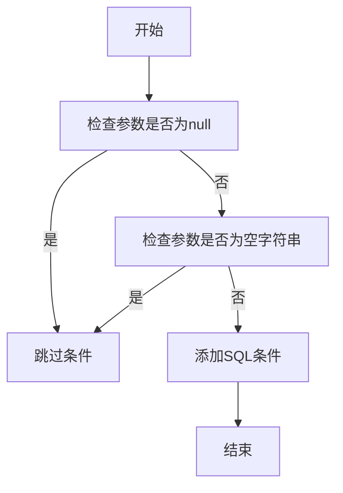
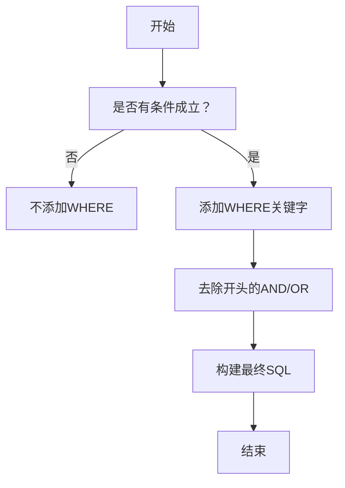
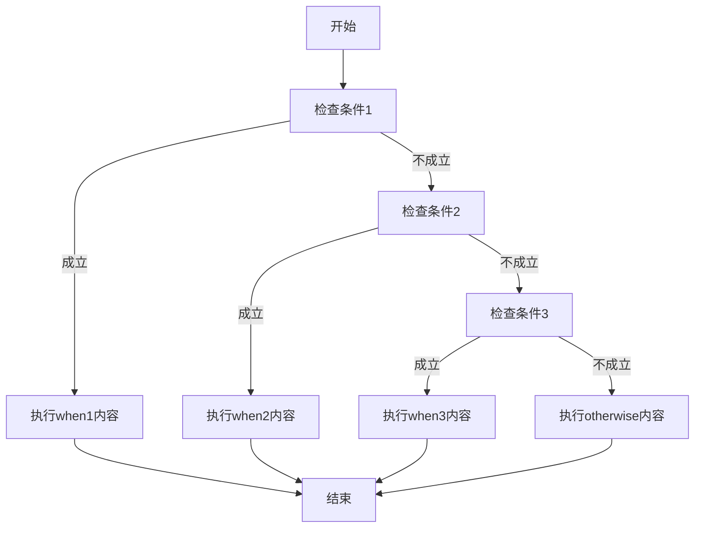
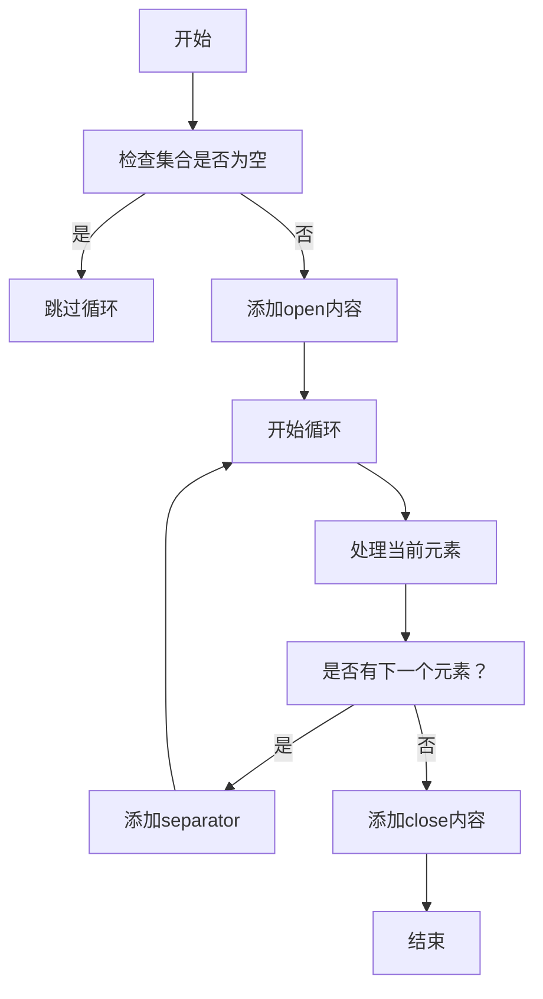

# 动态SQL语法

<cite>
**本文档引用的文件**
- [DictMapper.xml](file://smart-admin-api-java17-springboot3\sa-base\src\main\resources\mapper\support\DictMapper.xml)
- [OperateLogMapper.xml](file://smart-admin-api-java17-springboot3\sa-base\src\main\resources\mapper\support\OperateLogMapper.xml)
- [EmployeeMapper.xml](file://smart-admin-api-java17-springboot3\sa-admin\src\main\resources\mapper\system\employee\EmployeeMapper.xml)
- [GoodsMapper.xml](file://smart-admin-api-java17-springboot3\sa-admin\src\main\resources\mapper\business\goods\GoodsMapper.xml)
- [ChangeLogMapper.xml](file://smart-admin-api-java17-springboot3\sa-base\src\main\resources\mapper\support\ChangeLogMapper.xml)
- [CategoryMapper.xml](file://smart-admin-api-java17-springboot3\sa-admin\src\main\resources\mapper\business\category\CategoryMapper.xml)
- [Mapper.xml.vm](file://smart-admin-api-java17-springboot3\sa-base\src\main\resources\code-generator-template\java\mapper\Mapper.xml.vm)
</cite>

## 目录
1. [动态SQL标签概述](#动态sql标签概述)
2. [if标签的使用](#if标签的使用)
3. [where标签的智能处理](#where标签的智能处理)
4. [choose、when、otherwise标签的条件分支](#choose、when、otherwise标签的条件分支)
5. [foreach标签的应用](#foreach标签的应用)
6. [set标签在更新操作中的使用](#set标签在更新操作中的使用)
7. [复杂条件组合查询示例](#复杂条件组合查询示例)

## 动态SQL标签概述

MyBatis提供了强大的动态SQL功能，允许根据不同的条件构建不同的SQL语句。这些功能通过一系列XML标签实现，包括`<if>`、`<where>`、`<choose>`、`<when>`、`<otherwise>`、`<foreach>`和`<set>`等。这些标签使得SQL语句可以根据传入的参数动态地包含或排除某些条件，从而避免了在Java代码中拼接SQL字符串的复杂性和安全风险。

## if标签的使用

`<if>`标签是MyBatis中最常用的动态SQL标签之一，用于根据条件判断是否包含某个SQL片段。`test`属性是`<if>`标签的核心，它接受一个表达式，当表达式为true时，包含该标签内的SQL内容。



**图示来源**
- [DictMapper.xml](file://smart-admin-api-java17-springboot3\sa-base\src\main\resources\mapper\support\DictMapper.xml#L23-L33)

在实际应用中，`<if>`标签常用于构建查询条件。例如，在字典查询中，可以根据关键字、禁用状态等条件动态添加WHERE子句：

```xml
<if test="queryForm.keywords != null and queryForm.keywords != ''">
    AND (
    INSTR(t_dict.dict_name,#{queryForm.keywords})
    OR INSTR(t_dict.dict_code,#{queryForm.keywords})
    OR INSTR(t_dict.remark,#{queryForm.keywords})
    )
</if>
<if test="queryForm.disabledFlag != null">
    AND t_dict.disabled_flag = #{queryForm.disabledFlag}
</if>
```

**代码来源**
- [DictMapper.xml](file://smart-admin-api-java17-springboot3\sa-base\src\main\resources\mapper\support\DictMapper.xml#L23-L33)

## where标签的智能处理

`<where>`标签用于智能处理WHERE子句，它会自动处理AND/OR前缀问题。当`<where>`标签包含的条件中有任意一个成立时，它会自动添加WHERE关键字；同时，它会自动去除开头多余的AND或OR关键字，避免SQL语法错误。



**图示来源**
- [OperateLogMapper.xml](file://smart-admin-api-java17-springboot3\sa-base\src\main\resources\mapper\support\OperateLogMapper.xml#L9-L34)

在操作日志查询中，`<where>`标签被用来处理多个可选的查询条件：

```xml
<where>
    <if test="query.operateUserId != null">
        AND operate_user_id = #{query.operateUserId}
    </if>
    <if test="query.operateUserType != null">
        AND operate_user_type = #{query.operateUserType}
    </if>
    <if test="query.startDate != null and query.startDate != ''">
        AND DATE_FORMAT(create_time, '%Y-%m-%d') >= #{query.startDate}
    </if>
    <if test="query.endDate != null and query.endDate != ''">
        AND DATE_FORMAT(create_time, '%Y-%m-%d') <= #{query.endDate}
    </if>
</where>
```

**代码来源**
- [OperateLogMapper.xml](file://smart-admin-api-java17-springboot3\sa-base\src\main\resources\mapper\support\OperateLogMapper.xml#L9-L34)

## choose、when、otherwise标签的条件分支

`<choose>`、`<when>`、`<otherwise>`标签组合使用，类似于Java中的switch-case语句，用于实现多条件分支逻辑。`<choose>`标签包含一个或多个`<when>`标签和一个可选的`<otherwise>`标签。当某个`<when>`标签的test条件为true时，执行该标签内的SQL片段，并跳过后续的`<when>`和`<otherwise>`标签。



虽然在当前代码库中没有直接的`<choose>`标签使用示例，但这种模式在需要实现互斥条件时非常有用。例如，在查询员工时，可以根据不同的搜索类型（姓名、电话、邮箱）执行不同的查询逻辑。

## foreach标签的应用

`<foreach>`标签用于遍历集合，常用于IN查询和批量操作。它有以下几个重要属性：
- `collection`：指定要遍历的集合，可以是list、array、map等
- `item`：集合中每个元素的别名
- `open`：循环开始前的SQL片段
- `close`：循环结束后的SQL片段
- `separator`：元素之间的分隔符



**图示来源**
- [CategoryMapper.xml](file://smart-admin-api-java17-springboot3\sa-admin\src\main\resources\mapper\business\category\CategoryMapper.xml#L10-L15)

在分类查询中，`<foreach>`标签被用于处理父级ID列表的IN查询：

```xml
<select id="queryByParentId"
        resultType="net.lab1024.sa.admin.module.business.category.domain.entity.CategoryEntity">
    SELECT * FROM t_category
    WHERE
    parent_id IN
    <foreach collection="parentIdList" open="(" separator="," close=")" item="id">#{id}</foreach>
    AND deleted_flag = #{deletedFlag}
    ORDER BY sort ASC
</select>
```

**代码来源**
- [CategoryMapper.xml](file://smart-admin-api-java17-springboot3\sa-admin\src\main\resources\mapper\business\category\CategoryMapper.xml#L10-L15)

在批量删除操作中，`<foreach>`标签同样被广泛应用：

```xml
<update id="batchUpdateDeleted">
    update t_goods
    set deleted_flag = #{deletedFlag}
    WHERE goods_id IN
    <foreach collection="goodsIdList" open="(" close=")" separator="," item="item">
        #{item}
    </foreach>
</update>
```

**代码来源**
- [GoodsMapper.xml](file://smart-admin-api-java17-springboot3\sa-admin\src\main\resources\mapper\business\goods\GoodsMapper.xml#L4-L11)

## set标签在更新操作中的使用

`<set>`标签用于更新操作，它会自动处理SET子句中的逗号分隔问题。当`<set>`标签包含的条件中有任意一个成立时，它会自动添加SET关键字；同时，它会自动去除末尾多余的逗号，避免SQL语法错误。

虽然在当前代码库中没有直接的`<set>`标签使用示例，但在代码生成模板中可以看到其应用：

```xml
<trim prefix="SET" suffixOverrides=",">
    <if test="queryForm.updateVersion != null">
        update_version = #{queryForm.updateVersion},
    </if>
    <if test="queryForm.type != null">
        type = #{queryForm.type},
    </if>
    <if test="queryForm.content != null">
        content = #{queryForm.content},
    </if>
    <if test="queryForm.link != null">
        link = #{queryForm.link},
    </if>
    <if test="queryForm.publicDate != null">
        public_date = #{queryForm.publicDate},
    </if>
</trim>
```

`<set>`标签实际上是`<trim>`标签的一个特例，等价于`<trim prefix="SET" suffixOverrides=",">`。它确保了只有当至少有一个字段需要更新时才会生成SET子句，并且自动处理了末尾逗号的问题。

## 复杂条件组合查询示例

在实际应用中，通常需要组合使用多个动态SQL标签来实现复杂的查询逻辑。以下是一个综合示例，展示了如何在员工查询中组合使用多种动态SQL标签：

```xml
<select id="queryEmployee" resultType="net.lab1024.sa.admin.module.system.employee.domain.vo.EmployeeVO">
    SELECT
    t_employee.*,
    t_department.department_name
    FROM t_employee
    LEFT JOIN t_department ON t_department.department_id = t_employee.department_id
    <where>
        <if test="queryForm.keyword != null and queryForm.keyword != ''">
            AND (
            INSTR(t_employee.actual_name,#{queryForm.keyword})
            OR INSTR(t_employee.phone,#{queryForm.keyword})
            OR INSTR(t_employee.login_name,#{queryForm.keyword})
            )
        </if>
        <if test="departmentIdList != null and departmentIdList.size > 0">
            and
            t_employee.department_id
            in
            <foreach collection="departmentIdList" open="(" close=")" separator="," item="item">
                #{item}
            </foreach>
        </if>
        <if test="queryForm.disabledFlag != null">
            AND t_employee.disabled_flag = #{queryForm.disabledFlag}
        </if>
        <if test="queryForm.deletedFlag != null">
            AND t_employee.deleted_flag = #{queryForm.deletedFlag}
        </if>
    </where>
</select>
```

**代码来源**
- [EmployeeMapper.xml](file://smart-admin-api-java17-springboot3\sa-admin\src\main\resources\mapper\system\employee\EmployeeMapper.xml#L5-L33)

这个示例展示了：
1. 使用`<where>`标签智能处理WHERE子句
2. 使用多个`<if>`标签实现可选查询条件
3. 使用`<foreach>`标签处理部门ID列表的IN查询
4. 使用字符串函数INSTR实现模糊搜索
5. 使用LEFT JOIN关联员工和部门表

另一个复杂的查询示例是在变更日志查询中，结合了多种条件：

```xml
<where>
    <if test="queryForm.type != null">
        AND t_change_log.type = #{queryForm.type}
    </if>
    <if test="queryForm.keyword != null and queryForm.keyword != ''">
        AND ( INSTR(t_change_log.update_version,#{queryForm.keyword})
        OR INSTR(t_change_log.publish_author,#{queryForm.keyword})
        OR INSTR(t_change_log.content,#{queryForm.keyword})
        )
    </if>
    <if test="queryForm.publicDateBegin != null">
        AND DATE_FORMAT(t_change_log.public_date, '%Y-%m-%d') >= #{queryForm.publicDateBegin}
    </if>
    <if test="queryForm.publicDateEnd != null">
        AND DATE_FORMAT(t_change_log.public_date, '%Y-%m-%d') <= #{queryForm.publicDateEnd}
    </if>
</where>
```

**代码来源**
- [ChangeLogMapper.xml](file://smart-admin-api-java17-springboot3\sa-base\src\main\resources\mapper\support\ChangeLogMapper.xml#L12-L28)

这个示例展示了如何处理日期范围查询和多字段模糊搜索，体现了动态SQL在复杂业务场景中的强大能力。