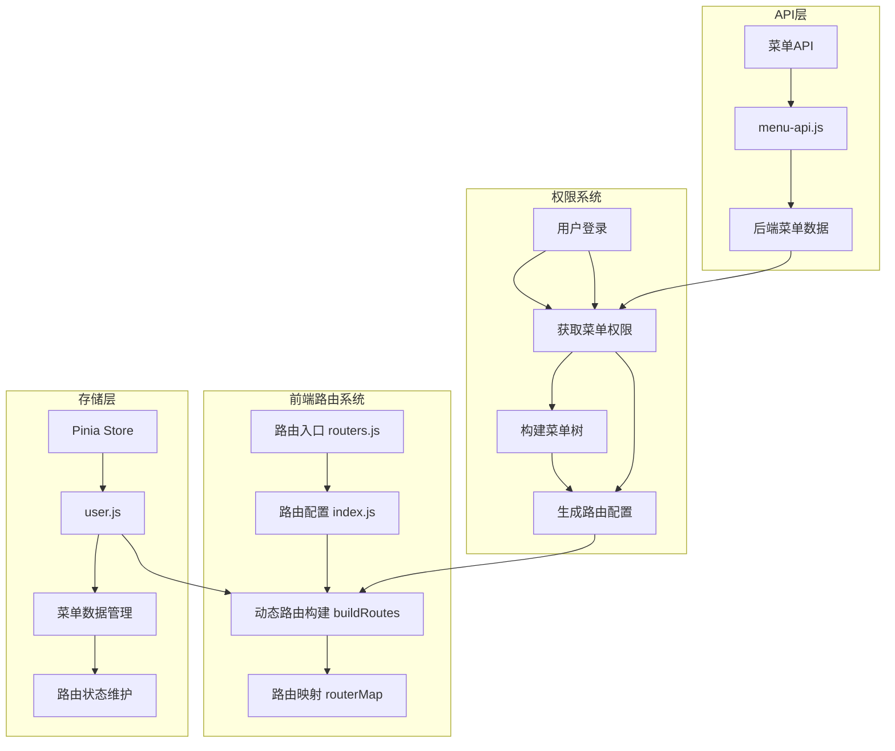
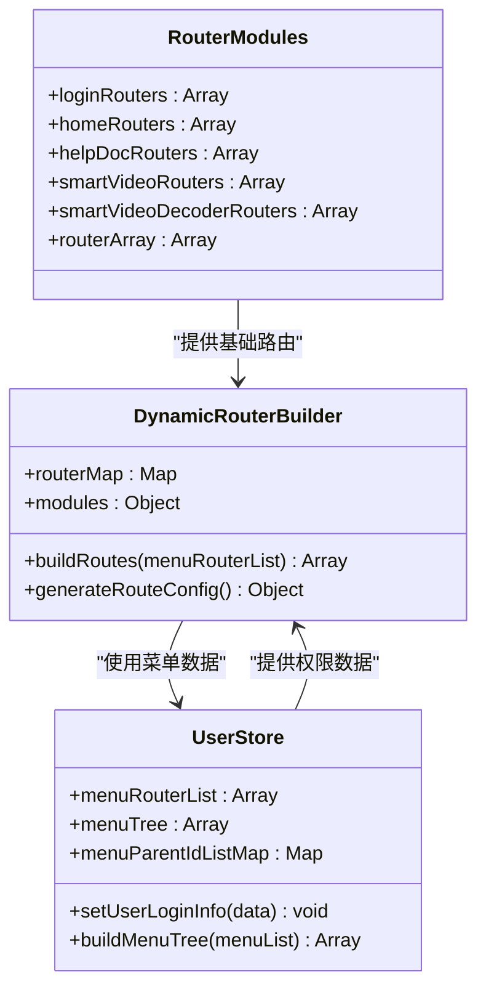
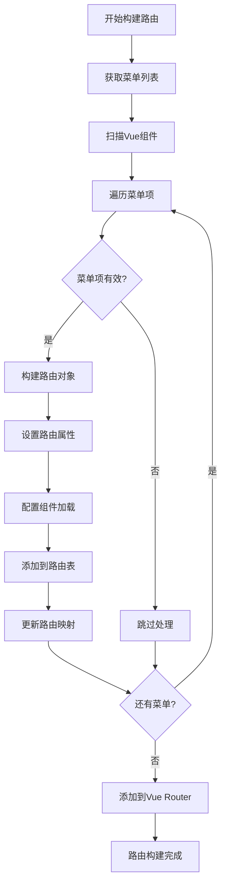
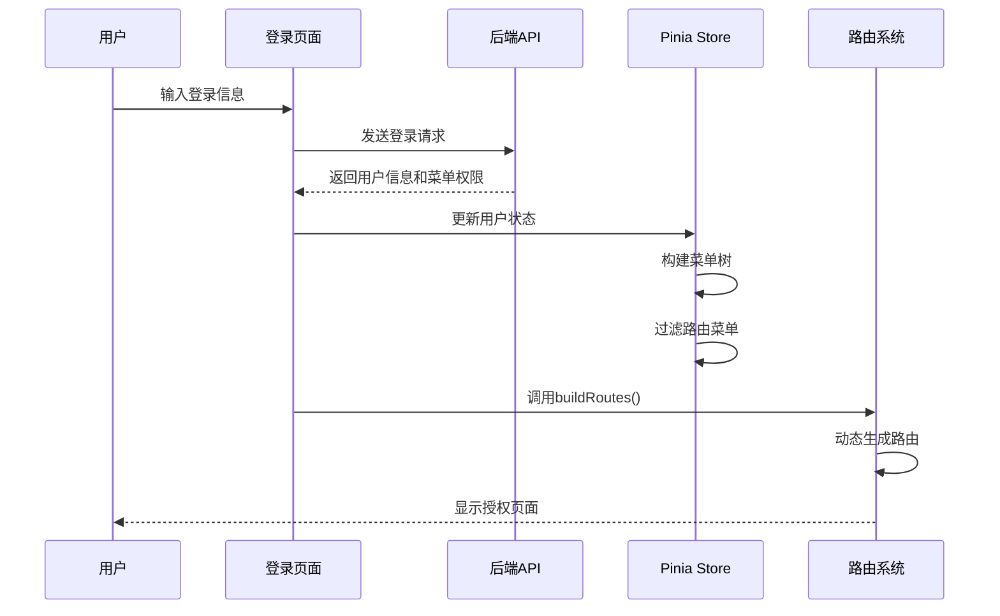
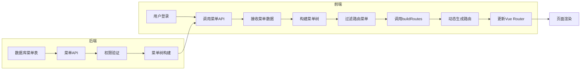
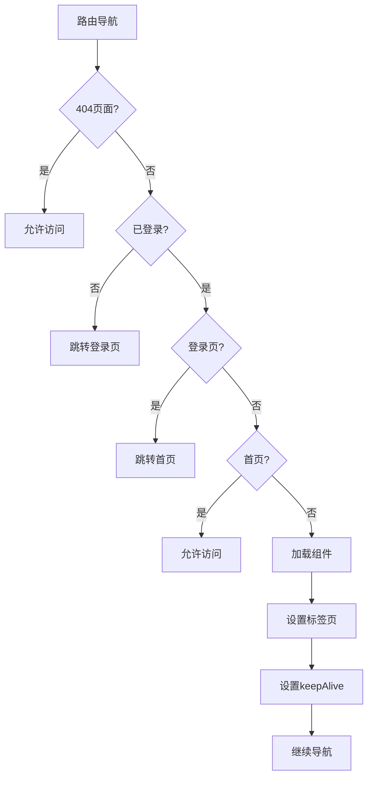

# 动态路由机制

<cite>
**本文档中引用的文件**
- [routers.js](file://smart-admin-web-javascript/src/router/routers.js)
- [index.js](file://smart-admin-web-javascript/src/router/index.js)
- [menu-api.js](file://smart-admin-web-javascript/src/api/system/menu-api.js)
- [user.js](file://smart-admin-web-javascript/src/store/modules/system/user.js)
- [menu-const.js](file://smart-admin-web-javascript/src/constants/system/menu-const.js)
- [login.vue](file://smart-admin-web-javascript/src/views/system/login/login.vue)
- [smart-video.js](file://smart-admin-web-javascript/src/router/business/smart-video.js)
- [home.js](file://smart-admin-web-javascript/src/router/system/home.js)
- [index.vue](file://smart-admin-web-javascript/src/layout/index.vue)
</cite>

## 目录
1. [概述](#概述)
2. [项目架构](#项目架构)
3. [核心组件分析](#核心组件分析)
4. [动态路由生成机制](#动态路由生成机制)
5. [权限系统集成](#权限系统集成)
6. [路由对象元数据](#路由对象元数据)
7. [完整流程分析](#完整流程分析)
8. [性能优化考虑](#性能优化考虑)
9. [故障排除指南](#故障排除指南)
10. [总结](#总结)

## 概述

SmartAdmin采用基于Vue Router的动态路由生成机制，实现了灵活的权限控制和菜单管理。该系统的核心特点包括：

- **动态路由生成**：根据用户权限和菜单配置实时生成路由表
- **权限控制**：通过后端菜单数据控制页面访问权限
- **组件懒加载**：支持异步路由加载和组件缓存
- **菜单树构建**：自动构建左侧导航菜单结构

## 项目架构



**图表来源**
- [routers.js](file://smart-admin-web-javascript/src/router/routers.js#L1-L27)
- [index.js](file://smart-admin-web-javascript/src/router/index.js#L1-L166)
- [user.js](file://smart-admin-web-javascript/src/store/modules/system/user.js#L1-L908)

## 核心组件分析

### 路由模块注册机制

系统通过模块化的方式组织路由配置，每个业务模块都有独立的路由文件：



**图表来源**
- [routers.js](file://smart-admin-web-javascript/src/router/routers.js#L10-L26)
- [index.js](file://smart-admin-web-javascript/src/router/index.js#L98-L166)
- [user.js](file://smart-admin-web-javascript/src/store/modules/system/user.js#L20-L908)

**章节来源**
- [routers.js](file://smart-admin-web-javascript/src/router/routers.js#L1-L27)
- [index.js](file://smart-admin-web-javascript/src/router/index.js#L1-L166)

### 路由注册与合并逻辑

路由模块通过ES6的扩展运算符进行合并，形成完整的路由数组：

```javascript
// 路由模块合并示例
export const routerArray = [
    ...loginRouters,        // 登录相关路由
    ...homeRouters,         // 首页相关路由
    ...helpDocRouters,      // 帮助文档路由
    ...smartVideoRouters,   // 智能视频模块路由
    ...smartVideoDecoderRouters, // 解码器模块路由
    { path: '/:pathMatch(.*)*', name: '404', component: NotFound },
    { path: '/403', name: '403', component: NoPrivilege }
];
```

**章节来源**
- [routers.js](file://smart-admin-web-javascript/src/router/routers.js#L18-L26)

## 动态路由生成机制

### 路由构建过程

动态路由生成是整个系统的核心，通过`buildRoutes`函数实现：



**图表来源**
- [index.js](file://smart-admin-web-javascript/src/router/index.js#L98-L166)

### 异步路由加载实现

系统支持两种组件加载方式：

1. **静态导入**：适用于固定路由
2. **动态导入**：支持懒加载和按需加载

```javascript
// 动态导入示例
let componentPath = e.component && e.component.startsWith('/') ? e.component : '/' + e.component;
let relativePath = `../views${componentPath}`;
route.component = modules[relativePath]; // 动态导入
```

**章节来源**
- [index.js](file://smart-admin-web-javascript/src/router/index.js#L144-L153)

## 权限系统集成

### 用户登录与权限获取

用户登录后，系统会自动获取用户的菜单权限并构建路由：



**图表来源**
- [login.vue](file://smart-admin-web-javascript/src/views/system/login/login.vue#L188-L208)
- [user.js](file://smart-admin-web-javascript/src/store/modules/system/user.js#L170-L184)

### 菜单权限过滤

系统会根据菜单的可见性和禁用状态进行过滤：

```javascript
// 菜单过滤逻辑
this.menuRouterList = menuList.filter((e) => e.path || e.frameUrl);
// 过滤条件：必须有路径或外链地址
```

**章节来源**
- [user.js](file://smart-admin-web-javascript/src/store/modules/system/user.js#L176-L177)

## 路由对象元数据

### Meta字段详解

每个路由对象都包含丰富的meta信息，用于控制页面行为：

| 字段名 | 类型 | 描述 | 示例值 |
|--------|------|------|--------|
| id | String | 菜单ID，用于唯一标识 | "1001" |
| componentName | String | 组件名称，用于keep-alive缓存 | "SmartVideoSystemOverview" |
| title | String | 页面标题，显示在面包屑和标签页 | "智能视频 - 系统概览" |
| icon | String | 菜单图标 | "DashboardOutlined" |
| hideInMenu | Boolean | 是否在菜单中隐藏 | false |
| keepAlive | Boolean | 是否启用组件缓存 | true |
| frameFlag | Boolean | 是否为外链 | false |
| frameUrl | String | 外链地址 | "https://example.com" |
| renameComponentFlag | Boolean | 组件名称是否已重命名 | false |

### 菜单类型枚举

系统定义了三种菜单类型：

```javascript
const MENU_TYPE_ENUM = {
    CATALOG: { value: 1, desc: '目录' },
    MENU: { value: 2, desc: '菜单' },
    POINTS: { value: 3, desc: '功能点' }
};
```

**章节来源**
- [index.js](file://smart-admin-web-javascript/src/router/index.js#L124-L143)
- [menu-const.js](file://smart-admin-web-javascript/src/constants/system/menu-const.js#L10-L22)

## 完整流程分析

### 从后端获取菜单数据到前端转换

整个流程涉及前后端协作：



**图表来源**
- [menu-api.js](file://smart-admin-web-javascript/src/api/system/menu-api.js#L1-L55)
- [user.js](file://smart-admin-web-javascript/src/store/modules/system/user.js#L170-L184)
- [index.js](file://smart-admin-web-javascript/src/router/index.js#L98-L166)

### 路由守卫与权限验证

系统在路由导航过程中进行多重验证：



**图表来源**
- [index.js](file://smart-admin-web-javascript/src/router/index.js#L31-L88)

**章节来源**
- [index.js](file://smart-admin-web-javascript/src/router/index.js#L31-L88)
- [login.vue](file://smart-admin-web-javascript/src/views/system/login/login.vue#L188-L208)

## 性能优化考虑

### 组件懒加载策略

系统采用动态导入实现组件懒加载：

- **按需加载**：只有访问对应路由时才加载组件
- **缓存机制**：通过keep-alive减少重复渲染
- **组件重命名**：优化缓存命中率

### 路由映射优化

使用Map结构存储路由映射关系，提高查找效率：

```javascript
const routerMap = new Map();
// 通过menuId快速查找路由配置
routerMap.set(e.menuId.toString(), route);
```

### 内存管理

- **组件缓存限制**：keepAliveIncludes长度限制为30个组件
- **标签页清理**：及时清理不再使用的标签页
- **路由清理**：支持动态移除不需要的路由

## 故障排除指南

### 常见问题及解决方案

#### 1. 路由无法正常加载

**症状**：页面空白或404错误
**原因**：组件路径配置错误或组件不存在
**解决**：检查组件路径是否正确，确认文件存在

#### 2. 权限控制失效

**症状**：无权限页面可以访问
**原因**：菜单权限配置错误或路由未正确过滤
**解决**：检查后端菜单权限配置，确认前端路由过滤逻辑

#### 3. 组件缓存异常

**症状**：页面切换时数据不刷新
**原因**：keepAlive配置不当或组件名称冲突
**解决**：检查组件名称唯一性，调整缓存策略

**章节来源**
- [index.js](file://smart-admin-web-javascript/src/router/index.js#L65-L85)

## 总结

SmartAdmin的动态路由机制提供了强大而灵活的权限控制系统，主要优势包括：

1. **灵活性**：支持运行时动态生成路由
2. **安全性**：完善的权限控制机制
3. **性能**：组件懒加载和缓存优化
4. **可维护性**：模块化的路由组织方式

该系统通过前后端协作，实现了基于菜单权限的精细化访问控制，为企业级应用提供了可靠的技术保障。开发者可以通过配置后端菜单数据来控制前端路由，无需修改前端代码，大大提高了系统的可维护性和扩展性。