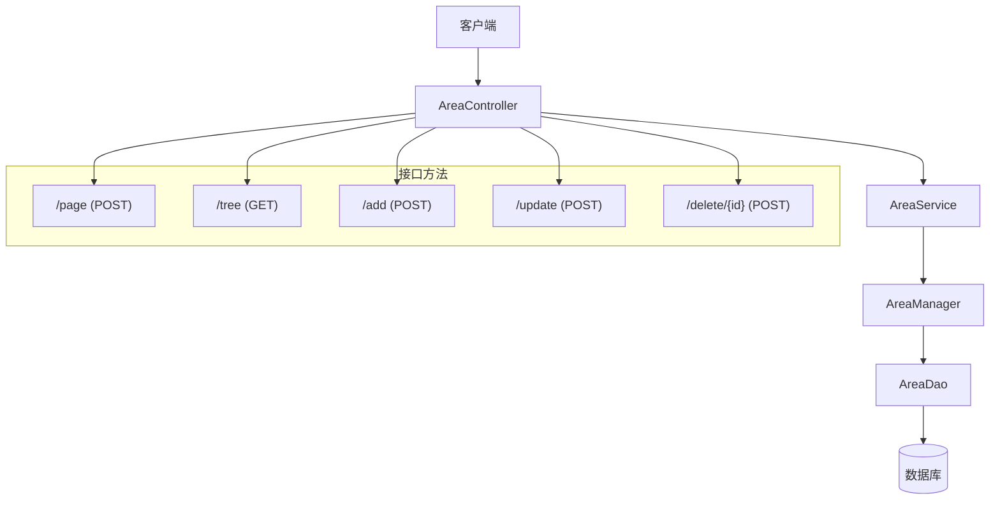
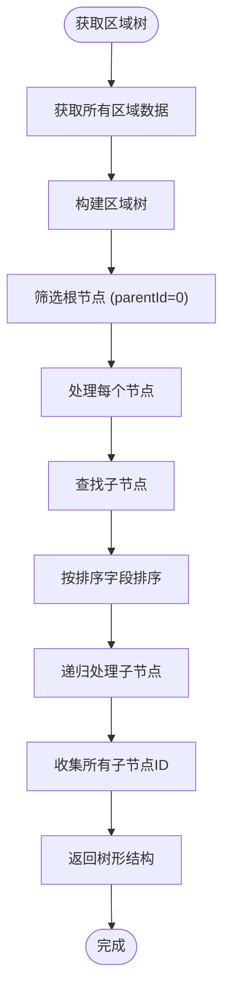
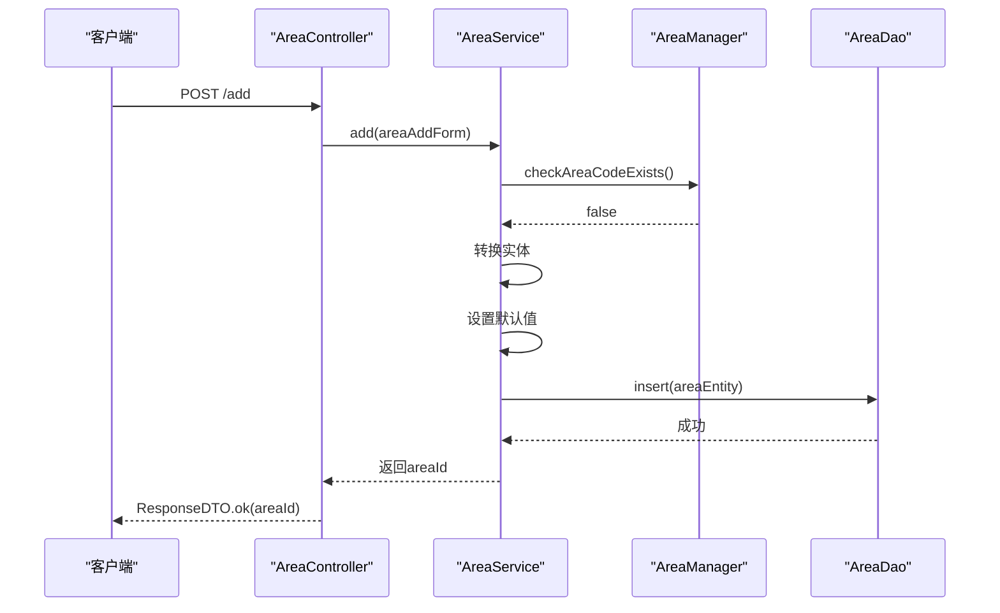
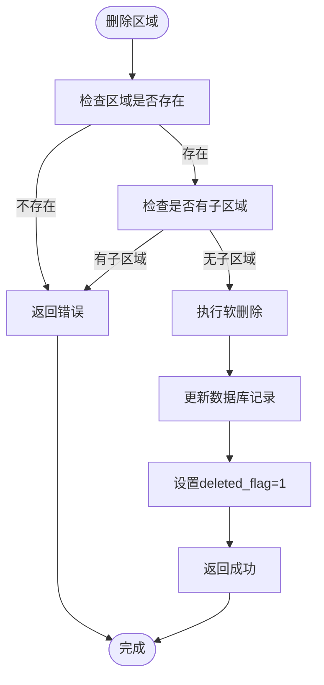
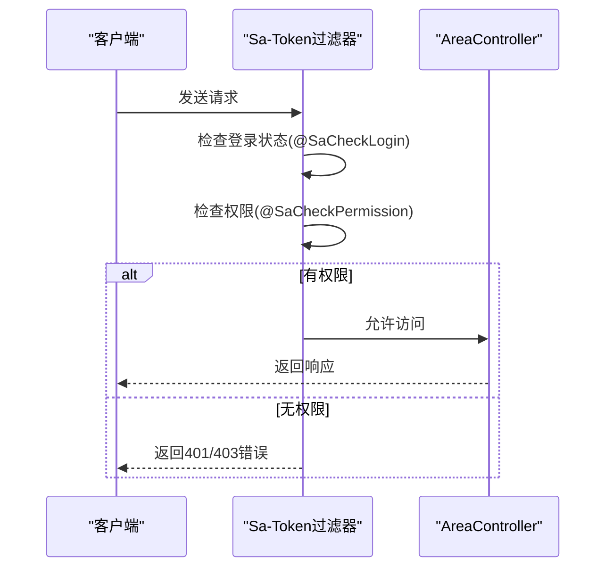

# 区域管理重构方案

> **⚠️ 重要提示**: 当前项目的区域管理功能分散在各个业务模块中，本文档描述的是区域管理重构到基础模块的设计方案。

## 重构背景分析

### 当前问题
根据2025-11-24的项目现状分析，区域管理存在以下问题：

1. **重复建设**: 区域管理功能散落在门禁、消费、考勤、视频监控等多个业务模块
2. **数据不一致**: 各业务模块的区域数据可能不同步
3. **业务耦合**: 区域实体与具体业务逻辑耦合过紧
4. **扩展困难**: 新增业务模块时需要重新实现区域管理

### 现有实现分析

#### 门禁模块区域管理
- **位置**: `sa-admin.module.access`
- **核心文件**:
  - [AccessAreaController.java](file://smart-admin-api-java17-springboot3/sa-admin/src/main/java/net/lab1024/sa/admin/module/access/controller/AccessAreaController.java)
  - [AccessAreaEntity.java](file://smart-admin-api-java17-springboot3/sa-admin/src/main/java/net/lab1024/sa/admin/module/access/domain/entity/AccessAreaEntity.java)
  - [AccessAreaService.java](file://smart-admin-api-java17-springboot3/sa-admin/src/main/java/net/lab1024/sa/admin/module/access/service/AccessAreaService.java)

#### 数据权限区域支持
- **位置**: `sa-base.module.support.auth`
- **核心枚举**: [DataScope.java](file://smart-admin-api-java17-springboot3/sa-base/src/main/java/net/lab1024/sa/base/module/support/auth/DataScope.java)
- **支持情况**: ✅ 已支持 `AREA("指定区域数据")` 数据权限

## 重构设计方案

### 1. 基础区域管理模块架构

```
sa-base/src/main/java/net/lab1024/sa/base/module/area/
├── domain/
│   ├── entity/AreaEntity.java              # 基础区域实体（各模块共用）
│   ├── vo/AreaVO.java                      # 区域展示对象
│   ├── vo/AreaTreeVO.java                  # 区域树形结构
│   └── form/AreaForm.java                  # 区域表单对象
├── dao/AreaDao.java                        # 区域数据访问层
├── service/AreaService.java                # 区域服务接口
├── service/impl/AreaServiceImpl.java       # 区域服务实现
├── manager/AreaCacheManager.java           # 区域缓存管理器
└── enums/AreaTypeEnum.java                 # 区域类型枚举
```

### 2. 业务模块适配器模式

各业务模块通过适配器使用基础区域管理：

```
各业务模块适配器：
├── access/adapter/AccessAreaAdapter.java          # 门禁区域适配器
├── access/domain/entity/AccessAreaExtension.java  # 门禁区域扩展字段
├── consume/adapter/ConsumeAreaAdapter.java         # 消费区域适配器
├── attendance/adapter/AttendanceAreaAdapter.java   # 考勤区域适配器
└── video/adapter/VideoAreaAdapter.java            # 视频区域适配器
```

### 3. 数据库设计

#### 基础区域表 (t_area)
```sql
CREATE TABLE t_area (
    area_id BIGINT PRIMARY KEY AUTO_INCREMENT COMMENT '区域ID',
    area_code VARCHAR(32) NOT NULL COMMENT '区域编码',
    area_name VARCHAR(100) NOT NULL COMMENT '区域名称',
    area_type INT NOT NULL COMMENT '区域类型',
    parent_id BIGINT DEFAULT 0 COMMENT '上级区域ID',
    path VARCHAR(500) COMMENT '层级路径',
    level INT DEFAULT 0 COMMENT '层级深度',
    sort_order INT DEFAULT 0 COMMENT '排序号',
    status INT DEFAULT 1 COMMENT '状态(0:停用 1:正常)',
    longitude DECIMAL(10,6) COMMENT '经度',
    latitude DECIMAL(10,6) COMMENT '纬度',
    area_size DECIMAL(10,2) COMMENT '区域面积(平方米)',
    description VARCHAR(500) COMMENT '区域描述',
    create_time DATETIME DEFAULT CURRENT_TIMESTAMP COMMENT '创建时间',
    update_time DATETIME DEFAULT CURRENT_TIMESTAMP ON UPDATE CURRENT_TIMESTAMP COMMENT '更新时间',
    create_user_id BIGINT COMMENT '创建人ID',
    deleted_flag TINYINT DEFAULT 0 COMMENT '删除标记',
    version INT DEFAULT 1 COMMENT '版本号',
    INDEX idx_parent_id (parent_id),
    INDEX idx_area_code (area_code),
    INDEX idx_area_type (area_type),
    INDEX idx_deleted_flag (deleted_flag)
) ENGINE=InnoDB DEFAULT CHARSET=utf8mb4 COMMENT='基础区域表';
```

#### 区域扩展表示例 (门禁)
```sql
CREATE TABLE t_area_access_extension (
    id BIGINT PRIMARY KEY AUTO_INCREMENT COMMENT '主键ID',
    area_id BIGINT NOT NULL COMMENT '关联基础区域ID',
    access_enabled INT DEFAULT 1 COMMENT '是否启用门禁',
    access_level INT DEFAULT 0 COMMENT '访问权限级别',
    special_auth_required INT DEFAULT 0 COMMENT '是否需要特殊授权',
    valid_time_start VARCHAR(5) COMMENT '有效时间段开始',
    valid_time_end VARCHAR(5) COMMENT '有效时间段结束',
    valid_weekdays VARCHAR(20) COMMENT '有效星期',
    create_time DATETIME DEFAULT CURRENT_TIMESTAMP COMMENT '创建时间',
    update_time DATETIME DEFAULT CURRENT_TIMESTAMP ON UPDATE CURRENT_TIMESTAMP COMMENT '更新时间',
    FOREIGN KEY (area_id) REFERENCES t_area(area_id),
    INDEX idx_area_id (area_id)
) ENGINE=InnoDB DEFAULT CHARSET=utf8mb4 COMMENT='门禁区域扩展表';
```

### 4. API设计规范

#### 基础区域管理API (sa-base模块)
```
GET    /api/base/area/tree           # 获取区域树
POST   /api/base/area/page           # 分页查询区域
POST   /api/base/area/add            # 新增区域
POST   /api/base/area/update         # 更新区域
POST   /api/base/area/delete/{id}    # 删除区域
GET    /api/base/area/{id}           # 获取区域详情
POST   /api/base/area/batch-delete   # 批量删除区域
```

#### 业务模块适配API (门禁模块示例)
```
GET    /api/access/area/tree           # 获取门禁区域树（含扩展字段）
POST   /api/access/area/page           # 分页查询门禁区域
POST   /api/access/area/add            # 新增门禁区域
POST   /api/access/area/update         # 更新门禁区域
POST   /api/access/area/delete/{id}    # 删除门禁区域
```

### 5. 数据权限集成

#### DataScope枚举已支持区域权限
```java
public enum DataScope {
    ALL("全部数据"),
    DEPT("本部门数据"),
    DEPT_WITH_CHILD("本部门及子部门数据"),
    SELF("仅本人数据"),
    CUSTOM("自定义数据范围"),
    AREA("指定区域数据")  // ✅ 已支持
}
```

#### 区域权限解析器增强
```java
@Component
public class AreaDataScopeResolver implements DataScopeResolver {

    @Resource
    private AreaService areaService;

    @Override
    public boolean supports(DataScope dataScope) {
        return dataScope == DataScope.AREA;
    }

    @Override
    public String resolveSqlCondition(Long userId, DataScope dataScope) {
        // 根据用户区域权限生成SQL条件
        List<Long> areaIds = getUserAccessibleAreaIds(userId);
        return "area_id IN (" + StringUtils.join(areaIds, ",") + ")";
    }
}
```

## 迁移实施计划

### 阶段1: 基础模块实现 (1-2天)
1. 创建基础区域管理模块
2. 实现核心Entity、DAO、Service
3. 创建区域缓存管理器
4. 实现基础CRUD API

### 阶段2: 数据迁移 (1天)
1. 分析现有门禁区域数据
2. 创建数据迁移脚本
3. 将门禁区域数据迁移到基础区域表
4. 提取门禁特有字段到扩展表

### 阶段3: 业务模块适配 (2-3天)
1. 创建各业务模块适配器
2. 更新设备区域关联关系
3. 实现业务模块特定的扩展表
4. 更新API接口

### 阶段4: 前端适配 (1-2天)
1. 更新前端API调用
2. 实现区域管理界面
3. 更新各业务模块的区域选择组件

### 阶段5: 测试和优化 (1-2天)
1. 单元测试
2. 集成测试
3. 性能优化
4. 文档更新

## 技术要点

### 1. 适配器模式实现
```java
@Component
public class AccessAreaAdapter {

    @Resource
    private AreaService areaService;                    // 基础区域服务

    @Resource
    private AccessAreaExtensionService accessExtensionService; // 门禁扩展服务

    /**
     * 获取门禁区域树（包含门禁扩展字段）
     */
    public List<AccessAreaTreeVO> getAccessAreaTree() {
        // 1. 获取基础区域树
        List<AreaEntity> baseAreas = areaService.getAreaTree();

        // 2. 获取门禁扩展信息
        List<AccessAreaExtension> extensions = accessExtensionService.getAllExtensions();

        // 3. 合并基础区域和扩展字段
        return mergeAreaWithExtension(baseAreas, extensions);
    }
}
```

### 2. 统一缓存管理
```java
public class AreaCacheManager extends BaseCacheManager {

    @Override
    protected String getCachePrefix() {
        return "area:";
    }

    /**
     * 获取区域列表缓存
     */
    public List<AreaEntity> getAreaList() {
        String cacheKey = buildCacheKey("", ":list");
        return getCache(cacheKey, () -> areaService.getAllAreas());
    }

    /**
     * 获取区域树缓存
     */
    public List<AreaTreeVO> getAreaTree() {
        String cacheKey = buildCacheKey("", ":tree");
        return getCache(cacheKey, () -> areaService.buildAreaTree());
    }
}
```

### 3. 事务管理
```java
@Service
@Transactional
public class AreaRelationService {

    /**
     * 保存业务模块区域（同时保存基础区域和扩展信息）
     */
    public Long saveBusinessArea(AccessAreaForm form) {
        // 1. 保存基础区域信息
        Long areaId = areaService.saveArea(convertToBaseArea(form));

        // 2. 保存业务模块扩展信息
        accessExtensionService.saveExtension(areaId, convertToExtension(form));

        // 3. 建立设备区域关联
        areaDeviceService.batchSaveDeviceRelations(areaId, form.getDeviceIds());

        return areaId;
    }
}
```

## 预期收益

1. **统一性**: 各业务模块使用统一的区域管理基础设施
2. **复用性**: 减少重复代码，提高开发效率
3. **一致性**: 保证区域数据的一致性
4. **扩展性**: 新增业务模块时无需重新实现区域管理
5. **权限控制**: 完善的区域数据权限控制机制

---

**注意**: 本重构方案需要与现有门禁区域管理功能兼容，确保平滑过渡。建议在开发环境充分测试后再进行生产环境的迁移。

## 目录
1. [接口概览](#接口概览)
2. [接口详细说明](#接口详细说明)
   - [分页查询 (/page)](#分页查询-page)
   - [获取区域树 (/tree)](#获取区域树-tree)
   - [新增区域 (/add)](#新增区域-add)
   - [更新区域 (/update)](#更新区域-update)
   - [删除区域 (/delete)](#删除区域-delete)
3. [表单验证机制](#表单验证机制)
4. [响应数据结构](#响应数据结构)
5. [权限控制机制](#权限控制机制)
6. [前端调用示例](#前端调用示例)

## 接口概览

区域管理API提供了一套完整的RESTful接口，用于管理系统的区域信息。这些接口遵循标准的四层架构模式（Controller → Service → Manager → DAO），并实现了完整的CRUD操作。所有接口均位于`/api/system/area`基础路径下，通过不同的HTTP方法和路径实现具体功能。



**图源**  
- [AreaController.java](file://smart-admin-api-java17-springboot3/sa-admin/src/main/java/net/lab1024/sa/admin/module/system/area/controller/AreaController.java)
- [AreaService.java](file://smart-admin-api-java17-springboot3/sa-admin/src/main/java/net/lab1024/sa/admin/module/system/area/service/AreaService.java)

**本节来源**  
- [AreaController.java](file://smart-admin-api-java17-springboot3/sa-admin/src/main/java/net/lab1024/sa/admin/module/system/area/controller/AreaController.java)
- [区域管理模块部署说明.md](file://区域管理模块部署说明.md)

## 接口详细说明

### 分页查询 (/page)

分页查询接口用于获取区域列表数据，支持多种查询条件的筛选。

**接口信息**
- **HTTP方法**: POST
- **请求路径**: `/api/system/area/page`
- **权限要求**: `area:page`
- **请求体**: `AreaQueryForm` 对象
- **响应**: `ResponseDTO<PageResult<AreaVO>>`

**请求参数说明**

| 参数名 | 类型 | 必填 | 描述 |
|--------|------|------|------|
| areaCode | String | 否 | 区域编码，支持模糊查询 |
| areaName | String | 否 | 区域名称，支持模糊查询 |
| areaType | String | 否 | 区域类型（如：CAMPUS, BUILDING等） |
| areaLevel | Integer | 否 | 区域层级 |
| parentId | Long | 否 | 父区域ID |
| managerId | Long | 否 | 区域负责人ID |
| status | Integer | 否 | 状态：1-启用，0-禁用 |
| includeDeleted | Boolean | 否 | 是否包含已删除的数据 |
| pageNum | Integer | 是 | 页码，从1开始 |
| pageSize | Integer | 是 | 每页大小 |

**响应结构**
```json
{
  "code": 0,
  "msg": "成功",
  "data": {
    "list": [
      {
        "areaId": 1,
        "areaCode": "CAMPUS01",
        "areaName": "园区A",
        "areaType": "CAMPUS",
        "areaLevel": 1,
        "parentId": null,
        "sortOrder": 1,
        "managerId": 1001,
        "managerName": "张三",
        "contactPhone": "13800138000",
        "address": "北京市朝阳区",
        "status": 1,
        "createTime": "2025-01-10T10:00:00",
        "updateTime": "2025-01-10T10:00:00",
        "createUserId": 1,
        "createUserName": "admin",
        "updateUserId": 1,
        "updateUserName": "admin"
      }
    ],
    "total": 1,
    "pageNum": 1,
    "pageSize": 10,
    "pages": 1
  }
}
```

**本节来源**  
- [AreaController.java](file://smart-admin-api-java17-springboot3/sa-admin/src/main/java/net/lab1024/sa/admin/module/system/area/controller/AreaController.java#L36-L42)
- [AreaQueryForm.java](file://smart-admin-api-java17-springboot3/sa-admin/src/main/java/net/lab1024/sa/admin/module/system/area/domain/form/AreaQueryForm.java)
- [AreaVO.java](file://smart-admin-api-java17-springboot3/sa-admin/src/main/java/net/lab1024/sa/admin/module/system/area/domain/vo/AreaVO.java)

### 获取区域树 (/tree)

获取区域树接口用于获取所有区域的树形结构，便于前端展示层级关系。

**接口信息**
- **HTTP方法**: GET
- **请求路径**: `/api/system/area/tree`
- **权限要求**: `area:tree`
- **响应**: `ResponseDTO<List<AreaTreeVO>>`

**响应结构**
```json
{
  "code": 0,
  "msg": "成功",
  "data": [
    {
      "areaId": 1,
      "areaCode": "CAMPUS01",
      "areaName": "园区A",
      "areaType": "CAMPUS",
      "areaLevel": 1,
      "parentId": null,
      "sortOrder": 1,
      "children": [
        {
          "areaId": 2,
          "areaCode": "BUILDING01",
          "areaName": "楼栋A",
          "areaType": "BUILDING",
          "areaLevel": 2,
          "parentId": 1,
          "sortOrder": 1,
          "children": [],
          "selfAndAllChildrenIdList": [2]
        }
      ],
      "selfAndAllChildrenIdList": [1, 2]
    }
  ]
}
```

**树形结构构建逻辑**
1. 从数据库获取所有区域数据
2. 以父区域ID为0的区域作为根节点
3. 递归构建子区域树
4. 按排序字段进行排序
5. 收集每个节点及其所有子节点的ID列表



**图源**  
- [AreaManager.java](file://smart-admin-api-java17-springboot3/sa-admin/src/main/java/net/lab1024/sa/admin/module/system/area/manager/AreaManager.java#L48-L78)

**本节来源**  
- [AreaController.java](file://smart-admin-api-java17-springboot3/sa-admin/src/main/java/net/lab1024/sa/admin/module/system/area/controller/AreaController.java#L44-L50)
- [AreaManager.java](file://smart-admin-api-java17-springboot3/sa-admin/src/main/java/net/lab1024/sa/admin/module/system/area/manager/AreaManager.java#L48-L78)
- [AreaTreeVO.java](file://smart-admin-api-java17-springboot3/sa-admin/src/main/java/net/lab1024/sa/admin/module/system/area/domain/vo/AreaTreeVO.java)

### 新增区域 (/add)

新增区域接口用于创建新的区域记录。

**接口信息**
- **HTTP方法**: POST
- **请求路径**: `/api/system/area/add`
- **权限要求**: `area:add`
- **请求体**: `AreaAddForm` 对象
- **响应**: `ResponseDTO<Long>`（返回新增区域的ID）

**请求参数说明**

| 参数名 | 类型 | 必填 | 描述 | 验证规则 |
|--------|------|------|------|----------|
| areaCode | String | 是 | 区域编码 | 非空，长度≤100 |
| areaName | String | 是 | 区域名称 | 非空，长度≤200 |
| areaType | String | 是 | 区域类型 | 非空，长度≤50 |
| areaLevel | Integer | 否 | 区域层级 | 若未提供，根据父区域自动计算 |
| parentId | Long | 是 | 父区域ID | 非空 |
| sortOrder | Integer | 否 | 排序序号 | 若未提供，默认为0 |
| managerId | Long | 否 | 区域负责人ID | |
| contactPhone | String | 否 | 联系电话 | |
| address | String | 否 | 详细地址 | |
| longitude | BigDecimal | 否 | 经度 | |
| latitude | BigDecimal | 否 | 纬度 | |
| status | Integer | 否 | 状态 | 若未提供，默认为1（启用） |
| areaDesc | String | 否 | 区域描述 | |

**业务逻辑流程**
1. 检查区域编码是否已存在
2. 转换表单数据为实体对象
3. 设置默认值（状态、排序、层级等）
4. 保存到数据库



**图源**  
- [AreaService.java](file://smart-admin-api-java17-springboot3/sa-admin/src/main/java/net/lab1024/sa/admin/module/system/area/service/AreaService.java#L77-L121)

**本节来源**  
- [AreaController.java](file://smart-admin-api-java17-springboot3/sa-admin/src/main/java/net/lab1024/sa/admin/module/system/area/controller/AreaController.java#L60-L66)
- [AreaAddForm.java](file://smart-admin-api-java17-springboot3/sa-admin/src/main/java/net/lab1024/sa/admin/module/system/area/domain/form/AreaAddForm.java)
- [AreaService.java](file://smart-admin-api-java17-springboot3/sa-admin/src/main/java/net/lab1024/sa/admin/module/system/area/service/AreaService.java#L77-L121)

### 更新区域 (/update)

更新区域接口用于修改现有区域的信息。

**接口信息**
- **HTTP方法**: POST
- **请求路径**: `/api/system/area/update`
- **权限要求**: `area:update`
- **请求体**: `AreaUpdateForm` 对象
- **响应**: `ResponseDTO<Void>`

**请求参数说明**

| 参数名 | 类型 | 必填 | 描述 | 验证规则 |
|--------|------|------|------|----------|
| areaId | Long | 是 | 区域ID | 非空 |
| areaCode | String | 是 | 区域编码 | 非空，长度≤100 |
| areaName | String | 是 | 区域名称 | 非空，长度≤200 |
| areaType | String | 是 | 区域类型 | 非空，长度≤50 |
| areaLevel | Integer | 否 | 区域层级 | |
| parentId | Long | 是 | 父区域ID | 非空 |
| sortOrder | Integer | 否 | 排序序号 | |
| managerId | Long | 否 | 区域负责人ID | |
| contactPhone | String | 否 | 联系电话 | |
| address | String | 否 | 详细地址 | |
| longitude | BigDecimal | 否 | 经度 | |
| latitude | BigDecimal | 否 | 纬度 | |
| status | Integer | 否 | 状态 | |
| areaDesc | String | 否 | 区域描述 | |

**业务逻辑流程**
1. 检查区域是否存在
2. 检查区域编码是否重复（排除自身）
3. 检查父区域是否为自己或子区域
4. 更新数据库记录

**本节来源**  
- [AreaController.java](file://smart-admin-api-java17-springboot3/sa-admin/src/main/java/net/lab1024/sa/admin/module/system/area/controller/AreaController.java#L68-L74)
- [AreaUpdateForm.java](file://smart-admin-api-java17-springboot3/sa-admin/src/main/java/net/lab1024/sa/admin/module/system/area/domain/form/AreaUpdateForm.java)
- [AreaService.java](file://smart-admin-api-java17-springboot3/sa-admin/src/main/java/net/lab1024/sa/admin/module/system/area/service/AreaService.java#L129-L158)

### 删除区域 (/delete)

删除区域接口用于删除指定的区域记录，采用软删除机制。

**接口信息**
- **HTTP方法**: POST
- **请求路径**: `/api/system/area/delete/{areaId}`
- **权限要求**: `area:delete`
- **路径参数**: `areaId`（区域ID）
- **响应**: `ResponseDTO<Void>`

**业务逻辑流程**
1. 检查区域是否存在且未被删除
2. 检查是否存在子区域（存在子区域则不允许删除）
3. 执行软删除（设置deleted_flag=1）



**图源**  
- [AreaService.java](file://smart-admin-api-java17-springboot3/sa-admin/src/main/java/net/lab1024/sa/admin/module/system/area/service/AreaService.java#L165-L194)

**本节来源**  
- [AreaController.java](file://smart-admin-api-java17-springboot3/sa-admin/src/main/java/net/lab1024/sa/admin/module/system/area/controller/AreaController.java#L76-L82)
- [AreaService.java](file://smart-admin-api-java17-springboot3/sa-admin/src/main/java/net/lab1024/sa/admin/module/system/area/service/AreaService.java#L165-L194)

## 表单验证机制

区域管理API使用JSR-303标准的Bean Validation进行表单验证，通过`@Valid`注解触发验证过程。

### AreaQueryForm 验证

`AreaQueryForm`继承自`PageParam`，包含分页参数和查询条件。该表单主要用于分页查询，不包含严格的验证注解，主要依赖业务逻辑层进行数据处理。

### AreaAddForm 验证

`AreaAddForm`用于新增区域，包含严格的验证规则：

```java
@Data
public class AreaAddForm {
    @NotBlank(message = "区域编码不能为空")
    @Length(max = 100, message = "区域编码长度不能超过100")
    private String areaCode;

    @NotBlank(message = "区域名称不能为空")
    @Length(max = 200, message = "区域名称长度不能超过200")
    private String areaName;

    @NotBlank(message = "区域类型不能为空")
    @Length(max = 50, message = "区域类型长度不能超过50")
    private String areaType;

    @NotNull(message = "父区域ID不能为空")
    private Long parentId;
}
```

### AreaUpdateForm 验证

`AreaUpdateForm`用于更新区域，验证规则与`AreaAddForm`基本相同：

```java
@Data
public class AreaUpdateForm {
    @NotNull(message = "区域ID不能为空")
    private Long areaId;

    @NotBlank(message = "区域编码不能为空")
    @Length(max = 100, message = "区域编码长度不能超过100")
    private String areaCode;

    @NotBlank(message = "区域名称不能为空")
    @Length(max = 200, message = "区域名称长度不能超过200")
    private String areaName;

    @NotBlank(message = "区域类型不能为空")
    @Length(max = 50, message = "区域类型长度不能超过50")
    private String areaType;

    @NotNull(message = "父区域ID不能为空")
    private Long parentId;
}
```

**验证流程**
1. 在Controller方法参数上使用`@Valid`注解
2. Spring框架自动触发Bean Validation
3. 如果验证失败，抛出`MethodArgumentNotValidException`
4. 全局异常处理器捕获并返回统一错误响应

**本节来源**  
- [AreaAddForm.java](file://smart-admin-api-java17-springboot3/sa-admin/src/main/java/net/lab1024/sa/admin/module/system/area/domain/form/AreaAddForm.java)
- [AreaUpdateForm.java](file://smart-admin-api-java17-springboot3/sa-admin/src/main/java/net/lab1024/sa/admin/module/system/area/domain/form/AreaUpdateForm.java)
- [AreaController.java](file://smart-admin-api-java17-springboot3/sa-admin/src/main/java/net/lab1024/sa/admin/module/system/area/controller/AreaController.java)

## 响应数据结构

### AreaVO 结构

`AreaVO`是区域信息的视图对象，用于返回区域的基本信息。

```java
@Data
public class AreaVO {
    private Long areaId;
    private String areaCode;
    private String areaName;
    private String areaType;
    private Integer areaLevel;
    private Long parentId;
    private Integer sortOrder;
    private Map<String, Object> areaConfig;
    private String areaDesc;
    private Long managerId;
    private String managerName;
    private String contactPhone;
    private String address;
    private BigDecimal longitude;
    private BigDecimal latitude;
    private Integer status;
    private LocalDateTime createTime;
    private LocalDateTime updateTime;
    private Long createUserId;
    private String createUserName;
    private Long updateUserId;
    private String updateUserName;
}
```

### AreaTreeVO 结构

`AreaTreeVO`继承自`AreaVO`，增加了树形结构相关的字段，用于构建区域树。

```java
@Data
@EqualsAndHashCode(callSuper = true)
public class AreaTreeVO extends AreaVO {
    private Long preId;
    private Long nextId;
    private List<AreaTreeVO> children;
    private List<Long> selfAndAllChildrenIdList;
    private Integer deviceCount;
    private Integer userCount;
}
```

**字段说明**
- `children`: 子区域列表，用于构建树形结构
- `selfAndAllChildrenIdList`: 当前节点及其所有子节点的ID集合，便于权限判断和批量操作
- `preId`和`nextId`: 同级上一个和下一个元素的ID，用于排序操作
- `deviceCount`和`userCount`: 设备数量和人员数量，用于统计展示

**本节来源**  
- [AreaVO.java](file://smart-admin-api-java17-springboot3/sa-admin/src/main/java/net/lab1024/sa/admin/module/system/area/domain/vo/AreaVO.java)
- [AreaTreeVO.java](file://smart-admin-api-java17-springboot3/sa-admin/src/main/java/net/lab1024/sa/admin/module/system/area/domain/vo/AreaTreeVO.java)
- [AreaManager.java](file://smart-admin-api-java17-springboot3/sa-admin/src/main/java/net/lab1024/sa/admin/module/system/area/manager/AreaManager.java#L60-L78)

## 权限控制机制

区域管理API使用Sa-Token框架的`@SaCheckPermission`注解进行权限控制，确保只有具有相应权限的用户才能访问特定接口。

### 权限注解应用

| 接口 | 权限标识 | 说明 |
|------|----------|------|
| /page | area:page | 查询区域列表的权限 |
| /tree | area:tree | 获取区域树的权限 |
| /add | area:add | 新增区域的权限 |
| /update | area:update | 更新区域的权限 |
| /delete | area:delete | 删除区域的权限 |

### 权限控制流程



**权限检查规则**
1. 所有区域管理接口都需要先登录（`@SaCheckLogin`）
2. 每个接口根据功能需求设置具体的权限标识
3. 前端通过`v-privilege`指令控制按钮的显示

**本节来源**  
- [AreaController.java](file://smart-admin-api-java17-springboot3/sa-admin/src/main/java/net/lab1024/sa/admin/module/system/area/controller/AreaController.java)
- [fix_area_menu.sql](file://数据库SQL脚本/mysql/fix_area_menu.sql)
- [index.vue](file://smart-admin-web-javascript/src/views/system/area/index.vue)

## 前端调用示例

### curl 调用示例

**分页查询**
```bash
curl -X POST "http://localhost:8080/api/system/area/page" \
  -H "Content-Type: application/json" \
  -H "Authorization: Bearer your-token" \
  -d '{
    "areaCode": "CAMPUS",
    "areaName": "园区",
    "status": 1,
    "pageNum": 1,
    "pageSize": 10
  }'
```

**新增区域**
```bash
curl -X POST "http://localhost:8080/api/system/area/add" \
  -H "Content-Type: application/json" \
  -H "Authorization: Bearer your-token" \
  -d '{
    "areaCode": "BUILDING01",
    "areaName": "楼栋A",
    "areaType": "BUILDING",
    "parentId": 1,
    "sortOrder": 1
  }'
```

**删除区域**
```bash
curl -X POST "http://localhost:8080/api/system/area/delete/1" \
  -H "Authorization: Bearer your-token"
```

### Axios 调用代码片段

```javascript
// 导入API
import { areaApi } from '/@/api/system/area-api';

// 分页查询
const queryAreaPage = async () => {
  try {
    const param = {
      areaCode: 'CAMPUS',
      areaName: '园区',
      status: 1,
      pageNum: 1,
      pageSize: 10
    };
    const res = await areaApi.queryPage(param);
    console.log('查询结果:', res.data);
  } catch (error) {
    console.error('查询失败:', error.msg);
  }
};

// 获取区域树
const getAreaTree = async () => {
  try {
    const res = await areaApi.getAreaTree();
    console.log('区域树:', res.data);
    // 处理树形数据
    renderTree(res.data);
  } catch (error) {
    console.error('获取区域树失败:', error.msg);
  }
};

// 新增区域
const addArea = async () => {
  try {
    const param = {
      areaCode: 'ROOM01',
      areaName: '房间A',
      areaType: 'ROOM',
      parentId: 2,
      sortOrder: 1
    };
    const res = await areaApi.add(param);
    console.log('新增成功，区域ID:', res.data);
  } catch (error) {
    console.error('新增失败:', error.msg);
  }
};

// 更新区域
const updateArea = async () => {
  try {
    const param = {
      areaId: 1,
      areaCode: 'CAMPUS01',
      areaName: '园区A',
      areaType: 'CAMPUS',
      parentId: 0,
      sortOrder: 1
    };
    await areaApi.update(param);
    console.log('更新成功');
  } catch (error) {
    console.error('更新失败:', error.msg);
  }
};

// 删除区域
const deleteArea = async (areaId) => {
  try {
    await areaApi.delete(areaId);
    console.log('删除成功');
  } catch (error) {
    console.error('删除失败:', error.msg);
  }
};
```

### 前端组件示例

```vue
<template>
  <!-- 区域树展示 -->
  <a-tree
    :tree-data="areaTreeData"
    :field-names="{ key: 'areaId', title: 'areaName', children: 'children' }"
    @select="onTreeSelect"
  />

  <!-- 区域列表展示 -->
  <a-table
    :columns="columns"
    :data-source="areaList"
    row-key="areaId"
    :pagination="pagination"
    @change="handleTableChange"
  >
    <template #bodyCell="{ column, record }">
      <template v-if="column.key === 'status'">
        <a-tag :color="record.status === 1 ? 'green' : 'red'">
          {{ record.status === 1 ? '启用' : '禁用' }}
        </a-tag>
      </template>
      <template v-else-if="column.key === 'action'">
        <a-space>
          <a-button type="link" size="small" @click="handleEdit(record)">编辑</a-button>
          <a-popconfirm title="确定删除吗？" @confirm="handleDelete(record.areaId)">
            <a-button type="link" size="small" danger>删除</a-button>
          </a-popconfirm>
        </a-space>
      </template>
    </template>
  </a-table>
</template>

<script setup>
import { ref, onMounted } from 'vue';
import { areaApi } from '/@/api/system/area-api';

const areaTreeData = ref([]);
const areaList = ref([]);
const pagination = ref({ current: 1, pageSize: 10, total: 0 });

// 加载区域树
const loadAreaTree = async () => {
  try {
    const res = await areaApi.getAreaTree();
    areaTreeData.value = res.data;
  } catch (error) {
    console.error('加载区域树失败:', error);
  }
};

// 加载分页数据
const loadAreaPage = async (pageNum = 1, pageSize = 10) => {
  try {
    const res = await areaApi.queryPage({ pageNum, pageSize });
    areaList.value = res.data.list;
    pagination.value = {
      current: res.data.pageNum,
      pageSize: res.data.pageSize,
      total: res.data.total
    };
  } catch (error) {
    console.error('加载分页数据失败:', error);
  }
};

onMounted(() => {
  loadAreaTree();
  loadAreaPage();
});
</script>
```

**本节来源**  
- [area-api.js](file://smart-admin-web-javascript/src/api/system/area-api.js)
- [index.vue](file://smart-admin-web-javascript/src/views/system/area/index.vue)
- [area-modal.vue](file://smart-admin-web-javascript/src/views/system/area/area-modal.vue)