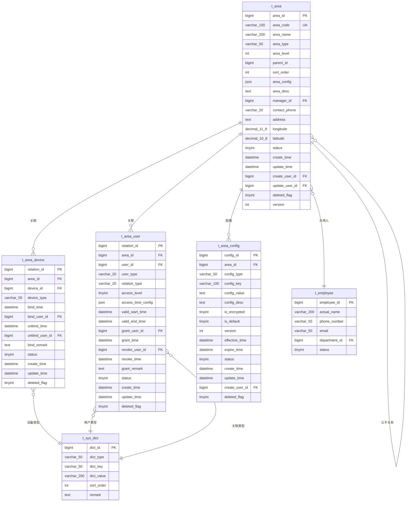
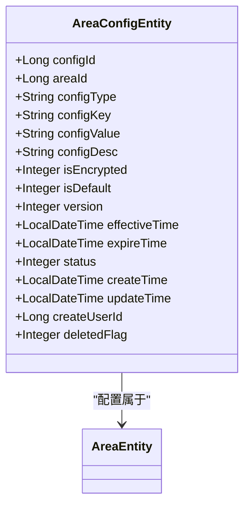
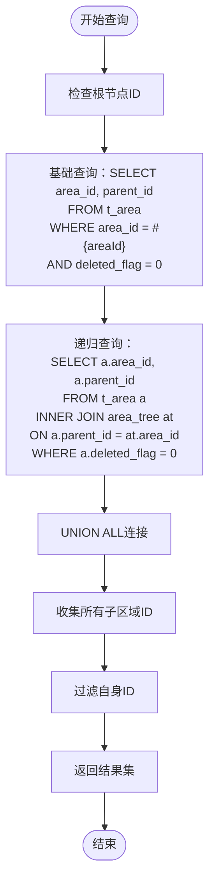
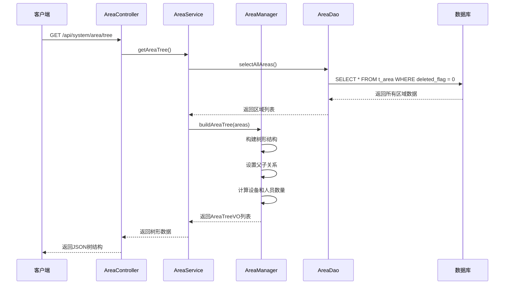

# 区域表结构重构方案

> **⚠️ 重要说明**: 本文档描述的是区域管理重构到基础模块的数据库设计方案。当前项目的区域管理功能分散在各个业务模块中。

## 当前状态分析

### 现有区域管理分布

根据2025-11-24项目现状，区域管理功能分布如下：

#### 门禁模块区域管理
- **实体类**: [AccessAreaEntity.java](file://smart-admin-api-java17-springboot3/sa-admin/src/main/java/net/lab1024/sa/admin/module/access/domain/entity/AccessAreaEntity.java)
- **数据表**: `t_access_area` (推测)
- **特点**: 包含门禁业务特定字段，如权限级别、访问控制等

#### 数据权限区域支持
- **枚举类**: [DataScope.java](file://smart-admin-api-java17-springboot3/sa-base/src/main/java/net/lab1024/sa/base/module/support/auth/DataScope.java)
- **人员区域关联**: [AreaPersonEntity.java](file://smart-admin-api-java17-springboot3/sa-support/src/main/java/net/lab1024/sa/base/module/support/rbac/domain/entity/AreaPersonEntity.java)
- **数据表**: `t_area_person`
- **特点**: 已支持区域数据权限，但缺乏基础区域管理

## 目录
1. [重构概述](#重构概述)
2. [基础区域表设计](#基础区域表设计)
3. [区域扩展表设计](#区域扩展表设计)
4. [区域关系表设计](#区域关系表设计)
5. [数据迁移方案](#数据迁移方案)
6. [索引优化策略](#索引优化策略)
7. [业务模块适配](#业务模块适配)
8. [实施计划](#实施计划)

## 重构概述

### 重构目标
1. **统一区域管理**: 建立基础区域管理模块，各业务模块复用
2. **业务解耦**: 通过扩展表机制实现业务特定需求
3. **数据一致性**: 保证各业务模块使用统一的区域数据源
4. **扩展性**: 支持新业务模块的快速接入

### 设计原则
- **基础与扩展分离**: 基础区域信息统一管理，业务特定字段通过扩展表存储
- **适配器模式**: 各业务模块通过适配器使用基础区域服务
- **数据权限兼容**: 与现有DataScope.AREA数据权限无缝集成
- **向后兼容**: 保证现有门禁区域管理功能的平滑迁移

## 基础区域表设计

### t_area - 基础区域表

```sql
CREATE TABLE t_area (
    area_id BIGINT PRIMARY KEY AUTO_INCREMENT COMMENT '区域ID',
    area_code VARCHAR(32) NOT NULL COMMENT '区域编码',
    area_name VARCHAR(100) NOT NULL COMMENT '区域名称',
    area_type INT NOT NULL COMMENT '区域类型(1:园区 2:建筑 3:楼层 4:房间 5:区域 6:其他)',
    parent_id BIGINT DEFAULT 0 COMMENT '上级区域ID(0表示根区域)',
    path VARCHAR(500) COMMENT '层级路径(用逗号分隔的ID链)',
    level INT DEFAULT 0 COMMENT '层级深度(根区域为0)',
    sort_order INT DEFAULT 0 COMMENT '排序号(同层级排序)',
    status INT DEFAULT 1 COMMENT '区域状态(0:停用 1:正常 2:维护中)',
    longitude DECIMAL(10,6) COMMENT '经度坐标',
    latitude DECIMAL(10,6) COMMENT '纬度坐标',
    area_size DECIMAL(10,2) COMMENT '区域面积(平方米)',
    capacity INT COMMENT '容纳人数',
    description VARCHAR(500) COMMENT '区域描述',
    map_image VARCHAR(500) COMMENT '区域平面图路径',
    create_time DATETIME DEFAULT CURRENT_TIMESTAMP COMMENT '创建时间',
    update_time DATETIME DEFAULT CURRENT_TIMESTAMP ON UPDATE CURRENT_TIMESTAMP COMMENT '更新时间',
    create_user_id BIGINT COMMENT '创建人ID',
    update_user_id BIGINT COMMENT '更新人ID',
    deleted_flag TINYINT DEFAULT 0 COMMENT '删除标记(0:未删除 1:已删除)',
    version INT DEFAULT 1 COMMENT '版本号',

    -- 索引设计
    INDEX idx_parent_id (parent_id),
    INDEX idx_area_code (area_code),
    INDEX idx_area_type (area_type),
    INDEX idx_level (level),
    INDEX idx_status (status),
    INDEX idx_deleted_flag (deleted_flag),
    UNIQUE KEY uk_area_code (area_code, deleted_flag),
    INDEX idx_path (path(100))
) ENGINE=InnoDB DEFAULT CHARSET=utf8mb4 COMMENT='基础区域表';
```

### 字段说明

| 字段名 | 数据类型 | 约束 | 描述 |
|--------|----------|------|------|
| area_id | BIGINT | PRIMARY KEY, AUTO_INCREMENT | 区域唯一标识 |
| area_code | VARCHAR(32) | NOT NULL | 区域编码，全局唯一 |
| area_name | VARCHAR(100) | NOT NULL | 区域名称 |
| area_type | INT | NOT NULL | 区域类型枚举值 |
| parent_id | BIGINT | DEFAULT 0 | 父区域ID，0表示根节点 |
| path | VARCHAR(500) | | 层级路径，如"0,1,2,3" |
| level | INT | DEFAULT 0 | 层级深度，根区域为0 |
| sort_order | INT | DEFAULT 0 | 同层级排序权重 |
| status | INT | DEFAULT 1 | 状态：0停用、1正常、2维护中 |
| longitude | DECIMAL(10,6) | | 经度坐标 |
| latitude | DECIMAL(10,6) | | 纬度坐标 |
| area_size | DECIMAL(10,2) | | 区域面积(平方米) |
| capacity | INT | | 容纳人数 |
| description | VARCHAR(500) | | 区域描述 |
| map_image | VARCHAR(500) | | 区域平面图路径 |
| deleted_flag | TINYINT | DEFAULT 0 | 软删除标记 |
| version | INT | DEFAULT 1 | 乐观锁版本号 |

## 区域扩展表设计

### 扩展表设计原则

各业务模块通过扩展表存储业务特定的区域信息，实现业务逻辑与基础区域管理的解耦。

### 门禁区域扩展表

```sql
CREATE TABLE t_area_access_extension (
    id BIGINT PRIMARY KEY AUTO_INCREMENT COMMENT '主键ID',
    area_id BIGINT NOT NULL COMMENT '关联基础区域ID',
    access_enabled INT DEFAULT 1 COMMENT '是否启用门禁(0:禁用 1:启用)',
    access_level INT DEFAULT 0 COMMENT '访问权限级别(数字越大权限要求越高)',
    special_auth_required INT DEFAULT 0 COMMENT '是否需要特殊授权(0:不需要 1:需要)',
    valid_time_start VARCHAR(5) COMMENT '有效时间段开始(HH:mm格式)',
    valid_time_end VARCHAR(5) COMMENT '有效时间段结束(HH:mm格式)',
    valid_weekdays VARCHAR(20) COMMENT '有效星期(逗号分隔，1-7代表周一到周日)',
    building_id BIGINT COMMENT '所在建筑ID',
    floor_id BIGINT COMMENT '所在楼层ID',
    security_level INT DEFAULT 1 COMMENT '安全等级(1-5)',
    access_rule TEXT COMMENT '访问规则(JSON格式)',
    create_time DATETIME DEFAULT CURRENT_TIMESTAMP COMMENT '创建时间',
    update_time DATETIME DEFAULT CURRENT_TIMESTAMP ON UPDATE CURRENT_TIMESTAMP COMMENT '更新时间',
    create_user_id BIGINT COMMENT '创建人ID',
    update_user_id BIGINT COMMENT '更新人ID',
    deleted_flag TINYINT DEFAULT 0 COMMENT '删除标记',

    INDEX idx_area_id (area_id),
    INDEX idx_building_id (building_id),
    INDEX idx_floor_id (floor_id),
    INDEX idx_access_enabled (access_enabled),
    FOREIGN KEY (area_id) REFERENCES t_area(area_id)
) ENGINE=InnoDB DEFAULT CHARSET=utf8mb4 COMMENT='门禁区域扩展表';
```

### 消费区域扩展表

```sql
CREATE TABLE t_area_consume_extension (
    id BIGINT PRIMARY KEY AUTO_INCREMENT COMMENT '主键ID',
    area_id BIGINT NOT NULL COMMENT '关联基础区域ID',
    consume_enabled INT DEFAULT 1 COMMENT '是否启用消费(0:禁用 1:启用)',
    consume_type INT DEFAULT 1 COMMENT '消费类型(1:食堂 2:超市 3:其他)',
    payment_method VARCHAR(50) COMMENT '支付方式',
    discount_rate DECIMAL(5,2) DEFAULT 1.00 COMMENT '折扣率',
    daily_limit DECIMAL(10,2) COMMENT '单日消费限额',
    meal_time_config TEXT COMMENT '用餐时间配置(JSON)',
    device_count INT DEFAULT 0 COMMENT '设备数量',
    create_time DATETIME DEFAULT CURRENT_TIMESTAMP COMMENT '创建时间',
    update_time DATETIME DEFAULT CURRENT_TIMESTAMP ON UPDATE CURRENT_TIMESTAMP COMMENT '更新时间',
    create_user_id BIGINT COMMENT '创建人ID',
    update_user_id BIGINT COMMENT '更新人ID',
    deleted_flag TINYINT DEFAULT 0 COMMENT '删除标记',

    INDEX idx_area_id (area_id),
    INDEX idx_consume_enabled (consume_enabled),
    INDEX idx_consume_type (consume_type),
    FOREIGN KEY (area_id) REFERENCES t_area(area_id)
) ENGINE=InnoDB DEFAULT CHARSET=utf8mb4 COMMENT='消费区域扩展表';
```

## 区域关系表设计

### t_area_device - 区域设备关联表

```sql
CREATE TABLE t_area_device (
    id BIGINT PRIMARY KEY AUTO_INCREMENT COMMENT '主键ID',
    area_id BIGINT NOT NULL COMMENT '区域ID',
    device_id BIGINT NOT NULL COMMENT '设备ID',
    device_type VARCHAR(50) NOT NULL COMMENT '设备类型(ACCESS/CONSUME/ATTENDANCE/VIDEO)',
    device_code VARCHAR(100) COMMENT '设备编码',
    device_name VARCHAR(200) COMMENT '设备名称',
    bind_time DATETIME DEFAULT CURRENT_TIMESTAMP COMMENT '绑定时间',
    bind_user_id BIGINT COMMENT '绑定操作人ID',
    unbind_time DATETIME COMMENT '解绑时间',
    unbind_user_id BIGINT COMMENT '解绑操作人ID',
    bind_remark VARCHAR(500) COMMENT '绑定备注',
    status INT DEFAULT 1 COMMENT '状态(0:解绑 1:绑定 2:故障)',
    create_time DATETIME DEFAULT CURRENT_TIMESTAMP COMMENT '创建时间',
    update_time DATETIME DEFAULT CURRENT_TIMESTAMP ON UPDATE CURRENT_TIMESTAMP COMMENT '更新时间',
    deleted_flag TINYINT DEFAULT 0 COMMENT '删除标记',

    INDEX idx_area_id (area_id),
    INDEX idx_device_id (device_id),
    INDEX idx_device_type (device_type),
    INDEX idx_status (status),
    UNIQUE KEY uk_area_device (area_id, device_id, device_type, deleted_flag)
) ENGINE=InnoDB DEFAULT CHARSET=utf8mb4 COMMENT='区域设备关联表';
```

### t_area_person - 区域人员关联表(完善现有)

```sql
-- 基于现有t_area_person表进行扩展
ALTER TABLE t_area_person
ADD COLUMN device_types VARCHAR(200) COMMENT '可访问设备类型(逗号分隔)',
ADD COLUMN access_time_config TEXT COMMENT '访问时间配置(JSON)',
ADD COLUMN special_permissions TEXT COMMENT '特殊权限(JSON)',
ADD COLUMN last_access_time DATETIME COMMENT '最后访问时间',
ADD COLUMN access_count INT DEFAULT 0 COMMENT '访问次数';
```

## 数据迁移方案

### 门禁区域数据迁移

```sql
-- 步骤1: 创建基础区域表数据
INSERT INTO t_area (area_code, area_name, area_type, parent_id, level, sort_order, status,
                   longitude, latitude, area_size, capacity, description,
                   create_time, create_user_id)
SELECT
    area_code,
    area_name,
    CASE area_type
        WHEN 1 THEN 1  -- 园区
        WHEN 2 THEN 2  -- 建筑
        WHEN 3 THEN 3  -- 楼层
        WHEN 4 THEN 4  -- 房间
        WHEN 5 THEN 5  -- 区域
        ELSE 6        -- 其他
    END as area_type,
    parent_id,
    level,
    sort_order,
    status,
    longitude,
    latitude,
    area,
    capacity,
    description,
    create_time,
    create_user_id
FROM t_access_area
WHERE deleted_flag = 0;

-- 步骤2: 创建门禁扩展表数据
INSERT INTO t_area_access_extension
(area_id, access_enabled, access_level, special_auth_required,
 valid_time_start, valid_time_end, valid_weekdays, building_id, floor_id,
 security_level, access_rule, create_time, create_user_id)
SELECT
    a.area_id,
    a.access_enabled,
    a.access_level,
    a.special_auth_required,
    a.valid_time_start,
    a.valid_time_end,
    a.valid_weekdays,
    a.building_id,
    a.floor_id,
    1 as security_level, -- 默认安全等级
    '{}' as access_rule,  -- 默认空规则
    a.create_time,
    a.create_user_id
FROM t_access_area a
WHERE a.deleted_flag = 0;
```

### 设备区域关联迁移

```sql
-- 迁移各业务模块的设备区域关联
INSERT INTO t_area_device (area_id, device_id, device_type, device_code, device_name,
                           bind_time, bind_user_id, status, create_time, create_user_id)
SELECT
    area_id,
    device_id,
    'ACCESS' as device_type,
    device_code,
    device_name,
    create_time as bind_time,
    create_user_id as bind_user_id,
    1 as status,
    create_time,
    create_user_id
FROM t_access_device
WHERE deleted_flag = 0 AND area_id IS NOT NULL;
```

### 核心字段详解

| 字段名 | 数据类型 | 约束条件 | 描述 | 用途 |
|--------|----------|----------|------|------|
| area_id | BIGINT | PRIMARY KEY, AUTO_INCREMENT | 区域唯一标识符 | 主键，自增 |
| area_code | VARCHAR(100) | NOT NULL, UNIQUE | 区域编码 | 全局唯一标识，用于业务逻辑 |
| area_name | VARCHAR(200) | NOT NULL | 区域名称 | 显示名称，支持中文 |
| area_type | VARCHAR(50) | NOT NULL | 区域类型 | 枚举类型，如园区、楼栋等 |
| area_level | INT | DEFAULT 1 | 区域层级 | 层级深度，从1开始 |
| parent_id | BIGINT | DEFAULT 0 | 父区域ID | 自引用外键，0表示顶级 |
| sort_order | INT | DEFAULT 0 | 排序权重 | 同级区域排序 |
| area_config | JSON | NULLABLE | 动态配置 | 存储JSON格式的配置信息 |
| area_desc | TEXT | NULLABLE | 区域描述 | 详细说明信息 |
| manager_id | BIGINT | NULLABLE | 负责人ID | 关联员工表 |
| contact_phone | VARCHAR(20) | NULLABLE | 联系电话 | 格式化存储 |
| address | TEXT | NULLABLE | 详细地址 | 结构化地址信息 |
| longitude | DECIMAL(11,8) | NULLABLE | 经度 | 地理信息系统 |
| latitude | DECIMAL(10,8) | NULLABLE | 纬度 | 地理信息系统 |
| status | TINYINT | DEFAULT 1 | 状态标识 | 1-启用，0-禁用 |
| create_time | DATETIME | DEFAULT CURRENT_TIMESTAMP | 创建时间 | 自动填充 |
| update_time | DATETIME | DEFAULT CURRENT_TIMESTAMP ON UPDATE CURRENT_TIMESTAMP | 更新时间 | 自动更新 |
| create_user_id | BIGINT | NULLABLE | 创建人ID | 关联用户系统 |
| update_user_id | BIGINT | NULLABLE | 更新人ID | 关联用户系统 |
| deleted_flag | TINYINT | DEFAULT 0 | 删除标志 | 0-未删除，1-已删除 |
| version | INT | DEFAULT 1 | 版本号 | 乐观锁控制 |

**节来源**
- [AreaEntity.java](file://smart-admin-api-java17-springboot3/sa-admin/src/main/java/net/lab1024/sa/admin/module/system/area/domain/entity/AreaEntity.java#L24-L130)
- [smart_area.sql](file://数据库SQL脚本/mysql/smart_area.sql#L8-L38)

## 数据库表结构

### 主表结构设计

`t_area`表采用标准的关系型数据库设计，支持复杂的层次化查询和高效的索引访问。



**图表来源**
- [smart_area.sql](file://数据库SQL脚本/mysql/smart_area.sql#L8-L122)
- [AreaDeviceEntity.java](file://smart-admin-api-java17-springboot3/sa-admin/src/main/java/net/lab1024/sa/admin/module/system/area/domain/entity/AreaDeviceEntity.java#L1-L86)
- [AreaUserEntity.java](file://smart-admin-api-java17-springboot3/sa-admin/src/main/java/net/lab1024/sa/admin/module/system/area/domain/entity/AreaUserEntity.java#L1-L116)

### 索引策略

系统在关键字段上建立了复合索引，优化查询性能：

| 索引类型 | 字段组合 | 用途 | 性能影响 |
|----------|----------|------|----------|
| 主键索引 | area_id | 唯一标识 | O(log n) 查找 |
| 唯一索引 | area_code | 编码唯一性 | O(log n) 查找 |
| 普通索引 | parent_id | 层次查询 | O(log n) 查找 |
| 普通索引 | area_type | 类型过滤 | O(log n) 查找 |
| 普通索引 | area_level | 层级过滤 | O(log n) 查找 |
| 普通索引 | status | 状态过滤 | O(1) 查找 |
| 普通索引 | manager_id | 负责人查询 | O(log n) 查找 |
| 复合索引 | longitude, latitude | 地理查询 | O(log n) 查找 |

**节来源**
- [smart_area.sql](file://数据库SQL脚本/mysql/smart_area.sql#L30-L37)

## 关联表设计

### AreaConfigEntity - 区域配置表

区域配置表支持动态配置管理，允许为不同区域设置个性化的配置参数。



**图表来源**
- [AreaConfigEntity.java](file://smart-admin-api-java17-springboot3/sa-admin/src/main/java/net/lab1024/sa/admin/module/system/area/domain/entity/AreaConfigEntity.java#L1-L102)

### AreaDeviceEntity - 区域设备关联表

设备关联表实现了区域与设备的一对多关系，支持设备的分组管理和权限控制。

### AreaUserEntity - 区域人员关联表

人员关联表提供了灵活的权限管理机制，支持多种用户类型和访问级别的组合。

**节来源**
- [AreaDeviceEntity.java](file://smart-admin-api-java17-springboot3/sa-admin/src/main/java/net/lab1024/sa/admin/module/system/area/domain/entity/AreaDeviceEntity.java#L1-L86)
- [AreaUserEntity.java](file://smart-admin-api-java17-springboot3/sa-admin/src/main/java/net/lab1024/sa/admin/module/system/area/domain/entity/AreaUserEntity.java#L1-L116)

## 树形结构查询实现

### 递归查询算法

系统通过MySQL的`WITH RECURSIVE`语法实现高效的树形结构查询，支持无限层级的区域组织。



**图表来源**
- [AreaMapper.xml](file://smart-admin-api-java17-springboot3/sa-admin/src/main/resources/mapper/system/area/AreaMapper.xml#L139-L157)

### 区域树构建流程

系统在内存中构建完整的区域树结构，支持前端组件的级联选择功能。



**图表来源**
- [AreaController.java](file://smart-admin-api-java17-springboot3/sa-admin/src/main/java/net/lab1024/sa/admin/module/system/area/controller/AreaController.java#L44-L50)
- [AreaService.java](file://smart-admin-api-java17-springboot3/sa-admin/src/main/java/net/lab1024/sa/admin/module/system/area/service/AreaService.java#L53-L55)

**节来源**
- [AreaMapper.xml](file://smart-admin-api-java17-springboot3/sa-admin/src/main/resources/mapper/system/area/AreaMapper.xml#L139-L157)
- [AreaService.java](file://smart-admin-api-java17-springboot3/sa-admin/src/main/java/net/lab1024/sa/admin/module/system/area/service/AreaService.java#L53-L55)

## 区域编码规则

### 编码设计原则

区域编码采用层次化编码规则，确保全局唯一性和语义清晰性：

| 层级 | 编码长度 | 示例 | 说明 |
|------|----------|------|------|
| 顶级区域 | 6位 | 000001 | 最高层级，通常为公司或集团 |
| 一级区域 | 8位 | 00000101 | 如园区A、园区B |
| 二级区域 | 10位 | 0000010101 | 如A区1号楼 |
| 三级区域 | 12位 | 000001010101 | 如1号楼1层 |
| 四级区域 | 14位 | 00000101010101 | 如1层101室 |
| 五级及以上 | 可变 | 0000010101010101 | 根据实际需求扩展 |

### 编码验证机制

系统在添加区域时自动验证编码的唯一性和格式正确性，防止重复编码和格式错误。

**节来源**
- [AreaService.java](file://smart-admin-api-java17-springboot3/sa-admin/src/main/java/net/lab1024/sa/admin/module/system/area/service/AreaService.java#L79-L82)

## 性能优化策略

### 索引优化

1. **主键索引**：area_id作为主键，提供O(log n)的查找性能
2. **复合索引**：parent_id + deleted_flag组合索引，优化树形查询
3. **范围索引**：area_level + parent_id索引，加速层级查询
4. **地理位置索引**：longitude + latitude联合索引，支持地理查询

### 查询优化

1. **延迟加载**：只在需要时加载子区域数据
2. **缓存策略**：对频繁访问的区域树进行缓存
3. **分页查询**：大数据量场景下使用分页避免内存溢出
4. **批量操作**：支持批量插入、更新和删除操作

### 内存优化

1. **流式处理**：大数据量查询使用流式处理减少内存占用
2. **对象池**：复用AreaTreeVO对象，减少GC压力
3. **懒加载**：子区域列表采用懒加载策略

**节来源**
- [smart_area.sql](file://数据库SQL脚本/mysql/smart_area.sql#L30-L37)
- [AreaMapper.xml](file://smart-admin-api-java17-springboot3/sa-admin/src/main/resources/mapper/system/area/AreaMapper.xml#L95-L120)

## 与其他模块的关联

### 与部门模块的关联

区域系统与部门系统存在多对多的关联关系，支持以下场景：
- **部门办公区域**：每个部门可以分配到特定的办公区域
- **跨部门协作**：支持跨部门的区域访问权限
- **资源分配**：基于部门的区域资源分配和统计

### 与员工模块的关联

1. **区域负责人**：每个区域可以指定一名负责人
2. **工作地点**：员工的工作地点与区域建立关联
3. **考勤管理**：基于区域的考勤打卡和定位

### 与设备模块的关联

1. **设备分组**：设备按区域进行逻辑分组
2. **权限控制**：基于区域的设备访问权限
3. **监控管理**：区域维度的设备监控和告警

### 与菜单权限的关联

系统提供细粒度的权限控制：
- **区域查询权限**：查看区域列表和详情
- **区域管理权限**：增删改区域信息
- **设备管理权限**：绑定和解绑设备
- **人员权限**：授予和撤销人员访问权限

**节来源**
- [AreaController.java](file://smart-admin-api-java17-springboot3/sa-admin/src/main/java/net/lab1024/sa/admin/module/system/area/controller/AreaController.java#L36-L90)

## 总结

SmartAdmin区域管理系统通过精心设计的数据模型和查询算法，实现了高效、灵活的区域管理功能。系统的主要优势包括：

### 技术优势
1. **层次化设计**：支持无限层级的区域组织
2. **灵活配置**：JSON字段支持动态配置扩展
3. **高性能查询**：基于索引的树形结构查询
4. **数据完整性**：软删除机制保证数据安全

### 应用价值
1. **统一管理**：提供统一的区域管理平台
2. **权限控制**：精细化的权限管理机制
3. **扩展性强**：支持多种业务场景
4. **易于维护**：清晰的代码结构和完善的注释

### 发展方向
1. **地理信息系统**：增强GIS功能支持
2. **实时监控**：集成实时监控数据
3. **智能分析**：基于区域的智能分析功能
4. **移动端支持**：优化移动端访问体验

该区域管理系统为企业级应用提供了坚实的基础，能够满足各种复杂的区域管理需求，是智慧园区、智能建筑等领域的重要基础设施。