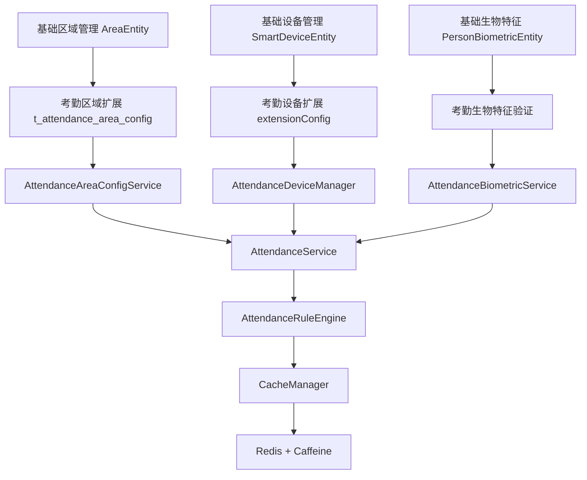

# Design Document

## Overview

本设计文档基于消费模块的成功架构模式，为考勤系统功能完善提供详细的技术设计方案。设计核心是通过扩展表机制严格遵循现有基础架构（SmartDeviceEntity、AreaEntity、PersonBiometricEntity），实现考勤功能的完整集成，确保与现有系统的完美融合。

## Steering Document Alignment

### Technical Standards (tech.md)

本设计严格遵循SmartAdmin v3项目的技术标准：
- **四层架构模式**：Controller→Service→Manager→DAO，严格遵循架构边界
- **Spring Boot 3.5.4**：使用最新稳定版本，确保技术栈一致性
- **依赖注入规范**：100%使用@Resource替代@Autowired
- **包名规范**：100%使用jakarta包名，符合Jakarta EE 9+标准
- **缓存架构**：采用Caffeine+Redis双级缓存，与消费模块保持一致

### Project Structure (structure.md)

实现遵循项目组织规范：
- **包结构**：`net.lab1024.sa.admin.module.attendance`
- **分层组织**：controller/service/manager/dao/entity/dto/vo/form
- **扩展表命名**：`t_attendance_*` 前缀，与主业务模块清晰分离
- **配置管理**：基于SpringBoot配置文件，支持多环境部署

## Code Reuse Analysis

### Existing Components to Leverage
- **AreaEntity & AreaService**: 继承基础区域管理，复用层级结构和权限验证
- **SmartDeviceEntity & SmartDeviceService**: 继承设备管理，通过extensionConfig存储考勤配置
- **PersonBiometricEntity & BiometricTemplateEntity**: 复用生物特征管理，无需重新设计
- **BaseService**: 继承基础服务类，复用通用CRUD操作和缓存管理

### Integration Points
- **权限系统**: 集成Sa-Token权限控制，使用@SaCheckPermission注解
- **缓存系统**: 集成现有CacheManager，支持事件驱动缓存失效
- **数据库**: 扩展现有MySQL数据库，通过外键关联保证数据一致性
- **通知服务**: 集成现有NotificationService，支持多渠道消息推送

## Architecture

### Modular Design Principles
- **Single File Responsibility**: 每个扩展表只负责特定的考勤功能领域
- **Component Isolation**: 通过扩展表实现功能隔离，避免修改基础架构
- **Service Layer Separation**: 扩展服务层调用基础服务，保持架构清晰
- **Utility Modularity**: 考勤特定的工具函数独立封装，便于复用



## Components and Interfaces

### Component 1: AttendanceAreaConfigService
- **Purpose:** 管理考勤区域扩展配置，继承基础区域功能
- **Interfaces:**
  - `getAreaAttendanceConfig(Long areaId)`: 获取区域考勤配置
  - `saveAreaConfig(AttendanceAreaConfigEntity config)`: 保存区域配置
  - `validateAreaPermission(Long employeeId, Long areaId)`: 验证区域权限
- **Dependencies:** AreaService, AreaCacheManager
- **Reuses:** BaseService基础服务模式，AreaService区域管理功能

### Component 2: AttendanceDeviceManager
- **Purpose:** 管理考勤设备扩展功能，基于基础设备管理
- **Interfaces:**
  - `registerAttendanceDevice(AttendanceDeviceRegisterRequest request)`: 注册考勤设备
  - `getAttendanceDeviceConfig(Long deviceId)`: 获取设备配置
  - `verifyEmployeeBiometric(Long employeeId, String biometricType)`: 验证生物特征
- **Dependencies:** SmartDeviceService, PersonBiometricService
- **Reuses:** SmartDeviceEntity设备管理，PersonBiometricEntity生物特征管理

### Component 3: AttendanceRuleEngine
- **Purpose:** 处理考勤业务规则，支持灵活的规则配置和应用
- **Interfaces:**
  - `processAttendanceRules(AttendanceRecordEntity record)`: 处理考勤记录规则
  - `validateRule(AttendanceRecordEntity record, AttendanceRuleEntity rule)`: 验证规则
  - `executeRuleAction(AttendanceRecordEntity record, AttendanceRuleEntity rule)`: 执行规则动作
- **Dependencies:** AttendanceRuleService, RuleCacheManager
- **Reuses:** 消费模块业务规则引擎模式

### Component 4: IntelligentSchedulingEngine
- **Purpose:** 智能排班引擎，基于历史数据和业务规则提供排班建议
- **Interfaces:**
  - `generateSchedule(ScheduleRequest request)`: 生成排班计划
  - `optimizeSchedule(ScheduleEntity schedule)`: 优化排班方案
  - `predictAttendance(SchedulePredictionRequest request)`: 预测考勤情况
- **Dependencies:** ScheduleService, StatisticsService
- **Reuses:** 消费模块智能调度算法

## Data Models

### Model 1: AttendanceAreaConfigEntity (考勤区域配置扩展表)
```java
@Entity
@Table(name = "t_attendance_area_config")
public class AttendanceAreaConfigEntity extends BaseEntity {
    private Long configId;           // 配置ID
    private Long areaId;             // 区域ID（关联t_area.area_id）

    // 考勤要求配置
    private Integer punchInRequired;    // 上班打卡要求
    private Integer punchOutRequired;   // 下班打卡要求

    // 验证方式配置
    private Integer gpsValidationEnabled; // GPS验证开关
    private Integer photoRequired;        // 拍照验证开关
    private Integer geofenceEnabled;     // 电子围栏开关
    private Integer geofenceRadius;       // 围栏半径（米）

    // 业务配置
    private String attendancePointIds;   // 考勤点ID列表（JSON格式）
    private String workTimeConfig;       // 工作时间配置（JSON格式）
    private String attendanceRuleIds;    // 考勤规则ID列表（JSON格式）
}
```

### Model 2: AttendanceRuleEntity (考勤规则配置表)
```java
@Entity
@Table(name = "t_attendance_rule")
public class AttendanceRuleEntity extends BaseEntity {
    private String ruleId;            // 规则ID
    private String ruleCode;          // 规则编码
    private String ruleName;          // 规则名称
    private String ruleType;          // 规则类型（LATE/EARLY/ABSENTEEISM/OVERTIME）

    // 规则配置
    private String conditionConfig;   // 触发条件（JSON格式）
    private String actionConfig;      // 处理动作（JSON格式）

    // 应用范围
    private String applyScope;        // 应用范围（ALL/DEPARTMENT/AREA/EMPLOYEE）
    private String scopeConfig;       // 范围配置（JSON格式）

    // 规则状态
    private Integer enabledFlag;      // 启用标记
    private Integer priority;         // 优先级
}
```

### Model 3: AttendanceDeviceExtension (考勤设备扩展配置)
```java
public class AttendanceDeviceExtension {
    // 设备功能配置
    private List<String> punchModes;           // 支持的打卡模式
    private Boolean gpsEnabled;               // GPS功能启用
    private Boolean photoEnabled;              // 拍照功能启用
    private Boolean faceRecognitionEnabled;   // 人脸识别启用
    private Boolean fingerprintEnabled;       // 指纹识别启用

    // 设备工作参数
    private Integer maxConcurrentUsers;       // 最大并发用户数
    private Integer heartbeatInterval;        // 心跳间隔（秒）
    private Integer dataRetentionDays;        // 数据保留天数

    // 网络配置
    private String serverAddress;            // 服务器地址
    private Integer serverPort;              // 服务器端口
    private String protocolType;             // 协议类型（TCP/UDP/HTTP）
}
```

## Error Handling

### Error Scenarios
1. **设备离线检测**: 设备超过指定时间未上报心跳
   - **Handling:** 自动标记设备为离线状态，发送告警通知
   - **User Impact:** 管理员看到设备状态异常，需及时处理

2. **生物特征验证失败**: 员工生物特征无法识别
   - **Handling:** 提供多次重试机会，记录失败日志，支持人工干预
   - **User Impact:** 员工无法正常打卡，需联系管理员处理

3. **规则冲突检测**: 多个规则同时触发产生冲突
   - **Handling:** 按优先级顺序执行规则，记录冲突日志，支持人工调整
   - **User Impact:** 可能影响考勤结果准确性，需管理员审核

4. **缓存一致性**: 缓存数据与数据库不一致
   - **Handling:** 实现缓存失效机制，支持手动刷新，定期校验
   - **User Impact:** 可能显示过期数据，通过自动刷新机制减少影响

## Testing Strategy

### Unit Testing
- **Service层测试**: 重点测试业务逻辑和规则引擎
- **Manager层测试**: 测试缓存管理和数据处理逻辑
- **Entity层测试**: 验证数据模型和业务方法
- **工具类测试**: 测试通用工具函数和转换器

### Integration Testing
- **API集成测试**: 测试Controller层的完整请求流程
- **数据库集成测试**: 测试扩展表与基础表的关联关系
- **缓存集成测试**: 测试多级缓存的读写一致性
- **外部服务集成测试**: 测试与通知服务、设备服务的集成

### End-to-End Testing
- **完整考勤流程测试**: 从员工打卡到统计报表的完整流程
- **异常处理流程测试**: 测试各种异常情况的处理流程
- **多设备并发测试**: 测试多设备同时使用的并发场景
- **性能压力测试**: 测试系统在高并发下的性能表现