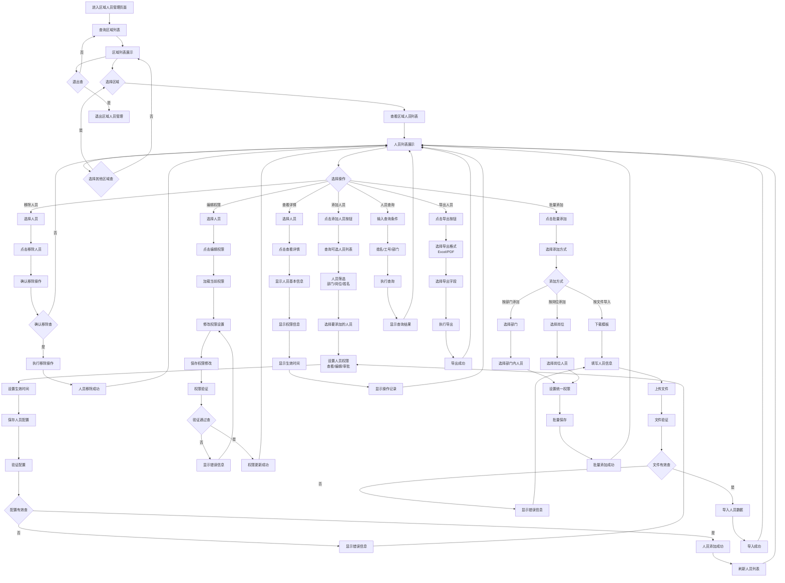
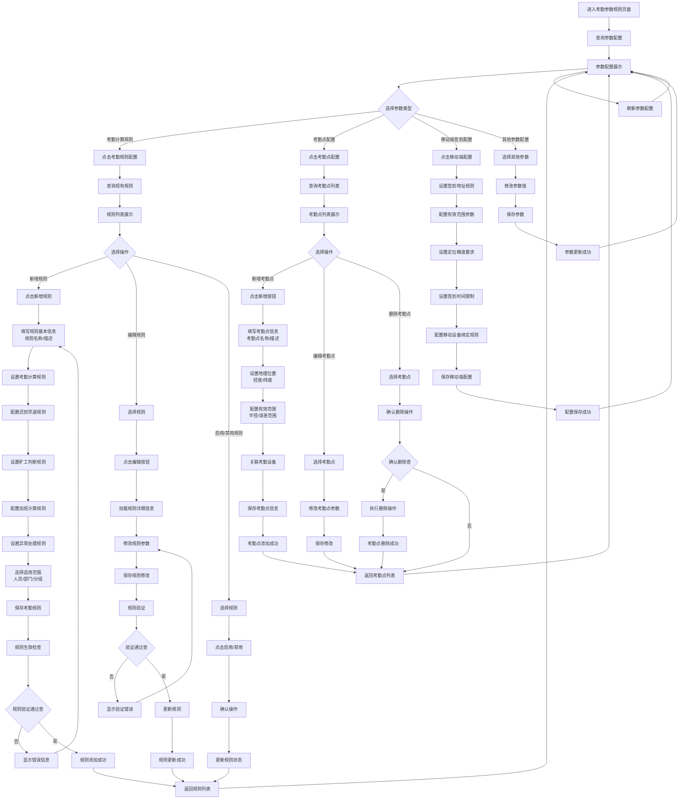
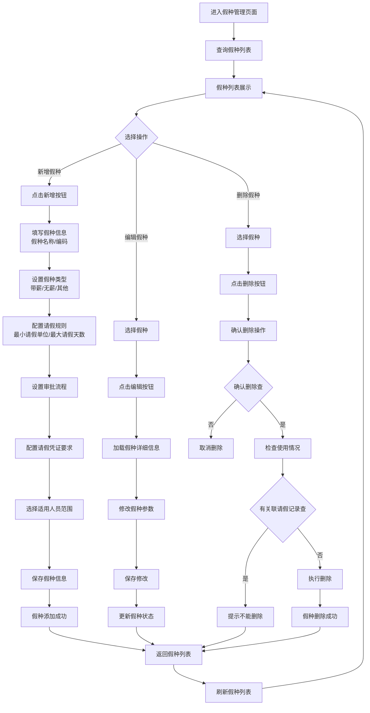
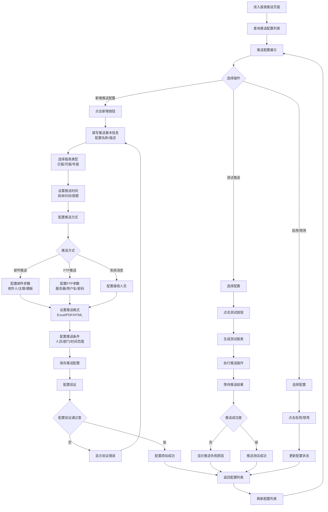
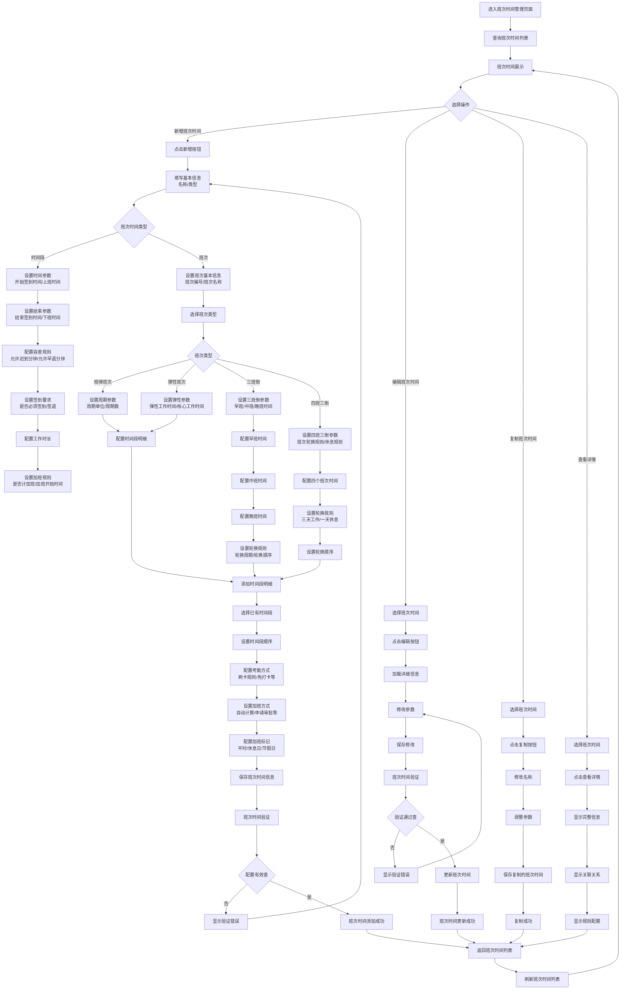
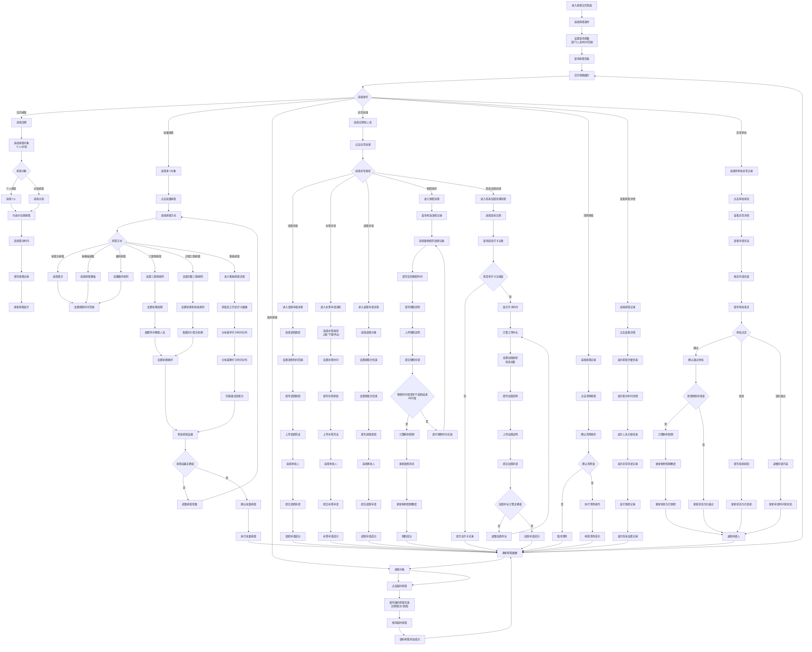
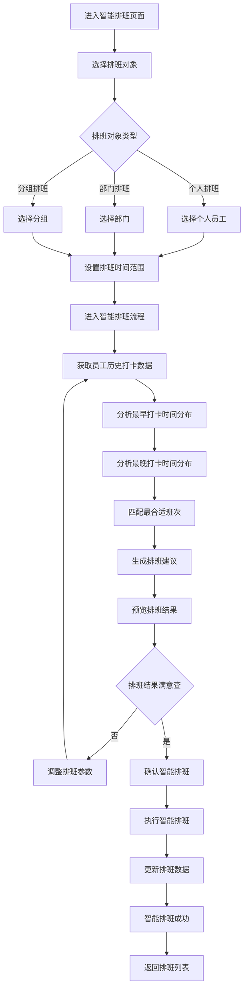
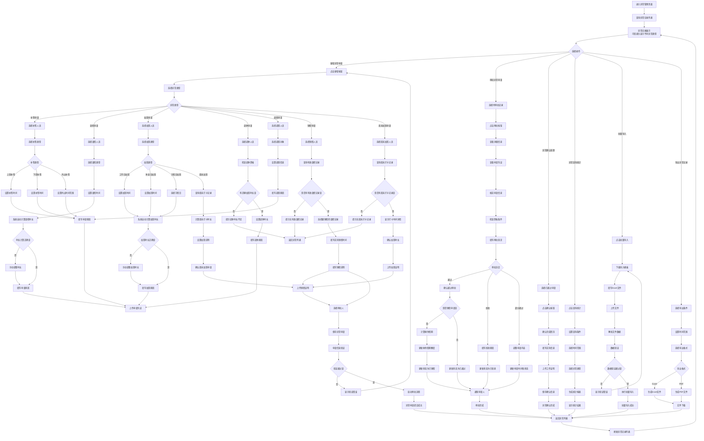
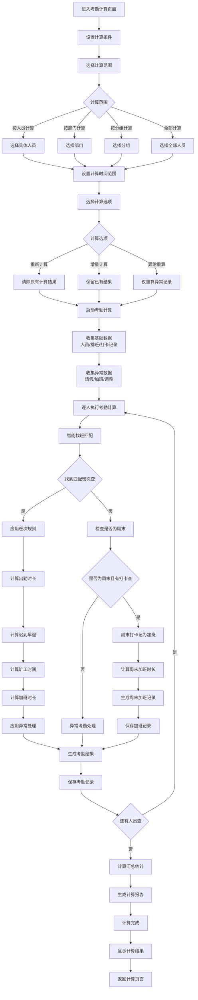
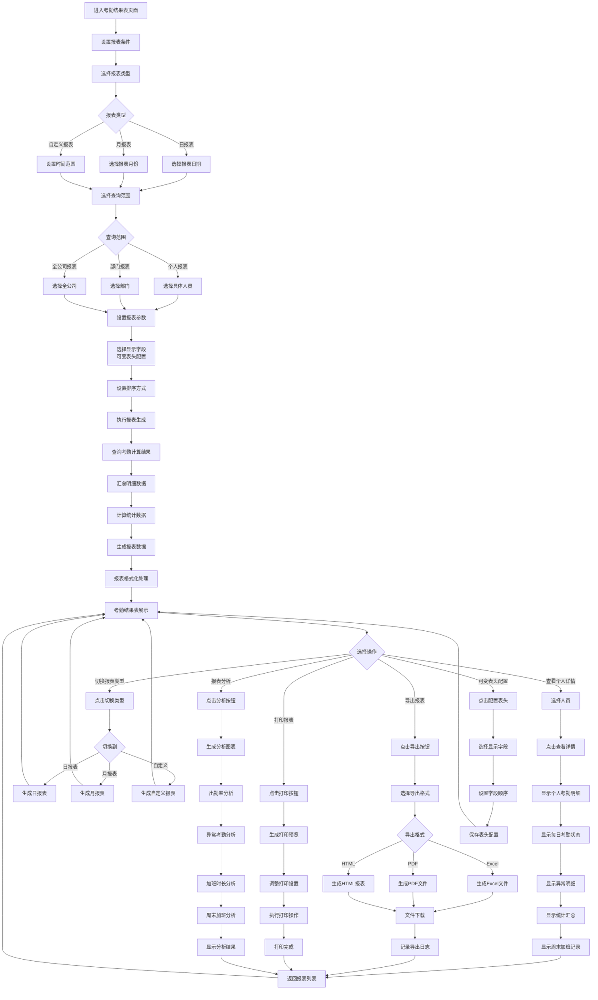

# 考勤系统 - 最终优化后的业务功能流程图（周末加班增强版）

## 1. 考勤管理模块流程图

### 1.1 区域人员管理流程图

## 2. 基础信息模块流程图

### 2.1 考勤参数规则流程图（整合考勤规则、考勤点管理、移动端签到地址）

### 2.2 假种管理流程图

### 2.3 报表推送配置流程图

## 3. 班次时间管理模块流程图（合并时间段和班次管理，增加三班倒和四班三倒支持）

### 3.1 班次时间管理流程图

## 4. 排班管理模块流程图（增加三班倒、四班三倒和智能排班功能，增加周末加班处理）

### 4.1 排班日历流程图（合并人员排班、分组排班、排班详情，增加异常操作、销假功能、智能排班和周末加班处理）

### 4.2 智能排班流程图（新增）

## 5. 异常管理模块流程图（统一管理所有考勤异常，增加销假功能）

### 5.1 异常管理流程图

## 6. 考勤汇总报表模块流程图

### 6.1 考勤计算流程图（增加智能找班匹配功能和周末打卡记为加班功能）

### 6.2 考勤结果表流程图（合并日报表和月报表）

