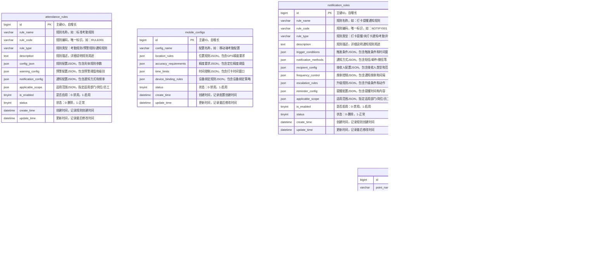
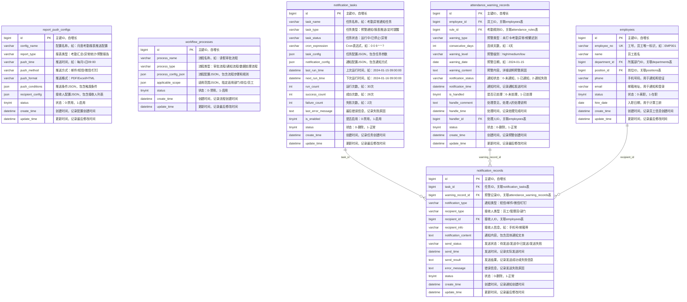

# 考勤系统数据库表结构实体关系图(ER图)设计

## 1. 系统概述

基于考勤系统的菜单结构和业务流程图，设计了一套完整的数据库表结构，支持以下核心功能：
- 考勤管理（设备区域关联、区域人员管理）
- 基础信息（考勤参数规则(考勤基础规则(部门切换时，需将老记录转换新部门的人员设置)、考勤点记录规则、移动端规则、预警规则设置(如联动摄像头/门禁设备做双重验证防止打卡走人的情况)、打卡提醒设置、多次未打卡或几天考勤异常的通知规则设置)、报表推送配置、流程管理）
- 班次时间管理（班次时间管理）
- 排班管理（排班日历、智能排班）
- 异常管理（假种管理、请假/加班/调班/销假/补签等统一管理）
- 考勤汇总报表（考勤计算、考勤结果表）

## 2. 数据库ER图（按业务模块拆分）

### 2.1 基础信息模块ER图


### 2.2 考勤管理模块ER图


### 2.3 考勤规则配置模块ER图



### 2.5 班次时间管理模块ER图


### 2.6 排班管理模块ER图


### 2.7 异常管理模块ER图


### 2.8 考勤数据模块ER图

```mermaid
erDiagram
    clock_records {
        bigint id PK "主键ID，自增长"
        bigint employee_id FK "员工ID，关联employees表"
        bigint device_id FK "设备ID，关联devices表"
        datetime clock_time "打卡时间，如：2024-01-15 09:00:00"
        varchar clock_type "打卡类型：上班/下班/外出/返回"
        varchar clock_location "打卡地点，如：一楼大厅"
        decimal longitude "经度坐标，用于GPS定位"
        decimal latitude "纬度坐标，用于GPS定位"
        varchar photo_url "打卡照片URL，用于验证和记录"
        tinyint status "状态：0-异常，1-正常"
        datetime create_time "创建时间，记录打卡记录创建时间"
        datetime update_time "更新时间，记录最后修改时间"
    }
    
    attendance_results {
        bigint id PK "主键ID，自增长"
        bigint employee_id FK "员工ID，关联employees表"
        date attendance_date "考勤日期，如：2024-01-15"
        bigint shift_id FK "班次ID，关联shifts表"
        datetime clock_in_time "上班打卡时间，如：09:00:00"
        datetime clock_out_time "下班打卡时间，如：18:00:00"
        decimal work_duration "工作时长(小时)，如：8.0小时"
        int late_minutes "迟到分钟数，如：15分钟"
        int early_minutes "早退分钟数，如：10分钟"
        int absent_minutes "旷工分钟数，如：480分钟"
        decimal overtime_minutes "加班分钟数，如：120.0分钟"
        decimal weekend_overtime "周末加班时长(小时)，如：4.0小时"
        varchar attendance_status "考勤状态：正常/迟到/早退/旷工/请假"
        int exception_count "异常次数，如：2次"
        tinyint status "状态：0-删除，1-正常"
        datetime create_time "创建时间，记录考勤结果创建时间"
        datetime update_time "更新时间，记录最后修改时间"
    }
    
    attendance_summaries {
        bigint id PK "主键ID，自增长"
        bigint employee_id FK "员工ID，关联employees表"
        varchar summary_month "汇总月份，如：2024-01"
        int work_days "应工作天数，如：22天"
        int actual_days "实际出勤天数，如：20天"
        int absent_days "旷工天数，如：2天"
        int late_count "迟到次数，如：3次"
        int early_count "早退次数，如：1次"
        decimal overtime_hours "加班时长(小时)，如：16.0小时"
        decimal weekend_overtime_hours "周末加班时长(小时)，如：8.0小时"
        decimal leave_days "请假天数，如：1.5天"
        decimal attendance_rate "出勤率，如：0.95表示95%"
        tinyint status "状态：0-删除，1-正常"
        datetime create_time "创建时间，记录汇总创建时间"
        datetime update_time "更新时间，记录最后修改时间"
    }
    
    attendance_warning_records {
        bigint id PK "主键ID，自增长"
        bigint employee_id FK "员工ID，关联employees表"
        bigint rule_id FK "考勤规则ID，关联attendance_rules表"
        varchar warning_type "预警类型：未打卡/考勤异常/频繁迟到"
        int consecutive_days "连续天数，如：3天"
        varchar warning_level "预警级别：high/medium/low"
        date warning_date "预警日期，如：2024-01-15"
        text warning_content "预警内容，详细说明预警原因"
        varchar notification_status "通知状态：0-未通知，1-已通知，2-通知失败"
        datetime notification_time "通知时间，记录通知发送时间"
        tinyint is_handled "是否已处理：0-未处理，1-已处理"
        text handle_comment "处理意见，处理人的处理说明"
        datetime handle_time "处理时间，记录处理完成时间"
        bigint handler_id FK "处理人ID，关联employees表"
        tinyint status "状态：0-删除，1-正常"
        datetime create_time "创建时间，记录预警创建时间"
        datetime update_time "更新时间，记录最后修改时间"
    }
    
    employees {
        bigint id PK "主键ID，自增长"
        varchar employee_no UK "工号，员工唯一标识，如：EMP001"
        varchar name "员工姓名"
        bigint department_id FK "所属部门ID，关联departments表"
        bigint position_id FK "岗位ID，关联positions表"
        varchar phone "手机号码，用于通知和验证"
        varchar email "邮箱地址，用于通知和登录"
        tinyint status "状态：0-离职，1-在职"
        date hire_date "入职日期，用于计算工龄"
        datetime create_time "创建时间，记录员工信息创建时间"
        datetime update_time "更新时间，记录最后修改时间"
    }
    
    devices {
        bigint id PK "主键ID，自增长"
        varchar device_no UK "设备编号，唯一标识，如：DEV001"
        varchar device_name "设备名称，如：一楼门禁机"
        varchar device_type "设备类型：考勤机/门禁/摄像头/移动端"
        varchar ip_address "设备IP地址，用于网络通信"
        varchar mac_address "设备MAC地址，用于设备识别"
        tinyint status "状态：0-离线，1-在线"
        varchar install_location "安装位置，如：一楼大厅"
        datetime create_time "创建时间，记录设备注册时间"
        datetime update_time "更新时间，记录最后修改时间"
    }
    
    shifts {
        bigint id PK "主键ID，自增长"
        varchar shift_name "班次名称，如：标准班、夜班、弹性班"
        varchar shift_code "班次编码，唯一标识，如：SHIFT001"
        varchar shift_type "班次类型：规律班次/弹性班次/三班倒/四班三倒"
        varchar cycle_unit "周期单位：天/周/月，用于轮班计算"
        int cycle_count "周期数，如：7天一个周期"
        decimal flexible_hours "弹性工作时间(小时)，如：2.0小时"
        decimal core_hours "核心工作时间(小时)，如：6.0小时"
        json shift_config_json "班次配置JSON，包含详细班次规则"
        tinyint status "状态：0-禁用，1-启用"
        datetime create_time "创建时间，记录班次创建时间"
        datetime update_time "更新时间，记录最后修改时间"
    }
    
    %% 考勤数据模块关联关系
    employees ||--o{ clock_records : "employee_id"
    employees ||--o{ attendance_results : "employee_id"
    employees ||--o{ attendance_summaries : "employee_id"
    employees ||--o{ attendance_warning_records : "employee_id"
    employees ||--o{ attendance_warning_records : "handler_id"
    devices ||--o{ clock_records : "device_id"
    shifts ||--o{ attendance_results : "shift_id"
    attendance_rules ||--o{ attendance_warning_records : "rule_id"
```



### 2.9 系统配置模块ER图



### 2.10 完整系统关联关系图


## 3. 表结构详细说明

### 3.1 基础信息模块

#### 3.1.1 部门表 (departments)
| 字段名 | 数据类型 | 长度 | 是否为空 | 默认值 | 说明 |
|--------|----------|------|----------|--------|------|
| id | bigint | - | NOT NULL | AUTO_INCREMENT | 主键ID |
| name | varchar | 100 | NOT NULL | - | 部门名称 |
| code | varchar | 50 | NOT NULL | - | 部门编码 |
| parent_id | bigint | - | NULL | - | 上级部门ID |
| level | int | - | NOT NULL | 1 | 部门层级 |
| status | tinyint | - | NOT NULL | 1 | 状态(0:禁用,1:启用) |
| create_time | datetime | - | NOT NULL | CURRENT_TIMESTAMP | 创建时间 |
| update_time | datetime | - | NOT NULL | CURRENT_TIMESTAMP | 更新时间 |

#### 3.1.2 人员表 (employees)
| 字段名 | 数据类型 | 长度 | 是否为空 | 默认值 | 说明 |
|--------|----------|------|----------|--------|------|
| id | bigint | - | NOT NULL | AUTO_INCREMENT | 主键ID |
| employee_no | varchar | 50 | NOT NULL | - | 工号(唯一) |
| name | varchar | 100 | NOT NULL | - | 姓名 |
| department_id | bigint | - | NOT NULL | - | 部门ID |
| position_id | bigint | - | NULL | - | 岗位ID |
| phone | varchar | 20 | NULL | - | 手机号 |
| email | varchar | 100 | NULL | - | 邮箱 |
| status | tinyint | - | NOT NULL | 1 | 状态(0:离职,1:在职) |
| hire_date | date | - | NULL | - | 入职日期 |
| create_time | datetime | - | NOT NULL | CURRENT_TIMESTAMP | 创建时间 |
| update_time | datetime | - | NOT NULL | CURRENT_TIMESTAMP | 更新时间 |

### 3.2 考勤管理模块

#### 3.2.1 设备表 (devices)
| 字段名 | 数据类型 | 长度 | 是否为空 | 默认值 | 说明 |
|--------|----------|------|----------|--------|------|
| id | bigint | - | NOT NULL | AUTO_INCREMENT | 主键ID |
| device_no | varchar | 50 | NOT NULL | - | 设备编号(唯一) |
| device_name | varchar | 100 | NOT NULL | - | 设备名称 |
| device_type | varchar | 50 | NOT NULL | - | 设备类型 |
| ip_address | varchar | 50 | NULL | - | IP地址 |
| mac_address | varchar | 50 | NULL | - | MAC地址 |
| status | tinyint | - | NOT NULL | 1 | 状态(0:离线,1:在线) |
| install_location | varchar | 200 | NULL | - | 安装位置 |
| create_time | datetime | - | NOT NULL | CURRENT_TIMESTAMP | 创建时间 |
| update_time | datetime | - | NOT NULL | CURRENT_TIMESTAMP | 更新时间 |

#### 3.2.2 区域表 (areas)
| 字段名 | 数据类型 | 长度 | 是否为空 | 默认值 | 说明 |
|--------|----------|------|----------|--------|------|
| id | bigint | - | NOT NULL | AUTO_INCREMENT | 主键ID |
| area_name | varchar | 100 | NOT NULL | - | 区域名称 |
| area_code | varchar | 50 | NOT NULL | - | 区域编码 |
| description | text | - | NULL | - | 区域描述 |
| longitude | decimal | 10,6 | NULL | - | 经度 |
| latitude | decimal | 10,6 | NULL | - | 纬度 |
| radius | int | - | NOT NULL | 100 | 有效半径(米) |
| status | tinyint | - | NOT NULL | 1 | 状态(0:禁用,1:启用) |
| create_time | datetime | - | NOT NULL | CURRENT_TIMESTAMP | 创建时间 |
| update_time | datetime | - | NOT NULL | CURRENT_TIMESTAMP | 更新时间 |

### 3.3 班次时间管理模块

#### 3.3.1 时间段表 (time_periods)
| 字段名 | 数据类型 | 长度 | 是否为空 | 默认值 | 说明 |
|--------|----------|------|----------|--------|------|
| id | bigint | - | NOT NULL | AUTO_INCREMENT | 主键ID |
| period_name | varchar | 100 | NOT NULL | - | 时间段名称 |
| period_code | varchar | 50 | NOT NULL | - | 时间段编码 |
| start_time | time | - | NOT NULL | - | 开始时间 |
| end_time | time | - | NOT NULL | - | 结束时间 |
| late_tolerance | int | - | NOT NULL | 0 | 迟到容忍分钟数 |
| early_tolerance | int | - | NOT NULL | 0 | 早退容忍分钟数 |
| must_clock_in | tinyint | - | NOT NULL | 1 | 是否必须签到 |
| must_clock_out | tinyint | - | NOT NULL | 1 | 是否必须签退 |
| work_duration | decimal | 5,2 | NOT NULL | - | 工作时长(小时) |
| overtime_rules | json | - | NULL | - | 加班规则配置 |
| status | tinyint | - | NOT NULL | 1 | 状态(0:禁用,1:启用) |
| create_time | datetime | - | NOT NULL | CURRENT_TIMESTAMP | 创建时间 |
| update_time | datetime | - | NOT NULL | CURRENT_TIMESTAMP | 更新时间 |

#### 3.3.2 班次表 (shifts)
| 字段名 | 数据类型 | 长度 | 是否为空 | 默认值 | 说明 |
|--------|----------|------|----------|--------|------|
| id | bigint | - | NOT NULL | AUTO_INCREMENT | 主键ID |
| shift_name | varchar | 100 | NOT NULL | - | 班次名称 |
| shift_code | varchar | 50 | NOT NULL | - | 班次编码 |
| shift_type | varchar | 50 | NOT NULL | - | 班次类型(规律班次/弹性班次/三班倒/四班三倒) |
| cycle_unit | varchar | 20 | NULL | - | 周期单位(天/周/月) |
| cycle_count | int | - | NULL | - | 周期数 |
| flexible_hours | decimal | 5,2 | NULL | - | 弹性工作时间 |
| core_hours | decimal | 5,2 | NULL | - | 核心工作时间 |
| shift_config_json | json | - | NULL | - | 班次配置JSON |
| status | tinyint | - | NOT NULL | 1 | 状态(0:禁用,1:启用) |
| create_time | datetime | - | NOT NULL | CURRENT_TIMESTAMP | 创建时间 |
| update_time | datetime | - | NOT NULL | CURRENT_TIMESTAMP | 更新时间 |

### 3.8 排班管理模块

#### 3.8.1 临时排班表 (schedule_overrides)
| 字段名 | 数据类型 | 长度 | 是否为空 | 默认值 | 说明 |
|--------|----------|------|----------|--------|------|
| id | bigint | - | NOT NULL | AUTO_INCREMENT | 主键ID |
| employee_id | bigint | - | NOT NULL | - | 员工ID |
| schedule_date | date | - | NOT NULL | - | 生效日期 |
| shift_id | bigint | - | NULL | - | 班次ID(整班覆盖时使用) |
| period_id | bigint | - | NULL | - | 时间段ID(引用time_periods) |
| start_time | time | - | NULL | - | 自定义开始时间(不引用period时必填) |
| end_time | time | - | NULL | - | 自定义结束时间(不引用period时必填) |
| source | varchar | 20 | NOT NULL | 'manual' | 来源(manual/system/api) |
| priority | int | - | NOT NULL | 10 | 覆盖优先级(大优先) |
| reason | text | - | NULL | - | 临时排班原因 |
| status | tinyint | - | NOT NULL | 1 | 状态(0:取消,1:生效) |
| create_time | datetime | - | NOT NULL | CURRENT_TIMESTAMP | 创建时间 |
| update_time | datetime | - | NOT NULL | CURRENT_TIMESTAMP | 更新时间 |

说明：
- 当同时存在模板排班、正常排班和临时排班时，按priority进行决策，默认临时排班优先于正常排班与模板排班。
- `shift_id` 与 (`period_id` 或 `start_time`/`end_time`) 至少有一类应被设置，用于整班或部分时段覆盖。
- 支持同一日期多条覆盖记录，按优先级与时间段拆分合并。

### 3.4 异常管理模块

#### 3.4.1 假种配置表 (leave_types)
| 字段名 | 数据类型 | 长度 | 是否为空 | 默认值 | 说明 |
|--------|----------|------|----------|--------|------|
| id | bigint | - | NOT NULL | AUTO_INCREMENT | 主键ID |
| leave_type_code | varchar | 50 | NOT NULL | - | 假种编码(唯一) |
| leave_type_name | varchar | 100 | NOT NULL | - | 假种名称 |
| leave_category | varchar | 50 | NOT NULL | - | 假种分类(法定假期/福利假期/病假/事假) |
| description | text | - | NULL | - | 假种描述 |
| max_days_per_year | decimal | 5,2 | NULL | - | 每年最大天数 |
| max_days_per_application | decimal | 5,2 | NULL | - | 每次申请最大天数 |
| require_certificate | tinyint | - | NOT NULL | 0 | 是否需要证明(0:不需要,1:需要) |
| certificate_types | varchar | 200 | NULL | - | 证明类型(病假条/事假证明等) |
| deduct_salary | tinyint | - | NOT NULL | 0 | 是否扣工资(0:不扣,1:扣) |
| salary_deduction_rate | decimal | 5,2 | NULL | - | 扣工资比例 |
| approval_workflow | json | - | NULL | - | 审批流程配置JSON |
| applicable_scope | json | - | NULL | - | 适用范围JSON |
| is_enabled | tinyint | - | NOT NULL | 1 | 是否启用(0:禁用,1:启用) |
| status | tinyint | - | NOT NULL | 1 | 状态(0:删除,1:正常) |
| create_time | datetime | - | NOT NULL | CURRENT_TIMESTAMP | 创建时间 |
| update_time | datetime | - | NOT NULL | CURRENT_TIMESTAMP | 更新时间 |

**approval_workflow JSON结构说明：**
```json
{
  "workflow_name": "病假审批流程",
  "approval_levels": [
    {
      "level": 1,
      "approver_type": "direct_manager",
      "approver_role": "直属领导",
      "required": true,
      "time_limit_hours": 24
    },
    {
      "level": 2,
      "approver_type": "hr_manager",
      "approver_role": "HR经理",
      "required": true,
      "time_limit_hours": 48,
      "condition": "duration >= 3"
    }
  ],
  "escalation_rules": [
    {
      "condition": "approval_timeout",
      "action": "escalate_to_next_level",
      "timeout_hours": 24
    }
  ]
}
```

**applicable_scope JSON结构说明：**
```json
{
  "departments": [1, 2, 3],           // 适用部门ID列表
  "positions": [10, 20, 30],          // 适用岗位ID列表
  "employee_levels": ["manager", "staff"], // 适用员工级别
  "hire_duration_months": 6,          // 入职满多少月才能申请
  "exclude_employees": [1001, 1002]   // 排除的员工ID列表
}
```

#### 3.4.2 异常申请表 (exception_applications)
| 字段名 | 数据类型 | 长度 | 是否为空 | 默认值 | 说明 |
|--------|----------|------|----------|--------|------|
| id | bigint | - | NOT NULL | AUTO_INCREMENT | 主键ID |
| employee_id | bigint | - | NOT NULL | - | 员工ID |
| leave_type_id | bigint | - | NULL | - | 假种ID(请假时使用) |
| application_type | varchar | 50 | NOT NULL | - | 申请类型(请假/补签/加班/调班/销假/周末加班) |
| application_date | date | - | NOT NULL | - | 申请日期 |
| start_date | date | - | NULL | - | 开始日期 |
| end_date | date | - | NULL | - | 结束日期 |
| start_time | time | - | NULL | - | 开始时间 |
| end_time | time | - | NULL | - | 结束时间 |
| duration | decimal | 5,2 | NULL | - | 时长 |
| reason | text | - | NULL | - | 申请原因 |
| certificate_url | varchar | 500 | NULL | - | 凭证文件URL |
| approval_status | tinyint | - | NOT NULL | 0 | 审批状态(0:待审批,1:已通过,2:已拒绝) |
| approver_id | bigint | - | NULL | - | 审批人ID |
| approval_time | datetime | - | NULL | - | 审批时间 |
| approval_comment | text | - | NULL | - | 审批意见 |
| leave_type | varchar | 50 | NULL | - | 假种类型(病假/事假/年假/调休等) |
| original_application_id | bigint | - | NULL | - | 原申请ID(销假时关联原请假申请) |
| overtime_type | varchar | 50 | NULL | - | 加班类型(平时加班/周末加班/节假日加班) |
| clock_in_time | datetime | - | NULL | - | 打卡时间(补签时使用) |
| clock_out_time | datetime | - | NULL | - | 打卡时间(补签时使用) |
| work_duration | decimal | 5,2 | NULL | - | 工作时长(加班时使用) |
| remaining_days | decimal | 5,2 | NULL | - | 剩余天数(销假时使用) |
| status | tinyint | - | NOT NULL | 1 | 状态(0:删除,1:正常) |
| create_time | datetime | - | NOT NULL | CURRENT_TIMESTAMP | 创建时间 |
| update_time | datetime | - | NOT NULL | CURRENT_TIMESTAMP | 更新时间 |

#### 3.4.3 异常审批表 (exception_approvals)
| 字段名 | 数据类型 | 长度 | 是否为空 | 默认值 | 说明 |
|--------|----------|------|----------|--------|------|
| id | bigint | - | NOT NULL | AUTO_INCREMENT | 主键ID |
| application_id | bigint | - | NOT NULL | - | 申请ID |
| approver_id | bigint | - | NOT NULL | - | 审批人ID |
| approval_level | int | - | NOT NULL | 1 | 审批级别 |
| approval_result | varchar | 20 | NOT NULL | - | 审批结果(通过/拒绝) |
| approval_comment | text | - | NULL | - | 审批意见 |
| approval_time | datetime | - | NOT NULL | - | 审批时间 |
| status | tinyint | - | NOT NULL | 1 | 状态(0:删除,1:正常) |
| create_time | datetime | - | NOT NULL | CURRENT_TIMESTAMP | 创建时间 |
| update_time | datetime | - | NOT NULL | CURRENT_TIMESTAMP | 更新时间 |
| exceptionType | varchar | 50 | NULL | - | 异常类型(冗余字段，便于查询) |

### 3.5 考勤规则配置模块

#### 3.5.1 预警规则表 (warning_rules)
| 字段名 | 数据类型 | 长度 | 是否为空 | 默认值 | 说明 |
|--------|----------|------|----------|--------|------|
| id | bigint | - | NOT NULL | AUTO_INCREMENT | 主键ID |
| rule_name | varchar | 100 | NOT NULL | - | 规则名称 |
| rule_code | varchar | 50 | NOT NULL | - | 规则编码 |
| rule_type | varchar | 50 | NOT NULL | - | 规则类型(设备联动/双重验证/异常检测) |
| description | text | - | NULL | - | 规则描述 |
| device_linkage_config | json | - | NULL | - | 设备联动配置JSON |
| verification_rules | json | - | NULL | - | 验证规则配置JSON |
| trigger_conditions | json | - | NULL | - | 触发条件配置JSON |
| handling_rules | json | - | NULL | - | 处理规则配置JSON |
| applicable_scope | json | - | NULL | - | 适用范围JSON |
| is_enabled | tinyint | - | NOT NULL | 1 | 是否启用(0:禁用,1:启用) |
| status | tinyint | - | NOT NULL | 1 | 状态(0:删除,1:正常) |
| create_time | datetime | - | NOT NULL | CURRENT_TIMESTAMP | 创建时间 |
| update_time | datetime | - | NOT NULL | CURRENT_TIMESTAMP | 更新时间 |

**device_linkage_config JSON结构说明：**
```json
{
  "linkage_type": "camera_access_control",
  "devices": [
    {
      "device_id": 1001,
      "device_type": "camera",
      "linkage_role": "primary_verification",
      "verification_method": "face_recognition"
    },
    {
      "device_id": 1002,
      "device_type": "access_control",
      "linkage_role": "secondary_verification",
      "verification_method": "card_swipe"
    }
  ],
  "verification_sequence": "sequential",
  "timeout_seconds": 30,
  "retry_attempts": 3
}
```

**verification_rules JSON结构说明：**
```json
{
  "verification_methods": [
    {
      "method": "face_recognition",
      "confidence_threshold": 0.85,
      "required": true
    },
    {
      "method": "card_swipe",
      "required": true
    },
    {
      "method": "password",
      "required": false
    }
  ],
  "verification_logic": "all_required",
  "failure_handling": "block_clock_in"
}
```

#### 3.5.2 通知规则设置表 (notification_rules)
| 字段名 | 数据类型 | 长度 | 是否为空 | 默认值 | 说明 |
|--------|----------|------|----------|--------|------|
| id | bigint | - | NOT NULL | AUTO_INCREMENT | 主键ID |
| rule_name | varchar | 100 | NOT NULL | - | 规则名称 |
| rule_code | varchar | 50 | NOT NULL | - | 规则编码 |
| rule_type | varchar | 50 | NOT NULL | - | 规则类型(打卡提醒/未打卡通知/考勤异常通知/通用通知) |
| description | text | - | NULL | - | 规则描述 |
| trigger_conditions | json | - | NULL | - | 触发条件配置JSON |
| notification_methods | json | - | NULL | - | 通知方式配置JSON |
| recipient_config | json | - | NULL | - | 接收人配置JSON |
| frequency_control | json | - | NULL | - | 频率控制配置JSON |
| escalation_rules | json | - | NULL | - | 升级规则配置JSON |
| reminder_config | json | - | NULL | - | 打卡提醒配置JSON |
| applicable_scope | json | - | NULL | - | 适用范围JSON |
| is_enabled | tinyint | - | NOT NULL | 1 | 是否启用(0:禁用,1:启用) |
| status | tinyint | - | NOT NULL | 1 | 状态(0:删除,1:正常) |
| create_time | datetime | - | NOT NULL | CURRENT_TIMESTAMP | 创建时间 |
| update_time | datetime | - | NOT NULL | CURRENT_TIMESTAMP | 更新时间 |

**trigger_conditions JSON结构说明：**
```json
{
  "clock_reminder_rules": [
    {
      "reminder_type": "clock_in",
      "time_offset_minutes": -30,
      "description": "上班前30分钟提醒"
    },
    {
      "reminder_type": "clock_in",
      "time_offset_minutes": -10,
      "description": "上班前10分钟提醒"
    },
    {
      "reminder_type": "clock_out",
      "time_offset_minutes": 0,
      "description": "下班时间提醒"
    }
  ],
  "no_clock_in_rules": [
    {
      "condition": "consecutive_days >= 1",
      "description": "连续1天未打卡"
    },
    {
      "condition": "consecutive_days >= 3",
      "description": "连续3天未打卡"
    }
  ],
  "attendance_abnormal_rules": [
    {
      "condition": "late_count >= 3 AND time_range = '7_days'",
      "description": "7天内迟到3次"
    },
    {
      "condition": "absent_days >= 2 AND time_range = '7_days'",
      "description": "7天内旷工2天"
    }
  ],
  "time_windows": {
    "check_time": "09:00",
    "notification_delay_minutes": 30,
    "workday_only": true,
    "exclude_holidays": true
  }
}
```

**notification_methods JSON结构说明：**
```json
{
  "methods": [
    {
      "method": "sms",
      "enabled": true,
      "priority": "high",
      "template": "考勤异常提醒：{employee_name}，您已连续{days}天未打卡，请及时处理。"
    },
    {
      "method": "wechat",
      "enabled": true,
      "priority": "high",
      "template": "考勤异常通知"
    },
    {
      "method": "email",
      "enabled": true,
      "priority": "medium",
      "template": "考勤异常报告"
    }
  ],
  "message_customization": {
    "include_employee_info": true,
    "include_attendance_summary": true,
    "include_action_links": true
  }
}
```

**frequency_control JSON结构说明：**
```json
{
  "max_notifications_per_day": 3,
  "min_interval_minutes": 60,
  "escalation_schedule": [
    {
      "delay_hours": 24,
      "escalation_level": 1,
      "description": "24小时后升级通知"
    },
    {
      "delay_hours": 72,
      "escalation_level": 2,
      "description": "72小时后升级通知"
    }
  ],
  "quiet_hours": "22:00-08:00",
  "weekend_notifications": false
}
```

**reminder_config JSON结构说明：**
```json
{
  "reminder_settings": {
    "enable_clock_in_reminder": true,
    "enable_clock_out_reminder": true,
    "enable_break_reminder": false
  },
  "reminder_times": {
    "clock_in_reminders": [
      {
        "time_offset_minutes": -30,
        "description": "上班前30分钟提醒",
        "enabled": true
      },
      {
        "time_offset_minutes": -10,
        "description": "上班前10分钟提醒",
        "enabled": true
      }
    ],
    "clock_out_reminders": [
      {
        "time_offset_minutes": 0,
        "description": "下班时间提醒",
        "enabled": true
      },
      {
        "time_offset_minutes": 30,
        "description": "下班后30分钟提醒",
        "enabled": false
      }
    ]
  },
  "message_templates": {
    "clock_in": "提醒：您还有{minutes}分钟就要上班了，请及时打卡！",
    "clock_out": "提醒：下班时间到了，请记得打卡下班！",
    "break": "提醒：休息时间结束，请及时返回工作岗位！"
  },
  "reminder_frequency": {
    "max_reminders_per_day": 3,
    "min_interval_minutes": 30,
    "skip_weekends": true,
    "skip_holidays": true
  }
}
```

#### 3.5.3 考勤规则表 (attendance_rules)
| 字段名 | 数据类型 | 长度 | 是否为空 | 默认值 | 说明 |
|--------|----------|------|----------|--------|------|
| id | bigint | - | NOT NULL | AUTO_INCREMENT | 主键ID |
| rule_name | varchar | 100 | NOT NULL | - | 规则名称 |
| rule_code | varchar | 50 | NOT NULL | - | 规则编码 |
| rule_type | varchar | 50 | NOT NULL | - | 规则类型(考勤规则/预警规则) |
| description | text | - | NULL | - | 规则描述 |
| config_json | json | - | NULL | - | 规则配置JSON |
| warning_config | json | - | NULL | - | 预警配置JSON(包含预警类型、连续天数阈值、预警级别等) |
| notification_config | json | - | NULL | - | 通知配置JSON |
| applicable_scope | json | - | NULL | - | 适用范围JSON |
| is_enabled | tinyint | - | NOT NULL | 1 | 是否启用(0:禁用,1:启用) |
| status | tinyint | - | NOT NULL | 1 | 状态(0:删除,1:正常) |
| create_time | datetime | - | NOT NULL | CURRENT_TIMESTAMP | 创建时间 |
| update_time | datetime | - | NOT NULL | CURRENT_TIMESTAMP | 更新时间 |

**warning_config JSON结构说明：**
```json
{
  "warning_types": [
    {
      "type": "no_clock_in",           // 预警类型：未打卡
      "threshold": 3,                  // 阈值：连续3次未打卡
      "level": "high",                 // 预警级别：high/medium/low
      "description": "连续3次未打卡预警"
    },
    {
      "type": "attendance_abnormal",   // 预警类型：考勤异常
      "threshold": 5,                  // 阈值：连续5天考勤异常
      "level": "high",                 // 预警级别
      "description": "连续5天考勤异常预警"
    },
    {
      "type": "late_frequent",         // 预警类型：频繁迟到
      "threshold": 7,                  // 阈值：7天内迟到3次
      "level": "medium",               // 预警级别
      "description": "频繁迟到预警"
    }
  ],
  "escalation_rules": [                // 升级规则
    {
      "condition": "consecutive_days >= 3",
      "action": "notify_manager",
      "description": "连续3天异常通知直属领导"
    },
    {
      "condition": "consecutive_days >= 7",
      "action": "notify_hr",
      "description": "连续7天异常通知HR"
    }
  ]
}
```

**notification_config JSON结构说明：**
```json
{
  "notification_rules": [
    {
      "rule_name": "未打卡通知规则",
      "trigger_conditions": {
        "no_clock_in_count": 1,        // 未打卡次数阈值
        "consecutive_days": 1,         // 连续天数阈值
        "time_range": "09:00-18:00"    // 时间范围
      },
      "notification_methods": [
        {
          "method": "sms",             // 通知方式：短信
          "template": "您今日未打卡，请及时处理",
          "priority": "high"
        },
        {
          "method": "email",           // 通知方式：邮件
          "template": "考勤异常提醒邮件",
          "priority": "medium"
        }
      ],
      "recipients": [
        {
          "type": "employee",          // 接收人类型：员工本人
          "required": true
        },
        {
          "type": "manager",           // 接收人类型：直属领导
          "required": true
        }
      ],
      "frequency": {
        "max_per_day": 3,              // 每天最大通知次数
        "interval_minutes": 60,        // 通知间隔(分钟)
        "escalation_hours": 24         // 升级通知时间(小时)
      }
    },
    {
      "rule_name": "考勤异常通知规则",
      "trigger_conditions": {
        "abnormal_days": 3,            // 异常天数阈值
        "consecutive_days": 2,         // 连续异常天数
        "abnormal_types": ["late", "early", "absent"] // 异常类型
      },
      "notification_methods": [
        {
          "method": "wechat",          // 通知方式：微信
          "template": "考勤异常提醒",
          "priority": "high"
        },
        {
          "method": "dingtalk",        // 通知方式：钉钉
          "template": "考勤异常通知",
          "priority": "high"
        }
      ],
      "recipients": [
        {
          "type": "employee",
          "required": true
        },
        {
          "type": "manager",
          "required": true
        },
        {
          "type": "hr",
          "required": false
        }
      ],
      "frequency": {
        "max_per_day": 2,
        "interval_minutes": 120,
        "escalation_hours": 48
      }
    }
  ],
  "global_settings": {
    "enable_notifications": true,      // 是否启用通知
    "quiet_hours": "22:00-08:00",      // 免打扰时间
    "timezone": "Asia/Shanghai",        // 时区
    "retry_attempts": 3,               // 重试次数
    "retry_interval": 300              // 重试间隔(秒)
  }
}
```

### 3.6 考勤数据模块

#### 3.6.1 打卡记录表 (clock_records)
| 字段名 | 数据类型 | 长度 | 是否为空 | 默认值 | 说明 |
|--------|----------|------|----------|--------|------|
| id | bigint | - | NOT NULL | AUTO_INCREMENT | 主键ID |
| employee_id | bigint | - | NOT NULL | - | 员工ID |
| device_id | bigint | - | NULL | - | 设备ID |
| clock_time | datetime | - | NOT NULL | - | 打卡时间 |
| clock_type | varchar | 20 | NOT NULL | - | 打卡类型(上班/下班/外出) |
| clock_location | varchar | 200 | NULL | - | 打卡地点 |
| longitude | decimal | 10,6 | NULL | - | 经度 |
| latitude | decimal | 10,6 | NULL | - | 纬度 |
| photo_url | varchar | 500 | NULL | - | 打卡照片URL |
| status | tinyint | - | NOT NULL | 1 | 状态(0:异常,1:正常) |
| create_time | datetime | - | NOT NULL | CURRENT_TIMESTAMP | 创建时间 |
| update_time | datetime | - | NOT NULL | CURRENT_TIMESTAMP | 更新时间 |

#### 3.5.2 考勤计算结果表 (attendance_results)
| 字段名 | 数据类型 | 长度 | 是否为空 | 默认值 | 说明 |
|--------|----------|------|----------|--------|------|
| id | bigint | - | NOT NULL | AUTO_INCREMENT | 主键ID |
| employee_id | bigint | - | NOT NULL | - | 员工ID |
| attendance_date | date | - | NOT NULL | - | 考勤日期 |
| shift_id | bigint | - | NULL | - | 班次ID |
| clock_in_time | datetime | - | NULL | - | 上班打卡时间 |
| clock_out_time | datetime | - | NULL | - | 下班打卡时间 |
| work_duration | decimal | 5,2 | NULL | - | 工作时长(小时) |
| late_minutes | int | - | NOT NULL | 0 | 迟到分钟数 |
| early_minutes | int | - | NOT NULL | 0 | 早退分钟数 |
| absent_minutes | int | - | NOT NULL | 0 | 旷工分钟数 |
| overtime_minutes | decimal | 5,2 | NOT NULL | 0 | 加班分钟数 |
| weekend_overtime | decimal | 5,2 | NOT NULL | 0 | 周末加班时长 |
| attendance_status | varchar | 20 | NOT NULL | - | 考勤状态(正常/迟到/早退/旷工/请假) |
| exception_count | int | - | NOT NULL | 0 | 异常次数 |
| status | tinyint | - | NOT NULL | 1 | 状态(0:删除,1:正常) |
| create_time | datetime | - | NOT NULL | CURRENT_TIMESTAMP | 创建时间 |
| update_time | datetime | - | NOT NULL | CURRENT_TIMESTAMP | 更新时间 |

#### 3.6.3 考勤预警记录表 (attendance_warning_records)
| 字段名 | 数据类型 | 长度 | 是否为空 | 默认值 | 说明 |
|--------|----------|------|----------|--------|------|
| id | bigint | - | NOT NULL | AUTO_INCREMENT | 主键ID |
| employee_id | bigint | - | NOT NULL | - | 员工ID |
| rule_id | bigint | - | NOT NULL | - | 考勤规则ID |
| warning_type | varchar | 50 | NOT NULL | - | 预警类型 |
| consecutive_days | int | - | NOT NULL | - | 连续天数 |
| warning_level | varchar | 20 | NOT NULL | - | 预警级别 |
| warning_date | date | - | NOT NULL | - | 预警日期 |
| warning_content | text | - | NULL | - | 预警内容 |
| notification_status | varchar | 20 | NOT NULL | 0 | 通知状态(0:未通知,1:已通知,2:通知失败) |
| notification_time | datetime | - | NULL | - | 通知时间 |
| is_handled | tinyint | - | NOT NULL | 0 | 是否已处理(0:未处理,1:已处理) |
| handle_comment | text | - | NULL | - | 处理意见 |
| handle_time | datetime | - | NULL | - | 处理时间 |
| handler_id | bigint | - | NULL | - | 处理人ID |
| status | tinyint | - | NOT NULL | 1 | 状态(0:删除,1:正常) |
| create_time | datetime | - | NOT NULL | CURRENT_TIMESTAMP | 创建时间 |
| update_time | datetime | - | NOT NULL | CURRENT_TIMESTAMP | 更新时间 |

### 3.7 系统配置模块

#### 3.7.1 定时任务表 (notification_tasks)
| 字段名 | 数据类型 | 长度 | 是否为空 | 默认值 | 说明 |
|--------|----------|------|----------|--------|------|
| id | bigint | - | NOT NULL | AUTO_INCREMENT | 主键ID |
| task_name | varchar | 100 | NOT NULL | - | 任务名称 |
| task_type | varchar | 50 | NOT NULL | - | 任务类型(预警通知/报表推送) |
| task_status | varchar | 20 | NOT NULL | - | 任务状态(运行中/已停止/异常) |
| cron_expression | varchar | 100 | NOT NULL | - | Cron表达式 |
| task_config | json | - | NULL | - | 任务配置JSON |
| notification_config | json | - | NULL | - | 通知配置JSON |
| last_run_time | datetime | - | NULL | - | 上次运行时间 |
| next_run_time | datetime | - | NULL | - | 下次运行时间 |
| run_count | int | - | NOT NULL | 0 | 运行次数 |
| success_count | int | - | NOT NULL | 0 | 成功次数 |
| failure_count | int | - | NOT NULL | 0 | 失败次数 |
| last_error_message | text | - | NULL | - | 最后错误信息 |
| is_enabled | tinyint | - | NOT NULL | 1 | 是否启用(0:禁用,1:启用) |
| status | tinyint | - | NOT NULL | 1 | 状态(0:删除,1:正常) |
| create_time | datetime | - | NOT NULL | CURRENT_TIMESTAMP | 创建时间 |
| update_time | datetime | - | NOT NULL | CURRENT_TIMESTAMP | 更新时间 |

#### 3.7.2 通知记录表 (notification_records)
| 字段名 | 数据类型 | 长度 | 是否为空 | 默认值 | 说明 |
|--------|----------|------|----------|--------|------|
| id | bigint | - | NOT NULL | AUTO_INCREMENT | 主键ID |
| task_id | bigint | - | NOT NULL | - | 任务ID |
| warning_record_id | bigint | - | NULL | - | 预警记录ID |
| notification_type | varchar | 50 | NOT NULL | - | 通知类型(短信/邮件/微信/钉钉) |
| recipient_type | varchar | 20 | NOT NULL | - | 接收人类型(员工/管理员/部门) |
| recipient_id | bigint | - | NULL | - | 接收人ID |
| recipient_info | varchar | 200 | NULL | - | 接收人信息(手机号/邮箱等) |
| notification_content | text | - | NOT NULL | - | 通知内容 |
| send_status | varchar | 20 | NOT NULL | - | 发送状态(待发送/发送中/已发送/发送失败) |
| send_time | datetime | - | NULL | - | 发送时间 |
| send_result | text | - | NULL | - | 发送结果 |
| error_message | text | - | NULL | - | 错误信息 |
| status | tinyint | - | NOT NULL | 1 | 状态(0:删除,1:正常) |
| create_time | datetime | - | NOT NULL | CURRENT_TIMESTAMP | 创建时间 |
| update_time | datetime | - | NOT NULL | CURRENT_TIMESTAMP | 更新时间 |

## 4. 索引设计

### 4.1 主键索引
所有表的主键ID字段自动创建主键索引。

### 4.2 唯一索引
- employees.employee_no (工号唯一)
- devices.device_no (设备编号唯一)
- areas.area_code (区域编码唯一)
- leave_types.leave_type_code (假种编码唯一)
- warning_rules.rule_code (预警规则编码唯一)
- notification_rules.rule_code (通知规则编码唯一)

### 4.3 外键索引
所有外键字段创建索引以优化关联查询性能。

### 4.4 业务索引
- clock_records(employee_id, clock_time) - 员工打卡记录查询
- attendance_results(employee_id, attendance_date) - 员工考勤结果查询
- schedule_records(employee_id, schedule_date) - 员工排班记录查询
- exception_applications(employee_id, application_date) - 员工异常申请查询
- exception_applications(application_type, approval_status) - 按申请类型和审批状态查询
- exception_applications(original_application_id) - 销假申请关联查询
- exception_applications(leave_type_id) - 按假种类型查询
- leave_types(leave_category, is_enabled) - 按假种分类和启用状态查询
- warning_rules(rule_type, is_enabled) - 按预警规则类型和启用状态查询
- notification_rules(rule_type, is_enabled) - 按通知规则类型和启用状态查询
- attendance_warning_records(employee_id, warning_date) - 员工预警记录查询
- attendance_warning_records(rule_id, warning_date) - 按规则查询预警记录
- attendance_warning_records(notification_status, is_handled) - 预警处理状态查询
- notification_records(task_id, send_time) - 任务通知记录查询
- notification_records(warning_record_id) - 预警记录关联查询
- notification_records(send_status, send_time) - 通知发送状态查询
 - schedule_overrides(employee_id, schedule_date) - 员工临时排班快速匹配
 - schedule_overrides(schedule_date, priority) - 按日期与优先级选取覆盖

## 5. 业务规则约束

### 5.1 数据完整性约束
- 时间约束：start_date <= end_date
- 状态约束：status字段统一使用枚举值
- 审批流程约束：审批状态必须按流程进行
- 外键约束：确保数据关联完整性

### 5.2 特殊业务处理
- 软删除：使用status字段标记删除状态，保留历史数据
- 数据一致性：通过事务保证数据一致性
- 性能优化：考虑按时间分表策略
- 审批流程：支持多级审批和条件审批
 - 临时排班优先级：当同一员工同一日期存在模板/正常排班与临时排班时，临时排班按`priority`优先覆盖；若仅覆盖部分时间段，则与原排班按时间切片合并，避免时段重叠冲突。

### 5.3 数据安全
- 敏感数据加密存储
- 操作日志记录
- 权限控制基于角色和区域

## 6. 扩展性考虑

### 6.1 分表策略

#### 6.1.1 数据量分析
考勤系统数据量巨大，需要采用分表策略：

**考勤原始记录表 (clock_records)**
- 假设企业1000名员工，每天每人打卡4次
- 年数据量：1000 × 4 × 365 = 1,460,000条记录
- 大型企业(10000员工)：14,600,000条记录/年

**考勤计算结果表 (attendance_results)**
- 1000名员工：365,000条记录/年
- 10000名员工：3,650,000条记录/年

**考勤汇总表 (attendance_summaries)**
- 1000名员工：12,000条记录/年
- 10000名员工：120,000条记录/年

#### 6.1.2 分表方案设计

**按月分表策略**
```sql
-- 考勤原始记录表按月分表
clock_records_202401, clock_records_202402, clock_records_202403...
-- 考勤计算结果表按月分表  
attendance_results_202401, attendance_results_202402, attendance_results_202403...
-- 预警记录表按月分表
attendance_warning_records_202401, attendance_warning_records_202402...
```

**按年分表策略**
```sql
-- 考勤汇总表按年分表
attendance_summaries_2024, attendance_summaries_2025, attendance_summaries_2026...
```

#### 6.1.3 分表实施策略

**分表命名规范**
- 主表名_YYYYMM（按月分表）
- 主表名_YYYY（按年分表）
- 示例：`clock_records_202401`、`attendance_summaries_2024`

**分表创建策略**
- **自动创建**：系统自动创建下个月的分表
- **预创建**：提前创建未来3个月的分表
- **手动创建**：管理员手动创建指定月份分表

**分表路由策略**
```sql
-- 查询时根据时间范围自动路由
SELECT * FROM clock_records_202401 WHERE employee_id = 1001;
SELECT * FROM clock_records_202402 WHERE employee_id = 1001;
-- 跨月查询需要UNION多个分表
```

#### 6.1.4 数据归档策略

**历史数据归档**
- 超过3年的数据自动归档到历史库
- 归档数据压缩存储，节省空间
- 需要时可重新加载到查询库

**数据清理策略**
- 自动清理超过5年的归档数据
- 保留关键统计数据用于长期分析
- 支持数据导出备份

#### 6.1.5 分表索引策略

**每个分表都需要创建相同的索引结构**
```sql
-- 主键索引（每个分表）
ALTER TABLE clock_records_202401 ADD PRIMARY KEY (id);

-- 外键索引（每个分表）
CREATE INDEX idx_employee_id ON clock_records_202401(employee_id);
CREATE INDEX idx_device_id ON clock_records_202401(device_id);

-- 业务索引（每个分表）
CREATE INDEX idx_employee_clock_time ON clock_records_202401(employee_id, clock_time);
CREATE INDEX idx_clock_time ON clock_records_202401(clock_time);
```

#### 6.1.6 查询优化策略

**单表查询优化**
- 根据时间范围直接查询对应分表
- 避免跨表查询，提高查询性能

**跨表查询处理**
- 使用UNION ALL合并多个分表结果
- 分页查询需要特殊处理
- 统计查询需要聚合多个分表

**应用层适配**
- ORM框架支持分表路由
- 查询路由自动处理
- 分页查询优化

### 6.2 缓存策略
- 基础信息数据缓存
- 考勤规则配置缓存
- 排班信息缓存
- 分表元数据缓存

### 6.3 性能优化
- 读写分离
- 数据库连接池
- 查询优化和索引调优
- 分表查询优化

### 6.4 监控和维护

**分表监控**
- 分表大小监控
- 查询性能监控
- 自动清理过期数据
- 分表创建失败告警

**维护策略**
- 定期检查分表健康状态
- 自动优化分表索引
- 分表数据一致性检查
- 备份恢复策略

这套数据库设计完全支持考勤系统的所有核心功能，包括智能排班、三班倒、四班三倒、周末加班处理、销假等特殊业务需求，并通过分表策略有效解决大数据量问题。
