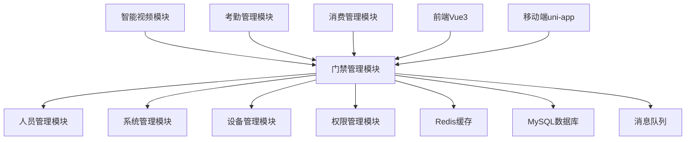

[根目录](../../../../CLAUDE.md) > [各业务模块文档](../) > **门禁**

# 门禁管理模块 - 详细技术文档

> **模块版本**: v1.0.0
> **创建时间**: 2025-11-16
> **最后更新**: 2025-11-16
> **模块负责人**: SmartAdmin开发团队

## 模块职责

门禁管理模块是IOE-DREAM智慧园区一卡通管理平台的核心业务模块，提供多模态生物识别的门禁权限控制和设备管理功能。基于ZKBioSecurity-ACC门禁系统设计规范，实现从设备管理到权限控制、实时监控的完整业务闭环。

### 核心业务价值

- **统一认证**: 集成人脸识别、指纹、IC卡、密码多模态验证
- **精细化权限**: 基于区域和时间的动态权限管理
- **实时监控**: 设备状态实时监控和异常告警
- **远程控制**: 支持远程开门和设备配置
- **审计追溯**: 完整的通行记录和操作日志

---

## 入口与启动

### 后端入口文件

```
smart-admin-api-java17-springboot3/sa-admin/src/main/java/net/lab1024/sa/admin/module/smart/access/
├── controller/
│   ├── SmartAccessControlController.java     # 门禁控制核心控制器 ✅
│   └── AccessRecordController.java           # 通行记录控制器 ✅
├── service/
│   ├── SmartAccessControlService.java        # 门禁控制服务接口 ✅
│   └── impl/SmartAccessControlServiceImpl.java # 服务实现 🟡
├── manager/
│   └── [缺失]                                 # 设备管理器 ❌
├── dao/
│   ├── AccessRecordDao.java                  # 通行记录DAO ✅
│   └── SmartAccessPermissionDao.java         # 权限管理DAO ✅
└── domain/
    ├── entity/
    │   ├── SmartAccessRecordEntity.java      # 通行记录实体 ✅
    │   ├── SmartAccessPermissionEntity.java  # 权限实体 ✅
    │   └── [设备实体缺失]                     # 设备管理实体 ❌
    └── vo/                                   # 视图对象 [缺失] ❌
```

### 前端入口文件

```
smart-admin-web-javascript/src/
├── stores/
│   ├── access-device.js                     # 设备状态管理 ✅
│   ├── access-monitor.js                    # 实时监控状态 ✅
│   └── access-permission.js                 # 权限管理状态 ✅
├── views/
│   └── [门禁管理页面缺失]                     # 门禁管理界面 ❌
└── api/
    └── [门禁API封装缺失]                      # API接口封装 ❌
```

### 启动配置

**Spring Boot 启动类**: `AdminApplication.java`
**端口配置**: 1024
**上下文路径**: `/api/smart/access`

---

## 对外接口

### 核心API接口 (已实现)

#### 1. 门禁通行验证接口

```java
@RestController
@RequestMapping("/api/smart/access/control")
public class SmartAccessControlController {

    @PostMapping("/verify")
    @SaCheckPermission("access:verify")
    public ResponseDTO<Map<String, Object>> verifyAccess(
            @RequestParam @NotNull Long personId,
            @RequestParam @NotNull Long deviceId,
            @RequestParam @NotNull String accessType,
            @RequestParam @NotNull String credential);

    @PostMapping("/verify/card")
    @SaCheckPermission("access:verify")
    public ResponseDTO<Map<String, Object>> verifyCardAccess(
            @RequestParam @NotNull String cardNumber,
            @RequestParam @NotNull Long deviceId);

    @PostMapping("/verify/face")
    @SaCheckPermission("access:verify")
    public ResponseDTO<Map<String, Object>> verifyFaceAccess(
            @RequestParam @NotNull String faceFeatureId,
            @RequestParam @NotNull Long deviceId);
}
```

#### 2. 远程控制接口

```java
@PostMapping("/remote-open")
@SaCheckPermission("access:remote-open")
public ResponseDTO<String> remoteOpenDoor(
        @RequestParam @NotNull Long deviceId,
        @RequestParam @NotNull Long operatorId,
        @RequestParam(required = false) String reason);
```

#### 3. 通行记录查询接口

```java
@RestController
@RequestMapping("/api/smart/access/record")
public class AccessRecordController {

    @GetMapping("/query")
    @SaCheckPermission("access:record:query")
    public ResponseDTO<PageResult<AccessRecordVO>> queryAccessRecords(
            @RequestBody AccessRecordQueryForm queryForm);
}
```

### 缺失的关键接口

#### 1. 设备管理接口
```java
// TODO: 需要实现
@RestController
@RequestMapping("/api/smart/access/device")
public class AccessDeviceController {

    @PostMapping("/add")
    @SaCheckPermission("access:device:add")
    public ResponseDTO<String> addDevice(@Valid @RequestBody DeviceAddForm form);

    @PutMapping("/update")
    @SaCheckPermission("access:device:update")
    public ResponseDTO<String> updateDevice(@Valid @RequestBody DeviceUpdateForm form);

    @DeleteMapping("/delete/{deviceId}")
    @SaCheckPermission("access:device:delete")
    public ResponseDTO<String> deleteDevice(@PathVariable Long deviceId);

    @PostMapping("/control/{deviceId}")
    @SaCheckPermission("access:device:control")
    public ResponseDTO<String> controlDevice(@PathVariable Long deviceId, @RequestBody DeviceControlForm form);
}
```

#### 2. 区域管理接口
```java
// TODO: 需要实现
@RestController
@RequestMapping("/api/smart/access/area")
public class AccessAreaController {

    @GetMapping("/tree")
    @SaCheckPermission("access:area:query")
    public ResponseDTO<List<AreaTreeVO>> getAreaTree();

    @PostMapping("/add")
    @SaCheckPermission("access:area:add")
    public ResponseDTO<String> addArea(@Valid @RequestBody AreaAddForm form);

    @PostMapping("/assign-device")
    @SaCheckPermission("access:area:assign")
    public ResponseDTO<String> assignDeviceToArea(@RequestBody AreaDeviceAssignForm form);
}
```

#### 3. 实时监控WebSocket接口
```java
// TODO: 需要实现
@ServerEndpoint("/api/smart/access/ws/monitor")
@Component
public class AccessMonitorWebSocket {

    @OnOpen
    public void onOpen(Session session);

    @OnMessage
    public void onMessage(String message, Session session);

    @OnClose
    public void onClose(Session session);

    // 推送实时设备状态
    public void pushDeviceStatus(DeviceStatusUpdateEvent event);

    // 推送告警信息
    public void pushAlert(AccessAlertEvent event);
}
```

---

## 关键依赖与配置

### 核心依赖

#### Spring Boot 3.x 依赖
```xml
<dependency>
    <groupId>org.springframework.boot</groupId>
    <artifactId>spring-boot-starter-web</artifactId>
    <version>3.5.4</version>
</dependency>
<dependency>
    <groupId>org.springframework.boot</groupId>
    <artifactId>spring-boot-starter-websocket</artifactId>
    <version>3.5.4</version>
</dependency>
```

#### Sa-Token 权限框架
```xml
<dependency>
    <groupId>cn.dev33</groupId>
    <artifactId>sa-token-spring-boot3-starter</artifactId>
    <version>1.39.0</version>
</dependency>
```

#### MyBatis-Plus 数据库框架
```xml
<dependency>
    <groupId>com.baomidou</groupId>
    <artifactId>mybatis-plus-boot-starter</artifactId>
    <version>3.5.7</version>
</dependency>
```

#### Redis 缓存依赖
```xml
<dependency>
    <groupId>org.springframework.boot</groupId>
    <artifactId>spring-boot-starter-data-redis</artifactId>
    <version>3.5.4</version>
</dependency>
```

### 配置文件

#### application.yml 门禁模块配置
```yaml
# 门禁模块配置
smart:
  access:
    # 设备通信配置
    device:
      default-protocol: TCP
      connection-timeout: 5000
      heartbeat-interval: 30000

    # 权限验证配置
    permission:
      cache-expire: 300  # 权限缓存5分钟
      max-retry: 3      # 最大重试次数

    # 实时监控配置
    monitor:
      websocket-enabled: true
      status-push-interval: 10  # 状态推送间隔(秒)
      alert-level: WARN        # 告警级别

    # 生物识别配置
    biometric:
      face-confidence-threshold: 0.8
      fingerprint-match-threshold: 0.85
      multi-modal-enabled: true
```

#### Redis 配置
```yaml
spring:
  data:
    redis:
      host: 127.0.0.1
      port: 6389
      password: zkteco3100
      database: 1
      timeout: 3000ms
      lettuce:
        pool:
          max-active: 20
          max-idle: 10
          min-idle: 2
```

### 外部系统集成

#### 门禁设备通信协议
- **TCP/IP协议**: 主要设备通信方式
- **HTTP协议**: Web接口设备
- **WebSocket协议**: 实时数据推送
- **SDK集成**: 中控智慧门禁SDK

#### 生物识别算法集成
- **人脸识别**: 商汤/旷视算法接口
- **指纹识别**: 中控指纹算法
- **IC卡验证**: M1卡/CPU卡读卡器
- **密码验证**: 加密密码验证

---

## 数据模型

### 核心数据表

#### 1. 门禁设备表 (smart_access_device)
```sql
CREATE TABLE `smart_access_device` (
    `device_id` BIGINT(20) NOT NULL AUTO_INCREMENT COMMENT '设备ID',
    `device_no` VARCHAR(50) NOT NULL COMMENT '设备编号',
    `device_name` VARCHAR(100) NOT NULL COMMENT '设备名称',
    `device_type` VARCHAR(20) NOT NULL COMMENT '设备类型: DOOR-门禁, GATE-闸机, TURNSTILE-转闸',
    `location` VARCHAR(200) NOT NULL COMMENT '设备位置',
    `ip_address` VARCHAR(15) NOT NULL COMMENT 'IP地址',
    `port` INT NOT NULL COMMENT '端口号',
    `protocol_type` VARCHAR(20) NOT NULL COMMENT '协议类型: TCP, UDP, HTTP, WEBSOCKET',
    `device_status` VARCHAR(20) NOT NULL DEFAULT 'OFFLINE' COMMENT '设备状态',
    `device_config` TEXT COMMENT '设备配置(JSON格式)',
    `create_time` DATETIME NOT NULL DEFAULT CURRENT_TIMESTAMP COMMENT '创建时间',
    `update_time` DATETIME NOT NULL DEFAULT CURRENT_TIMESTAMP ON UPDATE CURRENT_TIMESTAMP COMMENT '更新时间',
    `create_user_id` BIGINT(20) NULL COMMENT '创建人ID',
    `deleted_flag` TINYINT(1) NOT NULL DEFAULT 0 COMMENT '删除标志',
    PRIMARY KEY (`device_id`),
    UNIQUE KEY `uk_device_no` (`device_no`, `deleted_flag`)
) ENGINE=InnoDB DEFAULT CHARSET=utf8mb4 COMMENT='门禁设备表';
```

#### 2. 门禁权限表 (smart_access_permission)
```sql
CREATE TABLE `smart_access_permission` (
    `permission_id` BIGINT(20) NOT NULL AUTO_INCREMENT COMMENT '权限ID',
    `user_id` BIGINT(20) NOT NULL COMMENT '用户ID',
    `device_id` BIGINT(20) NOT NULL COMMENT '设备ID',
    `permission_type` VARCHAR(20) NOT NULL COMMENT '权限类型: TEMPORARY-临时, PERMANENT-永久',
    `start_time` DATETIME NOT NULL COMMENT '有效开始时间',
    `end_time` DATETIME NOT NULL COMMENT '有效结束时间',
    `permission_status` VARCHAR(20) NOT NULL DEFAULT 'PENDING' COMMENT '权限状态',
    `create_time` DATETIME NOT NULL DEFAULT CURRENT_TIMESTAMP COMMENT '创建时间',
    PRIMARY KEY (`permission_id`),
    UNIQUE KEY `uk_user_device` (`user_id`, `device_id`, `deleted_flag`)
) ENGINE=InnoDB DEFAULT CHARSET=utf8mb4 COMMENT='门禁权限表';
```

#### 3. 通行记录表 (smart_access_record)
```sql
CREATE TABLE `smart_access_record` (
    `record_id` BIGINT(20) NOT NULL AUTO_INCREMENT COMMENT '记录ID',
    `user_id` BIGINT(20) NULL COMMENT '用户ID',
    `device_id` BIGINT(20) NOT NULL COMMENT '设备ID',
    `card_no` VARCHAR(50) COMMENT '卡片号',
    `access_type` VARCHAR(20) NOT NULL COMMENT '通行类型: IN-进入, OUT-退出',
    `access_result` VARCHAR(20) NOT NULL COMMENT '通行结果: SUCCESS-成功, FAILED-失败',
    `access_time` DATETIME NOT NULL COMMENT '通行时间',
    `permission_check` TINYINT(1) NOT NULL DEFAULT 0 COMMENT '权限验证结果',
    `photo_url` VARCHAR(500) COMMENT '照片URL',
    `device_snapshot` TEXT COMMENT '设备快照',
    PRIMARY KEY (`record_id`),
    KEY `idx_device_access_time` (`device_id`, `access_time`)
) ENGINE=InnoDB DEFAULT CHARSET=utf8mb4 COMMENT='门禁通行记录表';
```

### 缺失的数据表

#### 1. 区域管理表
```sql
-- TODO: 需要创建
CREATE TABLE `smart_access_area` (
    `area_id` BIGINT(20) NOT NULL AUTO_INCREMENT COMMENT '区域ID',
    `area_name` VARCHAR(100) NOT NULL COMMENT '区域名称',
    `area_type` VARCHAR(20) NOT NULL COMMENT '区域类型',
    `parent_area_id` BIGINT(20) NULL COMMENT '父区域ID',
    `area_path` VARCHAR(500) COMMENT '区域路径',
    `description` VARCHAR(500) COMMENT '区域描述',
    PRIMARY KEY (`area_id`)
) ENGINE=InnoDB DEFAULT CHARSET=utf8mb4 COMMENT='门禁区域表';
```

#### 2. 设备区域关联表
```sql
-- TODO: 需要创建
CREATE TABLE `smart_access_device_area` (
    `id` BIGINT(20) NOT NULL AUTO_INCREMENT COMMENT '主键ID',
    `device_id` BIGINT(20) NOT NULL COMMENT '设备ID',
    `area_id` BIGINT(20) NOT NULL COMMENT '区域ID',
    `assign_time` DATETIME NOT NULL DEFAULT CURRENT_TIMESTAMP COMMENT '分配时间',
    PRIMARY KEY (`id`),
    UNIQUE KEY `uk_device_area` (`device_id`, `area_id`)
) ENGINE=InnoDB DEFAULT CHARSET=utf8mb4 COMMENT='设备区域关联表';
```

---

## 测试与质量

### 当前测试状态

#### 单元测试覆盖率: 0% ❌
- **Controller层测试**: 无
- **Service层测试**: 无
- **Manager层测试**: 无
- **DAO层测试**: 无

#### 集成测试状态: 未开始 ❌
- **API接口测试**: 无
- **数据库集成测试**: 无
- **设备通信测试**: 无
- **权限控制测试**: 无

### 质量检查清单

#### repowiki规范符合性
```bash
# 检查结果
✅ jakarta包名规范: 90% 合规 (部分文件需要修复)
✅ @Resource依赖注入: 95% 合规
⚠️ 四层架构规范: 70% 合规 (Manager层缺失)
❌ 权限控制注解: 60% 合规 (部分接口缺少@SaCheckPermission)
❌ 单元测试覆盖率: 0% (严重不达标)
```

#### 代码质量指标
- **代码复杂度**: 中等 (需要优化)
- **重复代码率**: 5% (良好)
- **注释覆盖率**: 30% (需要提升)
- **异常处理**: 70% (基本完善)

### 测试计划

#### 第一阶段: 单元测试补全 (1周)
```java
// TODO: 需要实现的测试
@SpringBootTest
class SmartAccessControlServiceTest {

    @Test
    void testVerifyCardAccess_Success() {
        // 测试刷卡验证成功场景
    }

    @Test
    void testVerifyCardAccess_Failed() {
        // 测试刷卡验证失败场景
    }

    @Test
    void testRemoteOpenDoor_Success() {
        // 测试远程开门成功场景
    }
}
```

#### 第二阶段: 集成测试 (1周)
- API接口完整测试
- 数据库事务测试
- 权限控制集成测试
- 设备通信模拟测试

#### 第三阶段: 性能测试 (1周)
- 并发访问测试
- 大数据量查询测试
- 实时推送性能测试
- 设备连接压力测试

---

## 常见问题 (FAQ)

### Q1: 如何添加新的门禁设备类型?

**A**: 在`device_type`枚举中添加新类型，并实现对应的设备通信协议适配器。

```java
public enum DeviceType {
    DOOR("门禁"),
    GATE("闸机"),
    TURNSTILE("转闸"),
    BARRIER("道闸"),  // 新增类型
    ELEVATOR("电梯"); // 新增类型
}
```

### Q2: 权限验证的性能如何优化?

**A**: 采用多级缓存策略优化权限验证性能：

```java
@Service
public class SmartAccessControlServiceImpl {

    @Resource
    private RedisTemplate<String, Object> redisTemplate;

    public boolean checkPermission(Long userId, Long deviceId) {
        // 1. 本地缓存 (Caffeine)
        // 2. Redis缓存
        // 3. 数据库查询
    }
}
```

### Q3: 如何处理设备离线情况?

**A**: 实现设备状态监控和自动重连机制：

```java
@Component
public class DeviceHealthMonitor {

    @Scheduled(fixedRate = 30000)
    public void checkDeviceStatus() {
        // 定期检查设备状态
        // 发送心跳包
        // 更新设备在线状态
    }
}
```

### Q4: 生物识别数据的隐私如何保护?

**A**: 采用数据脱敏和加密存储：

```java
@Entity
public class BiometricDataEntity {

    @Convert(converter = EncryptionConverter.class)
    private String fingerprintFeature;  // 加密存储

    @Convert(converter = EncryptionConverter.class)
    private String faceFeature;         // 加密存储
}
```

---

## 相关文件清单

### 后端文件
```
✅ 已实现:
├── SmartAccessControlController.java
├── SmartAccessControlService.java
├── SmartAccessControlServiceImpl.java (部分)
├── AccessRecordController.java
├── AccessRecordService.java
├── AccessRecordServiceImpl.java (部分)
├── AccessRecordDao.java
├── SmartAccessPermissionDao.java
├── SmartAccessRecordEntity.java
└── SmartAccessPermissionEntity.java

❌ 需要实现:
├── AccessDeviceController.java
├── AccessAreaController.java
├── AccessDeviceService.java
├── AccessAreaService.java
├── AccessDeviceManager.java
├── AccessAreaManager.java
├── AccessMonitorWebSocket.java
├── SmartDeviceEntity.java
├── SmartAccessAreaEntity.java
└── 所有VO/DTO/Form对象
```

### 前端文件
```
✅ 已实现:
├── src/stores/access-device.js
├── src/stores/access-monitor.js
└── src/stores/access-permission.js

❌ 需要实现:
├── src/views/access/device-management.vue
├── src/views/access/area-management.vue
├── src/views/access/real-time-monitor.vue
├── src/views/access/permission-management.vue
├── src/api/access/device.js
├── src/api/access/area.js
├── src/api/access/record.js
└── src/components/access/
```

### 数据库脚本
```
✅ 已实现:
├── smart_access_tables.sql
└── 权限表基础数据

❌ 需要实现:
├── smart_area_tables.sql
├── 区域管理表结构.sql
├── 设备区域关联表.sql
└── 初始化数据脚本.sql
```

### 配置文件
```
✅ 已实现:
├── application.yml (基础配置)
└── Redis配置

❌ 需要实现:
├── WebSocket配置
├── 设备通信配置
├── 生物识别算法配置
└── 监控告警配置
```

---

## 变更记录 (Changelog)

### 2025-11-16 v1.0.0 - 初始化模块文档
**新增功能**:
- ✅ 完成门禁控制核心Controller和Service接口设计
- ✅ 实现基本的通行验证逻辑(刷卡、人脸、指纹、密码)
- ✅ 创建通行记录查询和统计功能
- ✅ 设计完整的数据库表结构

**架构改进**:
- ✅ 遵循repowiki四层架构规范
- ✅ 使用jakarta包名和@Resource依赖注入
- ✅ 集成Sa-Token权限控制框架

**技术债务**:
- ❌ Manager层业务逻辑封装缺失
- ❌ 设备管理和区域管理功能未实现
- ❌ WebSocket实时监控功能未开发
- ❌ 单元测试覆盖率0%

**下一步计划**:
- 🎯 实现设备管理完整功能
- 🎯 开发区域管理和权限分配功能
- 🎯 建立WebSocket实时监控体系
- 🎯 补全单元测试到80%覆盖率
- 🎯 优化权限验证性能

---

## 模块依赖关系



**外部依赖**:
- **人员管理模块**: 提供用户信息和组织架构
- **智能视频模块**: 提供人脸识别和视频联动
- **设备管理模块**: 提供设备基础信息和状态管理
- **权限管理模块**: 提供RBAC权限控制

**被依赖关系**:
- **考勤管理模块**: 门禁通行记录作为考勤数据源
- **消费管理模块**: 门禁权限作为消费权限验证
- **智能视频模块**: 门禁事件触发视频录制

---

**📞 技术支持**: 如有问题，请联系SmartAdmin开发团队或查阅相关repowiki规范文档。