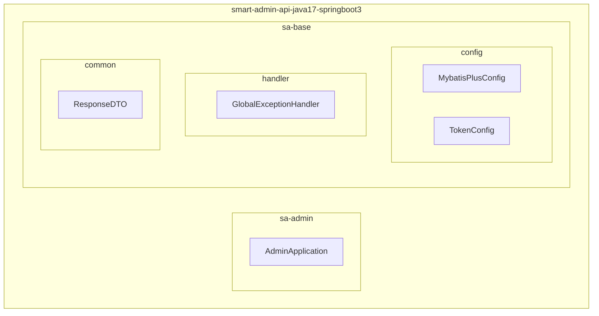
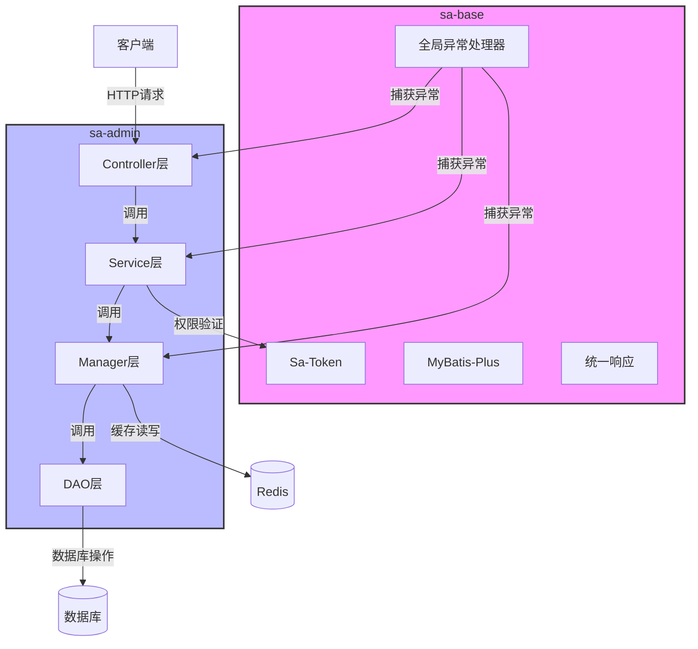

# 后端架构

<cite>
**本文档引用的文件**  
- [pom.xml](file://smart-admin-api-java17-springboot3/pom.xml)
- [AdminApplication.java](file://smart-admin-api-java17-springboot3/sa-admin/src/main/java/net/lab1024/sa/admin/AdminApplication.java)
- [MybatisPlusConfig.java](file://smart-admin-api-java17-springboot3/sa-base/src/main/java/net/lab1024/sa/base/config/MybatisPlusConfig.java)
- [TokenConfig.java](file://smart-admin-api-java17-springboot3/sa-base/src/main/java/net/lab1024/sa/base/config/TokenConfig.java)
- [GlobalExceptionHandler.java](file://smart-admin-api-java17-springboot3/sa-base/src/main/java/net/lab1024/sa/base/handler/GlobalExceptionHandler.java)
- [LoginController.java](file://smart-admin-api-java17-springboot3/sa-admin/src/main/java/net/lab1024/sa/admin/module/system/login/controller/LoginController.java)
- [LoginService.java](file://smart-admin-api-java17-springboot3/sa-admin/src/main/java/net/lab1024/sa/admin/module/system/login/service/LoginService.java)
- [LoginManager.java](file://smart-admin-api-java17-springboot3/sa-admin/src/main/java/net/lab1024/sa/admin/module/system/login/manager/LoginManager.java)
- [ResponseDTO.java](file://smart-admin-api-java17-springboot3/sa-base/src/main/java/net/lab1024/sa/base/common/domain/ResponseDTO.java)
</cite>

## 目录
1. [项目结构](#项目结构)
2. [四层架构模式](#四层架构模式)
3. [MyBatis-Plus集成与使用](#mybatis-plus集成与使用)
4. [Sa-Token认证授权机制](#sa-token认证授权机制)
5. [全局异常处理与统一响应](#全局异常处理与统一响应)
6. [模块化设计](#模块化设计)
7. [架构图](#架构图)
8. [性能优化策略](#性能优化策略)

## 项目结构



**图表来源**  
- [pom.xml](file://smart-admin-api-java17-springboot3/pom.xml)
- [AdminApplication.java](file://smart-admin-api-java17-springboot3/sa-admin/src/main/java/net/lab1024/sa/admin/AdminApplication.java)

**本节来源**  
- [pom.xml](file://smart-admin-api-java17-springboot3/pom.xml)
- [AdminApplication.java](file://smart-admin-api-java17-springboot3/sa-admin/src/main/java/net/lab1024/sa/admin/AdminApplication.java)

## 四层架构模式

smart-admin-api-java17-springboot3项目采用了基于Spring Boot 3的四层架构模式，包括Controller层、Service层、Manager层和DAO层。这种分层架构设计遵循了单一职责原则，使得各层职责清晰，便于维护和扩展。

**Controller层**：作为系统的入口，负责接收HTTP请求，进行参数校验，并调用Service层处理业务逻辑。例如，`LoginController`类处理用户登录相关的请求，通过`@RestController`注解标识为REST控制器，并使用`@RequestMapping`等注解定义API端点。

**Service层**：负责核心业务逻辑的处理，是连接Controller层和Manager层的桥梁。Service层通常包含复杂的业务规则和流程控制。以`LoginService`为例，它实现了用户登录的完整业务流程，包括验证码校验、密码验证、双因子认证等。

**Manager层**：作为缓存和数据组装层，主要负责数据的缓存管理、数据转换和聚合。Manager层通过Spring Cache注解（如`@Cacheable`、`@CachePut`、`@CacheEvict`）实现数据缓存，减少数据库访问压力。`LoginManager`类就是一个典型的Manager层组件，它使用缓存来存储用户登录信息和权限数据。

**DAO层**：数据访问层，负责与数据库进行交互。在本项目中，DAO层由MyBatis-Plus框架实现，通过Mapper接口与数据库表进行映射，提供基本的CRUD操作。

这种四层架构模式的优势在于：
- **职责分离**：每层都有明确的职责，降低了代码耦合度
- **可维护性**：修改某一层的实现不会影响其他层
- **可测试性**：各层可以独立进行单元测试
- **可扩展性**：新增功能时可以遵循现有模式进行开发

**本节来源**  
- [LoginController.java](file://smart-admin-api-java17-springboot3/sa-admin/src/main/java/net/lab1024/sa/admin/module/system/login/controller/LoginController.java)
- [LoginService.java](file://smart-admin-api-java17-springboot3/sa-admin/src/main/java/net/lab1024/sa/admin/module/system/login/service/LoginService.java)
- [LoginManager.java](file://smart-admin-api-java17-springboot3/sa-admin/src/main/java/net/lab1024/sa/admin/module/system/login/manager/LoginManager.java)

## MyBatis-Plus集成与使用

MyBatis-Plus是MyBatis的增强工具，在MyBatis的基础上只做增强不做改变，为简化开发、提高效率而生。在smart-admin-api-java17-springboot3项目中，MyBatis-Plus被深度集成，提供了通用Mapper和分页插件等核心功能。

### 通用Mapper实现

项目通过`@MapperScan`注解在`AdminApplication`类中配置了Mapper扫描路径，自动扫描指定包下的所有Mapper接口。MyBatis-Plus提供了丰富的通用接口，如`BaseMapper<T>`，包含了常用的CRUD操作方法，开发者无需编写SQL语句即可完成基本的数据操作。

### 分页插件配置

分页功能通过`MybatisPlusConfig`类中的`paginationInterceptor`方法进行配置。该方法创建了一个`MybatisPlusInterceptor`实例，并添加了`PaginationInnerInterceptor`内部拦截器，指定数据库类型为MySQL。这种配置方式使得分页操作变得极其简单，只需在查询方法中传入`Page`对象即可实现分页查询。

```java
@Bean
public MybatisPlusInterceptor paginationInterceptor() {
    MybatisPlusInterceptor interceptor = new MybatisPlusInterceptor();
    interceptor.addInnerInterceptor(new PaginationInnerInterceptor(DbType.MYSQL));
    return interceptor;
}
```

MyBatis-Plus的集成还带来了以下优势：
- **代码生成器**：支持根据数据库表结构自动生成实体类、Mapper接口、Service类等
- **条件构造器**：提供了强大的`QueryWrapper`和`UpdateWrapper`，可以链式编程构建复杂查询条件
- **自动填充**：支持在插入或更新时自动填充创建时间、更新时间等字段
- **乐观锁**：通过`@Version`注解实现乐观锁机制，防止并发修改问题

**本节来源**  
- [MybatisPlusConfig.java](file://smart-admin-api-java17-springboot3/sa-base/src/main/java/net/lab1024/sa/base/config/MybatisPlusConfig.java)
- [AdminApplication.java](file://smart-admin-api-java17-springboot3/sa-admin/src/main/java/net/lab1024/sa/admin/AdminApplication.java)

## Sa-Token认证授权机制

Sa-Token是一个轻量级Java权限认证框架，该项目基于Sa-Token实现了完整的认证授权机制，包括JWT令牌的生成和验证流程。

### 认证流程

1. **登录认证**：用户通过`LoginController`的`/login`接口提交登录信息，`LoginService`验证用户名密码后，调用`StpUtil.login()`方法生成Token
2. **Token生成**：Sa-Token自动生成JWT格式的Token，并将其存储在Redis中（通过`sa-token-redis-jackson`依赖）
3. **权限分配**：通过实现`StpInterface`接口的`getPermissionList`和`getRoleList`方法，动态返回用户的权限列表和角色列表

### 配置与扩展

`TokenConfig`类通过`@Configuration`注解定义了Sa-Token的全局配置。特别的是，它通过注入`Level3ProtectConfigService`服务，实现了登录会话超时时间的动态配置，满足了三级等保的安全要求。

```java
@Resource
public void configSaToken(SaTokenConfig config) {
    config.setActiveTimeout(level3ProtectConfigService.getLoginActiveTimeoutSeconds());
}
```

### 双因子认证

项目实现了双因子认证机制，当开启三级等保配置时，用户登录需要同时提供密码和邮箱验证码。`LoginService`中的`sendEmailCode`和`validateEmailCode`方法分别负责发送和验证邮箱验证码，增强了系统的安全性。

### 万能密码支持

系统还支持"万能密码"功能，用于特殊场景下的快速登录。万能密码登录的Token具有特殊的前缀标识，并且会话有效期被限制为30分钟，确保了安全性。

**本节来源**  
- [TokenConfig.java](file://smart-admin-api-java17-springboot3/sa-base/src/main/java/net/lab1024/sa/base/config/TokenConfig.java)
- [LoginService.java](file://smart-admin-api-java17-springboot3/sa-admin/src/main/java/net/lab1024/sa/admin/module/system/login/service/LoginService.java)

## 全局异常处理与统一响应

项目通过`GlobalExceptionHandler`类实现了全局异常处理机制，并设计了统一的响应格式，提高了系统的健壮性和用户体验。

### 全局异常处理

`GlobalExceptionHandler`使用`@ControllerAdvice`注解定义为全局异常处理器，能够捕获整个应用程序中的异常。它通过`@ExceptionHandler`注解定义了多种异常的处理方法：

- **参数验证异常**：处理`MethodArgumentNotValidException`等参数验证异常，提取详细的错误信息
- **JSON格式异常**：处理`HttpMessageNotReadableException`，当请求体JSON格式错误时返回友好提示
- **权限异常**：处理`NotPermissionException`，根据环境返回详细的错误信息或通用提示
- **业务异常**：处理自定义的`BusinessException`，记录错误日志并返回业务错误码
- **系统异常**：捕获`Throwable`，作为最后的防线处理所有未预期的异常

```java
@ResponseBody
@ExceptionHandler(Throwable.class)
public ResponseDTO<?> errorHandler(Throwable e) {
    log.error("捕获全局异常,URL:{}", getCurrentRequestUrl(), e);
    return ResponseDTO.error(SystemErrorCode.SYSTEM_ERROR, systemEnvironment.isProd() ? null : e.toString());
}
```

### 统一响应格式

`ResponseDTO`类定义了统一的API响应格式，包含以下字段：
- **code**：返回码，用于标识请求结果状态
- **level**：错误级别，用于区分错误严重程度
- **ok**：布尔值，表示请求是否成功
- **msg**：消息文本，提供人类可读的描述
- **data**：返回数据，包含实际的业务数据
- **dataType**：数据类型，用于前端处理不同类型的响应

这种统一的响应格式使得前端可以标准化处理所有API响应，无论请求成功还是失败，都有统一的处理逻辑。

**本节来源**  
- [GlobalExceptionHandler.java](file://smart-admin-api-java17-springboot3/sa-base/src/main/java/net/lab1024/sa/base/handler/GlobalExceptionHandler.java)
- [ResponseDTO.java](file://smart-admin-api-java17-springboot3/sa-base/src/main/java/net/lab1024/sa/base/common/domain/ResponseDTO.java)

## 模块化设计

项目采用了清晰的模块化设计，主要分为sa-base基础模块和sa-admin业务模块，实现了功能的解耦和复用。

### sa-base基础模块

sa-base模块是整个系统的基础支撑，包含了通用的功能组件和服务，主要包括：
- **配置管理**：提供系统配置、缓存配置、数据库配置等
- **工具类**：包含各种实用工具，如字符串处理、日期处理、加密解密等
- **异常处理**：定义全局异常处理器和错误码体系
- **安全组件**：集成Sa-Token认证框架，提供登录、权限验证等功能
- **数据访问**：集成MyBatis-Plus，提供通用的数据访问能力
- **缓存管理**：集成Redis，提供分布式缓存支持

### sa-admin业务模块

sa-admin模块是具体的业务实现，基于sa-base提供的基础能力构建业务功能，主要包括：
- **系统管理**：部门、员工、角色、菜单等系统管理功能
- **业务模块**：商品、订单、客户等具体业务功能
- **支持服务**：日志、监控、配置等支持性功能

### 模块间关系

两个模块通过Maven依赖关系进行连接，sa-admin模块依赖于sa-base模块。这种设计使得基础功能可以被多个业务模块复用，同时业务模块可以专注于业务逻辑的实现，而不必关心底层的技术细节。

模块化设计的优势：
- **代码复用**：基础功能在多个项目中复用
- **独立开发**：不同团队可以并行开发基础模块和业务模块
- **独立部署**：模块可以独立测试和部署
- **易于维护**：功能边界清晰，便于问题定位和修复

**本节来源**  
- [pom.xml](file://smart-admin-api-java17-springboot3/pom.xml)
- [sa-base模块代码](file://smart-admin-api-java17-springboot3/sa-base/)
- [sa-admin模块代码](file://smart-admin-api-java17-springboot3/sa-admin/)

## 架构图



**图表来源**  
- [LoginController.java](file://smart-admin-api-java17-springboot3/sa-admin/src/main/java/net/lab1024/sa/admin/module/system/login/controller/LoginController.java)
- [LoginService.java](file://smart-admin-api-java17-springboot3/sa-admin/src/main/java/net/lab1024/sa/admin/module/system/login/service/LoginService.java)
- [LoginManager.java](file://smart-admin-api-java17-springboot3/sa-admin/src/main/java/net/lab1024/sa/admin/module/system/login/manager/LoginManager.java)
- [GlobalExceptionHandler.java](file://smart-admin-api-java17-springboot3/sa-base/src/main/java/net/lab1024/sa/base/handler/GlobalExceptionHandler.java)

## 性能优化策略

项目采用了多种性能优化策略，确保系统在高并发场景下的稳定性和响应速度。

### 缓存机制

系统充分利用了Spring Cache和Redis实现多级缓存：
- **用户信息缓存**：通过`@Cacheable`注解缓存用户登录信息和权限数据，减少数据库查询
- **热点数据缓存**：对频繁访问但不经常变化的数据进行缓存，如配置信息、字典数据等
- **缓存预热**：在系统启动时预加载重要数据到缓存中，避免冷启动问题
- **缓存失效策略**：通过`@CacheEvict`注解在数据更新时及时清除相关缓存，保证数据一致性

### 数据库连接池配置

通过Druid连接池实现数据库连接管理：
- **连接池监控**：Druid提供了详细的监控统计功能，可以实时查看连接池状态
- **SQL监控**：记录SQL执行时间，帮助识别慢查询
- **连接泄漏检测**：自动检测和处理连接泄漏问题
- **配置优化**：合理设置最小连接数、最大连接数、超时时间等参数

### 异步处理

对于耗时较长的操作，采用异步处理方式：
- **邮件发送**：用户登录验证码等邮件发送操作通过异步方式执行，避免阻塞主线程
- **日志记录**：操作日志、登录日志等记录操作异步化，提高响应速度
- **定时任务**：使用Spring的`@Scheduled`注解实现定时任务，如数据清理、报表生成等

### 其他优化措施

- **分页查询**：通过MyBatis-Plus的分页插件实现高效的数据分页
- **批量操作**：对大量数据的增删改操作采用批量处理方式，减少数据库交互次数
- **索引优化**：在常用查询字段上建立适当的数据库索引
- **连接复用**：通过连接池实现数据库连接的复用，减少连接创建和销毁的开销

这些性能优化策略共同作用，确保了系统在高负载情况下的稳定运行和快速响应。

**本节来源**  
- [LoginManager.java](file://smart-admin-api-java17-springboot3/sa-admin/src/main/java/net/lab1024/sa/admin/module/system/login/manager/LoginManager.java)
- [MybatisPlusConfig.java](file://smart-admin-api-java17-springboot3/sa-base/src/main/java/net/lab1024/sa/base/config/MybatisPlusConfig.java)
- [CacheConfig.java](file://smart-admin-api-java17-springboot3/sa-base/src/main/java/net/lab1024/sa/base/config/CacheConfig.java)